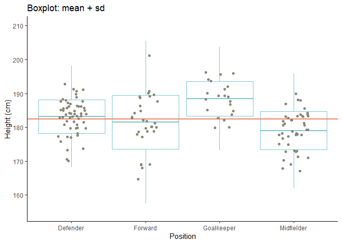
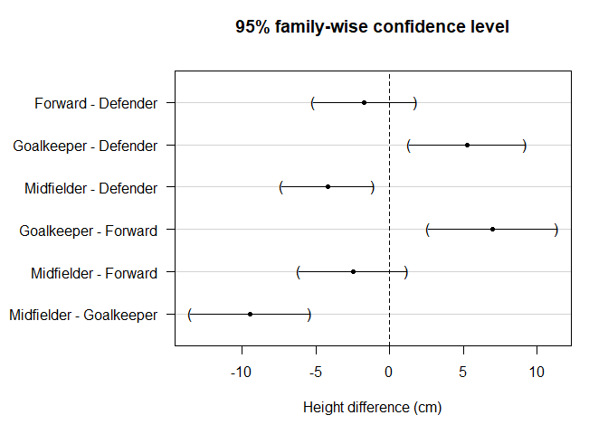
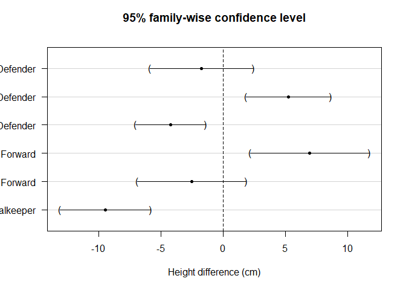
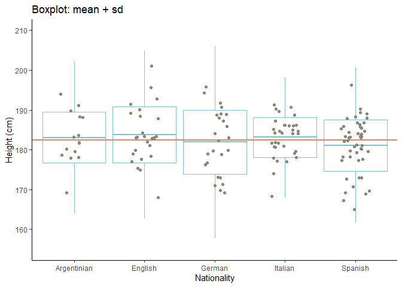
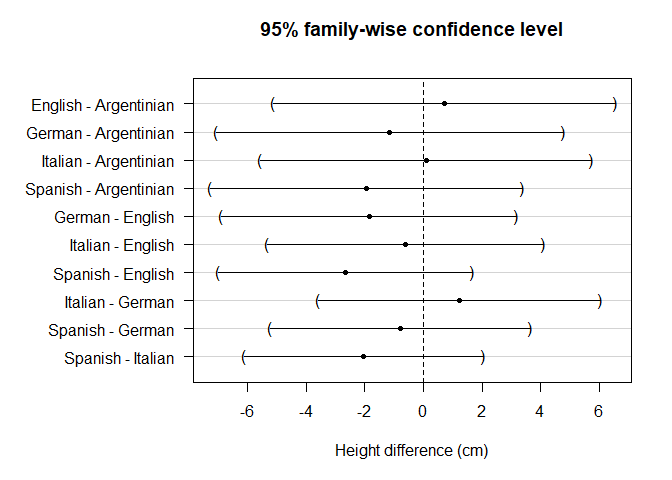

Загрузка данных


```r
soccer_general <- read.csv("soccer.csv", sep=";")[, 2:6] %>% 
    mutate(Position = as.factor(Position), 
    Nationality = as.factor(Nationality), 
    Age = as.numeric(Age), 
    Height = as.numeric(Height)
) %>% 
filter(Nationality %in% c("Spanish", "Italian", "German", "English", "Argentinian")) 

set.seed(1) 

soccer_wrk <- soccer_general[sample(1:nrow(soccer_general), 150), ] %>% 
    mutate(Nationality = factor(Nationality))
```


#Рост и позиция футболиста


##Дисперсионный анализ (ANOVA)


Посмотрим на данные


```r
ggplot(aes(y = Height, x = Position), data = soccer_wrk) +
  ylim(155, 210) + 
  ggtitle("Boxplot: mean + sd") + 
  xlab("Position") + 
  ylab("Height (cm)") +
  theme_classic() +
  stat_summary(fun.data = min.mean.sd.max, geom = "boxplot",
               colour = "cadetblue3") +
  geom_hline(yintercept = mean(soccer_wrk$Height),
             lwd = 1,
             colour = "salmon2") +
  geom_jitter(colour = "cornsilk4", position=position_jitter(width=.2))
```

<!-- -->


ANOVA (классическая)


```r
aov(Height ~ Position, data = soccer_wrk) %>% summary
```

```
##              Df Sum Sq Mean Sq F value   Pr(>F)    
## Position      3   1345   448.3   12.88 1.64e-07 ***
## Residuals   146   5082    34.8                     
## ---
## Signif. codes:  0 '***' 0.001 '**' 0.01 '*' 0.05 '.' 0.1 ' ' 1
```

Велш


```r
oneway.test(Height ~ Position, data = soccer_wrk)
```

```
## 
## 	One-way analysis of means (not assuming equal variances)
## 
## data:  Height and Position
## F = 15.44, num df = 3.00, denom df = 62.23, p-value = 1.288e-07
```


**В данном случае результаты классического F-теста и F-теста Велша дают p-value<0.05. Отвергаем нулевую гипотезу о равенстве значений среднего роста для каждой позиций футболистов (или о том, что рост и позиция футболиста не связаны), т.е. какая-то связь между позицией и средним ростом есть (хотя бы одна пара средних значений роста не равна).**


##Процедура Хоторна-Бретца-Вестфалла (post hoc)


Получим p-value


```r
m0 <- lm(Height ~ Position, data = soccer_wrk)
HBW.comp <- m0 %>%  glht(linfct = mcp(Position = "Tukey"))
HBW.comp %>% summary()
```

```
## 
## 	 Simultaneous Tests for General Linear Hypotheses
## 
## Multiple Comparisons of Means: Tukey Contrasts
## 
## 
## Fit: lm(formula = Height ~ Position, data = soccer_wrk)
## 
## Linear Hypotheses:
##                              Estimate Std. Error t value Pr(>|t|)    
## Forward - Defender == 0        -1.718      1.339  -1.283  0.57141    
## Goalkeeper - Defender == 0      5.258      1.513   3.474  0.00357 ** 
## Midfielder - Defender == 0     -4.218      1.193  -3.535  0.00296 ** 
## Goalkeeper - Forward == 0       6.976      1.679   4.156  < 0.001 ***
## Midfielder - Forward == 0      -2.500      1.397  -1.790  0.27907    
## Midfielder - Goalkeeper == 0   -9.476      1.565  -6.056  < 0.001 ***
## ---
## Signif. codes:  0 '***' 0.001 '**' 0.01 '*' 0.05 '.' 0.1 ' ' 1
## (Adjusted p values reported -- single-step method)
```

Получим доверительные интервалы


```r
HBW.comp %>% confint()
```

```
## 
## 	 Simultaneous Confidence Intervals
## 
## Multiple Comparisons of Means: Tukey Contrasts
## 
## 
## Fit: lm(formula = Height ~ Position, data = soccer_wrk)
## 
## Quantile = 2.5923
## 95% family-wise confidence level
##  
## 
## Linear Hypotheses:
##                              Estimate lwr      upr     
## Forward - Defender == 0       -1.7182  -5.1895   1.7532
## Goalkeeper - Defender == 0     5.2580   1.3347   9.1813
## Midfielder - Defender == 0    -4.2182  -7.3116  -1.1247
## Goalkeeper - Forward == 0      6.9762   2.6246  11.3278
## Midfielder - Forward == 0     -2.5000  -6.1213   1.1213
## Midfielder - Goalkeeper == 0  -9.4762 -13.5327  -5.4197
```


```r
par(mar = c(5, 10, 4, 2)+0.1)
HBW.comp %>% plot(xlab = "Height difference (cm)")
```

<!-- -->
**На предыдущем шаге мы отвергли H0 о том, что все значения среднего роста равны для разных позиций футболистов. В данном случае видим детально какие именно пары средних не равны. По p-value (<0.05) и по ДИ (не включают 0) видим, что средний рост не равен для следующиъ пар позиций: Goalkeeper - Defender, Midfielder - Defender, Goalkeeper - Forward, Midfielder - Goalkeeper. В случае пар Forward - Defender, Midfielder - Forward не можем отвергунть нулевую гипотезу о равенстве их средних значений роста.**


Для гетероскедастичных данных (посмотрим разницу)


```r
HBW.comp.hetero <- m0 %>%  glht(linfct = mcp(Position = "Tukey"), 
                                vcov = vcovHC(m0, type = "HC4"))
HBW.comp %>% summary
```

```
## 
## 	 Simultaneous Tests for General Linear Hypotheses
## 
## Multiple Comparisons of Means: Tukey Contrasts
## 
## 
## Fit: lm(formula = Height ~ Position, data = soccer_wrk)
## 
## Linear Hypotheses:
##                              Estimate Std. Error t value Pr(>|t|)    
## Forward - Defender == 0        -1.718      1.339  -1.283  0.57142    
## Goalkeeper - Defender == 0      5.258      1.513   3.474  0.00356 ** 
## Midfielder - Defender == 0     -4.218      1.193  -3.535  0.00294 ** 
## Goalkeeper - Forward == 0       6.976      1.679   4.156  < 0.001 ***
## Midfielder - Forward == 0      -2.500      1.397  -1.790  0.27906    
## Midfielder - Goalkeeper == 0   -9.476      1.565  -6.056  < 0.001 ***
## ---
## Signif. codes:  0 '***' 0.001 '**' 0.01 '*' 0.05 '.' 0.1 ' ' 1
## (Adjusted p values reported -- single-step method)
```

```r
HBW.comp %>% confint
```

```
## 
## 	 Simultaneous Confidence Intervals
## 
## Multiple Comparisons of Means: Tukey Contrasts
## 
## 
## Fit: lm(formula = Height ~ Position, data = soccer_wrk)
## 
## Quantile = 2.5913
## 95% family-wise confidence level
##  
## 
## Linear Hypotheses:
##                              Estimate lwr      upr     
## Forward - Defender == 0       -1.7182  -5.1882   1.7518
## Goalkeeper - Defender == 0     5.2580   1.3363   9.1797
## Midfielder - Defender == 0    -4.2182  -7.3104  -1.1260
## Goalkeeper - Forward == 0      6.9762   2.6263  11.3260
## Midfielder - Forward == 0     -2.5000  -6.1198   1.1198
## Midfielder - Goalkeeper == 0  -9.4762 -13.5311  -5.4213
```

```r
HBW.comp.hetero %>% plot(xlab = "Height difference (cm)")
```

<!-- -->

Значения p-value и доверительных интервалов близки к предыдущим значениям (ДИ немного шире). Вывод аналогичен предыдущему.


**В предыдущем домашнем задании гипотезу H0 не могли отвергнуть для пар: Forward - Defender, Midfielder - Forward. В данном случае мы получили такие же результаты.**


#Рост и страна футболиста


##Дисперсионный анализ (ANOVA)


Посмотрим на данные


```r
ggplot(aes(y = Height, x = Nationality), data = soccer_wrk) +
  ylim(155, 210) + 
  ggtitle("Boxplot: mean + sd") + 
  xlab("Nationality") + 
  ylab("Height (cm)") +
  theme_classic() +
  stat_summary(fun.data = min.mean.sd.max, geom = "boxplot",
               colour = "cadetblue3") +
  geom_hline(yintercept = mean(soccer_wrk$Height),
             lwd = 1,
             colour = "salmon2") +
  geom_jitter(colour = "cornsilk4", position=position_jitter(width=.2))
```

<!-- -->


Всего возможных пар 10.

ANOVA (классическая)


```r
aov(Height ~ Nationality, data = soccer_wrk) %>% summary
```

```
##              Df Sum Sq Mean Sq F value Pr(>F)
## Nationality   4    164   41.03    0.95  0.437
## Residuals   145   6263   43.19
```

Велш


```r
oneway.test(Height ~ Nationality, data = soccer_wrk)
```

```
## 
## 	One-way analysis of means (not assuming equal variances)
## 
## data:  Height and Nationality
## F = 0.95703, num df = 4.000, denom df = 55.927, p-value = 0.4383
```


**В данном случае результаты классического F-теста и F-теста Велша дают близкие друг к другу p-value>0.05. Не отвергаем нулевую гипотезу о равенстве значений среднего роста для стран футболистов (или о том, что рост и страна футболиста не связаны).**


##Процедура Хоторна-Бретца-Вестфалла (post hoc)


Получим p-value


```r
m0 <- lm(Height ~ Nationality, data = soccer_wrk)
HBW.comp <- m0 %>%  glht(linfct = mcp(Nationality = "Tukey"))
HBW.comp %>% summary()
```

```
## 
## 	 Simultaneous Tests for General Linear Hypotheses
## 
## Multiple Comparisons of Means: Tukey Contrasts
## 
## 
## Fit: lm(formula = Height ~ Nationality, data = soccer_wrk)
## 
## Linear Hypotheses:
##                            Estimate Std. Error t value Pr(>|t|)
## English - Argentinian == 0  0.71111    2.11643   0.336    0.997
## German - Argentinian == 0  -1.14667    2.14645  -0.534    0.983
## Italian - Argentinian == 0  0.08485    2.04656   0.041    1.000
## Spanish - Argentinian == 0 -1.94667    1.93478  -1.006    0.849
## German - English == 0      -1.85778    1.82413  -1.018    0.844
## Italian - English == 0     -0.62626    1.70546  -0.367    0.996
## Spanish - English == 0     -2.65778    1.56958  -1.693    0.436
## Italian - German == 0       1.23152    1.74258   0.707    0.954
## Spanish - German == 0      -0.80000    1.60984  -0.497    0.987
## Spanish - Italian == 0     -2.03152    1.47402  -1.378    0.638
## (Adjusted p values reported -- single-step method)
```

Получим доверительные интервалы


```r
HBW.comp %>% confint()
```

```
## 
## 	 Simultaneous Confidence Intervals
## 
## Multiple Comparisons of Means: Tukey Contrasts
## 
## 
## Fit: lm(formula = Height ~ Nationality, data = soccer_wrk)
## 
## Quantile = 2.7531
## 95% family-wise confidence level
##  
## 
## Linear Hypotheses:
##                            Estimate lwr      upr     
## English - Argentinian == 0  0.71111 -5.11555  6.53777
## German - Argentinian == 0  -1.14667 -7.05598  4.76265
## Italian - Argentinian == 0  0.08485 -5.54946  5.71916
## Spanish - Argentinian == 0 -1.94667 -7.27325  3.37992
## German - English == 0      -1.85778 -6.87973  3.16417
## Italian - English == 0     -0.62626 -5.32152  4.06900
## Spanish - English == 0     -2.65778 -6.97895  1.66339
## Italian - German == 0       1.23152 -3.56593  6.02896
## Spanish - German == 0      -0.80000 -5.23199  3.63199
## Spanish - Italian == 0     -2.03152 -6.08959  2.02656
```


```r
par(mar = c(5, 10, 4, 2)+0.1)
HBW.comp %>% plot(xlab = "Height difference (cm)")
```

<!-- -->
**На предыдущем шаге мы не отвергли H0 о том, что все значения среднего роста равны для разных стран футболистов. В данном случае видим детально, что все пары по p-value (>0.05) и по ДИ (включают 0), говорят что средний рост не связан со страной, за которую играет футболист.**
