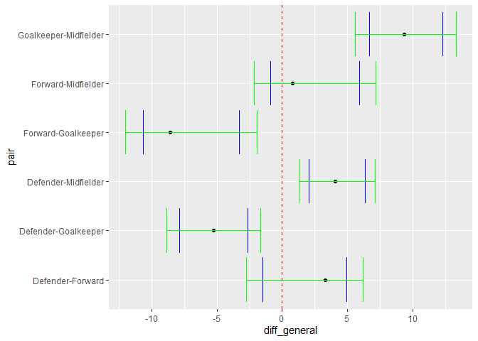

#Данные


##Загрузка данных:


```r
#Генеральная совокупность
soccer_general <- read.csv("soccer.csv", sep=";")[, 2:6] %>% 
    mutate(Position = as.factor(Position), 
    Nationality = as.factor(Nationality), 
    Age = as.numeric(Age), 
    Height = as.numeric(Height)
) %>% 
filter(Nationality %in% c("Spanish", "Italian", "German", "English", "Argentinian")) 

set.seed(1) 

#выборка
soccer_wrk <- soccer_general[sample(1:nrow(soccer_general), 150), ] %>% 
    mutate(Nationality = factor(Nationality))
```


##Генеральная совокупность

Рост в генеральной совокупности:


```r
#найдём сначала все средние в генеральной совокупности
Mean_General <- soccer_general %>%
  group_by(Position) %>%
  summarise_at(vars(Height), list(name = mean))
Mean_General$Position <- as.character(Mean_General$Position)
colnames(Mean_General) <- c("Position", "mean_gen")
Mean_General#Средний рост по позициям в генеральной совокупности
```

```
## # A tibble: 4 × 2
##   Position   mean_gen
##   <chr>         <dbl>
## 1 Defender       184.
## 2 Forward        180.
## 3 Goalkeeper     189.
## 4 Midfielder     180.
```

```r
#создадим датафрейм с парами
positions <- Mean_General$Position
L <- factorial(length(positions))/(2*factorial(length(positions)-2))
pairs <- data.frame(matrix(ncol = 2, nrow = L))
k <- 1
for (i in 1:(length(positions)-1)) {
  for (j in (i+1):(length(positions))){
    pairs[k, 1] <- (positions[i])
    pairs[k, 2] <- (positions[j])
    k <- k+1
  }
}
pairs#Возможные пары
```

```
##           X1         X2
## 1   Defender    Forward
## 2   Defender Goalkeeper
## 3   Defender Midfielder
## 4    Forward Goalkeeper
## 5    Forward Midfielder
## 6 Goalkeeper Midfielder
```

```r
#Разности средних
differences <- pairs
difr<-c()
for (i in 1:nrow(pairs)) {
  x1 <- as.character(differences[i,1])
  x2 <- as.character(differences[i,2])
  index1 <- as.numeric(which(Mean_General[,1] == x1))
  index2 <- as.numeric(which(Mean_General[,1] == x2))
  difr[i] <- as.numeric(Mean_General[index1, 2])-as.numeric(Mean_General[index2, 2])
}
differences$x1_x2 <- difr
differences#Разница среднего роста по позициям в генеральной совокупности
```

```
##           X1         X2      x1_x2
## 1   Defender    Forward  3.3183291
## 2   Defender Goalkeeper -5.2565139
## 3   Defender Midfielder  4.0832884
## 4    Forward Goalkeeper -8.5748429
## 5    Forward Midfielder  0.7649594
## 6 Goalkeeper Midfielder  9.3398023
```

#Доверительные интервалы

##без поправок

Тесты для пар позиций


```r
#подготовительный этап (для сохранения результатов)
without <- pairs
colnames(without) <- c("Pos1", "Pos2")
ps <- c()#сюда пишем p-values
lowers <-c()
uppers <-c()

#тесты для пар
for (i in 1:nrow(pairs)) {
  x1 <- as.character(pairs[i,1])
  x2 <- as.character(pairs[i,2])
  pairpos <- paste(x1, x2, sep="-")
  print(pairpos)
  test_res <- soccer_wrk %>%
    filter(Position == x1|Position == x2) %>% 
    t.test(data=., Height ~ Position)
  print(test_res)
  ps [i]<- test_res$p.value
  lowers[i] <- test_res$conf.int[1]
  uppers[i] <- test_res$conf.int[2]
}
```

```
## [1] "Defender-Forward"
## 
## 	Welch Two Sample t-test
## 
## data:  Height by Position
## t = 1.0694, df = 41.576, p-value = 0.2911
## alternative hypothesis: true difference in means between group Defender and group Forward is not equal to 0
## 95 percent confidence interval:
##  -1.525215  4.961579
## sample estimates:
## mean in group Defender  mean in group Forward 
##               183.2182               181.5000 
## 
## [1] "Defender-Goalkeeper"
## 
## 	Welch Two Sample t-test
## 
## data:  Height by Position
## t = -4.0594, df = 35.624, p-value = 0.0002569
## alternative hypothesis: true difference in means between group Defender and group Goalkeeper is not equal to 0
## 95 percent confidence interval:
##  -7.885903 -2.630114
## sample estimates:
##   mean in group Defender mean in group Goalkeeper 
##                 183.2182                 188.4762 
## 
## [1] "Defender-Midfielder"
## 
## 	Welch Two Sample t-test
## 
## data:  Height by Position
## t = 3.8878, df = 86.443, p-value = 0.0001979
## alternative hypothesis: true difference in means between group Defender and group Midfielder is not equal to 0
## 95 percent confidence interval:
##  2.061467 6.374897
## sample estimates:
##   mean in group Defender mean in group Midfielder 
##                 183.2182                 179.0000 
## 
## [1] "Forward-Goalkeeper"
## 
## 	Welch Two Sample t-test
## 
## data:  Height by Position
## t = -3.8074, df = 48.632, p-value = 0.000394
## alternative hypothesis: true difference in means between group Forward and group Goalkeeper is not equal to 0
## 95 percent confidence interval:
##  -10.658982  -3.293399
## sample estimates:
##    mean in group Forward mean in group Goalkeeper 
##                 181.5000                 188.4762 
## 
## [1] "Forward-Midfielder"
## 
## 	Welch Two Sample t-test
## 
## data:  Height by Position
## t = 1.4791, df = 48.351, p-value = 0.1456
## alternative hypothesis: true difference in means between group Forward and group Midfielder is not equal to 0
## 95 percent confidence interval:
##  -0.8976773  5.8976773
## sample estimates:
##    mean in group Forward mean in group Midfielder 
##                    181.5                    179.0 
## 
## [1] "Goalkeeper-Midfielder"
## 
## 	Welch Two Sample t-test
## 
## data:  Height by Position
## t = 6.7809, df = 43.584, p-value = 2.508e-08
## alternative hypothesis: true difference in means between group Goalkeeper and group Midfielder is not equal to 0
## 95 percent confidence interval:
##   6.658979 12.293402
## sample estimates:
## mean in group Goalkeeper mean in group Midfielder 
##                 188.4762                 179.0000
```

Результаты


```r
without$`p-value` <- ps
without$`lower_ci` <- lowers
without$`upper_ci` <- uppers
without
```

```
##         Pos1       Pos2      p-value    lower_ci  upper_ci
## 1   Defender    Forward 2.910604e-01  -1.5252150  4.961579
## 2   Defender Goalkeeper 2.568598e-04  -7.8859031 -2.630114
## 3   Defender Midfielder 1.979437e-04   2.0614665  6.374897
## 4    Forward Goalkeeper 3.939769e-04 -10.6589819 -3.293399
## 5    Forward Midfielder 1.455887e-01  -0.8976773  5.897677
## 6 Goalkeeper Midfielder 2.507505e-08   6.6589788 12.293402
```


*Итого здесь*


```r
without$H <- ifelse(without$`p-value` < 0.05,"H1", "H0")
without$diff_general <- round(differences$x1_x2,digits = 4)
without$`p-value` <- round(without$`p-value`, digits = 4)
without$`lower_ci` <- round(without$`lower_ci`, digits = 4)
without$`upper_ci` <- round(without$`upper_ci`, digits = 4)
without
```

```
##         Pos1       Pos2 p-value lower_ci upper_ci  H diff_general
## 1   Defender    Forward  0.2911  -1.5252   4.9616 H0       3.3183
## 2   Defender Goalkeeper  0.0003  -7.8859  -2.6301 H1      -5.2565
## 3   Defender Midfielder  0.0002   2.0615   6.3749 H1       4.0833
## 4    Forward Goalkeeper  0.0004 -10.6590  -3.2934 H1      -8.5748
## 5    Forward Midfielder  0.1456  -0.8977   5.8977 H0       0.7650
## 6 Goalkeeper Midfielder  0.0000   6.6590  12.2934 H1       9.3398
```

Нулевая гипотеза не отвергается в случае Defender-Forward и Forward-Midfielder (p>0.05). Во всех случаях ДИ покрывают истинную разницу средних.


##с поправкой Бонферони

Исходно есть уhовень значимости = 0,95 (альфа=0,05). В случае поправки Бонферони для 2 групп имеем (альфа*=альфа/n=0,05/2=0,025) уровень значимости = 1-0,025=0,975.

Сама поправка


```r
cl = 1-0.05/6 #!поправка на 6, т.к. 6 пар (гипотез)
```


Тесты для пар позиций


```r
#подготовительный этап (для сохранения результатов)
with <- pairs
colnames(with) <- c("Pos1", "Pos2")
ps <- c()#сюда пишем p-values
lowers <-c()
uppers <-c()

#тесты для пар
for (i in 1:nrow(pairs)) {
  x1 <- as.character(pairs[i,1])
  x2 <- as.character(pairs[i,2])
  pairpos <- paste(x1, x2, sep="-")
  print(pairpos)
  test_res <- soccer_wrk %>%
    filter(Position == x1|Position == x2) %>% 
    t.test(data=., Height ~ Position, conf.level = cl)
  print(test_res)
  ps [i]<- test_res$p.value
  lowers[i] <- test_res$conf.int[1]
  uppers[i] <- test_res$conf.int[2]
}
```

```
## [1] "Defender-Forward"
## 
## 	Welch Two Sample t-test
## 
## data:  Height by Position
## t = 1.0694, df = 41.576, p-value = 0.2911
## alternative hypothesis: true difference in means between group Defender and group Forward is not equal to 0
## 99.16667 percent confidence interval:
##  -2.732988  6.169352
## sample estimates:
## mean in group Defender  mean in group Forward 
##               183.2182               181.5000 
## 
## [1] "Defender-Goalkeeper"
## 
## 	Welch Two Sample t-test
## 
## data:  Height by Position
## t = -4.0594, df = 35.624, p-value = 0.0002569
## alternative hypothesis: true difference in means between group Defender and group Goalkeeper is not equal to 0
## 99.16667 percent confidence interval:
##  -8.876583 -1.639434
## sample estimates:
##   mean in group Defender mean in group Goalkeeper 
##                 183.2182                 188.4762 
## 
## [1] "Defender-Midfielder"
## 
## 	Welch Two Sample t-test
## 
## data:  Height by Position
## t = 3.8878, df = 86.443, p-value = 0.0001979
## alternative hypothesis: true difference in means between group Defender and group Midfielder is not equal to 0
## 99.16667 percent confidence interval:
##  1.288373 7.147990
## sample estimates:
##   mean in group Defender mean in group Midfielder 
##                 183.2182                 179.0000 
## 
## [1] "Forward-Goalkeeper"
## 
## 	Welch Two Sample t-test
## 
## data:  Height by Position
## t = -3.8074, df = 48.632, p-value = 0.000394
## alternative hypothesis: true difference in means between group Forward and group Goalkeeper is not equal to 0
## 99.16667 percent confidence interval:
##  -12.015828  -1.936553
## sample estimates:
##    mean in group Forward mean in group Goalkeeper 
##                 181.5000                 188.4762 
## 
## [1] "Forward-Midfielder"
## 
## 	Welch Two Sample t-test
## 
## data:  Height by Position
## t = 1.4791, df = 48.351, p-value = 0.1456
## alternative hypothesis: true difference in means between group Forward and group Midfielder is not equal to 0
## 99.16667 percent confidence interval:
##  -2.149936  7.149936
## sample estimates:
##    mean in group Forward mean in group Midfielder 
##                    181.5                    179.0 
## 
## [1] "Goalkeeper-Midfielder"
## 
## 	Welch Two Sample t-test
## 
## data:  Height by Position
## t = 6.7809, df = 43.584, p-value = 2.508e-08
## alternative hypothesis: true difference in means between group Goalkeeper and group Midfielder is not equal to 0
## 99.16667 percent confidence interval:
##   5.613456 13.338925
## sample estimates:
## mean in group Goalkeeper mean in group Midfielder 
##                 188.4762                 179.0000
```

Результаты


```r
with$`p-value` <- ps
with$`lower_ci` <- lowers
with$`upper_ci` <- uppers
with
```

```
##         Pos1       Pos2      p-value   lower_ci  upper_ci
## 1   Defender    Forward 2.910604e-01  -2.732988  6.169352
## 2   Defender Goalkeeper 2.568598e-04  -8.876583 -1.639434
## 3   Defender Midfielder 1.979437e-04   1.288373  7.147990
## 4    Forward Goalkeeper 3.939769e-04 -12.015828 -1.936553
## 5    Forward Midfielder 1.455887e-01  -2.149936  7.149936
## 6 Goalkeeper Midfielder 2.507505e-08   5.613456 13.338925
```


*Итого здесь*


```r
with$H <- ifelse(with$`p-value` < 0.05,"H1", "H0")
with$diff_general <- round(differences$x1_x2,digits = 4)
with$`p-value` <- round(with$`p-value`, digits = 4)
with$`lower_ci` <- round(with$`lower_ci`, digits = 4)
with$`upper_ci` <- round(with$`upper_ci`, digits = 4)
with
```

```
##         Pos1       Pos2 p-value lower_ci upper_ci  H diff_general
## 1   Defender    Forward  0.2911  -2.7330   6.1694 H0       3.3183
## 2   Defender Goalkeeper  0.0003  -8.8766  -1.6394 H1      -5.2565
## 3   Defender Midfielder  0.0002   1.2884   7.1480 H1       4.0833
## 4    Forward Goalkeeper  0.0004 -12.0158  -1.9366 H1      -8.5748
## 5    Forward Midfielder  0.1456  -2.1499   7.1499 H0       0.7650
## 6 Goalkeeper Midfielder  0.0000   5.6135  13.3389 H1       9.3398
```

Нулевая гипотеза всё также не отвергается в случае Defender-Forward и Forward-Midfielder (p>0.05) и во всех случаях ДИ покрывают истинную разницу средних, но стали длиннее.


Для сравнения ДИ:

```r
#выделим пары
without$pair <- paste(without$Pos1,without$Pos2, sep="-")
with$pair <- paste(with$Pos1,with$Pos2, sep="-")

ggplot() +
  geom_point(data = without, aes(x = diff_general, y = pair))+
  geom_errorbar(data = without,aes(xmin = lower_ci, xmax = upper_ci, y=pair), color="blue")+
  geom_errorbar(data = with,aes(xmin = lower_ci, xmax = upper_ci, y=pair),color="green")+
  geom_vline(xintercept=0, color="red", linetype=2)
```

<!-- -->

Видим, что синий интервал (без поправки) меньше зелёного (с поправкой).


#Попарные t-тесты

##без поправок

```r
pairwise.t.test(soccer_wrk$Height, soccer_wrk$Position, pool.sd = FALSE, p.adjust.method = "none")
```

```
## 
## 	Pairwise comparisons using t tests with non-pooled SD 
## 
## data:  soccer_wrk$Height and soccer_wrk$Position 
## 
##            Defender Forward Goalkeeper
## Forward    0.29106  -       -         
## Goalkeeper 0.00026  0.00039 -         
## Midfielder 0.00020  0.14559 2.5e-08   
## 
## P value adjustment method: none
```


##поправка Холма

```r
pairwise.t.test(soccer_wrk$Height, soccer_wrk$Position, pool.sd = FALSE, p.adjust.method = "holm")
```

```
## 
## 	Pairwise comparisons using t tests with non-pooled SD 
## 
## data:  soccer_wrk$Height and soccer_wrk$Position 
## 
##            Defender Forward Goalkeeper
## Forward    0.29118  -       -         
## Goalkeeper 0.00103  0.00118 -         
## Midfielder 0.00099  0.29118 1.5e-07   
## 
## P value adjustment method: holm
```


##с поправкой Бенджамини-Хохберга

```r
pairwise.t.test(soccer_wrk$Height, soccer_wrk$Position, pool.sd = FALSE, p.adjust.method = "BH")
```

```
## 
## 	Pairwise comparisons using t tests with non-pooled SD 
## 
## data:  soccer_wrk$Height and soccer_wrk$Position 
## 
##            Defender Forward Goalkeeper
## Forward    0.29106  -       -         
## Goalkeeper 0.00051  0.00059 -         
## Midfielder 0.00051  0.17471 1.5e-07   
## 
## P value adjustment method: BH
```


##Результат

На основании тестов: p<0.05 у 4 случаев (Defender-Goalkeeper, Defender-Midfielder, Forward-Goalkeeper, Goalkeeper-Midfielder), т.е. в их случае отвергаем нулевую гипотезу (о равенстве средних в обеих группах) согласно тесту. (аналогичный результат в ДИ)


```r
data.frame(Position=c('Forward', 'Goalkeeper', 'Midfielder'),
                 Defender=c("H0", "H1", "H1"),
                 Forward=c('-', "H1", "H0"),
                 Goalkeeper=c('-', '-', "H1"))
```

```
##     Position Defender Forward Goalkeeper
## 1    Forward       H0       -          -
## 2 Goalkeeper       H1      H1          -
## 3 Midfielder       H1      H0         H1
```


*Открытий = 4. Ложных = 0.* (изначально разница в росте не равна 0, как мы предполагаем в рамках гипотезы H0, т.е. любое открытие является истинным)

