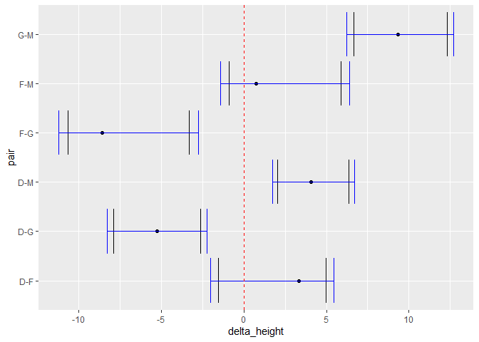

```r
library(dplyr)
```

```
## Warning: пакет 'dplyr' был собран под R версии 4.2.2
```

```
## 
## Присоединяю пакет: 'dplyr'
```

```
## Следующие объекты скрыты от 'package:stats':
## 
##     filter, lag
```

```
## Следующие объекты скрыты от 'package:base':
## 
##     intersect, setdiff, setequal, union
```

```r
library(ggplot2)
```

#Данные


##Загрузка данных:


```r
#Генеральная совокупность
soccer_general <- read.csv("soccer.csv", sep=";")[, 2:6] %>% 
    mutate(Position = as.factor(Position), 
    Nationality = as.factor(Nationality), 
    Age = as.numeric(Age), 
    Height = as.numeric(Height)
) %>% 
filter(Nationality %in% c("Spanish", "Italian", "German", "English", "Argentinian")) 

set.seed(1) 

#выборка
soccer_wrk <- soccer_general[sample(1:nrow(soccer_general), 150), ] %>% 
    mutate(Nationality = factor(Nationality))
```


Возможные варианты пар для сравнения: 
*Defender - Forward
*Defender - Goalkeeper
*Defender - Midfielder
*Forward - Goalkeeper
*Forward - Midfielder
*Goalkeeper - Midfielder


##Генеральная совокупность

Рост в генеральной совокупности:


```r
#найдём сначала все средние 
mD <- mean(soccer_general[soccer_general$Position == 'Defender', 'Height'])#183
mF <- mean(soccer_general[soccer_general$Position == 'Forward', 'Height'])#180
mG <- mean(soccer_general[soccer_general$Position == 'Goalkeeper', 'Height'])#188
mM <- mean(soccer_general[soccer_general$Position == 'Midfielder', 'Height'])#179

#разницы средних
difDF <- mD - mF
difDG <- mD - mG
difDM <- mD - mM
difFG <- mF - mG
difFM <- mF - mM
difGM <- mG - mM

#посмотрим на разницы
data.frame(Position=c('Forward', 'Goalkeeper', 'Midfielder'),
                 Defender=c(difDF, difDG, difDM),
                 Forward=c('-', difFG, difFM),
                 Goalkeeper=c('-', '-', difGM))
```

```
##     Position  Defender           Forward       Goalkeeper
## 1    Forward  3.318329                 -                -
## 2 Goalkeeper -5.256514 -8.57484291736262                -
## 3 Midfielder  4.083288 0.764959376372417 9.33980229373503
```


#Доверительные интервалы

##без поправок

Defender - Forward


```r
test_res <- soccer_wrk %>% 
  filter(Position == "Defender"|Position == "Forward") %>% 
  t.test(data=., Height ~ Position)

lower_DF_none <- test_res$conf.int[1]
upper_DF_none <- test_res$conf.int[2]

test_res
```

```
## 
## 	Welch Two Sample t-test
## 
## data:  Height by Position
## t = 1.0694, df = 41.576, p-value = 0.2911
## alternative hypothesis: true difference in means between group Defender and group Forward is not equal to 0
## 95 percent confidence interval:
##  -1.525215  4.961579
## sample estimates:
## mean in group Defender  mean in group Forward 
##               183.2182               181.5000
```

ДИ включает 0, не отвергаем H0 (о равенстве средних); реальную разницу между средним ростом ДИ покрывает.


Defender - Goalkeeper


```r
test_res <- soccer_wrk %>% 
  filter(Position == "Defender"|Position == "Goalkeeper") %>% 
  t.test(data=., Height ~ Position)

lower_DG_none <- test_res$conf.int[1]
upper_DG_none <- test_res$conf.int[2]

test_res
```

```
## 
## 	Welch Two Sample t-test
## 
## data:  Height by Position
## t = -4.0594, df = 35.624, p-value = 0.0002569
## alternative hypothesis: true difference in means between group Defender and group Goalkeeper is not equal to 0
## 95 percent confidence interval:
##  -7.885903 -2.630114
## sample estimates:
##   mean in group Defender mean in group Goalkeeper 
##                 183.2182                 188.4762
```

ДИ не включает 0, отвергаем H0 (о равенстве средних); реальную разницу между средним ростом ДИ покрывает.


Defender - Midfielder


```r
test_res <- soccer_wrk %>% 
  filter(Position == "Defender"|Position == "Midfielder") %>% 
  t.test(data=., Height ~ Position)

lower_DM_none <- test_res$conf.int[1]
upper_DM_none <- test_res$conf.int[2]

test_res
```

```
## 
## 	Welch Two Sample t-test
## 
## data:  Height by Position
## t = 3.8878, df = 86.443, p-value = 0.0001979
## alternative hypothesis: true difference in means between group Defender and group Midfielder is not equal to 0
## 95 percent confidence interval:
##  2.061467 6.374897
## sample estimates:
##   mean in group Defender mean in group Midfielder 
##                 183.2182                 179.0000
```

ДИ не включает 0, отвергаем H0 (о равенстве средних); реальную разницу между средним ростом ДИ покрывает.


Forward - Goalkeeper


```r
test_res <- soccer_wrk %>% 
  filter(Position == "Forward"|Position == "Goalkeeper") %>% 
  t.test(data=., Height ~ Position)

lower_FG_none <- test_res$conf.int[1]
upper_FG_none <- test_res$conf.int[2]

test_res
```

```
## 
## 	Welch Two Sample t-test
## 
## data:  Height by Position
## t = -3.8074, df = 48.632, p-value = 0.000394
## alternative hypothesis: true difference in means between group Forward and group Goalkeeper is not equal to 0
## 95 percent confidence interval:
##  -10.658982  -3.293399
## sample estimates:
##    mean in group Forward mean in group Goalkeeper 
##                 181.5000                 188.4762
```

ДИ не включает 0, отвергаем H0 (о равенстве средних); реальную разницу между средним ростом ДИ покрывает.


Forward - Midfielder


```r
test_res <- soccer_wrk %>% 
  filter(Position == "Forward"|Position == "Midfielder") %>% 
  t.test(data=., Height ~ Position)

lower_FM_none <- test_res$conf.int[1]
upper_FM_none <- test_res$conf.int[2]

test_res
```

```
## 
## 	Welch Two Sample t-test
## 
## data:  Height by Position
## t = 1.4791, df = 48.351, p-value = 0.1456
## alternative hypothesis: true difference in means between group Forward and group Midfielder is not equal to 0
## 95 percent confidence interval:
##  -0.8976773  5.8976773
## sample estimates:
##    mean in group Forward mean in group Midfielder 
##                    181.5                    179.0
```

ДИ включает 0, не отвергаем H0 (о равенстве средних); реальную разницу между средним ростом ДИ покрывает.


Goalkeeper - Midfielder

```r
test_res <- soccer_wrk %>% 
  filter(Position == "Goalkeeper"|Position == "Midfielder") %>% 
  t.test(data=., Height ~ Position)

lower_GM_none <- test_res$conf.int[1]
upper_GM_none <- test_res$conf.int[2]

test_res
```

```
## 
## 	Welch Two Sample t-test
## 
## data:  Height by Position
## t = 6.7809, df = 43.584, p-value = 2.508e-08
## alternative hypothesis: true difference in means between group Goalkeeper and group Midfielder is not equal to 0
## 95 percent confidence interval:
##   6.658979 12.293402
## sample estimates:
## mean in group Goalkeeper mean in group Midfielder 
##                 188.4762                 179.0000
```

ДИ не включает 0, отвергаем H0 (о равенстве средних); реальную разницу между средним ростом ДИ покрывает.


*Итого здесь*


```r
data.frame(Position=c('Forward', 'Goalkeeper', 'Midfielder'),
                 Defender=c("H0", "H1", "H1"),
                 Forward=c('-', "H1", "H0"),
                 Goalkeeper=c('-', '-', "H1"))
```

```
##     Position Defender Forward Goalkeeper
## 1    Forward       H0       -          -
## 2 Goalkeeper       H1      H1          -
## 3 Midfielder       H1      H0         H1
```

И во всех случаях ДИ покрывают истинную разницу средних.


```r
#Соберём всё вместе чтобы потом проще было
lowers_none <- c(lower_DF_none,lower_DG_none,lower_DM_none,lower_FG_none,lower_FM_none,lower_GM_none)
uppers_none <- c(upper_DF_none,upper_DG_none,upper_DM_none,upper_FG_none,upper_FM_none,upper_GM_none)
```


##с поправкой Бонферони

Исходно есть уловень значимости = 0,95 (альфа=0,05). В случае поправки Бонферони для 2 групп имеем (альфа*=альфа/n=0,05/2=0,025) уровень значимости = 1-0,025=0,975.


```r
cl = 1-0.05/2
```


Defender - Forward


```r
test_res <- soccer_wrk %>% 
  filter(Position == "Defender"|Position == "Forward") %>% 
  t.test(data=., Height ~ Position, conf.level = cl)

lower_DF_bonf <- test_res$conf.int[1]
upper_DF_bonf <- test_res$conf.int[2]

test_res
```

```
## 
## 	Welch Two Sample t-test
## 
## data:  Height by Position
## t = 1.0694, df = 41.576, p-value = 0.2911
## alternative hypothesis: true difference in means between group Defender and group Forward is not equal to 0
## 97.5 percent confidence interval:
##  -2.018157  5.454520
## sample estimates:
## mean in group Defender  mean in group Forward 
##               183.2182               181.5000
```

ДИ включает 0, не отвергаем H0 (о равенстве средних).


Defender - Goalkeeper


```r
test_res <- soccer_wrk %>% 
  filter(Position == "Defender"|Position == "Goalkeeper") %>% 
  t.test(data=., Height ~ Position, conf.level = cl)

lower_DG_bonf <- test_res$conf.int[1]
upper_DG_bonf <- test_res$conf.int[2]

test_res
```

```
## 
## 	Welch Two Sample t-test
## 
## data:  Height by Position
## t = -4.0594, df = 35.624, p-value = 0.0002569
## alternative hypothesis: true difference in means between group Defender and group Goalkeeper is not equal to 0
## 97.5 percent confidence interval:
##  -8.289117 -2.226900
## sample estimates:
##   mean in group Defender mean in group Goalkeeper 
##                 183.2182                 188.4762
```

ДИ не включает 0, отвергаем H0 (о равенстве средних).


Defender - Midfielder


```r
test_res <- soccer_wrk %>% 
  filter(Position == "Defender"|Position == "Midfielder") %>% 
  t.test(data=., Height ~ Position, conf.level = cl)

lower_DM_bonf <- test_res$conf.int[1]
upper_DM_bonf <- test_res$conf.int[2]

test_res
```

```
## 
## 	Welch Two Sample t-test
## 
## data:  Height by Position
## t = 3.8878, df = 86.443, p-value = 0.0001979
## alternative hypothesis: true difference in means between group Defender and group Midfielder is not equal to 0
## 97.5 percent confidence interval:
##  1.743213 6.693150
## sample estimates:
##   mean in group Defender mean in group Midfielder 
##                 183.2182                 179.0000
```

ДИ не включает 0, отвергаем H0 (о равенстве средних).


Forward - Goalkeeper


```r
test_res <- soccer_wrk %>% 
  filter(Position == "Forward"|Position == "Goalkeeper") %>% 
  t.test(data=., Height ~ Position, conf.level = cl)

lower_FG_bonf <- test_res$conf.int[1]
upper_FG_bonf <- test_res$conf.int[2]

test_res
```

```
## 
## 	Welch Two Sample t-test
## 
## data:  Height by Position
## t = -3.8074, df = 48.632, p-value = 0.000394
## alternative hypothesis: true difference in means between group Forward and group Goalkeeper is not equal to 0
## 97.5 percent confidence interval:
##  -11.214102  -2.738279
## sample estimates:
##    mean in group Forward mean in group Goalkeeper 
##                 181.5000                 188.4762
```

ДИ не включает 0, отвергаем H0 (о равенстве средних).


Forward - Midfielder


```r
test_res <- soccer_wrk %>% 
  filter(Position == "Forward"|Position == "Midfielder") %>% 
  t.test(data=., Height ~ Position, conf.level = cl)

lower_FM_bonf <- test_res$conf.int[1]
upper_FM_bonf <- test_res$conf.int[2]

test_res
```

```
## 
## 	Welch Two Sample t-test
## 
## data:  Height by Position
## t = 1.4791, df = 48.351, p-value = 0.1456
## alternative hypothesis: true difference in means between group Forward and group Midfielder is not equal to 0
## 97.5 percent confidence interval:
##  -1.409966  6.409966
## sample estimates:
##    mean in group Forward mean in group Midfielder 
##                    181.5                    179.0
```

ДИ включает 0, не отвергаем H0 (о равенстве средних).


Goalkeeper - Midfielder

```r
test_res <- soccer_wrk %>% 
  filter(Position == "Goalkeeper"|Position == "Midfielder") %>% 
  t.test(data=., Height ~ Position, conf.level = cl)

lower_GM_bonf <- test_res$conf.int[1]
upper_GM_bonf <- test_res$conf.int[2]

test_res
```

```
## 
## 	Welch Two Sample t-test
## 
## data:  Height by Position
## t = 6.7809, df = 43.584, p-value = 2.508e-08
## alternative hypothesis: true difference in means between group Goalkeeper and group Midfielder is not equal to 0
## 97.5 percent confidence interval:
##   6.231931 12.720450
## sample estimates:
## mean in group Goalkeeper mean in group Midfielder 
##                 188.4762                 179.0000
```

ДИ не включает 0, отвергаем H0 (о равенстве средних).


*Итого здесь*


```r
data.frame(Position=c('Forward', 'Goalkeeper', 'Midfielder'),
                 Defender=c("H0", "H1", "H1"),
                 Forward=c('-', "H1", "H0"),
                 Goalkeeper=c('-', '-', "H1"))
```

```
##     Position Defender Forward Goalkeeper
## 1    Forward       H0       -          -
## 2 Goalkeeper       H1      H1          -
## 3 Midfielder       H1      H0         H1
```

И во всех случаях ДИ покрывают истинную разницу средних.


```r
#Соберём всё вместе чтобы потом проще было
lowers_bonf <- c(lower_DF_bonf,lower_DG_bonf,lower_DM_bonf,lower_FG_bonf,lower_FM_bonf,lower_GM_bonf)
uppers_bonf <- c(upper_DF_bonf,upper_DG_bonf,upper_DM_bonf,upper_FG_bonf,upper_FM_bonf,upper_GM_bonf)
```


##Результат

```r
df <- data.frame(delta_height = c(difDF, difDG, difDM, difFG, difFM, difGM),
                         pair = c("D-F", "D-G", "D-M", "F-G", "F-M", "G-M"),
                         lower_none = lowers_none,
                         upper_none = uppers_none,
                         lower_bonf = lowers_bonf,
                         upper_bonf = uppers_bonf)

ggplot(df, aes(x=delta_height, y=pair)) +
  geom_point() +
  geom_errorbar(aes(xmin = lower_none, xmax = upper_none))+
  geom_errorbar(aes(xmin = lower_bonf, xmax = upper_bonf), color='blue')+
  geom_vline(xintercept=0, color="red", linetype=2)
```

<!-- -->

Видим, что в случае поправки ДИ становится длинее (синий цвет). Во всех случаях ДИ покрывают истинную разницу средних значений роста. 0 пересекается ДИ в случаях F-M и D-F (не отвергаем H0).


#Попарные t-тесты

##без поправок

```r
pairwise.t.test(soccer_wrk$Height, soccer_wrk$Position, pool.sd = FALSE, p.adjust.method = "none")
```

```
## 
## 	Pairwise comparisons using t tests with non-pooled SD 
## 
## data:  soccer_wrk$Height and soccer_wrk$Position 
## 
##            Defender Forward Goalkeeper
## Forward    0.29106  -       -         
## Goalkeeper 0.00026  0.00039 -         
## Midfielder 0.00020  0.14559 2.5e-08   
## 
## P value adjustment method: none
```


##поправка Холма

```r
pairwise.t.test(soccer_wrk$Height, soccer_wrk$Position, pool.sd = FALSE, p.adjust.method = "holm")
```

```
## 
## 	Pairwise comparisons using t tests with non-pooled SD 
## 
## data:  soccer_wrk$Height and soccer_wrk$Position 
## 
##            Defender Forward Goalkeeper
## Forward    0.29118  -       -         
## Goalkeeper 0.00103  0.00118 -         
## Midfielder 0.00099  0.29118 1.5e-07   
## 
## P value adjustment method: holm
```


##с поправкой Бенджамини-Хохберга

```r
pairwise.t.test(soccer_wrk$Height, soccer_wrk$Position, pool.sd = FALSE, p.adjust.method = "BH")
```

```
## 
## 	Pairwise comparisons using t tests with non-pooled SD 
## 
## data:  soccer_wrk$Height and soccer_wrk$Position 
## 
##            Defender Forward Goalkeeper
## Forward    0.29106  -       -         
## Goalkeeper 0.00051  0.00059 -         
## Midfielder 0.00051  0.17471 1.5e-07   
## 
## P value adjustment method: BH
```


##Результат

На основании тестов: p<0.05 у 4 случаев (Defender-Goalkeeper, Defender-Midfielder, Forward-Goalkeeper, Goalkeeper-Midfielder), т.е. в их случае отвергаем нулевую гипотезу (о равенстве средних в обеих группах) согласно тесту. (аналогичный результат в ДИ)


```r
data.frame(Position=c('Forward', 'Goalkeeper', 'Midfielder'),
                 Defender=c("H0", "H1", "H1"),
                 Forward=c('-', "H1", "H0"),
                 Goalkeeper=c('-', '-', "H1"))
```

```
##     Position Defender Forward Goalkeeper
## 1    Forward       H0       -          -
## 2 Goalkeeper       H1      H1          -
## 3 Midfielder       H1      H0         H1
```


*Открытий = 4. Ложных = 0.* (изначально разница в росте не равна 0, как мы предполагаем в рамках гипотезы H0, т.е. любое открытие является истинным)
