```r
library(ggplot2)
library(ggpubr)
library(dplyr)
```


#Задание 1

Загрузим датасет insurance_cost.csv


```r
cost <- read.csv("insurance_cost.csv")
```

Познакомимся с нашим датасетом.

Это  данные по базовым показателям здоровья индивида и сумме, которую страховая  компания заплатила за его лечение в год. Обычно эти данные используют, чтобы  потренироваться в предсказании того, как определённые характеристики индивида  повышают траты страховой компании (и, соответственно, должны быть заложены в  цену страховки).

Посмотрим на сами данные:

```r
head(cost)
```

```
##   age    sex    bmi children smoker    region   charges
## 1  19 female 27.900        0    yes southwest 16884.924
## 2  18   male 33.770        1     no southeast  1725.552
## 3  28   male 33.000        3     no southeast  4449.462
## 4  33   male 22.705        0     no northwest 21984.471
## 5  32   male 28.880        0     no northwest  3866.855
## 6  31 female 25.740        0     no southeast  3756.622
```

Посмотрим на структуру:

```r
str(cost)
```

```
## 'data.frame':	1338 obs. of  7 variables:
##  $ age     : int  19 18 28 33 32 31 46 37 37 60 ...
##  $ sex     : chr  "female" "male" "male" "male" ...
##  $ bmi     : num  27.9 33.8 33 22.7 28.9 ...
##  $ children: int  0 1 3 0 0 0 1 3 2 0 ...
##  $ smoker  : chr  "yes" "no" "no" "no" ...
##  $ region  : chr  "southwest" "southeast" "southeast" "northwest" ...
##  $ charges : num  16885 1726 4449 21984 3867 ...
```

И сводку по значениям:

```r
summary(cost)
```

```
##       age            sex                 bmi           children    
##  Min.   :18.00   Length:1338        Min.   :15.96   Min.   :0.000  
##  1st Qu.:27.00   Class :character   1st Qu.:26.30   1st Qu.:0.000  
##  Median :39.00   Mode  :character   Median :30.40   Median :1.000  
##  Mean   :39.21                      Mean   :30.66   Mean   :1.095  
##  3rd Qu.:51.00                      3rd Qu.:34.69   3rd Qu.:2.000  
##  Max.   :64.00                      Max.   :53.13   Max.   :5.000  
##     smoker             region             charges     
##  Length:1338        Length:1338        Min.   : 1122  
##  Class :character   Class :character   1st Qu.: 4740  
##  Mode  :character   Mode  :character   Median : 9382  
##                                        Mean   :13270  
##                                        3rd Qu.:16640  
##                                        Max.   :63770
```


#Задание 2

Построим гистограммы числовых переменныз.

Построим гистограмму для age:

```r
ggplot()+
  geom_histogram(data=cost,
       aes(x=age),
       color="#FF3399",
       fill="#FF3399")+
  ggtitle("Распределение по возрасту")+
  labs(x="возраст", y="количество")+
  theme_minimal()
```

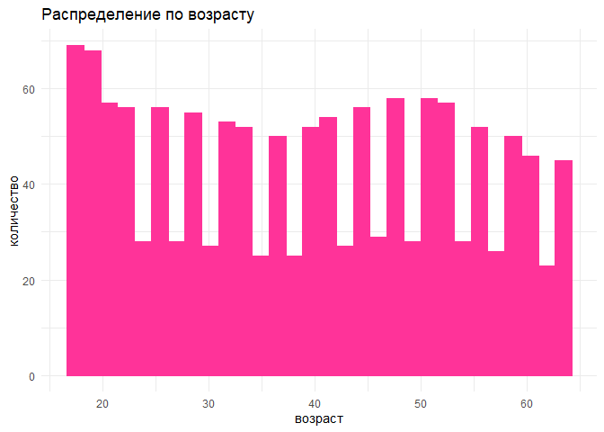<!-- -->

Построим гистограмму для bmi:

```r
ggplot()+
  geom_histogram(data=cost,
       aes(x=bmi),
       color="#6600CC",
       fill="#9933FF")+
  ggtitle("Распределение по ИМТ")+
  labs(x="ИМТ", y="количество")+
  theme_minimal()
```

<!-- -->

Построим гистограмму для children:

```r
ggplot()+
  geom_histogram(data=cost,
       aes(x=children),
       color="#00CC66",
       fill="#00CC66")+
  ggtitle("Распределение по числу детей")+
  labs(x="число детей", y="количество")+
  theme_minimal()
```

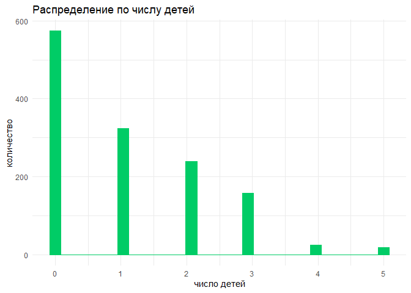<!-- -->

Построим гистограмму для charges:

```r
ggplot()+
  geom_histogram(data=cost,
       aes(x=charges),
       color="#006699",
       fill="#33CCFF")+
  ggtitle("Распределение по сумме выплат")+
  labs(x="сумма", y="количество")+
  theme_minimal()
```

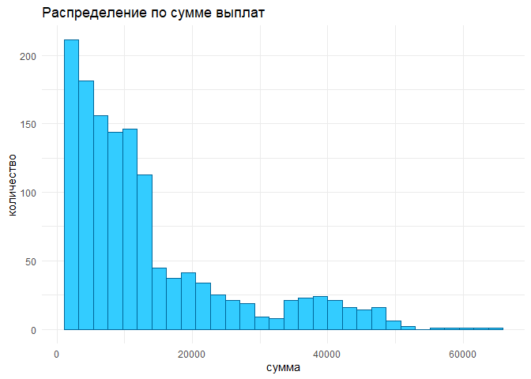<!-- -->

#Задание 3

Нарисуем график плотности для charges:

```r
charges_mean <- round(mean(cost$charges),0)
charges_median <- round(median(cost$charges),0)
graph3<-ggplot()+
  geom_density(data=cost,
               aes(x=charges),
               fill="red")+
  ggtitle("График плотности charges")+
  labs(x="сумма", y="плотность")+
  geom_vline(aes(xintercept = charges_mean), color="orange", size=0.8)+
  annotate("text", 
           x=charges_mean+10000,
           y=4.5e-05,
           label=paste0("Mean = ", charges_mean),
           color="orange"
           )+
  geom_vline(aes(xintercept = charges_median), color="yellow", size=0.8)+
  annotate("text", 
           x=charges_median+11500,
           y=3e-05,
           label=paste0("Median = ", charges_median),
           color="yellow"
           )+
  theme_dark()
  graph3
```

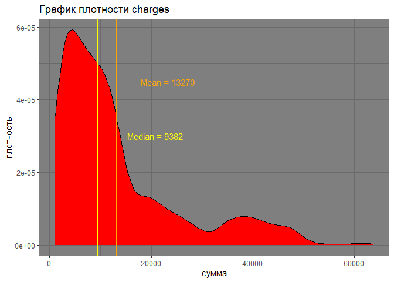<!-- -->

#Задание 4

Построим box_plot по отношению переменных charges и (1) sex (2) smoker (3)  region:


```r
graph4_1<-ggplot(data = cost,
       aes(x = charges, y=sex)) +
  geom_boxplot()+
  ggtitle("1. Charges и sex")+
  labs(x="сумма", y="пол")+
  theme_light()

graph4_2<-ggplot(data = cost,
       aes(x = charges, y=smoker)) +
  geom_boxplot()+
  ggtitle("2. Charges и smoker")+
  labs(x="сумма", y="курит")+
  theme_light()

graph4_3<-ggplot(data = cost,
       aes(x = charges, y=region)) +
  geom_boxplot()+
  ggtitle("3. Charges и region")+
  labs(x="сумма", y="регион")+
  theme_light()
graph4_1
```

<!-- -->

```r
graph4_2
```

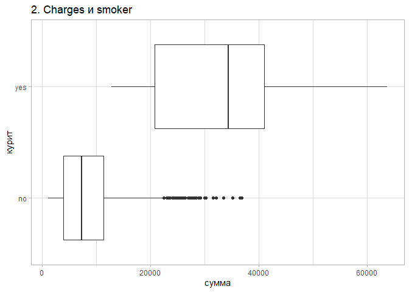<!-- -->

```r
graph4_3
```

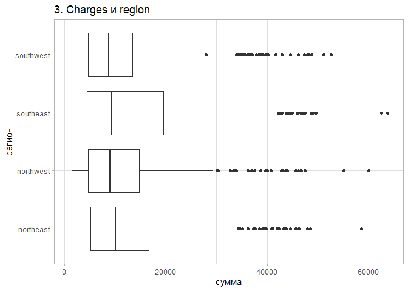<!-- -->
Суммы по медиане не отличаются для женщини  мужчин и для разных регионов,  но отличается для курящих и некурящих.

#Задание 5

Объединим графики из заданий 3 и 4 в один:

```r
combine_plot <- ggarrange(graph3, 
                          ggarrange(graph4_1, graph4_2, graph4_3,
                          ncol=3),
                          nrow=2)
annotate_figure(combine_plot, top = text_grob("Общий график 3 и 4 заданий"))
```

<!-- -->

#Задание 6

Сделаем фасет графика из задания 3 по колонке region:

```r
ggplot()+
  geom_density(data=cost,
               aes(x=charges),
               fill="red")+
  ggtitle("График плотности charges")+
  labs(x="сумма", y="плотность")+
  geom_vline(data=cost,aes(xintercept = charges_mean), color="orange", size=0.8)+
  annotate("text", 
           x=charges_mean+10000,
           y=4.5e-05,
           label=paste0("Mean = ", charges_mean),
           color="orange"
           )+
  geom_vline(data=cost,aes(xintercept = charges_median), color="yellow", size=0.8)+
  annotate("text", 
           x=charges_median+11500,
           y=3e-05,
           label=paste0("Median = ", charges_median),
           color="yellow"
           )+
  theme_dark()+
  facet_grid(.~ region)
```

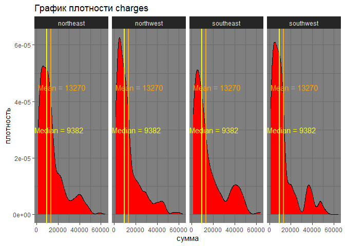<!-- -->

#Задание 7

Построить scatter plot отношения переменных age и charges:

```r
ggplot()+
  geom_point(data=cost,
             aes(x=age, y=charges))+
  xlim(30,50)+
  scale_x_continuous(limits = c(40, 50))+
  ggtitle("Scatter plot (age, charges)")+
  labs(x="возраст", y="сумма")+
  theme_light()+
  theme(axis.text.x = element_text(size=14)) 
```

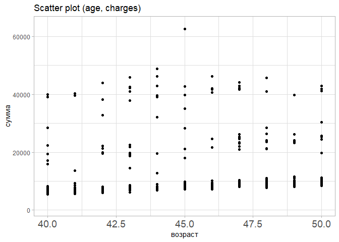<!-- -->


#Задание 8

Добавим линию тренда:

```r
cost %>%
  ggplot(aes(x=age, y=charges))+
  geom_point()+
  ggtitle("Scatter plot (age, charges)")+
  labs(x="возраст", y="сумма")+
  theme_light()+
  theme(axis.text.x = element_text(size=14))+
  geom_smooth(method=lm,
              color="purple"
              )
```

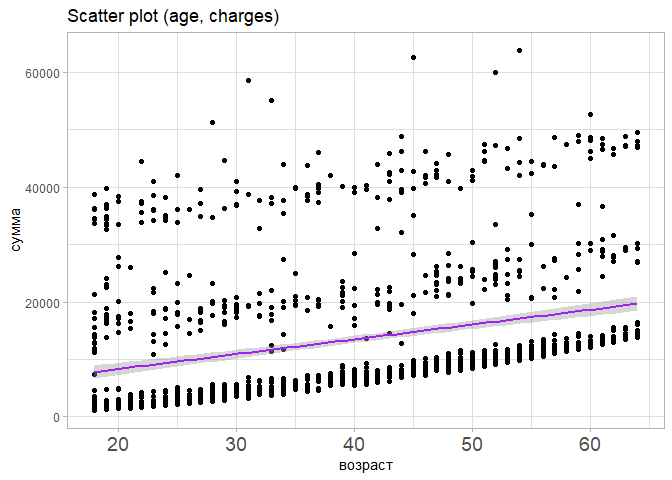<!-- -->
Статистически можно бы проверить: "чем старше человек, тем больше сумма выплат".            

#Задание 9

Разобьём на курящих и некурящих:

```r
cost %>%
  ggplot(aes(x=age, 
             y=charges,
             color=smoker,
             group=smoker))+
  geom_point(size=1)+
  ggtitle("Scatter plot (age, charges)")+
  labs(x="возраст", y="сумма")+
  theme_light()+
  theme(axis.text.x = element_text(size=14))+
  geom_smooth(method=lm,
              alpha=0.2,
              fullrange=T,
              se=TRUE
              )
```

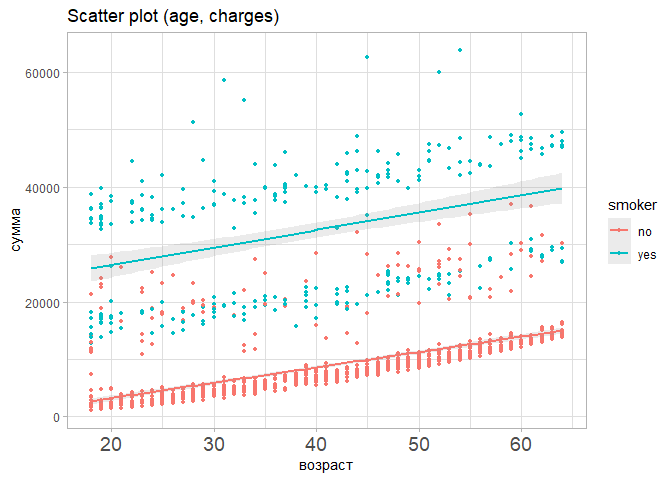<!-- -->
К статитстике: суммы выплат курщим людям выше, чем некурящим.

#Задание 10

Сделаем аналогичные графики (з.7-9), но вместо переменной age используем переменную bmi. 

##из задания 7
Построим scatter plot отношения переменных bmi и charges:

```r
ggplot()+
  geom_point(data=cost,
             aes(x=bmi, y=charges))+
  xlim(30,50)+
  scale_y_continuous(limits = c(4000, 50000))+
  ggtitle("Scatter plot (bmi, charges)")+
  labs(x="ИМТ", y="сумма")+
  theme_light()+
  theme(axis.text.x = element_text(size=14)) 
```

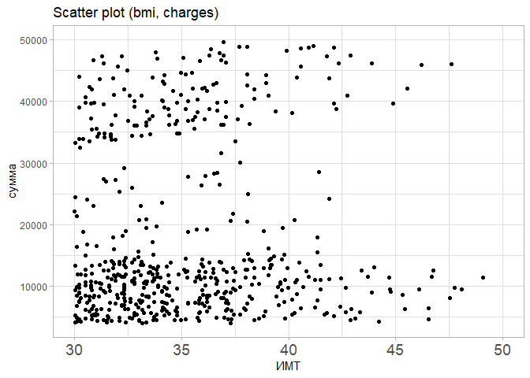<!-- -->

## Из задания 8
Добавим линию тренда

```r
cost %>%
  ggplot(aes(x=bmi, y=charges))+
  geom_point()+
  ggtitle("Scatter plot (bmi, charges)")+
  labs(x="ИМТ", y="сумма")+
  theme_light()+
  theme(axis.text.x = element_text(size=14))+
  geom_smooth(method=lm,
              color="purple"
              )
```

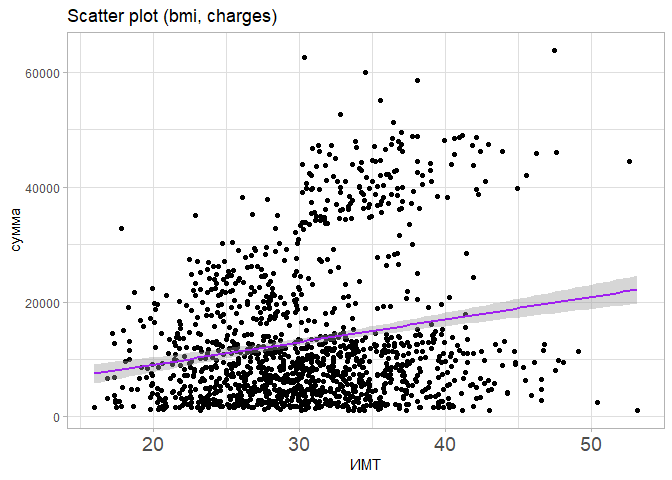<!-- -->
Можно бы проверить статистически: чем больше ИМТ, тем больше сумма выплат.

              
## Из задания 9
Разобьём на курящих и некурящих:

```r
cost %>%
  ggplot(aes(x=bmi, 
             y=charges,
             color=smoker,
             group=smoker))+
  geom_point(size=1)+
  ggtitle("Scatter plot (bmi, charges)")+
  labs(x="ИМТ", y="сумма")+
  theme_light()+
  theme(axis.text.x = element_text(size=14))+
  geom_smooth(method=lm,
              alpha=0.2,
              fullrange=T,
              se=TRUE
              )
```

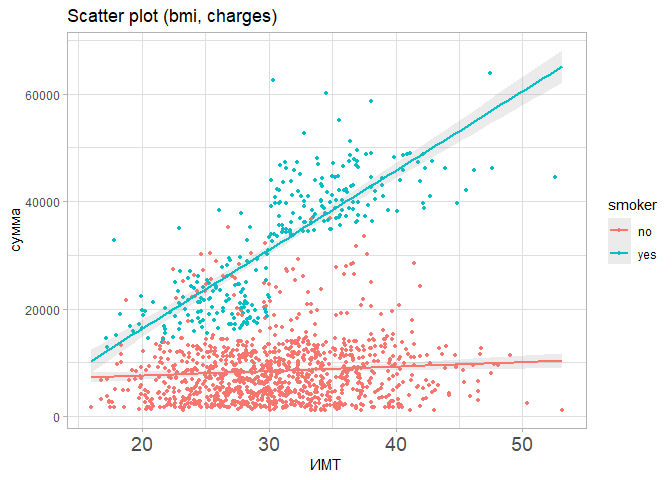<!-- -->
Хорошо видно, что у курящих сумма выплат возрастает быстрее с ростои ИМТ, чем у некурящих.

#Задания 11-13

##Вопрос 1:
*В каком регионе больше курящих мужчин, а в каком женщин (в данной подборке)?*

```r
cost %>%
  filter(smoker == 'yes')%>%
  ggplot()+
  geom_bar(aes(x=region, fill=sex), 
           position="dodge")+
  ggtitle("Распределение курящих людей по регионам")+
  labs(x="регион", y="количество курящих")+
  theme_test()
```

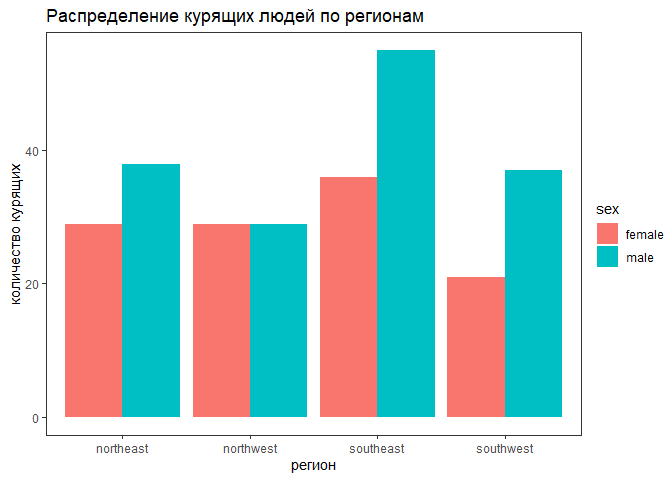<!-- -->
Ответ: больше всего курящих (и женщин, и мужчин) живёт в southeast.При этом среди курящих больше мужчин в этой регионе (и в остальнах, кроме northwest).
График: поскольку признак регион не непрерывный, и хотим увидеть количество курящих, поэтому используем bar plot. И так ещё можем одновременно смотреть и женщин, и мужчин.

##Вопрос 2:
*2. Как распределены выплаты мужчинам по отношению к курению?*

```r
cost%>%
  filter(sex == 'male')%>%
  ggplot()+
  geom_density(aes(x=charges, fill=smoker),
               alpha=0.5
               )+
  ggtitle("Распределение выплат мужчинам по отношению к курению")+
  labs(x="сумма выплат", y='плотность')+
  theme_classic()
```

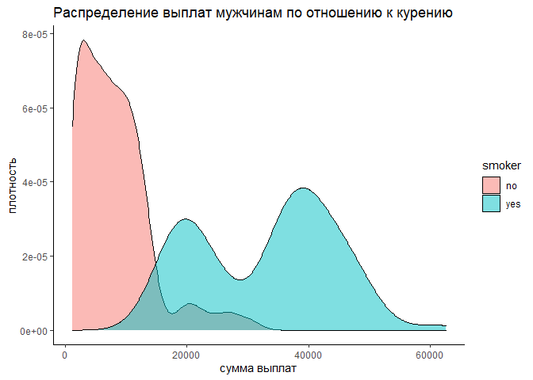<!-- -->
Ответ: некурящим мужчинам выплачивают меньшие суммы, но чаще, курящим большие суммы, но реже. При этом сумма выплат курильщикам имеет бимодальное распределение, а некурящим унимодальное. 
График: для анализа распределения числовой переменной (суммы выплат) можно использовать density plot или histogram. На desity plot посмотреть тип распределения нагляднее. 

##Вопрос 3:
*3. Есть ли разница в взаимосвязи суммы выплат и ИМТ у женщин с детьми и без?*

```r
cost <- cost %>%
  mutate(
    child_group = case_when(
      children ==0 ~ "w/o child",
      children > 0 ~ "w child",
    ))

cost %>%
  filter(sex == 'female')%>%
  ggplot(aes(x=bmi, 
             y=charges,
             color=child_group,
             group=child_group))+
  geom_point(size=1)+
  ggtitle("Зависимость суммы выплат от ИМТ у женщин с детьми и без")+
  labs(x="ИМТ", y="сумма")+
  theme_light()+
  theme(axis.text.x = element_text(size=14))+
  geom_smooth(method=lm,
              alpha=0.2,
              fullrange=T,
              se=TRUE
              )
```

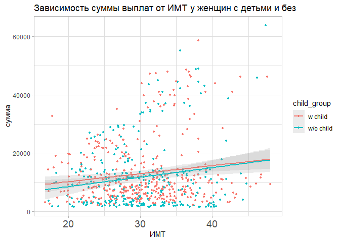<!-- -->
Ответ: При повышении ИМТ сумма выплат увеличивается в обеих группах, но заметной разницы между группами не наблюдается. 
График: взаимосвязь между двумя показателями можно увидеть на scatter plot, чтобы проще увидеть взаимосвязь между переменными и разницу между группами строим линию тренда.

#Задание 14


```r
cost <- cost %>%
  mutate(
    age_group = case_when(
      age >20 & age < 35 ~ "age: 21-34",
      age >34 & age < 50 ~ "age: 34-49",
      age >49 ~ "age: 50+"
    ),
    logar= log(charges,2.7))
table(cost$children_group)
```

```
## < table of extent 0 >
```

```r
cost %>%
  filter(age >=21) %>%
  ggplot(aes(x=bmi, y=logar))+
  geom_point(
             #color=age_group,
             #group=age_group,
             color="#330066",
             alpha=0.5,
             size=1)+
  scale_y_continuous(limits = c(7, 11))+
  ggtitle("Отношение индекса массы тела к логарифму трат по возрастным группам")+
  labs(x="bmi", y="log(charges)")+
  #scale_y_continuous(trans='log10')+
  #coord_trans(y='log2')+
  theme_light()+
  facet_grid(.~ age_group)+
  #scale_fill_discrete(labels = c("A", "B", "C"))+
  theme_minimal()+
  theme(legend.position="bottom")+
  geom_smooth(method=lm, aes(
              #color="black",
              colour=age_group,
              group=age_group
  )
              
              )
```

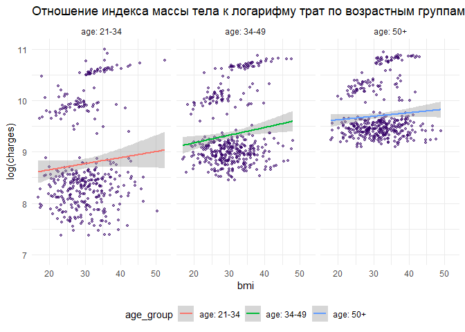<!-- -->
