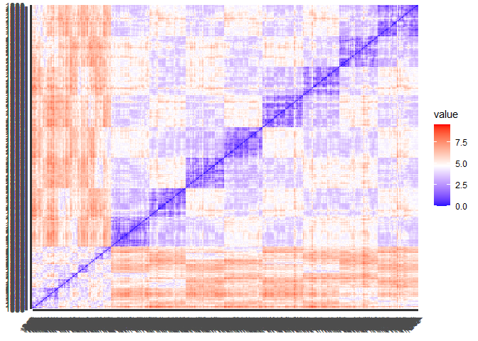

# Задание 1


Загрузим датасет:

```r
insur <- read.csv("insurance_cost.csv")
head(insur)
```

```
##   age    sex    bmi children smoker    region   charges
## 1  19 female 27.900        0    yes southwest 16884.924
## 2  18   male 33.770        1     no southeast  1725.552
## 3  28   male 33.000        3     no southeast  4449.462
## 4  33   male 22.705        0     no northwest 21984.471
## 5  32   male 28.880        0     no northwest  3866.855
## 6  31 female 25.740        0     no southeast  3756.622
```

Это данные по базовым показателям здоровья индивида и сумме, которую страховая компания заплатила за его лечение в год. 


Вспомним немного описание данных:

```r
skimr::skim(insur)
```


Table: Data summary

|                         |      |
|:------------------------|:-----|
|Name                     |insur |
|Number of rows           |1338  |
|Number of columns        |7     |
|_______________________  |      |
|Column type frequency:   |      |
|character                |3     |
|numeric                  |4     |
|________________________ |      |
|Group variables          |None  |


**Variable type: character**

|skim_variable | n_missing| complete_rate| min| max| empty| n_unique| whitespace|
|:-------------|---------:|-------------:|---:|---:|-----:|--------:|----------:|
|sex           |         0|             1|   4|   6|     0|        2|          0|
|smoker        |         0|             1|   2|   3|     0|        2|          0|
|region        |         0|             1|   9|   9|     0|        4|          0|


**Variable type: numeric**

|skim_variable | n_missing| complete_rate|     mean|       sd|      p0|     p25|     p50|      p75|     p100|hist  |
|:-------------|---------:|-------------:|--------:|--------:|-------:|-------:|-------:|--------:|--------:|:-----|
|age           |         0|             1|    39.21|    14.05|   18.00|   27.00|   39.00|    51.00|    64.00|▇▅▅▆▆ |
|bmi           |         0|             1|    30.66|     6.10|   15.96|   26.30|   30.40|    34.69|    53.13|▂▇▇▂▁ |
|children      |         0|             1|     1.09|     1.21|    0.00|    0.00|    1.00|     2.00|     5.00|▇▂▂▁▁ |
|charges       |         0|             1| 13270.42| 12110.01| 1121.87| 4740.29| 9382.03| 16639.91| 63770.43|▇▂▁▁▁ |

Нулевых значений в возрасте, ИМТ и выплатах нет. Чистить не нужно.


# Задание 2


Сделаем интерактивный график отношения ИМТ и затрат на страховку:

```r
plot_ly(data = insur,
  x = ~ bmi,
  y = ~ charges,
  type = "scatter",
  mode = 'markers',#без этой строки у меня не работает интерактив
  color = ~ smoker,
  colors = "Set2"#и без указания палетки тоже не сработало бы
)
```

```{=html}
<div id="htmlwidget-8e61fd514380af831d61" style="width:672px;height:480px;" class="plotly html-widget"></div>
<script type="application/json" data-for="htmlwidget-8e61fd514380af831d61">{"x":{"visdat":{"496034b119dc":["function () ","plotlyVisDat"]},"cur_data":"496034b119dc","attrs":{"496034b119dc":{"x":{},"y":{},"mode":"markers","color":{},"colors":"Set2","alpha_stroke":1,"sizes":[10,100],"spans":[1,20],"type":"scatter"}},"layout":{"margin":{"b":40,"l":60,"t":25,"r":10},"xaxis":{"domain":[0,1],"automargin":true,"title":"bmi"},"yaxis":{"domain":[0,1],"automargin":true,"title":"charges"},"hovermode":"closest","showlegend":true},"source":"A","config":{"modeBarButtonsToAdd":["hoverclosest","hovercompare"],"showSendToCloud":false},"data":[{"x":[33.77,33,22.705,28.88,25.74,33.44,27.74,29.83,25.84,26.22,34.4,39.82,24.6,30.78,23.845,40.3,36.005,32.4,34.1,28.025,27.72,23.085,32.775,17.385,26.315,28.6,28.31,20.425,32.965,20.8,26.6,36.63,21.78,30.8,37.05,37.3,38.665,34.77,24.53,35.625,33.63,28.69,31.825,37.335,27.36,33.66,24.7,25.935,28.9,39.1,26.315,36.19,28.5,28.1,32.01,27.4,34.01,29.59,35.53,39.805,32.965,26.885,38.285,41.23,27.2,27.74,26.98,39.49,24.795,34.77,37.62,30.8,38.28,31.6,25.46,30.115,27.5,28.4,30.875,27.94,33.63,29.7,30.8,35.72,32.205,28.595,49.06,27.17,23.37,37.1,23.75,28.975,33.915,28.785,37.4,34.7,26.505,22.04,35.9,25.555,28.785,28.05,34.1,25.175,31.9,36,22.42,32.49,29.735,38.83,37.73,37.43,28.4,24.13,29.7,37.145,25.46,39.52,27.83,39.6,29.8,29.64,28.215,37,33.155,31.825,18.905,41.47,30.3,15.96,34.8,33.345,27.835,29.2,28.9,33.155,28.595,38.28,19.95,26.41,30.69,29.92,30.9,32.2,32.11,31.57,26.2,25.74,26.6,34.43,30.59,32.8,28.6,18.05,39.33,32.11,32.23,24.035,22.3,28.88,26.4,31.8,41.23,33,30.875,28.5,26.73,30.9,37.1,26.6,23.1,29.92,23.21,33.7,33.25,30.8,33.88,38.06,41.91,31.635,25.46,36.195,27.83,17.8,27.5,24.51,26.73,38.39,38.06,22.135,26.8,35.3,30.02,38.06,35.86,20.9,28.975,30.3,25.365,40.15,24.415,25.2,38.06,32.395,30.2,25.84,29.37,37.05,27.455,27.55,26.6,20.615,24.3,31.79,21.56,27.645,32.395,31.2,26.62,48.07,26.22,26.4,33.4,29.64,28.82,26.8,22.99,28.88,27.55,37.51,33,38,33.345,27.5,33.33,34.865,33.06,26.6,24.7,35.86,33.25,32.205,32.775,27.645,37.335,25.27,29.64,40.945,27.2,34.105,23.21,36.7,31.16,28.785,35.72,34.5,25.74,27.55,27.72,27.6,30.02,27.55,36.765,41.47,29.26,35.75,33.345,29.92,27.835,23.18,25.6,27.7,35.245,38.28,27.6,43.89,29.83,41.91,20.79,32.3,30.5,26.4,21.89,30.78,32.3,24.985,32.015,30.4,21.09,22.23,33.155,33.33,30.115,31.46,33,43.34,22.135,34.4,39.05,25.365,22.61,30.21,35.625,37.43,31.445,31.35,32.3,19.855,34.4,31.02,25.6,38.17,20.6,47.52,32.965,32.3,20.4,38.38,24.31,23.6,21.12,30.03,17.48,23.9,35.15,35.64,34.1,39.16,30.59,30.2,24.31,27.265,29.165,16.815,30.4,33.1,20.235,26.9,30.5,28.595,33.11,31.73,28.9,46.75,29.45,32.68,43.01,36.52,33.1,29.64,25.65,29.6,38.6,29.6,24.13,23.4,29.735,46.53,37.4,30.14,30.495,39.6,33,36.63,38.095,25.935,25.175,28.7,33.82,24.32,24.09,32.67,30.115,29.8,33.345,35.625,36.85,32.56,41.325,37.51,31.35,39.5,34.3,31.065,21.47,28.7,31.16,32.9,25.08,25.08,43.4,27.93,23.6,28.7,23.98,39.2,26.03,28.93,30.875,31.35,23.75,25.27,28.7,32.11,33.66,22.42,30.4,35.7,35.31,30.495,31,30.875,27.36,44.22,33.915,37.73,33.88,30.59,25.8,39.425,25.46,31.73,29.7,36.19,40.48,28.025,38.9,30.2,28.05,31.35,38,31.79,36.3,30.21,35.435,46.7,28.595,30.8,28.93,21.4,31.73,41.325,23.8,33.44,34.21,35.53,19.95,32.68,30.5,44.77,32.12,30.495,40.565,30.59,31.9,29.1,37.29,43.12,36.86,34.295,27.17,26.84,30.2,23.465,25.46,30.59,45.43,23.65,20.7,28.27,20.235,35.91,30.69,29,19.57,31.13,40.26,33.725,29.48,33.25,32.6,37.525,39.16,31.635,25.3,39.05,34.1,25.175,26.98,29.37,34.8,33.155,19,33,28.595,37.1,31.4,21.3,28.785,26.03,28.88,42.46,38,36.1,29.3,35.53,22.705,39.7,38.19,24.51,38.095,33.66,42.4,33.915,34.96,35.31,30.78,26.22,23.37,28.5,32.965,42.68,39.6,31.13,36.3,35.2,42.4,33.155,35.91,28.785,46.53,23.98,31.54,33.66,28.7,29.81,31.57,31.16,29.7,31.02,21.375,40.81,36.1,23.18,17.4,20.3,24.32,18.5,26.41,26.125,41.69,24.1,27.36,36.2,32.395,23.655,34.8,40.185,32.3,33.725,39.27,34.87,44.745,41.47,26.41,29.545,32.9,28.69,30.495,27.74,35.2,23.54,30.685,40.47,22.6,28.9,22.61,24.32,36.67,33.44,40.66,36.6,37.4,35.4,27.075,28.405,40.28,36.08,21.4,30.1,27.265,32.1,34.77,23.7,24.035,26.62,26.41,30.115,27,21.755,36,30.875,28.975,37.905,22.77,33.63,27.645,22.8,37.43,34.58,35.2,26.03,25.175,31.825,32.3,29,39.7,19.475,36.1,26.7,36.48,34.2,33.33,32.3,39.805,34.32,28.88,41.14,35.97,29.26,27.7,36.955,36.86,22.515,29.92,41.8,27.6,23.18,31.92,44.22,22.895,33.1,26.18,35.97,22.3,26.51,35.815,41.42,36.575,30.14,25.84,30.8,42.94,21.01,22.515,34.43,31.46,24.225,37.1,33.7,17.67,31.13,29.81,24.32,31.825,21.85,33.1,25.84,23.845,34.39,33.82,35.97,31.5,28.31,23.465,31.35,31.1,24.7,30.495,34.2,50.38,24.1,32.775,32.3,23.75,29.6,32.23,28.1,28,33.535,19.855,25.4,29.9,37.29,43.7,23.655,24.3,36.2,29.48,24.86,30.1,21.85,28.12,27.1,33.44,28.8,29.5,34.8,27.36,22.135,26.695,30.02,39.5,33.63,29.04,24.035,32.11,44,25.555,40.26,22.515,22.515,27.265,36.85,35.1,29.355,32.585,32.34,39.8,28.31,26.695,27.5,24.605,33.99,28.2,34.21,25,33.2,31,35.815,23.2,32.11,23.4,20.1,39.16,34.21,46.53,32.5,25.8,35.3,37.18,27.5,29.735,24.225,26.18,29.48,23.21,46.09,40.185,22.61,39.93,35.8,35.8,31.255,18.335,28.405,39.49,26.79,36.67,39.615,25.9,35.2,24.795,36.765,27.1,25.365,25.745,34.32,28.16,23.56,20.235,40.5,35.42,40.15,29.15,39.995,29.92,25.46,21.375,30.59,30.115,25.8,30.115,27.645,34.675,19.8,27.835,31.6,28.27,23.275,34.1,36.85,36.29,26.885,25.8,29.6,19.19,31.73,29.26,24.985,27.74,22.8,33.33,32.3,27.6,25.46,24.605,34.2,35.815,32.68,37,23.32,45.32,34.6,18.715,31.6,17.29,27.93,38.38,23,28.88,27.265,23.085,25.8,35.245,25.08,22.515,36.955,26.41,29.83,21.47,27.645,28.9,31.79,39.49,33.82,32.01,27.94,28.595,25.6,25.3,37.29,42.655,21.66,31.9,31.445,31.255,28.88,18.335,29.59,32,26.03,33.66,21.78,27.835,19.95,31.5,30.495,28.975,31.54,47.74,22.1,29.83,32.7,33.7,31.35,33.77,30.875,33.99,28.6,38.94,36.08,29.8,31.24,29.925,26.22,30,20.35,32.3,26.315,24.51,32.67,29.64,19.95,38.17,32.395,25.08,29.9,35.86,32.8,18.6,23.87,45.9,40.28,18.335,33.82,28.12,25,22.23,30.25,37.07,32.6,24.86,32.34,32.3,32.775,31.92,21.5,34.1,30.305,36.48,35.815,27.93,22.135,23.18,30.59,41.1,34.58,42.13,38.83,28.215,28.31,26.125,40.37,24.6,35.2,34.105,41.91,29.26,32.11,27.1,27.4,34.865,41.325,29.925,30.3,27.36,23.56,32.68,28,32.775,21.755,32.395,36.575,21.755,27.93,33.55,29.355,25.8,24.32,40.375,32.11,32.3,17.86,34.8,37.1,30.875,34.1,21.47,33.3,31.255,39.14,25.08,37.29,30.21,21.945,24.97,25.3,23.94,39.82,16.815,37.18,34.43,30.305,24.605,23.3,27.83,31.065,21.66,28.215,22.705,42.13,21.28,33.11,33.33,24.3,25.7,29.4,39.82,19.8,29.3,27.72,37.9,36.385,27.645,37.715,23.18,20.52,37.1,28.05,29.9,33.345,30.5,33.3,27.5,33.915,34.485,25.52,27.61,23.7,30.4,29.735,26.79,33.33,30.03,24.32,17.29,25.9,34.32,19.95,23.21,25.745,25.175,22,26.125,26.51,27.455,25.745,20.8,27.72,32.2,26.315,26.695,42.9,28.31,20.6,53.13,39.71,26.315,31.065,38.83,25.935,33.535,32.87,30.03,24.225,38.6,25.74,33.4,44.7,30.97,31.92,36.85,25.8],"y":[1725.5523,4449.462,21984.47061,3866.8552,3756.6216,8240.5896,7281.5056,6406.4107,28923.13692,2721.3208,1826.843,11090.7178,1837.237,10797.3362,2395.17155,10602.385,13228.84695,4149.736,1137.011,6203.90175,14001.1338,14451.83515,12268.63225,2775.19215,2198.18985,4687.797,13770.0979,1625.43375,15612.19335,2302.3,3046.062,4949.7587,6272.4772,6313.759,6079.6715,20630.28351,3393.35635,3556.9223,12629.8967,2211.13075,3579.8287,8059.6791,13607.36875,5989.52365,8606.2174,4504.6624,30166.61817,4133.64165,1743.214,14235.072,6389.37785,5920.1041,6799.458,11741.726,11946.6259,7726.854,11356.6609,3947.4131,1532.4697,2755.02095,6571.02435,4441.21315,7935.29115,11033.6617,11073.176,8026.6666,11082.5772,2026.9741,10942.13205,5729.0053,3766.8838,12105.32,10226.2842,6186.127,3645.0894,21344.8467,5003.853,2331.519,3877.30425,2867.1196,10825.2537,11881.358,4646.759,2404.7338,11488.31695,30259.99556,11381.3254,8601.3293,6686.4313,7740.337,1705.6245,2257.47525,10115.00885,3385.39915,9634.538,6082.405,12815.44495,13616.3586,11163.568,1632.56445,2457.21115,2155.6815,1261.442,2045.68525,27322.73386,2166.732,27375.90478,3490.5491,18157.876,5138.2567,9877.6077,10959.6947,1842.519,5125.2157,7789.635,6334.34355,7077.1894,6948.7008,19749.38338,10450.552,5152.134,5028.1466,10407.08585,4830.63,6128.79745,2719.27975,4827.90495,13405.3903,8116.68,1694.7964,5246.047,2855.43755,6455.86265,10436.096,8823.279,8538.28845,11735.87905,1631.8212,4005.4225,7419.4779,7731.4271,3981.9768,5325.651,6775.961,4922.9159,12557.6053,4883.866,2137.6536,12044.342,1137.4697,1639.5631,5649.715,8516.829,9644.2525,14901.5167,2130.6759,8871.1517,13012.20865,7147.105,4337.7352,11743.299,13880.949,6610.1097,1980.07,8162.71625,3537.703,5002.7827,8520.026,7371.772,10355.641,2483.736,3392.9768,25081.76784,5012.471,10564.8845,5253.524,11987.1682,2689.4954,24227.33724,7358.17565,9225.2564,7443.64305,14001.2867,1727.785,12333.828,6710.1919,1615.7667,4463.2051,7152.6714,5354.07465,35160.13457,7196.867,24476.47851,12648.7034,1986.9334,1832.094,4040.55825,4260.744,13047.33235,5400.9805,11520.09985,11837.16,20462.99766,14590.63205,7441.053,9282.4806,1719.4363,7265.7025,9617.66245,2523.1695,9715.841,2803.69785,2150.469,12928.7911,9855.1314,4237.12655,11879.10405,9625.92,7742.1098,9432.9253,14256.1928,25992.82104,3172.018,20277.80751,2156.7518,3906.127,1704.5681,9249.4952,6746.7425,12265.5069,4349.462,12646.207,19442.3535,20177.67113,4151.0287,11944.59435,7749.1564,8444.474,1737.376,8124.4084,9722.7695,8835.26495,10435.06525,7421.19455,4667.60765,4894.7533,24671.66334,11566.30055,2866.091,6600.20595,3561.8889,9144.565,13429.0354,11658.37915,19144.57652,13822.803,12142.5786,13937.6665,8232.6388,18955.22017,13352.0998,13217.0945,13981.85035,10977.2063,6184.2994,4889.9995,8334.45755,5478.0368,1635.73365,11830.6072,8932.084,3554.203,12404.8791,14133.03775,24603.04837,8944.1151,9620.3307,1837.2819,1607.5101,10043.249,4751.07,2597.779,3180.5101,9778.3472,13430.265,8017.06115,8116.26885,3481.868,13415.0381,12029.2867,7639.41745,1391.5287,16455.70785,27000.98473,20781.48892,5846.9176,8302.53565,1261.859,11856.4115,30284.64294,3176.8159,4618.0799,10736.87075,2138.0707,8964.06055,9290.1395,9411.005,7526.70645,8522.003,16586.49771,14988.432,1631.6683,9264.797,8083.9198,14692.66935,10269.46,3260.199,11396.9002,4185.0979,8539.671,6652.5288,4074.4537,1621.3402,5080.096,2134.9015,7345.7266,9140.951,14418.2804,2727.3951,8968.33,9788.8659,6555.07035,7323.734819,3167.45585,18804.7524,23082.95533,4906.40965,5969.723,12638.195,4243.59005,13919.8229,2254.7967,5926.846,12592.5345,2897.3235,4738.2682,1149.3959,28287.89766,7345.084,12730.9996,11454.0215,5910.944,4762.329,7512.267,4032.2407,1969.614,1769.53165,4686.3887,21797.0004,11881.9696,11840.77505,10601.412,7682.67,10381.4787,15230.32405,11165.41765,1632.03625,13224.693,12643.3778,23288.9284,2201.0971,2497.0383,2203.47185,1744.465,20878.78443,2534.39375,1534.3045,1824.2854,15555.18875,9304.7019,1622.1885,9880.068,9563.029,4347.02335,12475.3513,1253.936,10461.9794,1748.774,24513.09126,2196.4732,12574.049,1967.0227,4931.647,8027.968,8211.1002,13470.86,6837.3687,5974.3847,6796.86325,2643.2685,3077.0955,3044.2133,11455.28,11763.0009,2498.4144,9361.3268,1256.299,11362.755,27724.28875,8413.46305,5240.765,3857.75925,25656.57526,3994.1778,9866.30485,5397.6167,11482.63485,24059.68019,9861.025,8342.90875,1708.0014,14043.4767,12925.886,19214.70553,13831.1152,6067.12675,5972.378,8825.086,8233.0975,27346.04207,6196.448,3056.3881,13887.204,10231.4999,3268.84665,11538.421,3213.62205,13390.559,3972.9247,12957.118,11187.6567,17878.90068,3847.674,8334.5896,3935.1799,1646.4297,9193.8385,10923.9332,2494.022,9058.7303,2801.2588,2128.43105,6373.55735,7256.7231,11552.904,3761.292,2219.4451,4753.6368,31620.00106,13224.05705,12222.8983,1664.9996,9724.53,3206.49135,12913.9924,1639.5631,6356.2707,17626.23951,1242.816,4779.6023,3861.20965,13635.6379,5976.8311,11842.442,8428.0693,2566.4707,5709.1644,8823.98575,7640.3092,5594.8455,7441.501,33471.97189,1633.0444,9174.13565,11070.535,16085.1275,9283.562,3558.62025,4435.0942,8547.6913,6571.544,2207.69745,6753.038,1880.07,11658.11505,10713.644,3659.346,9182.17,12129.61415,3736.4647,6748.5912,11326.71487,11365.952,10085.846,1977.815,3366.6697,7173.35995,9391.346,14410.9321,2709.1119,24915.04626,12949.1554,6666.243,13143.86485,4466.6214,18806.14547,10141.1362,6123.5688,8252.2843,1712.227,12430.95335,9800.8882,10579.711,8280.6227,8527.532,12244.531,3410.324,4058.71245,26392.26029,14394.39815,6435.6237,22192.43711,5148.5526,1136.3994,8703.456,6500.2359,4837.5823,3943.5954,4399.731,6185.3208,7222.78625,12485.8009,12363.547,10156.7832,2585.269,1242.26,9863.4718,4766.022,11244.3769,7729.64575,5438.7491,26236.57997,2104.1134,8068.185,2362.22905,2352.96845,3577.999,3201.24515,29186.48236,10976.24575,3500.6123,2020.5523,9541.69555,9504.3103,5385.3379,8930.93455,5375.038,10264.4421,6113.23105,5469.0066,1727.54,10107.2206,8310.83915,1984.4533,2457.502,12146.971,9566.9909,13112.6048,10848.1343,12231.6136,9875.6804,11264.541,12979.358,1263.249,10106.13425,6664.68595,2217.6012,6781.3542,10065.413,4234.927,9447.25035,14007.222,9583.8933,3484.331,8604.48365,3757.8448,8827.2099,9910.35985,11737.84884,1627.28245,8556.907,3062.50825,1906.35825,14210.53595,11833.7823,17128.42608,5031.26955,7985.815,5428.7277,3925.7582,2416.955,3070.8087,9095.06825,11842.62375,8062.764,7050.642,14319.031,6933.24225,27941.28758,11150.78,12797.20962,7261.741,10560.4917,6986.697,7448.40395,5934.3798,9869.8102,1146.7966,9386.1613,4350.5144,6414.178,12741.16745,1917.3184,5209.57885,13457.9608,5662.225,1252.407,2731.9122,7209.4918,4266.1658,4719.52405,11848.141,7046.7222,14313.8463,2103.08,1815.8759,7731.85785,28476.73499,2136.88225,1131.5066,3309.7926,9414.92,6360.9936,11013.7119,4428.88785,5584.3057,1877.9294,2842.76075,3597.596,7445.918,2680.9493,1621.8827,8219.2039,12523.6048,16069.08475,6117.4945,13393.756,5266.3656,4719.73655,11743.9341,5377.4578,7160.3303,4402.233,11657.7189,6402.29135,12622.1795,1526.312,12323.936,10072.05505,9872.701,2438.0552,2974.126,10601.63225,14119.62,11729.6795,1875.344,18218.16139,10965.446,7151.092,12269.68865,5458.04645,8782.469,6600.361,1141.4451,11576.13,13129.60345,4391.652,8457.818,3392.3652,5966.8874,6849.026,8891.1395,2690.1138,26140.3603,6653.7886,6282.235,6311.952,3443.064,2789.0574,2585.85065,4877.98105,5272.1758,1682.597,11945.1327,7243.8136,10422.91665,13555.0049,13063.883,2221.56445,1634.5734,2117.33885,8688.85885,4661.28635,8125.7845,12644.589,4564.19145,4846.92015,7633.7206,15170.069,2639.0429,14382.70905,7626.993,5257.50795,2473.3341,13041.921,5245.2269,13451.122,13462.52,5488.262,4320.41085,6250.435,25333.33284,2913.569,12032.326,13470.8044,6289.7549,2927.0647,6238.298,10096.97,7348.142,4673.3922,12233.828,32108.66282,8965.79575,2304.0022,9487.6442,1121.8739,9549.5651,2217.46915,1628.4709,12982.8747,11674.13,7160.094,6358.77645,11534.87265,4527.18295,3875.7341,12609.88702,28468.91901,2730.10785,3353.284,14474.675,9500.57305,26467.09737,4746.344,7518.02535,3279.86855,8596.8278,10702.6424,4992.3764,2527.81865,1759.338,2322.6218,7804.1605,2902.9065,9704.66805,4889.0368,25517.11363,4500.33925,16796.41194,4915.05985,7624.63,8410.04685,28340.18885,4518.82625,3378.91,7144.86265,10118.424,5484.4673,7986.47525,7418.522,13887.9685,6551.7501,5267.81815,1972.95,21232.18226,8627.5411,4433.3877,4438.2634,23241.47453,9957.7216,8269.044,36580.28216,8765.249,5383.536,12124.9924,2709.24395,3987.926,12495.29085,26018.95052,8798.593,1711.0268,8569.8618,2020.177,21595.38229,9850.432,6877.9801,4137.5227,12950.0712,12094.478,2250.8352,22493.65964,1704.70015,3161.454,11394.06555,7325.0482,3594.17085,8023.13545,14394.5579,9288.0267,3353.4703,10594.50155,8277.523,17929.30337,2480.9791,4462.7218,1981.5819,11554.2236,6548.19505,5708.867,7045.499,8978.1851,5757.41345,14349.8544,10928.849,13974.45555,1909.52745,12096.6512,13204.28565,4562.8421,8551.347,2102.2647,15161.5344,11884.04858,4454.40265,5855.9025,4076.497,15019.76005,10796.35025,11353.2276,9748.9106,10577.087,11286.5387,3591.48,11299.343,4561.1885,1674.6323,23045.56616,3227.1211,11253.421,3471.4096,11363.2832,20420.60465,10338.9316,8988.15875,10493.9458,2904.088,8605.3615,11512.405,5312.16985,2396.0959,10807.4863,9222.4026,5693.4305,8347.1643,18903.49141,14254.6082,10214.636,5836.5204,14358.36437,1728.897,8582.3023,3693.428,20709.02034,9991.03765,19673.33573,11085.5868,7623.518,3176.2877,3704.3545,9048.0273,7954.517,27117.99378,6338.0756,9630.397,11289.10925,2261.5688,10791.96,5979.731,2203.73595,12235.8392,5630.45785,11015.1747,7228.21565,14426.07385,2459.7201,3989.841,7727.2532,5124.1887,18963.17192,2200.83085,7153.5539,5227.98875,10982.5013,4529.477,4670.64,6112.35295,11093.6229,6457.8434,4433.9159,2154.361,6496.886,2899.48935,7650.77375,2850.68375,2632.992,9447.3824,8603.8234,13844.7972,13126.67745,5327.40025,13725.47184,13019.16105,8671.19125,4134.08245,18838.70366,5699.8375,6393.60345,4934.705,6198.7518,8733.22925,2055.3249,9964.06,5116.5004,36910.60803,12347.172,5373.36425,23563.01618,1702.4553,10806.839,3956.07145,12890.05765,5415.6612,4058.1161,7537.1639,4718.20355,6593.5083,8442.667,6858.4796,4795.6568,6640.54485,7162.0122,10594.2257,11938.25595,12479.70895,11345.519,8515.7587,2699.56835,14449.8544,12224.35085,6985.50695,3238.4357,4296.2712,3171.6149,1135.9407,5615.369,9101.798,6059.173,1633.9618,1241.565,15828.82173,4415.1588,6474.013,11436.73815,11305.93455,30063.58055,10197.7722,4544.2348,3277.161,6770.1925,7337.748,10370.91255,10704.47,1880.487,8615.3,3292.52985,3021.80915,14478.33015,4747.0529,10959.33,2741.948,4357.04365,4189.1131,8283.6807,1720.3537,8534.6718,3732.6251,5472.449,7147.4728,7133.9025,1515.3449,9301.89355,11931.12525,1964.78,1708.92575,4340.4409,5261.46945,2710.82855,3208.787,2464.6188,6875.961,6940.90985,4571.41305,4536.259,11272.33139,1731.677,1163.4627,19496.71917,7201.70085,5425.02335,12981.3457,4239.89265,13143.33665,7050.0213,9377.9047,22395.74424,10325.206,12629.1656,10795.93733,11411.685,10600.5483,2205.9808,1629.8335,2007.945],"mode":"markers","type":"scatter","name":"no","marker":{"color":"rgba(102,194,165,1)","line":{"color":"rgba(102,194,165,1)"}},"textfont":{"color":"rgba(102,194,165,1)"},"error_y":{"color":"rgba(102,194,165,1)"},"error_x":{"color":"rgba(102,194,165,1)"},"line":{"color":"rgba(102,194,165,1)"},"xaxis":"x","yaxis":"y","frame":null},{"x":[27.9,26.29,42.13,35.3,31.92,36.3,35.6,36.4,36.67,39.9,35.2,28,34.43,36.955,31.68,22.88,22.42,23.98,24.75,37.62,34.8,22.895,31.16,29.83,31.3,19.95,19.3,29.92,28.025,35.09,27.94,31.35,28.3,17.765,25.3,28.69,30.495,23.37,24.42,25.175,35.53,26.6,36.85,37.7,41.895,36.08,27.74,34.8,24.64,22.22,29.07,36.67,27.74,17.29,32.2,34.21,31.825,33.63,31.92,26.84,24.32,36.955,42.35,19.8,34.2,28.12,40.565,36.765,45.54,27.7,25.41,34.39,22.61,35.97,31.4,30.8,36.48,33.8,36.385,27.36,32.3,21.7,32.9,28.31,24.89,40.15,17.955,30.685,20.235,17.195,22.6,26.98,33.88,35.86,32.775,33.5,26.695,30,28.38,25.1,28.31,28.5,38.06,25.7,34.4,23.21,30.25,28.3,26.07,42.13,47.41,25.84,46.2,34.105,40.565,38.095,30.21,21.85,28.31,23.655,37.8,36.63,25.6,33.11,34.1,33.535,38.95,26.41,28.31,25.3,22.99,38.06,32.775,32.015,43.89,31.35,35.3,31.13,35.75,38.06,39.05,21.755,24.42,38.39,31.73,35.5,29.15,34.105,26.4,27.83,38.17,27.1,28.88,24.4,27.6,20.9,28.5,24.795,42.24,26.125,35.53,31.79,28.025,30.78,32.78,29.81,32.45,30.78,35.53,23.845,33.11,24.13,47.6,37.05,28.93,28.975,26.885,38.94,20.045,40.92,24.6,31.73,26.885,22.895,34.2,29.7,42.9,30.2,27.835,30.8,34.96,24.795,22.895,25.9,20.52,20.045,22.99,32.7,28.215,20.13,31.02,36.08,26.03,23.655,35.2,21.565,37.07,30.495,28.025,30.685,24.7,52.58,30.9,29.8,41.14,37.07,31.68,18.3,36.19,30.4,34.96,19.095,38.39,25.85,33.33,35.75,31.4,36.86,42.75,32.49,32.8,32.56,44.88,27.36,26.7,24.13,29.81,28.49,35.625,25.27,30.02,27.28,33.4,25.555,34.6,24.42,34.485,21.8,41.8,36.96,33.63,29.83,27.3,23.76,31.065,27.06,29.925,27.645,21.66,36.3,39.4,34.9,30.36,30.875,27.8,24.605,21.85,28.12,30.2,34.7,23.655,26.695,40.37,29.07],"y":[16884.924,27808.7251,39611.7577,36837.467,37701.8768,38711,35585.576,51194.55914,39774.2763,48173.361,38709.176,23568.272,37742.5757,47496.49445,34303.1672,23244.7902,14711.7438,17663.1442,16577.7795,37165.1638,39836.519,21098.55405,43578.9394,30184.9367,47291.055,22412.6485,15820.699,30942.1918,17560.37975,47055.5321,19107.7796,39556.4945,17081.08,32734.1863,18972.495,20745.9891,40720.55105,19964.7463,21223.6758,15518.18025,36950.2567,21348.706,36149.4835,48824.45,43753.33705,37133.8982,20984.0936,34779.615,19515.5416,19444.2658,17352.6803,38511.6283,29523.1656,12829.4551,47305.305,44260.7499,41097.16175,43921.1837,33750.2918,17085.2676,24869.8368,36219.40545,46151.1245,17179.522,42856.838,22331.5668,48549.17835,47896.79135,42112.2356,16297.846,21978.6769,38746.3551,24873.3849,42124.5153,34838.873,35491.64,42760.5022,47928.03,48517.56315,24393.6224,41919.097,13844.506,36085.219,18033.9679,21659.9301,38126.2465,15006.57945,42303.69215,19594.80965,14455.64405,18608.262,28950.4692,46889.2612,46599.1084,39125.33225,37079.372,26109.32905,22144.032,19521.9682,25382.297,28868.6639,35147.52848,48885.13561,17942.106,36197.699,22218.1149,32548.3405,21082.16,38245.59327,48675.5177,63770.42801,23807.2406,45863.205,39983.42595,45702.02235,58571.07448,43943.8761,15359.1045,17468.9839,25678.77845,39241.442,42969.8527,23306.547,34439.8559,40182.246,34617.84065,42983.4585,20149.3229,32787.45859,24667.419,27037.9141,42560.4304,40003.33225,45710.20785,46200.9851,46130.5265,40103.89,34806.4677,40273.6455,44400.4064,40932.4295,16657.71745,19361.9988,40419.0191,36189.1017,44585.45587,18246.4955,43254.41795,19539.243,23065.4207,36307.7983,19040.876,17748.5062,18259.216,24520.264,21195.818,18310.742,17904.52705,38792.6856,23401.30575,55135.40209,43813.8661,20773.62775,39597.4072,36021.0112,27533.9129,45008.9555,37270.1512,42111.6647,24106.91255,40974.1649,15817.9857,46113.511,46255.1125,19719.6947,27218.43725,29330.98315,44202.6536,19798.05455,48673.5588,17496.306,33732.6867,21774.32215,35069.37452,39047.285,19933.458,47462.894,38998.546,20009.63365,41999.52,41034.2214,23967.38305,16138.76205,19199.944,14571.8908,16420.49455,17361.7661,34472.841,24915.22085,18767.7377,35595.5898,42211.1382,16450.8947,21677.28345,44423.803,13747.87235,37484.4493,39725.51805,20234.85475,33475.81715,21880.82,44501.3982,39727.614,25309.489,48970.2476,39871.7043,34672.1472,19023.26,41676.0811,33907.548,44641.1974,16776.30405,41949.2441,24180.9335,36124.5737,38282.7495,34166.273,46661.4424,40904.1995,36898.73308,52590.82939,40941.2854,39722.7462,17178.6824,22478.6,23887.6627,19350.3689,18328.2381,37465.34375,21771.3423,33307.5508,18223.4512,38415.474,20296.86345,41661.602,26125.67477,60021.39897,20167.33603,47269.854,49577.6624,37607.5277,18648.4217,16232.847,26926.5144,34254.05335,17043.3414,22462.04375,24535.69855,14283.4594,47403.88,38344.566,34828.654,62592.87309,46718.16325,37829.7242,21259.37795,16115.3045,21472.4788,33900.653,36397.576,18765.87545,28101.33305,43896.3763,29141.3603],"mode":"markers","type":"scatter","name":"yes","marker":{"color":"rgba(252,141,98,1)","line":{"color":"rgba(252,141,98,1)"}},"textfont":{"color":"rgba(252,141,98,1)"},"error_y":{"color":"rgba(252,141,98,1)"},"error_x":{"color":"rgba(252,141,98,1)"},"line":{"color":"rgba(252,141,98,1)"},"xaxis":"x","yaxis":"y","frame":null}],"highlight":{"on":"plotly_click","persistent":false,"dynamic":false,"selectize":false,"opacityDim":0.2,"selected":{"opacity":1},"debounce":0},"shinyEvents":["plotly_hover","plotly_click","plotly_selected","plotly_relayout","plotly_brushed","plotly_brushing","plotly_clickannotation","plotly_doubleclick","plotly_deselect","plotly_afterplot","plotly_sunburstclick"],"base_url":"https://plot.ly"},"evals":[],"jsHooks":[]}</script>
```


# Задание 3


То же через ggplotly:

```r
plot <- insur %>%
  ggplot(aes(x=bmi, y=charges, color = smoker)) + 
  geom_point() +
  theme_dark()
ggplotly(plot)
```

```{=html}
<div id="htmlwidget-c20f863d837864740e8e" style="width:672px;height:480px;" class="plotly html-widget"></div>
<script type="application/json" data-for="htmlwidget-c20f863d837864740e8e">{"x":{"data":[{"x":[33.77,33,22.705,28.88,25.74,33.44,27.74,29.83,25.84,26.22,34.4,39.82,24.6,30.78,23.845,40.3,36.005,32.4,34.1,28.025,27.72,23.085,32.775,17.385,26.315,28.6,28.31,20.425,32.965,20.8,26.6,36.63,21.78,30.8,37.05,37.3,38.665,34.77,24.53,35.625,33.63,28.69,31.825,37.335,27.36,33.66,24.7,25.935,28.9,39.1,26.315,36.19,28.5,28.1,32.01,27.4,34.01,29.59,35.53,39.805,32.965,26.885,38.285,41.23,27.2,27.74,26.98,39.49,24.795,34.77,37.62,30.8,38.28,31.6,25.46,30.115,27.5,28.4,30.875,27.94,33.63,29.7,30.8,35.72,32.205,28.595,49.06,27.17,23.37,37.1,23.75,28.975,33.915,28.785,37.4,34.7,26.505,22.04,35.9,25.555,28.785,28.05,34.1,25.175,31.9,36,22.42,32.49,29.735,38.83,37.73,37.43,28.4,24.13,29.7,37.145,25.46,39.52,27.83,39.6,29.8,29.64,28.215,37,33.155,31.825,18.905,41.47,30.3,15.96,34.8,33.345,27.835,29.2,28.9,33.155,28.595,38.28,19.95,26.41,30.69,29.92,30.9,32.2,32.11,31.57,26.2,25.74,26.6,34.43,30.59,32.8,28.6,18.05,39.33,32.11,32.23,24.035,22.3,28.88,26.4,31.8,41.23,33,30.875,28.5,26.73,30.9,37.1,26.6,23.1,29.92,23.21,33.7,33.25,30.8,33.88,38.06,41.91,31.635,25.46,36.195,27.83,17.8,27.5,24.51,26.73,38.39,38.06,22.135,26.8,35.3,30.02,38.06,35.86,20.9,28.975,30.3,25.365,40.15,24.415,25.2,38.06,32.395,30.2,25.84,29.37,37.05,27.455,27.55,26.6,20.615,24.3,31.79,21.56,27.645,32.395,31.2,26.62,48.07,26.22,26.4,33.4,29.64,28.82,26.8,22.99,28.88,27.55,37.51,33,38,33.345,27.5,33.33,34.865,33.06,26.6,24.7,35.86,33.25,32.205,32.775,27.645,37.335,25.27,29.64,40.945,27.2,34.105,23.21,36.7,31.16,28.785,35.72,34.5,25.74,27.55,27.72,27.6,30.02,27.55,36.765,41.47,29.26,35.75,33.345,29.92,27.835,23.18,25.6,27.7,35.245,38.28,27.6,43.89,29.83,41.91,20.79,32.3,30.5,26.4,21.89,30.78,32.3,24.985,32.015,30.4,21.09,22.23,33.155,33.33,30.115,31.46,33,43.34,22.135,34.4,39.05,25.365,22.61,30.21,35.625,37.43,31.445,31.35,32.3,19.855,34.4,31.02,25.6,38.17,20.6,47.52,32.965,32.3,20.4,38.38,24.31,23.6,21.12,30.03,17.48,23.9,35.15,35.64,34.1,39.16,30.59,30.2,24.31,27.265,29.165,16.815,30.4,33.1,20.235,26.9,30.5,28.595,33.11,31.73,28.9,46.75,29.45,32.68,43.01,36.52,33.1,29.64,25.65,29.6,38.6,29.6,24.13,23.4,29.735,46.53,37.4,30.14,30.495,39.6,33,36.63,38.095,25.935,25.175,28.7,33.82,24.32,24.09,32.67,30.115,29.8,33.345,35.625,36.85,32.56,41.325,37.51,31.35,39.5,34.3,31.065,21.47,28.7,31.16,32.9,25.08,25.08,43.4,27.93,23.6,28.7,23.98,39.2,26.03,28.93,30.875,31.35,23.75,25.27,28.7,32.11,33.66,22.42,30.4,35.7,35.31,30.495,31,30.875,27.36,44.22,33.915,37.73,33.88,30.59,25.8,39.425,25.46,31.73,29.7,36.19,40.48,28.025,38.9,30.2,28.05,31.35,38,31.79,36.3,30.21,35.435,46.7,28.595,30.8,28.93,21.4,31.73,41.325,23.8,33.44,34.21,35.53,19.95,32.68,30.5,44.77,32.12,30.495,40.565,30.59,31.9,29.1,37.29,43.12,36.86,34.295,27.17,26.84,30.2,23.465,25.46,30.59,45.43,23.65,20.7,28.27,20.235,35.91,30.69,29,19.57,31.13,40.26,33.725,29.48,33.25,32.6,37.525,39.16,31.635,25.3,39.05,34.1,25.175,26.98,29.37,34.8,33.155,19,33,28.595,37.1,31.4,21.3,28.785,26.03,28.88,42.46,38,36.1,29.3,35.53,22.705,39.7,38.19,24.51,38.095,33.66,42.4,33.915,34.96,35.31,30.78,26.22,23.37,28.5,32.965,42.68,39.6,31.13,36.3,35.2,42.4,33.155,35.91,28.785,46.53,23.98,31.54,33.66,28.7,29.81,31.57,31.16,29.7,31.02,21.375,40.81,36.1,23.18,17.4,20.3,24.32,18.5,26.41,26.125,41.69,24.1,27.36,36.2,32.395,23.655,34.8,40.185,32.3,33.725,39.27,34.87,44.745,41.47,26.41,29.545,32.9,28.69,30.495,27.74,35.2,23.54,30.685,40.47,22.6,28.9,22.61,24.32,36.67,33.44,40.66,36.6,37.4,35.4,27.075,28.405,40.28,36.08,21.4,30.1,27.265,32.1,34.77,23.7,24.035,26.62,26.41,30.115,27,21.755,36,30.875,28.975,37.905,22.77,33.63,27.645,22.8,37.43,34.58,35.2,26.03,25.175,31.825,32.3,29,39.7,19.475,36.1,26.7,36.48,34.2,33.33,32.3,39.805,34.32,28.88,41.14,35.97,29.26,27.7,36.955,36.86,22.515,29.92,41.8,27.6,23.18,31.92,44.22,22.895,33.1,26.18,35.97,22.3,26.51,35.815,41.42,36.575,30.14,25.84,30.8,42.94,21.01,22.515,34.43,31.46,24.225,37.1,33.7,17.67,31.13,29.81,24.32,31.825,21.85,33.1,25.84,23.845,34.39,33.82,35.97,31.5,28.31,23.465,31.35,31.1,24.7,30.495,34.2,50.38,24.1,32.775,32.3,23.75,29.6,32.23,28.1,28,33.535,19.855,25.4,29.9,37.29,43.7,23.655,24.3,36.2,29.48,24.86,30.1,21.85,28.12,27.1,33.44,28.8,29.5,34.8,27.36,22.135,26.695,30.02,39.5,33.63,29.04,24.035,32.11,44,25.555,40.26,22.515,22.515,27.265,36.85,35.1,29.355,32.585,32.34,39.8,28.31,26.695,27.5,24.605,33.99,28.2,34.21,25,33.2,31,35.815,23.2,32.11,23.4,20.1,39.16,34.21,46.53,32.5,25.8,35.3,37.18,27.5,29.735,24.225,26.18,29.48,23.21,46.09,40.185,22.61,39.93,35.8,35.8,31.255,18.335,28.405,39.49,26.79,36.67,39.615,25.9,35.2,24.795,36.765,27.1,25.365,25.745,34.32,28.16,23.56,20.235,40.5,35.42,40.15,29.15,39.995,29.92,25.46,21.375,30.59,30.115,25.8,30.115,27.645,34.675,19.8,27.835,31.6,28.27,23.275,34.1,36.85,36.29,26.885,25.8,29.6,19.19,31.73,29.26,24.985,27.74,22.8,33.33,32.3,27.6,25.46,24.605,34.2,35.815,32.68,37,23.32,45.32,34.6,18.715,31.6,17.29,27.93,38.38,23,28.88,27.265,23.085,25.8,35.245,25.08,22.515,36.955,26.41,29.83,21.47,27.645,28.9,31.79,39.49,33.82,32.01,27.94,28.595,25.6,25.3,37.29,42.655,21.66,31.9,31.445,31.255,28.88,18.335,29.59,32,26.03,33.66,21.78,27.835,19.95,31.5,30.495,28.975,31.54,47.74,22.1,29.83,32.7,33.7,31.35,33.77,30.875,33.99,28.6,38.94,36.08,29.8,31.24,29.925,26.22,30,20.35,32.3,26.315,24.51,32.67,29.64,19.95,38.17,32.395,25.08,29.9,35.86,32.8,18.6,23.87,45.9,40.28,18.335,33.82,28.12,25,22.23,30.25,37.07,32.6,24.86,32.34,32.3,32.775,31.92,21.5,34.1,30.305,36.48,35.815,27.93,22.135,23.18,30.59,41.1,34.58,42.13,38.83,28.215,28.31,26.125,40.37,24.6,35.2,34.105,41.91,29.26,32.11,27.1,27.4,34.865,41.325,29.925,30.3,27.36,23.56,32.68,28,32.775,21.755,32.395,36.575,21.755,27.93,33.55,29.355,25.8,24.32,40.375,32.11,32.3,17.86,34.8,37.1,30.875,34.1,21.47,33.3,31.255,39.14,25.08,37.29,30.21,21.945,24.97,25.3,23.94,39.82,16.815,37.18,34.43,30.305,24.605,23.3,27.83,31.065,21.66,28.215,22.705,42.13,21.28,33.11,33.33,24.3,25.7,29.4,39.82,19.8,29.3,27.72,37.9,36.385,27.645,37.715,23.18,20.52,37.1,28.05,29.9,33.345,30.5,33.3,27.5,33.915,34.485,25.52,27.61,23.7,30.4,29.735,26.79,33.33,30.03,24.32,17.29,25.9,34.32,19.95,23.21,25.745,25.175,22,26.125,26.51,27.455,25.745,20.8,27.72,32.2,26.315,26.695,42.9,28.31,20.6,53.13,39.71,26.315,31.065,38.83,25.935,33.535,32.87,30.03,24.225,38.6,25.74,33.4,44.7,30.97,31.92,36.85,25.8],"y":[1725.5523,4449.462,21984.47061,3866.8552,3756.6216,8240.5896,7281.5056,6406.4107,28923.13692,2721.3208,1826.843,11090.7178,1837.237,10797.3362,2395.17155,10602.385,13228.84695,4149.736,1137.011,6203.90175,14001.1338,14451.83515,12268.63225,2775.19215,2198.18985,4687.797,13770.0979,1625.43375,15612.19335,2302.3,3046.062,4949.7587,6272.4772,6313.759,6079.6715,20630.28351,3393.35635,3556.9223,12629.8967,2211.13075,3579.8287,8059.6791,13607.36875,5989.52365,8606.2174,4504.6624,30166.61817,4133.64165,1743.214,14235.072,6389.37785,5920.1041,6799.458,11741.726,11946.6259,7726.854,11356.6609,3947.4131,1532.4697,2755.02095,6571.02435,4441.21315,7935.29115,11033.6617,11073.176,8026.6666,11082.5772,2026.9741,10942.13205,5729.0053,3766.8838,12105.32,10226.2842,6186.127,3645.0894,21344.8467,5003.853,2331.519,3877.30425,2867.1196,10825.2537,11881.358,4646.759,2404.7338,11488.31695,30259.99556,11381.3254,8601.3293,6686.4313,7740.337,1705.6245,2257.47525,10115.00885,3385.39915,9634.538,6082.405,12815.44495,13616.3586,11163.568,1632.56445,2457.21115,2155.6815,1261.442,2045.68525,27322.73386,2166.732,27375.90478,3490.5491,18157.876,5138.2567,9877.6077,10959.6947,1842.519,5125.2157,7789.635,6334.34355,7077.1894,6948.7008,19749.38338,10450.552,5152.134,5028.1466,10407.08585,4830.63,6128.79745,2719.27975,4827.90495,13405.3903,8116.68,1694.7964,5246.047,2855.43755,6455.86265,10436.096,8823.279,8538.28845,11735.87905,1631.8212,4005.4225,7419.4779,7731.4271,3981.9768,5325.651,6775.961,4922.9159,12557.6053,4883.866,2137.6536,12044.342,1137.4697,1639.5631,5649.715,8516.829,9644.2525,14901.5167,2130.6759,8871.1517,13012.20865,7147.105,4337.7352,11743.299,13880.949,6610.1097,1980.07,8162.71625,3537.703,5002.7827,8520.026,7371.772,10355.641,2483.736,3392.9768,25081.76784,5012.471,10564.8845,5253.524,11987.1682,2689.4954,24227.33724,7358.17565,9225.2564,7443.64305,14001.2867,1727.785,12333.828,6710.1919,1615.7667,4463.2051,7152.6714,5354.07465,35160.13457,7196.867,24476.47851,12648.7034,1986.9334,1832.094,4040.55825,4260.744,13047.33235,5400.9805,11520.09985,11837.16,20462.99766,14590.63205,7441.053,9282.4806,1719.4363,7265.7025,9617.66245,2523.1695,9715.841,2803.69785,2150.469,12928.7911,9855.1314,4237.12655,11879.10405,9625.92,7742.1098,9432.9253,14256.1928,25992.82104,3172.018,20277.80751,2156.7518,3906.127,1704.5681,9249.4952,6746.7425,12265.5069,4349.462,12646.207,19442.3535,20177.67113,4151.0287,11944.59435,7749.1564,8444.474,1737.376,8124.4084,9722.7695,8835.26495,10435.06525,7421.19455,4667.60765,4894.7533,24671.66334,11566.30055,2866.091,6600.20595,3561.8889,9144.565,13429.0354,11658.37915,19144.57652,13822.803,12142.5786,13937.6665,8232.6388,18955.22017,13352.0998,13217.0945,13981.85035,10977.2063,6184.2994,4889.9995,8334.45755,5478.0368,1635.73365,11830.6072,8932.084,3554.203,12404.8791,14133.03775,24603.04837,8944.1151,9620.3307,1837.2819,1607.5101,10043.249,4751.07,2597.779,3180.5101,9778.3472,13430.265,8017.06115,8116.26885,3481.868,13415.0381,12029.2867,7639.41745,1391.5287,16455.70785,27000.98473,20781.48892,5846.9176,8302.53565,1261.859,11856.4115,30284.64294,3176.8159,4618.0799,10736.87075,2138.0707,8964.06055,9290.1395,9411.005,7526.70645,8522.003,16586.49771,14988.432,1631.6683,9264.797,8083.9198,14692.66935,10269.46,3260.199,11396.9002,4185.0979,8539.671,6652.5288,4074.4537,1621.3402,5080.096,2134.9015,7345.7266,9140.951,14418.2804,2727.3951,8968.33,9788.8659,6555.07035,7323.734819,3167.45585,18804.7524,23082.95533,4906.40965,5969.723,12638.195,4243.59005,13919.8229,2254.7967,5926.846,12592.5345,2897.3235,4738.2682,1149.3959,28287.89766,7345.084,12730.9996,11454.0215,5910.944,4762.329,7512.267,4032.2407,1969.614,1769.53165,4686.3887,21797.0004,11881.9696,11840.77505,10601.412,7682.67,10381.4787,15230.32405,11165.41765,1632.03625,13224.693,12643.3778,23288.9284,2201.0971,2497.0383,2203.47185,1744.465,20878.78443,2534.39375,1534.3045,1824.2854,15555.18875,9304.7019,1622.1885,9880.068,9563.029,4347.02335,12475.3513,1253.936,10461.9794,1748.774,24513.09126,2196.4732,12574.049,1967.0227,4931.647,8027.968,8211.1002,13470.86,6837.3687,5974.3847,6796.86325,2643.2685,3077.0955,3044.2133,11455.28,11763.0009,2498.4144,9361.3268,1256.299,11362.755,27724.28875,8413.46305,5240.765,3857.75925,25656.57526,3994.1778,9866.30485,5397.6167,11482.63485,24059.68019,9861.025,8342.90875,1708.0014,14043.4767,12925.886,19214.70553,13831.1152,6067.12675,5972.378,8825.086,8233.0975,27346.04207,6196.448,3056.3881,13887.204,10231.4999,3268.84665,11538.421,3213.62205,13390.559,3972.9247,12957.118,11187.6567,17878.90068,3847.674,8334.5896,3935.1799,1646.4297,9193.8385,10923.9332,2494.022,9058.7303,2801.2588,2128.43105,6373.55735,7256.7231,11552.904,3761.292,2219.4451,4753.6368,31620.00106,13224.05705,12222.8983,1664.9996,9724.53,3206.49135,12913.9924,1639.5631,6356.2707,17626.23951,1242.816,4779.6023,3861.20965,13635.6379,5976.8311,11842.442,8428.0693,2566.4707,5709.1644,8823.98575,7640.3092,5594.8455,7441.501,33471.97189,1633.0444,9174.13565,11070.535,16085.1275,9283.562,3558.62025,4435.0942,8547.6913,6571.544,2207.69745,6753.038,1880.07,11658.11505,10713.644,3659.346,9182.17,12129.61415,3736.4647,6748.5912,11326.71487,11365.952,10085.846,1977.815,3366.6697,7173.35995,9391.346,14410.9321,2709.1119,24915.04626,12949.1554,6666.243,13143.86485,4466.6214,18806.14547,10141.1362,6123.5688,8252.2843,1712.227,12430.95335,9800.8882,10579.711,8280.6227,8527.532,12244.531,3410.324,4058.71245,26392.26029,14394.39815,6435.6237,22192.43711,5148.5526,1136.3994,8703.456,6500.2359,4837.5823,3943.5954,4399.731,6185.3208,7222.78625,12485.8009,12363.547,10156.7832,2585.269,1242.26,9863.4718,4766.022,11244.3769,7729.64575,5438.7491,26236.57997,2104.1134,8068.185,2362.22905,2352.96845,3577.999,3201.24515,29186.48236,10976.24575,3500.6123,2020.5523,9541.69555,9504.3103,5385.3379,8930.93455,5375.038,10264.4421,6113.23105,5469.0066,1727.54,10107.2206,8310.83915,1984.4533,2457.502,12146.971,9566.9909,13112.6048,10848.1343,12231.6136,9875.6804,11264.541,12979.358,1263.249,10106.13425,6664.68595,2217.6012,6781.3542,10065.413,4234.927,9447.25035,14007.222,9583.8933,3484.331,8604.48365,3757.8448,8827.2099,9910.35985,11737.84884,1627.28245,8556.907,3062.50825,1906.35825,14210.53595,11833.7823,17128.42608,5031.26955,7985.815,5428.7277,3925.7582,2416.955,3070.8087,9095.06825,11842.62375,8062.764,7050.642,14319.031,6933.24225,27941.28758,11150.78,12797.20962,7261.741,10560.4917,6986.697,7448.40395,5934.3798,9869.8102,1146.7966,9386.1613,4350.5144,6414.178,12741.16745,1917.3184,5209.57885,13457.9608,5662.225,1252.407,2731.9122,7209.4918,4266.1658,4719.52405,11848.141,7046.7222,14313.8463,2103.08,1815.8759,7731.85785,28476.73499,2136.88225,1131.5066,3309.7926,9414.92,6360.9936,11013.7119,4428.88785,5584.3057,1877.9294,2842.76075,3597.596,7445.918,2680.9493,1621.8827,8219.2039,12523.6048,16069.08475,6117.4945,13393.756,5266.3656,4719.73655,11743.9341,5377.4578,7160.3303,4402.233,11657.7189,6402.29135,12622.1795,1526.312,12323.936,10072.05505,9872.701,2438.0552,2974.126,10601.63225,14119.62,11729.6795,1875.344,18218.16139,10965.446,7151.092,12269.68865,5458.04645,8782.469,6600.361,1141.4451,11576.13,13129.60345,4391.652,8457.818,3392.3652,5966.8874,6849.026,8891.1395,2690.1138,26140.3603,6653.7886,6282.235,6311.952,3443.064,2789.0574,2585.85065,4877.98105,5272.1758,1682.597,11945.1327,7243.8136,10422.91665,13555.0049,13063.883,2221.56445,1634.5734,2117.33885,8688.85885,4661.28635,8125.7845,12644.589,4564.19145,4846.92015,7633.7206,15170.069,2639.0429,14382.70905,7626.993,5257.50795,2473.3341,13041.921,5245.2269,13451.122,13462.52,5488.262,4320.41085,6250.435,25333.33284,2913.569,12032.326,13470.8044,6289.7549,2927.0647,6238.298,10096.97,7348.142,4673.3922,12233.828,32108.66282,8965.79575,2304.0022,9487.6442,1121.8739,9549.5651,2217.46915,1628.4709,12982.8747,11674.13,7160.094,6358.77645,11534.87265,4527.18295,3875.7341,12609.88702,28468.91901,2730.10785,3353.284,14474.675,9500.57305,26467.09737,4746.344,7518.02535,3279.86855,8596.8278,10702.6424,4992.3764,2527.81865,1759.338,2322.6218,7804.1605,2902.9065,9704.66805,4889.0368,25517.11363,4500.33925,16796.41194,4915.05985,7624.63,8410.04685,28340.18885,4518.82625,3378.91,7144.86265,10118.424,5484.4673,7986.47525,7418.522,13887.9685,6551.7501,5267.81815,1972.95,21232.18226,8627.5411,4433.3877,4438.2634,23241.47453,9957.7216,8269.044,36580.28216,8765.249,5383.536,12124.9924,2709.24395,3987.926,12495.29085,26018.95052,8798.593,1711.0268,8569.8618,2020.177,21595.38229,9850.432,6877.9801,4137.5227,12950.0712,12094.478,2250.8352,22493.65964,1704.70015,3161.454,11394.06555,7325.0482,3594.17085,8023.13545,14394.5579,9288.0267,3353.4703,10594.50155,8277.523,17929.30337,2480.9791,4462.7218,1981.5819,11554.2236,6548.19505,5708.867,7045.499,8978.1851,5757.41345,14349.8544,10928.849,13974.45555,1909.52745,12096.6512,13204.28565,4562.8421,8551.347,2102.2647,15161.5344,11884.04858,4454.40265,5855.9025,4076.497,15019.76005,10796.35025,11353.2276,9748.9106,10577.087,11286.5387,3591.48,11299.343,4561.1885,1674.6323,23045.56616,3227.1211,11253.421,3471.4096,11363.2832,20420.60465,10338.9316,8988.15875,10493.9458,2904.088,8605.3615,11512.405,5312.16985,2396.0959,10807.4863,9222.4026,5693.4305,8347.1643,18903.49141,14254.6082,10214.636,5836.5204,14358.36437,1728.897,8582.3023,3693.428,20709.02034,9991.03765,19673.33573,11085.5868,7623.518,3176.2877,3704.3545,9048.0273,7954.517,27117.99378,6338.0756,9630.397,11289.10925,2261.5688,10791.96,5979.731,2203.73595,12235.8392,5630.45785,11015.1747,7228.21565,14426.07385,2459.7201,3989.841,7727.2532,5124.1887,18963.17192,2200.83085,7153.5539,5227.98875,10982.5013,4529.477,4670.64,6112.35295,11093.6229,6457.8434,4433.9159,2154.361,6496.886,2899.48935,7650.77375,2850.68375,2632.992,9447.3824,8603.8234,13844.7972,13126.67745,5327.40025,13725.47184,13019.16105,8671.19125,4134.08245,18838.70366,5699.8375,6393.60345,4934.705,6198.7518,8733.22925,2055.3249,9964.06,5116.5004,36910.60803,12347.172,5373.36425,23563.01618,1702.4553,10806.839,3956.07145,12890.05765,5415.6612,4058.1161,7537.1639,4718.20355,6593.5083,8442.667,6858.4796,4795.6568,6640.54485,7162.0122,10594.2257,11938.25595,12479.70895,11345.519,8515.7587,2699.56835,14449.8544,12224.35085,6985.50695,3238.4357,4296.2712,3171.6149,1135.9407,5615.369,9101.798,6059.173,1633.9618,1241.565,15828.82173,4415.1588,6474.013,11436.73815,11305.93455,30063.58055,10197.7722,4544.2348,3277.161,6770.1925,7337.748,10370.91255,10704.47,1880.487,8615.3,3292.52985,3021.80915,14478.33015,4747.0529,10959.33,2741.948,4357.04365,4189.1131,8283.6807,1720.3537,8534.6718,3732.6251,5472.449,7147.4728,7133.9025,1515.3449,9301.89355,11931.12525,1964.78,1708.92575,4340.4409,5261.46945,2710.82855,3208.787,2464.6188,6875.961,6940.90985,4571.41305,4536.259,11272.33139,1731.677,1163.4627,19496.71917,7201.70085,5425.02335,12981.3457,4239.89265,13143.33665,7050.0213,9377.9047,22395.74424,10325.206,12629.1656,10795.93733,11411.685,10600.5483,2205.9808,1629.8335,2007.945],"text":["bmi: 33.770<br />charges:  1725.552<br />smoker: no","bmi: 33.000<br />charges:  4449.462<br />smoker: no","bmi: 22.705<br />charges: 21984.471<br />smoker: no","bmi: 28.880<br />charges:  3866.855<br />smoker: no","bmi: 25.740<br />charges:  3756.622<br />smoker: no","bmi: 33.440<br />charges:  8240.590<br />smoker: no","bmi: 27.740<br />charges:  7281.506<br />smoker: no","bmi: 29.830<br />charges:  6406.411<br />smoker: no","bmi: 25.840<br />charges: 28923.137<br />smoker: no","bmi: 26.220<br />charges:  2721.321<br />smoker: no","bmi: 34.400<br />charges:  1826.843<br />smoker: no","bmi: 39.820<br />charges: 11090.718<br />smoker: no","bmi: 24.600<br />charges:  1837.237<br />smoker: no","bmi: 30.780<br />charges: 10797.336<br />smoker: no","bmi: 23.845<br />charges:  2395.172<br />smoker: no","bmi: 40.300<br />charges: 10602.385<br />smoker: no","bmi: 36.005<br />charges: 13228.847<br />smoker: no","bmi: 32.400<br />charges:  4149.736<br />smoker: no","bmi: 34.100<br />charges:  1137.011<br />smoker: no","bmi: 28.025<br />charges:  6203.902<br />smoker: no","bmi: 27.720<br />charges: 14001.134<br />smoker: no","bmi: 23.085<br />charges: 14451.835<br />smoker: no","bmi: 32.775<br />charges: 12268.632<br />smoker: no","bmi: 17.385<br />charges:  2775.192<br />smoker: no","bmi: 26.315<br />charges:  2198.190<br />smoker: no","bmi: 28.600<br />charges:  4687.797<br />smoker: no","bmi: 28.310<br />charges: 13770.098<br />smoker: no","bmi: 20.425<br />charges:  1625.434<br />smoker: no","bmi: 32.965<br />charges: 15612.193<br />smoker: no","bmi: 20.800<br />charges:  2302.300<br />smoker: no","bmi: 26.600<br />charges:  3046.062<br />smoker: no","bmi: 36.630<br />charges:  4949.759<br />smoker: no","bmi: 21.780<br />charges:  6272.477<br />smoker: no","bmi: 30.800<br />charges:  6313.759<br />smoker: no","bmi: 37.050<br />charges:  6079.672<br />smoker: no","bmi: 37.300<br />charges: 20630.284<br />smoker: no","bmi: 38.665<br />charges:  3393.356<br />smoker: no","bmi: 34.770<br />charges:  3556.922<br />smoker: no","bmi: 24.530<br />charges: 12629.897<br />smoker: no","bmi: 35.625<br />charges:  2211.131<br />smoker: no","bmi: 33.630<br />charges:  3579.829<br />smoker: no","bmi: 28.690<br />charges:  8059.679<br />smoker: no","bmi: 31.825<br />charges: 13607.369<br />smoker: no","bmi: 37.335<br />charges:  5989.524<br />smoker: no","bmi: 27.360<br />charges:  8606.217<br />smoker: no","bmi: 33.660<br />charges:  4504.662<br />smoker: no","bmi: 24.700<br />charges: 30166.618<br />smoker: no","bmi: 25.935<br />charges:  4133.642<br />smoker: no","bmi: 28.900<br />charges:  1743.214<br />smoker: no","bmi: 39.100<br />charges: 14235.072<br />smoker: no","bmi: 26.315<br />charges:  6389.378<br />smoker: no","bmi: 36.190<br />charges:  5920.104<br />smoker: no","bmi: 28.500<br />charges:  6799.458<br />smoker: no","bmi: 28.100<br />charges: 11741.726<br />smoker: no","bmi: 32.010<br />charges: 11946.626<br />smoker: no","bmi: 27.400<br />charges:  7726.854<br />smoker: no","bmi: 34.010<br />charges: 11356.661<br />smoker: no","bmi: 29.590<br />charges:  3947.413<br />smoker: no","bmi: 35.530<br />charges:  1532.470<br />smoker: no","bmi: 39.805<br />charges:  2755.021<br />smoker: no","bmi: 32.965<br />charges:  6571.024<br />smoker: no","bmi: 26.885<br />charges:  4441.213<br />smoker: no","bmi: 38.285<br />charges:  7935.291<br />smoker: no","bmi: 41.230<br />charges: 11033.662<br />smoker: no","bmi: 27.200<br />charges: 11073.176<br />smoker: no","bmi: 27.740<br />charges:  8026.667<br />smoker: no","bmi: 26.980<br />charges: 11082.577<br />smoker: no","bmi: 39.490<br />charges:  2026.974<br />smoker: no","bmi: 24.795<br />charges: 10942.132<br />smoker: no","bmi: 34.770<br />charges:  5729.005<br />smoker: no","bmi: 37.620<br />charges:  3766.884<br />smoker: no","bmi: 30.800<br />charges: 12105.320<br />smoker: no","bmi: 38.280<br />charges: 10226.284<br />smoker: no","bmi: 31.600<br />charges:  6186.127<br />smoker: no","bmi: 25.460<br />charges:  3645.089<br />smoker: no","bmi: 30.115<br />charges: 21344.847<br />smoker: no","bmi: 27.500<br />charges:  5003.853<br />smoker: no","bmi: 28.400<br />charges:  2331.519<br />smoker: no","bmi: 30.875<br />charges:  3877.304<br />smoker: no","bmi: 27.940<br />charges:  2867.120<br />smoker: no","bmi: 33.630<br />charges: 10825.254<br />smoker: no","bmi: 29.700<br />charges: 11881.358<br />smoker: no","bmi: 30.800<br />charges:  4646.759<br />smoker: no","bmi: 35.720<br />charges:  2404.734<br />smoker: no","bmi: 32.205<br />charges: 11488.317<br />smoker: no","bmi: 28.595<br />charges: 30259.996<br />smoker: no","bmi: 49.060<br />charges: 11381.325<br />smoker: no","bmi: 27.170<br />charges:  8601.329<br />smoker: no","bmi: 23.370<br />charges:  6686.431<br />smoker: no","bmi: 37.100<br />charges:  7740.337<br />smoker: no","bmi: 23.750<br />charges:  1705.624<br />smoker: no","bmi: 28.975<br />charges:  2257.475<br />smoker: no","bmi: 33.915<br />charges: 10115.009<br />smoker: no","bmi: 28.785<br />charges:  3385.399<br />smoker: no","bmi: 37.400<br />charges:  9634.538<br />smoker: no","bmi: 34.700<br />charges:  6082.405<br />smoker: no","bmi: 26.505<br />charges: 12815.445<br />smoker: no","bmi: 22.040<br />charges: 13616.359<br />smoker: no","bmi: 35.900<br />charges: 11163.568<br />smoker: no","bmi: 25.555<br />charges:  1632.564<br />smoker: no","bmi: 28.785<br />charges:  2457.211<br />smoker: no","bmi: 28.050<br />charges:  2155.682<br />smoker: no","bmi: 34.100<br />charges:  1261.442<br />smoker: no","bmi: 25.175<br />charges:  2045.685<br />smoker: no","bmi: 31.900<br />charges: 27322.734<br />smoker: no","bmi: 36.000<br />charges:  2166.732<br />smoker: no","bmi: 22.420<br />charges: 27375.905<br />smoker: no","bmi: 32.490<br />charges:  3490.549<br />smoker: no","bmi: 29.735<br />charges: 18157.876<br />smoker: no","bmi: 38.830<br />charges:  5138.257<br />smoker: no","bmi: 37.730<br />charges:  9877.608<br />smoker: no","bmi: 37.430<br />charges: 10959.695<br />smoker: no","bmi: 28.400<br />charges:  1842.519<br />smoker: no","bmi: 24.130<br />charges:  5125.216<br />smoker: no","bmi: 29.700<br />charges:  7789.635<br />smoker: no","bmi: 37.145<br />charges:  6334.344<br />smoker: no","bmi: 25.460<br />charges:  7077.189<br />smoker: no","bmi: 39.520<br />charges:  6948.701<br />smoker: no","bmi: 27.830<br />charges: 19749.383<br />smoker: no","bmi: 39.600<br />charges: 10450.552<br />smoker: no","bmi: 29.800<br />charges:  5152.134<br />smoker: no","bmi: 29.640<br />charges:  5028.147<br />smoker: no","bmi: 28.215<br />charges: 10407.086<br />smoker: no","bmi: 37.000<br />charges:  4830.630<br />smoker: no","bmi: 33.155<br />charges:  6128.797<br />smoker: no","bmi: 31.825<br />charges:  2719.280<br />smoker: no","bmi: 18.905<br />charges:  4827.905<br />smoker: no","bmi: 41.470<br />charges: 13405.390<br />smoker: no","bmi: 30.300<br />charges:  8116.680<br />smoker: no","bmi: 15.960<br />charges:  1694.796<br />smoker: no","bmi: 34.800<br />charges:  5246.047<br />smoker: no","bmi: 33.345<br />charges:  2855.438<br />smoker: no","bmi: 27.835<br />charges:  6455.863<br />smoker: no","bmi: 29.200<br />charges: 10436.096<br />smoker: no","bmi: 28.900<br />charges:  8823.279<br />smoker: no","bmi: 33.155<br />charges:  8538.288<br />smoker: no","bmi: 28.595<br />charges: 11735.879<br />smoker: no","bmi: 38.280<br />charges:  1631.821<br />smoker: no","bmi: 19.950<br />charges:  4005.423<br />smoker: no","bmi: 26.410<br />charges:  7419.478<br />smoker: no","bmi: 30.690<br />charges:  7731.427<br />smoker: no","bmi: 29.920<br />charges:  3981.977<br />smoker: no","bmi: 30.900<br />charges:  5325.651<br />smoker: no","bmi: 32.200<br />charges:  6775.961<br />smoker: no","bmi: 32.110<br />charges:  4922.916<br />smoker: no","bmi: 31.570<br />charges: 12557.605<br />smoker: no","bmi: 26.200<br />charges:  4883.866<br />smoker: no","bmi: 25.740<br />charges:  2137.654<br />smoker: no","bmi: 26.600<br />charges: 12044.342<br />smoker: no","bmi: 34.430<br />charges:  1137.470<br />smoker: no","bmi: 30.590<br />charges:  1639.563<br />smoker: no","bmi: 32.800<br />charges:  5649.715<br />smoker: no","bmi: 28.600<br />charges:  8516.829<br />smoker: no","bmi: 18.050<br />charges:  9644.253<br />smoker: no","bmi: 39.330<br />charges: 14901.517<br />smoker: no","bmi: 32.110<br />charges:  2130.676<br />smoker: no","bmi: 32.230<br />charges:  8871.152<br />smoker: no","bmi: 24.035<br />charges: 13012.209<br />smoker: no","bmi: 22.300<br />charges:  7147.105<br />smoker: no","bmi: 28.880<br />charges:  4337.735<br />smoker: no","bmi: 26.400<br />charges: 11743.299<br />smoker: no","bmi: 31.800<br />charges: 13880.949<br />smoker: no","bmi: 41.230<br />charges:  6610.110<br />smoker: no","bmi: 33.000<br />charges:  1980.070<br />smoker: no","bmi: 30.875<br />charges:  8162.716<br />smoker: no","bmi: 28.500<br />charges:  3537.703<br />smoker: no","bmi: 26.730<br />charges:  5002.783<br />smoker: no","bmi: 30.900<br />charges:  8520.026<br />smoker: no","bmi: 37.100<br />charges:  7371.772<br />smoker: no","bmi: 26.600<br />charges: 10355.641<br />smoker: no","bmi: 23.100<br />charges:  2483.736<br />smoker: no","bmi: 29.920<br />charges:  3392.977<br />smoker: no","bmi: 23.210<br />charges: 25081.768<br />smoker: no","bmi: 33.700<br />charges:  5012.471<br />smoker: no","bmi: 33.250<br />charges: 10564.885<br />smoker: no","bmi: 30.800<br />charges:  5253.524<br />smoker: no","bmi: 33.880<br />charges: 11987.168<br />smoker: no","bmi: 38.060<br />charges:  2689.495<br />smoker: no","bmi: 41.910<br />charges: 24227.337<br />smoker: no","bmi: 31.635<br />charges:  7358.176<br />smoker: no","bmi: 25.460<br />charges:  9225.256<br />smoker: no","bmi: 36.195<br />charges:  7443.643<br />smoker: no","bmi: 27.830<br />charges: 14001.287<br />smoker: no","bmi: 17.800<br />charges:  1727.785<br />smoker: no","bmi: 27.500<br />charges: 12333.828<br />smoker: no","bmi: 24.510<br />charges:  6710.192<br />smoker: no","bmi: 26.730<br />charges:  1615.767<br />smoker: no","bmi: 38.390<br />charges:  4463.205<br />smoker: no","bmi: 38.060<br />charges:  7152.671<br />smoker: no","bmi: 22.135<br />charges:  5354.075<br />smoker: no","bmi: 26.800<br />charges: 35160.135<br />smoker: no","bmi: 35.300<br />charges:  7196.867<br />smoker: no","bmi: 30.020<br />charges: 24476.479<br />smoker: no","bmi: 38.060<br />charges: 12648.703<br />smoker: no","bmi: 35.860<br />charges:  1986.933<br />smoker: no","bmi: 20.900<br />charges:  1832.094<br />smoker: no","bmi: 28.975<br />charges:  4040.558<br />smoker: no","bmi: 30.300<br />charges:  4260.744<br />smoker: no","bmi: 25.365<br />charges: 13047.332<br />smoker: no","bmi: 40.150<br />charges:  5400.980<br />smoker: no","bmi: 24.415<br />charges: 11520.100<br />smoker: no","bmi: 25.200<br />charges: 11837.160<br />smoker: no","bmi: 38.060<br />charges: 20462.998<br />smoker: no","bmi: 32.395<br />charges: 14590.632<br />smoker: no","bmi: 30.200<br />charges:  7441.053<br />smoker: no","bmi: 25.840<br />charges:  9282.481<br />smoker: no","bmi: 29.370<br />charges:  1719.436<br />smoker: no","bmi: 37.050<br />charges:  7265.703<br />smoker: no","bmi: 27.455<br />charges:  9617.662<br />smoker: no","bmi: 27.550<br />charges:  2523.169<br />smoker: no","bmi: 26.600<br />charges:  9715.841<br />smoker: no","bmi: 20.615<br />charges:  2803.698<br />smoker: no","bmi: 24.300<br />charges:  2150.469<br />smoker: no","bmi: 31.790<br />charges: 12928.791<br />smoker: no","bmi: 21.560<br />charges:  9855.131<br />smoker: no","bmi: 27.645<br />charges:  4237.127<br />smoker: no","bmi: 32.395<br />charges: 11879.104<br />smoker: no","bmi: 31.200<br />charges:  9625.920<br />smoker: no","bmi: 26.620<br />charges:  7742.110<br />smoker: no","bmi: 48.070<br />charges:  9432.925<br />smoker: no","bmi: 26.220<br />charges: 14256.193<br />smoker: no","bmi: 26.400<br />charges: 25992.821<br />smoker: no","bmi: 33.400<br />charges:  3172.018<br />smoker: no","bmi: 29.640<br />charges: 20277.808<br />smoker: no","bmi: 28.820<br />charges:  2156.752<br />smoker: no","bmi: 26.800<br />charges:  3906.127<br />smoker: no","bmi: 22.990<br />charges:  1704.568<br />smoker: no","bmi: 28.880<br />charges:  9249.495<br />smoker: no","bmi: 27.550<br />charges:  6746.743<br />smoker: no","bmi: 37.510<br />charges: 12265.507<br />smoker: no","bmi: 33.000<br />charges:  4349.462<br />smoker: no","bmi: 38.000<br />charges: 12646.207<br />smoker: no","bmi: 33.345<br />charges: 19442.354<br />smoker: no","bmi: 27.500<br />charges: 20177.671<br />smoker: no","bmi: 33.330<br />charges:  4151.029<br />smoker: no","bmi: 34.865<br />charges: 11944.594<br />smoker: no","bmi: 33.060<br />charges:  7749.156<br />smoker: no","bmi: 26.600<br />charges:  8444.474<br />smoker: no","bmi: 24.700<br />charges:  1737.376<br />smoker: no","bmi: 35.860<br />charges:  8124.408<br />smoker: no","bmi: 33.250<br />charges:  9722.770<br />smoker: no","bmi: 32.205<br />charges:  8835.265<br />smoker: no","bmi: 32.775<br />charges: 10435.065<br />smoker: no","bmi: 27.645<br />charges:  7421.195<br />smoker: no","bmi: 37.335<br />charges:  4667.608<br />smoker: no","bmi: 25.270<br />charges:  4894.753<br />smoker: no","bmi: 29.640<br />charges: 24671.663<br />smoker: no","bmi: 40.945<br />charges: 11566.301<br />smoker: no","bmi: 27.200<br />charges:  2866.091<br />smoker: no","bmi: 34.105<br />charges:  6600.206<br />smoker: no","bmi: 23.210<br />charges:  3561.889<br />smoker: no","bmi: 36.700<br />charges:  9144.565<br />smoker: no","bmi: 31.160<br />charges: 13429.035<br />smoker: no","bmi: 28.785<br />charges: 11658.379<br />smoker: no","bmi: 35.720<br />charges: 19144.577<br />smoker: no","bmi: 34.500<br />charges: 13822.803<br />smoker: no","bmi: 25.740<br />charges: 12142.579<br />smoker: no","bmi: 27.550<br />charges: 13937.666<br />smoker: no","bmi: 27.720<br />charges:  8232.639<br />smoker: no","bmi: 27.600<br />charges: 18955.220<br />smoker: no","bmi: 30.020<br />charges: 13352.100<br />smoker: no","bmi: 27.550<br />charges: 13217.094<br />smoker: no","bmi: 36.765<br />charges: 13981.850<br />smoker: no","bmi: 41.470<br />charges: 10977.206<br />smoker: no","bmi: 29.260<br />charges:  6184.299<br />smoker: no","bmi: 35.750<br />charges:  4889.999<br />smoker: no","bmi: 33.345<br />charges:  8334.458<br />smoker: no","bmi: 29.920<br />charges:  5478.037<br />smoker: no","bmi: 27.835<br />charges:  1635.734<br />smoker: no","bmi: 23.180<br />charges: 11830.607<br />smoker: no","bmi: 25.600<br />charges:  8932.084<br />smoker: no","bmi: 27.700<br />charges:  3554.203<br />smoker: no","bmi: 35.245<br />charges: 12404.879<br />smoker: no","bmi: 38.280<br />charges: 14133.038<br />smoker: no","bmi: 27.600<br />charges: 24603.048<br />smoker: no","bmi: 43.890<br />charges:  8944.115<br />smoker: no","bmi: 29.830<br />charges:  9620.331<br />smoker: no","bmi: 41.910<br />charges:  1837.282<br />smoker: no","bmi: 20.790<br />charges:  1607.510<br />smoker: no","bmi: 32.300<br />charges: 10043.249<br />smoker: no","bmi: 30.500<br />charges:  4751.070<br />smoker: no","bmi: 26.400<br />charges:  2597.779<br />smoker: no","bmi: 21.890<br />charges:  3180.510<br />smoker: no","bmi: 30.780<br />charges:  9778.347<br />smoker: no","bmi: 32.300<br />charges: 13430.265<br />smoker: no","bmi: 24.985<br />charges:  8017.061<br />smoker: no","bmi: 32.015<br />charges:  8116.269<br />smoker: no","bmi: 30.400<br />charges:  3481.868<br />smoker: no","bmi: 21.090<br />charges: 13415.038<br />smoker: no","bmi: 22.230<br />charges: 12029.287<br />smoker: no","bmi: 33.155<br />charges:  7639.417<br />smoker: no","bmi: 33.330<br />charges:  1391.529<br />smoker: no","bmi: 30.115<br />charges: 16455.708<br />smoker: no","bmi: 31.460<br />charges: 27000.985<br />smoker: no","bmi: 33.000<br />charges: 20781.489<br />smoker: no","bmi: 43.340<br />charges:  5846.918<br />smoker: no","bmi: 22.135<br />charges:  8302.536<br />smoker: no","bmi: 34.400<br />charges:  1261.859<br />smoker: no","bmi: 39.050<br />charges: 11856.412<br />smoker: no","bmi: 25.365<br />charges: 30284.643<br />smoker: no","bmi: 22.610<br />charges:  3176.816<br />smoker: no","bmi: 30.210<br />charges:  4618.080<br />smoker: no","bmi: 35.625<br />charges: 10736.871<br />smoker: no","bmi: 37.430<br />charges:  2138.071<br />smoker: no","bmi: 31.445<br />charges:  8964.061<br />smoker: no","bmi: 31.350<br />charges:  9290.139<br />smoker: no","bmi: 32.300<br />charges:  9411.005<br />smoker: no","bmi: 19.855<br />charges:  7526.706<br />smoker: no","bmi: 34.400<br />charges:  8522.003<br />smoker: no","bmi: 31.020<br />charges: 16586.498<br />smoker: no","bmi: 25.600<br />charges: 14988.432<br />smoker: no","bmi: 38.170<br />charges:  1631.668<br />smoker: no","bmi: 20.600<br />charges:  9264.797<br />smoker: no","bmi: 47.520<br />charges:  8083.920<br />smoker: no","bmi: 32.965<br />charges: 14692.669<br />smoker: no","bmi: 32.300<br />charges: 10269.460<br />smoker: no","bmi: 20.400<br />charges:  3260.199<br />smoker: no","bmi: 38.380<br />charges: 11396.900<br />smoker: no","bmi: 24.310<br />charges:  4185.098<br />smoker: no","bmi: 23.600<br />charges:  8539.671<br />smoker: no","bmi: 21.120<br />charges:  6652.529<br />smoker: no","bmi: 30.030<br />charges:  4074.454<br />smoker: no","bmi: 17.480<br />charges:  1621.340<br />smoker: no","bmi: 23.900<br />charges:  5080.096<br />smoker: no","bmi: 35.150<br />charges:  2134.901<br />smoker: no","bmi: 35.640<br />charges:  7345.727<br />smoker: no","bmi: 34.100<br />charges:  9140.951<br />smoker: no","bmi: 39.160<br />charges: 14418.280<br />smoker: no","bmi: 30.590<br />charges:  2727.395<br />smoker: no","bmi: 30.200<br />charges:  8968.330<br />smoker: no","bmi: 24.310<br />charges:  9788.866<br />smoker: no","bmi: 27.265<br />charges:  6555.070<br />smoker: no","bmi: 29.165<br />charges:  7323.735<br />smoker: no","bmi: 16.815<br />charges:  3167.456<br />smoker: no","bmi: 30.400<br />charges: 18804.752<br />smoker: no","bmi: 33.100<br />charges: 23082.955<br />smoker: no","bmi: 20.235<br />charges:  4906.410<br />smoker: no","bmi: 26.900<br />charges:  5969.723<br />smoker: no","bmi: 30.500<br />charges: 12638.195<br />smoker: no","bmi: 28.595<br />charges:  4243.590<br />smoker: no","bmi: 33.110<br />charges: 13919.823<br />smoker: no","bmi: 31.730<br />charges:  2254.797<br />smoker: no","bmi: 28.900<br />charges:  5926.846<br />smoker: no","bmi: 46.750<br />charges: 12592.534<br />smoker: no","bmi: 29.450<br />charges:  2897.323<br />smoker: no","bmi: 32.680<br />charges:  4738.268<br />smoker: no","bmi: 43.010<br />charges:  1149.396<br />smoker: no","bmi: 36.520<br />charges: 28287.898<br />smoker: no","bmi: 33.100<br />charges:  7345.084<br />smoker: no","bmi: 29.640<br />charges: 12731.000<br />smoker: no","bmi: 25.650<br />charges: 11454.022<br />smoker: no","bmi: 29.600<br />charges:  5910.944<br />smoker: no","bmi: 38.600<br />charges:  4762.329<br />smoker: no","bmi: 29.600<br />charges:  7512.267<br />smoker: no","bmi: 24.130<br />charges:  4032.241<br />smoker: no","bmi: 23.400<br />charges:  1969.614<br />smoker: no","bmi: 29.735<br />charges:  1769.532<br />smoker: no","bmi: 46.530<br />charges:  4686.389<br />smoker: no","bmi: 37.400<br />charges: 21797.000<br />smoker: no","bmi: 30.140<br />charges: 11881.970<br />smoker: no","bmi: 30.495<br />charges: 11840.775<br />smoker: no","bmi: 39.600<br />charges: 10601.412<br />smoker: no","bmi: 33.000<br />charges:  7682.670<br />smoker: no","bmi: 36.630<br />charges: 10381.479<br />smoker: no","bmi: 38.095<br />charges: 15230.324<br />smoker: no","bmi: 25.935<br />charges: 11165.418<br />smoker: no","bmi: 25.175<br />charges:  1632.036<br />smoker: no","bmi: 28.700<br />charges: 13224.693<br />smoker: no","bmi: 33.820<br />charges: 12643.378<br />smoker: no","bmi: 24.320<br />charges: 23288.928<br />smoker: no","bmi: 24.090<br />charges:  2201.097<br />smoker: no","bmi: 32.670<br />charges:  2497.038<br />smoker: no","bmi: 30.115<br />charges:  2203.472<br />smoker: no","bmi: 29.800<br />charges:  1744.465<br />smoker: no","bmi: 33.345<br />charges: 20878.784<br />smoker: no","bmi: 35.625<br />charges:  2534.394<br />smoker: no","bmi: 36.850<br />charges:  1534.304<br />smoker: no","bmi: 32.560<br />charges:  1824.285<br />smoker: no","bmi: 41.325<br />charges: 15555.189<br />smoker: no","bmi: 37.510<br />charges:  9304.702<br />smoker: no","bmi: 31.350<br />charges:  1622.188<br />smoker: no","bmi: 39.500<br />charges:  9880.068<br />smoker: no","bmi: 34.300<br />charges:  9563.029<br />smoker: no","bmi: 31.065<br />charges:  4347.023<br />smoker: no","bmi: 21.470<br />charges: 12475.351<br />smoker: no","bmi: 28.700<br />charges:  1253.936<br />smoker: no","bmi: 31.160<br />charges: 10461.979<br />smoker: no","bmi: 32.900<br />charges:  1748.774<br />smoker: no","bmi: 25.080<br />charges: 24513.091<br />smoker: no","bmi: 25.080<br />charges:  2196.473<br />smoker: no","bmi: 43.400<br />charges: 12574.049<br />smoker: no","bmi: 27.930<br />charges:  1967.023<br />smoker: no","bmi: 23.600<br />charges:  4931.647<br />smoker: no","bmi: 28.700<br />charges:  8027.968<br />smoker: no","bmi: 23.980<br />charges:  8211.100<br />smoker: no","bmi: 39.200<br />charges: 13470.860<br />smoker: no","bmi: 26.030<br />charges:  6837.369<br />smoker: no","bmi: 28.930<br />charges:  5974.385<br />smoker: no","bmi: 30.875<br />charges:  6796.863<br />smoker: no","bmi: 31.350<br />charges:  2643.269<br />smoker: no","bmi: 23.750<br />charges:  3077.095<br />smoker: no","bmi: 25.270<br />charges:  3044.213<br />smoker: no","bmi: 28.700<br />charges: 11455.280<br />smoker: no","bmi: 32.110<br />charges: 11763.001<br />smoker: no","bmi: 33.660<br />charges:  2498.414<br />smoker: no","bmi: 22.420<br />charges:  9361.327<br />smoker: no","bmi: 30.400<br />charges:  1256.299<br />smoker: no","bmi: 35.700<br />charges: 11362.755<br />smoker: no","bmi: 35.310<br />charges: 27724.289<br />smoker: no","bmi: 30.495<br />charges:  8413.463<br />smoker: no","bmi: 31.000<br />charges:  5240.765<br />smoker: no","bmi: 30.875<br />charges:  3857.759<br />smoker: no","bmi: 27.360<br />charges: 25656.575<br />smoker: no","bmi: 44.220<br />charges:  3994.178<br />smoker: no","bmi: 33.915<br />charges:  9866.305<br />smoker: no","bmi: 37.730<br />charges:  5397.617<br />smoker: no","bmi: 33.880<br />charges: 11482.635<br />smoker: no","bmi: 30.590<br />charges: 24059.680<br />smoker: no","bmi: 25.800<br />charges:  9861.025<br />smoker: no","bmi: 39.425<br />charges:  8342.909<br />smoker: no","bmi: 25.460<br />charges:  1708.001<br />smoker: no","bmi: 31.730<br />charges: 14043.477<br />smoker: no","bmi: 29.700<br />charges: 12925.886<br />smoker: no","bmi: 36.190<br />charges: 19214.706<br />smoker: no","bmi: 40.480<br />charges: 13831.115<br />smoker: no","bmi: 28.025<br />charges:  6067.127<br />smoker: no","bmi: 38.900<br />charges:  5972.378<br />smoker: no","bmi: 30.200<br />charges:  8825.086<br />smoker: no","bmi: 28.050<br />charges:  8233.097<br />smoker: no","bmi: 31.350<br />charges: 27346.042<br />smoker: no","bmi: 38.000<br />charges:  6196.448<br />smoker: no","bmi: 31.790<br />charges:  3056.388<br />smoker: no","bmi: 36.300<br />charges: 13887.204<br />smoker: no","bmi: 30.210<br />charges: 10231.500<br />smoker: no","bmi: 35.435<br />charges:  3268.847<br />smoker: no","bmi: 46.700<br />charges: 11538.421<br />smoker: no","bmi: 28.595<br />charges:  3213.622<br />smoker: no","bmi: 30.800<br />charges: 13390.559<br />smoker: no","bmi: 28.930<br />charges:  3972.925<br />smoker: no","bmi: 21.400<br />charges: 12957.118<br />smoker: no","bmi: 31.730<br />charges: 11187.657<br />smoker: no","bmi: 41.325<br />charges: 17878.901<br />smoker: no","bmi: 23.800<br />charges:  3847.674<br />smoker: no","bmi: 33.440<br />charges:  8334.590<br />smoker: no","bmi: 34.210<br />charges:  3935.180<br />smoker: no","bmi: 35.530<br />charges:  1646.430<br />smoker: no","bmi: 19.950<br />charges:  9193.838<br />smoker: no","bmi: 32.680<br />charges: 10923.933<br />smoker: no","bmi: 30.500<br />charges:  2494.022<br />smoker: no","bmi: 44.770<br />charges:  9058.730<br />smoker: no","bmi: 32.120<br />charges:  2801.259<br />smoker: no","bmi: 30.495<br />charges:  2128.431<br />smoker: no","bmi: 40.565<br />charges:  6373.557<br />smoker: no","bmi: 30.590<br />charges:  7256.723<br />smoker: no","bmi: 31.900<br />charges: 11552.904<br />smoker: no","bmi: 29.100<br />charges:  3761.292<br />smoker: no","bmi: 37.290<br />charges:  2219.445<br />smoker: no","bmi: 43.120<br />charges:  4753.637<br />smoker: no","bmi: 36.860<br />charges: 31620.001<br />smoker: no","bmi: 34.295<br />charges: 13224.057<br />smoker: no","bmi: 27.170<br />charges: 12222.898<br />smoker: no","bmi: 26.840<br />charges:  1665.000<br />smoker: no","bmi: 30.200<br />charges:  9724.530<br />smoker: no","bmi: 23.465<br />charges:  3206.491<br />smoker: no","bmi: 25.460<br />charges: 12913.992<br />smoker: no","bmi: 30.590<br />charges:  1639.563<br />smoker: no","bmi: 45.430<br />charges:  6356.271<br />smoker: no","bmi: 23.650<br />charges: 17626.240<br />smoker: no","bmi: 20.700<br />charges:  1242.816<br />smoker: no","bmi: 28.270<br />charges:  4779.602<br />smoker: no","bmi: 20.235<br />charges:  3861.210<br />smoker: no","bmi: 35.910<br />charges: 13635.638<br />smoker: no","bmi: 30.690<br />charges:  5976.831<br />smoker: no","bmi: 29.000<br />charges: 11842.442<br />smoker: no","bmi: 19.570<br />charges:  8428.069<br />smoker: no","bmi: 31.130<br />charges:  2566.471<br />smoker: no","bmi: 40.260<br />charges:  5709.164<br />smoker: no","bmi: 33.725<br />charges:  8823.986<br />smoker: no","bmi: 29.480<br />charges:  7640.309<br />smoker: no","bmi: 33.250<br />charges:  5594.846<br />smoker: no","bmi: 32.600<br />charges:  7441.501<br />smoker: no","bmi: 37.525<br />charges: 33471.972<br />smoker: no","bmi: 39.160<br />charges:  1633.044<br />smoker: no","bmi: 31.635<br />charges:  9174.136<br />smoker: no","bmi: 25.300<br />charges: 11070.535<br />smoker: no","bmi: 39.050<br />charges: 16085.128<br />smoker: no","bmi: 34.100<br />charges:  9283.562<br />smoker: no","bmi: 25.175<br />charges:  3558.620<br />smoker: no","bmi: 26.980<br />charges:  4435.094<br />smoker: no","bmi: 29.370<br />charges:  8547.691<br />smoker: no","bmi: 34.800<br />charges:  6571.544<br />smoker: no","bmi: 33.155<br />charges:  2207.697<br />smoker: no","bmi: 19.000<br />charges:  6753.038<br />smoker: no","bmi: 33.000<br />charges:  1880.070<br />smoker: no","bmi: 28.595<br />charges: 11658.115<br />smoker: no","bmi: 37.100<br />charges: 10713.644<br />smoker: no","bmi: 31.400<br />charges:  3659.346<br />smoker: no","bmi: 21.300<br />charges:  9182.170<br />smoker: no","bmi: 28.785<br />charges: 12129.614<br />smoker: no","bmi: 26.030<br />charges:  3736.465<br />smoker: no","bmi: 28.880<br />charges:  6748.591<br />smoker: no","bmi: 42.460<br />charges: 11326.715<br />smoker: no","bmi: 38.000<br />charges: 11365.952<br />smoker: no","bmi: 36.100<br />charges: 10085.846<br />smoker: no","bmi: 29.300<br />charges:  1977.815<br />smoker: no","bmi: 35.530<br />charges:  3366.670<br />smoker: no","bmi: 22.705<br />charges:  7173.360<br />smoker: no","bmi: 39.700<br />charges:  9391.346<br />smoker: no","bmi: 38.190<br />charges: 14410.932<br />smoker: no","bmi: 24.510<br />charges:  2709.112<br />smoker: no","bmi: 38.095<br />charges: 24915.046<br />smoker: no","bmi: 33.660<br />charges: 12949.155<br />smoker: no","bmi: 42.400<br />charges:  6666.243<br />smoker: no","bmi: 33.915<br />charges: 13143.865<br />smoker: no","bmi: 34.960<br />charges:  4466.621<br />smoker: no","bmi: 35.310<br />charges: 18806.145<br />smoker: no","bmi: 30.780<br />charges: 10141.136<br />smoker: no","bmi: 26.220<br />charges:  6123.569<br />smoker: no","bmi: 23.370<br />charges:  8252.284<br />smoker: no","bmi: 28.500<br />charges:  1712.227<br />smoker: no","bmi: 32.965<br />charges: 12430.953<br />smoker: no","bmi: 42.680<br />charges:  9800.888<br />smoker: no","bmi: 39.600<br />charges: 10579.711<br />smoker: no","bmi: 31.130<br />charges:  8280.623<br />smoker: no","bmi: 36.300<br />charges:  8527.532<br />smoker: no","bmi: 35.200<br />charges: 12244.531<br />smoker: no","bmi: 42.400<br />charges:  3410.324<br />smoker: no","bmi: 33.155<br />charges:  4058.712<br />smoker: no","bmi: 35.910<br />charges: 26392.260<br />smoker: no","bmi: 28.785<br />charges: 14394.398<br />smoker: no","bmi: 46.530<br />charges:  6435.624<br />smoker: no","bmi: 23.980<br />charges: 22192.437<br />smoker: no","bmi: 31.540<br />charges:  5148.553<br />smoker: no","bmi: 33.660<br />charges:  1136.399<br />smoker: no","bmi: 28.700<br />charges:  8703.456<br />smoker: no","bmi: 29.810<br />charges:  6500.236<br />smoker: no","bmi: 31.570<br />charges:  4837.582<br />smoker: no","bmi: 31.160<br />charges:  3943.595<br />smoker: no","bmi: 29.700<br />charges:  4399.731<br />smoker: no","bmi: 31.020<br />charges:  6185.321<br />smoker: no","bmi: 21.375<br />charges:  7222.786<br />smoker: no","bmi: 40.810<br />charges: 12485.801<br />smoker: no","bmi: 36.100<br />charges: 12363.547<br />smoker: no","bmi: 23.180<br />charges: 10156.783<br />smoker: no","bmi: 17.400<br />charges:  2585.269<br />smoker: no","bmi: 20.300<br />charges:  1242.260<br />smoker: no","bmi: 24.320<br />charges:  9863.472<br />smoker: no","bmi: 18.500<br />charges:  4766.022<br />smoker: no","bmi: 26.410<br />charges: 11244.377<br />smoker: no","bmi: 26.125<br />charges:  7729.646<br />smoker: no","bmi: 41.690<br />charges:  5438.749<br />smoker: no","bmi: 24.100<br />charges: 26236.580<br />smoker: no","bmi: 27.360<br />charges:  2104.113<br />smoker: no","bmi: 36.200<br />charges:  8068.185<br />smoker: no","bmi: 32.395<br />charges:  2362.229<br />smoker: no","bmi: 23.655<br />charges:  2352.968<br />smoker: no","bmi: 34.800<br />charges:  3577.999<br />smoker: no","bmi: 40.185<br />charges:  3201.245<br />smoker: no","bmi: 32.300<br />charges: 29186.482<br />smoker: no","bmi: 33.725<br />charges: 10976.246<br />smoker: no","bmi: 39.270<br />charges:  3500.612<br />smoker: no","bmi: 34.870<br />charges:  2020.552<br />smoker: no","bmi: 44.745<br />charges:  9541.696<br />smoker: no","bmi: 41.470<br />charges:  9504.310<br />smoker: no","bmi: 26.410<br />charges:  5385.338<br />smoker: no","bmi: 29.545<br />charges:  8930.935<br />smoker: no","bmi: 32.900<br />charges:  5375.038<br />smoker: no","bmi: 28.690<br />charges: 10264.442<br />smoker: no","bmi: 30.495<br />charges:  6113.231<br />smoker: no","bmi: 27.740<br />charges:  5469.007<br />smoker: no","bmi: 35.200<br />charges:  1727.540<br />smoker: no","bmi: 23.540<br />charges: 10107.221<br />smoker: no","bmi: 30.685<br />charges:  8310.839<br />smoker: no","bmi: 40.470<br />charges:  1984.453<br />smoker: no","bmi: 22.600<br />charges:  2457.502<br />smoker: no","bmi: 28.900<br />charges: 12146.971<br />smoker: no","bmi: 22.610<br />charges:  9566.991<br />smoker: no","bmi: 24.320<br />charges: 13112.605<br />smoker: no","bmi: 36.670<br />charges: 10848.134<br />smoker: no","bmi: 33.440<br />charges: 12231.614<br />smoker: no","bmi: 40.660<br />charges:  9875.680<br />smoker: no","bmi: 36.600<br />charges: 11264.541<br />smoker: no","bmi: 37.400<br />charges: 12979.358<br />smoker: no","bmi: 35.400<br />charges:  1263.249<br />smoker: no","bmi: 27.075<br />charges: 10106.134<br />smoker: no","bmi: 28.405<br />charges:  6664.686<br />smoker: no","bmi: 40.280<br />charges:  2217.601<br />smoker: no","bmi: 36.080<br />charges:  6781.354<br />smoker: no","bmi: 21.400<br />charges: 10065.413<br />smoker: no","bmi: 30.100<br />charges:  4234.927<br />smoker: no","bmi: 27.265<br />charges:  9447.250<br />smoker: no","bmi: 32.100<br />charges: 14007.222<br />smoker: no","bmi: 34.770<br />charges:  9583.893<br />smoker: no","bmi: 23.700<br />charges:  3484.331<br />smoker: no","bmi: 24.035<br />charges:  8604.484<br />smoker: no","bmi: 26.620<br />charges:  3757.845<br />smoker: no","bmi: 26.410<br />charges:  8827.210<br />smoker: no","bmi: 30.115<br />charges:  9910.360<br />smoker: no","bmi: 27.000<br />charges: 11737.849<br />smoker: no","bmi: 21.755<br />charges:  1627.282<br />smoker: no","bmi: 36.000<br />charges:  8556.907<br />smoker: no","bmi: 30.875<br />charges:  3062.508<br />smoker: no","bmi: 28.975<br />charges:  1906.358<br />smoker: no","bmi: 37.905<br />charges: 14210.536<br />smoker: no","bmi: 22.770<br />charges: 11833.782<br />smoker: no","bmi: 33.630<br />charges: 17128.426<br />smoker: no","bmi: 27.645<br />charges:  5031.270<br />smoker: no","bmi: 22.800<br />charges:  7985.815<br />smoker: no","bmi: 37.430<br />charges:  5428.728<br />smoker: no","bmi: 34.580<br />charges:  3925.758<br />smoker: no","bmi: 35.200<br />charges:  2416.955<br />smoker: no","bmi: 26.030<br />charges:  3070.809<br />smoker: no","bmi: 25.175<br />charges:  9095.068<br />smoker: no","bmi: 31.825<br />charges: 11842.624<br />smoker: no","bmi: 32.300<br />charges:  8062.764<br />smoker: no","bmi: 29.000<br />charges:  7050.642<br />smoker: no","bmi: 39.700<br />charges: 14319.031<br />smoker: no","bmi: 19.475<br />charges:  6933.242<br />smoker: no","bmi: 36.100<br />charges: 27941.288<br />smoker: no","bmi: 26.700<br />charges: 11150.780<br />smoker: no","bmi: 36.480<br />charges: 12797.210<br />smoker: no","bmi: 34.200<br />charges:  7261.741<br />smoker: no","bmi: 33.330<br />charges: 10560.492<br />smoker: no","bmi: 32.300<br />charges:  6986.697<br />smoker: no","bmi: 39.805<br />charges:  7448.404<br />smoker: no","bmi: 34.320<br />charges:  5934.380<br />smoker: no","bmi: 28.880<br />charges:  9869.810<br />smoker: no","bmi: 41.140<br />charges:  1146.797<br />smoker: no","bmi: 35.970<br />charges:  9386.161<br />smoker: no","bmi: 29.260<br />charges:  4350.514<br />smoker: no","bmi: 27.700<br />charges:  6414.178<br />smoker: no","bmi: 36.955<br />charges: 12741.167<br />smoker: no","bmi: 36.860<br />charges:  1917.318<br />smoker: no","bmi: 22.515<br />charges:  5209.579<br />smoker: no","bmi: 29.920<br />charges: 13457.961<br />smoker: no","bmi: 41.800<br />charges:  5662.225<br />smoker: no","bmi: 27.600<br />charges:  1252.407<br />smoker: no","bmi: 23.180<br />charges:  2731.912<br />smoker: no","bmi: 31.920<br />charges:  7209.492<br />smoker: no","bmi: 44.220<br />charges:  4266.166<br />smoker: no","bmi: 22.895<br />charges:  4719.524<br />smoker: no","bmi: 33.100<br />charges: 11848.141<br />smoker: no","bmi: 26.180<br />charges:  7046.722<br />smoker: no","bmi: 35.970<br />charges: 14313.846<br />smoker: no","bmi: 22.300<br />charges:  2103.080<br />smoker: no","bmi: 26.510<br />charges:  1815.876<br />smoker: no","bmi: 35.815<br />charges:  7731.858<br />smoker: no","bmi: 41.420<br />charges: 28476.735<br />smoker: no","bmi: 36.575<br />charges:  2136.882<br />smoker: no","bmi: 30.140<br />charges:  1131.507<br />smoker: no","bmi: 25.840<br />charges:  3309.793<br />smoker: no","bmi: 30.800<br />charges:  9414.920<br />smoker: no","bmi: 42.940<br />charges:  6360.994<br />smoker: no","bmi: 21.010<br />charges: 11013.712<br />smoker: no","bmi: 22.515<br />charges:  4428.888<br />smoker: no","bmi: 34.430<br />charges:  5584.306<br />smoker: no","bmi: 31.460<br />charges:  1877.929<br />smoker: no","bmi: 24.225<br />charges:  2842.761<br />smoker: no","bmi: 37.100<br />charges:  3597.596<br />smoker: no","bmi: 33.700<br />charges:  7445.918<br />smoker: no","bmi: 17.670<br />charges:  2680.949<br />smoker: no","bmi: 31.130<br />charges:  1621.883<br />smoker: no","bmi: 29.810<br />charges:  8219.204<br />smoker: no","bmi: 24.320<br />charges: 12523.605<br />smoker: no","bmi: 31.825<br />charges: 16069.085<br />smoker: no","bmi: 21.850<br />charges:  6117.494<br />smoker: no","bmi: 33.100<br />charges: 13393.756<br />smoker: no","bmi: 25.840<br />charges:  5266.366<br />smoker: no","bmi: 23.845<br />charges:  4719.737<br />smoker: no","bmi: 34.390<br />charges: 11743.934<br />smoker: no","bmi: 33.820<br />charges:  5377.458<br />smoker: no","bmi: 35.970<br />charges:  7160.330<br />smoker: no","bmi: 31.500<br />charges:  4402.233<br />smoker: no","bmi: 28.310<br />charges: 11657.719<br />smoker: no","bmi: 23.465<br />charges:  6402.291<br />smoker: no","bmi: 31.350<br />charges: 12622.180<br />smoker: no","bmi: 31.100<br />charges:  1526.312<br />smoker: no","bmi: 24.700<br />charges: 12323.936<br />smoker: no","bmi: 30.495<br />charges: 10072.055<br />smoker: no","bmi: 34.200<br />charges:  9872.701<br />smoker: no","bmi: 50.380<br />charges:  2438.055<br />smoker: no","bmi: 24.100<br />charges:  2974.126<br />smoker: no","bmi: 32.775<br />charges: 10601.632<br />smoker: no","bmi: 32.300<br />charges: 14119.620<br />smoker: no","bmi: 23.750<br />charges: 11729.680<br />smoker: no","bmi: 29.600<br />charges:  1875.344<br />smoker: no","bmi: 32.230<br />charges: 18218.161<br />smoker: no","bmi: 28.100<br />charges: 10965.446<br />smoker: no","bmi: 28.000<br />charges:  7151.092<br />smoker: no","bmi: 33.535<br />charges: 12269.689<br />smoker: no","bmi: 19.855<br />charges:  5458.046<br />smoker: no","bmi: 25.400<br />charges:  8782.469<br />smoker: no","bmi: 29.900<br />charges:  6600.361<br />smoker: no","bmi: 37.290<br />charges:  1141.445<br />smoker: no","bmi: 43.700<br />charges: 11576.130<br />smoker: no","bmi: 23.655<br />charges: 13129.603<br />smoker: no","bmi: 24.300<br />charges:  4391.652<br />smoker: no","bmi: 36.200<br />charges:  8457.818<br />smoker: no","bmi: 29.480<br />charges:  3392.365<br />smoker: no","bmi: 24.860<br />charges:  5966.887<br />smoker: no","bmi: 30.100<br />charges:  6849.026<br />smoker: no","bmi: 21.850<br />charges:  8891.139<br />smoker: no","bmi: 28.120<br />charges:  2690.114<br />smoker: no","bmi: 27.100<br />charges: 26140.360<br />smoker: no","bmi: 33.440<br />charges:  6653.789<br />smoker: no","bmi: 28.800<br />charges:  6282.235<br />smoker: no","bmi: 29.500<br />charges:  6311.952<br />smoker: no","bmi: 34.800<br />charges:  3443.064<br />smoker: no","bmi: 27.360<br />charges:  2789.057<br />smoker: no","bmi: 22.135<br />charges:  2585.851<br />smoker: no","bmi: 26.695<br />charges:  4877.981<br />smoker: no","bmi: 30.020<br />charges:  5272.176<br />smoker: no","bmi: 39.500<br />charges:  1682.597<br />smoker: no","bmi: 33.630<br />charges: 11945.133<br />smoker: no","bmi: 29.040<br />charges:  7243.814<br />smoker: no","bmi: 24.035<br />charges: 10422.917<br />smoker: no","bmi: 32.110<br />charges: 13555.005<br />smoker: no","bmi: 44.000<br />charges: 13063.883<br />smoker: no","bmi: 25.555<br />charges:  2221.564<br />smoker: no","bmi: 40.260<br />charges:  1634.573<br />smoker: no","bmi: 22.515<br />charges:  2117.339<br />smoker: no","bmi: 22.515<br />charges:  8688.859<br />smoker: no","bmi: 27.265<br />charges:  4661.286<br />smoker: no","bmi: 36.850<br />charges:  8125.784<br />smoker: no","bmi: 35.100<br />charges: 12644.589<br />smoker: no","bmi: 29.355<br />charges:  4564.191<br />smoker: no","bmi: 32.585<br />charges:  4846.920<br />smoker: no","bmi: 32.340<br />charges:  7633.721<br />smoker: no","bmi: 39.800<br />charges: 15170.069<br />smoker: no","bmi: 28.310<br />charges:  2639.043<br />smoker: no","bmi: 26.695<br />charges: 14382.709<br />smoker: no","bmi: 27.500<br />charges:  7626.993<br />smoker: no","bmi: 24.605<br />charges:  5257.508<br />smoker: no","bmi: 33.990<br />charges:  2473.334<br />smoker: no","bmi: 28.200<br />charges: 13041.921<br />smoker: no","bmi: 34.210<br />charges:  5245.227<br />smoker: no","bmi: 25.000<br />charges: 13451.122<br />smoker: no","bmi: 33.200<br />charges: 13462.520<br />smoker: no","bmi: 31.000<br />charges:  5488.262<br />smoker: no","bmi: 35.815<br />charges:  4320.411<br />smoker: no","bmi: 23.200<br />charges:  6250.435<br />smoker: no","bmi: 32.110<br />charges: 25333.333<br />smoker: no","bmi: 23.400<br />charges:  2913.569<br />smoker: no","bmi: 20.100<br />charges: 12032.326<br />smoker: no","bmi: 39.160<br />charges: 13470.804<br />smoker: no","bmi: 34.210<br />charges:  6289.755<br />smoker: no","bmi: 46.530<br />charges:  2927.065<br />smoker: no","bmi: 32.500<br />charges:  6238.298<br />smoker: no","bmi: 25.800<br />charges: 10096.970<br />smoker: no","bmi: 35.300<br />charges:  7348.142<br />smoker: no","bmi: 37.180<br />charges:  4673.392<br />smoker: no","bmi: 27.500<br />charges: 12233.828<br />smoker: no","bmi: 29.735<br />charges: 32108.663<br />smoker: no","bmi: 24.225<br />charges:  8965.796<br />smoker: no","bmi: 26.180<br />charges:  2304.002<br />smoker: no","bmi: 29.480<br />charges:  9487.644<br />smoker: no","bmi: 23.210<br />charges:  1121.874<br />smoker: no","bmi: 46.090<br />charges:  9549.565<br />smoker: no","bmi: 40.185<br />charges:  2217.469<br />smoker: no","bmi: 22.610<br />charges:  1628.471<br />smoker: no","bmi: 39.930<br />charges: 12982.875<br />smoker: no","bmi: 35.800<br />charges: 11674.130<br />smoker: no","bmi: 35.800<br />charges:  7160.094<br />smoker: no","bmi: 31.255<br />charges:  6358.776<br />smoker: no","bmi: 18.335<br />charges: 11534.873<br />smoker: no","bmi: 28.405<br />charges:  4527.183<br />smoker: no","bmi: 39.490<br />charges:  3875.734<br />smoker: no","bmi: 26.790<br />charges: 12609.887<br />smoker: no","bmi: 36.670<br />charges: 28468.919<br />smoker: no","bmi: 39.615<br />charges:  2730.108<br />smoker: no","bmi: 25.900<br />charges:  3353.284<br />smoker: no","bmi: 35.200<br />charges: 14474.675<br />smoker: no","bmi: 24.795<br />charges:  9500.573<br />smoker: no","bmi: 36.765<br />charges: 26467.097<br />smoker: no","bmi: 27.100<br />charges:  4746.344<br />smoker: no","bmi: 25.365<br />charges:  7518.025<br />smoker: no","bmi: 25.745<br />charges:  3279.869<br />smoker: no","bmi: 34.320<br />charges:  8596.828<br />smoker: no","bmi: 28.160<br />charges: 10702.642<br />smoker: no","bmi: 23.560<br />charges:  4992.376<br />smoker: no","bmi: 20.235<br />charges:  2527.819<br />smoker: no","bmi: 40.500<br />charges:  1759.338<br />smoker: no","bmi: 35.420<br />charges:  2322.622<br />smoker: no","bmi: 40.150<br />charges:  7804.160<br />smoker: no","bmi: 29.150<br />charges:  2902.907<br />smoker: no","bmi: 39.995<br />charges:  9704.668<br />smoker: no","bmi: 29.920<br />charges:  4889.037<br />smoker: no","bmi: 25.460<br />charges: 25517.114<br />smoker: no","bmi: 21.375<br />charges:  4500.339<br />smoker: no","bmi: 30.590<br />charges: 16796.412<br />smoker: no","bmi: 30.115<br />charges:  4915.060<br />smoker: no","bmi: 25.800<br />charges:  7624.630<br />smoker: no","bmi: 30.115<br />charges:  8410.047<br />smoker: no","bmi: 27.645<br />charges: 28340.189<br />smoker: no","bmi: 34.675<br />charges:  4518.826<br />smoker: no","bmi: 19.800<br />charges:  3378.910<br />smoker: no","bmi: 27.835<br />charges:  7144.863<br />smoker: no","bmi: 31.600<br />charges: 10118.424<br />smoker: no","bmi: 28.270<br />charges:  5484.467<br />smoker: no","bmi: 23.275<br />charges:  7986.475<br />smoker: no","bmi: 34.100<br />charges:  7418.522<br />smoker: no","bmi: 36.850<br />charges: 13887.969<br />smoker: no","bmi: 36.290<br />charges:  6551.750<br />smoker: no","bmi: 26.885<br />charges:  5267.818<br />smoker: no","bmi: 25.800<br />charges:  1972.950<br />smoker: no","bmi: 29.600<br />charges: 21232.182<br />smoker: no","bmi: 19.190<br />charges:  8627.541<br />smoker: no","bmi: 31.730<br />charges:  4433.388<br />smoker: no","bmi: 29.260<br />charges:  4438.263<br />smoker: no","bmi: 24.985<br />charges: 23241.475<br />smoker: no","bmi: 27.740<br />charges:  9957.722<br />smoker: no","bmi: 22.800<br />charges:  8269.044<br />smoker: no","bmi: 33.330<br />charges: 36580.282<br />smoker: no","bmi: 32.300<br />charges:  8765.249<br />smoker: no","bmi: 27.600<br />charges:  5383.536<br />smoker: no","bmi: 25.460<br />charges: 12124.992<br />smoker: no","bmi: 24.605<br />charges:  2709.244<br />smoker: no","bmi: 34.200<br />charges:  3987.926<br />smoker: no","bmi: 35.815<br />charges: 12495.291<br />smoker: no","bmi: 32.680<br />charges: 26018.951<br />smoker: no","bmi: 37.000<br />charges:  8798.593<br />smoker: no","bmi: 23.320<br />charges:  1711.027<br />smoker: no","bmi: 45.320<br />charges:  8569.862<br />smoker: no","bmi: 34.600<br />charges:  2020.177<br />smoker: no","bmi: 18.715<br />charges: 21595.382<br />smoker: no","bmi: 31.600<br />charges:  9850.432<br />smoker: no","bmi: 17.290<br />charges:  6877.980<br />smoker: no","bmi: 27.930<br />charges:  4137.523<br />smoker: no","bmi: 38.380<br />charges: 12950.071<br />smoker: no","bmi: 23.000<br />charges: 12094.478<br />smoker: no","bmi: 28.880<br />charges:  2250.835<br />smoker: no","bmi: 27.265<br />charges: 22493.660<br />smoker: no","bmi: 23.085<br />charges:  1704.700<br />smoker: no","bmi: 25.800<br />charges:  3161.454<br />smoker: no","bmi: 35.245<br />charges: 11394.066<br />smoker: no","bmi: 25.080<br />charges:  7325.048<br />smoker: no","bmi: 22.515<br />charges:  3594.171<br />smoker: no","bmi: 36.955<br />charges:  8023.135<br />smoker: no","bmi: 26.410<br />charges: 14394.558<br />smoker: no","bmi: 29.830<br />charges:  9288.027<br />smoker: no","bmi: 21.470<br />charges:  3353.470<br />smoker: no","bmi: 27.645<br />charges: 10594.502<br />smoker: no","bmi: 28.900<br />charges:  8277.523<br />smoker: no","bmi: 31.790<br />charges: 17929.303<br />smoker: no","bmi: 39.490<br />charges:  2480.979<br />smoker: no","bmi: 33.820<br />charges:  4462.722<br />smoker: no","bmi: 32.010<br />charges:  1981.582<br />smoker: no","bmi: 27.940<br />charges: 11554.224<br />smoker: no","bmi: 28.595<br />charges:  6548.195<br />smoker: no","bmi: 25.600<br />charges:  5708.867<br />smoker: no","bmi: 25.300<br />charges:  7045.499<br />smoker: no","bmi: 37.290<br />charges:  8978.185<br />smoker: no","bmi: 42.655<br />charges:  5757.413<br />smoker: no","bmi: 21.660<br />charges: 14349.854<br />smoker: no","bmi: 31.900<br />charges: 10928.849<br />smoker: no","bmi: 31.445<br />charges: 13974.456<br />smoker: no","bmi: 31.255<br />charges:  1909.527<br />smoker: no","bmi: 28.880<br />charges: 12096.651<br />smoker: no","bmi: 18.335<br />charges: 13204.286<br />smoker: no","bmi: 29.590<br />charges:  4562.842<br />smoker: no","bmi: 32.000<br />charges:  8551.347<br />smoker: no","bmi: 26.030<br />charges:  2102.265<br />smoker: no","bmi: 33.660<br />charges: 15161.534<br />smoker: no","bmi: 21.780<br />charges: 11884.049<br />smoker: no","bmi: 27.835<br />charges:  4454.403<br />smoker: no","bmi: 19.950<br />charges:  5855.903<br />smoker: no","bmi: 31.500<br />charges:  4076.497<br />smoker: no","bmi: 30.495<br />charges: 15019.760<br />smoker: no","bmi: 28.975<br />charges: 10796.350<br />smoker: no","bmi: 31.540<br />charges: 11353.228<br />smoker: no","bmi: 47.740<br />charges:  9748.911<br />smoker: no","bmi: 22.100<br />charges: 10577.087<br />smoker: no","bmi: 29.830<br />charges: 11286.539<br />smoker: no","bmi: 32.700<br />charges:  3591.480<br />smoker: no","bmi: 33.700<br />charges: 11299.343<br />smoker: no","bmi: 31.350<br />charges:  4561.189<br />smoker: no","bmi: 33.770<br />charges:  1674.632<br />smoker: no","bmi: 30.875<br />charges: 23045.566<br />smoker: no","bmi: 33.990<br />charges:  3227.121<br />smoker: no","bmi: 28.600<br />charges: 11253.421<br />smoker: no","bmi: 38.940<br />charges:  3471.410<br />smoker: no","bmi: 36.080<br />charges: 11363.283<br />smoker: no","bmi: 29.800<br />charges: 20420.605<br />smoker: no","bmi: 31.240<br />charges: 10338.932<br />smoker: no","bmi: 29.925<br />charges:  8988.159<br />smoker: no","bmi: 26.220<br />charges: 10493.946<br />smoker: no","bmi: 30.000<br />charges:  2904.088<br />smoker: no","bmi: 20.350<br />charges:  8605.362<br />smoker: no","bmi: 32.300<br />charges: 11512.405<br />smoker: no","bmi: 26.315<br />charges:  5312.170<br />smoker: no","bmi: 24.510<br />charges:  2396.096<br />smoker: no","bmi: 32.670<br />charges: 10807.486<br />smoker: no","bmi: 29.640<br />charges:  9222.403<br />smoker: no","bmi: 19.950<br />charges:  5693.431<br />smoker: no","bmi: 38.170<br />charges:  8347.164<br />smoker: no","bmi: 32.395<br />charges: 18903.491<br />smoker: no","bmi: 25.080<br />charges: 14254.608<br />smoker: no","bmi: 29.900<br />charges: 10214.636<br />smoker: no","bmi: 35.860<br />charges:  5836.520<br />smoker: no","bmi: 32.800<br />charges: 14358.364<br />smoker: no","bmi: 18.600<br />charges:  1728.897<br />smoker: no","bmi: 23.870<br />charges:  8582.302<br />smoker: no","bmi: 45.900<br />charges:  3693.428<br />smoker: no","bmi: 40.280<br />charges: 20709.020<br />smoker: no","bmi: 18.335<br />charges:  9991.038<br />smoker: no","bmi: 33.820<br />charges: 19673.336<br />smoker: no","bmi: 28.120<br />charges: 11085.587<br />smoker: no","bmi: 25.000<br />charges:  7623.518<br />smoker: no","bmi: 22.230<br />charges:  3176.288<br />smoker: no","bmi: 30.250<br />charges:  3704.354<br />smoker: no","bmi: 37.070<br />charges:  9048.027<br />smoker: no","bmi: 32.600<br />charges:  7954.517<br />smoker: no","bmi: 24.860<br />charges: 27117.994<br />smoker: no","bmi: 32.340<br />charges:  6338.076<br />smoker: no","bmi: 32.300<br />charges:  9630.397<br />smoker: no","bmi: 32.775<br />charges: 11289.109<br />smoker: no","bmi: 31.920<br />charges:  2261.569<br />smoker: no","bmi: 21.500<br />charges: 10791.960<br />smoker: no","bmi: 34.100<br />charges:  5979.731<br />smoker: no","bmi: 30.305<br />charges:  2203.736<br />smoker: no","bmi: 36.480<br />charges: 12235.839<br />smoker: no","bmi: 35.815<br />charges:  5630.458<br />smoker: no","bmi: 27.930<br />charges: 11015.175<br />smoker: no","bmi: 22.135<br />charges:  7228.216<br />smoker: no","bmi: 23.180<br />charges: 14426.074<br />smoker: no","bmi: 30.590<br />charges:  2459.720<br />smoker: no","bmi: 41.100<br />charges:  3989.841<br />smoker: no","bmi: 34.580<br />charges:  7727.253<br />smoker: no","bmi: 42.130<br />charges:  5124.189<br />smoker: no","bmi: 38.830<br />charges: 18963.172<br />smoker: no","bmi: 28.215<br />charges:  2200.831<br />smoker: no","bmi: 28.310<br />charges:  7153.554<br />smoker: no","bmi: 26.125<br />charges:  5227.989<br />smoker: no","bmi: 40.370<br />charges: 10982.501<br />smoker: no","bmi: 24.600<br />charges:  4529.477<br />smoker: no","bmi: 35.200<br />charges:  4670.640<br />smoker: no","bmi: 34.105<br />charges:  6112.353<br />smoker: no","bmi: 41.910<br />charges: 11093.623<br />smoker: no","bmi: 29.260<br />charges:  6457.843<br />smoker: no","bmi: 32.110<br />charges:  4433.916<br />smoker: no","bmi: 27.100<br />charges:  2154.361<br />smoker: no","bmi: 27.400<br />charges:  6496.886<br />smoker: no","bmi: 34.865<br />charges:  2899.489<br />smoker: no","bmi: 41.325<br />charges:  7650.774<br />smoker: no","bmi: 29.925<br />charges:  2850.684<br />smoker: no","bmi: 30.300<br />charges:  2632.992<br />smoker: no","bmi: 27.360<br />charges:  9447.382<br />smoker: no","bmi: 23.560<br />charges:  8603.823<br />smoker: no","bmi: 32.680<br />charges: 13844.797<br />smoker: no","bmi: 28.000<br />charges: 13126.677<br />smoker: no","bmi: 32.775<br />charges:  5327.400<br />smoker: no","bmi: 21.755<br />charges: 13725.472<br />smoker: no","bmi: 32.395<br />charges: 13019.161<br />smoker: no","bmi: 36.575<br />charges:  8671.191<br />smoker: no","bmi: 21.755<br />charges:  4134.082<br />smoker: no","bmi: 27.930<br />charges: 18838.704<br />smoker: no","bmi: 33.550<br />charges:  5699.837<br />smoker: no","bmi: 29.355<br />charges:  6393.603<br />smoker: no","bmi: 25.800<br />charges:  4934.705<br />smoker: no","bmi: 24.320<br />charges:  6198.752<br />smoker: no","bmi: 40.375<br />charges:  8733.229<br />smoker: no","bmi: 32.110<br />charges:  2055.325<br />smoker: no","bmi: 32.300<br />charges:  9964.060<br />smoker: no","bmi: 17.860<br />charges:  5116.500<br />smoker: no","bmi: 34.800<br />charges: 36910.608<br />smoker: no","bmi: 37.100<br />charges: 12347.172<br />smoker: no","bmi: 30.875<br />charges:  5373.364<br />smoker: no","bmi: 34.100<br />charges: 23563.016<br />smoker: no","bmi: 21.470<br />charges:  1702.455<br />smoker: no","bmi: 33.300<br />charges: 10806.839<br />smoker: no","bmi: 31.255<br />charges:  3956.071<br />smoker: no","bmi: 39.140<br />charges: 12890.058<br />smoker: no","bmi: 25.080<br />charges:  5415.661<br />smoker: no","bmi: 37.290<br />charges:  4058.116<br />smoker: no","bmi: 30.210<br />charges:  7537.164<br />smoker: no","bmi: 21.945<br />charges:  4718.204<br />smoker: no","bmi: 24.970<br />charges:  6593.508<br />smoker: no","bmi: 25.300<br />charges:  8442.667<br />smoker: no","bmi: 23.940<br />charges:  6858.480<br />smoker: no","bmi: 39.820<br />charges:  4795.657<br />smoker: no","bmi: 16.815<br />charges:  6640.545<br />smoker: no","bmi: 37.180<br />charges:  7162.012<br />smoker: no","bmi: 34.430<br />charges: 10594.226<br />smoker: no","bmi: 30.305<br />charges: 11938.256<br />smoker: no","bmi: 24.605<br />charges: 12479.709<br />smoker: no","bmi: 23.300<br />charges: 11345.519<br />smoker: no","bmi: 27.830<br />charges:  8515.759<br />smoker: no","bmi: 31.065<br />charges:  2699.568<br />smoker: no","bmi: 21.660<br />charges: 14449.854<br />smoker: no","bmi: 28.215<br />charges: 12224.351<br />smoker: no","bmi: 22.705<br />charges:  6985.507<br />smoker: no","bmi: 42.130<br />charges:  3238.436<br />smoker: no","bmi: 21.280<br />charges:  4296.271<br />smoker: no","bmi: 33.110<br />charges:  3171.615<br />smoker: no","bmi: 33.330<br />charges:  1135.941<br />smoker: no","bmi: 24.300<br />charges:  5615.369<br />smoker: no","bmi: 25.700<br />charges:  9101.798<br />smoker: no","bmi: 29.400<br />charges:  6059.173<br />smoker: no","bmi: 39.820<br />charges:  1633.962<br />smoker: no","bmi: 19.800<br />charges:  1241.565<br />smoker: no","bmi: 29.300<br />charges: 15828.822<br />smoker: no","bmi: 27.720<br />charges:  4415.159<br />smoker: no","bmi: 37.900<br />charges:  6474.013<br />smoker: no","bmi: 36.385<br />charges: 11436.738<br />smoker: no","bmi: 27.645<br />charges: 11305.935<br />smoker: no","bmi: 37.715<br />charges: 30063.581<br />smoker: no","bmi: 23.180<br />charges: 10197.772<br />smoker: no","bmi: 20.520<br />charges:  4544.235<br />smoker: no","bmi: 37.100<br />charges:  3277.161<br />smoker: no","bmi: 28.050<br />charges:  6770.193<br />smoker: no","bmi: 29.900<br />charges:  7337.748<br />smoker: no","bmi: 33.345<br />charges: 10370.913<br />smoker: no","bmi: 30.500<br />charges: 10704.470<br />smoker: no","bmi: 33.300<br />charges:  1880.487<br />smoker: no","bmi: 27.500<br />charges:  8615.300<br />smoker: no","bmi: 33.915<br />charges:  3292.530<br />smoker: no","bmi: 34.485<br />charges:  3021.809<br />smoker: no","bmi: 25.520<br />charges: 14478.330<br />smoker: no","bmi: 27.610<br />charges:  4747.053<br />smoker: no","bmi: 23.700<br />charges: 10959.330<br />smoker: no","bmi: 30.400<br />charges:  2741.948<br />smoker: no","bmi: 29.735<br />charges:  4357.044<br />smoker: no","bmi: 26.790<br />charges:  4189.113<br />smoker: no","bmi: 33.330<br />charges:  8283.681<br />smoker: no","bmi: 30.030<br />charges:  1720.354<br />smoker: no","bmi: 24.320<br />charges:  8534.672<br />smoker: no","bmi: 17.290<br />charges:  3732.625<br />smoker: no","bmi: 25.900<br />charges:  5472.449<br />smoker: no","bmi: 34.320<br />charges:  7147.473<br />smoker: no","bmi: 19.950<br />charges:  7133.903<br />smoker: no","bmi: 23.210<br />charges:  1515.345<br />smoker: no","bmi: 25.745<br />charges:  9301.894<br />smoker: no","bmi: 25.175<br />charges: 11931.125<br />smoker: no","bmi: 22.000<br />charges:  1964.780<br />smoker: no","bmi: 26.125<br />charges:  1708.926<br />smoker: no","bmi: 26.510<br />charges:  4340.441<br />smoker: no","bmi: 27.455<br />charges:  5261.469<br />smoker: no","bmi: 25.745<br />charges:  2710.829<br />smoker: no","bmi: 20.800<br />charges:  3208.787<br />smoker: no","bmi: 27.720<br />charges:  2464.619<br />smoker: no","bmi: 32.200<br />charges:  6875.961<br />smoker: no","bmi: 26.315<br />charges:  6940.910<br />smoker: no","bmi: 26.695<br />charges:  4571.413<br />smoker: no","bmi: 42.900<br />charges:  4536.259<br />smoker: no","bmi: 28.310<br />charges: 11272.331<br />smoker: no","bmi: 20.600<br />charges:  1731.677<br />smoker: no","bmi: 53.130<br />charges:  1163.463<br />smoker: no","bmi: 39.710<br />charges: 19496.719<br />smoker: no","bmi: 26.315<br />charges:  7201.701<br />smoker: no","bmi: 31.065<br />charges:  5425.023<br />smoker: no","bmi: 38.830<br />charges: 12981.346<br />smoker: no","bmi: 25.935<br />charges:  4239.893<br />smoker: no","bmi: 33.535<br />charges: 13143.337<br />smoker: no","bmi: 32.870<br />charges:  7050.021<br />smoker: no","bmi: 30.030<br />charges:  9377.905<br />smoker: no","bmi: 24.225<br />charges: 22395.744<br />smoker: no","bmi: 38.600<br />charges: 10325.206<br />smoker: no","bmi: 25.740<br />charges: 12629.166<br />smoker: no","bmi: 33.400<br />charges: 10795.937<br />smoker: no","bmi: 44.700<br />charges: 11411.685<br />smoker: no","bmi: 30.970<br />charges: 10600.548<br />smoker: no","bmi: 31.920<br />charges:  2205.981<br />smoker: no","bmi: 36.850<br />charges:  1629.833<br />smoker: no","bmi: 25.800<br />charges:  2007.945<br />smoker: no"],"type":"scatter","mode":"markers","marker":{"autocolorscale":false,"color":"rgba(248,118,109,1)","opacity":1,"size":5.66929133858268,"symbol":"circle","line":{"width":1.88976377952756,"color":"rgba(248,118,109,1)"}},"hoveron":"points","name":"no","legendgroup":"no","showlegend":true,"xaxis":"x","yaxis":"y","hoverinfo":"text","frame":null},{"x":[27.9,26.29,42.13,35.3,31.92,36.3,35.6,36.4,36.67,39.9,35.2,28,34.43,36.955,31.68,22.88,22.42,23.98,24.75,37.62,34.8,22.895,31.16,29.83,31.3,19.95,19.3,29.92,28.025,35.09,27.94,31.35,28.3,17.765,25.3,28.69,30.495,23.37,24.42,25.175,35.53,26.6,36.85,37.7,41.895,36.08,27.74,34.8,24.64,22.22,29.07,36.67,27.74,17.29,32.2,34.21,31.825,33.63,31.92,26.84,24.32,36.955,42.35,19.8,34.2,28.12,40.565,36.765,45.54,27.7,25.41,34.39,22.61,35.97,31.4,30.8,36.48,33.8,36.385,27.36,32.3,21.7,32.9,28.31,24.89,40.15,17.955,30.685,20.235,17.195,22.6,26.98,33.88,35.86,32.775,33.5,26.695,30,28.38,25.1,28.31,28.5,38.06,25.7,34.4,23.21,30.25,28.3,26.07,42.13,47.41,25.84,46.2,34.105,40.565,38.095,30.21,21.85,28.31,23.655,37.8,36.63,25.6,33.11,34.1,33.535,38.95,26.41,28.31,25.3,22.99,38.06,32.775,32.015,43.89,31.35,35.3,31.13,35.75,38.06,39.05,21.755,24.42,38.39,31.73,35.5,29.15,34.105,26.4,27.83,38.17,27.1,28.88,24.4,27.6,20.9,28.5,24.795,42.24,26.125,35.53,31.79,28.025,30.78,32.78,29.81,32.45,30.78,35.53,23.845,33.11,24.13,47.6,37.05,28.93,28.975,26.885,38.94,20.045,40.92,24.6,31.73,26.885,22.895,34.2,29.7,42.9,30.2,27.835,30.8,34.96,24.795,22.895,25.9,20.52,20.045,22.99,32.7,28.215,20.13,31.02,36.08,26.03,23.655,35.2,21.565,37.07,30.495,28.025,30.685,24.7,52.58,30.9,29.8,41.14,37.07,31.68,18.3,36.19,30.4,34.96,19.095,38.39,25.85,33.33,35.75,31.4,36.86,42.75,32.49,32.8,32.56,44.88,27.36,26.7,24.13,29.81,28.49,35.625,25.27,30.02,27.28,33.4,25.555,34.6,24.42,34.485,21.8,41.8,36.96,33.63,29.83,27.3,23.76,31.065,27.06,29.925,27.645,21.66,36.3,39.4,34.9,30.36,30.875,27.8,24.605,21.85,28.12,30.2,34.7,23.655,26.695,40.37,29.07],"y":[16884.924,27808.7251,39611.7577,36837.467,37701.8768,38711,35585.576,51194.55914,39774.2763,48173.361,38709.176,23568.272,37742.5757,47496.49445,34303.1672,23244.7902,14711.7438,17663.1442,16577.7795,37165.1638,39836.519,21098.55405,43578.9394,30184.9367,47291.055,22412.6485,15820.699,30942.1918,17560.37975,47055.5321,19107.7796,39556.4945,17081.08,32734.1863,18972.495,20745.9891,40720.55105,19964.7463,21223.6758,15518.18025,36950.2567,21348.706,36149.4835,48824.45,43753.33705,37133.8982,20984.0936,34779.615,19515.5416,19444.2658,17352.6803,38511.6283,29523.1656,12829.4551,47305.305,44260.7499,41097.16175,43921.1837,33750.2918,17085.2676,24869.8368,36219.40545,46151.1245,17179.522,42856.838,22331.5668,48549.17835,47896.79135,42112.2356,16297.846,21978.6769,38746.3551,24873.3849,42124.5153,34838.873,35491.64,42760.5022,47928.03,48517.56315,24393.6224,41919.097,13844.506,36085.219,18033.9679,21659.9301,38126.2465,15006.57945,42303.69215,19594.80965,14455.64405,18608.262,28950.4692,46889.2612,46599.1084,39125.33225,37079.372,26109.32905,22144.032,19521.9682,25382.297,28868.6639,35147.52848,48885.13561,17942.106,36197.699,22218.1149,32548.3405,21082.16,38245.59327,48675.5177,63770.42801,23807.2406,45863.205,39983.42595,45702.02235,58571.07448,43943.8761,15359.1045,17468.9839,25678.77845,39241.442,42969.8527,23306.547,34439.8559,40182.246,34617.84065,42983.4585,20149.3229,32787.45859,24667.419,27037.9141,42560.4304,40003.33225,45710.20785,46200.9851,46130.5265,40103.89,34806.4677,40273.6455,44400.4064,40932.4295,16657.71745,19361.9988,40419.0191,36189.1017,44585.45587,18246.4955,43254.41795,19539.243,23065.4207,36307.7983,19040.876,17748.5062,18259.216,24520.264,21195.818,18310.742,17904.52705,38792.6856,23401.30575,55135.40209,43813.8661,20773.62775,39597.4072,36021.0112,27533.9129,45008.9555,37270.1512,42111.6647,24106.91255,40974.1649,15817.9857,46113.511,46255.1125,19719.6947,27218.43725,29330.98315,44202.6536,19798.05455,48673.5588,17496.306,33732.6867,21774.32215,35069.37452,39047.285,19933.458,47462.894,38998.546,20009.63365,41999.52,41034.2214,23967.38305,16138.76205,19199.944,14571.8908,16420.49455,17361.7661,34472.841,24915.22085,18767.7377,35595.5898,42211.1382,16450.8947,21677.28345,44423.803,13747.87235,37484.4493,39725.51805,20234.85475,33475.81715,21880.82,44501.3982,39727.614,25309.489,48970.2476,39871.7043,34672.1472,19023.26,41676.0811,33907.548,44641.1974,16776.30405,41949.2441,24180.9335,36124.5737,38282.7495,34166.273,46661.4424,40904.1995,36898.73308,52590.82939,40941.2854,39722.7462,17178.6824,22478.6,23887.6627,19350.3689,18328.2381,37465.34375,21771.3423,33307.5508,18223.4512,38415.474,20296.86345,41661.602,26125.67477,60021.39897,20167.33603,47269.854,49577.6624,37607.5277,18648.4217,16232.847,26926.5144,34254.05335,17043.3414,22462.04375,24535.69855,14283.4594,47403.88,38344.566,34828.654,62592.87309,46718.16325,37829.7242,21259.37795,16115.3045,21472.4788,33900.653,36397.576,18765.87545,28101.33305,43896.3763,29141.3603],"text":["bmi: 27.900<br />charges: 16884.924<br />smoker: yes","bmi: 26.290<br />charges: 27808.725<br />smoker: yes","bmi: 42.130<br />charges: 39611.758<br />smoker: yes","bmi: 35.300<br />charges: 36837.467<br />smoker: yes","bmi: 31.920<br />charges: 37701.877<br />smoker: yes","bmi: 36.300<br />charges: 38711.000<br />smoker: yes","bmi: 35.600<br />charges: 35585.576<br />smoker: yes","bmi: 36.400<br />charges: 51194.559<br />smoker: yes","bmi: 36.670<br />charges: 39774.276<br />smoker: yes","bmi: 39.900<br />charges: 48173.361<br />smoker: yes","bmi: 35.200<br />charges: 38709.176<br />smoker: yes","bmi: 28.000<br />charges: 23568.272<br />smoker: yes","bmi: 34.430<br />charges: 37742.576<br />smoker: yes","bmi: 36.955<br />charges: 47496.494<br />smoker: yes","bmi: 31.680<br />charges: 34303.167<br />smoker: yes","bmi: 22.880<br />charges: 23244.790<br />smoker: yes","bmi: 22.420<br />charges: 14711.744<br />smoker: yes","bmi: 23.980<br />charges: 17663.144<br />smoker: yes","bmi: 24.750<br />charges: 16577.780<br />smoker: yes","bmi: 37.620<br />charges: 37165.164<br />smoker: yes","bmi: 34.800<br />charges: 39836.519<br />smoker: yes","bmi: 22.895<br />charges: 21098.554<br />smoker: yes","bmi: 31.160<br />charges: 43578.939<br />smoker: yes","bmi: 29.830<br />charges: 30184.937<br />smoker: yes","bmi: 31.300<br />charges: 47291.055<br />smoker: yes","bmi: 19.950<br />charges: 22412.648<br />smoker: yes","bmi: 19.300<br />charges: 15820.699<br />smoker: yes","bmi: 29.920<br />charges: 30942.192<br />smoker: yes","bmi: 28.025<br />charges: 17560.380<br />smoker: yes","bmi: 35.090<br />charges: 47055.532<br />smoker: yes","bmi: 27.940<br />charges: 19107.780<br />smoker: yes","bmi: 31.350<br />charges: 39556.495<br />smoker: yes","bmi: 28.300<br />charges: 17081.080<br />smoker: yes","bmi: 17.765<br />charges: 32734.186<br />smoker: yes","bmi: 25.300<br />charges: 18972.495<br />smoker: yes","bmi: 28.690<br />charges: 20745.989<br />smoker: yes","bmi: 30.495<br />charges: 40720.551<br />smoker: yes","bmi: 23.370<br />charges: 19964.746<br />smoker: yes","bmi: 24.420<br />charges: 21223.676<br />smoker: yes","bmi: 25.175<br />charges: 15518.180<br />smoker: yes","bmi: 35.530<br />charges: 36950.257<br />smoker: yes","bmi: 26.600<br />charges: 21348.706<br />smoker: yes","bmi: 36.850<br />charges: 36149.484<br />smoker: yes","bmi: 37.700<br />charges: 48824.450<br />smoker: yes","bmi: 41.895<br />charges: 43753.337<br />smoker: yes","bmi: 36.080<br />charges: 37133.898<br />smoker: yes","bmi: 27.740<br />charges: 20984.094<br />smoker: yes","bmi: 34.800<br />charges: 34779.615<br />smoker: yes","bmi: 24.640<br />charges: 19515.542<br />smoker: yes","bmi: 22.220<br />charges: 19444.266<br />smoker: yes","bmi: 29.070<br />charges: 17352.680<br />smoker: yes","bmi: 36.670<br />charges: 38511.628<br />smoker: yes","bmi: 27.740<br />charges: 29523.166<br />smoker: yes","bmi: 17.290<br />charges: 12829.455<br />smoker: yes","bmi: 32.200<br />charges: 47305.305<br />smoker: yes","bmi: 34.210<br />charges: 44260.750<br />smoker: yes","bmi: 31.825<br />charges: 41097.162<br />smoker: yes","bmi: 33.630<br />charges: 43921.184<br />smoker: yes","bmi: 31.920<br />charges: 33750.292<br />smoker: yes","bmi: 26.840<br />charges: 17085.268<br />smoker: yes","bmi: 24.320<br />charges: 24869.837<br />smoker: yes","bmi: 36.955<br />charges: 36219.405<br />smoker: yes","bmi: 42.350<br />charges: 46151.124<br />smoker: yes","bmi: 19.800<br />charges: 17179.522<br />smoker: yes","bmi: 34.200<br />charges: 42856.838<br />smoker: yes","bmi: 28.120<br />charges: 22331.567<br />smoker: yes","bmi: 40.565<br />charges: 48549.178<br />smoker: yes","bmi: 36.765<br />charges: 47896.791<br />smoker: yes","bmi: 45.540<br />charges: 42112.236<br />smoker: yes","bmi: 27.700<br />charges: 16297.846<br />smoker: yes","bmi: 25.410<br />charges: 21978.677<br />smoker: yes","bmi: 34.390<br />charges: 38746.355<br />smoker: yes","bmi: 22.610<br />charges: 24873.385<br />smoker: yes","bmi: 35.970<br />charges: 42124.515<br />smoker: yes","bmi: 31.400<br />charges: 34838.873<br />smoker: yes","bmi: 30.800<br />charges: 35491.640<br />smoker: yes","bmi: 36.480<br />charges: 42760.502<br />smoker: yes","bmi: 33.800<br />charges: 47928.030<br />smoker: yes","bmi: 36.385<br />charges: 48517.563<br />smoker: yes","bmi: 27.360<br />charges: 24393.622<br />smoker: yes","bmi: 32.300<br />charges: 41919.097<br />smoker: yes","bmi: 21.700<br />charges: 13844.506<br />smoker: yes","bmi: 32.900<br />charges: 36085.219<br />smoker: yes","bmi: 28.310<br />charges: 18033.968<br />smoker: yes","bmi: 24.890<br />charges: 21659.930<br />smoker: yes","bmi: 40.150<br />charges: 38126.247<br />smoker: yes","bmi: 17.955<br />charges: 15006.579<br />smoker: yes","bmi: 30.685<br />charges: 42303.692<br />smoker: yes","bmi: 20.235<br />charges: 19594.810<br />smoker: yes","bmi: 17.195<br />charges: 14455.644<br />smoker: yes","bmi: 22.600<br />charges: 18608.262<br />smoker: yes","bmi: 26.980<br />charges: 28950.469<br />smoker: yes","bmi: 33.880<br />charges: 46889.261<br />smoker: yes","bmi: 35.860<br />charges: 46599.108<br />smoker: yes","bmi: 32.775<br />charges: 39125.332<br />smoker: yes","bmi: 33.500<br />charges: 37079.372<br />smoker: yes","bmi: 26.695<br />charges: 26109.329<br />smoker: yes","bmi: 30.000<br />charges: 22144.032<br />smoker: yes","bmi: 28.380<br />charges: 19521.968<br />smoker: yes","bmi: 25.100<br />charges: 25382.297<br />smoker: yes","bmi: 28.310<br />charges: 28868.664<br />smoker: yes","bmi: 28.500<br />charges: 35147.528<br />smoker: yes","bmi: 38.060<br />charges: 48885.136<br />smoker: yes","bmi: 25.700<br />charges: 17942.106<br />smoker: yes","bmi: 34.400<br />charges: 36197.699<br />smoker: yes","bmi: 23.210<br />charges: 22218.115<br />smoker: yes","bmi: 30.250<br />charges: 32548.340<br />smoker: yes","bmi: 28.300<br />charges: 21082.160<br />smoker: yes","bmi: 26.070<br />charges: 38245.593<br />smoker: yes","bmi: 42.130<br />charges: 48675.518<br />smoker: yes","bmi: 47.410<br />charges: 63770.428<br />smoker: yes","bmi: 25.840<br />charges: 23807.241<br />smoker: yes","bmi: 46.200<br />charges: 45863.205<br />smoker: yes","bmi: 34.105<br />charges: 39983.426<br />smoker: yes","bmi: 40.565<br />charges: 45702.022<br />smoker: yes","bmi: 38.095<br />charges: 58571.074<br />smoker: yes","bmi: 30.210<br />charges: 43943.876<br />smoker: yes","bmi: 21.850<br />charges: 15359.104<br />smoker: yes","bmi: 28.310<br />charges: 17468.984<br />smoker: yes","bmi: 23.655<br />charges: 25678.778<br />smoker: yes","bmi: 37.800<br />charges: 39241.442<br />smoker: yes","bmi: 36.630<br />charges: 42969.853<br />smoker: yes","bmi: 25.600<br />charges: 23306.547<br />smoker: yes","bmi: 33.110<br />charges: 34439.856<br />smoker: yes","bmi: 34.100<br />charges: 40182.246<br />smoker: yes","bmi: 33.535<br />charges: 34617.841<br />smoker: yes","bmi: 38.950<br />charges: 42983.459<br />smoker: yes","bmi: 26.410<br />charges: 20149.323<br />smoker: yes","bmi: 28.310<br />charges: 32787.459<br />smoker: yes","bmi: 25.300<br />charges: 24667.419<br />smoker: yes","bmi: 22.990<br />charges: 27037.914<br />smoker: yes","bmi: 38.060<br />charges: 42560.430<br />smoker: yes","bmi: 32.775<br />charges: 40003.332<br />smoker: yes","bmi: 32.015<br />charges: 45710.208<br />smoker: yes","bmi: 43.890<br />charges: 46200.985<br />smoker: yes","bmi: 31.350<br />charges: 46130.526<br />smoker: yes","bmi: 35.300<br />charges: 40103.890<br />smoker: yes","bmi: 31.130<br />charges: 34806.468<br />smoker: yes","bmi: 35.750<br />charges: 40273.645<br />smoker: yes","bmi: 38.060<br />charges: 44400.406<br />smoker: yes","bmi: 39.050<br />charges: 40932.429<br />smoker: yes","bmi: 21.755<br />charges: 16657.717<br />smoker: yes","bmi: 24.420<br />charges: 19361.999<br />smoker: yes","bmi: 38.390<br />charges: 40419.019<br />smoker: yes","bmi: 31.730<br />charges: 36189.102<br />smoker: yes","bmi: 35.500<br />charges: 44585.456<br />smoker: yes","bmi: 29.150<br />charges: 18246.496<br />smoker: yes","bmi: 34.105<br />charges: 43254.418<br />smoker: yes","bmi: 26.400<br />charges: 19539.243<br />smoker: yes","bmi: 27.830<br />charges: 23065.421<br />smoker: yes","bmi: 38.170<br />charges: 36307.798<br />smoker: yes","bmi: 27.100<br />charges: 19040.876<br />smoker: yes","bmi: 28.880<br />charges: 17748.506<br />smoker: yes","bmi: 24.400<br />charges: 18259.216<br />smoker: yes","bmi: 27.600<br />charges: 24520.264<br />smoker: yes","bmi: 20.900<br />charges: 21195.818<br />smoker: yes","bmi: 28.500<br />charges: 18310.742<br />smoker: yes","bmi: 24.795<br />charges: 17904.527<br />smoker: yes","bmi: 42.240<br />charges: 38792.686<br />smoker: yes","bmi: 26.125<br />charges: 23401.306<br />smoker: yes","bmi: 35.530<br />charges: 55135.402<br />smoker: yes","bmi: 31.790<br />charges: 43813.866<br />smoker: yes","bmi: 28.025<br />charges: 20773.628<br />smoker: yes","bmi: 30.780<br />charges: 39597.407<br />smoker: yes","bmi: 32.780<br />charges: 36021.011<br />smoker: yes","bmi: 29.810<br />charges: 27533.913<br />smoker: yes","bmi: 32.450<br />charges: 45008.955<br />smoker: yes","bmi: 30.780<br />charges: 37270.151<br />smoker: yes","bmi: 35.530<br />charges: 42111.665<br />smoker: yes","bmi: 23.845<br />charges: 24106.913<br />smoker: yes","bmi: 33.110<br />charges: 40974.165<br />smoker: yes","bmi: 24.130<br />charges: 15817.986<br />smoker: yes","bmi: 47.600<br />charges: 46113.511<br />smoker: yes","bmi: 37.050<br />charges: 46255.113<br />smoker: yes","bmi: 28.930<br />charges: 19719.695<br />smoker: yes","bmi: 28.975<br />charges: 27218.437<br />smoker: yes","bmi: 26.885<br />charges: 29330.983<br />smoker: yes","bmi: 38.940<br />charges: 44202.654<br />smoker: yes","bmi: 20.045<br />charges: 19798.055<br />smoker: yes","bmi: 40.920<br />charges: 48673.559<br />smoker: yes","bmi: 24.600<br />charges: 17496.306<br />smoker: yes","bmi: 31.730<br />charges: 33732.687<br />smoker: yes","bmi: 26.885<br />charges: 21774.322<br />smoker: yes","bmi: 22.895<br />charges: 35069.375<br />smoker: yes","bmi: 34.200<br />charges: 39047.285<br />smoker: yes","bmi: 29.700<br />charges: 19933.458<br />smoker: yes","bmi: 42.900<br />charges: 47462.894<br />smoker: yes","bmi: 30.200<br />charges: 38998.546<br />smoker: yes","bmi: 27.835<br />charges: 20009.634<br />smoker: yes","bmi: 30.800<br />charges: 41999.520<br />smoker: yes","bmi: 34.960<br />charges: 41034.221<br />smoker: yes","bmi: 24.795<br />charges: 23967.383<br />smoker: yes","bmi: 22.895<br />charges: 16138.762<br />smoker: yes","bmi: 25.900<br />charges: 19199.944<br />smoker: yes","bmi: 20.520<br />charges: 14571.891<br />smoker: yes","bmi: 20.045<br />charges: 16420.495<br />smoker: yes","bmi: 22.990<br />charges: 17361.766<br />smoker: yes","bmi: 32.700<br />charges: 34472.841<br />smoker: yes","bmi: 28.215<br />charges: 24915.221<br />smoker: yes","bmi: 20.130<br />charges: 18767.738<br />smoker: yes","bmi: 31.020<br />charges: 35595.590<br />smoker: yes","bmi: 36.080<br />charges: 42211.138<br />smoker: yes","bmi: 26.030<br />charges: 16450.895<br />smoker: yes","bmi: 23.655<br />charges: 21677.283<br />smoker: yes","bmi: 35.200<br />charges: 44423.803<br />smoker: yes","bmi: 21.565<br />charges: 13747.872<br />smoker: yes","bmi: 37.070<br />charges: 37484.449<br />smoker: yes","bmi: 30.495<br />charges: 39725.518<br />smoker: yes","bmi: 28.025<br />charges: 20234.855<br />smoker: yes","bmi: 30.685<br />charges: 33475.817<br />smoker: yes","bmi: 24.700<br />charges: 21880.820<br />smoker: yes","bmi: 52.580<br />charges: 44501.398<br />smoker: yes","bmi: 30.900<br />charges: 39727.614<br />smoker: yes","bmi: 29.800<br />charges: 25309.489<br />smoker: yes","bmi: 41.140<br />charges: 48970.248<br />smoker: yes","bmi: 37.070<br />charges: 39871.704<br />smoker: yes","bmi: 31.680<br />charges: 34672.147<br />smoker: yes","bmi: 18.300<br />charges: 19023.260<br />smoker: yes","bmi: 36.190<br />charges: 41676.081<br />smoker: yes","bmi: 30.400<br />charges: 33907.548<br />smoker: yes","bmi: 34.960<br />charges: 44641.197<br />smoker: yes","bmi: 19.095<br />charges: 16776.304<br />smoker: yes","bmi: 38.390<br />charges: 41949.244<br />smoker: yes","bmi: 25.850<br />charges: 24180.933<br />smoker: yes","bmi: 33.330<br />charges: 36124.574<br />smoker: yes","bmi: 35.750<br />charges: 38282.749<br />smoker: yes","bmi: 31.400<br />charges: 34166.273<br />smoker: yes","bmi: 36.860<br />charges: 46661.442<br />smoker: yes","bmi: 42.750<br />charges: 40904.200<br />smoker: yes","bmi: 32.490<br />charges: 36898.733<br />smoker: yes","bmi: 32.800<br />charges: 52590.829<br />smoker: yes","bmi: 32.560<br />charges: 40941.285<br />smoker: yes","bmi: 44.880<br />charges: 39722.746<br />smoker: yes","bmi: 27.360<br />charges: 17178.682<br />smoker: yes","bmi: 26.700<br />charges: 22478.600<br />smoker: yes","bmi: 24.130<br />charges: 23887.663<br />smoker: yes","bmi: 29.810<br />charges: 19350.369<br />smoker: yes","bmi: 28.490<br />charges: 18328.238<br />smoker: yes","bmi: 35.625<br />charges: 37465.344<br />smoker: yes","bmi: 25.270<br />charges: 21771.342<br />smoker: yes","bmi: 30.020<br />charges: 33307.551<br />smoker: yes","bmi: 27.280<br />charges: 18223.451<br />smoker: yes","bmi: 33.400<br />charges: 38415.474<br />smoker: yes","bmi: 25.555<br />charges: 20296.863<br />smoker: yes","bmi: 34.600<br />charges: 41661.602<br />smoker: yes","bmi: 24.420<br />charges: 26125.675<br />smoker: yes","bmi: 34.485<br />charges: 60021.399<br />smoker: yes","bmi: 21.800<br />charges: 20167.336<br />smoker: yes","bmi: 41.800<br />charges: 47269.854<br />smoker: yes","bmi: 36.960<br />charges: 49577.662<br />smoker: yes","bmi: 33.630<br />charges: 37607.528<br />smoker: yes","bmi: 29.830<br />charges: 18648.422<br />smoker: yes","bmi: 27.300<br />charges: 16232.847<br />smoker: yes","bmi: 23.760<br />charges: 26926.514<br />smoker: yes","bmi: 31.065<br />charges: 34254.053<br />smoker: yes","bmi: 27.060<br />charges: 17043.341<br />smoker: yes","bmi: 29.925<br />charges: 22462.044<br />smoker: yes","bmi: 27.645<br />charges: 24535.699<br />smoker: yes","bmi: 21.660<br />charges: 14283.459<br />smoker: yes","bmi: 36.300<br />charges: 47403.880<br />smoker: yes","bmi: 39.400<br />charges: 38344.566<br />smoker: yes","bmi: 34.900<br />charges: 34828.654<br />smoker: yes","bmi: 30.360<br />charges: 62592.873<br />smoker: yes","bmi: 30.875<br />charges: 46718.163<br />smoker: yes","bmi: 27.800<br />charges: 37829.724<br />smoker: yes","bmi: 24.605<br />charges: 21259.378<br />smoker: yes","bmi: 21.850<br />charges: 16115.305<br />smoker: yes","bmi: 28.120<br />charges: 21472.479<br />smoker: yes","bmi: 30.200<br />charges: 33900.653<br />smoker: yes","bmi: 34.700<br />charges: 36397.576<br />smoker: yes","bmi: 23.655<br />charges: 18765.875<br />smoker: yes","bmi: 26.695<br />charges: 28101.333<br />smoker: yes","bmi: 40.370<br />charges: 43896.376<br />smoker: yes","bmi: 29.070<br />charges: 29141.360<br />smoker: yes"],"type":"scatter","mode":"markers","marker":{"autocolorscale":false,"color":"rgba(0,191,196,1)","opacity":1,"size":5.66929133858268,"symbol":"circle","line":{"width":1.88976377952756,"color":"rgba(0,191,196,1)"}},"hoveron":"points","name":"yes","legendgroup":"yes","showlegend":true,"xaxis":"x","yaxis":"y","hoverinfo":"text","frame":null}],"layout":{"margin":{"t":26.2283105022831,"r":7.30593607305936,"b":40.1826484018265,"l":54.7945205479452},"plot_bgcolor":"rgba(127,127,127,1)","paper_bgcolor":"rgba(255,255,255,1)","font":{"color":"rgba(0,0,0,1)","family":"","size":14.6118721461187},"xaxis":{"domain":[0,1],"automargin":true,"type":"linear","autorange":false,"range":[14.1015,54.9885],"tickmode":"array","ticktext":["20","30","40","50"],"tickvals":[20,30,40,50],"categoryorder":"array","categoryarray":["20","30","40","50"],"nticks":null,"ticks":"outside","tickcolor":"rgba(51,51,51,1)","ticklen":3.65296803652968,"tickwidth":0.33208800332088,"showticklabels":true,"tickfont":{"color":"rgba(77,77,77,1)","family":"","size":11.689497716895},"tickangle":-0,"showline":false,"linecolor":null,"linewidth":0,"showgrid":true,"gridcolor":"rgba(107,107,107,1)","gridwidth":0.33208800332088,"zeroline":false,"anchor":"y","title":{"text":"bmi","font":{"color":"rgba(0,0,0,1)","family":"","size":14.6118721461187}},"hoverformat":".2f"},"yaxis":{"domain":[0,1],"automargin":true,"type":"linear","autorange":false,"range":[-2010.5538055,66902.8557155],"tickmode":"array","ticktext":["0","20000","40000","60000"],"tickvals":[0,20000,40000,60000],"categoryorder":"array","categoryarray":["0","20000","40000","60000"],"nticks":null,"ticks":"outside","tickcolor":"rgba(51,51,51,1)","ticklen":3.65296803652968,"tickwidth":0.33208800332088,"showticklabels":true,"tickfont":{"color":"rgba(77,77,77,1)","family":"","size":11.689497716895},"tickangle":-0,"showline":false,"linecolor":null,"linewidth":0,"showgrid":true,"gridcolor":"rgba(107,107,107,1)","gridwidth":0.33208800332088,"zeroline":false,"anchor":"x","title":{"text":"charges","font":{"color":"rgba(0,0,0,1)","family":"","size":14.6118721461187}},"hoverformat":".2f"},"shapes":[{"type":"rect","fillcolor":null,"line":{"color":null,"width":0,"linetype":[]},"yref":"paper","xref":"paper","x0":0,"x1":1,"y0":0,"y1":1}],"showlegend":true,"legend":{"bgcolor":"rgba(255,255,255,1)","bordercolor":"transparent","borderwidth":1.88976377952756,"font":{"color":"rgba(0,0,0,1)","family":"","size":11.689497716895},"title":{"text":"smoker","font":{"color":"rgba(0,0,0,1)","family":"","size":14.6118721461187}}},"hovermode":"closest","barmode":"relative"},"config":{"doubleClick":"reset","modeBarButtonsToAdd":["hoverclosest","hovercompare"],"showSendToCloud":false},"source":"A","attrs":{"496067e9155b":{"x":{},"y":{},"colour":{},"type":"scatter"}},"cur_data":"496067e9155b","visdat":{"496067e9155b":["function (y) ","x"]},"highlight":{"on":"plotly_click","persistent":false,"dynamic":false,"selectize":false,"opacityDim":0.2,"selected":{"opacity":1},"debounce":0},"shinyEvents":["plotly_hover","plotly_click","plotly_selected","plotly_relayout","plotly_brushed","plotly_brushing","plotly_clickannotation","plotly_doubleclick","plotly_deselect","plotly_afterplot","plotly_sunburstclick"],"base_url":"https://plot.ly"},"evals":[],"jsHooks":[]}</script>
```


# Задание 4

Корреляционный анализ


## Как было на занятии

Сначала матрицу строим:

```r
insur_num <- insur %>%
  select(is.integer | is.numeric)
#head(insur_num)

insur_cor <- cor(insur_num)
insur_cor
```

```
##                age   children       bmi    charges
## age      1.0000000 0.04246900 0.1092719 0.29900819
## children 0.0424690 1.00000000 0.0127589 0.06799823
## bmi      0.1092719 0.01275890 1.0000000 0.19834097
## charges  0.2990082 0.06799823 0.1983410 1.00000000
```


И нарисуем:

```r
corrplot(insur_cor, method = 'number')
```

<!-- -->


## Новый тип графика 1

из пакета corpplot:


```r
corrplot(insur_cor,
         order = "alphabet",
         cl.pos = 'b',
         tl.pos = 'd',
         col = COL1('Blues'),
         diag = FALSE)
```

<!-- -->


Для себя описание параметров:
order = "AOE" - порядок, в котором выводят названия переменных (в алфавитном)

cl.pos = 'b' - определяет положение цветной шкалы (сейчас снизу).

tl.pos = 'd' - определяет положение текстовых надписей переменных (по диагонали)

col = COL1('Blues') - настройка палитры графика:

COL1() - для визуализации неотрицательной или неположительной матрицы.

COL2() - для визуализации матрицы, элементы которой частично положительные, а частично отрицательные.

Цветовые палитры у них отличаются и не работают, если указана неверная.

diag = FALSE - нужно ли обозначать корреляцию на ячейках по диагонали, в данном случае работает и без этого т.к. там у нас текст, но в ином случае можно выбрать показывать или нет. 


Для себя оставлю [ссылку](https://cran.r-project.org/web/packages/corrplot/vignettes/corrplot-intro.html) 


## Новый тип графика 2

из пакета corrr:


```r
insur_cor%>%
  rplot(print_cor = TRUE, colors = c("cyan", "blue"), legend = TRUE)
```

<!-- -->


Выглядит плохо, но хотелось посмотреть corrr.


# Задание 5


Создадим новый датафрейм (номинативные в дамми/бинарные):


```r
library('fastDummies')    
insur_wD <- dummy_cols(insur, select_columns = c('sex', 'smoker', 'region')) 
#хотя можно и через mutate с case_when

insur_wD <- insur_wD %>%
  select(is.numeric)

head(insur_wD)
```

```
##   age    bmi children   charges sex_female sex_male smoker_no smoker_yes
## 1  19 27.900        0 16884.924          1        0         0          1
## 2  18 33.770        1  1725.552          0        1         1          0
## 3  28 33.000        3  4449.462          0        1         1          0
## 4  33 22.705        0 21984.471          0        1         1          0
## 5  32 28.880        0  3866.855          0        1         1          0
## 6  31 25.740        0  3756.622          1        0         1          0
##   region_northeast region_northwest region_southeast region_southwest
## 1                0                0                0                1
## 2                0                0                1                0
## 3                0                0                1                0
## 4                0                1                0                0
## 5                0                1                0                0
## 6                0                0                1                0
```


# Задание 6

Иерархическая кластеризация


Отшкалируем данные:

```r
insur_sc <- scale(insur_wD)
head(insur_sc)
```

```
##             age        bmi    children    charges sex_female   sex_male
## [1,] -1.4382265 -0.4531506 -0.90827406  0.2984722  1.0101410 -1.0101410
## [2,] -1.5094011  0.5094306 -0.07873775 -0.9533327 -0.9892209  0.9892209
## [3,] -0.7976553  0.3831636  1.58033487 -0.7284023 -0.9892209  0.9892209
## [4,] -0.4417824 -1.3050431 -0.90827406  0.7195739 -0.9892209  0.9892209
## [5,] -0.5129570 -0.2924471 -0.90827406 -0.7765118 -0.9892209  0.9892209
## [6,] -0.5841316 -0.8073542 -0.90827406 -0.7856145  1.0101410 -1.0101410
##       smoker_no smoker_yes region_northeast region_northwest region_southeast
## [1,] -1.9698501  1.9698501       -0.5650556       -0.5662062       -0.6110952
## [2,]  0.5072734 -0.5072734       -0.5650556       -0.5662062        1.6351833
## [3,]  0.5072734 -0.5072734       -0.5650556       -0.5662062        1.6351833
## [4,]  0.5072734 -0.5072734       -0.5650556        1.7648211       -0.6110952
## [5,]  0.5072734 -0.5072734       -0.5650556        1.7648211       -0.6110952
## [6,]  0.5072734 -0.5072734       -0.5650556       -0.5662062        1.6351833
##      region_southwest
## [1,]        1.7648211
## [2,]       -0.5662062
## [3,]       -0.5662062
## [4,]       -0.5662062
## [5,]       -0.5662062
## [6,]       -0.5662062
```


Сначала создади матрицу дистанций:


Расчёт дендрограммы кластеров:

```r
insur_hc <- hclust(d = insur_dist,
                   method = "ward.D2")
```


Визуализация:

```r
fviz_dend(insur_hc,
          cex = 0.1)
```

<!-- -->


Доп. визуализация матрицы дистанций:

```r
fviz_dist(insur_dist, gradient = list(low = "blue", mid = "white", high = "red"))
```

<!-- -->


#Задание 7

Раскраска кластеров:

```r
insur_sc <- scale(insur_wD)

# Разбиваем на 5 групп дерево
grp <- cutree(insur_hc, k = 5)
head(grp, n = 5)#вектор с номерами кластера
```

```
## [1] 1 2 2 3 3
```

```r
# сколько в каждой группе
table(grp)
```

```
## grp
##   1   2   3   4   5 
## 274 273 267 257 267
```

```r
df<-as.data.frame(insur_sc)

# добавим группы 
df$grp <- grp
```

Просто покрашена:

```r
fviz_dend(insur_hc, k = 5, # Cut in four groups
cex = 0.5, # label size
k_colors = c("#2E9FDF", "#00CC33", "#E7B800", "#FC4E07", "#660099"),
color_labels_by_k = TRUE # color labels by groups
)
```

```
## Warning: `guides(<scale> = FALSE)` is deprecated. Please use `guides(<scale> =
## "none")` instead.
```

<!-- -->


Покрашена + границы

```r
fviz_dend(insur_hc, k = 5, # Cut in four groups
cex = 0.5, # label size
k_colors = c("#2E9FDF", "#00CC33", "#E7B800", "#FC4E07", "#660099"),
color_labels_by_k = TRUE, # color labels by groups
rect = TRUE, # Add rectangle around groups
rect_border = "black"
)
```

```
## Warning: `guides(<scale> = FALSE)` is deprecated. Please use `guides(<scale> =
## "none")` instead.
```

<!-- -->


Покрашена и закрашена:

```r
fviz_dend(insur_hc,  k = 5,
  rect = TRUE,
  rect_fill = TRUE,
  rect_border = "jco",
  k_colors = "jco",
  cex = 0.1
)
```

<!-- -->


phylogenic-like tree:

```r
fviz_dend(insur_hc, k = 5, k_colors = "jco", type = "phylogenic", relep = TRUE , phylo_layout = "layout_as_tree")
```

<!-- -->


Scatter plot:

```r
fviz_cluster(list(data = df, cluster = grp)
            )
```

<!-- -->


(видимо из-за переменных даммис кластеры разбиваются, когда строила без них для каждого кластера было одно облачко)


#Задание 8


Одновременно heat map и tree map:

```r
pheatmap(insur_sc, cutree_rows = 6)#с разбиением на подгруппы
```

<!-- -->


Можно заметить, что бОльшие значения charges соответствует курящим (оранжевые прямоугольники по charges и оранжевые по smoker_yes)


```r
library("d3heatmap")

d3heatmap(insur_sc, colors = "RdYlBu",
          k_row = 6, # Number of groups in rows
          k_col = 2 # Number of groups in columns
          )
```

```{=html}
<div id="htmlwidget-d7bd44101c8230fb7751" style="width:672px;height:480px;" class="d3heatmap html-widget"></div>
<script type="application/json" data-for="htmlwidget-d7bd44101c8230fb7751">{"x":{"rows":{"members":1338,"height":9.51635701151476,"edgePar":{"col":""},"children":[{"members":274,"height":8.3602506182163,"edgePar":{"col":""},"children":[{"members":133,"height":7.02527240585719,"edgePar":{"col":"#CC476B"},"children":[{"members":89,"height":6.19293399728325,"edgePar":{"col":"#CC476B"},"children":[{"members":53,"height":5.67536711354938,"edgePar":{"col":"#CC476B"},"children":[{"members":35,"height":4.82568785362502,"edgePar":{"col":"#CC476B"},"children":[{"members":23,"height":3.87684665327836,"edgePar":{"col":"#CC476B"},"children":[{"members":11,"height":2.75185121592876,"edgePar":{"col":"#CC476B"},"children":[{"members":8,"height":1.61074247152772,"edgePar":{"col":"#CC476B"},"children":[{"members":7,"height":1.5172000537658,"edgePar":{"col":"#CC476B"},"children":[{"members":6,"height":1.05883675203994,"edgePar":{"col":"#CC476B"},"children":[{"members":5,"height":0.84120222664816,"edgePar":{"col":"#CC476B"},"children":[{"members":3,"height":0.584852435642167,"edgePar":{"col":"#CC476B"},"children":[{"members":2,"height":0.259784541781975,"edgePar":{"col":"#CC476B"},"children":[{"members":1,"height":0,"label":"610","edgePar":{"col":"#CC476B"}},{"members":1,"height":0,"label":"30","edgePar":{"col":"#CC476B"}}]},{"members":1,"height":0,"label":"740","edgePar":{"col":"#CC476B"}}]},{"members":2,"height":0.402623683515286,"edgePar":{"col":"#CC476B"},"children":[{"members":1,"height":0,"label":"683","edgePar":{"col":"#CC476B"}},{"members":1,"height":0,"label":"1208","edgePar":{"col":"#CC476B"}}]}]},{"members":1,"height":0,"label":"374","edgePar":{"col":"#CC476B"}}]},{"members":1,"height":0,"label":"1289","edgePar":{"col":"#CC476B"}}]},{"members":1,"height":0,"label":"35","edgePar":{"col":"#CC476B"}}]},{"members":3,"height":1.91250954636743,"edgePar":{"col":"#CC476B"},"children":[{"members":2,"height":0.845059402788686,"edgePar":{"col":"#CC476B"},"children":[{"members":1,"height":0,"label":"272","edgePar":{"col":"#CC476B"}},{"members":1,"height":0,"label":"954","edgePar":{"col":"#CC476B"}}]},{"members":1,"height":0,"label":"622","edgePar":{"col":"#CC476B"}}]}]},{"members":12,"height":3.28426745338263,"edgePar":{"col":"#CC476B"},"children":[{"members":3,"height":1.22008696189186,"edgePar":{"col":"#CC476B"},"children":[{"members":2,"height":1.02261154107694,"edgePar":{"col":"#CC476B"},"children":[{"members":1,"height":0,"label":"1285","edgePar":{"col":"#CC476B"}},{"members":1,"height":0,"label":"40","edgePar":{"col":"#CC476B"}}]},{"members":1,"height":0,"label":"1147","edgePar":{"col":"#CC476B"}}]},{"members":9,"height":2.27005223821482,"edgePar":{"col":"#CC476B"},"children":[{"members":7,"height":1.26286808491178,"edgePar":{"col":"#CC476B"},"children":[{"members":3,"height":0.798708935949453,"edgePar":{"col":"#CC476B"},"children":[{"members":2,"height":0.172157147372114,"edgePar":{"col":"#CC476B"},"children":[{"members":1,"height":0,"label":"20","edgePar":{"col":"#CC476B"}},{"members":1,"height":0,"label":"501","edgePar":{"col":"#CC476B"}}]},{"members":1,"height":0,"label":"323","edgePar":{"col":"#CC476B"}}]},{"members":4,"height":0.507600942877194,"edgePar":{"col":"#CC476B"},"children":[{"members":3,"height":0.259290630038699,"edgePar":{"col":"#CC476B"},"children":[{"members":1,"height":0,"label":"31","edgePar":{"col":"#CC476B"}},{"members":2,"height":0.0168909120929838,"edgePar":{"col":"#CC476B"},"children":[{"members":1,"height":0,"label":"1292","edgePar":{"col":"#CC476B"}},{"members":1,"height":0,"label":"224","edgePar":{"col":"#CC476B"}}]}]},{"members":1,"height":0,"label":"1002","edgePar":{"col":"#CC476B"}}]}]},{"members":2,"height":0.682164517633759,"edgePar":{"col":"#CC476B"},"children":[{"members":1,"height":0,"label":"1050","edgePar":{"col":"#CC476B"}},{"members":1,"height":0,"label":"1304","edgePar":{"col":"#CC476B"}}]}]}]}]},{"members":12,"height":3.72222785259292,"edgePar":{"col":"#CC476B"},"children":[{"members":5,"height":3.29347378898249,"edgePar":{"col":"#CC476B"},"children":[{"members":4,"height":1.96851592711716,"edgePar":{"col":"#CC476B"},"children":[{"members":3,"height":0.926802375574693,"edgePar":{"col":"#CC476B"},"children":[{"members":2,"height":0.163855097922549,"edgePar":{"col":"#CC476B"},"children":[{"members":1,"height":0,"label":"252","edgePar":{"col":"#CC476B"}},{"members":1,"height":0,"label":"95","edgePar":{"col":"#CC476B"}}]},{"members":1,"height":0,"label":"329","edgePar":{"col":"#CC476B"}}]},{"members":1,"height":0,"label":"176","edgePar":{"col":"#CC476B"}}]},{"members":1,"height":0,"label":"861","edgePar":{"col":"#CC476B"}}]},{"members":7,"height":2.13783362303497,"edgePar":{"col":"#CC476B"},"children":[{"members":2,"height":1.05936332776499,"edgePar":{"col":"#CC476B"},"children":[{"members":1,"height":0,"label":"85","edgePar":{"col":"#CC476B"}},{"members":1,"height":0,"label":"1219","edgePar":{"col":"#CC476B"}}]},{"members":5,"height":1.94610246178512,"edgePar":{"col":"#CC476B"},"children":[{"members":1,"height":0,"label":"1314","edgePar":{"col":"#CC476B"}},{"members":4,"height":0.828220495693821,"edgePar":{"col":"#CC476B"},"children":[{"members":1,"height":0,"label":"442","edgePar":{"col":"#CC476B"}},{"members":3,"height":0.290065357831746,"edgePar":{"col":"#CC476B"},"children":[{"members":1,"height":0,"label":"315","edgePar":{"col":"#CC476B"}},{"members":2,"height":0.243857886059404,"edgePar":{"col":"#CC476B"},"children":[{"members":1,"height":0,"label":"1121","edgePar":{"col":"#CC476B"}},{"members":1,"height":0,"label":"1309","edgePar":{"col":"#CC476B"}}]}]}]}]}]}]}]},{"members":18,"height":4.59172314615704,"edgePar":{"col":"#CC476B"},"children":[{"members":10,"height":2.96643013897542,"edgePar":{"col":"#CC476B"},"children":[{"members":4,"height":1.81821318130537,"edgePar":{"col":"#CC476B"},"children":[{"members":2,"height":0.907387453456493,"edgePar":{"col":"#CC476B"},"children":[{"members":1,"height":0,"label":"884","edgePar":{"col":"#CC476B"}},{"members":1,"height":0,"label":"1097","edgePar":{"col":"#CC476B"}}]},{"members":2,"height":0.163627509314601,"edgePar":{"col":"#CC476B"},"children":[{"members":1,"height":0,"label":"331","edgePar":{"col":"#CC476B"}},{"members":1,"height":0,"label":"289","edgePar":{"col":"#CC476B"}}]}]},{"members":6,"height":2.37149217093166,"edgePar":{"col":"#CC476B"},"children":[{"members":3,"height":1.95210766001313,"edgePar":{"col":"#CC476B"},"children":[{"members":2,"height":1.31194835037074,"edgePar":{"col":"#CC476B"},"children":[{"members":1,"height":0,"label":"1125","edgePar":{"col":"#CC476B"}},{"members":1,"height":0,"label":"241","edgePar":{"col":"#CC476B"}}]},{"members":1,"height":0,"label":"578","edgePar":{"col":"#CC476B"}}]},{"members":3,"height":1.37864023961822,"edgePar":{"col":"#CC476B"},"children":[{"members":1,"height":0,"label":"853","edgePar":{"col":"#CC476B"}},{"members":2,"height":0.877462641047564,"edgePar":{"col":"#CC476B"},"children":[{"members":1,"height":0,"label":"24","edgePar":{"col":"#CC476B"}},{"members":1,"height":0,"label":"851","edgePar":{"col":"#CC476B"}}]}]}]}]},{"members":8,"height":2.99439567748927,"edgePar":{"col":"#CC476B"},"children":[{"members":3,"height":1.51501288215727,"edgePar":{"col":"#CC476B"},"children":[{"members":2,"height":0.928625475989401,"edgePar":{"col":"#CC476B"},"children":[{"members":1,"height":0,"label":"559","edgePar":{"col":"#CC476B"}},{"members":1,"height":0,"label":"668","edgePar":{"col":"#CC476B"}}]},{"members":1,"height":0,"label":"1123","edgePar":{"col":"#CC476B"}}]},{"members":5,"height":2.08377226080406,"edgePar":{"col":"#CC476B"},"children":[{"members":3,"height":1.84204406618079,"edgePar":{"col":"#CC476B"},"children":[{"members":2,"height":0.858188051457213,"edgePar":{"col":"#CC476B"},"children":[{"members":1,"height":0,"label":"1038","edgePar":{"col":"#CC476B"}},{"members":1,"height":0,"label":"588","edgePar":{"col":"#CC476B"}}]},{"members":1,"height":0,"label":"87","edgePar":{"col":"#CC476B"}}]},{"members":2,"height":1.39083547224593,"edgePar":{"col":"#CC476B"},"children":[{"members":1,"height":0,"label":"630","edgePar":{"col":"#CC476B"}},{"members":1,"height":0,"label":"820","edgePar":{"col":"#CC476B"}}]}]}]}]}]},{"members":36,"height":5.26876282354413,"edgePar":{"col":"#CC476B"},"children":[{"members":21,"height":3.81032938763805,"edgePar":{"col":"#CC476B"},"children":[{"members":13,"height":3.50266737992323,"edgePar":{"col":"#CC476B"},"children":[{"members":11,"height":2.40108017879648,"edgePar":{"col":"#CC476B"},"children":[{"members":7,"height":1.34746141130005,"edgePar":{"col":"#CC476B"},"children":[{"members":5,"height":0.860580800869105,"edgePar":{"col":"#CC476B"},"children":[{"members":3,"height":0.474153682657248,"edgePar":{"col":"#CC476B"},"children":[{"members":2,"height":0.316604484772719,"edgePar":{"col":"#CC476B"},"children":[{"members":1,"height":0,"label":"948","edgePar":{"col":"#CC476B"}},{"members":1,"height":0,"label":"423","edgePar":{"col":"#CC476B"}}]},{"members":1,"height":0,"label":"959","edgePar":{"col":"#CC476B"}}]},{"members":2,"height":0.571066153310081,"edgePar":{"col":"#CC476B"},"children":[{"members":1,"height":0,"label":"39","edgePar":{"col":"#CC476B"}},{"members":1,"height":0,"label":"1250","edgePar":{"col":"#CC476B"}}]}]},{"members":2,"height":0.494671862202676,"edgePar":{"col":"#CC476B"},"children":[{"members":1,"height":0,"label":"339","edgePar":{"col":"#CC476B"}},{"members":1,"height":0,"label":"124","edgePar":{"col":"#CC476B"}}]}]},{"members":4,"height":0.935711109859501,"edgePar":{"col":"#CC476B"},"children":[{"members":3,"height":0.583907951239447,"edgePar":{"col":"#CC476B"},"children":[{"members":2,"height":0.41414813910321,"edgePar":{"col":"#CC476B"},"children":[{"members":1,"height":0,"label":"382","edgePar":{"col":"#CC476B"}},{"members":1,"height":0,"label":"255","edgePar":{"col":"#CC476B"}}]},{"members":1,"height":0,"label":"743","edgePar":{"col":"#CC476B"}}]},{"members":1,"height":0,"label":"669","edgePar":{"col":"#CC476B"}}]}]},{"members":2,"height":1.3585751842083,"edgePar":{"col":"#CC476B"},"children":[{"members":1,"height":0,"label":"282","edgePar":{"col":"#CC476B"}},{"members":1,"height":0,"label":"186","edgePar":{"col":"#CC476B"}}]}]},{"members":8,"height":2.62834500188236,"edgePar":{"col":"#CC476B"},"children":[{"members":6,"height":2.36604754877319,"edgePar":{"col":"#CC476B"},"children":[{"members":2,"height":1.32091103373643,"edgePar":{"col":"#CC476B"},"children":[{"members":1,"height":0,"label":"829","edgePar":{"col":"#CC476B"}},{"members":1,"height":0,"label":"739","edgePar":{"col":"#CC476B"}}]},{"members":4,"height":1.22664207486686,"edgePar":{"col":"#CC476B"},"children":[{"members":2,"height":0.716259468352182,"edgePar":{"col":"#CC476B"},"children":[{"members":1,"height":0,"label":"1305","edgePar":{"col":"#CC476B"}},{"members":1,"height":0,"label":"208","edgePar":{"col":"#CC476B"}}]},{"members":2,"height":0.402623683515286,"edgePar":{"col":"#CC476B"},"children":[{"members":1,"height":0,"label":"1279","edgePar":{"col":"#CC476B"}},{"members":1,"height":0,"label":"828","edgePar":{"col":"#CC476B"}}]}]}]},{"members":2,"height":1.12127481152454,"edgePar":{"col":"#CC476B"},"children":[{"members":1,"height":0,"label":"93","edgePar":{"col":"#CC476B"}},{"members":1,"height":0,"label":"263","edgePar":{"col":"#CC476B"}}]}]}]},{"members":15,"height":4.15999047501154,"edgePar":{"col":"#CC476B"},"children":[{"members":7,"height":2.05255527625302,"edgePar":{"col":"#CC476B"},"children":[{"members":4,"height":1.77500533308537,"edgePar":{"col":"#CC476B"},"children":[{"members":3,"height":1.24338898551332,"edgePar":{"col":"#CC476B"},"children":[{"members":2,"height":0.169366790496147,"edgePar":{"col":"#CC476B"},"children":[{"members":1,"height":0,"label":"1302","edgePar":{"col":"#CC476B"}},{"members":1,"height":0,"label":"678","edgePar":{"col":"#CC476B"}}]},{"members":1,"height":0,"label":"147","edgePar":{"col":"#CC476B"}}]},{"members":1,"height":0,"label":"1231","edgePar":{"col":"#CC476B"}}]},{"members":3,"height":1.00753907495851,"edgePar":{"col":"#CC476B"},"children":[{"members":2,"height":0.743854961337814,"edgePar":{"col":"#CC476B"},"children":[{"members":1,"height":0,"label":"570","edgePar":{"col":"#CC476B"}},{"members":1,"height":0,"label":"328","edgePar":{"col":"#CC476B"}}]},{"members":1,"height":0,"label":"56","edgePar":{"col":"#CC476B"}}]}]},{"members":8,"height":3.79244049604887,"edgePar":{"col":"#CC476B"},"children":[{"members":4,"height":2.03587062781714,"edgePar":{"col":"#CC476B"},"children":[{"members":3,"height":1.12217859800439,"edgePar":{"col":"#CC476B"},"children":[{"members":2,"height":0.498698450026669,"edgePar":{"col":"#CC476B"},"children":[{"members":1,"height":0,"label":"476","edgePar":{"col":"#CC476B"}},{"members":1,"height":0,"label":"445","edgePar":{"col":"#CC476B"}}]},{"members":1,"height":0,"label":"332","edgePar":{"col":"#CC476B"}}]},{"members":1,"height":0,"label":"257","edgePar":{"col":"#CC476B"}}]},{"members":4,"height":2.69386553619138,"edgePar":{"col":"#CC476B"},"children":[{"members":2,"height":0.815578307613597,"edgePar":{"col":"#CC476B"},"children":[{"members":1,"height":0,"label":"299","edgePar":{"col":"#CC476B"}},{"members":1,"height":0,"label":"1187","edgePar":{"col":"#CC476B"}}]},{"members":2,"height":0.850457423881722,"edgePar":{"col":"#CC476B"},"children":[{"members":1,"height":0,"label":"264","edgePar":{"col":"#CC476B"}},{"members":1,"height":0,"label":"260","edgePar":{"col":"#CC476B"}}]}]}]}]}]}]},{"members":44,"height":5.18616474097226,"edgePar":{"col":"#CC476B"},"children":[{"members":33,"height":4.60339851420587,"edgePar":{"col":"#CC476B"},"children":[{"members":27,"height":3.45070491370263,"edgePar":{"col":"#CC476B"},"children":[{"members":20,"height":3.1226388336623,"edgePar":{"col":"#CC476B"},"children":[{"members":10,"height":2.28825700289204,"edgePar":{"col":"#CC476B"},"children":[{"members":6,"height":1.66983409219816,"edgePar":{"col":"#CC476B"},"children":[{"members":3,"height":0.879257216120534,"edgePar":{"col":"#CC476B"},"children":[{"members":2,"height":0.217280842505668,"edgePar":{"col":"#CC476B"},"children":[{"members":1,"height":0,"label":"1063","edgePar":{"col":"#CC476B"}},{"members":1,"height":0,"label":"531","edgePar":{"col":"#CC476B"}}]},{"members":1,"height":0,"label":"902","edgePar":{"col":"#CC476B"}}]},{"members":3,"height":0.389342892424025,"edgePar":{"col":"#CC476B"},"children":[{"members":2,"height":0.193977232926827,"edgePar":{"col":"#CC476B"},"children":[{"members":1,"height":0,"label":"110","edgePar":{"col":"#CC476B"}},{"members":1,"height":0,"label":"422","edgePar":{"col":"#CC476B"}}]},{"members":1,"height":0,"label":"421","edgePar":{"col":"#CC476B"}}]}]},{"members":4,"height":1.61452230234164,"edgePar":{"col":"#CC476B"},"children":[{"members":3,"height":1.01768439403705,"edgePar":{"col":"#CC476B"},"children":[{"members":2,"height":0.423209689740851,"edgePar":{"col":"#CC476B"},"children":[{"members":1,"height":0,"label":"253","edgePar":{"col":"#CC476B"}},{"members":1,"height":0,"label":"827","edgePar":{"col":"#CC476B"}}]},{"members":1,"height":0,"label":"957","edgePar":{"col":"#CC476B"}}]},{"members":1,"height":0,"label":"1242","edgePar":{"col":"#CC476B"}}]}]},{"members":10,"height":2.51838292360368,"edgePar":{"col":"#CC476B"},"children":[{"members":9,"height":1.95844886392729,"edgePar":{"col":"#CC476B"},"children":[{"members":8,"height":1.5326484762515,"edgePar":{"col":"#CC476B"},"children":[{"members":6,"height":1.1737588517,"edgePar":{"col":"#CC476B"},"children":[{"members":4,"height":0.592655169969375,"edgePar":{"col":"#CC476B"},"children":[{"members":2,"height":0.359177852435587,"edgePar":{"col":"#CC476B"},"children":[{"members":1,"height":0,"label":"698","edgePar":{"col":"#CC476B"}},{"members":1,"height":0,"label":"1071","edgePar":{"col":"#CC476B"}}]},{"members":2,"height":0.234449761778616,"edgePar":{"col":"#CC476B"},"children":[{"members":1,"height":0,"label":"50","edgePar":{"col":"#CC476B"}},{"members":1,"height":0,"label":"1119","edgePar":{"col":"#CC476B"}}]}]},{"members":2,"height":0.468174841460346,"edgePar":{"col":"#CC476B"},"children":[{"members":1,"height":0,"label":"54","edgePar":{"col":"#CC476B"}},{"members":1,"height":0,"label":"159","edgePar":{"col":"#CC476B"}}]}]},{"members":2,"height":0.830907941109788,"edgePar":{"col":"#CC476B"},"children":[{"members":1,"height":0,"label":"1023","edgePar":{"col":"#CC476B"}},{"members":1,"height":0,"label":"1091","edgePar":{"col":"#CC476B"}}]}]},{"members":1,"height":0,"label":"525","edgePar":{"col":"#CC476B"}}]},{"members":1,"height":0,"label":"1301","edgePar":{"col":"#CC476B"}}]}]},{"members":7,"height":1.58053187539132,"edgePar":{"col":"#CC476B"},"children":[{"members":4,"height":1.06827966087723,"edgePar":{"col":"#CC476B"},"children":[{"members":2,"height":0.533232021943807,"edgePar":{"col":"#CC476B"},"children":[{"members":1,"height":0,"label":"1112","edgePar":{"col":"#CC476B"}},{"members":1,"height":0,"label":"313","edgePar":{"col":"#CC476B"}}]},{"members":2,"height":0.346795101238298,"edgePar":{"col":"#CC476B"},"children":[{"members":1,"height":0,"label":"894","edgePar":{"col":"#CC476B"}},{"members":1,"height":0,"label":"666","edgePar":{"col":"#CC476B"}}]}]},{"members":3,"height":0.941896260936279,"edgePar":{"col":"#CC476B"},"children":[{"members":2,"height":0.194569783192532,"edgePar":{"col":"#CC476B"},"children":[{"members":1,"height":0,"label":"952","edgePar":{"col":"#CC476B"}},{"members":1,"height":0,"label":"1241","edgePar":{"col":"#CC476B"}}]},{"members":1,"height":0,"label":"266","edgePar":{"col":"#CC476B"}}]}]}]},{"members":6,"height":2.60973643645775,"edgePar":{"col":"#CC476B"},"children":[{"members":2,"height":1.4509929973765,"edgePar":{"col":"#CC476B"},"children":[{"members":1,"height":0,"label":"1048","edgePar":{"col":"#CC476B"}},{"members":1,"height":0,"label":"293","edgePar":{"col":"#CC476B"}}]},{"members":4,"height":1.13811507620364,"edgePar":{"col":"#CC476B"},"children":[{"members":3,"height":0.863506492140129,"edgePar":{"col":"#CC476B"},"children":[{"members":2,"height":0.407506151574387,"edgePar":{"col":"#CC476B"},"children":[{"members":1,"height":0,"label":"15","edgePar":{"col":"#CC476B"}},{"members":1,"height":0,"label":"378","edgePar":{"col":"#CC476B"}}]},{"members":1,"height":0,"label":"1157","edgePar":{"col":"#CC476B"}}]},{"members":1,"height":0,"label":"760","edgePar":{"col":"#CC476B"}}]}]}]},{"members":11,"height":3.03722749134343,"edgePar":{"col":"#CC476B"},"children":[{"members":7,"height":1.94223276833287,"edgePar":{"col":"#CC476B"},"children":[{"members":6,"height":1.42278906472668,"edgePar":{"col":"#CC476B"},"children":[{"members":4,"height":1.04007028262733,"edgePar":{"col":"#CC476B"},"children":[{"members":3,"height":0.885733410434327,"edgePar":{"col":"#CC476B"},"children":[{"members":2,"height":0.548643985351001,"edgePar":{"col":"#CC476B"},"children":[{"members":1,"height":0,"label":"707","edgePar":{"col":"#CC476B"}},{"members":1,"height":0,"label":"1032","edgePar":{"col":"#CC476B"}}]},{"members":1,"height":0,"label":"857","edgePar":{"col":"#CC476B"}}]},{"members":1,"height":0,"label":"616","edgePar":{"col":"#CC476B"}}]},{"members":2,"height":0.860171653561197,"edgePar":{"col":"#CC476B"},"children":[{"members":1,"height":0,"label":"489","edgePar":{"col":"#CC476B"}},{"members":1,"height":0,"label":"737","edgePar":{"col":"#CC476B"}}]}]},{"members":1,"height":0,"label":"846","edgePar":{"col":"#CC476B"}}]},{"members":4,"height":2.7400783067537,"edgePar":{"col":"#CC476B"},"children":[{"members":2,"height":1.68491092047704,"edgePar":{"col":"#CC476B"},"children":[{"members":1,"height":0,"label":"544","edgePar":{"col":"#CC476B"}},{"members":1,"height":0,"label":"550","edgePar":{"col":"#CC476B"}}]},{"members":2,"height":0.624230307824801,"edgePar":{"col":"#CC476B"},"children":[{"members":1,"height":0,"label":"675","edgePar":{"col":"#CC476B"}},{"members":1,"height":0,"label":"1324","edgePar":{"col":"#CC476B"}}]}]}]}]}]},{"members":141,"height":6.92772136452963,"edgePar":{"col":"#9F7000"},"children":[{"members":34,"height":5.66754526414561,"edgePar":{"col":"#9F7000"},"children":[{"members":12,"height":4.70302208451979,"edgePar":{"col":"#9F7000"},"children":[{"members":1,"height":0,"label":"1086","edgePar":{"col":"#9F7000"}},{"members":11,"height":3.89422588953584,"edgePar":{"col":"#9F7000"},"children":[{"members":3,"height":1.72387103985069,"edgePar":{"col":"#9F7000"},"children":[{"members":1,"height":0,"label":"129","edgePar":{"col":"#9F7000"}},{"members":2,"height":0.658438291929442,"edgePar":{"col":"#9F7000"},"children":[{"members":1,"height":0,"label":"1315","edgePar":{"col":"#9F7000"}},{"members":1,"height":0,"label":"995","edgePar":{"col":"#9F7000"}}]}]},{"members":8,"height":2.43097658027312,"edgePar":{"col":"#9F7000"},"children":[{"members":3,"height":1.096859922506,"edgePar":{"col":"#9F7000"},"children":[{"members":2,"height":0.355067732072213,"edgePar":{"col":"#9F7000"},"children":[{"members":1,"height":0,"label":"302","edgePar":{"col":"#9F7000"}},{"members":1,"height":0,"label":"855","edgePar":{"col":"#9F7000"}}]},{"members":1,"height":0,"label":"377","edgePar":{"col":"#9F7000"}}]},{"members":5,"height":1.66074083067844,"edgePar":{"col":"#9F7000"},"children":[{"members":2,"height":0.833335907025054,"edgePar":{"col":"#9F7000"},"children":[{"members":1,"height":0,"label":"897","edgePar":{"col":"#9F7000"}},{"members":1,"height":0,"label":"412","edgePar":{"col":"#9F7000"}}]},{"members":3,"height":0.618079670767039,"edgePar":{"col":"#9F7000"},"children":[{"members":1,"height":0,"label":"1101","edgePar":{"col":"#9F7000"}},{"members":2,"height":0.150557246090382,"edgePar":{"col":"#9F7000"},"children":[{"members":1,"height":0,"label":"381","edgePar":{"col":"#9F7000"}},{"members":1,"height":0,"label":"413","edgePar":{"col":"#9F7000"}}]}]}]}]}]}]},{"members":22,"height":4.64890135574069,"edgePar":{"col":"#9F7000"},"children":[{"members":14,"height":3.72313234558023,"edgePar":{"col":"#9F7000"},"children":[{"members":8,"height":3.20066403193994,"edgePar":{"col":"#9F7000"},"children":[{"members":4,"height":1.78423067955102,"edgePar":{"col":"#9F7000"},"children":[{"members":2,"height":0.917753797365928,"edgePar":{"col":"#9F7000"},"children":[{"members":1,"height":0,"label":"1054","edgePar":{"col":"#9F7000"}},{"members":1,"height":0,"label":"475","edgePar":{"col":"#9F7000"}}]},{"members":2,"height":0.921169127115787,"edgePar":{"col":"#9F7000"},"children":[{"members":1,"height":0,"label":"618","edgePar":{"col":"#9F7000"}},{"members":1,"height":0,"label":"53","edgePar":{"col":"#9F7000"}}]}]},{"members":4,"height":1.1074616472817,"edgePar":{"col":"#9F7000"},"children":[{"members":3,"height":0.949269656634167,"edgePar":{"col":"#9F7000"},"children":[{"members":2,"height":0.267588988817331,"edgePar":{"col":"#9F7000"},"children":[{"members":1,"height":0,"label":"983","edgePar":{"col":"#9F7000"}},{"members":1,"height":0,"label":"781","edgePar":{"col":"#9F7000"}}]},{"members":1,"height":0,"label":"950","edgePar":{"col":"#9F7000"}}]},{"members":1,"height":0,"label":"495","edgePar":{"col":"#9F7000"}}]}]},{"members":6,"height":1.93072676737201,"edgePar":{"col":"#9F7000"},"children":[{"members":1,"height":0,"label":"100","edgePar":{"col":"#9F7000"}},{"members":5,"height":1.74789115469791,"edgePar":{"col":"#9F7000"},"children":[{"members":3,"height":1.17909859221301,"edgePar":{"col":"#9F7000"},"children":[{"members":1,"height":0,"label":"462","edgePar":{"col":"#9F7000"}},{"members":2,"height":0.499504628284603,"edgePar":{"col":"#9F7000"},"children":[{"members":1,"height":0,"label":"515","edgePar":{"col":"#9F7000"}},{"members":1,"height":0,"label":"763","edgePar":{"col":"#9F7000"}}]}]},{"members":2,"height":0.0969386708689808,"edgePar":{"col":"#9F7000"},"children":[{"members":1,"height":0,"label":"1253","edgePar":{"col":"#9F7000"}},{"members":1,"height":0,"label":"297","edgePar":{"col":"#9F7000"}}]}]}]}]},{"members":8,"height":2.69621917943848,"edgePar":{"col":"#9F7000"},"children":[{"members":3,"height":1.60985217500518,"edgePar":{"col":"#9F7000"},"children":[{"members":1,"height":0,"label":"784","edgePar":{"col":"#9F7000"}},{"members":2,"height":0.895766251620455,"edgePar":{"col":"#9F7000"},"children":[{"members":1,"height":0,"label":"1172","edgePar":{"col":"#9F7000"}},{"members":1,"height":0,"label":"418","edgePar":{"col":"#9F7000"}}]}]},{"members":5,"height":1.11480019813692,"edgePar":{"col":"#9F7000"},"children":[{"members":2,"height":0.0675636483719346,"edgePar":{"col":"#9F7000"},"children":[{"members":1,"height":0,"label":"127","edgePar":{"col":"#9F7000"}},{"members":1,"height":0,"label":"1","edgePar":{"col":"#9F7000"}}]},{"members":3,"height":1.08314648249599,"edgePar":{"col":"#9F7000"},"children":[{"members":1,"height":0,"label":"910","edgePar":{"col":"#9F7000"}},{"members":2,"height":0.527199953834473,"edgePar":{"col":"#9F7000"},"children":[{"members":1,"height":0,"label":"1232","edgePar":{"col":"#9F7000"}},{"members":1,"height":0,"label":"363","edgePar":{"col":"#9F7000"}}]}]}]}]}]}]},{"members":107,"height":6.52488855844646,"edgePar":{"col":"#9F7000"},"children":[{"members":47,"height":5.45833038175063,"edgePar":{"col":"#9F7000"},"children":[{"members":25,"height":4.65038397328806,"edgePar":{"col":"#9F7000"},"children":[{"members":9,"height":2.78668899744759,"edgePar":{"col":"#9F7000"},"children":[{"members":4,"height":2.32765139975943,"edgePar":{"col":"#9F7000"},"children":[{"members":1,"height":0,"label":"104","edgePar":{"col":"#9F7000"}},{"members":3,"height":1.23274650177295,"edgePar":{"col":"#9F7000"},"children":[{"members":2,"height":0.882571126394869,"edgePar":{"col":"#9F7000"},"children":[{"members":1,"height":0,"label":"1113","edgePar":{"col":"#9F7000"}},{"members":1,"height":0,"label":"656","edgePar":{"col":"#9F7000"}}]},{"members":1,"height":0,"label":"236","edgePar":{"col":"#9F7000"}}]}]},{"members":5,"height":1.48376343650201,"edgePar":{"col":"#9F7000"},"children":[{"members":3,"height":1.24626654691847,"edgePar":{"col":"#9F7000"},"children":[{"members":2,"height":0.563162509740711,"edgePar":{"col":"#9F7000"},"children":[{"members":1,"height":0,"label":"12","edgePar":{"col":"#9F7000"}},{"members":1,"height":0,"label":"665","edgePar":{"col":"#9F7000"}}]},{"members":1,"height":0,"label":"59","edgePar":{"col":"#9F7000"}}]},{"members":2,"height":0.864961429939487,"edgePar":{"col":"#9F7000"},"children":[{"members":1,"height":0,"label":"844","edgePar":{"col":"#9F7000"}},{"members":1,"height":0,"label":"758","edgePar":{"col":"#9F7000"}}]}]}]},{"members":16,"height":3.97268078250611,"edgePar":{"col":"#9F7000"},"children":[{"members":5,"height":2.82332384943376,"edgePar":{"col":"#9F7000"},"children":[{"members":4,"height":1.69730325219119,"edgePar":{"col":"#9F7000"},"children":[{"members":2,"height":1.41023184888073,"edgePar":{"col":"#9F7000"},"children":[{"members":1,"height":0,"label":"726","edgePar":{"col":"#9F7000"}},{"members":1,"height":0,"label":"1153","edgePar":{"col":"#9F7000"}}]},{"members":2,"height":0.881887950177133,"edgePar":{"col":"#9F7000"},"children":[{"members":1,"height":0,"label":"1022","edgePar":{"col":"#9F7000"}},{"members":1,"height":0,"label":"843","edgePar":{"col":"#9F7000"}}]}]},{"members":1,"height":0,"label":"1205","edgePar":{"col":"#9F7000"}}]},{"members":11,"height":3.46428150565436,"edgePar":{"col":"#9F7000"},"children":[{"members":4,"height":1.54135340750306,"edgePar":{"col":"#9F7000"},"children":[{"members":1,"height":0,"label":"804","edgePar":{"col":"#9F7000"}},{"members":3,"height":0.781601560578612,"edgePar":{"col":"#9F7000"},"children":[{"members":1,"height":0,"label":"204","edgePar":{"col":"#9F7000"}},{"members":2,"height":0.633347762722646,"edgePar":{"col":"#9F7000"},"children":[{"members":1,"height":0,"label":"162","edgePar":{"col":"#9F7000"}},{"members":1,"height":0,"label":"619","edgePar":{"col":"#9F7000"}}]}]}]},{"members":7,"height":1.48270755228569,"edgePar":{"col":"#9F7000"},"children":[{"members":4,"height":0.781564125098497,"edgePar":{"col":"#9F7000"},"children":[{"members":2,"height":0.106965439925409,"edgePar":{"col":"#9F7000"},"children":[{"members":1,"height":0,"label":"466","edgePar":{"col":"#9F7000"}},{"members":1,"height":0,"label":"118","edgePar":{"col":"#9F7000"}}]},{"members":2,"height":0.35963407163648,"edgePar":{"col":"#9F7000"},"children":[{"members":1,"height":0,"label":"1185","edgePar":{"col":"#9F7000"}},{"members":1,"height":0,"label":"262","edgePar":{"col":"#9F7000"}}]}]},{"members":3,"height":1.36574247778958,"edgePar":{"col":"#9F7000"},"children":[{"members":1,"height":0,"label":"1224","edgePar":{"col":"#9F7000"}},{"members":2,"height":0.799746510111447,"edgePar":{"col":"#9F7000"},"children":[{"members":1,"height":0,"label":"751","edgePar":{"col":"#9F7000"}},{"members":1,"height":0,"label":"71","edgePar":{"col":"#9F7000"}}]}]}]}]}]}]},{"members":22,"height":4.14879964694154,"edgePar":{"col":"#9F7000"},"children":[{"members":11,"height":2.89433636507417,"edgePar":{"col":"#9F7000"},"children":[{"members":4,"height":1.33185204114738,"edgePar":{"col":"#9F7000"},"children":[{"members":2,"height":0.834841299865757,"edgePar":{"col":"#9F7000"},"children":[{"members":1,"height":0,"label":"1037","edgePar":{"col":"#9F7000"}},{"members":1,"height":0,"label":"83","edgePar":{"col":"#9F7000"}}]},{"members":2,"height":0.586563045196784,"edgePar":{"col":"#9F7000"},"children":[{"members":1,"height":0,"label":"1118","edgePar":{"col":"#9F7000"}},{"members":1,"height":0,"label":"58","edgePar":{"col":"#9F7000"}}]}]},{"members":7,"height":1.81388418744422,"edgePar":{"col":"#9F7000"},"children":[{"members":3,"height":1.03341048690226,"edgePar":{"col":"#9F7000"},"children":[{"members":1,"height":0,"label":"690","edgePar":{"col":"#9F7000"}},{"members":2,"height":0.704327044385208,"edgePar":{"col":"#9F7000"},"children":[{"members":1,"height":0,"label":"1079","edgePar":{"col":"#9F7000"}},{"members":1,"height":0,"label":"504","edgePar":{"col":"#9F7000"}}]}]},{"members":4,"height":1.00666570217291,"edgePar":{"col":"#9F7000"},"children":[{"members":1,"height":0,"label":"886","edgePar":{"col":"#9F7000"}},{"members":3,"height":0.60522493672393,"edgePar":{"col":"#9F7000"},"children":[{"members":1,"height":0,"label":"1275","edgePar":{"col":"#9F7000"}},{"members":2,"height":0.317923944419784,"edgePar":{"col":"#9F7000"},"children":[{"members":1,"height":0,"label":"1180","edgePar":{"col":"#9F7000"}},{"members":1,"height":0,"label":"742","edgePar":{"col":"#9F7000"}}]}]}]}]}]},{"members":11,"height":3.6530678530809,"edgePar":{"col":"#9F7000"},"children":[{"members":5,"height":1.98832497054599,"edgePar":{"col":"#9F7000"},"children":[{"members":3,"height":0.963869403959894,"edgePar":{"col":"#9F7000"},"children":[{"members":2,"height":0.522600347673492,"edgePar":{"col":"#9F7000"},"children":[{"members":1,"height":0,"label":"731","edgePar":{"col":"#9F7000"}},{"members":1,"height":0,"label":"70","edgePar":{"col":"#9F7000"}}]},{"members":1,"height":0,"label":"143","edgePar":{"col":"#9F7000"}}]},{"members":2,"height":0.868246108870054,"edgePar":{"col":"#9F7000"},"children":[{"members":1,"height":0,"label":"1012","edgePar":{"col":"#9F7000"}},{"members":1,"height":0,"label":"267","edgePar":{"col":"#9F7000"}}]}]},{"members":6,"height":1.68736165163449,"edgePar":{"col":"#9F7000"},"children":[{"members":1,"height":0,"label":"1266","edgePar":{"col":"#9F7000"}},{"members":5,"height":1.19232299052069,"edgePar":{"col":"#9F7000"},"children":[{"members":2,"height":0.459993450929714,"edgePar":{"col":"#9F7000"},"children":[{"members":1,"height":0,"label":"298","edgePar":{"col":"#9F7000"}},{"members":1,"height":0,"label":"503","edgePar":{"col":"#9F7000"}}]},{"members":3,"height":1.00416601913404,"edgePar":{"col":"#9F7000"},"children":[{"members":1,"height":0,"label":"794","edgePar":{"col":"#9F7000"}},{"members":2,"height":0.451183488136675,"edgePar":{"col":"#9F7000"},"children":[{"members":1,"height":0,"label":"157","edgePar":{"col":"#9F7000"}},{"members":1,"height":0,"label":"225","edgePar":{"col":"#9F7000"}}]}]}]}]}]}]}]},{"members":60,"height":6.05622711169631,"edgePar":{"col":"#9F7000"},"children":[{"members":32,"height":4.96533016468088,"edgePar":{"col":"#9F7000"},"children":[{"members":14,"height":3.46499851195422,"edgePar":{"col":"#9F7000"},"children":[{"members":9,"height":2.4960395904562,"edgePar":{"col":"#9F7000"},"children":[{"members":4,"height":1.43829475179226,"edgePar":{"col":"#9F7000"},"children":[{"members":2,"height":0.741260153760158,"edgePar":{"col":"#9F7000"},"children":[{"members":1,"height":0,"label":"642","edgePar":{"col":"#9F7000"}},{"members":1,"height":0,"label":"1008","edgePar":{"col":"#9F7000"}}]},{"members":2,"height":0.848957825842425,"edgePar":{"col":"#9F7000"},"children":[{"members":1,"height":0,"label":"1308","edgePar":{"col":"#9F7000"}},{"members":1,"height":0,"label":"145","edgePar":{"col":"#9F7000"}}]}]},{"members":5,"height":1.61838544596444,"edgePar":{"col":"#9F7000"},"children":[{"members":3,"height":0.603576576344854,"edgePar":{"col":"#9F7000"},"children":[{"members":2,"height":0.223166374814422,"edgePar":{"col":"#9F7000"},"children":[{"members":1,"height":0,"label":"546","edgePar":{"col":"#9F7000"}},{"members":1,"height":0,"label":"967","edgePar":{"col":"#9F7000"}}]},{"members":1,"height":0,"label":"86","edgePar":{"col":"#9F7000"}}]},{"members":2,"height":1.20342000447614,"edgePar":{"col":"#9F7000"},"children":[{"members":1,"height":0,"label":"955","edgePar":{"col":"#9F7000"}},{"members":1,"height":0,"label":"1001","edgePar":{"col":"#9F7000"}}]}]}]},{"members":5,"height":1.1150935927382,"edgePar":{"col":"#9F7000"},"children":[{"members":2,"height":0.347108493277306,"edgePar":{"col":"#9F7000"},"children":[{"members":1,"height":0,"label":"106","edgePar":{"col":"#9F7000"}},{"members":1,"height":0,"label":"1027","edgePar":{"col":"#9F7000"}}]},{"members":3,"height":0.924475188727805,"edgePar":{"col":"#9F7000"},"children":[{"members":1,"height":0,"label":"858","edgePar":{"col":"#9F7000"}},{"members":2,"height":0.582415770143387,"edgePar":{"col":"#9F7000"},"children":[{"members":1,"height":0,"label":"796","edgePar":{"col":"#9F7000"}},{"members":1,"height":0,"label":"239","edgePar":{"col":"#9F7000"}}]}]}]}]},{"members":18,"height":3.43523824319336,"edgePar":{"col":"#9F7000"},"children":[{"members":8,"height":2.34380238477145,"edgePar":{"col":"#9F7000"},"children":[{"members":4,"height":0.943666429664108,"edgePar":{"col":"#9F7000"},"children":[{"members":3,"height":0.417395215175977,"edgePar":{"col":"#9F7000"},"children":[{"members":2,"height":0.07934616432395,"edgePar":{"col":"#9F7000"},"children":[{"members":1,"height":0,"label":"891","edgePar":{"col":"#9F7000"}},{"members":1,"height":0,"label":"420","edgePar":{"col":"#9F7000"}}]},{"members":1,"height":0,"label":"1338","edgePar":{"col":"#9F7000"}}]},{"members":1,"height":0,"label":"608","edgePar":{"col":"#9F7000"}}]},{"members":4,"height":1.0849004842646,"edgePar":{"col":"#9F7000"},"children":[{"members":2,"height":0.601944138567471,"edgePar":{"col":"#9F7000"},"children":[{"members":1,"height":0,"label":"1282","edgePar":{"col":"#9F7000"}},{"members":1,"height":0,"label":"1046","edgePar":{"col":"#9F7000"}}]},{"members":2,"height":0.47090557749392,"edgePar":{"col":"#9F7000"},"children":[{"members":1,"height":0,"label":"1177","edgePar":{"col":"#9F7000"}},{"members":1,"height":0,"label":"1031","edgePar":{"col":"#9F7000"}}]}]}]},{"members":10,"height":2.46749964058293,"edgePar":{"col":"#9F7000"},"children":[{"members":3,"height":0.50199202209264,"edgePar":{"col":"#9F7000"},"children":[{"members":1,"height":0,"label":"1140","edgePar":{"col":"#9F7000"}},{"members":2,"height":0.227881837465054,"edgePar":{"col":"#9F7000"},"children":[{"members":1,"height":0,"label":"1094","edgePar":{"col":"#9F7000"}},{"members":1,"height":0,"label":"1197","edgePar":{"col":"#9F7000"}}]}]},{"members":7,"height":1.88574596715628,"edgePar":{"col":"#9F7000"},"children":[{"members":3,"height":0.612633474106983,"edgePar":{"col":"#9F7000"},"children":[{"members":1,"height":0,"label":"1041","edgePar":{"col":"#9F7000"}},{"members":2,"height":0.0921152953159183,"edgePar":{"col":"#9F7000"},"children":[{"members":1,"height":0,"label":"917","edgePar":{"col":"#9F7000"}},{"members":1,"height":0,"label":"161","edgePar":{"col":"#9F7000"}}]}]},{"members":4,"height":1.09093144897936,"edgePar":{"col":"#9F7000"},"children":[{"members":1,"height":0,"label":"65","edgePar":{"col":"#9F7000"}},{"members":3,"height":0.300575285192535,"edgePar":{"col":"#9F7000"},"children":[{"members":1,"height":0,"label":"376","edgePar":{"col":"#9F7000"}},{"members":2,"height":0.0962781989300063,"edgePar":{"col":"#9F7000"},"children":[{"members":1,"height":0,"label":"774","edgePar":{"col":"#9F7000"}},{"members":1,"height":0,"label":"605","edgePar":{"col":"#9F7000"}}]}]}]}]}]}]}]},{"members":28,"height":5.08355074995831,"edgePar":{"col":"#9F7000"},"children":[{"members":10,"height":3.50705654704392,"edgePar":{"col":"#9F7000"},"children":[{"members":4,"height":1.53388315102446,"edgePar":{"col":"#9F7000"},"children":[{"members":2,"height":0.521294834047738,"edgePar":{"col":"#9F7000"},"children":[{"members":1,"height":0,"label":"1322","edgePar":{"col":"#9F7000"}},{"members":1,"height":0,"label":"887","edgePar":{"col":"#9F7000"}}]},{"members":2,"height":1.39230585357313,"edgePar":{"col":"#9F7000"},"children":[{"members":1,"height":0,"label":"918","edgePar":{"col":"#9F7000"}},{"members":1,"height":0,"label":"99","edgePar":{"col":"#9F7000"}}]}]},{"members":6,"height":2.19578193316966,"edgePar":{"col":"#9F7000"},"children":[{"members":1,"height":0,"label":"245","edgePar":{"col":"#9F7000"}},{"members":5,"height":1.16331779196449,"edgePar":{"col":"#9F7000"},"children":[{"members":4,"height":0.762257060276236,"edgePar":{"col":"#9F7000"},"children":[{"members":2,"height":0.344712810293364,"edgePar":{"col":"#9F7000"},"children":[{"members":1,"height":0,"label":"819","edgePar":{"col":"#9F7000"}},{"members":1,"height":0,"label":"1189","edgePar":{"col":"#9F7000"}}]},{"members":2,"height":0.500740492636364,"edgePar":{"col":"#9F7000"},"children":[{"members":1,"height":0,"label":"281","edgePar":{"col":"#9F7000"}},{"members":1,"height":0,"label":"1209","edgePar":{"col":"#9F7000"}}]}]},{"members":1,"height":0,"label":"154","edgePar":{"col":"#9F7000"}}]}]}]},{"members":18,"height":3.93348903588258,"edgePar":{"col":"#9F7000"},"children":[{"members":6,"height":3.46311335383244,"edgePar":{"col":"#9F7000"},"children":[{"members":1,"height":0,"label":"251","edgePar":{"col":"#9F7000"}},{"members":5,"height":1.15748692913501,"edgePar":{"col":"#9F7000"},"children":[{"members":2,"height":0.579615798552761,"edgePar":{"col":"#9F7000"},"children":[{"members":1,"height":0,"label":"728","edgePar":{"col":"#9F7000"}},{"members":1,"height":0,"label":"594","edgePar":{"col":"#9F7000"}}]},{"members":3,"height":0.79800798128344,"edgePar":{"col":"#9F7000"},"children":[{"members":1,"height":0,"label":"1283","edgePar":{"col":"#9F7000"}},{"members":2,"height":0.436411998034765,"edgePar":{"col":"#9F7000"},"children":[{"members":1,"height":0,"label":"1307","edgePar":{"col":"#9F7000"}},{"members":1,"height":0,"label":"990","edgePar":{"col":"#9F7000"}}]}]}]}]},{"members":12,"height":2.6120640492557,"edgePar":{"col":"#9F7000"},"children":[{"members":5,"height":0.930585449659174,"edgePar":{"col":"#9F7000"},"children":[{"members":2,"height":0.42703861799106,"edgePar":{"col":"#9F7000"},"children":[{"members":1,"height":0,"label":"1268","edgePar":{"col":"#9F7000"}},{"members":1,"height":0,"label":"477","edgePar":{"col":"#9F7000"}}]},{"members":3,"height":0.497568545165087,"edgePar":{"col":"#9F7000"},"children":[{"members":1,"height":0,"label":"624","edgePar":{"col":"#9F7000"}},{"members":2,"height":0.223781764897703,"edgePar":{"col":"#9F7000"},"children":[{"members":1,"height":0,"label":"912","edgePar":{"col":"#9F7000"}},{"members":1,"height":0,"label":"1043","edgePar":{"col":"#9F7000"}}]}]}]},{"members":7,"height":1.77332490057217,"edgePar":{"col":"#9F7000"},"children":[{"members":3,"height":0.973908813588812,"edgePar":{"col":"#9F7000"},"children":[{"members":1,"height":0,"label":"639","edgePar":{"col":"#9F7000"}},{"members":2,"height":0.446529300611449,"edgePar":{"col":"#9F7000"},"children":[{"members":1,"height":0,"label":"800","edgePar":{"col":"#9F7000"}},{"members":1,"height":0,"label":"976","edgePar":{"col":"#9F7000"}}]}]},{"members":4,"height":1.47750513323352,"edgePar":{"col":"#9F7000"},"children":[{"members":2,"height":1.02434650999619,"edgePar":{"col":"#9F7000"},"children":[{"members":1,"height":0,"label":"1251","edgePar":{"col":"#9F7000"}},{"members":1,"height":0,"label":"1171","edgePar":{"col":"#9F7000"}}]},{"members":2,"height":0.609761926556706,"edgePar":{"col":"#9F7000"},"children":[{"members":1,"height":0,"label":"158","edgePar":{"col":"#9F7000"}},{"members":1,"height":0,"label":"1034","edgePar":{"col":"#9F7000"}}]}]}]}]}]}]}]}]}]}]},{"members":1064,"height":8.23697338613917,"edgePar":{"col":""},"children":[{"members":473,"height":7.51939419850546,"edgePar":{"col":""},"children":[{"members":123,"height":6.6127363407699,"edgePar":{"col":"#228B00"},"children":[{"members":77,"height":6.12285945541714,"edgePar":{"col":"#228B00"},"children":[{"members":68,"height":5.17177511367837,"edgePar":{"col":"#228B00"},"children":[{"members":31,"height":4.19046046206426,"edgePar":{"col":"#228B00"},"children":[{"members":27,"height":3.58193147948471,"edgePar":{"col":"#228B00"},"children":[{"members":4,"height":1.49243121793222,"edgePar":{"col":"#228B00"},"children":[{"members":3,"height":0.941248871641275,"edgePar":{"col":"#228B00"},"children":[{"members":2,"height":0.246070932975343,"edgePar":{"col":"#228B00"},"children":[{"members":1,"height":0,"label":"679","edgePar":{"col":"#228B00"}},{"members":1,"height":0,"label":"722","edgePar":{"col":"#228B00"}}]},{"members":1,"height":0,"label":"909","edgePar":{"col":"#228B00"}}]},{"members":1,"height":0,"label":"771","edgePar":{"col":"#228B00"}}]},{"members":23,"height":2.62711618961817,"edgePar":{"col":"#228B00"},"children":[{"members":12,"height":1.77377478850802,"edgePar":{"col":"#228B00"},"children":[{"members":9,"height":1.47493921439871,"edgePar":{"col":"#228B00"},"children":[{"members":7,"height":1.31649628014188,"edgePar":{"col":"#228B00"},"children":[{"members":2,"height":0.623922930549522,"edgePar":{"col":"#228B00"},"children":[{"members":1,"height":0,"label":"485","edgePar":{"col":"#228B00"}},{"members":1,"height":0,"label":"244","edgePar":{"col":"#228B00"}}]},{"members":5,"height":0.850926464208886,"edgePar":{"col":"#228B00"},"children":[{"members":2,"height":0.376615477136854,"edgePar":{"col":"#228B00"},"children":[{"members":1,"height":0,"label":"1145","edgePar":{"col":"#228B00"}},{"members":1,"height":0,"label":"425","edgePar":{"col":"#228B00"}}]},{"members":3,"height":0.496435718402282,"edgePar":{"col":"#228B00"},"children":[{"members":2,"height":0.16354408547481,"edgePar":{"col":"#228B00"},"children":[{"members":1,"height":0,"label":"599","edgePar":{"col":"#228B00"}},{"members":1,"height":0,"label":"1310","edgePar":{"col":"#228B00"}}]},{"members":1,"height":0,"label":"866","edgePar":{"col":"#228B00"}}]}]}]},{"members":2,"height":0.635772757888722,"edgePar":{"col":"#228B00"},"children":[{"members":1,"height":0,"label":"1102","edgePar":{"col":"#228B00"}},{"members":1,"height":0,"label":"1270","edgePar":{"col":"#228B00"}}]}]},{"members":3,"height":0.885735301743348,"edgePar":{"col":"#228B00"},"children":[{"members":2,"height":0.226117209122058,"edgePar":{"col":"#228B00"},"children":[{"members":1,"height":0,"label":"498","edgePar":{"col":"#228B00"}},{"members":1,"height":0,"label":"75","edgePar":{"col":"#228B00"}}]},{"members":1,"height":0,"label":"747","edgePar":{"col":"#228B00"}}]}]},{"members":11,"height":1.97461229353831,"edgePar":{"col":"#228B00"},"children":[{"members":6,"height":1.4073118439755,"edgePar":{"col":"#228B00"},"children":[{"members":2,"height":0.444795493867673,"edgePar":{"col":"#228B00"},"children":[{"members":1,"height":0,"label":"451","edgePar":{"col":"#228B00"}},{"members":1,"height":0,"label":"1248","edgePar":{"col":"#228B00"}}]},{"members":4,"height":0.831175276039073,"edgePar":{"col":"#228B00"},"children":[{"members":3,"height":0.629163143464358,"edgePar":{"col":"#228B00"},"children":[{"members":1,"height":0,"label":"438","edgePar":{"col":"#228B00"}},{"members":2,"height":0.374284478771617,"edgePar":{"col":"#228B00"},"children":[{"members":1,"height":0,"label":"223","edgePar":{"col":"#228B00"}},{"members":1,"height":0,"label":"254","edgePar":{"col":"#228B00"}}]}]},{"members":1,"height":0,"label":"295","edgePar":{"col":"#228B00"}}]}]},{"members":5,"height":1.42574554655059,"edgePar":{"col":"#228B00"},"children":[{"members":2,"height":0.450202919290674,"edgePar":{"col":"#228B00"},"children":[{"members":1,"height":0,"label":"130","edgePar":{"col":"#228B00"}},{"members":1,"height":0,"label":"1169","edgePar":{"col":"#228B00"}}]},{"members":3,"height":0.721526109578382,"edgePar":{"col":"#228B00"},"children":[{"members":1,"height":0,"label":"818","edgePar":{"col":"#228B00"}},{"members":2,"height":0.351856552282888,"edgePar":{"col":"#228B00"},"children":[{"members":1,"height":0,"label":"881","edgePar":{"col":"#228B00"}},{"members":1,"height":0,"label":"1093","edgePar":{"col":"#228B00"}}]}]}]}]}]}]},{"members":4,"height":3.08943914022927,"edgePar":{"col":"#228B00"},"children":[{"members":1,"height":0,"label":"641","edgePar":{"col":"#228B00"}},{"members":3,"height":1.58200038008947,"edgePar":{"col":"#228B00"},"children":[{"members":1,"height":0,"label":"933","edgePar":{"col":"#228B00"}},{"members":2,"height":0.227702828697773,"edgePar":{"col":"#228B00"},"children":[{"members":1,"height":0,"label":"1246","edgePar":{"col":"#228B00"}},{"members":1,"height":0,"label":"414","edgePar":{"col":"#228B00"}}]}]}]}]},{"members":37,"height":3.85162795677715,"edgePar":{"col":"#228B00"},"children":[{"members":26,"height":3.04758591940633,"edgePar":{"col":"#228B00"},"children":[{"members":19,"height":2.62672623878768,"edgePar":{"col":"#228B00"},"children":[{"members":12,"height":1.52526277768178,"edgePar":{"col":"#228B00"},"children":[{"members":9,"height":1.41522342172896,"edgePar":{"col":"#228B00"},"children":[{"members":4,"height":1.02243476743042,"edgePar":{"col":"#228B00"},"children":[{"members":2,"height":0.443571603055545,"edgePar":{"col":"#228B00"},"children":[{"members":1,"height":0,"label":"735","edgePar":{"col":"#228B00"}},{"members":1,"height":0,"label":"97","edgePar":{"col":"#228B00"}}]},{"members":2,"height":0.693667219021859,"edgePar":{"col":"#228B00"},"children":[{"members":1,"height":0,"label":"73","edgePar":{"col":"#228B00"}},{"members":1,"height":0,"label":"811","edgePar":{"col":"#228B00"}}]}]},{"members":5,"height":0.919648242106281,"edgePar":{"col":"#228B00"},"children":[{"members":2,"height":0.515671515793244,"edgePar":{"col":"#228B00"},"children":[{"members":1,"height":0,"label":"112","edgePar":{"col":"#228B00"}},{"members":1,"height":0,"label":"772","edgePar":{"col":"#228B00"}}]},{"members":3,"height":0.336533525151449,"edgePar":{"col":"#228B00"},"children":[{"members":2,"height":0.137392605303324,"edgePar":{"col":"#228B00"},"children":[{"members":1,"height":0,"label":"215","edgePar":{"col":"#228B00"}},{"members":1,"height":0,"label":"538","edgePar":{"col":"#228B00"}}]},{"members":1,"height":0,"label":"179","edgePar":{"col":"#228B00"}}]}]}]},{"members":3,"height":0.741785510149815,"edgePar":{"col":"#228B00"},"children":[{"members":2,"height":0.318132552991113,"edgePar":{"col":"#228B00"},"children":[{"members":1,"height":0,"label":"1214","edgePar":{"col":"#228B00"}},{"members":1,"height":0,"label":"993","edgePar":{"col":"#228B00"}}]},{"members":1,"height":0,"label":"133","edgePar":{"col":"#228B00"}}]}]},{"members":7,"height":1.19091814081338,"edgePar":{"col":"#228B00"},"children":[{"members":5,"height":1.11129578093025,"edgePar":{"col":"#228B00"},"children":[{"members":3,"height":0.331035311717386,"edgePar":{"col":"#228B00"},"children":[{"members":2,"height":0.287621018836217,"edgePar":{"col":"#228B00"},"children":[{"members":1,"height":0,"label":"997","edgePar":{"col":"#228B00"}},{"members":1,"height":0,"label":"1142","edgePar":{"col":"#228B00"}}]},{"members":1,"height":0,"label":"397","edgePar":{"col":"#228B00"}}]},{"members":2,"height":0.438417116352038,"edgePar":{"col":"#228B00"},"children":[{"members":1,"height":0,"label":"216","edgePar":{"col":"#228B00"}},{"members":1,"height":0,"label":"612","edgePar":{"col":"#228B00"}}]}]},{"members":2,"height":0.164892282331966,"edgePar":{"col":"#228B00"},"children":[{"members":1,"height":0,"label":"537","edgePar":{"col":"#228B00"}},{"members":1,"height":0,"label":"541","edgePar":{"col":"#228B00"}}]}]}]},{"members":7,"height":2.2385625512111,"edgePar":{"col":"#228B00"},"children":[{"members":3,"height":1.18529058993564,"edgePar":{"col":"#228B00"},"children":[{"members":2,"height":0.883606172683334,"edgePar":{"col":"#228B00"},"children":[{"members":1,"height":0,"label":"569","edgePar":{"col":"#228B00"}},{"members":1,"height":0,"label":"1095","edgePar":{"col":"#228B00"}}]},{"members":1,"height":0,"label":"1254","edgePar":{"col":"#228B00"}}]},{"members":4,"height":1.62566524383608,"edgePar":{"col":"#228B00"},"children":[{"members":3,"height":0.814492818817302,"edgePar":{"col":"#228B00"},"children":[{"members":1,"height":0,"label":"1247","edgePar":{"col":"#228B00"}},{"members":2,"height":0.227410311216178,"edgePar":{"col":"#228B00"},"children":[{"members":1,"height":0,"label":"862","edgePar":{"col":"#228B00"}},{"members":1,"height":0,"label":"786","edgePar":{"col":"#228B00"}}]}]},{"members":1,"height":0,"label":"1036","edgePar":{"col":"#228B00"}}]}]}]},{"members":11,"height":3.41096213399597,"edgePar":{"col":"#228B00"},"children":[{"members":2,"height":1.37934662999968,"edgePar":{"col":"#228B00"},"children":[{"members":1,"height":0,"label":"167","edgePar":{"col":"#228B00"}},{"members":1,"height":0,"label":"33","edgePar":{"col":"#228B00"}}]},{"members":9,"height":2.06933869365156,"edgePar":{"col":"#228B00"},"children":[{"members":4,"height":1.20397310698642,"edgePar":{"col":"#228B00"},"children":[{"members":2,"height":0.455732030257483,"edgePar":{"col":"#228B00"},"children":[{"members":1,"height":0,"label":"188","edgePar":{"col":"#228B00"}},{"members":1,"height":0,"label":"733","edgePar":{"col":"#228B00"}}]},{"members":2,"height":0.909098237211537,"edgePar":{"col":"#228B00"},"children":[{"members":1,"height":0,"label":"1065","edgePar":{"col":"#228B00"}},{"members":1,"height":0,"label":"870","edgePar":{"col":"#228B00"}}]}]},{"members":5,"height":1.70138540068729,"edgePar":{"col":"#228B00"},"children":[{"members":1,"height":0,"label":"307","edgePar":{"col":"#228B00"}},{"members":4,"height":0.955103262087837,"edgePar":{"col":"#228B00"},"children":[{"members":1,"height":0,"label":"927","edgePar":{"col":"#228B00"}},{"members":3,"height":0.360763054789191,"edgePar":{"col":"#228B00"},"children":[{"members":1,"height":0,"label":"1200","edgePar":{"col":"#228B00"}},{"members":2,"height":0.2196739541687,"edgePar":{"col":"#228B00"},"children":[{"members":1,"height":0,"label":"497","edgePar":{"col":"#228B00"}},{"members":1,"height":0,"label":"1168","edgePar":{"col":"#228B00"}}]}]}]}]}]}]}]}]},{"members":9,"height":3.87850476686545,"edgePar":{"col":"#228B00"},"children":[{"members":4,"height":3.1909694150988,"edgePar":{"col":"#228B00"},"children":[{"members":2,"height":1.22522598650924,"edgePar":{"col":"#228B00"},"children":[{"members":1,"height":0,"label":"439","edgePar":{"col":"#228B00"}},{"members":1,"height":0,"label":"345","edgePar":{"col":"#228B00"}}]},{"members":2,"height":1.2552825098149,"edgePar":{"col":"#228B00"},"children":[{"members":1,"height":0,"label":"1013","edgePar":{"col":"#228B00"}},{"members":1,"height":0,"label":"139","edgePar":{"col":"#228B00"}}]}]},{"members":5,"height":2.23709934938317,"edgePar":{"col":"#228B00"},"children":[{"members":2,"height":1.71362451024866,"edgePar":{"col":"#228B00"},"children":[{"members":1,"height":0,"label":"970","edgePar":{"col":"#228B00"}},{"members":1,"height":0,"label":"1131","edgePar":{"col":"#228B00"}}]},{"members":3,"height":1.09187115951989,"edgePar":{"col":"#228B00"},"children":[{"members":2,"height":0.757503724774617,"edgePar":{"col":"#228B00"},"children":[{"members":1,"height":0,"label":"460","edgePar":{"col":"#228B00"}},{"members":1,"height":0,"label":"346","edgePar":{"col":"#228B00"}}]},{"members":1,"height":0,"label":"892","edgePar":{"col":"#228B00"}}]}]}]}]},{"members":46,"height":5.7723379352105,"edgePar":{"col":"#228B00"},"children":[{"members":30,"height":4.50667171720713,"edgePar":{"col":"#228B00"},"children":[{"members":16,"height":3.76263905904351,"edgePar":{"col":"#228B00"},"children":[{"members":12,"height":2.88998429616071,"edgePar":{"col":"#228B00"},"children":[{"members":6,"height":2.22064212487616,"edgePar":{"col":"#228B00"},"children":[{"members":4,"height":1.21750257919663,"edgePar":{"col":"#228B00"},"children":[{"members":3,"height":1.11841260860532,"edgePar":{"col":"#228B00"},"children":[{"members":2,"height":0.384750704124033,"edgePar":{"col":"#228B00"},"children":[{"members":1,"height":0,"label":"115","edgePar":{"col":"#228B00"}},{"members":1,"height":0,"label":"646","edgePar":{"col":"#228B00"}}]},{"members":1,"height":0,"label":"166","edgePar":{"col":"#228B00"}}]},{"members":1,"height":0,"label":"391","edgePar":{"col":"#228B00"}}]},{"members":2,"height":1.28267459401457,"edgePar":{"col":"#228B00"},"children":[{"members":1,"height":0,"label":"1319","edgePar":{"col":"#228B00"}},{"members":1,"height":0,"label":"755","edgePar":{"col":"#228B00"}}]}]},{"members":6,"height":2.3817177511796,"edgePar":{"col":"#228B00"},"children":[{"members":3,"height":1.53837754015473,"edgePar":{"col":"#228B00"},"children":[{"members":2,"height":0.762600847940137,"edgePar":{"col":"#228B00"},"children":[{"members":1,"height":0,"label":"1117","edgePar":{"col":"#228B00"}},{"members":1,"height":0,"label":"72","edgePar":{"col":"#228B00"}}]},{"members":1,"height":0,"label":"985","edgePar":{"col":"#228B00"}}]},{"members":3,"height":1.44370185521905,"edgePar":{"col":"#228B00"},"children":[{"members":1,"height":0,"label":"759","edgePar":{"col":"#228B00"}},{"members":2,"height":0.742575704336618,"edgePar":{"col":"#228B00"},"children":[{"members":1,"height":0,"label":"907","edgePar":{"col":"#228B00"}},{"members":1,"height":0,"label":"370","edgePar":{"col":"#228B00"}}]}]}]}]},{"members":4,"height":2.13567043389546,"edgePar":{"col":"#228B00"},"children":[{"members":2,"height":0.804405649000158,"edgePar":{"col":"#228B00"},"children":[{"members":1,"height":0,"label":"926","edgePar":{"col":"#228B00"}},{"members":1,"height":0,"label":"937","edgePar":{"col":"#228B00"}}]},{"members":2,"height":0.838932666045692,"edgePar":{"col":"#228B00"},"children":[{"members":1,"height":0,"label":"141","edgePar":{"col":"#228B00"}},{"members":1,"height":0,"label":"1009","edgePar":{"col":"#228B00"}}]}]}]},{"members":14,"height":2.93541401550949,"edgePar":{"col":"#228B00"},"children":[{"members":7,"height":2.25635143899146,"edgePar":{"col":"#228B00"},"children":[{"members":5,"height":1.76412788692925,"edgePar":{"col":"#228B00"},"children":[{"members":3,"height":1.07999529979042,"edgePar":{"col":"#228B00"},"children":[{"members":1,"height":0,"label":"979","edgePar":{"col":"#228B00"}},{"members":2,"height":0.158258427301626,"edgePar":{"col":"#228B00"},"children":[{"members":1,"height":0,"label":"153","edgePar":{"col":"#228B00"}},{"members":1,"height":0,"label":"999","edgePar":{"col":"#228B00"}}]}]},{"members":2,"height":0.838419798719593,"edgePar":{"col":"#228B00"},"children":[{"members":1,"height":0,"label":"638","edgePar":{"col":"#228B00"}},{"members":1,"height":0,"label":"335","edgePar":{"col":"#228B00"}}]}]},{"members":2,"height":0.729186817271935,"edgePar":{"col":"#228B00"},"children":[{"members":1,"height":0,"label":"47","edgePar":{"col":"#228B00"}},{"members":1,"height":0,"label":"761","edgePar":{"col":"#228B00"}}]}]},{"members":7,"height":2.54246538561235,"edgePar":{"col":"#228B00"},"children":[{"members":2,"height":1.77780684692972,"edgePar":{"col":"#228B00"},"children":[{"members":1,"height":0,"label":"322","edgePar":{"col":"#228B00"}},{"members":1,"height":0,"label":"1096","edgePar":{"col":"#228B00"}}]},{"members":5,"height":1.85108670850332,"edgePar":{"col":"#228B00"},"children":[{"members":2,"height":0.858457514356926,"edgePar":{"col":"#228B00"},"children":[{"members":1,"height":0,"label":"180","edgePar":{"col":"#228B00"}},{"members":1,"height":0,"label":"709","edgePar":{"col":"#228B00"}}]},{"members":3,"height":1.16886991520363,"edgePar":{"col":"#228B00"},"children":[{"members":1,"height":0,"label":"906","edgePar":{"col":"#228B00"}},{"members":2,"height":0.750251402060667,"edgePar":{"col":"#228B00"},"children":[{"members":1,"height":0,"label":"992","edgePar":{"col":"#228B00"}},{"members":1,"height":0,"label":"839","edgePar":{"col":"#228B00"}}]}]}]}]}]}]},{"members":16,"height":3.81262343295264,"edgePar":{"col":"#228B00"},"children":[{"members":6,"height":1.9831977126874,"edgePar":{"col":"#228B00"},"children":[{"members":2,"height":1.45257506190277,"edgePar":{"col":"#228B00"},"children":[{"members":1,"height":0,"label":"1259","edgePar":{"col":"#228B00"}},{"members":1,"height":0,"label":"481","edgePar":{"col":"#228B00"}}]},{"members":4,"height":1.23235116789166,"edgePar":{"col":"#228B00"},"children":[{"members":3,"height":0.333325756813709,"edgePar":{"col":"#228B00"},"children":[{"members":2,"height":0.231040833985634,"edgePar":{"col":"#228B00"},"children":[{"members":1,"height":0,"label":"404","edgePar":{"col":"#228B00"}},{"members":1,"height":0,"label":"1334","edgePar":{"col":"#228B00"}}]},{"members":1,"height":0,"label":"1146","edgePar":{"col":"#228B00"}}]},{"members":1,"height":0,"label":"852","edgePar":{"col":"#228B00"}}]}]},{"members":10,"height":2.03885820167379,"edgePar":{"col":"#228B00"},"children":[{"members":5,"height":1.39712901256298,"edgePar":{"col":"#228B00"},"children":[{"members":4,"height":0.751359313200788,"edgePar":{"col":"#228B00"},"children":[{"members":3,"height":0.510316120505513,"edgePar":{"col":"#228B00"},"children":[{"members":2,"height":0.240913154740134,"edgePar":{"col":"#228B00"},"children":[{"members":1,"height":0,"label":"708","edgePar":{"col":"#228B00"}},{"members":1,"height":0,"label":"358","edgePar":{"col":"#228B00"}}]},{"members":1,"height":0,"label":"987","edgePar":{"col":"#228B00"}}]},{"members":1,"height":0,"label":"1294","edgePar":{"col":"#228B00"}}]},{"members":1,"height":0,"label":"259","edgePar":{"col":"#228B00"}}]},{"members":5,"height":1.38295248941745,"edgePar":{"col":"#228B00"},"children":[{"members":4,"height":1.0726321357858,"edgePar":{"col":"#228B00"},"children":[{"members":1,"height":0,"label":"212","edgePar":{"col":"#228B00"}},{"members":3,"height":0.547086566417013,"edgePar":{"col":"#228B00"},"children":[{"members":2,"height":0.381149492255336,"edgePar":{"col":"#228B00"},"children":[{"members":1,"height":0,"label":"506","edgePar":{"col":"#228B00"}},{"members":1,"height":0,"label":"1064","edgePar":{"col":"#228B00"}}]},{"members":1,"height":0,"label":"1321","edgePar":{"col":"#228B00"}}]}]},{"members":1,"height":0,"label":"885","edgePar":{"col":"#228B00"}}]}]}]}]}]},{"members":350,"height":6.96371151480017,"edgePar":{"col":"#009681"},"children":[{"members":149,"height":6.12342054625103,"edgePar":{"col":"#009681"},"children":[{"members":51,"height":4.27416354337911,"edgePar":{"col":"#009681"},"children":[{"members":44,"height":3.80143583886558,"edgePar":{"col":"#009681"},"children":[{"members":13,"height":2.32724740704834,"edgePar":{"col":"#009681"},"children":[{"members":11,"height":1.63542376770931,"edgePar":{"col":"#009681"},"children":[{"members":9,"height":1.39630679243223,"edgePar":{"col":"#009681"},"children":[{"members":5,"height":1.03242061110283,"edgePar":{"col":"#009681"},"children":[{"members":3,"height":0.683720935358666,"edgePar":{"col":"#009681"},"children":[{"members":2,"height":0.412460691272503,"edgePar":{"col":"#009681"},"children":[{"members":1,"height":0,"label":"575","edgePar":{"col":"#009681"}},{"members":1,"height":0,"label":"57","edgePar":{"col":"#009681"}}]},{"members":1,"height":0,"label":"826","edgePar":{"col":"#009681"}}]},{"members":2,"height":0.234555577072225,"edgePar":{"col":"#009681"},"children":[{"members":1,"height":0,"label":"268","edgePar":{"col":"#009681"}},{"members":1,"height":0,"label":"367","edgePar":{"col":"#009681"}}]}]},{"members":4,"height":0.829407363851755,"edgePar":{"col":"#009681"},"children":[{"members":3,"height":0.285027189336938,"edgePar":{"col":"#009681"},"children":[{"members":2,"height":0.151621227172073,"edgePar":{"col":"#009681"},"children":[{"members":1,"height":0,"label":"361","edgePar":{"col":"#009681"}},{"members":1,"height":0,"label":"395","edgePar":{"col":"#009681"}}]},{"members":1,"height":0,"label":"1265","edgePar":{"col":"#009681"}}]},{"members":1,"height":0,"label":"1074","edgePar":{"col":"#009681"}}]}]},{"members":2,"height":0.780365379330476,"edgePar":{"col":"#009681"},"children":[{"members":1,"height":0,"label":"463","edgePar":{"col":"#009681"}},{"members":1,"height":0,"label":"406","edgePar":{"col":"#009681"}}]}]},{"members":2,"height":1.01749150150713,"edgePar":{"col":"#009681"},"children":[{"members":1,"height":0,"label":"660","edgePar":{"col":"#009681"}},{"members":1,"height":0,"label":"256","edgePar":{"col":"#009681"}}]}]},{"members":31,"height":2.69425047970918,"edgePar":{"col":"#009681"},"children":[{"members":3,"height":1.30307064892189,"edgePar":{"col":"#009681"},"children":[{"members":2,"height":1.09705223327485,"edgePar":{"col":"#009681"},"children":[{"members":1,"height":0,"label":"574","edgePar":{"col":"#009681"}},{"members":1,"height":0,"label":"659","edgePar":{"col":"#009681"}}]},{"members":1,"height":0,"label":"697","edgePar":{"col":"#009681"}}]},{"members":28,"height":2.34042573467626,"edgePar":{"col":"#009681"},"children":[{"members":22,"height":1.69134785391697,"edgePar":{"col":"#009681"},"children":[{"members":19,"height":1.53661189263517,"edgePar":{"col":"#009681"},"children":[{"members":8,"height":1.0326016743052,"edgePar":{"col":"#009681"},"children":[{"members":3,"height":0.311089595333432,"edgePar":{"col":"#009681"},"children":[{"members":2,"height":0.0789013629296318,"edgePar":{"col":"#009681"},"children":[{"members":1,"height":0,"label":"284","edgePar":{"col":"#009681"}},{"members":1,"height":0,"label":"1111","edgePar":{"col":"#009681"}}]},{"members":1,"height":0,"label":"1193","edgePar":{"col":"#009681"}}]},{"members":5,"height":0.927537561865268,"edgePar":{"col":"#009681"},"children":[{"members":2,"height":0.373895358332159,"edgePar":{"col":"#009681"},"children":[{"members":1,"height":0,"label":"532","edgePar":{"col":"#009681"}},{"members":1,"height":0,"label":"650","edgePar":{"col":"#009681"}}]},{"members":3,"height":0.306975284515237,"edgePar":{"col":"#009681"},"children":[{"members":2,"height":0.121167633194198,"edgePar":{"col":"#009681"},"children":[{"members":1,"height":0,"label":"562","edgePar":{"col":"#009681"}},{"members":1,"height":0,"label":"222","edgePar":{"col":"#009681"}}]},{"members":1,"height":0,"label":"523","edgePar":{"col":"#009681"}}]}]}]},{"members":11,"height":1.32251640409845,"edgePar":{"col":"#009681"},"children":[{"members":5,"height":0.652472201873108,"edgePar":{"col":"#009681"},"children":[{"members":2,"height":0.229505242210067,"edgePar":{"col":"#009681"},"children":[{"members":1,"height":0,"label":"17","edgePar":{"col":"#009681"}},{"members":1,"height":0,"label":"366","edgePar":{"col":"#009681"}}]},{"members":3,"height":0.159394250200251,"edgePar":{"col":"#009681"},"children":[{"members":1,"height":0,"label":"725","edgePar":{"col":"#009681"}},{"members":2,"height":0.0155784046386239,"edgePar":{"col":"#009681"},"children":[{"members":1,"height":0,"label":"1184","edgePar":{"col":"#009681"}},{"members":1,"height":0,"label":"734","edgePar":{"col":"#009681"}}]}]}]},{"members":6,"height":0.627920061395456,"edgePar":{"col":"#009681"},"children":[{"members":2,"height":0.1884964938114,"edgePar":{"col":"#009681"},"children":[{"members":1,"height":0,"label":"343","edgePar":{"col":"#009681"}},{"members":1,"height":0,"label":"131","edgePar":{"col":"#009681"}}]},{"members":4,"height":0.261023079092736,"edgePar":{"col":"#009681"},"children":[{"members":1,"height":0,"label":"1092","edgePar":{"col":"#009681"}},{"members":3,"height":0.077892023193121,"edgePar":{"col":"#009681"},"children":[{"members":1,"height":0,"label":"838","edgePar":{"col":"#009681"}},{"members":2,"height":0.0311568092772485,"edgePar":{"col":"#009681"},"children":[{"members":1,"height":0,"label":"334","edgePar":{"col":"#009681"}},{"members":1,"height":0,"label":"617","edgePar":{"col":"#009681"}}]}]}]}]}]}]},{"members":3,"height":1.07910664047609,"edgePar":{"col":"#009681"},"children":[{"members":2,"height":0.56808074428379,"edgePar":{"col":"#009681"},"children":[{"members":1,"height":0,"label":"1099","edgePar":{"col":"#009681"}},{"members":1,"height":0,"label":"474","edgePar":{"col":"#009681"}}]},{"members":1,"height":0,"label":"521","edgePar":{"col":"#009681"}}]}]},{"members":6,"height":1.40022102681461,"edgePar":{"col":"#009681"},"children":[{"members":2,"height":0.503846481853184,"edgePar":{"col":"#009681"},"children":[{"members":1,"height":0,"label":"773","edgePar":{"col":"#009681"}},{"members":1,"height":0,"label":"82","edgePar":{"col":"#009681"}}]},{"members":4,"height":0.900166539985049,"edgePar":{"col":"#009681"},"children":[{"members":3,"height":0.508681415820335,"edgePar":{"col":"#009681"},"children":[{"members":1,"height":0,"label":"596","edgePar":{"col":"#009681"}},{"members":2,"height":0.260255514785808,"edgePar":{"col":"#009681"},"children":[{"members":1,"height":0,"label":"373","edgePar":{"col":"#009681"}},{"members":1,"height":0,"label":"229","edgePar":{"col":"#009681"}}]}]},{"members":1,"height":0,"label":"1327","edgePar":{"col":"#009681"}}]}]}]}]}]},{"members":7,"height":2.82647275917836,"edgePar":{"col":"#009681"},"children":[{"members":6,"height":1.89881581208449,"edgePar":{"col":"#009681"},"children":[{"members":3,"height":0.63041423871615,"edgePar":{"col":"#009681"},"children":[{"members":2,"height":0.080230182358599,"edgePar":{"col":"#009681"},"children":[{"members":1,"height":0,"label":"589","edgePar":{"col":"#009681"}},{"members":1,"height":0,"label":"21","edgePar":{"col":"#009681"}}]},{"members":1,"height":0,"label":"200","edgePar":{"col":"#009681"}}]},{"members":3,"height":1.1624311462969,"edgePar":{"col":"#009681"},"children":[{"members":2,"height":0.674206130744437,"edgePar":{"col":"#009681"},"children":[{"members":1,"height":0,"label":"702","edgePar":{"col":"#009681"}},{"members":1,"height":0,"label":"721","edgePar":{"col":"#009681"}}]},{"members":1,"height":0,"label":"1181","edgePar":{"col":"#009681"}}]}]},{"members":1,"height":0,"label":"287","edgePar":{"col":"#009681"}}]}]},{"members":98,"height":5.62279354159751,"edgePar":{"col":"#009681"},"children":[{"members":67,"height":4.54914895861508,"edgePar":{"col":"#009681"},"children":[{"members":21,"height":3.05195793792501,"edgePar":{"col":"#009681"},"children":[{"members":17,"height":2.51681223504539,"edgePar":{"col":"#009681"},"children":[{"members":13,"height":1.81871899321782,"edgePar":{"col":"#009681"},"children":[{"members":10,"height":1.31152456922299,"edgePar":{"col":"#009681"},"children":[{"members":6,"height":1.10607072134973,"edgePar":{"col":"#009681"},"children":[{"members":3,"height":0.752042406693038,"edgePar":{"col":"#009681"},"children":[{"members":2,"height":0.231325467198316,"edgePar":{"col":"#009681"},"children":[{"members":1,"height":0,"label":"163","edgePar":{"col":"#009681"}},{"members":1,"height":0,"label":"635","edgePar":{"col":"#009681"}}]},{"members":1,"height":0,"label":"1210","edgePar":{"col":"#009681"}}]},{"members":3,"height":0.17378669706715,"edgePar":{"col":"#009681"},"children":[{"members":2,"height":0.091116170603601,"edgePar":{"col":"#009681"},"children":[{"members":1,"height":0,"label":"330","edgePar":{"col":"#009681"}},{"members":1,"height":0,"label":"1021","edgePar":{"col":"#009681"}}]},{"members":1,"height":0,"label":"871","edgePar":{"col":"#009681"}}]}]},{"members":4,"height":0.773677351404658,"edgePar":{"col":"#009681"},"children":[{"members":2,"height":0.458691255032959,"edgePar":{"col":"#009681"},"children":[{"members":1,"height":0,"label":"631","edgePar":{"col":"#009681"}},{"members":1,"height":0,"label":"692","edgePar":{"col":"#009681"}}]},{"members":2,"height":0.274887586111109,"edgePar":{"col":"#009681"},"children":[{"members":1,"height":0,"label":"821","edgePar":{"col":"#009681"}},{"members":1,"height":0,"label":"767","edgePar":{"col":"#009681"}}]}]}]},{"members":3,"height":0.886405190706291,"edgePar":{"col":"#009681"},"children":[{"members":2,"height":0.260775715830853,"edgePar":{"col":"#009681"},"children":[{"members":1,"height":0,"label":"121","edgePar":{"col":"#009681"}},{"members":1,"height":0,"label":"947","edgePar":{"col":"#009681"}}]},{"members":1,"height":0,"label":"1330","edgePar":{"col":"#009681"}}]}]},{"members":4,"height":1.0731745797575,"edgePar":{"col":"#009681"},"children":[{"members":3,"height":0.735852012178371,"edgePar":{"col":"#009681"},"children":[{"members":2,"height":0.114788244705651,"edgePar":{"col":"#009681"},"children":[{"members":1,"height":0,"label":"19","edgePar":{"col":"#009681"}},{"members":1,"height":0,"label":"459","edgePar":{"col":"#009681"}}]},{"members":1,"height":0,"label":"494","edgePar":{"col":"#009681"}}]},{"members":1,"height":0,"label":"868","edgePar":{"col":"#009681"}}]}]},{"members":4,"height":1.66636627303366,"edgePar":{"col":"#009681"},"children":[{"members":1,"height":0,"label":"1132","edgePar":{"col":"#009681"}},{"members":3,"height":1.04774775436904,"edgePar":{"col":"#009681"},"children":[{"members":1,"height":0,"label":"1313","edgePar":{"col":"#009681"}},{"members":2,"height":0.569007273503964,"edgePar":{"col":"#009681"},"children":[{"members":1,"height":0,"label":"450","edgePar":{"col":"#009681"}},{"members":1,"height":0,"label":"1262","edgePar":{"col":"#009681"}}]}]}]}]},{"members":46,"height":4.01133039908742,"edgePar":{"col":"#009681"},"children":[{"members":16,"height":3.18944311620042,"edgePar":{"col":"#009681"},"children":[{"members":4,"height":1.44544136950151,"edgePar":{"col":"#009681"},"children":[{"members":2,"height":0.903363278582094,"edgePar":{"col":"#009681"},"children":[{"members":1,"height":0,"label":"1333","edgePar":{"col":"#009681"}},{"members":1,"height":0,"label":"548","edgePar":{"col":"#009681"}}]},{"members":2,"height":0.361669367378181,"edgePar":{"col":"#009681"},"children":[{"members":1,"height":0,"label":"67","edgePar":{"col":"#009681"}},{"members":1,"height":0,"label":"305","edgePar":{"col":"#009681"}}]}]},{"members":12,"height":2.17133966151799,"edgePar":{"col":"#009681"},"children":[{"members":3,"height":0.791044791469625,"edgePar":{"col":"#009681"},"children":[{"members":2,"height":0.178581464327168,"edgePar":{"col":"#009681"},"children":[{"members":1,"height":0,"label":"769","edgePar":{"col":"#009681"}},{"members":1,"height":0,"label":"500","edgePar":{"col":"#009681"}}]},{"members":1,"height":0,"label":"896","edgePar":{"col":"#009681"}}]},{"members":9,"height":1.41977214184821,"edgePar":{"col":"#009681"},"children":[{"members":4,"height":0.869110995628505,"edgePar":{"col":"#009681"},"children":[{"members":3,"height":0.69113410709322,"edgePar":{"col":"#009681"},"children":[{"members":2,"height":0.424245027786633,"edgePar":{"col":"#009681"},"children":[{"members":1,"height":0,"label":"847","edgePar":{"col":"#009681"}},{"members":1,"height":0,"label":"749","edgePar":{"col":"#009681"}}]},{"members":1,"height":0,"label":"946","edgePar":{"col":"#009681"}}]},{"members":1,"height":0,"label":"484","edgePar":{"col":"#009681"}}]},{"members":5,"height":1.00707720997741,"edgePar":{"col":"#009681"},"children":[{"members":2,"height":0.236543586738436,"edgePar":{"col":"#009681"},"children":[{"members":1,"height":0,"label":"620","edgePar":{"col":"#009681"}},{"members":1,"height":0,"label":"128","edgePar":{"col":"#009681"}}]},{"members":3,"height":0.81873250753349,"edgePar":{"col":"#009681"},"children":[{"members":1,"height":0,"label":"1256","edgePar":{"col":"#009681"}},{"members":2,"height":0.36076305478919,"edgePar":{"col":"#009681"},"children":[{"members":1,"height":0,"label":"934","edgePar":{"col":"#009681"}},{"members":1,"height":0,"label":"446","edgePar":{"col":"#009681"}}]}]}]}]}]}]},{"members":30,"height":2.93828655654297,"edgePar":{"col":"#009681"},"children":[{"members":21,"height":2.08318059846295,"edgePar":{"col":"#009681"},"children":[{"members":9,"height":1.41457893331511,"edgePar":{"col":"#009681"},"children":[{"members":4,"height":1.11525970734902,"edgePar":{"col":"#009681"},"children":[{"members":2,"height":0.553886378215104,"edgePar":{"col":"#009681"},"children":[{"members":1,"height":0,"label":"706","edgePar":{"col":"#009681"}},{"members":1,"height":0,"label":"1018","edgePar":{"col":"#009681"}}]},{"members":2,"height":0.371804004096348,"edgePar":{"col":"#009681"},"children":[{"members":1,"height":0,"label":"880","edgePar":{"col":"#009681"}},{"members":1,"height":0,"label":"164","edgePar":{"col":"#009681"}}]}]},{"members":5,"height":0.855198055378317,"edgePar":{"col":"#009681"},"children":[{"members":3,"height":0.585820078903346,"edgePar":{"col":"#009681"},"children":[{"members":2,"height":0.194872576136721,"edgePar":{"col":"#009681"},"children":[{"members":1,"height":0,"label":"174","edgePar":{"col":"#009681"}},{"members":1,"height":0,"label":"221","edgePar":{"col":"#009681"}}]},{"members":1,"height":0,"label":"695","edgePar":{"col":"#009681"}}]},{"members":2,"height":0.43297531924629,"edgePar":{"col":"#009681"},"children":[{"members":1,"height":0,"label":"519","edgePar":{"col":"#009681"}},{"members":1,"height":0,"label":"22","edgePar":{"col":"#009681"}}]}]}]},{"members":12,"height":1.41922262065625,"edgePar":{"col":"#009681"},"children":[{"members":6,"height":1.06713822837538,"edgePar":{"col":"#009681"},"children":[{"members":3,"height":0.606149566603008,"edgePar":{"col":"#009681"},"children":[{"members":1,"height":0,"label":"1077","edgePar":{"col":"#009681"}},{"members":2,"height":0.157017921383853,"edgePar":{"col":"#009681"},"children":[{"members":1,"height":0,"label":"189","edgePar":{"col":"#009681"}},{"members":1,"height":0,"label":"932","edgePar":{"col":"#009681"}}]}]},{"members":3,"height":0.529990232655547,"edgePar":{"col":"#009681"},"children":[{"members":1,"height":0,"label":"449","edgePar":{"col":"#009681"}},{"members":2,"height":0.246875701321005,"edgePar":{"col":"#009681"},"children":[{"members":1,"height":0,"label":"197","edgePar":{"col":"#009681"}},{"members":1,"height":0,"label":"101","edgePar":{"col":"#009681"}}]}]}]},{"members":6,"height":0.837972527444856,"edgePar":{"col":"#009681"},"children":[{"members":4,"height":0.467417517822933,"edgePar":{"col":"#009681"},"children":[{"members":2,"height":0.165557195509263,"edgePar":{"col":"#009681"},"children":[{"members":1,"height":0,"label":"1264","edgePar":{"col":"#009681"}},{"members":1,"height":0,"label":"768","edgePar":{"col":"#009681"}}]},{"members":2,"height":0.300051108110196,"edgePar":{"col":"#009681"},"children":[{"members":1,"height":0,"label":"914","edgePar":{"col":"#009681"}},{"members":1,"height":0,"label":"1178","edgePar":{"col":"#009681"}}]}]},{"members":2,"height":0.300998680334491,"edgePar":{"col":"#009681"},"children":[{"members":1,"height":0,"label":"105","edgePar":{"col":"#009681"}},{"members":1,"height":0,"label":"1288","edgePar":{"col":"#009681"}}]}]}]}]},{"members":9,"height":1.83903413200206,"edgePar":{"col":"#009681"},"children":[{"members":3,"height":1.02567871651933,"edgePar":{"col":"#009681"},"children":[{"members":1,"height":0,"label":"657","edgePar":{"col":"#009681"}},{"members":2,"height":0.948540449663103,"edgePar":{"col":"#009681"},"children":[{"members":1,"height":0,"label":"1160","edgePar":{"col":"#009681"}},{"members":1,"height":0,"label":"974","edgePar":{"col":"#009681"}}]}]},{"members":6,"height":0.833425747422818,"edgePar":{"col":"#009681"},"children":[{"members":1,"height":0,"label":"1332","edgePar":{"col":"#009681"}},{"members":5,"height":0.656404219376185,"edgePar":{"col":"#009681"},"children":[{"members":1,"height":0,"label":"291","edgePar":{"col":"#009681"}},{"members":4,"height":0.552450055618179,"edgePar":{"col":"#009681"},"children":[{"members":2,"height":0.240660792205134,"edgePar":{"col":"#009681"},"children":[{"members":1,"height":0,"label":"140","edgePar":{"col":"#009681"}},{"members":1,"height":0,"label":"1026","edgePar":{"col":"#009681"}}]},{"members":2,"height":0.0973991409676561,"edgePar":{"col":"#009681"},"children":[{"members":1,"height":0,"label":"1269","edgePar":{"col":"#009681"}},{"members":1,"height":0,"label":"491","edgePar":{"col":"#009681"}}]}]}]}]}]}]}]}]},{"members":31,"height":3.7027709458028,"edgePar":{"col":"#009681"},"children":[{"members":4,"height":2.29634579111628,"edgePar":{"col":"#009681"},"children":[{"members":1,"height":0,"label":"1207","edgePar":{"col":"#009681"}},{"members":3,"height":1.03112931452652,"edgePar":{"col":"#009681"},"children":[{"members":1,"height":0,"label":"243","edgePar":{"col":"#009681"}},{"members":2,"height":0.51219207608175,"edgePar":{"col":"#009681"},"children":[{"members":1,"height":0,"label":"877","edgePar":{"col":"#009681"}},{"members":1,"height":0,"label":"689","edgePar":{"col":"#009681"}}]}]}]},{"members":27,"height":2.60511742241353,"edgePar":{"col":"#009681"},"children":[{"members":18,"height":1.73995110430462,"edgePar":{"col":"#009681"},"children":[{"members":7,"height":0.891825375025441,"edgePar":{"col":"#009681"},"children":[{"members":5,"height":0.754322750922854,"edgePar":{"col":"#009681"},"children":[{"members":3,"height":0.470030168601518,"edgePar":{"col":"#009681"},"children":[{"members":2,"height":0.242827144537232,"edgePar":{"col":"#009681"},"children":[{"members":1,"height":0,"label":"922","edgePar":{"col":"#009681"}},{"members":1,"height":0,"label":"209","edgePar":{"col":"#009681"}}]},{"members":1,"height":0,"label":"434","edgePar":{"col":"#009681"}}]},{"members":2,"height":0.363525229779269,"edgePar":{"col":"#009681"},"children":[{"members":1,"height":0,"label":"905","edgePar":{"col":"#009681"}},{"members":1,"height":0,"label":"799","edgePar":{"col":"#009681"}}]}]},{"members":2,"height":0.258265134536138,"edgePar":{"col":"#009681"},"children":[{"members":1,"height":0,"label":"1267","edgePar":{"col":"#009681"}},{"members":1,"height":0,"label":"285","edgePar":{"col":"#009681"}}]}]},{"members":11,"height":1.25919500607219,"edgePar":{"col":"#009681"},"children":[{"members":9,"height":1.05436222810496,"edgePar":{"col":"#009681"},"children":[{"members":1,"height":0,"label":"467","edgePar":{"col":"#009681"}},{"members":8,"height":0.727287393068344,"edgePar":{"col":"#009681"},"children":[{"members":4,"height":0.323947086161022,"edgePar":{"col":"#009681"},"children":[{"members":2,"height":0.194659757090197,"edgePar":{"col":"#009681"},"children":[{"members":1,"height":0,"label":"919","edgePar":{"col":"#009681"}},{"members":1,"height":0,"label":"936","edgePar":{"col":"#009681"}}]},{"members":2,"height":0.0922392033434331,"edgePar":{"col":"#009681"},"children":[{"members":1,"height":0,"label":"591","edgePar":{"col":"#009681"}},{"members":1,"height":0,"label":"510","edgePar":{"col":"#009681"}}]}]},{"members":4,"height":0.592517925227136,"edgePar":{"col":"#009681"},"children":[{"members":1,"height":0,"label":"921","edgePar":{"col":"#009681"}},{"members":3,"height":0.363049809928906,"edgePar":{"col":"#009681"},"children":[{"members":1,"height":0,"label":"88","edgePar":{"col":"#009681"}},{"members":2,"height":0.156651580630248,"edgePar":{"col":"#009681"},"children":[{"members":1,"height":0,"label":"261","edgePar":{"col":"#009681"}},{"members":1,"height":0,"label":"603","edgePar":{"col":"#009681"}}]}]}]}]}]},{"members":2,"height":0.562158458952978,"edgePar":{"col":"#009681"},"children":[{"members":1,"height":0,"label":"1057","edgePar":{"col":"#009681"}},{"members":1,"height":0,"label":"352","edgePar":{"col":"#009681"}}]}]}]},{"members":9,"height":1.42706070960254,"edgePar":{"col":"#009681"},"children":[{"members":3,"height":1.17943377772295,"edgePar":{"col":"#009681"},"children":[{"members":1,"height":0,"label":"928","edgePar":{"col":"#009681"}},{"members":2,"height":0.427204111572889,"edgePar":{"col":"#009681"},"children":[{"members":1,"height":0,"label":"1011","edgePar":{"col":"#009681"}},{"members":1,"height":0,"label":"401","edgePar":{"col":"#009681"}}]}]},{"members":6,"height":0.842379592623605,"edgePar":{"col":"#009681"},"children":[{"members":2,"height":0.406606405843206,"edgePar":{"col":"#009681"},"children":[{"members":1,"height":0,"label":"408","edgePar":{"col":"#009681"}},{"members":1,"height":0,"label":"623","edgePar":{"col":"#009681"}}]},{"members":4,"height":0.6863733328271,"edgePar":{"col":"#009681"},"children":[{"members":1,"height":0,"label":"528","edgePar":{"col":"#009681"}},{"members":3,"height":0.171093229888789,"edgePar":{"col":"#009681"},"children":[{"members":1,"height":0,"label":"1066","edgePar":{"col":"#009681"}},{"members":2,"height":0.131186565377888,"edgePar":{"col":"#009681"},"children":[{"members":1,"height":0,"label":"986","edgePar":{"col":"#009681"}},{"members":1,"height":0,"label":"1137","edgePar":{"col":"#009681"}}]}]}]}]}]}]}]}]}]},{"members":201,"height":6.44129303933355,"edgePar":{"col":"#009681"},"children":[{"members":135,"height":5.17503397356689,"edgePar":{"col":"#009681"},"children":[{"members":60,"height":4.64344535364922,"edgePar":{"col":"#009681"},"children":[{"members":27,"height":3.17686593710284,"edgePar":{"col":"#009681"},"children":[{"members":10,"height":1.5236543648451,"edgePar":{"col":"#009681"},"children":[{"members":7,"height":1.29498423488382,"edgePar":{"col":"#009681"},"children":[{"members":5,"height":0.804817342135775,"edgePar":{"col":"#009681"},"children":[{"members":4,"height":0.461479588027784,"edgePar":{"col":"#009681"},"children":[{"members":3,"height":0.188118301085819,"edgePar":{"col":"#009681"},"children":[{"members":2,"height":0.090566041220935,"edgePar":{"col":"#009681"},"children":[{"members":1,"height":0,"label":"468","edgePar":{"col":"#009681"}},{"members":1,"height":0,"label":"863","edgePar":{"col":"#009681"}}]},{"members":1,"height":0,"label":"28","edgePar":{"col":"#009681"}}]},{"members":1,"height":0,"label":"554","edgePar":{"col":"#009681"}}]},{"members":1,"height":0,"label":"1085","edgePar":{"col":"#009681"}}]},{"members":2,"height":0.493490547336594,"edgePar":{"col":"#009681"},"children":[{"members":1,"height":0,"label":"37","edgePar":{"col":"#009681"}},{"members":1,"height":0,"label":"379","edgePar":{"col":"#009681"}}]}]},{"members":3,"height":0.619623807411503,"edgePar":{"col":"#009681"},"children":[{"members":2,"height":0.248937440923287,"edgePar":{"col":"#009681"},"children":[{"members":1,"height":0,"label":"1019","edgePar":{"col":"#009681"}},{"members":1,"height":0,"label":"1257","edgePar":{"col":"#009681"}}]},{"members":1,"height":0,"label":"125","edgePar":{"col":"#009681"}}]}]},{"members":17,"height":2.93139307827388,"edgePar":{"col":"#009681"},"children":[{"members":15,"height":2.74160741366501,"edgePar":{"col":"#009681"},"children":[{"members":13,"height":1.86152236466296,"edgePar":{"col":"#009681"},"children":[{"members":6,"height":1.61038174068545,"edgePar":{"col":"#009681"},"children":[{"members":3,"height":0.903530298492546,"edgePar":{"col":"#009681"},"children":[{"members":2,"height":0.533128797637402,"edgePar":{"col":"#009681"},"children":[{"members":1,"height":0,"label":"149","edgePar":{"col":"#009681"}},{"members":1,"height":0,"label":"736","edgePar":{"col":"#009681"}}]},{"members":1,"height":0,"label":"719","edgePar":{"col":"#009681"}}]},{"members":3,"height":0.417245312346132,"edgePar":{"col":"#009681"},"children":[{"members":2,"height":0.239156967167246,"edgePar":{"col":"#009681"},"children":[{"members":1,"height":0,"label":"310","edgePar":{"col":"#009681"}},{"members":1,"height":0,"label":"795","edgePar":{"col":"#009681"}}]},{"members":1,"height":0,"label":"713","edgePar":{"col":"#009681"}}]}]},{"members":7,"height":1.15028355627175,"edgePar":{"col":"#009681"},"children":[{"members":2,"height":1.02505363436145,"edgePar":{"col":"#009681"},"children":[{"members":1,"height":0,"label":"567","edgePar":{"col":"#009681"}},{"members":1,"height":0,"label":"60","edgePar":{"col":"#009681"}}]},{"members":5,"height":0.701098667748587,"edgePar":{"col":"#009681"},"children":[{"members":3,"height":0.396663450511085,"edgePar":{"col":"#009681"},"children":[{"members":2,"height":0.195153963416319,"edgePar":{"col":"#009681"},"children":[{"members":1,"height":0,"label":"1051","edgePar":{"col":"#009681"}},{"members":1,"height":0,"label":"231","edgePar":{"col":"#009681"}}]},{"members":1,"height":0,"label":"1161","edgePar":{"col":"#009681"}}]},{"members":2,"height":0.316981424951658,"edgePar":{"col":"#009681"},"children":[{"members":1,"height":0,"label":"1154","edgePar":{"col":"#009681"}},{"members":1,"height":0,"label":"1170","edgePar":{"col":"#009681"}}]}]}]}]},{"members":2,"height":1.41269646538809,"edgePar":{"col":"#009681"},"children":[{"members":1,"height":0,"label":"600","edgePar":{"col":"#009681"}},{"members":1,"height":0,"label":"807","edgePar":{"col":"#009681"}}]}]},{"members":2,"height":1.43368478981282,"edgePar":{"col":"#009681"},"children":[{"members":1,"height":0,"label":"84","edgePar":{"col":"#009681"}},{"members":1,"height":0,"label":"812","edgePar":{"col":"#009681"}}]}]}]},{"members":33,"height":3.42634060354755,"edgePar":{"col":"#009681"},"children":[{"members":11,"height":2.22474666255717,"edgePar":{"col":"#009681"},"children":[{"members":4,"height":1.29099274718686,"edgePar":{"col":"#009681"},"children":[{"members":2,"height":0.698767842443234,"edgePar":{"col":"#009681"},"children":[{"members":1,"height":0,"label":"430","edgePar":{"col":"#009681"}},{"members":1,"height":0,"label":"1196","edgePar":{"col":"#009681"}}]},{"members":2,"height":0.404844862986972,"edgePar":{"col":"#009681"},"children":[{"members":1,"height":0,"label":"1020","edgePar":{"col":"#009681"}},{"members":1,"height":0,"label":"527","edgePar":{"col":"#009681"}}]}]},{"members":7,"height":1.54780741114983,"edgePar":{"col":"#009681"},"children":[{"members":5,"height":1.16252554127843,"edgePar":{"col":"#009681"},"children":[{"members":2,"height":0.718874554241318,"edgePar":{"col":"#009681"},"children":[{"members":1,"height":0,"label":"168","edgePar":{"col":"#009681"}},{"members":1,"height":0,"label":"644","edgePar":{"col":"#009681"}}]},{"members":3,"height":0.739638064727667,"edgePar":{"col":"#009681"},"children":[{"members":2,"height":0.182402136051562,"edgePar":{"col":"#009681"},"children":[{"members":1,"height":0,"label":"1191","edgePar":{"col":"#009681"}},{"members":1,"height":0,"label":"190","edgePar":{"col":"#009681"}}]},{"members":1,"height":0,"label":"52","edgePar":{"col":"#009681"}}]}]},{"members":2,"height":0.70163687890931,"edgePar":{"col":"#009681"},"children":[{"members":1,"height":0,"label":"390","edgePar":{"col":"#009681"}},{"members":1,"height":0,"label":"1114","edgePar":{"col":"#009681"}}]}]}]},{"members":22,"height":2.90126191745648,"edgePar":{"col":"#009681"},"children":[{"members":9,"height":2.26781643236269,"edgePar":{"col":"#009681"},"children":[{"members":8,"height":1.87542835466774,"edgePar":{"col":"#009681"},"children":[{"members":4,"height":1.13286696557189,"edgePar":{"col":"#009681"},"children":[{"members":2,"height":0.734209592166024,"edgePar":{"col":"#009681"},"children":[{"members":1,"height":0,"label":"913","edgePar":{"col":"#009681"}},{"members":1,"height":0,"label":"1136","edgePar":{"col":"#009681"}}]},{"members":2,"height":0.514087353074598,"edgePar":{"col":"#009681"},"children":[{"members":1,"height":0,"label":"1233","edgePar":{"col":"#009681"}},{"members":1,"height":0,"label":"487","edgePar":{"col":"#009681"}}]}]},{"members":4,"height":1.1903716182416,"edgePar":{"col":"#009681"},"children":[{"members":1,"height":0,"label":"1155","edgePar":{"col":"#009681"}},{"members":3,"height":0.411785904438252,"edgePar":{"col":"#009681"},"children":[{"members":2,"height":0.272011436898497,"edgePar":{"col":"#009681"},"children":[{"members":1,"height":0,"label":"55","edgePar":{"col":"#009681"}},{"members":1,"height":0,"label":"8","edgePar":{"col":"#009681"}}]},{"members":1,"height":0,"label":"1220","edgePar":{"col":"#009681"}}]}]}]},{"members":1,"height":0,"label":"938","edgePar":{"col":"#009681"}}]},{"members":13,"height":2.36175319627442,"edgePar":{"col":"#009681"},"children":[{"members":7,"height":1.42804574904096,"edgePar":{"col":"#009681"},"children":[{"members":5,"height":1.08323383426685,"edgePar":{"col":"#009681"},"children":[{"members":2,"height":0.504333250441291,"edgePar":{"col":"#009681"},"children":[{"members":1,"height":0,"label":"1108","edgePar":{"col":"#009681"}},{"members":1,"height":0,"label":"680","edgePar":{"col":"#009681"}}]},{"members":3,"height":0.505267751036809,"edgePar":{"col":"#009681"},"children":[{"members":2,"height":0.312557525610235,"edgePar":{"col":"#009681"},"children":[{"members":1,"height":0,"label":"368","edgePar":{"col":"#009681"}},{"members":1,"height":0,"label":"1320","edgePar":{"col":"#009681"}}]},{"members":1,"height":0,"label":"120","edgePar":{"col":"#009681"}}]}]},{"members":2,"height":0.604256566841336,"edgePar":{"col":"#009681"},"children":[{"members":1,"height":0,"label":"561","edgePar":{"col":"#009681"}},{"members":1,"height":0,"label":"770","edgePar":{"col":"#009681"}}]}]},{"members":6,"height":1.44509309223702,"edgePar":{"col":"#009681"},"children":[{"members":3,"height":1.04177070056276,"edgePar":{"col":"#009681"},"children":[{"members":1,"height":0,"label":"1158","edgePar":{"col":"#009681"}},{"members":2,"height":0.529843470898012,"edgePar":{"col":"#009681"},"children":[{"members":1,"height":0,"label":"1280","edgePar":{"col":"#009681"}},{"members":1,"height":0,"label":"833","edgePar":{"col":"#009681"}}]}]},{"members":3,"height":0.984001634858984,"edgePar":{"col":"#009681"},"children":[{"members":1,"height":0,"label":"432","edgePar":{"col":"#009681"}},{"members":2,"height":0.620556073309276,"edgePar":{"col":"#009681"},"children":[{"members":1,"height":0,"label":"1120","edgePar":{"col":"#009681"}},{"members":1,"height":0,"label":"1243","edgePar":{"col":"#009681"}}]}]}]}]}]}]}]},{"members":75,"height":4.43067569151094,"edgePar":{"col":"#009681"},"children":[{"members":37,"height":3.07046814067202,"edgePar":{"col":"#009681"},"children":[{"members":11,"height":1.76906692824626,"edgePar":{"col":"#009681"},"children":[{"members":8,"height":0.98455730236774,"edgePar":{"col":"#009681"},"children":[{"members":7,"height":0.683915974653084,"edgePar":{"col":"#009681"},"children":[{"members":3,"height":0.479308941542869,"edgePar":{"col":"#009681"},"children":[{"members":2,"height":0.165376668866311,"edgePar":{"col":"#009681"},"children":[{"members":1,"height":0,"label":"403","edgePar":{"col":"#009681"}},{"members":1,"height":0,"label":"1188","edgePar":{"col":"#009681"}}]},{"members":1,"height":0,"label":"720","edgePar":{"col":"#009681"}}]},{"members":4,"height":0.331882199757518,"edgePar":{"col":"#009681"},"children":[{"members":2,"height":0.16022861666215,"edgePar":{"col":"#009681"},"children":[{"members":1,"height":0,"label":"333","edgePar":{"col":"#009681"}},{"members":1,"height":0,"label":"840","edgePar":{"col":"#009681"}}]},{"members":2,"height":0.218097664940738,"edgePar":{"col":"#009681"},"children":[{"members":1,"height":0,"label":"766","edgePar":{"col":"#009681"}},{"members":1,"height":0,"label":"458","edgePar":{"col":"#009681"}}]}]}]},{"members":1,"height":0,"label":"1152","edgePar":{"col":"#009681"}}]},{"members":3,"height":0.792931592001512,"edgePar":{"col":"#009681"},"children":[{"members":2,"height":0.259115641741321,"edgePar":{"col":"#009681"},"children":[{"members":1,"height":0,"label":"1194","edgePar":{"col":"#009681"}},{"members":1,"height":0,"label":"806","edgePar":{"col":"#009681"}}]},{"members":1,"height":0,"label":"80","edgePar":{"col":"#009681"}}]}]},{"members":26,"height":2.43156321784441,"edgePar":{"col":"#009681"},"children":[{"members":2,"height":1.38487082570944,"edgePar":{"col":"#009681"},"children":[{"members":1,"height":0,"label":"988","edgePar":{"col":"#009681"}},{"members":1,"height":0,"label":"10","edgePar":{"col":"#009681"}}]},{"members":24,"height":2.14661847982958,"edgePar":{"col":"#009681"},"children":[{"members":12,"height":1.45921342134413,"edgePar":{"col":"#009681"},"children":[{"members":4,"height":0.910478871305308,"edgePar":{"col":"#009681"},"children":[{"members":2,"height":0.23096818644712,"edgePar":{"col":"#009681"},"children":[{"members":1,"height":0,"label":"194","edgePar":{"col":"#009681"}},{"members":1,"height":0,"label":"1258","edgePar":{"col":"#009681"}}]},{"members":2,"height":0.471517607121879,"edgePar":{"col":"#009681"},"children":[{"members":1,"height":0,"label":"92","edgePar":{"col":"#009681"}},{"members":1,"height":0,"label":"717","edgePar":{"col":"#009681"}}]}]},{"members":8,"height":1.13222515020102,"edgePar":{"col":"#009681"},"children":[{"members":4,"height":0.74146099452877,"edgePar":{"col":"#009681"},"children":[{"members":3,"height":0.253486469214073,"edgePar":{"col":"#009681"},"children":[{"members":1,"height":0,"label":"746","edgePar":{"col":"#009681"}},{"members":2,"height":0.132851214398955,"edgePar":{"col":"#009681"},"children":[{"members":1,"height":0,"label":"705","edgePar":{"col":"#009681"}},{"members":1,"height":0,"label":"300","edgePar":{"col":"#009681"}}]}]},{"members":1,"height":0,"label":"1165","edgePar":{"col":"#009681"}}]},{"members":4,"height":0.689683240864613,"edgePar":{"col":"#009681"},"children":[{"members":1,"height":0,"label":"1107","edgePar":{"col":"#009681"}},{"members":3,"height":0.265224074659345,"edgePar":{"col":"#009681"},"children":[{"members":1,"height":0,"label":"184","edgePar":{"col":"#009681"}},{"members":2,"height":0.151676409881904,"edgePar":{"col":"#009681"},"children":[{"members":1,"height":0,"label":"89","edgePar":{"col":"#009681"}},{"members":1,"height":0,"label":"319","edgePar":{"col":"#009681"}}]}]}]}]}]},{"members":12,"height":1.75275103802866,"edgePar":{"col":"#009681"},"children":[{"members":10,"height":1.19179347133523,"edgePar":{"col":"#009681"},"children":[{"members":7,"height":0.819981430520821,"edgePar":{"col":"#009681"},"children":[{"members":2,"height":0.18694085566349,"edgePar":{"col":"#009681"},"children":[{"members":1,"height":0,"label":"288","edgePar":{"col":"#009681"}},{"members":1,"height":0,"label":"1126","edgePar":{"col":"#009681"}}]},{"members":5,"height":0.469674212901444,"edgePar":{"col":"#009681"},"children":[{"members":2,"height":0.171362451024865,"edgePar":{"col":"#009681"},"children":[{"members":1,"height":0,"label":"1238","edgePar":{"col":"#009681"}},{"members":1,"height":0,"label":"576","edgePar":{"col":"#009681"}}]},{"members":3,"height":0.279441531054602,"edgePar":{"col":"#009681"},"children":[{"members":1,"height":0,"label":"448","edgePar":{"col":"#009681"}},{"members":2,"height":0.166582090506324,"edgePar":{"col":"#009681"},"children":[{"members":1,"height":0,"label":"90","edgePar":{"col":"#009681"}},{"members":1,"height":0,"label":"217","edgePar":{"col":"#009681"}}]}]}]}]},{"members":3,"height":0.489279185429484,"edgePar":{"col":"#009681"},"children":[{"members":1,"height":0,"label":"371","edgePar":{"col":"#009681"}},{"members":2,"height":0.273441671585815,"edgePar":{"col":"#009681"},"children":[{"members":1,"height":0,"label":"203","edgePar":{"col":"#009681"}},{"members":1,"height":0,"label":"351","edgePar":{"col":"#009681"}}]}]}]},{"members":2,"height":0.0898333666001617,"edgePar":{"col":"#009681"},"children":[{"members":1,"height":0,"label":"1134","edgePar":{"col":"#009681"}},{"members":1,"height":0,"label":"199","edgePar":{"col":"#009681"}}]}]}]}]}]},{"members":38,"height":3.29145048530305,"edgePar":{"col":"#009681"},"children":[{"members":9,"height":1.36821994582615,"edgePar":{"col":"#009681"},"children":[{"members":2,"height":0.972936789256114,"edgePar":{"col":"#009681"},"children":[{"members":1,"height":0,"label":"961","edgePar":{"col":"#009681"}},{"members":1,"height":0,"label":"696","edgePar":{"col":"#009681"}}]},{"members":7,"height":0.7837888926147,"edgePar":{"col":"#009681"},"children":[{"members":3,"height":0.37284451345455,"edgePar":{"col":"#009681"},"children":[{"members":1,"height":0,"label":"48","edgePar":{"col":"#009681"}},{"members":2,"height":0.200502940778735,"edgePar":{"col":"#009681"},"children":[{"members":1,"height":0,"label":"1272","edgePar":{"col":"#009681"}},{"members":1,"height":0,"label":"175","edgePar":{"col":"#009681"}}]}]},{"members":4,"height":0.37388171132698,"edgePar":{"col":"#009681"},"children":[{"members":2,"height":0.140205641747617,"edgePar":{"col":"#009681"},"children":[{"members":1,"height":0,"label":"392","edgePar":{"col":"#009681"}},{"members":1,"height":0,"label":"808","edgePar":{"col":"#009681"}}]},{"members":2,"height":0.171745379469178,"edgePar":{"col":"#009681"},"children":[{"members":1,"height":0,"label":"114","edgePar":{"col":"#009681"}},{"members":1,"height":0,"label":"415","edgePar":{"col":"#009681"}}]}]}]}]},{"members":29,"height":2.30141775833672,"edgePar":{"col":"#009681"},"children":[{"members":14,"height":1.77753028018101,"edgePar":{"col":"#009681"},"children":[{"members":5,"height":0.70331183097078,"edgePar":{"col":"#009681"},"children":[{"members":2,"height":0.298241287697337,"edgePar":{"col":"#009681"},"children":[{"members":1,"height":0,"label":"888","edgePar":{"col":"#009681"}},{"members":1,"height":0,"label":"1278","edgePar":{"col":"#009681"}}]},{"members":3,"height":0.261807602645509,"edgePar":{"col":"#009681"},"children":[{"members":1,"height":0,"label":"1312","edgePar":{"col":"#009681"}},{"members":2,"height":0.171362451024866,"edgePar":{"col":"#009681"},"children":[{"members":1,"height":0,"label":"1000","edgePar":{"col":"#009681"}},{"members":1,"height":0,"label":"832","edgePar":{"col":"#009681"}}]}]}]},{"members":9,"height":1.30850544857106,"edgePar":{"col":"#009681"},"children":[{"members":3,"height":0.881437196987825,"edgePar":{"col":"#009681"},"children":[{"members":1,"height":0,"label":"169","edgePar":{"col":"#009681"}},{"members":2,"height":0.37393795503395,"edgePar":{"col":"#009681"},"children":[{"members":1,"height":0,"label":"441","edgePar":{"col":"#009681"}},{"members":1,"height":0,"label":"1215","edgePar":{"col":"#009681"}}]}]},{"members":6,"height":0.71504289494187,"edgePar":{"col":"#009681"},"children":[{"members":3,"height":0.26483287885661,"edgePar":{"col":"#009681"},"children":[{"members":1,"height":0,"label":"566","edgePar":{"col":"#009681"}},{"members":2,"height":0.0784435707761912,"edgePar":{"col":"#009681"},"children":[{"members":1,"height":0,"label":"1148","edgePar":{"col":"#009681"}},{"members":1,"height":0,"label":"201","edgePar":{"col":"#009681"}}]}]},{"members":3,"height":0.328209251716624,"edgePar":{"col":"#009681"},"children":[{"members":1,"height":0,"label":"1182","edgePar":{"col":"#009681"}},{"members":2,"height":0.257926971104374,"edgePar":{"col":"#009681"},"children":[{"members":1,"height":0,"label":"876","edgePar":{"col":"#009681"}},{"members":1,"height":0,"label":"123","edgePar":{"col":"#009681"}}]}]}]}]}]},{"members":15,"height":1.68360058890347,"edgePar":{"col":"#009681"},"children":[{"members":7,"height":1.13389686253092,"edgePar":{"col":"#009681"},"children":[{"members":3,"height":0.446228738641916,"edgePar":{"col":"#009681"},"children":[{"members":1,"height":0,"label":"704","edgePar":{"col":"#009681"}},{"members":2,"height":0.430552519603905,"edgePar":{"col":"#009681"},"children":[{"members":1,"height":0,"label":"953","edgePar":{"col":"#009681"}},{"members":1,"height":0,"label":"64","edgePar":{"col":"#009681"}}]}]},{"members":4,"height":0.684277662482894,"edgePar":{"col":"#009681"},"children":[{"members":1,"height":0,"label":"1049","edgePar":{"col":"#009681"}},{"members":3,"height":0.202519260302114,"edgePar":{"col":"#009681"},"children":[{"members":1,"height":0,"label":"1300","edgePar":{"col":"#009681"}},{"members":2,"height":0.0155784046386239,"edgePar":{"col":"#009681"},"children":[{"members":1,"height":0,"label":"1017","edgePar":{"col":"#009681"}},{"members":1,"height":0,"label":"637","edgePar":{"col":"#009681"}}]}]}]}]},{"members":8,"height":1.07760061475765,"edgePar":{"col":"#009681"},"children":[{"members":2,"height":0.431889780968917,"edgePar":{"col":"#009681"},"children":[{"members":1,"height":0,"label":"900","edgePar":{"col":"#009681"}},{"members":1,"height":0,"label":"973","edgePar":{"col":"#009681"}}]},{"members":6,"height":0.761848649665245,"edgePar":{"col":"#009681"},"children":[{"members":2,"height":0.468723399047123,"edgePar":{"col":"#009681"},"children":[{"members":1,"height":0,"label":"626","edgePar":{"col":"#009681"}},{"members":1,"height":0,"label":"817","edgePar":{"col":"#009681"}}]},{"members":4,"height":0.390578595051171,"edgePar":{"col":"#009681"},"children":[{"members":1,"height":0,"label":"1195","edgePar":{"col":"#009681"}},{"members":3,"height":0.200562910723647,"edgePar":{"col":"#009681"},"children":[{"members":1,"height":0,"label":"1055","edgePar":{"col":"#009681"}},{"members":2,"height":0.0623136185544967,"edgePar":{"col":"#009681"},"children":[{"members":1,"height":0,"label":"389","edgePar":{"col":"#009681"}},{"members":1,"height":0,"label":"1138","edgePar":{"col":"#009681"}}]}]}]}]}]}]}]}]}]}]},{"members":66,"height":4.88104190775689,"edgePar":{"col":"#009681"},"children":[{"members":39,"height":3.44448955601419,"edgePar":{"col":"#009681"},"children":[{"members":6,"height":1.0085021969577,"edgePar":{"col":"#009681"},"children":[{"members":2,"height":0.416878421748958,"edgePar":{"col":"#009681"},"children":[{"members":1,"height":0,"label":"372","edgePar":{"col":"#009681"}},{"members":1,"height":0,"label":"1260","edgePar":{"col":"#009681"}}]},{"members":4,"height":0.814199932354692,"edgePar":{"col":"#009681"},"children":[{"members":1,"height":0,"label":"1075","edgePar":{"col":"#009681"}},{"members":3,"height":0.233676069579363,"edgePar":{"col":"#009681"},"children":[{"members":1,"height":0,"label":"27","edgePar":{"col":"#009681"}},{"members":2,"height":0.16995123978534,"edgePar":{"col":"#009681"},"children":[{"members":1,"height":0,"label":"1237","edgePar":{"col":"#009681"}},{"members":1,"height":0,"label":"132","edgePar":{"col":"#009681"}}]}]}]}]},{"members":33,"height":3.12322878271313,"edgePar":{"col":"#009681"},"children":[{"members":12,"height":2.35806540125458,"edgePar":{"col":"#009681"},"children":[{"members":2,"height":0.905791706905724,"edgePar":{"col":"#009681"},"children":[{"members":1,"height":0,"label":"1329","edgePar":{"col":"#009681"}},{"members":1,"height":0,"label":"469","edgePar":{"col":"#009681"}}]},{"members":10,"height":1.81452204122182,"edgePar":{"col":"#009681"},"children":[{"members":3,"height":0.654554502254912,"edgePar":{"col":"#009681"},"children":[{"members":1,"height":0,"label":"854","edgePar":{"col":"#009681"}},{"members":2,"height":0.278380070108071,"edgePar":{"col":"#009681"},"children":[{"members":1,"height":0,"label":"276","edgePar":{"col":"#009681"}},{"members":1,"height":0,"label":"765","edgePar":{"col":"#009681"}}]}]},{"members":7,"height":1.31933540567838,"edgePar":{"col":"#009681"},"children":[{"members":5,"height":0.843339383946383,"edgePar":{"col":"#009681"},"children":[{"members":4,"height":0.359469326674894,"edgePar":{"col":"#009681"},"children":[{"members":3,"height":0.119527048761421,"edgePar":{"col":"#009681"},"children":[{"members":2,"height":0.0760939482861823,"edgePar":{"col":"#009681"},"children":[{"members":1,"height":0,"label":"648","edgePar":{"col":"#009681"}},{"members":1,"height":0,"label":"996","edgePar":{"col":"#009681"}}]},{"members":1,"height":0,"label":"757","edgePar":{"col":"#009681"}}]},{"members":1,"height":0,"label":"1156","edgePar":{"col":"#009681"}}]},{"members":1,"height":0,"label":"614","edgePar":{"col":"#009681"}}]},{"members":2,"height":0.442468871417707,"edgePar":{"col":"#009681"},"children":[{"members":1,"height":0,"label":"1291","edgePar":{"col":"#009681"}},{"members":1,"height":0,"label":"1030","edgePar":{"col":"#009681"}}]}]}]}]},{"members":21,"height":2.41322660190751,"edgePar":{"col":"#009681"},"children":[{"members":11,"height":1.55021003900839,"edgePar":{"col":"#009681"},"children":[{"members":6,"height":1.10117149715479,"edgePar":{"col":"#009681"},"children":[{"members":1,"height":0,"label":"1192","edgePar":{"col":"#009681"}},{"members":5,"height":1.05275112729245,"edgePar":{"col":"#009681"},"children":[{"members":2,"height":0.331258220843887,"edgePar":{"col":"#009681"},"children":[{"members":1,"height":0,"label":"427","edgePar":{"col":"#009681"}},{"members":1,"height":0,"label":"155","edgePar":{"col":"#009681"}}]},{"members":3,"height":0.252725076833613,"edgePar":{"col":"#009681"},"children":[{"members":1,"height":0,"label":"242","edgePar":{"col":"#009681"}},{"members":2,"height":0.155784046386241,"edgePar":{"col":"#009681"},"children":[{"members":1,"height":0,"label":"798","edgePar":{"col":"#009681"}},{"members":1,"height":0,"label":"1221","edgePar":{"col":"#009681"}}]}]}]}]},{"members":5,"height":1.27933132336087,"edgePar":{"col":"#009681"},"children":[{"members":2,"height":0.326438864267354,"edgePar":{"col":"#009681"},"children":[{"members":1,"height":0,"label":"1286","edgePar":{"col":"#009681"}},{"members":1,"height":0,"label":"1047","edgePar":{"col":"#009681"}}]},{"members":3,"height":0.625194542308487,"edgePar":{"col":"#009681"},"children":[{"members":1,"height":0,"label":"972","edgePar":{"col":"#009681"}},{"members":2,"height":0.314068241375035,"edgePar":{"col":"#009681"},"children":[{"members":1,"height":0,"label":"864","edgePar":{"col":"#009681"}},{"members":1,"height":0,"label":"1261","edgePar":{"col":"#009681"}}]}]}]}]},{"members":10,"height":1.81892418911646,"edgePar":{"col":"#009681"},"children":[{"members":2,"height":0.971905814569323,"edgePar":{"col":"#009681"},"children":[{"members":1,"height":0,"label":"429","edgePar":{"col":"#009681"}},{"members":1,"height":0,"label":"1287","edgePar":{"col":"#009681"}}]},{"members":8,"height":0.763630288113382,"edgePar":{"col":"#009681"},"children":[{"members":4,"height":0.499418815328531,"edgePar":{"col":"#009681"},"children":[{"members":2,"height":0.218097664940739,"edgePar":{"col":"#009681"},"children":[{"members":1,"height":0,"label":"41","edgePar":{"col":"#009681"}},{"members":1,"height":0,"label":"509","edgePar":{"col":"#009681"}}]},{"members":2,"height":0.202519260302115,"edgePar":{"col":"#009681"},"children":[{"members":1,"height":0,"label":"32","edgePar":{"col":"#009681"}},{"members":1,"height":0,"label":"493","edgePar":{"col":"#009681"}}]}]},{"members":4,"height":0.661311675549944,"edgePar":{"col":"#009681"},"children":[{"members":2,"height":0.315815187732465,"edgePar":{"col":"#009681"},"children":[{"members":1,"height":0,"label":"607","edgePar":{"col":"#009681"}},{"members":1,"height":0,"label":"580","edgePar":{"col":"#009681"}}]},{"members":2,"height":0.185947220701324,"edgePar":{"col":"#009681"},"children":[{"members":1,"height":0,"label":"793","edgePar":{"col":"#009681"}},{"members":1,"height":0,"label":"883","edgePar":{"col":"#009681"}}]}]}]}]}]}]}]},{"members":27,"height":2.31488460199981,"edgePar":{"col":"#009681"},"children":[{"members":7,"height":1.36469819014853,"edgePar":{"col":"#009681"},"children":[{"members":4,"height":0.891315833013062,"edgePar":{"col":"#009681"},"children":[{"members":1,"height":0,"label":"685","edgePar":{"col":"#009681"}},{"members":3,"height":0.628138567413996,"edgePar":{"col":"#009681"},"children":[{"members":1,"height":0,"label":"681","edgePar":{"col":"#009681"}},{"members":2,"height":0.179314386999027,"edgePar":{"col":"#009681"},"children":[{"members":1,"height":0,"label":"1303","edgePar":{"col":"#009681"}},{"members":1,"height":0,"label":"991","edgePar":{"col":"#009681"}}]}]}]},{"members":3,"height":0.459152978822607,"edgePar":{"col":"#009681"},"children":[{"members":1,"height":0,"label":"1317","edgePar":{"col":"#009681"}},{"members":2,"height":0.131186565377888,"edgePar":{"col":"#009681"},"children":[{"members":1,"height":0,"label":"1130","edgePar":{"col":"#009681"}},{"members":1,"height":0,"label":"233","edgePar":{"col":"#009681"}}]}]}]},{"members":20,"height":1.64813733091662,"edgePar":{"col":"#009681"},"children":[{"members":8,"height":1.49962272354166,"edgePar":{"col":"#009681"},"children":[{"members":2,"height":0.490935367462397,"edgePar":{"col":"#009681"},"children":[{"members":1,"height":0,"label":"341","edgePar":{"col":"#009681"}},{"members":1,"height":0,"label":"1190","edgePar":{"col":"#009681"}}]},{"members":6,"height":0.792070875758295,"edgePar":{"col":"#009681"},"children":[{"members":2,"height":0.273260101311146,"edgePar":{"col":"#009681"},"children":[{"members":1,"height":0,"label":"1015","edgePar":{"col":"#009681"}},{"members":1,"height":0,"label":"192","edgePar":{"col":"#009681"}}]},{"members":4,"height":0.583852001411711,"edgePar":{"col":"#009681"},"children":[{"members":2,"height":0.240963879581467,"edgePar":{"col":"#009681"},"children":[{"members":1,"height":0,"label":"571","edgePar":{"col":"#009681"}},{"members":1,"height":0,"label":"353","edgePar":{"col":"#009681"}}]},{"members":2,"height":0.0747372086038256,"edgePar":{"col":"#009681"},"children":[{"members":1,"height":0,"label":"962","edgePar":{"col":"#009681"}},{"members":1,"height":0,"label":"1044","edgePar":{"col":"#009681"}}]}]}]}]},{"members":12,"height":1.31128941956801,"edgePar":{"col":"#009681"},"children":[{"members":6,"height":1.08544749246074,"edgePar":{"col":"#009681"},"children":[{"members":2,"height":0.358201920382721,"edgePar":{"col":"#009681"},"children":[{"members":1,"height":0,"label":"107","edgePar":{"col":"#009681"}},{"members":1,"height":0,"label":"364","edgePar":{"col":"#009681"}}]},{"members":4,"height":0.490380864529725,"edgePar":{"col":"#009681"},"children":[{"members":1,"height":0,"label":"1183","edgePar":{"col":"#009681"}},{"members":3,"height":0.147584886050124,"edgePar":{"col":"#009681"},"children":[{"members":1,"height":0,"label":"66","edgePar":{"col":"#009681"}},{"members":2,"height":0.0791090503837713,"edgePar":{"col":"#009681"},"children":[{"members":1,"height":0,"label":"856","edgePar":{"col":"#009681"}},{"members":1,"height":0,"label":"473","edgePar":{"col":"#009681"}}]}]}]}]},{"members":6,"height":0.751945539516136,"edgePar":{"col":"#009681"},"children":[{"members":2,"height":0.328505578327607,"edgePar":{"col":"#009681"},"children":[{"members":1,"height":0,"label":"849","edgePar":{"col":"#009681"}},{"members":1,"height":0,"label":"715","edgePar":{"col":"#009681"}}]},{"members":4,"height":0.459152978822607,"edgePar":{"col":"#009681"},"children":[{"members":2,"height":0.22507089975122,"edgePar":{"col":"#009681"},"children":[{"members":1,"height":0,"label":"1176","edgePar":{"col":"#009681"}},{"members":1,"height":0,"label":"1337","edgePar":{"col":"#009681"}}]},{"members":2,"height":0.225961211727477,"edgePar":{"col":"#009681"},"children":[{"members":1,"height":0,"label":"278","edgePar":{"col":"#009681"}},{"members":1,"height":0,"label":"312","edgePar":{"col":"#009681"}}]}]}]}]}]}]}]}]}]}]},{"members":591,"height":7.17534172962302,"edgePar":{"col":""},"children":[{"members":264,"height":6.61351483994994,"edgePar":{"col":"#0082CE"},"children":[{"members":65,"height":4.45593209114469,"edgePar":{"col":"#0082CE"},"children":[{"members":36,"height":3.47518281258868,"edgePar":{"col":"#0082CE"},"children":[{"members":21,"height":2.6658018338667,"edgePar":{"col":"#0082CE"},"children":[{"members":17,"height":2.18521948256818,"edgePar":{"col":"#0082CE"},"children":[{"members":13,"height":1.54625068994669,"edgePar":{"col":"#0082CE"},"children":[{"members":8,"height":1.26855841086672,"edgePar":{"col":"#0082CE"},"children":[{"members":7,"height":0.875772178487119,"edgePar":{"col":"#0082CE"},"children":[{"members":4,"height":0.440122511591316,"edgePar":{"col":"#0082CE"},"children":[{"members":2,"height":0.180712584439937,"edgePar":{"col":"#0082CE"},"children":[{"members":1,"height":0,"label":"171","edgePar":{"col":"#0082CE"}},{"members":1,"height":0,"label":"535","edgePar":{"col":"#0082CE"}}]},{"members":2,"height":0.180381527394596,"edgePar":{"col":"#0082CE"},"children":[{"members":1,"height":0,"label":"945","edgePar":{"col":"#0082CE"}},{"members":1,"height":0,"label":"1323","edgePar":{"col":"#0082CE"}}]}]},{"members":3,"height":0.545396904260082,"edgePar":{"col":"#0082CE"},"children":[{"members":2,"height":0.358455184360887,"edgePar":{"col":"#0082CE"},"children":[{"members":1,"height":0,"label":"1167","edgePar":{"col":"#0082CE"}},{"members":1,"height":0,"label":"703","edgePar":{"col":"#0082CE"}}]},{"members":1,"height":0,"label":"98","edgePar":{"col":"#0082CE"}}]}]},{"members":1,"height":0,"label":"419","edgePar":{"col":"#0082CE"}}]},{"members":5,"height":0.705511070726711,"edgePar":{"col":"#0082CE"},"children":[{"members":2,"height":0.312258889207829,"edgePar":{"col":"#0082CE"},"children":[{"members":1,"height":0,"label":"1104","edgePar":{"col":"#0082CE"}},{"members":1,"height":0,"label":"1229","edgePar":{"col":"#0082CE"}}]},{"members":3,"height":0.505943556763609,"edgePar":{"col":"#0082CE"},"children":[{"members":2,"height":0.162343374655136,"edgePar":{"col":"#0082CE"},"children":[{"members":1,"height":0,"label":"904","edgePar":{"col":"#0082CE"}},{"members":1,"height":0,"label":"314","edgePar":{"col":"#0082CE"}}]},{"members":1,"height":0,"label":"417","edgePar":{"col":"#0082CE"}}]}]}]},{"members":4,"height":1.46734093472674,"edgePar":{"col":"#0082CE"},"children":[{"members":3,"height":0.652792912705892,"edgePar":{"col":"#0082CE"},"children":[{"members":1,"height":0,"label":"977","edgePar":{"col":"#0082CE"}},{"members":2,"height":0.246074755224438,"edgePar":{"col":"#0082CE"},"children":[{"members":1,"height":0,"label":"688","edgePar":{"col":"#0082CE"}},{"members":1,"height":0,"label":"595","edgePar":{"col":"#0082CE"}}]}]},{"members":1,"height":0,"label":"534","edgePar":{"col":"#0082CE"}}]}]},{"members":4,"height":1.24258681023166,"edgePar":{"col":"#0082CE"},"children":[{"members":3,"height":0.510597353334022,"edgePar":{"col":"#0082CE"},"children":[{"members":2,"height":0.383210360439117,"edgePar":{"col":"#0082CE"},"children":[{"members":1,"height":0,"label":"1089","edgePar":{"col":"#0082CE"}},{"members":1,"height":0,"label":"402","edgePar":{"col":"#0082CE"}}]},{"members":1,"height":0,"label":"564","edgePar":{"col":"#0082CE"}}]},{"members":1,"height":0,"label":"117","edgePar":{"col":"#0082CE"}}]}]},{"members":15,"height":2.38017431437087,"edgePar":{"col":"#0082CE"},"children":[{"members":6,"height":1.4618916405568,"edgePar":{"col":"#0082CE"},"children":[{"members":4,"height":0.736321882262196,"edgePar":{"col":"#0082CE"},"children":[{"members":2,"height":0.655617278189722,"edgePar":{"col":"#0082CE"},"children":[{"members":1,"height":0,"label":"583","edgePar":{"col":"#0082CE"}},{"members":1,"height":0,"label":"1162","edgePar":{"col":"#0082CE"}}]},{"members":2,"height":0.406149834763243,"edgePar":{"col":"#0082CE"},"children":[{"members":1,"height":0,"label":"455","edgePar":{"col":"#0082CE"}},{"members":1,"height":0,"label":"797","edgePar":{"col":"#0082CE"}}]}]},{"members":2,"height":0.800409354858353,"edgePar":{"col":"#0082CE"},"children":[{"members":1,"height":0,"label":"357","edgePar":{"col":"#0082CE"}},{"members":1,"height":0,"label":"661","edgePar":{"col":"#0082CE"}}]}]},{"members":9,"height":1.64088342406945,"edgePar":{"col":"#0082CE"},"children":[{"members":2,"height":0.893067641327974,"edgePar":{"col":"#0082CE"},"children":[{"members":1,"height":0,"label":"628","edgePar":{"col":"#0082CE"}},{"members":1,"height":0,"label":"1163","edgePar":{"col":"#0082CE"}}]},{"members":7,"height":1.23416966503005,"edgePar":{"col":"#0082CE"},"children":[{"members":5,"height":0.746258418849904,"edgePar":{"col":"#0082CE"},"children":[{"members":3,"height":0.232206189767801,"edgePar":{"col":"#0082CE"},"children":[{"members":2,"height":0.211512216959864,"edgePar":{"col":"#0082CE"},"children":[{"members":1,"height":0,"label":"238","edgePar":{"col":"#0082CE"}},{"members":1,"height":0,"label":"935","edgePar":{"col":"#0082CE"}}]},{"members":1,"height":0,"label":"1218","edgePar":{"col":"#0082CE"}}]},{"members":2,"height":0.309408235099717,"edgePar":{"col":"#0082CE"},"children":[{"members":1,"height":0,"label":"815","edgePar":{"col":"#0082CE"}},{"members":1,"height":0,"label":"347","edgePar":{"col":"#0082CE"}}]}]},{"members":2,"height":0.17179169209976,"edgePar":{"col":"#0082CE"},"children":[{"members":1,"height":0,"label":"956","edgePar":{"col":"#0082CE"}},{"members":1,"height":0,"label":"1103","edgePar":{"col":"#0082CE"}}]}]}]}]}]},{"members":29,"height":3.98383291185277,"edgePar":{"col":"#0082CE"},"children":[{"members":6,"height":1.96615864860109,"edgePar":{"col":"#0082CE"},"children":[{"members":3,"height":1.48489086151796,"edgePar":{"col":"#0082CE"},"children":[{"members":2,"height":0.667687877155295,"edgePar":{"col":"#0082CE"},"children":[{"members":1,"height":0,"label":"848","edgePar":{"col":"#0082CE"}},{"members":1,"height":0,"label":"931","edgePar":{"col":"#0082CE"}}]},{"members":1,"height":0,"label":"1318","edgePar":{"col":"#0082CE"}}]},{"members":3,"height":0.403000724042399,"edgePar":{"col":"#0082CE"},"children":[{"members":1,"height":0,"label":"359","edgePar":{"col":"#0082CE"}},{"members":2,"height":0.306648596570812,"edgePar":{"col":"#0082CE"},"children":[{"members":1,"height":0,"label":"443","edgePar":{"col":"#0082CE"}},{"members":1,"height":0,"label":"782","edgePar":{"col":"#0082CE"}}]}]}]},{"members":23,"height":2.49985432437142,"edgePar":{"col":"#0082CE"},"children":[{"members":2,"height":1.42617387600313,"edgePar":{"col":"#0082CE"},"children":[{"members":1,"height":0,"label":"517","edgePar":{"col":"#0082CE"}},{"members":1,"height":0,"label":"398","edgePar":{"col":"#0082CE"}}]},{"members":21,"height":1.79771890858513,"edgePar":{"col":"#0082CE"},"children":[{"members":5,"height":1.17432788929072,"edgePar":{"col":"#0082CE"},"children":[{"members":2,"height":0.234495985612974,"edgePar":{"col":"#0082CE"},"children":[{"members":1,"height":0,"label":"711","edgePar":{"col":"#0082CE"}},{"members":1,"height":0,"label":"2","edgePar":{"col":"#0082CE"}}]},{"members":3,"height":0.840494418385838,"edgePar":{"col":"#0082CE"},"children":[{"members":1,"height":0,"label":"809","edgePar":{"col":"#0082CE"}},{"members":2,"height":0.108228916436757,"edgePar":{"col":"#0082CE"},"children":[{"members":1,"height":0,"label":"1284","edgePar":{"col":"#0082CE"}},{"members":1,"height":0,"label":"271","edgePar":{"col":"#0082CE"}}]}]}]},{"members":16,"height":1.0604987295982,"edgePar":{"col":"#0082CE"},"children":[{"members":3,"height":0.463215699190228,"edgePar":{"col":"#0082CE"},"children":[{"members":1,"height":0,"label":"227","edgePar":{"col":"#0082CE"}},{"members":2,"height":0.161980468594716,"edgePar":{"col":"#0082CE"},"children":[{"members":1,"height":0,"label":"975","edgePar":{"col":"#0082CE"}},{"members":1,"height":0,"label":"248","edgePar":{"col":"#0082CE"}}]}]},{"members":13,"height":0.998410305851511,"edgePar":{"col":"#0082CE"},"children":[{"members":4,"height":0.347308415639418,"edgePar":{"col":"#0082CE"},"children":[{"members":2,"height":0.162343374655135,"edgePar":{"col":"#0082CE"},"children":[{"members":1,"height":0,"label":"512","edgePar":{"col":"#0082CE"}},{"members":1,"height":0,"label":"471","edgePar":{"col":"#0082CE"}}]},{"members":2,"height":0.115623975027024,"edgePar":{"col":"#0082CE"},"children":[{"members":1,"height":0,"label":"480","edgePar":{"col":"#0082CE"}},{"members":1,"height":0,"label":"1061","edgePar":{"col":"#0082CE"}}]}]},{"members":9,"height":0.665113132679721,"edgePar":{"col":"#0082CE"},"children":[{"members":3,"height":0.360459339750512,"edgePar":{"col":"#0082CE"},"children":[{"members":1,"height":0,"label":"867","edgePar":{"col":"#0082CE"}},{"members":2,"height":0.216457832873515,"edgePar":{"col":"#0082CE"},"children":[{"members":1,"height":0,"label":"479","edgePar":{"col":"#0082CE"}},{"members":1,"height":0,"label":"78","edgePar":{"col":"#0082CE"}}]}]},{"members":6,"height":0.307789142453447,"edgePar":{"col":"#0082CE"},"children":[{"members":1,"height":0,"label":"1098","edgePar":{"col":"#0082CE"}},{"members":5,"height":0.230739876817057,"edgePar":{"col":"#0082CE"},"children":[{"members":2,"height":0.0541144582183784,"edgePar":{"col":"#0082CE"},"children":[{"members":1,"height":0,"label":"195","edgePar":{"col":"#0082CE"}},{"members":1,"height":0,"label":"23","edgePar":{"col":"#0082CE"}}]},{"members":3,"height":0.153738416106946,"edgePar":{"col":"#0082CE"},"children":[{"members":1,"height":0,"label":"375","edgePar":{"col":"#0082CE"}},{"members":2,"height":0.0541144582183784,"edgePar":{"col":"#0082CE"},"children":[{"members":1,"height":0,"label":"664","edgePar":{"col":"#0082CE"}},{"members":1,"height":0,"label":"1245","edgePar":{"col":"#0082CE"}}]}]}]}]}]}]}]}]}]}]}]},{"members":199,"height":6.07806316558172,"edgePar":{"col":"#0082CE"},"children":[{"members":69,"height":4.76403317280103,"edgePar":{"col":"#0082CE"},"children":[{"members":13,"height":2.99115144533564,"edgePar":{"col":"#0082CE"},"children":[{"members":6,"height":1.82938671433949,"edgePar":{"col":"#0082CE"},"children":[{"members":5,"height":0.984749392091702,"edgePar":{"col":"#0082CE"},"children":[{"members":3,"height":0.925532693558397,"edgePar":{"col":"#0082CE"},"children":[{"members":2,"height":0.321039901469877,"edgePar":{"col":"#0082CE"},"children":[{"members":1,"height":0,"label":"226","edgePar":{"col":"#0082CE"}},{"members":1,"height":0,"label":"776","edgePar":{"col":"#0082CE"}}]},{"members":1,"height":0,"label":"640","edgePar":{"col":"#0082CE"}}]},{"members":2,"height":0.253456851750059,"edgePar":{"col":"#0082CE"},"children":[{"members":1,"height":0,"label":"1080","edgePar":{"col":"#0082CE"}},{"members":1,"height":0,"label":"436","edgePar":{"col":"#0082CE"}}]}]},{"members":1,"height":0,"label":"290","edgePar":{"col":"#0082CE"}}]},{"members":7,"height":2.53803236445489,"edgePar":{"col":"#0082CE"},"children":[{"members":5,"height":1.70807102564299,"edgePar":{"col":"#0082CE"},"children":[{"members":2,"height":1.02232040322137,"edgePar":{"col":"#0082CE"},"children":[{"members":1,"height":0,"label":"878","edgePar":{"col":"#0082CE"}},{"members":1,"height":0,"label":"62","edgePar":{"col":"#0082CE"}}]},{"members":3,"height":0.581556181531611,"edgePar":{"col":"#0082CE"},"children":[{"members":1,"height":0,"label":"779","edgePar":{"col":"#0082CE"}},{"members":2,"height":0.27618616108421,"edgePar":{"col":"#0082CE"},"children":[{"members":1,"height":0,"label":"3","edgePar":{"col":"#0082CE"}},{"members":1,"height":0,"label":"671","edgePar":{"col":"#0082CE"}}]}]}]},{"members":2,"height":0.457807158785704,"edgePar":{"col":"#0082CE"},"children":[{"members":1,"height":0,"label":"1273","edgePar":{"col":"#0082CE"}},{"members":1,"height":0,"label":"426","edgePar":{"col":"#0082CE"}}]}]}]},{"members":56,"height":4.11005683912888,"edgePar":{"col":"#0082CE"},"children":[{"members":38,"height":2.94765478753215,"edgePar":{"col":"#0082CE"},"children":[{"members":29,"height":2.76333514525305,"edgePar":{"col":"#0082CE"},"children":[{"members":20,"height":2.08163037995089,"edgePar":{"col":"#0082CE"},"children":[{"members":14,"height":1.75293271139822,"edgePar":{"col":"#0082CE"},"children":[{"members":10,"height":1.16925745234106,"edgePar":{"col":"#0082CE"},"children":[{"members":5,"height":0.585964136632791,"edgePar":{"col":"#0082CE"},"children":[{"members":3,"height":0.252106980277206,"edgePar":{"col":"#0082CE"},"children":[{"members":2,"height":0.084227661131883,"edgePar":{"col":"#0082CE"},"children":[{"members":1,"height":0,"label":"482","edgePar":{"col":"#0082CE"}},{"members":1,"height":0,"label":"1067","edgePar":{"col":"#0082CE"}}]},{"members":1,"height":0,"label":"1122","edgePar":{"col":"#0082CE"}}]},{"members":2,"height":0.198419680134055,"edgePar":{"col":"#0082CE"},"children":[{"members":1,"height":0,"label":"1228","edgePar":{"col":"#0082CE"}},{"members":1,"height":0,"label":"836","edgePar":{"col":"#0082CE"}}]}]},{"members":5,"height":0.825931633472933,"edgePar":{"col":"#0082CE"},"children":[{"members":3,"height":0.632219239625253,"edgePar":{"col":"#0082CE"},"children":[{"members":2,"height":0.195915619890629,"edgePar":{"col":"#0082CE"},"children":[{"members":1,"height":0,"label":"1141","edgePar":{"col":"#0082CE"}},{"members":1,"height":0,"label":"783","edgePar":{"col":"#0082CE"}}]},{"members":1,"height":0,"label":"240","edgePar":{"col":"#0082CE"}}]},{"members":2,"height":0.225686172784271,"edgePar":{"col":"#0082CE"},"children":[{"members":1,"height":0,"label":"1290","edgePar":{"col":"#0082CE"}},{"members":1,"height":0,"label":"930","edgePar":{"col":"#0082CE"}}]}]}]},{"members":4,"height":1.46574246902167,"edgePar":{"col":"#0082CE"},"children":[{"members":2,"height":0.524136528680117,"edgePar":{"col":"#0082CE"},"children":[{"members":1,"height":0,"label":"645","edgePar":{"col":"#0082CE"}},{"members":1,"height":0,"label":"1212","edgePar":{"col":"#0082CE"}}]},{"members":2,"height":0.461620130107612,"edgePar":{"col":"#0082CE"},"children":[{"members":1,"height":0,"label":"185","edgePar":{"col":"#0082CE"}},{"members":1,"height":0,"label":"1144","edgePar":{"col":"#0082CE"}}]}]}]},{"members":6,"height":1.0870217956855,"edgePar":{"col":"#0082CE"},"children":[{"members":2,"height":0.342724902049731,"edgePar":{"col":"#0082CE"},"children":[{"members":1,"height":0,"label":"279","edgePar":{"col":"#0082CE"}},{"members":1,"height":0,"label":"533","edgePar":{"col":"#0082CE"}}]},{"members":4,"height":0.791001630684995,"edgePar":{"col":"#0082CE"},"children":[{"members":2,"height":0.257204740877986,"edgePar":{"col":"#0082CE"},"children":[{"members":1,"height":0,"label":"74","edgePar":{"col":"#0082CE"}},{"members":1,"height":0,"label":"1116","edgePar":{"col":"#0082CE"}}]},{"members":2,"height":0.576304068035362,"edgePar":{"col":"#0082CE"},"children":[{"members":1,"height":0,"label":"1062","edgePar":{"col":"#0082CE"}},{"members":1,"height":0,"label":"1328","edgePar":{"col":"#0082CE"}}]}]}]}]},{"members":9,"height":1.75086882626092,"edgePar":{"col":"#0082CE"},"children":[{"members":4,"height":0.802622048040886,"edgePar":{"col":"#0082CE"},"children":[{"members":2,"height":0.530257200906558,"edgePar":{"col":"#0082CE"},"children":[{"members":1,"height":0,"label":"1198","edgePar":{"col":"#0082CE"}},{"members":1,"height":0,"label":"558","edgePar":{"col":"#0082CE"}}]},{"members":2,"height":0.238796979796131,"edgePar":{"col":"#0082CE"},"children":[{"members":1,"height":0,"label":"673","edgePar":{"col":"#0082CE"}},{"members":1,"height":0,"label":"1139","edgePar":{"col":"#0082CE"}}]}]},{"members":5,"height":1.07231588717455,"edgePar":{"col":"#0082CE"},"children":[{"members":3,"height":0.836951128215699,"edgePar":{"col":"#0082CE"},"children":[{"members":1,"height":0,"label":"286","edgePar":{"col":"#0082CE"}},{"members":2,"height":0.247009776709858,"edgePar":{"col":"#0082CE"},"children":[{"members":1,"height":0,"label":"994","edgePar":{"col":"#0082CE"}},{"members":1,"height":0,"label":"1274","edgePar":{"col":"#0082CE"}}]}]},{"members":2,"height":0.153742284494784,"edgePar":{"col":"#0082CE"},"children":[{"members":1,"height":0,"label":"873","edgePar":{"col":"#0082CE"}},{"members":1,"height":0,"label":"1217","edgePar":{"col":"#0082CE"}}]}]}]}]},{"members":9,"height":2.18780044425432,"edgePar":{"col":"#0082CE"},"children":[{"members":3,"height":1.12423158089912,"edgePar":{"col":"#0082CE"},"children":[{"members":1,"height":0,"label":"380","edgePar":{"col":"#0082CE"}},{"members":2,"height":0.622350062673012,"edgePar":{"col":"#0082CE"},"children":[{"members":1,"height":0,"label":"540","edgePar":{"col":"#0082CE"}},{"members":1,"height":0,"label":"383","edgePar":{"col":"#0082CE"}}]}]},{"members":6,"height":1.3362516948942,"edgePar":{"col":"#0082CE"},"children":[{"members":3,"height":0.959280014481536,"edgePar":{"col":"#0082CE"},"children":[{"members":1,"height":0,"label":"191","edgePar":{"col":"#0082CE"}},{"members":2,"height":0.133665262068446,"edgePar":{"col":"#0082CE"},"children":[{"members":1,"height":0,"label":"207","edgePar":{"col":"#0082CE"}},{"members":1,"height":0,"label":"337","edgePar":{"col":"#0082CE"}}]}]},{"members":3,"height":0.737408201997683,"edgePar":{"col":"#0082CE"},"children":[{"members":2,"height":0.384197021132823,"edgePar":{"col":"#0082CE"},"children":[{"members":1,"height":0,"label":"940","edgePar":{"col":"#0082CE"}},{"members":1,"height":0,"label":"152","edgePar":{"col":"#0082CE"}}]},{"members":1,"height":0,"label":"1223","edgePar":{"col":"#0082CE"}}]}]}]}]},{"members":18,"height":3.23851570820709,"edgePar":{"col":"#0082CE"},"children":[{"members":5,"height":1.71046016482067,"edgePar":{"col":"#0082CE"},"children":[{"members":2,"height":0.538676731613068,"edgePar":{"col":"#0082CE"},"children":[{"members":1,"height":0,"label":"1110","edgePar":{"col":"#0082CE"}},{"members":1,"height":0,"label":"409","edgePar":{"col":"#0082CE"}}]},{"members":3,"height":1.3089997959796,"edgePar":{"col":"#0082CE"},"children":[{"members":1,"height":0,"label":"813","edgePar":{"col":"#0082CE"}},{"members":2,"height":0.983635740896218,"edgePar":{"col":"#0082CE"},"children":[{"members":1,"height":0,"label":"1222","edgePar":{"col":"#0082CE"}},{"members":1,"height":0,"label":"43","edgePar":{"col":"#0082CE"}}]}]}]},{"members":13,"height":2.22267135866678,"edgePar":{"col":"#0082CE"},"children":[{"members":3,"height":1.72136275056747,"edgePar":{"col":"#0082CE"},"children":[{"members":1,"height":0,"label":"1081","edgePar":{"col":"#0082CE"}},{"members":2,"height":0.824388858548897,"edgePar":{"col":"#0082CE"},"children":[{"members":1,"height":0,"label":"593","edgePar":{"col":"#0082CE"}},{"members":1,"height":0,"label":"939","edgePar":{"col":"#0082CE"}}]}]},{"members":10,"height":1.72951347884757,"edgePar":{"col":"#0082CE"},"children":[{"members":4,"height":1.05063544942047,"edgePar":{"col":"#0082CE"},"children":[{"members":1,"height":0,"label":"1024","edgePar":{"col":"#0082CE"}},{"members":3,"height":0.650617812302458,"edgePar":{"col":"#0082CE"},"children":[{"members":1,"height":0,"label":"218","edgePar":{"col":"#0082CE"}},{"members":2,"height":0.215981653843196,"edgePar":{"col":"#0082CE"},"children":[{"members":1,"height":0,"label":"1293","edgePar":{"col":"#0082CE"}},{"members":1,"height":0,"label":"941","edgePar":{"col":"#0082CE"}}]}]}]},{"members":6,"height":1.22798181971536,"edgePar":{"col":"#0082CE"},"children":[{"members":2,"height":0.461034216630048,"edgePar":{"col":"#0082CE"},"children":[{"members":1,"height":0,"label":"410","edgePar":{"col":"#0082CE"}},{"members":1,"height":0,"label":"978","edgePar":{"col":"#0082CE"}}]},{"members":4,"height":0.539088628991369,"edgePar":{"col":"#0082CE"},"children":[{"members":1,"height":0,"label":"109","edgePar":{"col":"#0082CE"}},{"members":3,"height":0.282228997389625,"edgePar":{"col":"#0082CE"},"children":[{"members":1,"height":0,"label":"193","edgePar":{"col":"#0082CE"}},{"members":2,"height":0.0902741135906481,"edgePar":{"col":"#0082CE"},"children":[{"members":1,"height":0,"label":"805","edgePar":{"col":"#0082CE"}},{"members":1,"height":0,"label":"577","edgePar":{"col":"#0082CE"}}]}]}]}]}]}]}]}]}]},{"members":130,"height":5.22567874309402,"edgePar":{"col":"#0082CE"},"children":[{"members":76,"height":4.36284074638301,"edgePar":{"col":"#0082CE"},"children":[{"members":30,"height":3.63226695094047,"edgePar":{"col":"#0082CE"},"children":[{"members":13,"height":2.94285498153447,"edgePar":{"col":"#0082CE"},"children":[{"members":6,"height":1.76344115493994,"edgePar":{"col":"#0082CE"},"children":[{"members":3,"height":0.877500957336583,"edgePar":{"col":"#0082CE"},"children":[{"members":2,"height":0.762867356078154,"edgePar":{"col":"#0082CE"},"children":[{"members":1,"height":0,"label":"604","edgePar":{"col":"#0082CE"}},{"members":1,"height":0,"label":"677","edgePar":{"col":"#0082CE"}}]},{"members":1,"height":0,"label":"265","edgePar":{"col":"#0082CE"}}]},{"members":3,"height":0.990648072843857,"edgePar":{"col":"#0082CE"},"children":[{"members":2,"height":0.864644822886723,"edgePar":{"col":"#0082CE"},"children":[{"members":1,"height":0,"label":"303","edgePar":{"col":"#0082CE"}},{"members":1,"height":0,"label":"654","edgePar":{"col":"#0082CE"}}]},{"members":1,"height":0,"label":"461","edgePar":{"col":"#0082CE"}}]}]},{"members":7,"height":1.87906693359638,"edgePar":{"col":"#0082CE"},"children":[{"members":6,"height":1.15456243787352,"edgePar":{"col":"#0082CE"},"children":[{"members":5,"height":0.704362904069938,"edgePar":{"col":"#0082CE"},"children":[{"members":4,"height":0.482400784254061,"edgePar":{"col":"#0082CE"},"children":[{"members":2,"height":0.239602335903528,"edgePar":{"col":"#0082CE"},"children":[{"members":1,"height":0,"label":"929","edgePar":{"col":"#0082CE"}},{"members":1,"height":0,"label":"247","edgePar":{"col":"#0082CE"}}]},{"members":2,"height":0.200510466180762,"edgePar":{"col":"#0082CE"},"children":[{"members":1,"height":0,"label":"387","edgePar":{"col":"#0082CE"}},{"members":1,"height":0,"label":"14","edgePar":{"col":"#0082CE"}}]}]},{"members":1,"height":0,"label":"1173","edgePar":{"col":"#0082CE"}}]},{"members":1,"height":0,"label":"228","edgePar":{"col":"#0082CE"}}]},{"members":1,"height":0,"label":"444","edgePar":{"col":"#0082CE"}}]}]},{"members":17,"height":2.65121047557754,"edgePar":{"col":"#0082CE"},"children":[{"members":11,"height":2.14686339922558,"edgePar":{"col":"#0082CE"},"children":[{"members":5,"height":1.37301290047491,"edgePar":{"col":"#0082CE"},"children":[{"members":3,"height":1.00315113023359,"edgePar":{"col":"#0082CE"},"children":[{"members":2,"height":0.260922603757695,"edgePar":{"col":"#0082CE"},"children":[{"members":1,"height":0,"label":"942","edgePar":{"col":"#0082CE"}},{"members":1,"height":0,"label":"1025","edgePar":{"col":"#0082CE"}}]},{"members":1,"height":0,"label":"651","edgePar":{"col":"#0082CE"}}]},{"members":2,"height":0.343013034298845,"edgePar":{"col":"#0082CE"},"children":[{"members":1,"height":0,"label":"652","edgePar":{"col":"#0082CE"}},{"members":1,"height":0,"label":"148","edgePar":{"col":"#0082CE"}}]}]},{"members":6,"height":1.39315654542641,"edgePar":{"col":"#0082CE"},"children":[{"members":3,"height":0.800813817696066,"edgePar":{"col":"#0082CE"},"children":[{"members":2,"height":0.280607424543144,"edgePar":{"col":"#0082CE"},"children":[{"members":1,"height":0,"label":"791","edgePar":{"col":"#0082CE"}},{"members":1,"height":0,"label":"258","edgePar":{"col":"#0082CE"}}]},{"members":1,"height":0,"label":"522","edgePar":{"col":"#0082CE"}}]},{"members":3,"height":0.771006892511559,"edgePar":{"col":"#0082CE"},"children":[{"members":1,"height":0,"label":"1240","edgePar":{"col":"#0082CE"}},{"members":2,"height":0.513821292379262,"edgePar":{"col":"#0082CE"},"children":[{"members":1,"height":0,"label":"1226","edgePar":{"col":"#0082CE"}},{"members":1,"height":0,"label":"96","edgePar":{"col":"#0082CE"}}]}]}]}]},{"members":6,"height":1.245782545538,"edgePar":{"col":"#0082CE"},"children":[{"members":2,"height":0.368913712081974,"edgePar":{"col":"#0082CE"},"children":[{"members":1,"height":0,"label":"384","edgePar":{"col":"#0082CE"}},{"members":1,"height":0,"label":"573","edgePar":{"col":"#0082CE"}}]},{"members":4,"height":1.05405072733557,"edgePar":{"col":"#0082CE"},"children":[{"members":2,"height":0.945512215347378,"edgePar":{"col":"#0082CE"},"children":[{"members":1,"height":0,"label":"146","edgePar":{"col":"#0082CE"}},{"members":1,"height":0,"label":"700","edgePar":{"col":"#0082CE"}}]},{"members":2,"height":0.319935100260765,"edgePar":{"col":"#0082CE"},"children":[{"members":1,"height":0,"label":"1128","edgePar":{"col":"#0082CE"}},{"members":1,"height":0,"label":"42","edgePar":{"col":"#0082CE"}}]}]}]}]}]},{"members":46,"height":3.07756198223903,"edgePar":{"col":"#0082CE"},"children":[{"members":21,"height":2.4072415492427,"edgePar":{"col":"#0082CE"},"children":[{"members":15,"height":1.83659375016138,"edgePar":{"col":"#0082CE"},"children":[{"members":6,"height":1.2041214777509,"edgePar":{"col":"#0082CE"},"children":[{"members":5,"height":0.896157039983373,"edgePar":{"col":"#0082CE"},"children":[{"members":4,"height":0.415547097082575,"edgePar":{"col":"#0082CE"},"children":[{"members":3,"height":0.164701410270406,"edgePar":{"col":"#0082CE"},"children":[{"members":2,"height":0.0901907636972985,"edgePar":{"col":"#0082CE"},"children":[{"members":1,"height":0,"label":"998","edgePar":{"col":"#0082CE"}},{"members":1,"height":0,"label":"543","edgePar":{"col":"#0082CE"}}]},{"members":1,"height":0,"label":"802","edgePar":{"col":"#0082CE"}}]},{"members":1,"height":0,"label":"655","edgePar":{"col":"#0082CE"}}]},{"members":1,"height":0,"label":"963","edgePar":{"col":"#0082CE"}}]},{"members":1,"height":0,"label":"790","edgePar":{"col":"#0082CE"}}]},{"members":9,"height":1.19706064202719,"edgePar":{"col":"#0082CE"},"children":[{"members":4,"height":0.765392844824788,"edgePar":{"col":"#0082CE"},"children":[{"members":1,"height":0,"label":"1070","edgePar":{"col":"#0082CE"}},{"members":3,"height":0.303017763061278,"edgePar":{"col":"#0082CE"},"children":[{"members":2,"height":0.235185191895738,"edgePar":{"col":"#0082CE"},"children":[{"members":1,"height":0,"label":"7","edgePar":{"col":"#0082CE"}},{"members":1,"height":0,"label":"908","edgePar":{"col":"#0082CE"}}]},{"members":1,"height":0,"label":"202","edgePar":{"col":"#0082CE"}}]}]},{"members":5,"height":0.914090098878368,"edgePar":{"col":"#0082CE"},"children":[{"members":1,"height":0,"label":"1058","edgePar":{"col":"#0082CE"}},{"members":4,"height":0.573265236490725,"edgePar":{"col":"#0082CE"},"children":[{"members":2,"height":0.261444023737809,"edgePar":{"col":"#0082CE"},"children":[{"members":1,"height":0,"label":"606","edgePar":{"col":"#0082CE"}},{"members":1,"height":0,"label":"1281","edgePar":{"col":"#0082CE"}}]},{"members":2,"height":0.459982479349783,"edgePar":{"col":"#0082CE"},"children":[{"members":1,"height":0,"label":"1106","edgePar":{"col":"#0082CE"}},{"members":1,"height":0,"label":"653","edgePar":{"col":"#0082CE"}}]}]}]}]}]},{"members":6,"height":1.6041703203089,"edgePar":{"col":"#0082CE"},"children":[{"members":3,"height":1.00051624862951,"edgePar":{"col":"#0082CE"},"children":[{"members":1,"height":0,"label":"662","edgePar":{"col":"#0082CE"}},{"members":2,"height":0.676684832388102,"edgePar":{"col":"#0082CE"},"children":[{"members":1,"height":0,"label":"492","edgePar":{"col":"#0082CE"}},{"members":1,"height":0,"label":"1143","edgePar":{"col":"#0082CE"}}]}]},{"members":3,"height":1.00108919358027,"edgePar":{"col":"#0082CE"},"children":[{"members":1,"height":0,"label":"119","edgePar":{"col":"#0082CE"}},{"members":2,"height":0.328452434618781,"edgePar":{"col":"#0082CE"},"children":[{"members":1,"height":0,"label":"49","edgePar":{"col":"#0082CE"}},{"members":1,"height":0,"label":"754","edgePar":{"col":"#0082CE"}}]}]}]}]},{"members":25,"height":2.60096190469837,"edgePar":{"col":"#0082CE"},"children":[{"members":6,"height":1.18301076591972,"edgePar":{"col":"#0082CE"},"children":[{"members":4,"height":0.797475834541068,"edgePar":{"col":"#0082CE"},"children":[{"members":3,"height":0.699804844231,"edgePar":{"col":"#0082CE"},"children":[{"members":2,"height":0.0180381527394595,"edgePar":{"col":"#0082CE"},"children":[{"members":1,"height":0,"label":"232","edgePar":{"col":"#0082CE"}},{"members":1,"height":0,"label":"26","edgePar":{"col":"#0082CE"}}]},{"members":1,"height":0,"label":"971","edgePar":{"col":"#0082CE"}}]},{"members":1,"height":0,"label":"160","edgePar":{"col":"#0082CE"}}]},{"members":2,"height":0.738017566568304,"edgePar":{"col":"#0082CE"},"children":[{"members":1,"height":0,"label":"457","edgePar":{"col":"#0082CE"}},{"members":1,"height":0,"label":"1331","edgePar":{"col":"#0082CE"}}]}]},{"members":19,"height":2.01553794165842,"edgePar":{"col":"#0082CE"},"children":[{"members":3,"height":1.05464085801726,"edgePar":{"col":"#0082CE"},"children":[{"members":2,"height":0.460533546816902,"edgePar":{"col":"#0082CE"},"children":[{"members":1,"height":0,"label":"712","edgePar":{"col":"#0082CE"}},{"members":1,"height":0,"label":"499","edgePar":{"col":"#0082CE"}}]},{"members":1,"height":0,"label":"280","edgePar":{"col":"#0082CE"}}]},{"members":16,"height":1.23302467194505,"edgePar":{"col":"#0082CE"},"children":[{"members":5,"height":0.771021388137232,"edgePar":{"col":"#0082CE"},"children":[{"members":4,"height":0.352175749116068,"edgePar":{"col":"#0082CE"},"children":[{"members":2,"height":0.15961447559694,"edgePar":{"col":"#0082CE"},"children":[{"members":1,"height":0,"label":"824","edgePar":{"col":"#0082CE"}},{"members":1,"height":0,"label":"597","edgePar":{"col":"#0082CE"}}]},{"members":2,"height":0.126267069176217,"edgePar":{"col":"#0082CE"},"children":[{"members":1,"height":0,"label":"198","edgePar":{"col":"#0082CE"}},{"members":1,"height":0,"label":"1235","edgePar":{"col":"#0082CE"}}]}]},{"members":1,"height":0,"label":"44","edgePar":{"col":"#0082CE"}}]},{"members":11,"height":1.06265128253164,"edgePar":{"col":"#0082CE"},"children":[{"members":5,"height":0.644707647933265,"edgePar":{"col":"#0082CE"},"children":[{"members":3,"height":0.280983940767335,"edgePar":{"col":"#0082CE"},"children":[{"members":1,"height":0,"label":"611","edgePar":{"col":"#0082CE"}},{"members":2,"height":0.054114458218379,"edgePar":{"col":"#0082CE"},"children":[{"members":1,"height":0,"label":"539","edgePar":{"col":"#0082CE"}},{"members":1,"height":0,"label":"340","edgePar":{"col":"#0082CE"}}]}]},{"members":2,"height":0.315627255479802,"edgePar":{"col":"#0082CE"},"children":[{"members":1,"height":0,"label":"1263","edgePar":{"col":"#0082CE"}},{"members":1,"height":0,"label":"801","edgePar":{"col":"#0082CE"}}]}]},{"members":6,"height":0.713588383920012,"edgePar":{"col":"#0082CE"},"children":[{"members":2,"height":0.263018865484266,"edgePar":{"col":"#0082CE"},"children":[{"members":1,"height":0,"label":"586","edgePar":{"col":"#0082CE"}},{"members":1,"height":0,"label":"214","edgePar":{"col":"#0082CE"}}]},{"members":4,"height":0.29749530204371,"edgePar":{"col":"#0082CE"},"children":[{"members":2,"height":0.207298849342345,"edgePar":{"col":"#0082CE"},"children":[{"members":1,"height":0,"label":"670","edgePar":{"col":"#0082CE"}},{"members":1,"height":0,"label":"505","edgePar":{"col":"#0082CE"}}]},{"members":2,"height":0.194687306093414,"edgePar":{"col":"#0082CE"},"children":[{"members":1,"height":0,"label":"590","edgePar":{"col":"#0082CE"}},{"members":1,"height":0,"label":"349","edgePar":{"col":"#0082CE"}}]}]}]}]}]}]}]}]}]},{"members":54,"height":3.44801225358698,"edgePar":{"col":"#0082CE"},"children":[{"members":14,"height":2.47300038319962,"edgePar":{"col":"#0082CE"},"children":[{"members":2,"height":1.18176728503433,"edgePar":{"col":"#0082CE"},"children":[{"members":1,"height":0,"label":"584","edgePar":{"col":"#0082CE"}},{"members":1,"height":0,"label":"220","edgePar":{"col":"#0082CE"}}]},{"members":12,"height":2.04691153163684,"edgePar":{"col":"#0082CE"},"children":[{"members":2,"height":0.911789827640749,"edgePar":{"col":"#0082CE"},"children":[{"members":1,"height":0,"label":"1298","edgePar":{"col":"#0082CE"}},{"members":1,"height":0,"label":"365","edgePar":{"col":"#0082CE"}}]},{"members":10,"height":1.36238113580849,"edgePar":{"col":"#0082CE"},"children":[{"members":3,"height":1.13224935303721,"edgePar":{"col":"#0082CE"},"children":[{"members":1,"height":0,"label":"360","edgePar":{"col":"#0082CE"}},{"members":2,"height":0.666169857661379,"edgePar":{"col":"#0082CE"},"children":[{"members":1,"height":0,"label":"327","edgePar":{"col":"#0082CE"}},{"members":1,"height":0,"label":"470","edgePar":{"col":"#0082CE"}}]}]},{"members":7,"height":1.15857903663183,"edgePar":{"col":"#0082CE"},"children":[{"members":3,"height":0.406199845468874,"edgePar":{"col":"#0082CE"},"children":[{"members":1,"height":0,"label":"407","edgePar":{"col":"#0082CE"}},{"members":2,"height":0.144305221915677,"edgePar":{"col":"#0082CE"},"children":[{"members":1,"height":0,"label":"744","edgePar":{"col":"#0082CE"}},{"members":1,"height":0,"label":"6","edgePar":{"col":"#0082CE"}}]}]},{"members":4,"height":0.462210143748694,"edgePar":{"col":"#0082CE"},"children":[{"members":1,"height":0,"label":"237","edgePar":{"col":"#0082CE"}},{"members":3,"height":0.231186215359149,"edgePar":{"col":"#0082CE"},"children":[{"members":1,"height":0,"label":"1306","edgePar":{"col":"#0082CE"}},{"members":2,"height":0.126267069176217,"edgePar":{"col":"#0082CE"},"children":[{"members":1,"height":0,"label":"294","edgePar":{"col":"#0082CE"}},{"members":1,"height":0,"label":"136","edgePar":{"col":"#0082CE"}}]}]}]}]}]}]}]},{"members":40,"height":2.44730874091327,"edgePar":{"col":"#0082CE"},"children":[{"members":12,"height":1.59918433043542,"edgePar":{"col":"#0082CE"},"children":[{"members":4,"height":0.737394304473695,"edgePar":{"col":"#0082CE"},"children":[{"members":2,"height":0.525621513049677,"edgePar":{"col":"#0082CE"},"children":[{"members":1,"height":0,"label":"304","edgePar":{"col":"#0082CE"}},{"members":1,"height":0,"label":"187","edgePar":{"col":"#0082CE"}}]},{"members":2,"height":0.153738416106946,"edgePar":{"col":"#0082CE"},"children":[{"members":1,"height":0,"label":"542","edgePar":{"col":"#0082CE"}},{"members":1,"height":0,"label":"565","edgePar":{"col":"#0082CE"}}]}]},{"members":8,"height":1.31564100414305,"edgePar":{"col":"#0082CE"},"children":[{"members":1,"height":0,"label":"859","edgePar":{"col":"#0082CE"}},{"members":7,"height":0.890276925842535,"edgePar":{"col":"#0082CE"},"children":[{"members":2,"height":0.379709901544031,"edgePar":{"col":"#0082CE"},"children":[{"members":1,"height":0,"label":"308","edgePar":{"col":"#0082CE"}},{"members":1,"height":0,"label":"1100","edgePar":{"col":"#0082CE"}}]},{"members":5,"height":0.441168995309725,"edgePar":{"col":"#0082CE"},"children":[{"members":2,"height":0.0721526109578384,"edgePar":{"col":"#0082CE"},"children":[{"members":1,"height":0,"label":"219","edgePar":{"col":"#0082CE"}},{"members":1,"height":0,"label":"872","edgePar":{"col":"#0082CE"}}]},{"members":3,"height":0.219488137342475,"edgePar":{"col":"#0082CE"},"children":[{"members":1,"height":0,"label":"77","edgePar":{"col":"#0082CE"}},{"members":2,"height":0.0911131609920657,"edgePar":{"col":"#0082CE"},"children":[{"members":1,"height":0,"label":"1076","edgePar":{"col":"#0082CE"}},{"members":1,"height":0,"label":"785","edgePar":{"col":"#0082CE"}}]}]}]}]}]}]},{"members":28,"height":2.36180902319801,"edgePar":{"col":"#0082CE"},"children":[{"members":9,"height":1.68934851934909,"edgePar":{"col":"#0082CE"},"children":[{"members":5,"height":1.03298839168903,"edgePar":{"col":"#0082CE"},"children":[{"members":3,"height":0.639754859674436,"edgePar":{"col":"#0082CE"},"children":[{"members":2,"height":0.16625640432348,"edgePar":{"col":"#0082CE"},"children":[{"members":1,"height":0,"label":"416","edgePar":{"col":"#0082CE"}},{"members":1,"height":0,"label":"730","edgePar":{"col":"#0082CE"}}]},{"members":1,"height":0,"label":"920","edgePar":{"col":"#0082CE"}}]},{"members":2,"height":0.293084015033127,"edgePar":{"col":"#0082CE"},"children":[{"members":1,"height":0,"label":"524","edgePar":{"col":"#0082CE"}},{"members":1,"height":0,"label":"69","edgePar":{"col":"#0082CE"}}]}]},{"members":4,"height":0.749952796223833,"edgePar":{"col":"#0082CE"},"children":[{"members":1,"height":0,"label":"674","edgePar":{"col":"#0082CE"}},{"members":3,"height":0.389800516556039,"edgePar":{"col":"#0082CE"},"children":[{"members":1,"height":0,"label":"980","edgePar":{"col":"#0082CE"}},{"members":2,"height":0.246915372053977,"edgePar":{"col":"#0082CE"},"children":[{"members":1,"height":0,"label":"552","edgePar":{"col":"#0082CE"}},{"members":1,"height":0,"label":"1255","edgePar":{"col":"#0082CE"}}]}]}]}]},{"members":19,"height":1.56270781693495,"edgePar":{"col":"#0082CE"},"children":[{"members":11,"height":1.32509695965083,"edgePar":{"col":"#0082CE"},"children":[{"members":2,"height":0.753989112956342,"edgePar":{"col":"#0082CE"},"children":[{"members":1,"height":0,"label":"355","edgePar":{"col":"#0082CE"}},{"members":1,"height":0,"label":"526","edgePar":{"col":"#0082CE"}}]},{"members":9,"height":1.00055802315987,"edgePar":{"col":"#0082CE"},"children":[{"members":1,"height":0,"label":"572","edgePar":{"col":"#0082CE"}},{"members":8,"height":0.612148124831191,"edgePar":{"col":"#0082CE"},"children":[{"members":1,"height":0,"label":"1336","edgePar":{"col":"#0082CE"}},{"members":7,"height":0.483882362337319,"edgePar":{"col":"#0082CE"},"children":[{"members":2,"height":0.216789965637265,"edgePar":{"col":"#0082CE"},"children":[{"members":1,"height":0,"label":"1059","edgePar":{"col":"#0082CE"}},{"members":1,"height":0,"label":"91","edgePar":{"col":"#0082CE"}}]},{"members":5,"height":0.342724902049731,"edgePar":{"col":"#0082CE"},"children":[{"members":2,"height":0.0721526109578379,"edgePar":{"col":"#0082CE"},"children":[{"members":1,"height":0,"label":"899","edgePar":{"col":"#0082CE"}},{"members":1,"height":0,"label":"1249","edgePar":{"col":"#0082CE"}}]},{"members":3,"height":0.162343374655135,"edgePar":{"col":"#0082CE"},"children":[{"members":1,"height":0,"label":"601","edgePar":{"col":"#0082CE"}},{"members":2,"height":0.0180381527394596,"edgePar":{"col":"#0082CE"},"children":[{"members":1,"height":0,"label":"182","edgePar":{"col":"#0082CE"}},{"members":1,"height":0,"label":"400","edgePar":{"col":"#0082CE"}}]}]}]}]}]}]}]},{"members":8,"height":1.0743939904636,"edgePar":{"col":"#0082CE"},"children":[{"members":2,"height":0.403493065161301,"edgePar":{"col":"#0082CE"},"children":[{"members":1,"height":0,"label":"633","edgePar":{"col":"#0082CE"}},{"members":1,"height":0,"label":"1244","edgePar":{"col":"#0082CE"}}]},{"members":6,"height":0.650237970123425,"edgePar":{"col":"#0082CE"},"children":[{"members":3,"height":0.331373601695722,"edgePar":{"col":"#0082CE"},"children":[{"members":1,"height":0,"label":"615","edgePar":{"col":"#0082CE"}},{"members":2,"height":0.260411813732791,"edgePar":{"col":"#0082CE"},"children":[{"members":1,"height":0,"label":"916","edgePar":{"col":"#0082CE"}},{"members":1,"height":0,"label":"701","edgePar":{"col":"#0082CE"}}]}]},{"members":3,"height":0.153748815620188,"edgePar":{"col":"#0082CE"},"children":[{"members":1,"height":0,"label":"816","edgePar":{"col":"#0082CE"}},{"members":2,"height":0.0360763054789195,"edgePar":{"col":"#0082CE"},"children":[{"members":1,"height":0,"label":"483","edgePar":{"col":"#0082CE"}},{"members":1,"height":0,"label":"823","edgePar":{"col":"#0082CE"}}]}]}]}]}]}]}]}]}]}]}]},{"members":327,"height":6.49113996475895,"edgePar":{"col":"#B646C7"},"children":[{"members":137,"height":5.40758375423089,"edgePar":{"col":"#B646C7"},"children":[{"members":77,"height":5.09556524495982,"edgePar":{"col":"#B646C7"},"children":[{"members":37,"height":2.93555969936275,"edgePar":{"col":"#B646C7"},"children":[{"members":32,"height":2.36532886256595,"edgePar":{"col":"#B646C7"},"children":[{"members":24,"height":2.1919925014083,"edgePar":{"col":"#B646C7"},"children":[{"members":19,"height":1.57355389879435,"edgePar":{"col":"#B646C7"},"children":[{"members":13,"height":1.32200957816701,"edgePar":{"col":"#B646C7"},"children":[{"members":7,"height":0.984883650319419,"edgePar":{"col":"#B646C7"},"children":[{"members":5,"height":0.708540865064075,"edgePar":{"col":"#B646C7"},"children":[{"members":3,"height":0.320869942652785,"edgePar":{"col":"#B646C7"},"children":[{"members":2,"height":0.062313618554497,"edgePar":{"col":"#B646C7"},"children":[{"members":1,"height":0,"label":"643","edgePar":{"col":"#B646C7"}},{"members":1,"height":0,"label":"1326","edgePar":{"col":"#B646C7"}}]},{"members":1,"height":0,"label":"309","edgePar":{"col":"#B646C7"}}]},{"members":2,"height":0.172598065143839,"edgePar":{"col":"#B646C7"},"children":[{"members":1,"height":0,"label":"318","edgePar":{"col":"#B646C7"}},{"members":1,"height":0,"label":"316","edgePar":{"col":"#B646C7"}}]}]},{"members":2,"height":0.519884249892402,"edgePar":{"col":"#B646C7"},"children":[{"members":1,"height":0,"label":"1045","edgePar":{"col":"#B646C7"}},{"members":1,"height":0,"label":"511","edgePar":{"col":"#B646C7"}}]}]},{"members":6,"height":0.796676270571391,"edgePar":{"col":"#B646C7"},"children":[{"members":4,"height":0.435733931596224,"edgePar":{"col":"#B646C7"},"children":[{"members":2,"height":0.13474851598519,"edgePar":{"col":"#B646C7"},"children":[{"members":1,"height":0,"label":"895","edgePar":{"col":"#B646C7"}},{"members":1,"height":0,"label":"1072","edgePar":{"col":"#B646C7"}}]},{"members":2,"height":0.190893103742715,"edgePar":{"col":"#B646C7"},"children":[{"members":1,"height":0,"label":"447","edgePar":{"col":"#B646C7"}},{"members":1,"height":0,"label":"1230","edgePar":{"col":"#B646C7"}}]}]},{"members":2,"height":0.293203403108312,"edgePar":{"col":"#B646C7"},"children":[{"members":1,"height":0,"label":"845","edgePar":{"col":"#B646C7"}},{"members":1,"height":0,"label":"1087","edgePar":{"col":"#B646C7"}}]}]}]},{"members":6,"height":0.634216378668413,"edgePar":{"col":"#B646C7"},"children":[{"members":5,"height":0.423907539688583,"edgePar":{"col":"#B646C7"},"children":[{"members":3,"height":0.268456395240088,"edgePar":{"col":"#B646C7"},"children":[{"members":1,"height":0,"label":"1204","edgePar":{"col":"#B646C7"}},{"members":2,"height":0.0776758513431977,"edgePar":{"col":"#B646C7"},"children":[{"members":1,"height":0,"label":"394","edgePar":{"col":"#B646C7"}},{"members":1,"height":0,"label":"393","edgePar":{"col":"#B646C7"}}]}]},{"members":2,"height":0.015578404638624,"edgePar":{"col":"#B646C7"},"children":[{"members":1,"height":0,"label":"557","edgePar":{"col":"#B646C7"}},{"members":1,"height":0,"label":"348","edgePar":{"col":"#B646C7"}}]}]},{"members":1,"height":0,"label":"1053","edgePar":{"col":"#B646C7"}}]}]},{"members":5,"height":0.955916843894089,"edgePar":{"col":"#B646C7"},"children":[{"members":1,"height":0,"label":"686","edgePar":{"col":"#B646C7"}},{"members":4,"height":0.77484911673109,"edgePar":{"col":"#B646C7"},"children":[{"members":1,"height":0,"label":"581","edgePar":{"col":"#B646C7"}},{"members":3,"height":0.347054702963945,"edgePar":{"col":"#B646C7"},"children":[{"members":2,"height":0.0896578642916703,"edgePar":{"col":"#B646C7"},"children":[{"members":1,"height":0,"label":"1010","edgePar":{"col":"#B646C7"}},{"members":1,"height":0,"label":"274","edgePar":{"col":"#B646C7"}}]},{"members":1,"height":0,"label":"270","edgePar":{"col":"#B646C7"}}]}]}]}]},{"members":8,"height":1.8506219498307,"edgePar":{"col":"#B646C7"},"children":[{"members":2,"height":1.13497804966405,"edgePar":{"col":"#B646C7"},"children":[{"members":1,"height":0,"label":"116","edgePar":{"col":"#B646C7"}},{"members":1,"height":0,"label":"981","edgePar":{"col":"#B646C7"}}]},{"members":6,"height":0.875112105169399,"edgePar":{"col":"#B646C7"},"children":[{"members":2,"height":0.510492600128615,"edgePar":{"col":"#B646C7"},"children":[{"members":1,"height":0,"label":"1052","edgePar":{"col":"#B646C7"}},{"members":1,"height":0,"label":"869","edgePar":{"col":"#B646C7"}}]},{"members":4,"height":0.403954961897713,"edgePar":{"col":"#B646C7"},"children":[{"members":1,"height":0,"label":"893","edgePar":{"col":"#B646C7"}},{"members":3,"height":0.309448591837132,"edgePar":{"col":"#B646C7"},"children":[{"members":1,"height":0,"label":"464","edgePar":{"col":"#B646C7"}},{"members":2,"height":0.110386298035598,"edgePar":{"col":"#B646C7"},"children":[{"members":1,"height":0,"label":"842","edgePar":{"col":"#B646C7"}},{"members":1,"height":0,"label":"1295","edgePar":{"col":"#B646C7"}}]}]}]}]}]}]},{"members":5,"height":0.907299893427312,"edgePar":{"col":"#B646C7"},"children":[{"members":3,"height":0.375604686376733,"edgePar":{"col":"#B646C7"},"children":[{"members":2,"height":0.238870971314256,"edgePar":{"col":"#B646C7"},"children":[{"members":1,"height":0,"label":"344","edgePar":{"col":"#B646C7"}},{"members":1,"height":0,"label":"787","edgePar":{"col":"#B646C7"}}]},{"members":1,"height":0,"label":"636","edgePar":{"col":"#B646C7"}}]},{"members":2,"height":0.762806929062495,"edgePar":{"col":"#B646C7"},"children":[{"members":1,"height":0,"label":"1133","edgePar":{"col":"#B646C7"}},{"members":1,"height":0,"label":"324","edgePar":{"col":"#B646C7"}}]}]}]},{"members":40,"height":4.03621600759524,"edgePar":{"col":"#B646C7"},"children":[{"members":12,"height":2.19155385166068,"edgePar":{"col":"#B646C7"},"children":[{"members":10,"height":1.71263370400539,"edgePar":{"col":"#B646C7"},"children":[{"members":4,"height":1.12360308986888,"edgePar":{"col":"#B646C7"},"children":[{"members":2,"height":0.538937482031712,"edgePar":{"col":"#B646C7"},"children":[{"members":1,"height":0,"label":"529","edgePar":{"col":"#B646C7"}},{"members":1,"height":0,"label":"210","edgePar":{"col":"#B646C7"}}]},{"members":2,"height":0.648294375420209,"edgePar":{"col":"#B646C7"},"children":[{"members":1,"height":0,"label":"778","edgePar":{"col":"#B646C7"}},{"members":1,"height":0,"label":"1068","edgePar":{"col":"#B646C7"}}]}]},{"members":6,"height":1.24130997999288,"edgePar":{"col":"#B646C7"},"children":[{"members":3,"height":0.793867840681282,"edgePar":{"col":"#B646C7"},"children":[{"members":2,"height":0.445140407503569,"edgePar":{"col":"#B646C7"},"children":[{"members":1,"height":0,"label":"45","edgePar":{"col":"#B646C7"}},{"members":1,"height":0,"label":"320","edgePar":{"col":"#B646C7"}}]},{"members":1,"height":0,"label":"326","edgePar":{"col":"#B646C7"}}]},{"members":3,"height":0.83472481621239,"edgePar":{"col":"#B646C7"},"children":[{"members":1,"height":0,"label":"354","edgePar":{"col":"#B646C7"}},{"members":2,"height":0.456678858670541,"edgePar":{"col":"#B646C7"},"children":[{"members":1,"height":0,"label":"989","edgePar":{"col":"#B646C7"}},{"members":1,"height":0,"label":"547","edgePar":{"col":"#B646C7"}}]}]}]}]},{"members":2,"height":0.937448823539918,"edgePar":{"col":"#B646C7"},"children":[{"members":1,"height":0,"label":"1216","edgePar":{"col":"#B646C7"}},{"members":1,"height":0,"label":"714","edgePar":{"col":"#B646C7"}}]}]},{"members":28,"height":2.79476018280482,"edgePar":{"col":"#B646C7"},"children":[{"members":4,"height":1.39846405099615,"edgePar":{"col":"#B646C7"},"children":[{"members":1,"height":0,"label":"555","edgePar":{"col":"#B646C7"}},{"members":3,"height":0.298478997831708,"edgePar":{"col":"#B646C7"},"children":[{"members":1,"height":0,"label":"79","edgePar":{"col":"#B646C7"}},{"members":2,"height":0.0155784046386238,"edgePar":{"col":"#B646C7"},"children":[{"members":1,"height":0,"label":"729","edgePar":{"col":"#B646C7"}},{"members":1,"height":0,"label":"943","edgePar":{"col":"#B646C7"}}]}]}]},{"members":24,"height":1.98820248648708,"edgePar":{"col":"#B646C7"},"children":[{"members":10,"height":1.43500034380001,"edgePar":{"col":"#B646C7"},"children":[{"members":3,"height":0.840636858982332,"edgePar":{"col":"#B646C7"},"children":[{"members":2,"height":0.316625790702941,"edgePar":{"col":"#B646C7"},"children":[{"members":1,"height":0,"label":"598","edgePar":{"col":"#B646C7"}},{"members":1,"height":0,"label":"663","edgePar":{"col":"#B646C7"}}]},{"members":1,"height":0,"label":"206","edgePar":{"col":"#B646C7"}}]},{"members":7,"height":0.935588019277354,"edgePar":{"col":"#B646C7"},"children":[{"members":2,"height":0.274951530260294,"edgePar":{"col":"#B646C7"},"children":[{"members":1,"height":0,"label":"710","edgePar":{"col":"#B646C7"}},{"members":1,"height":0,"label":"1166","edgePar":{"col":"#B646C7"}}]},{"members":5,"height":0.59597411210107,"edgePar":{"col":"#B646C7"},"children":[{"members":2,"height":0.147023005112192,"edgePar":{"col":"#B646C7"},"children":[{"members":1,"height":0,"label":"486","edgePar":{"col":"#B646C7"}},{"members":1,"height":0,"label":"672","edgePar":{"col":"#B646C7"}}]},{"members":3,"height":0.379944300107164,"edgePar":{"col":"#B646C7"},"children":[{"members":1,"height":0,"label":"1033","edgePar":{"col":"#B646C7"}},{"members":2,"height":0.0789795737576933,"edgePar":{"col":"#B646C7"},"children":[{"members":1,"height":0,"label":"126","edgePar":{"col":"#B646C7"}},{"members":1,"height":0,"label":"549","edgePar":{"col":"#B646C7"}}]}]}]}]}]},{"members":14,"height":1.86295926438706,"edgePar":{"col":"#B646C7"},"children":[{"members":3,"height":1.13088072561628,"edgePar":{"col":"#B646C7"},"children":[{"members":2,"height":0.34334247767469,"edgePar":{"col":"#B646C7"},"children":[{"members":1,"height":0,"label":"1124","edgePar":{"col":"#B646C7"}},{"members":1,"height":0,"label":"984","edgePar":{"col":"#B646C7"}}]},{"members":1,"height":0,"label":"103","edgePar":{"col":"#B646C7"}}]},{"members":11,"height":1.21511556181268,"edgePar":{"col":"#B646C7"},"children":[{"members":4,"height":0.607557780906342,"edgePar":{"col":"#B646C7"},"children":[{"members":2,"height":0.381324638310038,"edgePar":{"col":"#B646C7"},"children":[{"members":1,"height":0,"label":"1179","edgePar":{"col":"#B646C7"}},{"members":1,"height":0,"label":"51","edgePar":{"col":"#B646C7"}}]},{"members":2,"height":0.202519260302114,"edgePar":{"col":"#B646C7"},"children":[{"members":1,"height":0,"label":"613","edgePar":{"col":"#B646C7"}},{"members":1,"height":0,"label":"1335","edgePar":{"col":"#B646C7"}}]}]},{"members":7,"height":0.514988967515263,"edgePar":{"col":"#B646C7"},"children":[{"members":3,"height":0.45080311822895,"edgePar":{"col":"#B646C7"},"children":[{"members":1,"height":0,"label":"428","edgePar":{"col":"#B646C7"}},{"members":2,"height":0.171604800054569,"edgePar":{"col":"#B646C7"},"children":[{"members":1,"height":0,"label":"135","edgePar":{"col":"#B646C7"}},{"members":1,"height":0,"label":"1164","edgePar":{"col":"#B646C7"}}]}]},{"members":4,"height":0.291915188251282,"edgePar":{"col":"#B646C7"},"children":[{"members":2,"height":0.147570888815199,"edgePar":{"col":"#B646C7"},"children":[{"members":1,"height":0,"label":"1277","edgePar":{"col":"#B646C7"}},{"members":1,"height":0,"label":"1159","edgePar":{"col":"#B646C7"}}]},{"members":2,"height":0.0311568092772485,"edgePar":{"col":"#B646C7"},"children":[{"members":1,"height":0,"label":"1151","edgePar":{"col":"#B646C7"}},{"members":1,"height":0,"label":"472","edgePar":{"col":"#B646C7"}}]}]}]}]}]}]}]}]}]},{"members":60,"height":3.67803901771694,"edgePar":{"col":"#B646C7"},"children":[{"members":7,"height":2.91839703980137,"edgePar":{"col":"#B646C7"},"children":[{"members":1,"height":0,"label":"173","edgePar":{"col":"#B646C7"}},{"members":6,"height":1.80714095040527,"edgePar":{"col":"#B646C7"},"children":[{"members":2,"height":1.12783286888005,"edgePar":{"col":"#B646C7"},"children":[{"members":1,"height":0,"label":"1005","edgePar":{"col":"#B646C7"}},{"members":1,"height":0,"label":"951","edgePar":{"col":"#B646C7"}}]},{"members":4,"height":1.28627800169254,"edgePar":{"col":"#B646C7"},"children":[{"members":1,"height":0,"label":"982","edgePar":{"col":"#B646C7"}},{"members":3,"height":0.847402184351559,"edgePar":{"col":"#B646C7"},"children":[{"members":1,"height":0,"label":"502","edgePar":{"col":"#B646C7"}},{"members":2,"height":0.153588869118463,"edgePar":{"col":"#B646C7"},"children":[{"members":1,"height":0,"label":"513","edgePar":{"col":"#B646C7"}},{"members":1,"height":0,"label":"901","edgePar":{"col":"#B646C7"}}]}]}]}]}]},{"members":53,"height":3.40150535090898,"edgePar":{"col":"#B646C7"},"children":[{"members":24,"height":2.24565151132929,"edgePar":{"col":"#B646C7"},"children":[{"members":17,"height":1.89649425562051,"edgePar":{"col":"#B646C7"},"children":[{"members":10,"height":1.19708752508448,"edgePar":{"col":"#B646C7"},"children":[{"members":4,"height":0.906651535834618,"edgePar":{"col":"#B646C7"},"children":[{"members":2,"height":0.477456909598997,"edgePar":{"col":"#B646C7"},"children":[{"members":1,"height":0,"label":"61","edgePar":{"col":"#B646C7"}},{"members":1,"height":0,"label":"964","edgePar":{"col":"#B646C7"}}]},{"members":2,"height":0.540966745123692,"edgePar":{"col":"#B646C7"},"children":[{"members":1,"height":0,"label":"875","edgePar":{"col":"#B646C7"}},{"members":1,"height":0,"label":"1239","edgePar":{"col":"#B646C7"}}]}]},{"members":6,"height":0.693566045855694,"edgePar":{"col":"#B646C7"},"children":[{"members":4,"height":0.47720201887644,"edgePar":{"col":"#B646C7"},"children":[{"members":1,"height":0,"label":"687","edgePar":{"col":"#B646C7"}},{"members":3,"height":0.34636859868319,"edgePar":{"col":"#B646C7"},"children":[{"members":1,"height":0,"label":"230","edgePar":{"col":"#B646C7"}},{"members":2,"height":0.0778920231931209,"edgePar":{"col":"#B646C7"},"children":[{"members":1,"height":0,"label":"741","edgePar":{"col":"#B646C7"}},{"members":1,"height":0,"label":"1186","edgePar":{"col":"#B646C7"}}]}]}]},{"members":2,"height":0.313821815617757,"edgePar":{"col":"#B646C7"},"children":[{"members":1,"height":0,"label":"385","edgePar":{"col":"#B646C7"}},{"members":1,"height":0,"label":"634","edgePar":{"col":"#B646C7"}}]}]}]},{"members":7,"height":1.22424662750599,"edgePar":{"col":"#B646C7"},"children":[{"members":3,"height":0.778734298089503,"edgePar":{"col":"#B646C7"},"children":[{"members":2,"height":0.218097664940738,"edgePar":{"col":"#B646C7"},"children":[{"members":1,"height":0,"label":"627","edgePar":{"col":"#B646C7"}},{"members":1,"height":0,"label":"301","edgePar":{"col":"#B646C7"}}]},{"members":1,"height":0,"label":"903","edgePar":{"col":"#B646C7"}}]},{"members":4,"height":0.809473916374564,"edgePar":{"col":"#B646C7"},"children":[{"members":1,"height":0,"label":"9","edgePar":{"col":"#B646C7"}},{"members":3,"height":0.37388171132698,"edgePar":{"col":"#B646C7"},"children":[{"members":1,"height":0,"label":"1007","edgePar":{"col":"#B646C7"}},{"members":2,"height":0.244760323059981,"edgePar":{"col":"#B646C7"},"children":[{"members":1,"height":0,"label":"756","edgePar":{"col":"#B646C7"}},{"members":1,"height":0,"label":"609","edgePar":{"col":"#B646C7"}}]}]}]}]}]},{"members":7,"height":1.9197431417792,"edgePar":{"col":"#B646C7"},"children":[{"members":1,"height":0,"label":"1227","edgePar":{"col":"#B646C7"}},{"members":6,"height":1.46455727713588,"edgePar":{"col":"#B646C7"},"children":[{"members":2,"height":0.733330371918752,"edgePar":{"col":"#B646C7"},"children":[{"members":1,"height":0,"label":"814","edgePar":{"col":"#B646C7"}},{"members":1,"height":0,"label":"969","edgePar":{"col":"#B646C7"}}]},{"members":4,"height":0.690215416837306,"edgePar":{"col":"#B646C7"},"children":[{"members":1,"height":0,"label":"789","edgePar":{"col":"#B646C7"}},{"members":3,"height":0.486115540134747,"edgePar":{"col":"#B646C7"},"children":[{"members":1,"height":0,"label":"170","edgePar":{"col":"#B646C7"}},{"members":2,"height":0.0859756570347913,"edgePar":{"col":"#B646C7"},"children":[{"members":1,"height":0,"label":"183","edgePar":{"col":"#B646C7"}},{"members":1,"height":0,"label":"587","edgePar":{"col":"#B646C7"}}]}]}]}]}]}]},{"members":29,"height":2.3342674916793,"edgePar":{"col":"#B646C7"},"children":[{"members":7,"height":1.80797524907775,"edgePar":{"col":"#B646C7"},"children":[{"members":2,"height":1.10160326421166,"edgePar":{"col":"#B646C7"},"children":[{"members":1,"height":0,"label":"292","edgePar":{"col":"#B646C7"}},{"members":1,"height":0,"label":"1316","edgePar":{"col":"#B646C7"}}]},{"members":5,"height":0.969041385133829,"edgePar":{"col":"#B646C7"},"children":[{"members":1,"height":0,"label":"142","edgePar":{"col":"#B646C7"}},{"members":4,"height":0.668961902369173,"edgePar":{"col":"#B646C7"},"children":[{"members":1,"height":0,"label":"437","edgePar":{"col":"#B646C7"}},{"members":3,"height":0.439620650543704,"edgePar":{"col":"#B646C7"},"children":[{"members":1,"height":0,"label":"520","edgePar":{"col":"#B646C7"}},{"members":2,"height":0.200523279537788,"edgePar":{"col":"#B646C7"},"children":[{"members":1,"height":0,"label":"424","edgePar":{"col":"#B646C7"}},{"members":1,"height":0,"label":"440","edgePar":{"col":"#B646C7"}}]}]}]}]}]},{"members":22,"height":2.02674349022786,"edgePar":{"col":"#B646C7"},"children":[{"members":6,"height":1.21646851352503,"edgePar":{"col":"#B646C7"},"children":[{"members":2,"height":0.70610911811721,"edgePar":{"col":"#B646C7"},"children":[{"members":1,"height":0,"label":"536","edgePar":{"col":"#B646C7"}},{"members":1,"height":0,"label":"1225","edgePar":{"col":"#B646C7"}}]},{"members":4,"height":0.59074545745255,"edgePar":{"col":"#B646C7"},"children":[{"members":1,"height":0,"label":"810","edgePar":{"col":"#B646C7"}},{"members":3,"height":0.372583110181379,"edgePar":{"col":"#B646C7"},"children":[{"members":1,"height":0,"label":"250","edgePar":{"col":"#B646C7"}},{"members":2,"height":0.144505277605651,"edgePar":{"col":"#B646C7"},"children":[{"members":1,"height":0,"label":"283","edgePar":{"col":"#B646C7"}},{"members":1,"height":0,"label":"81","edgePar":{"col":"#B646C7"}}]}]}]}]},{"members":16,"height":1.24884298487438,"edgePar":{"col":"#B646C7"},"children":[{"members":7,"height":1.00173056538462,"edgePar":{"col":"#B646C7"},"children":[{"members":3,"height":0.384702880249562,"edgePar":{"col":"#B646C7"},"children":[{"members":1,"height":0,"label":"102","edgePar":{"col":"#B646C7"}},{"members":2,"height":0.14854930018784,"edgePar":{"col":"#B646C7"},"children":[{"members":1,"height":0,"label":"764","edgePar":{"col":"#B646C7"}},{"members":1,"height":0,"label":"11","edgePar":{"col":"#B646C7"}}]}]},{"members":4,"height":0.294812233421018,"edgePar":{"col":"#B646C7"},"children":[{"members":1,"height":0,"label":"649","edgePar":{"col":"#B646C7"}},{"members":3,"height":0.259500239467854,"edgePar":{"col":"#B646C7"},"children":[{"members":1,"height":0,"label":"1039","edgePar":{"col":"#B646C7"}},{"members":2,"height":0.118028342306718,"edgePar":{"col":"#B646C7"},"children":[{"members":1,"height":0,"label":"496","edgePar":{"col":"#B646C7"}},{"members":1,"height":0,"label":"691","edgePar":{"col":"#B646C7"}}]}]}]}]},{"members":9,"height":0.778352248755373,"edgePar":{"col":"#B646C7"},"children":[{"members":4,"height":0.37388171132698,"edgePar":{"col":"#B646C7"},"children":[{"members":1,"height":0,"label":"1213","edgePar":{"col":"#B646C7"}},{"members":3,"height":0.124627237108994,"edgePar":{"col":"#B646C7"},"children":[{"members":1,"height":0,"label":"122","edgePar":{"col":"#B646C7"}},{"members":2,"height":0.0155784046386245,"edgePar":{"col":"#B646C7"},"children":[{"members":1,"height":0,"label":"1042","edgePar":{"col":"#B646C7"}},{"members":1,"height":0,"label":"296","edgePar":{"col":"#B646C7"}}]}]}]},{"members":5,"height":0.519272761666453,"edgePar":{"col":"#B646C7"},"children":[{"members":2,"height":0.10904883247037,"edgePar":{"col":"#B646C7"},"children":[{"members":1,"height":0,"label":"1115","edgePar":{"col":"#B646C7"}},{"members":1,"height":0,"label":"18","edgePar":{"col":"#B646C7"}}]},{"members":3,"height":0.235348777746367,"edgePar":{"col":"#B646C7"},"children":[{"members":1,"height":0,"label":"1078","edgePar":{"col":"#B646C7"}},{"members":2,"height":0.109048832470369,"edgePar":{"col":"#B646C7"},"children":[{"members":1,"height":0,"label":"1297","edgePar":{"col":"#B646C7"}},{"members":1,"height":0,"label":"530","edgePar":{"col":"#B646C7"}}]}]}]}]}]}]}]}]}]}]},{"members":190,"height":5.6937390508821,"edgePar":{"col":"#B646C7"},"children":[{"members":74,"height":4.39500250262244,"edgePar":{"col":"#B646C7"},"children":[{"members":32,"height":2.94837945941285,"edgePar":{"col":"#B646C7"},"children":[{"members":11,"height":2.25763285312442,"edgePar":{"col":"#B646C7"},"children":[{"members":8,"height":1.34823425689206,"edgePar":{"col":"#B646C7"},"children":[{"members":5,"height":0.908389135683153,"edgePar":{"col":"#B646C7"},"children":[{"members":3,"height":0.420222586033721,"edgePar":{"col":"#B646C7"},"children":[{"members":2,"height":0.329368633064669,"edgePar":{"col":"#B646C7"},"children":[{"members":1,"height":0,"label":"723","edgePar":{"col":"#B646C7"}},{"members":1,"height":0,"label":"629","edgePar":{"col":"#B646C7"}}]},{"members":1,"height":0,"label":"516","edgePar":{"col":"#B646C7"}}]},{"members":2,"height":0.301005050125743,"edgePar":{"col":"#B646C7"},"children":[{"members":1,"height":0,"label":"456","edgePar":{"col":"#B646C7"}},{"members":1,"height":0,"label":"46","edgePar":{"col":"#B646C7"}}]}]},{"members":3,"height":0.611939927747502,"edgePar":{"col":"#B646C7"},"children":[{"members":2,"height":0.242953455448955,"edgePar":{"col":"#B646C7"},"children":[{"members":1,"height":0,"label":"336","edgePar":{"col":"#B646C7"}},{"members":1,"height":0,"label":"831","edgePar":{"col":"#B646C7"}}]},{"members":1,"height":0,"label":"551","edgePar":{"col":"#B646C7"}}]}]},{"members":3,"height":0.812257557804519,"edgePar":{"col":"#B646C7"},"children":[{"members":2,"height":0.453107012966752,"edgePar":{"col":"#B646C7"},"children":[{"members":1,"height":0,"label":"1004","edgePar":{"col":"#B646C7"}},{"members":1,"height":0,"label":"356","edgePar":{"col":"#B646C7"}}]},{"members":1,"height":0,"label":"1105","edgePar":{"col":"#B646C7"}}]}]},{"members":21,"height":2.40924247219279,"edgePar":{"col":"#B646C7"},"children":[{"members":1,"height":0,"label":"399","edgePar":{"col":"#B646C7"}},{"members":20,"height":1.86847448013153,"edgePar":{"col":"#B646C7"},"children":[{"members":6,"height":1.07493295644051,"edgePar":{"col":"#B646C7"},"children":[{"members":2,"height":0.155343667781552,"edgePar":{"col":"#B646C7"},"children":[{"members":1,"height":0,"label":"1149","edgePar":{"col":"#B646C7"}},{"members":1,"height":0,"label":"732","edgePar":{"col":"#B646C7"}}]},{"members":4,"height":0.544161035785164,"edgePar":{"col":"#B646C7"},"children":[{"members":1,"height":0,"label":"553","edgePar":{"col":"#B646C7"}},{"members":3,"height":0.273681833954945,"edgePar":{"col":"#B646C7"},"children":[{"members":1,"height":0,"label":"1090","edgePar":{"col":"#B646C7"}},{"members":2,"height":0.101908160499401,"edgePar":{"col":"#B646C7"},"children":[{"members":1,"height":0,"label":"1234","edgePar":{"col":"#B646C7"}},{"members":1,"height":0,"label":"1276","edgePar":{"col":"#B646C7"}}]}]}]}]},{"members":14,"height":1.65364298605721,"edgePar":{"col":"#B646C7"},"children":[{"members":9,"height":1.23563852482522,"edgePar":{"col":"#B646C7"},"children":[{"members":4,"height":0.796978053610738,"edgePar":{"col":"#B646C7"},"children":[{"members":3,"height":0.392222631069199,"edgePar":{"col":"#B646C7"},"children":[{"members":2,"height":0.224958488364659,"edgePar":{"col":"#B646C7"},"children":[{"members":1,"height":0,"label":"178","edgePar":{"col":"#B646C7"}},{"members":1,"height":0,"label":"579","edgePar":{"col":"#B646C7"}}]},{"members":1,"height":0,"label":"667","edgePar":{"col":"#B646C7"}}]},{"members":1,"height":0,"label":"234","edgePar":{"col":"#B646C7"}}]},{"members":5,"height":0.881152552594331,"edgePar":{"col":"#B646C7"},"children":[{"members":2,"height":0.268926402602888,"edgePar":{"col":"#B646C7"},"children":[{"members":1,"height":0,"label":"716","edgePar":{"col":"#B646C7"}},{"members":1,"height":0,"label":"860","edgePar":{"col":"#B646C7"}}]},{"members":3,"height":0.465493951521551,"edgePar":{"col":"#B646C7"},"children":[{"members":2,"height":0.289281502066224,"edgePar":{"col":"#B646C7"},"children":[{"members":1,"height":0,"label":"1029","edgePar":{"col":"#B646C7"}},{"members":1,"height":0,"label":"1127","edgePar":{"col":"#B646C7"}}]},{"members":1,"height":0,"label":"172","edgePar":{"col":"#B646C7"}}]}]}]},{"members":5,"height":0.812101065662312,"edgePar":{"col":"#B646C7"},"children":[{"members":3,"height":0.724418814019061,"edgePar":{"col":"#B646C7"},"children":[{"members":1,"height":0,"label":"433","edgePar":{"col":"#B646C7"}},{"members":2,"height":0.211109212064742,"edgePar":{"col":"#B646C7"},"children":[{"members":1,"height":0,"label":"311","edgePar":{"col":"#B646C7"}},{"members":1,"height":0,"label":"865","edgePar":{"col":"#B646C7"}}]}]},{"members":2,"height":0.269918768984643,"edgePar":{"col":"#B646C7"},"children":[{"members":1,"height":0,"label":"205","edgePar":{"col":"#B646C7"}},{"members":1,"height":0,"label":"925","edgePar":{"col":"#B646C7"}}]}]}]}]}]}]},{"members":42,"height":3.23772214287831,"edgePar":{"col":"#B646C7"},"children":[{"members":21,"height":2.45094577179919,"edgePar":{"col":"#B646C7"},"children":[{"members":13,"height":1.58161718592566,"edgePar":{"col":"#B646C7"},"children":[{"members":7,"height":1.23954876515985,"edgePar":{"col":"#B646C7"},"children":[{"members":4,"height":1.05982281087696,"edgePar":{"col":"#B646C7"},"children":[{"members":1,"height":0,"label":"1129","edgePar":{"col":"#B646C7"}},{"members":3,"height":0.378041291007599,"edgePar":{"col":"#B646C7"},"children":[{"members":2,"height":0.15140067747889,"edgePar":{"col":"#B646C7"},"children":[{"members":1,"height":0,"label":"269","edgePar":{"col":"#B646C7"}},{"members":1,"height":0,"label":"874","edgePar":{"col":"#B646C7"}}]},{"members":1,"height":0,"label":"879","edgePar":{"col":"#B646C7"}}]}]},{"members":3,"height":0.656961683141151,"edgePar":{"col":"#B646C7"},"children":[{"members":1,"height":0,"label":"1150","edgePar":{"col":"#B646C7"}},{"members":2,"height":0.136564542445153,"edgePar":{"col":"#B646C7"},"children":[{"members":1,"height":0,"label":"837","edgePar":{"col":"#B646C7"}},{"members":1,"height":0,"label":"113","edgePar":{"col":"#B646C7"}}]}]}]},{"members":6,"height":0.895491255397289,"edgePar":{"col":"#B646C7"},"children":[{"members":3,"height":0.677015473071147,"edgePar":{"col":"#B646C7"},"children":[{"members":1,"height":0,"label":"966","edgePar":{"col":"#B646C7"}},{"members":2,"height":0.236686967631648,"edgePar":{"col":"#B646C7"},"children":[{"members":1,"height":0,"label":"923","edgePar":{"col":"#B646C7"}},{"members":1,"height":0,"label":"362","edgePar":{"col":"#B646C7"}}]}]},{"members":3,"height":0.502240892204747,"edgePar":{"col":"#B646C7"},"children":[{"members":1,"height":0,"label":"1109","edgePar":{"col":"#B646C7"}},{"members":2,"height":0.147372888375373,"edgePar":{"col":"#B646C7"},"children":[{"members":1,"height":0,"label":"1084","edgePar":{"col":"#B646C7"}},{"members":1,"height":0,"label":"621","edgePar":{"col":"#B646C7"}}]}]}]}]},{"members":8,"height":2.06637118569226,"edgePar":{"col":"#B646C7"},"children":[{"members":1,"height":0,"label":"431","edgePar":{"col":"#B646C7"}},{"members":7,"height":1.35835190877199,"edgePar":{"col":"#B646C7"},"children":[{"members":2,"height":0.420765737483561,"edgePar":{"col":"#B646C7"},"children":[{"members":1,"height":0,"label":"762","edgePar":{"col":"#B646C7"}},{"members":1,"height":0,"label":"211","edgePar":{"col":"#B646C7"}}]},{"members":5,"height":0.911552642048871,"edgePar":{"col":"#B646C7"},"children":[{"members":1,"height":0,"label":"889","edgePar":{"col":"#B646C7"}},{"members":4,"height":0.331827566208725,"edgePar":{"col":"#B646C7"},"children":[{"members":1,"height":0,"label":"13","edgePar":{"col":"#B646C7"}},{"members":3,"height":0.213178168739067,"edgePar":{"col":"#B646C7"},"children":[{"members":1,"height":0,"label":"724","edgePar":{"col":"#B646C7"}},{"members":2,"height":0.0491949620167074,"edgePar":{"col":"#B646C7"},"children":[{"members":1,"height":0,"label":"386","edgePar":{"col":"#B646C7"}},{"members":1,"height":0,"label":"137","edgePar":{"col":"#B646C7"}}]}]}]}]}]}]}]},{"members":21,"height":2.11435230171982,"edgePar":{"col":"#B646C7"},"children":[{"members":6,"height":1.16288988038065,"edgePar":{"col":"#B646C7"},"children":[{"members":2,"height":0.146398081802151,"edgePar":{"col":"#B646C7"},"children":[{"members":1,"height":0,"label":"556","edgePar":{"col":"#B646C7"}},{"members":1,"height":0,"label":"738","edgePar":{"col":"#B646C7"}}]},{"members":4,"height":0.606737864872731,"edgePar":{"col":"#B646C7"},"children":[{"members":1,"height":0,"label":"16","edgePar":{"col":"#B646C7"}},{"members":3,"height":0.271052304922125,"edgePar":{"col":"#B646C7"},"children":[{"members":1,"height":0,"label":"249","edgePar":{"col":"#B646C7"}},{"members":2,"height":0.0872719139896639,"edgePar":{"col":"#B646C7"},"children":[{"members":1,"height":0,"label":"803","edgePar":{"col":"#B646C7"}},{"members":1,"height":0,"label":"1296","edgePar":{"col":"#B646C7"}}]}]}]}]},{"members":15,"height":1.89888728478311,"edgePar":{"col":"#B646C7"},"children":[{"members":8,"height":1.11381279299344,"edgePar":{"col":"#B646C7"},"children":[{"members":1,"height":0,"label":"150","edgePar":{"col":"#B646C7"}},{"members":7,"height":0.894209776031034,"edgePar":{"col":"#B646C7"},"children":[{"members":3,"height":0.560396794117047,"edgePar":{"col":"#B646C7"},"children":[{"members":1,"height":0,"label":"325","edgePar":{"col":"#B646C7"}},{"members":2,"height":0.293482010114555,"edgePar":{"col":"#B646C7"},"children":[{"members":1,"height":0,"label":"563","edgePar":{"col":"#B646C7"}},{"members":1,"height":0,"label":"632","edgePar":{"col":"#B646C7"}}]}]},{"members":4,"height":0.5917628119754,"edgePar":{"col":"#B646C7"},"children":[{"members":2,"height":0.184219322049027,"edgePar":{"col":"#B646C7"},"children":[{"members":1,"height":0,"label":"841","edgePar":{"col":"#B646C7"}},{"members":1,"height":0,"label":"514","edgePar":{"col":"#B646C7"}}]},{"members":2,"height":0.180381527394595,"edgePar":{"col":"#B646C7"},"children":[{"members":1,"height":0,"label":"488","edgePar":{"col":"#B646C7"}},{"members":1,"height":0,"label":"792","edgePar":{"col":"#B646C7"}}]}]}]}]},{"members":7,"height":1.04802209860507,"edgePar":{"col":"#B646C7"},"children":[{"members":2,"height":0.393559696133663,"edgePar":{"col":"#B646C7"},"children":[{"members":1,"height":0,"label":"1003","edgePar":{"col":"#B646C7"}},{"members":1,"height":0,"label":"453","edgePar":{"col":"#B646C7"}}]},{"members":5,"height":0.875753808786293,"edgePar":{"col":"#B646C7"},"children":[{"members":2,"height":0.370411612256941,"edgePar":{"col":"#B646C7"},"children":[{"members":1,"height":0,"label":"405","edgePar":{"col":"#B646C7"}},{"members":1,"height":0,"label":"38","edgePar":{"col":"#B646C7"}}]},{"members":3,"height":0.147584886050123,"edgePar":{"col":"#B646C7"},"children":[{"members":1,"height":0,"label":"1252","edgePar":{"col":"#B646C7"}},{"members":2,"height":0.0655932826889434,"edgePar":{"col":"#B646C7"},"children":[{"members":1,"height":0,"label":"585","edgePar":{"col":"#B646C7"}},{"members":1,"height":0,"label":"682","edgePar":{"col":"#B646C7"}}]}]}]}]}]}]}]}]},{"members":116,"height":4.74943972530939,"edgePar":{"col":"#B646C7"},"children":[{"members":90,"height":4.43247439829795,"edgePar":{"col":"#B646C7"},"children":[{"members":30,"height":3.15744323693848,"edgePar":{"col":"#B646C7"},"children":[{"members":4,"height":2.32921149760903,"edgePar":{"col":"#B646C7"},"children":[{"members":2,"height":0.892609321206289,"edgePar":{"col":"#B646C7"},"children":[{"members":1,"height":0,"label":"965","edgePar":{"col":"#B646C7"}},{"members":1,"height":0,"label":"960","edgePar":{"col":"#B646C7"}}]},{"members":2,"height":1.30116023035573,"edgePar":{"col":"#B646C7"},"children":[{"members":1,"height":0,"label":"63","edgePar":{"col":"#B646C7"}},{"members":1,"height":0,"label":"388","edgePar":{"col":"#B646C7"}}]}]},{"members":26,"height":2.8704030784777,"edgePar":{"col":"#B646C7"},"children":[{"members":19,"height":1.82488050691523,"edgePar":{"col":"#B646C7"},"children":[{"members":17,"height":1.64117950740804,"edgePar":{"col":"#B646C7"},"children":[{"members":13,"height":1.3038533364489,"edgePar":{"col":"#B646C7"},"children":[{"members":12,"height":1.13047973105182,"edgePar":{"col":"#B646C7"},"children":[{"members":5,"height":0.473840313936957,"edgePar":{"col":"#B646C7"},"children":[{"members":3,"height":0.190193532992634,"edgePar":{"col":"#B646C7"},"children":[{"members":2,"height":0.0907567833878711,"edgePar":{"col":"#B646C7"},"children":[{"members":1,"height":0,"label":"76","edgePar":{"col":"#B646C7"}},{"members":1,"height":0,"label":"699","edgePar":{"col":"#B646C7"}}]},{"members":1,"height":0,"label":"834","edgePar":{"col":"#B646C7"}}]},{"members":2,"height":0.255204327943865,"edgePar":{"col":"#B646C7"},"children":[{"members":1,"height":0,"label":"1088","edgePar":{"col":"#B646C7"}},{"members":1,"height":0,"label":"850","edgePar":{"col":"#B646C7"}}]}]},{"members":7,"height":0.786796496716678,"edgePar":{"col":"#B646C7"},"children":[{"members":2,"height":0.291354895649762,"edgePar":{"col":"#B646C7"},"children":[{"members":1,"height":0,"label":"342","edgePar":{"col":"#B646C7"}},{"members":1,"height":0,"label":"34","edgePar":{"col":"#B646C7"}}]},{"members":5,"height":0.466298320617776,"edgePar":{"col":"#B646C7"},"children":[{"members":3,"height":0.363413110250831,"edgePar":{"col":"#B646C7"},"children":[{"members":2,"height":0.0842239537018927,"edgePar":{"col":"#B646C7"},"children":[{"members":1,"height":0,"label":"625","edgePar":{"col":"#B646C7"}},{"members":1,"height":0,"label":"181","edgePar":{"col":"#B646C7"}}]},{"members":1,"height":0,"label":"1056","edgePar":{"col":"#B646C7"}}]},{"members":2,"height":0.231353466266487,"edgePar":{"col":"#B646C7"},"children":[{"members":1,"height":0,"label":"545","edgePar":{"col":"#B646C7"}},{"members":1,"height":0,"label":"780","edgePar":{"col":"#B646C7"}}]}]}]}]},{"members":1,"height":0,"label":"246","edgePar":{"col":"#B646C7"}}]},{"members":4,"height":0.725842883127274,"edgePar":{"col":"#B646C7"},"children":[{"members":2,"height":0.23268884318598,"edgePar":{"col":"#B646C7"},"children":[{"members":1,"height":0,"label":"890","edgePar":{"col":"#B646C7"}},{"members":1,"height":0,"label":"111","edgePar":{"col":"#B646C7"}}]},{"members":2,"height":0.425703084712905,"edgePar":{"col":"#B646C7"},"children":[{"members":1,"height":0,"label":"490","edgePar":{"col":"#B646C7"}},{"members":1,"height":0,"label":"1014","edgePar":{"col":"#B646C7"}}]}]}]},{"members":2,"height":0.249986274123108,"edgePar":{"col":"#B646C7"},"children":[{"members":1,"height":0,"label":"753","edgePar":{"col":"#B646C7"}},{"members":1,"height":0,"label":"1035","edgePar":{"col":"#B646C7"}}]}]},{"members":7,"height":1.5358849880394,"edgePar":{"col":"#B646C7"},"children":[{"members":3,"height":0.969077663698615,"edgePar":{"col":"#B646C7"},"children":[{"members":1,"height":0,"label":"338","edgePar":{"col":"#B646C7"}},{"members":2,"height":0.496283040211447,"edgePar":{"col":"#B646C7"},"children":[{"members":1,"height":0,"label":"718","edgePar":{"col":"#B646C7"}},{"members":1,"height":0,"label":"1069","edgePar":{"col":"#B646C7"}}]}]},{"members":4,"height":0.846882837115779,"edgePar":{"col":"#B646C7"},"children":[{"members":2,"height":0.202721843980806,"edgePar":{"col":"#B646C7"},"children":[{"members":1,"height":0,"label":"1016","edgePar":{"col":"#B646C7"}},{"members":1,"height":0,"label":"825","edgePar":{"col":"#B646C7"}}]},{"members":2,"height":0.412765099254631,"edgePar":{"col":"#B646C7"},"children":[{"members":1,"height":0,"label":"745","edgePar":{"col":"#B646C7"}},{"members":1,"height":0,"label":"684","edgePar":{"col":"#B646C7"}}]}]}]}]}]},{"members":60,"height":3.40660421419055,"edgePar":{"col":"#B646C7"},"children":[{"members":12,"height":2.2602255142714,"edgePar":{"col":"#B646C7"},"children":[{"members":8,"height":1.64808158874879,"edgePar":{"col":"#B646C7"},"children":[{"members":7,"height":1.11600480974043,"edgePar":{"col":"#B646C7"},"children":[{"members":3,"height":0.581600627680385,"edgePar":{"col":"#B646C7"},"children":[{"members":2,"height":0.455110565662991,"edgePar":{"col":"#B646C7"},"children":[{"members":1,"height":0,"label":"775","edgePar":{"col":"#B646C7"}},{"members":1,"height":0,"label":"94","edgePar":{"col":"#B646C7"}}]},{"members":1,"height":0,"label":"273","edgePar":{"col":"#B646C7"}}]},{"members":4,"height":0.477636083553721,"edgePar":{"col":"#B646C7"},"children":[{"members":2,"height":0.260376368914575,"edgePar":{"col":"#B646C7"},"children":[{"members":1,"height":0,"label":"369","edgePar":{"col":"#B646C7"}},{"members":1,"height":0,"label":"518","edgePar":{"col":"#B646C7"}}]},{"members":2,"height":0.290161093090859,"edgePar":{"col":"#B646C7"},"children":[{"members":1,"height":0,"label":"777","edgePar":{"col":"#B646C7"}},{"members":1,"height":0,"label":"568","edgePar":{"col":"#B646C7"}}]}]}]},{"members":1,"height":0,"label":"1202","edgePar":{"col":"#B646C7"}}]},{"members":4,"height":1.39780676426366,"edgePar":{"col":"#B646C7"},"children":[{"members":1,"height":0,"label":"156","edgePar":{"col":"#B646C7"}},{"members":3,"height":0.684296947944883,"edgePar":{"col":"#B646C7"},"children":[{"members":2,"height":0.120770725456079,"edgePar":{"col":"#B646C7"},"children":[{"members":1,"height":0,"label":"602","edgePar":{"col":"#B646C7"}},{"members":1,"height":0,"label":"317","edgePar":{"col":"#B646C7"}}]},{"members":1,"height":0,"label":"949","edgePar":{"col":"#B646C7"}}]}]}]},{"members":48,"height":2.94140968750997,"edgePar":{"col":"#B646C7"},"children":[{"members":30,"height":2.57401944489354,"edgePar":{"col":"#B646C7"},"children":[{"members":8,"height":1.89062584504951,"edgePar":{"col":"#B646C7"},"children":[{"members":3,"height":1.25064499887473,"edgePar":{"col":"#B646C7"},"children":[{"members":2,"height":0.601406439294149,"edgePar":{"col":"#B646C7"},"children":[{"members":1,"height":0,"label":"306","edgePar":{"col":"#B646C7"}},{"members":1,"height":0,"label":"144","edgePar":{"col":"#B646C7"}}]},{"members":1,"height":0,"label":"1040","edgePar":{"col":"#B646C7"}}]},{"members":5,"height":0.793809691513734,"edgePar":{"col":"#B646C7"},"children":[{"members":1,"height":0,"label":"213","edgePar":{"col":"#B646C7"}},{"members":4,"height":0.380890649786668,"edgePar":{"col":"#B646C7"},"children":[{"members":1,"height":0,"label":"108","edgePar":{"col":"#B646C7"}},{"members":3,"height":0.275363398252712,"edgePar":{"col":"#B646C7"},"children":[{"members":1,"height":0,"label":"658","edgePar":{"col":"#B646C7"}},{"members":2,"height":0.0623136185544965,"edgePar":{"col":"#B646C7"},"children":[{"members":1,"height":0,"label":"1175","edgePar":{"col":"#B646C7"}},{"members":1,"height":0,"label":"1006","edgePar":{"col":"#B646C7"}}]}]}]}]}]},{"members":22,"height":1.88928540834451,"edgePar":{"col":"#B646C7"},"children":[{"members":7,"height":1.07606044121023,"edgePar":{"col":"#B646C7"},"children":[{"members":2,"height":0.38906726270214,"edgePar":{"col":"#B646C7"},"children":[{"members":1,"height":0,"label":"165","edgePar":{"col":"#B646C7"}},{"members":1,"height":0,"label":"5","edgePar":{"col":"#B646C7"}}]},{"members":5,"height":0.739947882754146,"edgePar":{"col":"#B646C7"},"children":[{"members":3,"height":0.549610901257185,"edgePar":{"col":"#B646C7"},"children":[{"members":1,"height":0,"label":"1211","edgePar":{"col":"#B646C7"}},{"members":2,"height":0.172729747328685,"edgePar":{"col":"#B646C7"},"children":[{"members":1,"height":0,"label":"1199","edgePar":{"col":"#B646C7"}},{"members":1,"height":0,"label":"727","edgePar":{"col":"#B646C7"}}]}]},{"members":2,"height":0.144571103650104,"edgePar":{"col":"#B646C7"},"children":[{"members":1,"height":0,"label":"435","edgePar":{"col":"#B646C7"}},{"members":1,"height":0,"label":"1082","edgePar":{"col":"#B646C7"}}]}]}]},{"members":15,"height":1.32670119597737,"edgePar":{"col":"#B646C7"},"children":[{"members":7,"height":0.848033373588458,"edgePar":{"col":"#B646C7"},"children":[{"members":4,"height":0.473302496814429,"edgePar":{"col":"#B646C7"},"children":[{"members":3,"height":0.233676069579363,"edgePar":{"col":"#B646C7"},"children":[{"members":1,"height":0,"label":"1174","edgePar":{"col":"#B646C7"}},{"members":2,"height":0.0804329316284881,"edgePar":{"col":"#B646C7"},"children":[{"members":1,"height":0,"label":"177","edgePar":{"col":"#B646C7"}},{"members":1,"height":0,"label":"25","edgePar":{"col":"#B646C7"}}]}]},{"members":1,"height":0,"label":"1299","edgePar":{"col":"#B646C7"}}]},{"members":3,"height":0.443849044189616,"edgePar":{"col":"#B646C7"},"children":[{"members":1,"height":0,"label":"915","edgePar":{"col":"#B646C7"}},{"members":2,"height":0.151715657640587,"edgePar":{"col":"#B646C7"},"children":[{"members":1,"height":0,"label":"235","edgePar":{"col":"#B646C7"}},{"members":1,"height":0,"label":"1201","edgePar":{"col":"#B646C7"}}]}]}]},{"members":8,"height":1.05677271808827,"edgePar":{"col":"#B646C7"},"children":[{"members":4,"height":0.399452668817994,"edgePar":{"col":"#B646C7"},"children":[{"members":2,"height":0.216340102762553,"edgePar":{"col":"#B646C7"},"children":[{"members":1,"height":0,"label":"968","edgePar":{"col":"#B646C7"}},{"members":1,"height":0,"label":"1311","edgePar":{"col":"#B646C7"}}]},{"members":2,"height":0.0760939482861823,"edgePar":{"col":"#B646C7"},"children":[{"members":1,"height":0,"label":"68","edgePar":{"col":"#B646C7"}},{"members":1,"height":0,"label":"647","edgePar":{"col":"#B646C7"}}]}]},{"members":4,"height":0.41714214838177,"edgePar":{"col":"#B646C7"},"children":[{"members":2,"height":0.20093495407,"edgePar":{"col":"#B646C7"},"children":[{"members":1,"height":0,"label":"321","edgePar":{"col":"#B646C7"}},{"members":1,"height":0,"label":"151","edgePar":{"col":"#B646C7"}}]},{"members":2,"height":0.30490932620453,"edgePar":{"col":"#B646C7"},"children":[{"members":1,"height":0,"label":"1325","edgePar":{"col":"#B646C7"}},{"members":1,"height":0,"label":"452","edgePar":{"col":"#B646C7"}}]}]}]}]}]}]},{"members":18,"height":1.76362730955835,"edgePar":{"col":"#B646C7"},"children":[{"members":4,"height":1.55110449036331,"edgePar":{"col":"#B646C7"},"children":[{"members":1,"height":0,"label":"1135","edgePar":{"col":"#B646C7"}},{"members":3,"height":0.907214185015605,"edgePar":{"col":"#B646C7"},"children":[{"members":1,"height":0,"label":"924","edgePar":{"col":"#B646C7"}},{"members":2,"height":0.294548372157273,"edgePar":{"col":"#B646C7"},"children":[{"members":1,"height":0,"label":"835","edgePar":{"col":"#B646C7"}},{"members":1,"height":0,"label":"1060","edgePar":{"col":"#B646C7"}}]}]}]},{"members":14,"height":1.29300758500581,"edgePar":{"col":"#B646C7"},"children":[{"members":3,"height":0.433576695899502,"edgePar":{"col":"#B646C7"},"children":[{"members":1,"height":0,"label":"478","edgePar":{"col":"#B646C7"}},{"members":2,"height":0.261400501077987,"edgePar":{"col":"#B646C7"},"children":[{"members":1,"height":0,"label":"788","edgePar":{"col":"#B646C7"}},{"members":1,"height":0,"label":"560","edgePar":{"col":"#B646C7"}}]}]},{"members":11,"height":1.21823754500817,"edgePar":{"col":"#B646C7"},"children":[{"members":3,"height":0.510730906046939,"edgePar":{"col":"#B646C7"},"children":[{"members":1,"height":0,"label":"1271","edgePar":{"col":"#B646C7"}},{"members":2,"height":0.223979756970374,"edgePar":{"col":"#B646C7"},"children":[{"members":1,"height":0,"label":"693","edgePar":{"col":"#B646C7"}},{"members":1,"height":0,"label":"507","edgePar":{"col":"#B646C7"}}]}]},{"members":8,"height":0.652933579039504,"edgePar":{"col":"#B646C7"},"children":[{"members":4,"height":0.51105080539631,"edgePar":{"col":"#B646C7"},"children":[{"members":2,"height":0.148769094700035,"edgePar":{"col":"#B646C7"},"children":[{"members":1,"height":0,"label":"750","edgePar":{"col":"#B646C7"}},{"members":1,"height":0,"label":"1236","edgePar":{"col":"#B646C7"}}]},{"members":2,"height":0.157697116025634,"edgePar":{"col":"#B646C7"},"children":[{"members":1,"height":0,"label":"1203","edgePar":{"col":"#B646C7"}},{"members":1,"height":0,"label":"1073","edgePar":{"col":"#B646C7"}}]}]},{"members":4,"height":0.301471498905495,"edgePar":{"col":"#B646C7"},"children":[{"members":2,"height":0,"edgePar":{"col":"#B646C7"},"children":[{"members":1,"height":0,"label":"582","edgePar":{"col":"#B646C7"}},{"members":1,"height":0,"label":"196","edgePar":{"col":"#B646C7"}}]},{"members":2,"height":0.143963260322972,"edgePar":{"col":"#B646C7"},"children":[{"members":1,"height":0,"label":"454","edgePar":{"col":"#B646C7"}},{"members":1,"height":0,"label":"752","edgePar":{"col":"#B646C7"}}]}]}]}]}]}]}]}]}]},{"members":26,"height":2.60983171047627,"edgePar":{"col":"#B646C7"},"children":[{"members":7,"height":2.19270143517127,"edgePar":{"col":"#B646C7"},"children":[{"members":2,"height":0.967322837015608,"edgePar":{"col":"#B646C7"},"children":[{"members":1,"height":0,"label":"4","edgePar":{"col":"#B646C7"}},{"members":1,"height":0,"label":"1028","edgePar":{"col":"#B646C7"}}]},{"members":5,"height":1.02806705768517,"edgePar":{"col":"#B646C7"},"children":[{"members":2,"height":0.260429304679841,"edgePar":{"col":"#B646C7"},"children":[{"members":1,"height":0,"label":"676","edgePar":{"col":"#B646C7"}},{"members":1,"height":0,"label":"396","edgePar":{"col":"#B646C7"}}]},{"members":3,"height":0.70739249141328,"edgePar":{"col":"#B646C7"},"children":[{"members":1,"height":0,"label":"592","edgePar":{"col":"#B646C7"}},{"members":2,"height":0.320323376652616,"edgePar":{"col":"#B646C7"},"children":[{"members":1,"height":0,"label":"830","edgePar":{"col":"#B646C7"}},{"members":1,"height":0,"label":"1083","edgePar":{"col":"#B646C7"}}]}]}]}]},{"members":19,"height":2.17789241224036,"edgePar":{"col":"#B646C7"},"children":[{"members":10,"height":1.30639713533553,"edgePar":{"col":"#B646C7"},"children":[{"members":4,"height":0.95054230180554,"edgePar":{"col":"#B646C7"},"children":[{"members":1,"height":0,"label":"958","edgePar":{"col":"#B646C7"}},{"members":3,"height":0.500879463497066,"edgePar":{"col":"#B646C7"},"children":[{"members":1,"height":0,"label":"898","edgePar":{"col":"#B646C7"}},{"members":2,"height":0.171720503930149,"edgePar":{"col":"#B646C7"},"children":[{"members":1,"height":0,"label":"911","edgePar":{"col":"#B646C7"}},{"members":1,"height":0,"label":"882","edgePar":{"col":"#B646C7"}}]}]}]},{"members":6,"height":0.774593123894206,"edgePar":{"col":"#B646C7"},"children":[{"members":2,"height":0.435802534780067,"edgePar":{"col":"#B646C7"},"children":[{"members":1,"height":0,"label":"275","edgePar":{"col":"#B646C7"}},{"members":1,"height":0,"label":"350","edgePar":{"col":"#B646C7"}}]},{"members":4,"height":0.476716897644155,"edgePar":{"col":"#B646C7"},"children":[{"members":1,"height":0,"label":"694","edgePar":{"col":"#B646C7"}},{"members":3,"height":0.225031407484941,"edgePar":{"col":"#B646C7"},"children":[{"members":1,"height":0,"label":"138","edgePar":{"col":"#B646C7"}},{"members":2,"height":0.0623136185544964,"edgePar":{"col":"#B646C7"},"children":[{"members":1,"height":0,"label":"134","edgePar":{"col":"#B646C7"}},{"members":1,"height":0,"label":"465","edgePar":{"col":"#B646C7"}}]}]}]}]}]},{"members":9,"height":1.9683195296063,"edgePar":{"col":"#B646C7"},"children":[{"members":4,"height":1.62550892288965,"edgePar":{"col":"#B646C7"},"children":[{"members":2,"height":0.533908833653231,"edgePar":{"col":"#B646C7"},"children":[{"members":1,"height":0,"label":"508","edgePar":{"col":"#B646C7"}},{"members":1,"height":0,"label":"277","edgePar":{"col":"#B646C7"}}]},{"members":2,"height":0.879161167727859,"edgePar":{"col":"#B646C7"},"children":[{"members":1,"height":0,"label":"1206","edgePar":{"col":"#B646C7"}},{"members":1,"height":0,"label":"29","edgePar":{"col":"#B646C7"}}]}]},{"members":5,"height":0.95498848555101,"edgePar":{"col":"#B646C7"},"children":[{"members":2,"height":0.506805642217804,"edgePar":{"col":"#B646C7"},"children":[{"members":1,"height":0,"label":"822","edgePar":{"col":"#B646C7"}},{"members":1,"height":0,"label":"411","edgePar":{"col":"#B646C7"}}]},{"members":3,"height":0.358303306688356,"edgePar":{"col":"#B646C7"},"children":[{"members":1,"height":0,"label":"36","edgePar":{"col":"#B646C7"}},{"members":2,"height":0.140205641747618,"edgePar":{"col":"#B646C7"},"children":[{"members":1,"height":0,"label":"944","edgePar":{"col":"#B646C7"}},{"members":1,"height":0,"label":"748","edgePar":{"col":"#B646C7"}}]}]}]}]}]}]}]}]}]}]}]}]},"cols":{"members":12,"height":73.1300211951299,"edgePar":{"col":""},"children":[{"members":5,"height":51.6136741680932,"edgePar":{"col":"#CC476B"},"children":[{"members":2,"height":44.1809244866818,"edgePar":{"col":"#CC476B"},"children":[{"members":1,"height":0,"label":"bmi","edgePar":{"col":"#CC476B"}},{"members":1,"height":0,"label":"region_southeast","edgePar":{"col":"#CC476B"}}]},{"members":3,"height":50.207579364791,"edgePar":{"col":"#CC476B"},"children":[{"members":1,"height":0,"label":"sex_male","edgePar":{"col":"#CC476B"}},{"members":2,"height":23.8514082361414,"edgePar":{"col":"#CC476B"},"children":[{"members":1,"height":0,"label":"charges","edgePar":{"col":"#CC476B"}},{"members":1,"height":0,"label":"smoker_yes","edgePar":{"col":"#CC476B"}}]}]}]},{"members":7,"height":59.4297680851062,"edgePar":{"col":"#009681"},"children":[{"members":4,"height":59.415099062384,"edgePar":{"col":"#009681"},"children":[{"members":3,"height":51.4511087316755,"edgePar":{"col":"#009681"},"children":[{"members":2,"height":50.6007697357821,"edgePar":{"col":"#009681"},"children":[{"members":1,"height":0,"label":"age","edgePar":{"col":"#009681"}},{"members":1,"height":0,"label":"children","edgePar":{"col":"#009681"}}]},{"members":1,"height":0,"label":"region_southwest","edgePar":{"col":"#009681"}}]},{"members":1,"height":0,"label":"region_northeast","edgePar":{"col":"#009681"}}]},{"members":3,"height":51.4214895087807,"edgePar":{"col":"#009681"},"children":[{"members":2,"height":49.7019295355123,"edgePar":{"col":"#009681"},"children":[{"members":1,"height":0,"label":"smoker_no","edgePar":{"col":"#009681"}},{"members":1,"height":0,"label":"sex_female","edgePar":{"col":"#009681"}}]},{"members":1,"height":0,"label":"region_northwest","edgePar":{"col":"#009681"}}]}]}]},"matrix":{"data":["1.17","-0.611","0.989","2.145","1.97","-0.655","0.751","1.765","-0.565","-1.97","-0.989","-0.566","0.924","-0.611","0.989","2.101","1.97","-0.584","0.751","1.765","-0.565","-1.97","-0.989","-0.566","0.793","-0.611","0.989","2.586","1.97","-0.726","0.751","1.765","-0.565","-1.97","-0.989","-0.566","0.76","-0.611","0.989","2.216","1.97","-0.015","0.751","1.765","-0.565","-1.97","-0.989","-0.566","0.449","-0.611","0.989","2.076","1.97","-0.228","0.751","1.765","-0.565","-1.97","-0.989","-0.566","0.367","-0.611","0.989","1.884","1.97","-0.94","0.751","1.765","-0.565","-1.97","-0.989","-0.566","1.433","-0.611","0.989","2.071","1.97","-1.367","0.751","1.765","-0.565","-1.97","-0.989","-0.566","0.941","-0.611","0.989","3.132","1.97","-0.798","-0.079","1.765","-0.565","-1.97","-0.989","-0.566","0.58","-0.611","0.989","2.443","1.97","0.768","0.751","1.765","-0.565","-1.97","-0.989","-0.566","-0.076","-0.611","0.989","2.125","1.97","0.341","0.751","1.765","-0.565","-1.97","-0.989","-0.566","0.564","-0.611","0.989","2.222","1.97","-0.157","2.41","1.765","-0.565","-1.97","-0.989","-0.566","0.924","-0.611","0.989","2.819","1.97","1.551","-0.079","1.765","-0.565","-1.97","-0.989","-0.566","1.515","-0.611","0.989","2.882","1.97","1.48","-0.908","1.765","-0.565","-1.97","-0.989","-0.566","0.35","-0.611","0.989","3.247","1.97","1.48","-0.908","1.765","-0.565","-1.97","-0.989","-0.566","0.76","-0.611","0.989","1.946","1.97","-0.655","-0.908","1.765","-0.565","-1.97","-0.989","-0.566","0.613","-0.611","0.989","1.893","1.97","-0.726","-0.908","1.765","-0.565","-1.97","-0.989","-0.566","0.022","-0.611","0.989","1.835","1.97","-0.371","-0.908","1.765","-0.565","-1.97","-0.989","-0.566","0.81","-0.611","0.989","1.843","1.97","-1.225","-0.908","1.765","-0.565","-1.97","-0.989","-0.566","0.695","-0.611","0.989","1.78","1.97","-1.438","-0.908","1.765","-0.565","-1.97","-0.989","-0.566","0.678","-0.611","0.989","1.776","1.97","-1.438","-0.908","1.765","-0.565","-1.97","-0.989","-0.566","0.334","-0.611","0.989","1.751","1.97","-1.082","-0.908","1.765","-0.565","-1.97","-0.989","-0.566","0.039","-0.611","0.989","2.185","1.97","0.697","-0.908","1.765","-0.565","-1.97","-0.989","-0.566","-0.47","-0.611","0.989","2.028","1.97","0.27","-0.908","1.765","-0.565","-1.97","-0.989","-0.566","0.252","-0.611","-1.01","2.81","1.97","1.693","0.751","1.765","-0.565","-1.97","1.01","-0.566","0.104","-0.611","-1.01","2.809","1.97","1.765","0.751","1.765","-0.565","-1.97","1.01","-0.566","0.514","-0.611","-1.01","2.862","1.97","1.765","-0.079","1.765","-0.565","-1.97","1.01","-0.566","1.154","-0.611","-1.01","2.936","1.97","1.693","-0.908","1.765","-0.565","-1.97","1.01","-0.566","2.777","-0.611","-1.01","2.712","1.97","-0.157","0.751","1.765","-0.565","-1.97","1.01","-0.566","0.678","-0.611","-1.01","2.194","1.97","-0.157","0.751","1.765","-0.565","-1.97","1.01","-0.566","0.646","-0.611","-1.01","2.344","1.97","0.483","-0.079","1.765","-0.565","-1.97","1.01","-0.566","0.662","-0.611","-1.01","1.91","1.97","-1.438","0.751","1.765","-0.565","-1.97","1.01","-0.566","0.465","-0.611","-1.01","1.966","1.97","-0.442","-0.908","1.765","-0.565","-1.97","1.01","-0.566","0.121","-0.611","-1.01","1.781","1.97","-0.869","-0.908","1.765","-0.565","-1.97","1.01","-0.566","0.121","-0.611","-1.01","1.726","1.97","-1.154","-0.908","1.765","-0.565","-1.97","1.01","-0.566","-0.076","-0.611","-1.01","1.704","1.97","-1.011","-0.908","1.765","-0.565","-1.97","1.01","-0.566","1.047","-0.611","-1.01","2.724","1.97","0.839","1.58","-0.566","1.768","-1.97","1.01","-0.566","0.705","-0.611","-1.01","2.59","1.97","0.839","0.751","-0.566","1.768","-1.97","1.01","-0.566","0.938","-0.611","-1.01","2.911","1.97","1.551","-0.079","-0.566","1.768","-1.97","1.01","-0.566","1.001","-0.611","-1.01","2.859","1.97","1.409","-0.079","-0.566","1.768","-1.97","1.01","-0.566","1.982","-0.611","-1.01","2.282","1.97","-1.154","-0.079","-0.566","1.768","-1.97","1.01","-0.566","0.985","-0.611","-1.01","2.084","1.97","-1.154","0.751","-0.566","1.768","-1.97","1.01","-0.566","1.219","-0.611","-1.01","3.741","1.97","-0.584","-0.079","-0.566","1.768","-1.97","1.01","-0.566","0.798","-0.611","-1.01","2.382","1.97","0.483","-0.908","-0.566","1.768","-1.97","1.01","-0.566","0.206","-0.611","-1.01","2.017","1.97","-0.371","-0.079","-0.566","1.768","-1.97","1.01","-0.566","0.019","-0.611","-1.01","1.982","1.97","-0.157","-0.908","-0.566","1.768","-1.97","1.01","-0.566","0.564","-0.611","-1.01","2.206","1.97","-0.299","1.58","-0.566","-0.565","-1.97","1.01","1.765","0.346","-0.611","-1.01","2.208","1.97","0.056","0.751","-0.566","-0.565","-1.97","1.01","1.765","1.016","-0.611","-1.01","2.757","1.97","0.982","1.58","-0.566","-0.565","-1.97","1.01","1.765","-0.028","-0.611","-1.01","2.185","1.97","0.412","-0.079","-0.566","-0.565","-1.97","1.01","1.765","-0.074","-0.611","-1.01","2.533","1.97","-0.371","-0.079","-0.566","-0.565","-1.97","1.01","1.765","0.081","-0.611","-1.01","2.503","1.97","1.266","-0.908","-0.566","-0.565","-1.97","1.01","1.765","1.359","-0.611","-1.01","2.454","1.97","0.341","-0.908","-0.566","-0.565","-1.97","1.01","1.765","0.798","-0.611","-1.01","3.457","1.97","-0.442","-0.908","-0.566","-0.565","-1.97","1.01","1.765","0.58","-0.611","0.989","2.129","1.97","-0.157","-0.079","-0.566","1.768","-1.97","-0.989","-0.566","0.346","-0.611","0.989","2.135","1.97","0.056","-0.079","-0.566","1.768","-1.97","-0.989","-0.566","0.705","-0.611","0.989","2.293","1.97","0.27","-0.079","-0.566","1.768","-1.97","-0.989","-0.566","0.985","-0.611","0.989","2.189","1.97","-0.299","-0.079","-0.566","1.768","-1.97","-0.989","-0.566","0.486","-0.611","0.989","2.01","1.97","-0.513","-0.079","-0.566","1.768","-1.97","-0.989","-0.566","0.268","-0.611","0.989","2.366","1.97","0.768","-0.079","-0.566","1.768","-1.97","-0.989","-0.566","0.113","-0.611","0.989","2.171","1.97","0.341","-0.079","-0.566","1.768","-1.97","-0.989","-0.566","0.004","-0.611","0.989","2.397","1.97","1.124","-0.908","-0.566","1.768","-1.97","-0.989","-0.566","0.19","-0.611","0.989","2.298","1.97","0.768","-0.908","-0.566","1.768","-1.97","-0.989","-0.566","0.564","-0.611","0.989","2.476","1.97","0.982","-0.908","-0.566","1.768","-1.97","-0.989","-0.566","0.222","-0.611","0.989","2.679","1.97","1.622","-0.908","-0.566","1.768","-1.97","-0.989","-0.566","1.624","-0.611","0.989","2.913","1.97","1.053","1.58","-0.566","1.768","-1.97","-0.989","-0.566","1.842","-0.611","0.989","2.517","1.97","-0.228","1.58","-0.566","1.768","-1.97","-0.989","-0.566","0.019","-0.611","0.989","2.174","1.97","0.128","1.58","-0.566","1.768","-1.97","-0.989","-0.566","0.175","-0.611","0.989","1.893","1.97","-1.154","1.58","-0.566","1.768","-1.97","-0.989","-0.566","-0.993","-0.611","0.989","0.66","1.97","0.199","0.751","-0.566","1.768","-1.97","-0.989","-0.566","-0.479","-0.611","0.989","0.637","1.97","-0.299","0.751","-0.566","1.768","-1.97","-0.989","-0.566","-0.121","-0.611","0.989","0.759","1.97","-0.015","-0.079","-0.566","1.768","-1.97","-0.989","-0.566","-0.433","-0.611","0.989","0.62","1.97","-0.228","-0.079","-0.566","1.768","-1.97","-0.989","-0.566","-0.137","-0.611","0.989","1.397","1.97","1.409","1.58","-0.566","1.768","-1.97","-0.989","-0.566","-1.04","-0.611","0.989","0.958","1.97","0.911","1.58","-0.566","1.768","-1.97","-0.989","-0.566","0.035","-0.611","0.989","2.762","1.97","1.622","1.58","-0.566","-0.565","-1.97","-0.989","1.765","0.113","-0.611","0.989","2.713","1.97","1.48","1.58","-0.566","-0.565","-1.97","-0.989","1.765","-0.028","-0.611","0.989","2.267","1.97","0.483","1.58","-0.566","-0.565","-1.97","-0.989","1.765","0.627","-0.611","0.989","3.861","1.97","0.911","1.58","-0.566","-0.565","-1.97","-0.989","1.765","1.624","-0.611","0.989","2.678","1.97","0.626","0.751","-0.566","-0.565","-1.97","-0.989","1.765","0.954","-0.611","0.989","2.435","1.97","0.412","0.751","-0.566","-0.565","-1.97","-0.989","1.765","1.032","-0.611","0.989","2.826","1.97","1.338","0.751","-0.566","-0.565","-1.97","-0.989","1.765","-0.386","-0.611","0.989","1.288","1.97","1.551","-0.079","-0.566","-0.565","-1.97","-0.989","1.765","-0.651","-0.611","0.989","1.06","1.97","1.195","-0.079","-0.566","-0.565","-1.97","-0.989","1.765","-0.542","-0.611","0.989","0.919","1.97","0.911","-0.908","-0.566","-0.565","-1.97","-0.989","1.765","0.486","-0.611","0.989","2.531","1.97","1.195","-0.908","-0.566","-0.565","-1.97","-0.989","1.765","0.611","-0.611","0.989","2.104","1.97","-0.584","1.58","-0.566","-0.565","-1.97","-0.989","1.765","0.814","-0.611","0.989","1.998","1.97","-1.367","1.58","-0.566","-0.565","-1.97","-0.989","1.765","1.032","-0.611","0.989","1.895","1.97","-1.438","-0.908","-0.566","-0.565","-1.97","-0.989","1.765","0.206","-0.611","0.989","1.691","1.97","-1.438","-0.908","-0.566","-0.565","-1.97","-0.989","1.765","1.718","1.635","0.989","2.948","1.97","1.409","-0.079","-0.566","-0.565","-1.97","-0.989","-0.566","1.88","1.635","0.989","2.924","1.97","1.266","-0.079","-0.566","-0.565","-1.97","-0.989","-0.566","1.682","1.635","0.989","2.923","1.97","1.48","-0.908","-0.566","-0.565","-1.97","-0.989","-0.566","0.726","1.635","0.989","2.79","1.97","1.693","-0.908","-0.566","-0.565","-1.97","-0.989","-0.566","0.852","1.635","0.989","2.752","1.97","1.551","-0.908","-0.566","-0.565","-1.97","-0.989","-0.566","0.527","1.635","0.989","2.776","1.97","1.765","-0.908","-0.566","-0.565","-1.97","-0.989","-0.566","0.582","1.635","0.989","2.559","1.97","1.053","0.751","-0.566","-0.565","-1.97","-0.989","-0.566","0.185","1.635","0.989","2.522","1.97","1.195","0.751","-0.566","-0.565","-1.97","-0.989","-0.566","0.022","1.635","0.989","2.372","1.97","1.053","-0.079","-0.566","-0.565","-1.97","-0.989","-0.566","1.033","1.635","0.989","2.998","1.97","1.765","0.751","-0.566","-0.565","-1.97","-0.989","-0.566","0.834","1.635","0.989","2.23","1.97","0.128","-0.079","-0.566","-0.565","-1.97","-0.989","-0.566","1.051","1.635","0.989","2.197","1.97","-0.157","-0.079","-0.566","-0.565","-1.97","-0.989","-0.566","0.744","1.635","0.989","2.101","1.97","-0.228","-0.079","-0.566","-0.565","-1.97","-0.989","-0.566","0.834","1.635","0.989","2.065","1.97","-0.442","-0.079","-0.566","-0.565","-1.97","-0.989","-0.566","0.618","1.635","0.989","2.021","1.97","-0.228","-0.908","-0.566","-0.565","-1.97","-0.989","-0.566","0.798","1.635","0.989","1.955","1.97","-0.655","-0.908","-0.566","-0.565","-1.97","-0.989","-0.566","0.888","1.635","0.989","2.39","1.97","0.555","-0.079","-0.566","-0.565","-1.97","-0.989","-0.566","0.906","1.635","0.989","2.346","1.97","0.555","-0.908","-0.566","-0.565","-1.97","-0.989","-0.566","-0.753","1.635","0.989","2.062","1.97","0.199","-0.079","-0.566","-0.565","-1.97","-0.989","-0.566","-0.05","1.635","0.989","4.073","1.97","0.412","-0.908","-0.566","-0.565","-1.97","-0.989","-0.566","1.267","1.635","0.989","2.368","1.97","-0.086","1.58","-0.566","-0.565","-1.97","-0.989","-0.566","0.87","1.635","0.989","2.383","1.97","0.27","1.58","-0.566","-0.565","-1.97","-0.989","-0.566","1.357","1.635","0.989","2.554","1.97","0.555","0.751","-0.566","-0.565","-1.97","-0.989","-0.566","1.213","1.635","0.989","2.419","1.97","0.27","0.751","-0.566","-0.565","-1.97","-0.989","-0.566","2.007","1.635","0.989","2.823","1.97","0.839","0.751","-0.566","-0.565","-1.97","-0.989","-0.566","1.826","1.635","0.989","2.808","1.97","0.911","0.751","-0.566","-0.565","-1.97","-0.989","-0.566","1.916","1.635","0.989","2.715","1.97","0.483","1.58","-0.566","-0.565","-1.97","-0.989","-0.566","3.594","1.635","0.989","2.579","1.97","-1.225","-0.079","-0.566","-0.565","-1.97","-0.989","-0.566","2.44","1.635","0.989","2.382","1.97","-1.011","0.751","-0.566","-0.565","-1.97","-0.989","-0.566","1.88","1.635","0.989","2.175","1.97","-0.869","-0.908","-0.566","-0.565","-1.97","-0.989","-0.566","1.556","1.635","0.989","2.053","1.97","-1.082","-0.908","-0.566","-0.565","-1.97","-0.989","-0.566","2.331","1.635","0.989","2.184","1.97","-1.438","-0.908","-0.566","-0.565","-1.97","-0.989","-0.566","1.231","1.635","0.989","1.902","1.97","-1.509","-0.908","-0.566","-0.565","-1.97","-0.989","-0.566","1.213","1.635","-1.01","2.571","1.97","0.839","-0.908","-0.566","-0.565","-1.97","1.01","-0.566","0.744","1.635","-1.01","2.573","1.97","1.124","-0.908","-0.566","-0.565","-1.97","1.01","-0.566","0.401","1.635","-1.01","2.288","1.97","0.626","-0.908","-0.566","-0.565","-1.97","1.01","-0.566","0.978","1.635","-1.01","2.452","1.97","0.555","-0.079","-0.566","-0.565","-1.97","1.01","-0.566","1.213","1.635","-1.01","2.941","1.97","0.341","-0.908","-0.566","-0.565","-1.97","1.01","-0.566","1.267","1.635","-1.01","2.242","1.97","-0.157","-0.908","-0.566","-0.565","-1.97","1.01","-0.566","0.293","1.635","-1.01","2.621","1.97","1.48","-0.908","-0.566","-0.565","-1.97","1.01","-0.566","2.746","1.635","-1.01","4.17","1.97","1.053","-0.908","-0.566","-0.565","-1.97","1.01","-0.566","2.548","1.635","-1.01","2.691","1.97","0.27","-0.908","-0.566","-0.565","-1.97","1.01","-0.566","2.169","1.635","-1.01","2.719","1.97","0.341","0.751","-0.566","-0.565","-1.97","1.01","-0.566","1.592","1.635","-1.01","2.529","1.97","0.199","0.751","-0.566","-0.565","-1.97","1.01","-0.566","-2.027","-0.611","-1.01","0.475","1.97","-0.015","3.239","1.765","-0.565","-1.97","1.01","-0.566","-2.115","-0.611","-1.01","1.607","1.97","-0.513","0.751","-0.566","-0.565","-1.97","1.01","1.765","-1.149","-0.611","-1.01","0.454","1.97","-0.655","1.58","-0.566","-0.565","-1.97","1.01","1.765","-1.741","-0.611","-1.01","0.26","1.97","-0.869","1.58","-0.566","-0.565","-1.97","1.01","1.765","-1.321","-0.611","-1.01","0.958","1.97","0.982","1.58","-0.566","1.768","-1.97","1.01","-0.566","-1.118","-0.611","-1.01","0.895","1.97","0.697","1.58","-0.566","1.768","-1.97","1.01","-0.566","-0.947","-0.611","-1.01","0.693","1.97","-0.015","1.58","-0.566","1.768","-1.97","1.01","-0.566","-1.741","-0.611","-1.01","0.539","1.97","0.27","0.751","-0.566","1.768","-1.97","1.01","-0.566","-1.71","-0.611","-1.01","0.522","1.97","0.341","-0.079","-0.566","1.768","-1.97","1.01","-0.566","-1.897","-0.611","-1.01","0.29","1.97","-0.442","0.751","-0.566","1.768","-1.97","1.01","-0.566","-2.084","-0.611","-1.01","0.143","1.97","-0.869","0.751","-0.566","1.768","-1.97","1.01","-0.566","-2.209","-0.611","-1.01","0.098","1.97","-0.94","0.751","-0.566","1.768","-1.97","1.01","-0.566","-0.142","-0.611","0.989","0.994","1.97","0.555","1.58","1.765","-0.565","-1.97","-0.989","-0.566","-0.912","-0.611","0.989","1","1.97","1.053","1.58","1.765","-0.565","-1.97","-0.989","-0.566","-0.83","-0.611","0.989","0.829","1.97","0.697","0.751","1.765","-0.565","-1.97","-0.989","-0.566","-0.437","-0.611","0.989","0.85","1.97","0.626","-0.079","1.765","-0.565","-1.97","-0.989","-0.566","-0.781","-0.611","0.989","0.49","1.97","-0.584","1.58","1.765","-0.565","-1.97","-0.989","-0.566","-1.027","-0.611","0.989","0.412","1.97","-0.655","1.58","1.765","-0.565","-1.97","-0.989","-0.566","-0.158","-0.611","0.989","0.55","1.97","-1.011","1.58","1.765","-0.565","-1.97","-0.989","-0.566","-0.814","-0.611","0.989","0.386","1.97","-1.296","2.41","1.765","-0.565","-1.97","-0.989","-0.566","-1.863","-0.611","0.989","0.211","1.97","-0.086","-0.908","1.765","-0.565","-1.97","-0.989","-0.566","-0.109","-0.611","0.989","0.733","1.97","0.199","-0.908","1.765","-0.565","-1.97","-0.989","-0.566","-0.388","-0.611","0.989","0.645","1.97","-0.015","-0.079","1.765","-0.565","-1.97","-0.989","-0.566","-0.584","-0.611","0.989","0.477","1.97","-0.442","-0.079","1.765","-0.565","-1.97","-0.989","-0.566","-0.552","-0.611","0.989","0.245","1.97","-1.367","-0.908","1.765","-0.565","-1.97","-0.989","-0.566","-0.486","-0.611","0.989","0.25","1.97","-1.438","-0.908","1.765","-0.565","-1.97","-0.989","-0.566","-0.502","-0.611","-1.01","0.929","1.97","0.768","-0.079","1.765","-0.565","-1.97","1.01","-0.566","-0.65","-0.611","-1.01","0.76","1.97","0.27","0.751","1.765","-0.565","-1.97","1.01","-0.566","-1.322","-0.611","-1.01","0.441","1.97","-0.228","0.751","1.765","-0.565","-1.97","1.01","-0.566","-0.388","-0.611","-1.01","0.315","1.97","-1.438","-0.908","1.765","-0.565","-1.97","1.01","-0.566","-0.453","-0.611","-1.01","0.298","1.97","-1.438","-0.908","1.765","-0.565","-1.97","1.01","-0.566","-0.994","-0.611","-1.01","0.349","1.97","-0.513","-0.908","1.765","-0.565","-1.97","1.01","-0.566","-1.453","-0.611","-1.01","0.57","1.97","-1.367","-0.908","1.765","-0.565","-1.97","1.01","-0.566","-1.47","-0.611","-1.01","0.047","1.97","-1.438","-0.908","1.765","-0.565","-1.97","1.01","-0.566","-0.122","1.635","-1.01","1.459","1.97","1.551","1.58","-0.566","-0.565","-1.97","1.01","-0.566","-0.789","1.635","-1.01","0.901","1.97","0.626","1.58","-0.566","-0.565","-1.97","1.01","-0.566","-0.88","1.635","-1.01","0.941","1.97","0.911","0.751","-0.566","-0.565","-1.97","1.01","-0.566","-1.385","1.635","-1.01","0.51","1.97","0.056","0.751","-0.566","-0.565","-1.97","1.01","-0.566","-0.717","1.635","-1.01","1.201","1.97","1.622","-0.908","-0.566","-0.565","-1.97","1.01","-0.566","-1.258","1.635","-1.01","1.137","1.97","1.765","-0.908","-0.566","-0.565","-1.97","1.01","-0.566","-1.276","1.635","-1.01","0.824","1.97","0.982","-0.079","-0.566","-0.565","-1.97","1.01","-0.566","-0.14","1.635","-1.01","1.178","1.97","1.266","-0.908","-0.566","-0.565","-1.97","1.01","-0.566","-0.465","1.635","-1.01","0.809","1.97","0.555","-0.908","-0.566","-0.565","-1.97","1.01","-0.566","1.375","1.635","-1.01","2.284","1.97","-0.655","1.58","-0.566","-0.565","-1.97","1.01","-0.566","0.311","1.635","-1.01","2.285","1.97","0.27","1.58","-0.566","-0.565","-1.97","1.01","-0.566","0.058","1.635","-1.01","1.844","1.97","-1.225","1.58","-0.566","-0.565","-1.97","1.01","-0.566","0.347","1.635","-1.01","1.879","1.97","-1.154","0.751","-0.566","-0.565","-1.97","1.01","-0.566","-0.555","1.635","-1.01","0.409","1.97","-1.509","1.58","-0.566","-0.565","-1.97","1.01","-0.566","1.898","1.635","-1.01","2.108","1.97","-1.509","-0.908","-0.566","-0.565","-1.97","1.01","-0.566","0.888","1.635","-1.01","1.971","1.97","-0.869","-0.908","-0.566","-0.565","-1.97","1.01","-0.566","1.014","1.635","-1.01","1.889","1.97","-1.509","-0.908","-0.566","-0.565","-1.97","1.01","-0.566","0.401","1.635","-1.01","1.748","1.97","-1.438","-0.908","-0.566","-0.565","-1.97","1.01","-0.566","-0.374","1.635","-1.01","0.516","1.97","-0.655","-0.079","-0.566","-0.565","-1.97","1.01","-0.566","-0.447","1.635","-1.01","0.482","1.97","-0.726","-0.079","-0.566","-0.565","-1.97","1.01","-0.566","-0.356","1.635","-1.01","0.418","1.97","-1.154","-0.079","-0.566","-0.565","-1.97","1.01","-0.566","-0.627","1.635","-1.01","0.315","1.97","-1.367","-0.079","-0.566","-0.565","-1.97","1.01","-0.566","-1.024","1.635","-1.01","1.062","1.97","-1.367","-0.908","-0.566","-0.565","-1.97","1.01","-0.566","-0.699","1.635","-1.01","0.518","1.97","-0.157","-0.908","-0.566","-0.565","-1.97","1.01","-0.566","-0.97","1.635","-1.01","0.273","1.97","-0.869","-0.908","-0.566","-0.565","-1.97","1.01","-0.566","1.051","1.635","0.989","2","1.97","-1.225","0.751","-0.566","-0.565","-1.97","-0.989","-0.566","1.141","1.635","0.989","1.973","1.97","-1.225","-0.079","-0.566","-0.565","-1.97","-0.989","-0.566","0.437","1.635","0.989","1.887","1.97","-1.011","0.751","-0.566","-0.565","-1.97","-0.989","-0.566","0.167","1.635","0.989","1.737","1.97","-1.509","0.751","-0.566","-0.565","-1.97","-0.989","-0.566","0.077","1.635","0.989","1.778","1.97","-0.869","-0.079","-0.566","-0.565","-1.97","-0.989","-0.566","0.167","1.635","0.989","1.767","1.97","-0.798","-0.908","-0.566","-0.565","-1.97","-0.989","-0.566","-0.068","1.635","0.989","1.592","1.97","-1.438","-0.908","-0.566","-0.565","-1.97","-0.989","-0.566","-0.284","1.635","0.989","0.533","1.97","-0.513","-0.079","-0.566","-0.565","-1.97","-0.989","-0.566","-0.591","1.635","0.989","0.312","1.97","-0.94","-0.908","-0.566","-0.565","-1.97","-0.989","-0.566","-0.14","1.635","0.989","0.502","1.97","-0.584","-0.908","-0.566","-0.565","-1.97","-0.989","-0.566","-0.248","1.635","0.989","0.411","1.97","-0.869","-0.908","-0.566","-0.565","-1.97","-0.989","-0.566","-1.024","1.635","0.989","0.503","1.97","-0.299","1.58","-0.566","-0.565","-1.97","-0.989","-0.566","-1.096","1.635","0.989","0.363","1.97","-0.798","1.58","-0.566","-0.565","-1.97","-0.989","-0.566","-0.88","1.635","0.989","0.471","1.97","-0.371","0.751","-0.566","-0.565","-1.97","-0.989","-0.566","-1.727","1.635","0.989","0.454","1.97","0.27","0.751","-0.566","-0.565","-1.97","-0.989","-0.566","-1.781","1.635","0.989","0.323","1.97","0.056","-0.079","-0.566","-0.565","-1.97","-0.989","-0.566","-1.132","1.635","0.989","1.128","1.97","1.765","-0.908","-0.566","-0.565","-1.97","-0.989","-0.566","-0.861","1.635","0.989","0.719","1.97","0.555","-0.079","-0.566","-0.565","-1.97","-0.989","-0.566","-1.222","1.635","0.989","0.739","1.97","0.839","-0.079","-0.566","-0.565","-1.97","-0.989","-0.566","-1.601","1.635","0.989","0.654","1.97","0.982","-0.908","-0.566","-0.565","-1.97","-0.989","-0.566","-1.024","1.635","0.989","0.657","1.97","0.626","-0.908","-0.566","-0.565","-1.97","-0.989","-0.566","-0.988","1.635","0.989","0.516","1.97","0.199","-0.908","-0.566","-0.565","-1.97","-0.989","-0.566","-0.386","-0.611","0.989","1.612","1.97","0.199","1.58","-0.566","-0.565","-1.97","-0.989","1.765","-0.401","-0.611","0.989","0.962","1.97","0.555","1.58","-0.566","-0.565","-1.97","-0.989","1.765","-0.417","-0.611","0.989","0.677","1.97","-0.513","2.41","-0.566","-0.565","-1.97","-0.989","1.765","-0.324","-0.611","0.989","0.617","1.97","-0.655","1.58","-0.566","-0.565","-1.97","-0.989","1.765","-0.791","-0.611","0.989","0.87","1.97","0.697","0.751","-0.566","-0.565","-1.97","-0.989","1.765","-0.962","-0.611","0.989","0.883","1.97","0.839","0.751","-0.566","-0.565","-1.97","-0.989","1.765","-1.274","-0.611","0.989","0.646","1.97","0.412","0.751","-0.566","-0.565","-1.97","-0.989","1.765","-0.464","-0.611","0.989","0.556","1.97","-0.371","-0.079","-0.566","-0.565","-1.97","-0.989","1.765","-1.258","-0.611","0.989","0.338","1.97","-0.655","0.751","-0.566","-0.565","-1.97","-0.989","1.765","-0.433","-0.611","0.989","0.354","1.97","-1.367","-0.079","-0.566","-0.565","-1.97","-0.989","1.765","-0.76","-0.611","0.989","0.263","1.97","-1.438","-0.079","-0.566","-0.565","-1.97","-0.989","1.765","-1.071","-0.611","0.989","0.21","1.97","-1.011","-0.908","-0.566","-0.565","-1.97","-0.989","1.765","-0.355","-0.611","0.989","0.416","1.97","-0.869","-0.908","-0.566","-0.565","-1.97","-0.989","1.765","-0.261","-0.611","0.989","0.337","1.97","-1.438","-0.908","-0.566","-0.565","-1.97","-0.989","1.765","-0.62","-0.611","-1.01","1.326","1.97","1.765","-0.908","-0.566","-0.565","-1.97","1.01","1.765","-0.604","-0.611","-1.01","1.295","1.97","1.693","-0.908","-0.566","-0.565","-1.97","1.01","1.765","-0.261","-0.611","-1.01","1.311","1.97","1.551","-0.908","-0.566","-0.565","-1.97","1.01","1.765","-1.149","-0.611","-1.01","1.025","1.97","1.409","-0.908","-0.566","-0.565","-1.97","1.01","1.765","-0.495","-0.611","-1.01","0.93","1.97","0.555","0.751","-0.566","-0.565","-1.97","1.01","1.765","-0.978","-0.611","-1.01","0.711","1.97","0.27","0.751","-0.566","-0.565","-1.97","1.01","1.765","-1.071","-0.611","-1.01","0.877","1.97","0.911","-0.079","-0.566","-0.565","-1.97","1.01","1.765","-1.149","-0.611","-1.01","0.694","1.97","0.483","-0.079","-0.566","-0.565","-1.97","1.01","1.765","0.3","-0.611","-1.01","1.951","1.97","-1.438","-0.908","-0.566","-0.565","-1.97","1.01","1.765","-0.043","-0.611","-1.01","1.704","1.97","-1.225","-0.908","-0.566","-0.565","-1.97","1.01","1.765","-0.106","-0.611","-1.01","1.655","1.97","-1.438","-0.908","-0.566","-0.565","-1.97","1.01","1.765","-0.433","-0.611","-1.01","0.575","1.97","-0.299","-0.908","-0.566","-0.565","-1.97","1.01","1.765","-0.62","-0.611","-1.01","0.702","1.97","0.27","-0.908","-0.566","-0.565","-1.97","1.01","1.765","-0.666","-0.611","-1.01","0.667","1.97","0.199","-0.908","-0.566","-0.565","-1.97","1.01","1.765","-1.352","-0.611","-1.01","0.119","1.97","-1.367","-0.908","-0.566","-0.565","-1.97","1.01","1.765","-0.386","-0.611","-1.01","0.393","1.97","-1.154","-0.908","-0.566","-0.565","-1.97","1.01","1.765","-0.292","-0.611","-1.01","0.37","1.97","-1.438","-0.908","-0.566","-0.565","-1.97","1.01","1.765","-0.386","-0.611","-1.01","0.347","1.97","-1.438","-0.908","-0.566","-0.565","-1.97","1.01","1.765","-0.651","-0.611","0.989","1.225","1.97","1.622","-0.908","-0.566","1.768","-1.97","-0.989","-0.566","-0.277","-0.611","0.989","1.152","1.97","1.266","-0.908","-0.566","1.768","-1.97","-0.989","-0.566","-1.274","-0.611","0.989","1.8","1.97","0.412","-0.908","-0.566","1.768","-1.97","-0.989","-0.566","-1.757","-0.611","0.989","0.755","1.97","1.195","-0.908","-0.566","1.768","-1.97","-0.989","-0.566","-0.479","-0.611","-1.01","1.342","1.97","1.693","-0.908","-0.566","1.768","-1.97","1.01","-0.566","-0.744","-0.611","-1.01","0.837","1.97","0.555","-0.079","-0.566","1.768","-1.97","1.01","-0.566","-0.884","-0.611","-1.01","0.702","1.97","0.27","-0.079","-0.566","1.768","-1.97","1.01","-0.566","-0.417","-0.611","-1.01","0.748","1.97","0.056","-0.079","-0.566","1.768","-1.97","1.01","-0.566","-0.838","-0.611","-1.01","0.58","1.97","-0.157","-0.079","-0.566","1.768","-1.97","1.01","-0.566","-1.196","-0.611","-1.01","0.553","1.97","0.199","-0.908","-0.566","1.768","-1.97","1.01","-0.566","-2.193","-0.611","0.989","-0.036","1.97","-1.509","0.751","-0.566","1.768","-1.97","-0.989","-0.566","-1.461","-0.611","-1.01","0.28","1.97","-0.726","-0.079","-0.566","1.768","-1.97","1.01","-0.566","-1.445","-0.611","-1.01","0.172","1.97","-1.296","-0.079","-0.566","1.768","-1.97","1.01","-0.566","-1.476","-0.611","-1.01","0.084","1.97","-1.509","-0.908","-0.566","1.768","-1.97","1.01","-0.566","-1.445","-0.611","-1.01","0.235","1.97","-0.726","-0.908","-0.566","1.768","-1.97","1.01","-0.566","-1.663","-0.611","-1.01","0.107","1.97","-1.082","-0.908","-0.566","1.768","-1.97","1.01","-0.566","0.066","-0.611","0.989","1.733","1.97","-1.082","-0.908","-0.566","1.768","-1.97","-0.989","-0.566","-0.355","-0.611","0.989","1.807","1.97","-1.082","-0.908","-0.566","1.768","-1.97","-0.989","-0.566","0.471","-0.611","0.989","1.763","1.97","-1.509","-0.908","-0.566","1.768","-1.97","-0.989","-0.566","0.175","-0.611","0.989","1.69","1.97","-1.509","-0.908","-0.566","1.768","-1.97","-0.989","-0.566","0.004","-0.611","0.989","1.668","1.97","-1.367","-0.908","-0.566","1.768","-1.97","-0.989","-0.566","-0.697","-0.611","0.989","0.568","1.97","-0.015","-0.908","-0.566","1.768","-1.97","-0.989","-0.566","-0.962","-0.611","0.989","0.383","1.97","-0.442","-0.908","-0.566","1.768","-1.97","-0.989","-0.566","-1.274","-0.611","0.989","0.237","1.97","-0.726","-0.908","-0.566","1.768","-1.97","-0.989","-0.566","-0.137","-0.611","0.989","0.444","1.97","-1.082","-0.908","-0.566","1.768","-1.97","-0.989","-0.566","-0.542","-0.611","0.989","0.323","1.97","-1.509","-0.079","-0.566","1.768","-1.97","-0.989","-0.566","-0.9","-0.611","0.989","0.186","1.97","-1.509","-0.908","-0.566","1.768","-1.97","-0.989","-0.566","-1.492","-0.611","0.989","0.039","1.97","-1.509","-0.908","-0.566","1.768","-1.97","-0.989","-0.566","0.892","-0.611","0.989","-0.075","-0.507","1.195","1.58","1.765","-0.565","0.507","-0.989","-0.566","0.974","-0.611","0.989","-0.166","-0.507","0.982","1.58","1.765","-0.565","0.507","-0.989","-0.566","1.498","-0.611","0.989","0.157","-0.507","1.693","1.58","1.765","-0.565","0.507","-0.989","-0.566","0.892","-0.611","0.989","1.211","-0.507","1.551","1.58","1.765","-0.565","0.507","-0.989","-0.566","0.596","-0.611","0.989","-0.306","-0.507","0.626","1.58","1.765","-0.565","0.507","-0.989","-0.566","0.76","-0.611","0.989","-0.502","-0.507","0.056","1.58","1.765","-0.565","0.507","-0.989","-0.566","0.268","-0.611","0.989","-0.301","-0.507","0.768","0.751","1.765","-0.565","0.507","-0.989","-0.566","-0.076","-0.611","0.989","-0.355","-0.507","0.626","0.751","1.765","-0.565","0.507","-0.989","-0.566","0.318","-0.611","0.989","-0.481","-0.507","0.27","0.751","1.765","-0.565","0.507","-0.989","-0.566","0.252","-0.611","0.989","-0.528","-0.507","0.128","0.751","1.765","-0.565","0.507","-0.989","-0.566","-0.125","-0.611","0.989","-0.551","-0.507","0.056","0.751","1.765","-0.565","0.507","-0.989","-0.566","-0.338","-0.611","0.989","-0.167","-0.507","0.982","1.58","1.765","-0.565","0.507","-0.989","-0.566","-0.519","-0.611","0.989","-0.384","-0.507","0.412","1.58","1.765","-0.565","0.507","-0.989","-0.566","-0.322","-0.611","0.989","-0.433","-0.507","0.412","0.751","1.765","-0.565","0.507","-0.989","-0.566","-0.535","-0.611","0.989","-0.458","-0.507","0.341","0.751","1.765","-0.565","0.507","-0.989","-0.566","-0.601","-0.611","0.989","-0.127","-0.507","-0.371","0.751","1.765","-0.565","0.507","-0.989","-0.566","-0.174","-0.611","0.989","-0.475","-0.507","-0.015","2.41","1.765","-0.565","0.507","-0.989","-0.566","-0.207","-0.611","0.989","-0.595","-0.507","-0.442","2.41","1.765","-0.565","0.507","-0.989","-0.566","-0.289","-0.611","0.989","-0.606","-0.507","-0.299","1.58","1.765","-0.565","0.507","-0.989","-0.566","0.022","-0.611","0.989","-0.662","-0.507","-0.513","1.58","1.765","-0.565","0.507","-0.989","-0.566","-0.06","-0.611","0.989","-0.744","-0.507","-0.869","1.58","1.765","-0.565","0.507","-0.989","-0.566","-0.634","-0.611","0.989","-0.773","-0.507","-1.011","1.58","1.765","-0.565","0.507","-0.989","-0.566","0.662","-0.611","0.989","-0.594","-0.507","-0.086","0.751","1.765","-0.565","0.507","-0.989","-0.566","0.744","-0.611","0.989","-0.71","-0.507","-0.513","0.751","1.765","-0.565","0.507","-0.989","-0.566","1.055","-0.611","0.989","-0.799","-0.507","-1.154","1.58","1.765","-0.565","0.507","-0.989","-0.566","0.678","-0.611","0.989","-0.812","-0.507","-1.225","1.58","1.765","-0.565","0.507","-0.989","-0.566","0.334","-0.611","0.989","-0.799","-0.507","-1.154","1.58","1.765","-0.565","0.507","-0.989","-0.566","1.925","-0.611","0.989","-0.545","-0.507","-0.442","3.239","1.765","-0.565","0.507","-0.989","-0.566","-0.798","-0.611","0.989","-0.262","-0.507","0.483","3.239","1.765","-0.565","0.507","-0.989","-0.566","-1.043","-0.611","0.989","-0.632","-0.507","-0.798","3.239","1.765","-0.565","0.507","-0.989","-0.566","-1.109","-0.611","0.989","-0.676","-0.507","-1.011","3.239","1.765","-0.565","0.507","-0.989","-0.566","0.236","-0.611","-1.01","0.061","-0.507","1.409","1.58","1.765","-0.565","0.507","1.01","-0.566","0.022","-0.611","-1.01","-0.096","-0.507","1.053","1.58","1.765","-0.565","0.507","1.01","-0.566","-0.42","-0.611","-1.01","-0.126","-0.507","0.982","1.58","1.765","-0.565","0.507","1.01","-0.566","0.022","-0.611","-1.01","-0.318","-0.507","0.483","1.58","1.765","-0.565","0.507","1.01","-0.566","-0.158","-0.611","-1.01","-0.115","-0.507","1.124","0.751","1.765","-0.565","0.507","1.01","-0.566","-0.65","-0.611","-1.01","-0.175","-0.507","0.982","0.751","1.765","-0.565","0.507","1.01","-0.566","0.039","-0.611","-1.01","-0.392","-0.507","0.412","0.751","1.765","-0.565","0.507","1.01","-0.566","-0.076","-0.611","-1.01","-0.367","-0.507","0.483","0.751","1.765","-0.565","0.507","1.01","-0.566","-0.289","-0.611","-1.01","-0.367","-0.507","0.483","0.751","1.765","-0.565","0.507","1.01","-0.566","0.432","-0.611","-1.01","-0.203","-0.507","0.911","0.751","1.765","-0.565","0.507","1.01","-0.566","0.154","-0.611","-1.01","-0.26","-0.507","0.768","0.751","1.765","-0.565","0.507","1.01","-0.566","0.859","-0.611","-1.01","-0.174","-0.507","0.982","0.751","1.765","-0.565","0.507","1.01","-0.566","0.564","-0.611","-1.01","-0.483","-0.507","-0.015","1.58","1.765","-0.565","0.507","1.01","-0.566","0.318","-0.611","-1.01","-0.439","-0.507","0.128","1.58","1.765","-0.565","0.507","1.01","-0.566","0.613","-0.611","-1.01","-0.392","-0.507","0.27","1.58","1.765","-0.565","0.507","1.01","-0.566","1.055","-0.611","-1.01","-0.487","-0.507","0.128","0.751","1.765","-0.565","0.507","1.01","-0.566","0.678","-0.611","-1.01","-0.553","-0.507","-0.086","0.751","1.765","-0.565","0.507","1.01","-0.566","1.351","-0.611","-1.01","-0.603","-0.507","-0.442","1.58","1.765","-0.565","0.507","1.01","-0.566","1.203","-0.611","-1.01","-0.584","-0.507","-0.371","1.58","1.765","-0.565","0.507","1.01","-0.566","0.203","-0.611","-1.01","-0.142","-0.507","0.697","3.239","1.765","-0.565","0.507","1.01","-0.566","0.498","-0.611","-1.01","-0.163","-0.507","0.768","2.41","1.765","-0.565","0.507","1.01","-0.566","-0.224","-0.611","-1.01","0.211","-0.507","0.056","2.41","1.765","-0.565","0.507","1.01","-0.566","-0.814","-0.611","-1.01","-0.344","-0.507","0.412","1.58","1.765","-0.565","0.507","1.01","-0.566","-0.437","-0.611","-1.01","-0.505","-0.507","-0.086","1.58","1.765","-0.565","0.507","1.01","-0.566","-0.486","-0.611","-1.01","-0.566","-0.507","-0.299","1.58","1.765","-0.565","0.507","1.01","-0.566","-1.257","-0.611","-1.01","-0.097","-0.507","1.053","1.58","1.765","-0.565","0.507","1.01","-0.566","1.039","-0.611","-1.01","-0.697","-0.507","-1.367","3.239","1.765","-0.565","0.507","1.01","-0.566","-0.338","-0.611","-1.01","-0.709","-0.507","-1.438","3.239","1.765","-0.565","0.507","1.01","-0.566","0.039","-0.611","-1.01","-0.656","-0.507","-0.655","1.58","1.765","-0.565","0.507","1.01","-0.566","-0.092","-0.611","-1.01","-0.746","-0.507","-1.082","1.58","1.765","-0.565","0.507","1.01","-0.566","-0.83","-0.611","-1.01","-0.624","-0.507","-0.726","2.41","1.765","-0.565","0.507","1.01","-0.566","-1.043","-0.611","-1.01","-0.733","-0.507","-1.011","1.58","1.765","-0.565","0.507","1.01","-0.566","-0.519","-0.611","-1.01","0.57","-0.507","-0.798","0.751","1.765","-0.565","0.507","1.01","-0.566","-1.191","-0.611","-1.01","-0.855","-0.507","-1.438","0.751","1.765","-0.565","0.507","1.01","-0.566","-0.798","-0.611","-1.01","-0.688","-0.507","-0.584","0.751","1.765","-0.565","0.507","1.01","-0.566","-1.158","-0.611","-1.01","-0.689","-0.507","-0.584","0.751","1.765","-0.565","0.507","1.01","-0.566","-0.994","-0.611","-1.01","-0.722","-0.507","-0.726","0.751","1.765","-0.565","0.507","1.01","-0.566","2.638","1.635","-1.01","-0.056","-0.507","0.911","3.239","-0.566","-0.565","0.507","1.01","-0.566","1.772","1.635","-1.01","-0.189","-0.507","0.697","2.41","-0.566","-0.565","0.507","1.01","-0.566","0.437","1.635","-1.01","1.925","-0.507","1.551","2.41","-0.566","-0.565","0.507","1.01","-0.566","0.203","1.635","-1.01","1.16","-0.507","1.053","1.58","-0.566","-0.565","0.507","1.01","-0.566","0.6","1.635","-1.01","-0.386","-0.507","-0.015","3.239","-0.566","-0.565","0.507","1.01","-0.566","-1.114","1.635","-1.01","-0.387","-0.507","-0.015","3.239","-0.566","-0.565","0.507","1.01","-0.566","0.383","1.635","-1.01","-0.461","-0.507","0.056","1.58","-0.566","-0.565","0.507","1.01","-0.566","-0.23","1.635","-1.01","-0.585","-0.507","-0.371","1.58","-0.566","-0.565","0.507","1.01","-0.566","-0.266","1.635","-1.01","-0.498","-0.507","-0.228","2.41","-0.566","-0.565","0.507","1.01","-0.566","0.253","-0.611","0.989","-0.147","-0.507","0.911","1.58","-0.566","1.768","0.507","-0.989","-0.566","0.019","-0.611","0.989","-0.258","-0.507","0.626","1.58","-0.566","1.768","0.507","-0.989","-0.566","-0.401","-0.611","0.989","-0.236","-0.507","0.555","2.41","-0.566","1.768","0.507","-0.989","-0.566","0.814","-0.611","0.989","-0.209","-0.507","0.626","2.41","-0.566","1.768","0.507","-0.989","-0.566","1.483","-0.611","0.989","0.514","-0.507","-0.299","2.41","-0.566","1.768","0.507","-0.989","-0.566","0.486","-0.611","0.989","0.319","-0.507","-1.082","2.41","-0.566","1.768","0.507","-0.989","-0.566","-0.168","-0.611","0.989","-0.334","-0.507","0.128","3.239","-0.566","1.768","0.507","-0.989","-0.566","-0.355","-0.611","0.989","-0.534","-0.507","-0.584","3.239","-0.566","1.768","0.507","-0.989","-0.566","-0.09","-0.611","0.989","-0.69","-0.507","-1.367","3.239","-0.566","1.768","0.507","-0.989","-0.566","1.11","-0.611","0.989","-0.648","-0.507","-0.655","1.58","-0.566","1.768","0.507","-0.989","-0.566","0.315","-0.611","0.989","-0.696","-0.507","-0.869","1.58","-0.566","1.768","0.507","-0.989","-0.566","-0.043","-0.611","0.989","-0.808","-0.507","-1.509","1.58","-0.566","1.768","0.507","-0.989","-0.566","0.237","-0.611","0.989","0.996","-0.507","0.768","0.751","-0.566","1.768","0.507","-0.989","-0.566","-0.152","-0.611","0.989","1.556","-0.507","0.341","0.751","-0.566","1.768","0.507","-0.989","-0.566","-1.352","-0.611","0.989","1.165","-0.507","-0.371","0.751","-0.566","1.768","0.507","-0.989","-0.566","-0.931","-0.611","0.989","0.823","-0.507","-1.011","0.751","-0.566","1.768","0.507","-0.989","-0.566","1.53","-0.611","-1.01","-0.294","-0.507","0.412","1.58","-0.566","1.768","0.507","1.01","-0.566","1.063","-0.611","-1.01","-0.573","-0.507","-0.513","1.58","-0.566","1.768","0.507","1.01","-0.566","0.923","-0.611","-1.01","-0.555","-0.507","-0.442","1.58","-0.566","1.768","0.507","1.01","-0.566","1.219","-0.611","-1.01","0.962","-0.507","-0.299","0.751","-0.566","1.768","0.507","1.01","-0.566","0.829","-0.611","-1.01","0.485","-0.507","0.27","0.751","-0.566","1.768","0.507","1.01","-0.566","1.312","-0.611","-1.01","-0.816","-0.507","-1.509","0.751","-0.566","1.768","0.507","1.01","-0.566","0.642","-0.611","-1.01","-0.772","-0.507","-1.225","0.751","-0.566","1.768","0.507","1.01","-0.566","-0.168","-0.611","-1.01","0.941","-0.507","-0.94","2.41","-0.566","1.768","0.507","1.01","-0.566","0.113","-0.611","-1.01","-0.719","-0.507","-1.509","2.41","-0.566","1.768","0.507","1.01","-0.566","0.409","-0.611","-1.01","-0.391","-0.507","0.128","1.58","-0.566","1.768","0.507","1.01","-0.566","-0.028","-0.611","-1.01","-0.591","-0.507","-0.584","1.58","-0.566","1.768","0.507","1.01","-0.566","-0.215","-0.611","-1.01","-0.719","-0.507","-0.94","0.751","-0.566","1.768","0.507","1.01","-0.566","-0.464","-0.611","-1.01","-0.506","-0.507","-0.086","0.751","-0.566","1.768","0.507","1.01","-0.566","-1.18","-0.611","-1.01","-0.567","-0.507","-0.299","0.751","-0.566","1.768","0.507","1.01","-0.566","1.156","-0.611","0.989","1.387","-0.507","1.124","1.58","-0.566","-0.565","0.507","-0.989","1.765","1.748","-0.611","0.989","0.189","-0.507","1.693","1.58","-0.566","-0.565","0.507","-0.989","1.765","0.268","-0.611","0.989","-0.248","-0.507","0.697","1.58","-0.566","-0.565","0.507","-0.989","1.765","0.05","-0.611","0.989","-0.22","-0.507","0.768","1.58","-0.566","-0.565","0.507","-0.989","1.765","0.346","-0.611","0.989","-0.164","-0.507","0.911","1.58","-0.566","-0.565","0.507","-0.989","1.765","0.268","-0.611","0.989","0.07","-0.507","1.551","0.751","-0.566","-0.565","0.507","-0.989","1.765","-0.324","-0.611","0.989","-0.248","-0.507","0.697","1.58","-0.566","-0.565","0.507","-0.989","1.765","-0.137","-0.611","0.989","-0.301","-0.507","0.555","1.58","-0.566","-0.565","0.507","-0.989","1.765","-0.09","-0.611","0.989","-0.401","-0.507","0.27","1.58","-0.566","-0.565","0.507","-0.989","1.765","-0.807","-0.611","0.989","-0.328","-0.507","0.483","1.58","-0.566","-0.565","0.507","-0.989","1.765","-1.025","-0.611","0.989","-0.145","-0.507","0.839","2.41","-0.566","-0.565","0.507","-0.989","1.765","0.035","-0.611","0.989","-0.422","-0.507","0.056","2.41","-0.566","-0.565","0.507","-0.989","1.765","0.035","-0.611","0.989","-0.535","-0.507","-0.157","1.58","-0.566","-0.565","0.507","-0.989","1.765","-0.339","-0.611","0.989","-0.555","-0.507","-0.228","1.58","-0.566","-0.565","0.507","-0.989","1.765","0.066","-0.611","0.989","-0.648","-0.507","-0.584","1.58","-0.566","-0.565","0.507","-0.989","1.765","-0.651","-0.611","0.989","-0.693","-0.507","-1.011","2.41","-0.566","-0.565","0.507","-0.989","1.765","0.596","-0.611","-1.01","-0.004","-0.507","1.266","0.751","-0.566","1.768","0.507","1.01","-0.566","0.19","-0.611","-1.01","0.028","-0.507","1.338","0.751","-0.566","1.768","0.507","1.01","-0.566","0.19","-0.611","-1.01","0.231","-0.507","1.765","0.751","-0.566","1.768","0.507","1.01","-0.566","0.284","-0.611","-1.01","0.109","-0.507","1.409","1.58","-0.566","1.768","0.507","1.01","-0.566","0.268","-0.611","-1.01","0.013","-0.507","1.195","1.58","-0.566","1.768","0.507","1.01","-0.566","0.268","-0.611","-1.01","-0.266","-0.507","0.626","0.751","-0.566","1.768","0.507","1.01","-0.566","0.268","-0.611","-1.01","-0.319","-0.507","0.483","0.751","-0.566","1.768","0.507","1.01","-0.566","0.44","-0.611","-1.01","-0.239","-0.507","0.697","0.751","-0.566","1.768","0.507","1.01","-0.566","-0.292","-0.611","-1.01","-0.097","-0.507","1.053","0.751","-0.566","1.768","0.507","1.01","-0.566","1.219","-0.611","-1.01","0.162","-0.507","1.622","0.751","-0.566","1.768","0.507","1.01","-0.566","1.265","-0.611","-1.01","-0.155","-0.507","0.911","0.751","-0.566","1.768","0.507","1.01","-0.566","-0.308","-0.611","-1.01","0.093","-0.507","1.266","2.41","-0.566","1.768","0.507","1.01","-0.566","-0.869","-0.611","-1.01","-0.018","-0.507","1.124","1.58","-0.566","1.768","0.507","1.01","-0.566","1.016","-0.611","-1.01","1.515","-0.507","1.622","-0.079","-0.566","1.768","0.507","1.01","-0.566","0.86","-0.611","-1.01","1.084","-0.507","0.626","-0.079","-0.566","1.768","0.507","1.01","-0.566","0.268","-0.611","-1.01","1.314","-0.507","0.982","0.751","-0.566","1.768","0.507","1.01","-0.566","0.284","-0.611","-1.01","-0.115","-0.507","1.124","-0.079","-0.566","1.768","0.507","1.01","-0.566","0.268","-0.611","-1.01","-0.145","-0.507","1.053","-0.079","-0.566","1.768","0.507","1.01","-0.566","0.284","-0.611","-1.01","-0.021","-0.507","1.338","-0.079","-0.566","1.768","0.507","1.01","-0.566","0.175","-0.611","-1.01","0.064","-0.507","1.622","-0.908","-0.566","1.768","0.507","1.01","-0.566","0.377","-0.611","-1.01","-0.069","-0.507","1.338","-0.908","-0.566","1.768","0.507","1.01","-0.566","0.331","-0.611","-1.01","-0.194","-0.507","1.053","-0.908","-0.566","1.768","0.507","1.01","-0.566","0.424","-0.611","-1.01","-0.223","-0.507","0.982","-0.908","-0.566","1.768","0.507","1.01","-0.566","0.533","-0.611","-1.01","-0.281","-0.507","0.839","-0.908","-0.566","1.768","0.507","1.01","-0.566","0.019","-0.611","-1.01","-0.204","-0.507","0.911","-0.079","-0.566","1.768","0.507","1.01","-0.566","0.019","-0.611","-1.01","-0.288","-0.507","0.697","-0.079","-0.566","1.768","0.507","1.01","-0.566","-0.588","-0.611","-1.01","-0.261","-0.507","0.768","-0.079","-0.566","1.768","0.507","1.01","-0.566","-0.542","-0.611","-1.01","-0.316","-0.507","0.626","-0.079","-0.566","1.768","0.507","1.01","-0.566","-0.557","-0.611","-1.01","-0.316","-0.507","0.626","-0.079","-0.566","1.768","0.507","1.01","-0.566","-0.511","-0.611","-1.01","-0.004","-0.507","1.48","-0.908","-0.566","1.768","0.507","1.01","-0.566","-0.682","-0.611","-1.01","-0.038","-0.507","1.409","-0.908","-0.566","1.768","0.507","1.01","-0.566","-0.137","-0.611","-1.01","-0.164","-0.507","1.124","-0.908","-0.566","1.768","0.507","1.01","-0.566","-0.386","-0.611","-1.01","-0.133","-0.507","1.195","-0.908","-0.566","1.768","0.507","1.01","-0.566","-0.308","-0.611","-1.01","-0.133","-0.507","1.195","-0.908","-0.566","1.768","0.507","1.01","-0.566","-0.339","-0.611","-1.01","-0.133","-0.507","1.195","-0.908","-0.566","1.768","0.507","1.01","-0.566","0.035","-0.611","-1.01","0.807","-0.507","0.911","-0.908","-0.566","1.768","0.507","1.01","-0.566","0.44","-0.611","-1.01","0.628","-0.507","0.555","-0.908","-0.566","1.768","0.507","1.01","-0.566","-0.542","-0.611","-1.01","1.023","-0.507","0.768","-0.908","-0.566","1.768","0.507","1.01","-0.566","0.954","-0.611","-1.01","-0.039","-0.507","0.341","-0.908","-0.566","1.768","0.507","1.01","-0.566","1.25","-0.611","-1.01","-0.441","-0.507","0.412","-0.908","-0.566","1.768","0.507","1.01","-0.566","0.502","-0.611","-1.01","-0.367","-0.507","0.483","-0.079","-0.566","1.768","0.507","1.01","-0.566","0.409","-0.611","-1.01","-0.465","-0.507","0.199","-0.079","-0.566","1.768","0.507","1.01","-0.566","0.159","-0.611","-1.01","-0.488","-0.507","0.128","-0.079","-0.566","1.768","0.507","1.01","-0.566","0.362","-0.611","-1.01","-0.514","-0.507","0.199","-0.908","-0.566","1.768","0.507","1.01","-0.566","0.86","-0.611","-1.01","0.03","-0.507","1.551","-0.908","-0.566","1.768","0.507","1.01","-0.566","0.876","-0.611","-1.01","-0.003","-0.507","1.48","-0.908","-0.566","1.768","0.507","1.01","-0.566","1.421","-0.611","-1.01","0.135","-0.507","1.765","-0.908","-0.566","1.768","0.507","1.01","-0.566","2.309","-0.611","-1.01","-0.308","-0.507","0.768","-0.908","-0.566","1.768","0.507","1.01","-0.566","1.639","-0.611","-1.01","-0.28","-0.507","0.839","-0.908","-0.566","1.768","0.507","1.01","-0.566","1.748","-0.611","-1.01","-0.464","-0.507","0.199","-0.079","-0.566","1.768","0.507","1.01","-0.566","2.854","-0.611","-1.01","-0.317","-0.507","0.483","0.751","-0.566","1.768","0.507","1.01","-0.566","1.465","-0.611","0.989","-0.233","-0.507","1.053","-0.079","1.765","-0.565","0.507","-0.989","-0.566","1.482","-0.611","0.989","-0.32","-0.507","0.839","-0.079","1.765","-0.565","0.507","-0.989","-0.566","1.055","-0.611","0.989","-0.076","-0.507","1.409","-0.079","1.765","-0.565","0.507","-0.989","-0.566","0.99","-0.611","0.989","-0.341","-0.507","0.911","-0.908","1.765","-0.565","0.507","-0.989","-0.566","1.039","-0.611","0.989","-0.369","-0.507","0.839","-0.908","1.765","-0.565","0.507","-0.989","-0.566","0.908","-0.611","0.989","-0.397","-0.507","0.768","-0.908","1.765","-0.565","0.507","-0.989","-0.566","0.892","-0.611","0.989","-0.263","-0.507","0.982","-0.079","1.765","-0.565","0.507","-0.989","-0.566","0.908","-0.611","0.989","-0.43","-0.507","0.555","-0.079","1.765","-0.565","0.507","-0.989","-0.566","0.498","-0.611","0.989","-0.481","-0.507","0.412","-0.079","1.765","-0.565","0.507","-0.989","-0.566","0.268","-0.611","0.989","-0.43","-0.507","0.555","-0.079","1.765","-0.565","0.507","-0.989","-0.566","1.055","-0.611","0.989","-0.457","-0.507","0.341","0.751","1.765","-0.565","0.507","-0.989","-0.566","0.842","-0.611","0.989","-0.505","-0.507","0.199","0.751","1.765","-0.565","0.507","-0.989","-0.566","1.301","-0.611","0.989","-0.243","-0.507","0.911","0.751","1.765","-0.565","0.507","-0.989","-0.566","1.58","-0.611","0.989","-0.22","-0.507","1.195","-0.908","1.765","-0.565","0.507","-0.989","-0.566","1.465","-0.611","0.989","-0.22","-0.507","1.195","-0.908","1.765","-0.565","0.507","-0.989","-0.566","2.089","-0.611","0.989","-0.058","-0.507","1.551","-0.908","1.765","-0.565","0.507","-0.989","-0.566","2.138","-0.611","0.989","-0.14","-0.507","1.266","-0.079","1.765","-0.565","0.507","-0.989","-0.566","2.499","-0.611","0.989","-0.791","-0.507","-0.869","0.751","1.765","-0.565","0.507","-0.989","-0.566","2.007","-0.611","0.989","-0.721","-0.507","-0.371","-0.079","1.765","-0.565","0.507","-0.989","-0.566","1.301","-0.611","0.989","-0.703","-0.507","-0.299","-0.079","1.765","-0.565","0.507","-0.989","-0.566","1.055","-0.611","0.989","-0.825","-0.507","-0.798","-0.079","1.765","-0.565","0.507","-0.989","-0.566","2.302","-0.611","-1.01","-0.153","-0.507","0.911","1.58","1.765","-0.565","0.507","1.01","-0.566","2.63","-0.611","-1.01","-0.143","-0.507","1.053","0.751","1.765","-0.565","0.507","1.01","-0.566","1.383","-0.611","-1.01","0.08","-0.507","1.551","0.751","1.765","-0.565","0.507","1.01","-0.566","1.203","-0.611","-1.01","-0.052","-0.507","1.266","0.751","1.765","-0.565","0.507","1.01","-0.566","1.482","-0.611","-1.01","0.087","-0.507","1.765","-0.908","1.765","-0.565","0.507","1.01","-0.566","1.4","-0.611","-1.01","0.017","-0.507","1.622","-0.908","1.765","-0.565","0.507","1.01","-0.566","2.187","-0.611","-1.01","-0.017","-0.507","1.551","-0.908","1.765","-0.565","0.507","1.01","-0.566","0.58","-0.611","-1.01","-0.281","-0.507","0.839","-0.079","1.765","-0.565","0.507","1.01","-0.566","0.875","-0.611","-1.01","-0.389","-0.507","0.555","-0.079","1.765","-0.565","0.507","1.01","-0.566","0.842","-0.611","-1.01","-0.132","-0.507","1.195","-0.079","1.765","-0.565","0.507","1.01","-0.566","1.449","-0.611","-1.01","-0.28","-0.507","0.839","-0.079","1.765","-0.565","0.507","1.01","-0.566","1.055","-0.611","-1.01","-0.211","-0.507","1.124","-0.908","1.765","-0.565","0.507","1.01","-0.566","1.105","-0.611","-1.01","-0.3","-0.507","0.911","-0.908","1.765","-0.565","0.507","1.01","-0.566","1.187","-0.611","-1.01","-0.561","-0.507","0.199","-0.908","1.765","-0.565","0.507","1.01","-0.566","0.76","-0.611","-1.01","-0.489","-0.507","0.412","-0.908","1.765","-0.565","0.507","1.01","-0.566","0.4","-0.611","-1.01","-0.489","-0.507","0.412","-0.908","1.765","-0.565","0.507","1.01","-0.566","0.367","-0.611","-1.01","-0.652","-0.507","-0.442","0.751","1.765","-0.565","0.507","1.01","-0.566","0.58","-0.611","-1.01","-0.767","-0.507","-0.94","0.751","1.765","-0.565","0.507","1.01","-0.566","-0.191","-0.611","-1.01","-0.575","-0.507","-0.157","0.751","1.765","-0.565","0.507","1.01","-0.566","-0.142","-0.611","-1.01","-0.67","-0.507","-0.513","0.751","1.765","-0.565","0.507","1.01","-0.566","0.678","-0.611","-1.01","-0.663","-0.507","-0.299","-0.079","1.765","-0.565","0.507","1.01","-0.566","0.498","-0.611","-1.01","-0.682","-0.507","-0.371","-0.079","1.765","-0.565","0.507","1.01","-0.566","0.678","-0.611","-1.01","-0.8","-0.507","-0.869","-0.079","1.765","-0.565","0.507","1.01","-0.566","0.055","-0.611","-1.01","-0.663","-0.507","-0.299","-0.079","1.765","-0.565","0.507","1.01","-0.566","0.285","-0.611","-1.01","-0.753","-0.507","-0.655","-0.079","1.765","-0.565","0.507","1.01","-0.566","0.219","-0.611","-1.01","-0.39","-0.507","0.555","-0.079","1.765","-0.565","0.507","1.01","-0.566","0.252","-0.611","-1.01","-0.536","-0.507","0.128","-0.079","1.765","-0.565","0.507","1.01","-0.566","0.301","-0.611","-1.01","-0.581","-0.507","-0.015","-0.079","1.765","-0.565","0.507","1.01","-0.566","-0.174","-0.611","-1.01","-0.608","-0.507","0.056","-0.908","1.765","-0.565","0.507","1.01","-0.566","0.35","-0.611","-1.01","-0.629","-0.507","-0.015","-0.908","1.765","-0.565","0.507","1.01","-0.566","0.154","-0.611","-1.01","-0.585","-0.507","0.128","-0.908","1.765","-0.565","0.507","1.01","-0.566","-0.125","-0.611","-1.01","-0.49","-0.507","0.27","-0.079","1.765","-0.565","0.507","1.01","-0.566","-0.273","-0.611","-1.01","-0.514","-0.507","0.199","-0.079","1.765","-0.565","0.507","1.01","-0.566","-0.519","-0.611","-1.01","-0.466","-0.507","0.341","-0.079","1.765","-0.565","0.507","1.01","-0.566","-0.535","-0.611","-1.01","-0.559","-0.507","0.056","-0.079","1.765","-0.565","0.507","1.01","-0.566","-0.519","-0.611","-1.01","-0.683","-0.507","-0.371","-0.079","1.765","-0.565","0.507","1.01","-0.566","-0.781","-0.611","-1.01","-0.644","-0.507","-0.228","-0.079","1.765","-0.565","0.507","1.01","-0.566","1.925","-0.611","-1.01","-0.814","-0.507","-0.94","-0.079","1.765","-0.565","0.507","1.01","-0.566","1.711","-0.611","-1.01","-0.766","-0.507","-0.513","-0.908","1.765","-0.565","0.507","1.01","-0.566","1.613","-0.611","-1.01","-0.951","-0.507","-1.438","-0.908","1.765","-0.565","0.507","1.01","-0.566","0.449","-0.611","-1.01","-0.204","-0.507","-1.154","-0.908","1.765","-0.565","0.507","1.01","-0.566","0.449","-0.611","-1.01","-0.834","-0.507","-0.798","-0.908","1.765","-0.565","0.507","1.01","-0.566","0.875","-0.611","-1.01","-0.917","-0.507","-1.225","-0.908","1.765","-0.565","0.507","1.01","-0.566","0.646","-0.611","-1.01","-0.929","-0.507","-1.296","-0.908","1.765","-0.565","0.507","1.01","-0.566","0.432","-0.611","-1.01","-0.941","-0.507","-1.367","-0.908","1.765","-0.565","0.507","1.01","-0.566","0.367","-0.611","-1.01","-0.951","-0.507","-1.438","-0.908","1.765","-0.565","0.507","1.01","-0.566","0.678","-0.611","-1.01","1.952","-0.507","1.409","0.751","1.765","-0.565","0.507","1.01","-0.566","-0.634","-0.611","-1.01","1.808","-0.507","1.124","-0.079","1.765","-0.565","0.507","1.01","-0.566","-0.584","-0.611","-1.01","1.063","-0.507","0.697","-0.079","1.765","-0.565","0.507","1.01","-0.566","-1.076","-0.611","-1.01","1.071","-0.507","0.555","-0.079","1.765","-0.565","0.507","1.01","-0.566","0.416","-0.611","-1.01","0.016","-0.507","1.622","-0.908","1.765","-0.565","0.507","1.01","-0.566","0.186","-0.611","-1.01","0.05","-0.507","1.693","-0.908","1.765","-0.565","0.507","1.01","-0.566","-0.027","-0.611","-1.01","-0.052","-0.507","1.48","-0.908","1.765","-0.565","0.507","1.01","-0.566","0.728","-0.611","-1.01","-0.052","-0.507","1.48","-0.908","1.765","-0.565","0.507","1.01","-0.566","0.4","-0.611","-1.01","-0.117","-0.507","1.338","-0.908","1.765","-0.565","0.507","1.01","-0.566","-0.027","-0.611","-1.01","-0.212","-0.507","1.124","-0.908","1.765","-0.565","0.507","1.01","-0.566","0.088","-0.611","-1.01","-0.301","-0.507","0.911","-0.908","1.765","-0.565","0.507","1.01","-0.566","-0.322","-0.611","-1.01","-0.004","-0.507","1.48","-0.079","1.765","-0.565","0.507","1.01","-0.566","-0.404","-0.611","-1.01","-0.019","-0.507","1.551","-0.908","1.765","-0.565","0.507","1.01","-0.566","-0.519","-0.611","-1.01","-0.086","-0.507","1.409","-0.908","1.765","-0.565","0.507","1.01","-0.566","-0.273","-0.611","-1.01","-0.118","-0.507","1.338","-0.908","1.765","-0.565","0.507","1.01","-0.566","-0.322","-0.611","-1.01","-0.15","-0.507","1.266","-0.908","1.765","-0.565","0.507","1.01","-0.566","-0.929","-0.611","-1.01","0.015","-0.507","1.622","-0.908","1.765","-0.565","0.507","1.01","-0.566","-0.568","-0.611","-1.01","-0.181","-0.507","1.195","-0.908","1.765","-0.565","0.507","1.01","-0.566","-0.896","-0.611","-1.01","-0.118","-0.507","1.338","-0.908","1.765","-0.565","0.507","1.01","-0.566","-0.88","-0.611","-1.01","-0.182","-0.507","1.195","-0.908","1.765","-0.565","0.507","1.01","-0.566","-0.289","-0.611","-1.01","-0.412","-0.507","0.626","-0.908","1.765","-0.565","0.507","1.01","-0.566","-0.83","-0.611","-1.01","-0.358","-0.507","0.768","-0.908","1.765","-0.565","0.507","1.01","-0.566","-1.732","-0.611","-1.01","-0.102","-0.507","1.266","-0.079","1.765","-0.565","0.507","1.01","-0.566","-1.289","-0.611","-1.01","-0.413","-0.507","0.626","-0.908","1.765","-0.565","0.507","1.01","-0.566","-1.65","-0.611","-1.01","-0.331","-0.507","0.839","-0.908","1.765","-0.565","0.507","1.01","-0.566","-1.158","-0.611","-1.01","-0.391","-0.507","0.555","-0.079","1.765","-0.565","0.507","1.01","-0.566","-1.535","-0.611","-1.01","-0.338","-0.507","0.697","-0.079","1.765","-0.565","0.507","1.01","-0.566","-0.798","-0.611","-1.01","-0.282","-0.507","0.839","-0.079","1.765","-0.565","0.507","1.01","-0.566","-0.88","-0.611","-1.01","-0.514","-0.507","0.199","-0.079","1.765","-0.565","0.507","1.01","-0.566","-0.798","-0.611","-1.01","-0.466","-0.507","0.341","-0.079","1.765","-0.565","0.507","1.01","-0.566","-0.929","-0.611","-1.01","-0.466","-0.507","0.341","-0.079","1.765","-0.565","0.507","1.01","-0.566","0.518","-0.611","-1.01","-0.052","-0.507","1.195","0.751","-0.566","-0.565","0.507","1.01","1.765","0.471","-0.611","-1.01","-0.083","-0.507","1.124","0.751","-0.566","-0.565","0.507","1.01","1.765","0.346","-0.611","-1.01","-0.083","-0.507","1.124","0.751","-0.566","-0.565","0.507","1.01","1.765","0.175","-0.611","-1.01","-0.172","-0.507","0.911","0.751","-0.566","-0.565","0.507","1.01","1.765","-0.028","-0.611","-1.01","0.144","-0.507","1.622","0.751","-0.566","-0.565","0.507","1.01","1.765","0.377","-0.611","-1.01","0.193","-0.507","1.622","1.58","-0.566","-0.565","0.507","1.01","1.765","-0.09","-0.611","-1.01","0.263","-0.507","1.765","1.58","-0.566","-0.565","0.507","1.01","1.765","0.845","-0.611","-1.01","-0.064","-0.507","1.053","1.58","-0.566","-0.565","0.507","1.01","1.765","0.938","-0.611","-1.01","-0.151","-0.507","0.839","1.58","-0.566","-0.565","0.507","1.01","1.765","0.533","-0.611","-1.01","-0.261","-0.507","0.555","1.58","-0.566","-0.565","0.507","1.01","1.765","1.11","-0.611","-1.01","-0.191","-0.507","0.982","-0.079","-0.566","-0.565","0.507","1.01","1.765","0.673","-0.611","-1.01","-0.304","-0.507","0.697","-0.079","-0.566","-0.565","0.507","1.01","1.765","0.985","-0.611","-1.01","-0.2","-0.507","0.839","0.751","-0.566","-0.565","0.507","1.01","1.765","0.393","-0.611","-1.01","-0.456","-0.507","0.128","0.751","-0.566","-0.565","0.507","1.01","1.765","0.206","-0.611","-1.01","-0.5","-0.507","-0.015","0.751","-0.566","-0.565","0.507","1.01","1.765","0.004","-0.611","-1.01","-0.41","-0.507","0.27","0.751","-0.566","-0.565","0.507","1.01","1.765","1.624","-0.611","-1.01","-0.57","-0.507","-0.086","-0.079","-0.566","-0.565","0.507","1.01","1.765","1.094","-0.611","-1.01","-0.601","-0.507","-0.371","0.751","-0.566","-0.565","0.507","1.01","1.765","1.032","-0.611","-1.01","-0.433","-0.507","0.341","-0.079","-0.566","-0.565","0.507","1.01","1.765","0.907","-0.611","-1.01","-0.481","-0.507","0.199","-0.079","-0.566","-0.565","0.507","1.01","1.765","0.642","-0.611","-1.01","-0.458","-0.507","0.27","-0.079","-0.566","-0.565","0.507","1.01","1.765","0.845","-0.611","-1.01","-0.631","-0.507","-0.299","-0.079","-0.566","-0.565","0.507","1.01","1.765","0.564","-0.611","-1.01","-0.591","-0.507","-0.157","-0.079","-0.566","-0.565","0.507","1.01","1.765","1.125","-0.611","-1.01","1.668","-0.507","0.911","0.751","-0.566","-0.565","0.507","1.01","1.765","1.764","-0.611","-1.01","1.256","-0.507","0.056","-0.079","-0.566","-0.565","0.507","1.01","1.765","1.733","-0.611","-1.01","-0.185","-0.507","0.626","2.41","-0.566","-0.565","0.507","1.01","1.765","2.013","-0.611","-1.01","-0.571","-0.507","-0.442","1.58","-0.566","-0.565","0.507","1.01","1.765","-0.043","-0.611","-1.01","0.457","-0.507","-0.869","1.58","-0.566","-0.565","0.507","1.01","1.765","-0.448","-0.611","-1.01","0.46","-0.507","-1.438","1.58","-0.566","-0.565","0.507","1.01","1.765","0.331","-0.611","-1.01","1.053","-0.507","-1.296","0.751","-0.566","-0.565","0.507","1.01","1.765","-0.012","-0.611","-1.01","0.891","-0.507","-1.438","0.751","-0.566","-0.565","0.507","1.01","1.765","0.409","-0.611","-1.01","-0.59","-0.507","-0.513","1.58","-0.566","-0.565","0.507","1.01","1.765","0.705","-0.611","-1.01","-0.727","-0.507","-1.154","1.58","-0.566","-0.565","0.507","1.01","1.765","0.346","-0.611","-1.01","-0.656","-0.507","-0.584","0.751","-0.566","-0.565","0.507","1.01","1.765","0.237","-0.611","-1.01","-0.689","-0.507","-0.726","0.751","-0.566","-0.565","0.507","1.01","1.765","0.486","-0.611","-1.01","-0.8","-0.507","-1.296","0.751","-0.566","-0.565","0.507","1.01","1.765","-0.074","-0.611","-1.01","-0.714","-0.507","-1.082","1.58","-0.566","-0.565","0.507","1.01","1.765","-0.713","-0.611","-1.01","-0.657","-0.507","-0.798","1.58","-0.566","-0.565","0.507","1.01","1.765","-0.651","-0.611","-1.01","0.092","-0.507","1.409","1.58","-0.566","-0.565","0.507","1.01","1.765","-0.417","-0.611","-1.01","-0.18","-0.507","0.768","1.58","-0.566","-0.565","0.507","1.01","1.765","-0.993","-0.611","-1.01","-0.065","-0.507","1.053","1.58","-0.566","-0.565","0.507","1.01","1.765","-1.508","-0.611","-1.01","-0.066","-0.507","1.053","1.58","-0.566","-0.565","0.507","1.01","1.765","-0.448","-0.611","-1.01","-0.186","-0.507","0.626","2.41","-0.566","-0.565","0.507","1.01","1.765","-0.324","-0.611","-1.01","-0.43","-0.507","0.056","1.58","-0.566","-0.565","0.507","1.01","1.765","-0.479","-0.611","-1.01","-0.495","-0.507","-0.157","1.58","-0.566","-0.565","0.507","1.01","1.765","-0.074","-0.611","-1.01","-0.473","-0.507","-0.086","1.58","-0.566","-0.565","0.507","1.01","1.765","-1.056","-0.611","-1.01","-0.355","-0.507","-0.015","3.239","-0.566","-0.565","0.507","1.01","1.765","-0.729","-0.611","-1.01","-0.229","-0.507","0.768","0.751","-0.566","-0.565","0.507","1.01","1.765","-1.227","-0.611","-1.01","-0.257","-0.507","0.697","0.751","-0.566","-0.565","0.507","1.01","1.765","-0.931","-0.611","-1.01","-0.434","-0.507","0.199","0.751","-0.566","-0.565","0.507","1.01","1.765","-0.713","-0.611","-1.01","-0.501","-0.507","-0.015","0.751","-0.566","-0.565","0.507","1.01","1.765","-1.196","-0.611","-1.01","-0.544","-0.507","-0.157","0.751","-0.566","-0.565","0.507","1.01","1.765","-1.757","-0.611","-1.01","-0.337","-0.507","0.483","0.751","-0.566","-0.565","0.507","1.01","1.765","-1.835","-0.611","-1.01","-0.523","-0.507","-0.086","0.751","-0.566","-0.565","0.507","1.01","1.765","-1.227","-0.611","-1.01","0.095","-0.507","-1.154","0.751","-0.566","-0.565","0.507","1.01","1.765","-0.635","-0.611","-1.01","-0.75","-0.507","-1.011","0.751","-0.566","-0.565","0.507","1.01","1.765","-1.118","-0.611","-1.01","-0.706","-0.507","-0.798","0.751","-0.566","-0.565","0.507","1.01","1.765","-1.71","-0.611","-1.01","-0.691","-0.507","-0.726","0.751","-0.566","-0.565","0.507","1.01","1.765","-1.757","-0.611","-1.01","-0.626","-0.507","-0.655","1.58","-0.566","-0.565","0.507","1.01","1.765","-1.539","-0.611","-1.01","-0.741","-0.507","-1.225","1.58","-0.566","-0.565","0.507","1.01","1.765","0.377","-0.611","-1.01","0.117","-0.507","1.765","-0.908","-0.566","-0.565","0.507","1.01","1.765","0.331","-0.611","-1.01","0.047","-0.507","1.622","-0.908","-0.566","-0.565","0.507","1.01","1.765","0.455","-0.611","-1.01","-0.086","-0.507","1.338","-0.908","-0.566","-0.565","0.507","1.01","1.765","0.081","-0.611","-1.01","0.013","-0.507","1.551","-0.908","-0.566","-0.565","0.507","1.01","1.765","0.113","-0.611","-1.01","-0.054","-0.507","1.409","-0.908","-0.566","-0.565","0.507","1.01","1.765","0.19","-0.611","-1.01","-0.118","-0.507","1.266","-0.908","-0.566","-0.565","0.507","1.01","1.765","-0.028","-0.611","-1.01","-0.118","-0.507","1.266","-0.908","-0.566","-0.565","0.507","1.01","1.765","0.954","-0.611","-1.01","-0.085","-0.507","1.338","-0.908","-0.566","-0.565","0.507","1.01","1.765","0.969","-0.611","-1.01","-0.38","-0.507","0.626","-0.908","-0.566","-0.565","0.507","1.01","1.765","0.845","-0.611","-1.01","-0.457","-0.507","0.412","-0.908","-0.566","-0.565","0.507","1.01","1.765","0.377","-0.611","-1.01","-0.553","-0.507","0.128","-0.908","-0.566","-0.565","0.507","1.01","1.765","-0.495","-0.611","-1.01","1.244","-0.507","0.412","-0.079","-0.566","-0.565","0.507","1.01","1.765","-0.791","-0.611","-1.01","1.293","-0.507","1.48","-0.908","-0.566","-0.565","0.507","1.01","1.765","-0.666","-0.611","-1.01","-0.101","-0.507","1.195","-0.079","-0.566","-0.565","0.507","1.01","1.765","-0.495","-0.611","-1.01","-0.162","-0.507","1.053","-0.079","-0.566","-0.565","0.507","1.01","1.765","-0.962","-0.611","-1.01","-0.192","-0.507","0.982","-0.079","-0.566","-0.565","0.507","1.01","1.765","-1.321","-0.611","-1.01","-0.306","-0.507","0.697","-0.079","-0.566","-0.565","0.507","1.01","1.765","-0.09","-0.611","-1.01","-0.277","-0.507","0.768","-0.079","-0.566","-0.565","0.507","1.01","1.765","-0.183","-0.611","-1.01","-0.358","-0.507","0.555","-0.079","-0.566","-0.565","0.507","1.01","1.765","-0.292","-0.611","-1.01","-0.332","-0.507","0.626","-0.079","-0.566","-0.565","0.507","1.01","1.765","-0.386","-0.611","-1.01","-0.505","-0.507","0.128","-0.079","-0.566","-0.565","0.507","1.01","1.765","-0.121","-0.611","-1.01","-0.354","-0.507","0.697","-0.908","-0.566","-0.565","0.507","1.01","1.765","-0.697","-0.611","-1.01","-0.483","-0.507","0.341","-0.908","-0.566","-0.565","0.507","1.01","1.765","-0.479","-0.611","-1.01","-0.433","-0.507","0.483","-0.908","-0.566","-0.565","0.507","1.01","1.765","-0.495","-0.611","-1.01","-0.483","-0.507","0.341","-0.908","-0.566","-0.565","0.507","1.01","1.765","-0.729","-0.611","-1.01","0.081","-0.507","1.693","-0.908","-0.566","-0.565","0.507","1.01","1.765","-0.916","-0.611","-1.01","0.081","-0.507","1.693","-0.908","-0.566","-0.565","0.507","1.01","1.765","-0.401","-0.611","-1.01","-0.086","-0.507","1.338","-0.908","-0.566","-0.565","0.507","1.01","1.765","-0.573","-0.611","-1.01","-0.087","-0.507","1.338","-0.908","-0.566","-0.565","0.507","1.01","1.765","-0.822","-0.611","-1.01","-0.15","-0.507","1.195","-0.908","-0.566","-0.565","0.507","1.01","1.765","-0.604","-0.611","-1.01","-0.181","-0.507","1.124","-0.908","-0.566","-0.565","0.507","1.01","1.765","-0.666","-0.611","-1.01","-0.241","-0.507","0.982","-0.908","-0.566","-0.565","0.507","1.01","1.765","-1.57","-0.611","-1.01","0.012","-0.507","1.551","-0.908","-0.566","-0.565","0.507","1.01","1.765","-1.087","-0.611","-1.01","-0.021","-0.507","1.48","-0.908","-0.566","-0.565","0.507","1.01","1.765","-1.227","-0.611","-1.01","-0.119","-0.507","1.266","-0.908","-0.566","-0.565","0.507","1.01","1.765","-2.022","-0.611","-1.01","-0.271","-0.507","0.911","-0.908","-0.566","-0.565","0.507","1.01","1.765","-2.068","-0.611","-1.01","-0.299","-0.507","0.839","-0.908","-0.566","-0.565","0.507","1.01","1.765","1.468","-0.611","-1.01","-0.87","-0.507","-1.438","-0.079","-0.566","-0.565","0.507","1.01","1.765","1.561","-0.611","-1.01","-0.831","-0.507","-0.94","-0.908","-0.566","-0.565","0.507","1.01","1.765","0.673","-0.611","-1.01","-0.802","-0.507","-0.798","-0.908","-0.566","-0.565","0.507","1.01","1.765","0.627","-0.611","-1.01","-0.846","-0.507","-1.011","-0.908","-0.566","-0.565","0.507","1.01","1.765","0.44","-0.611","-1.01","-0.86","-0.507","-1.082","-0.908","-0.566","-0.565","0.507","1.01","1.765","1.11","-0.611","-1.01","-0.919","-0.507","-1.438","-0.908","-0.566","-0.565","0.507","1.01","1.765","0.969","-0.611","-1.01","-0.919","-0.507","-1.438","-0.908","-0.566","-0.565","0.507","1.01","1.765","0.829","-0.611","-1.01","-0.897","-0.507","-1.296","-0.908","-0.566","-0.565","0.507","1.01","1.765","0.736","-0.611","-1.01","-0.92","-0.507","-1.438","-0.908","-0.566","-0.565","0.507","1.01","1.765","-0.106","-0.611","-1.01","-0.66","-0.507","-0.228","-0.908","-0.566","-0.565","0.507","1.01","1.765","-0.152","-0.611","-1.01","-0.736","-0.507","-0.513","-0.908","-0.566","-0.565","0.507","1.01","1.765","-0.651","-0.611","-1.01","-0.718","-0.507","-0.442","-0.908","-0.566","-0.565","0.507","1.01","1.765","-0.62","-0.611","-1.01","-0.661","-0.507","-0.228","-0.908","-0.566","-0.565","0.507","1.01","1.765","-0.791","-0.611","-1.01","-0.661","-0.507","-0.228","-0.908","-0.566","-0.565","0.507","1.01","1.765","0.19","-0.611","-1.01","-0.871","-0.507","-1.438","-0.079","-0.566","-0.565","0.507","1.01","1.765","0.331","-0.611","-1.01","-0.705","-0.507","-0.584","-0.079","-0.566","-0.565","0.507","1.01","1.765","0.097","-0.611","-1.01","-0.769","-0.507","-0.869","-0.079","-0.566","-0.565","0.507","1.01","1.765","-0.028","-0.611","-1.01","-0.92","-0.507","-1.438","-0.908","-0.566","-0.565","0.507","1.01","1.765","0.206","-0.611","-1.01","-0.909","-0.507","-1.367","-0.908","-0.566","-0.565","0.507","1.01","1.765","0.237","-0.611","-1.01","-0.92","-0.507","-1.438","-0.908","-0.566","-0.565","0.507","1.01","1.765","-0.121","-0.611","-1.01","-0.86","-0.507","-1.082","-0.908","-0.566","-0.565","0.507","1.01","1.765","-0.417","-0.611","-1.01","-0.874","-0.507","-1.154","-0.908","-0.566","-0.565","0.507","1.01","1.765","-0.277","-0.611","-1.01","-0.909","-0.507","-1.367","-0.908","-0.566","-0.565","0.507","1.01","1.765","-0.697","-0.611","-1.01","-0.651","-0.507","-0.371","-0.079","-0.566","-0.565","0.507","1.01","1.765","-0.37","-0.611","-1.01","-0.722","-0.507","-0.655","-0.079","-0.566","-0.565","0.507","1.01","1.765","-0.775","-0.611","-1.01","-0.754","-0.507","-0.798","-0.079","-0.566","-0.565","0.507","1.01","1.765","-1.336","-0.611","-1.01","-0.799","-0.507","-1.011","-0.079","-0.566","-0.565","0.507","1.01","1.765","-0.807","-0.611","-1.01","-0.872","-0.507","-1.438","-0.079","-0.566","-0.565","0.507","1.01","1.765","-0.993","-0.611","-1.01","-0.872","-0.507","-1.438","-0.079","-0.566","-0.565","0.507","1.01","1.765","-1.009","-0.611","-1.01","-0.872","-0.507","-1.438","-0.079","-0.566","-0.565","0.507","1.01","1.765","-1.336","-0.611","-1.01","-0.921","-0.507","-1.438","-0.908","-0.566","-0.565","0.507","1.01","1.765","-1.71","-0.611","-1.01","-0.887","-0.507","-1.225","-0.908","-0.566","-0.565","0.507","1.01","1.765","-0.76","-0.611","-1.01","-0.787","-0.507","-0.726","-0.908","-0.566","-0.565","0.507","1.01","1.765","-1.056","-0.611","-1.01","-0.861","-0.507","-1.082","-0.908","-0.566","-0.565","0.507","1.01","1.765","-1.461","-0.611","-1.01","-0.754","-0.507","-0.584","-0.908","-0.566","-0.565","0.507","1.01","1.765","-1.508","-0.611","-1.01","-0.819","-0.507","-0.869","-0.908","-0.566","-0.565","0.507","1.01","1.765","-1.321","-0.611","-1.01","-0.833","-0.507","-0.94","-0.908","-0.566","-0.565","0.507","1.01","1.765","-1.383","-0.611","-1.01","-0.834","-0.507","-0.94","-0.908","-0.566","-0.565","0.507","1.01","1.765","-1.383","-0.611","-1.01","-0.102","-0.507","1.266","-0.908","-0.566","1.768","0.507","1.01","-0.566","-1.227","-0.611","-1.01","-0.254","-0.507","0.911","-0.908","-0.566","1.768","0.507","1.01","-0.566","-2.022","-0.611","-1.01","-0.005","-0.507","1.48","-0.908","-0.566","1.768","0.507","1.01","-0.566","-1.243","-0.611","-1.01","0.098","-0.507","1.693","-0.908","-0.566","1.768","0.507","1.01","-0.566","-1.476","-0.611","-1.01","0.097","-0.507","1.693","-0.908","-0.566","1.768","0.507","1.01","-0.566","-1.414","-0.611","-1.01","0.029","-0.507","1.551","-0.908","-0.566","1.768","0.507","1.01","-0.566","-1.056","-0.611","-1.01","0.754","-0.507","-1.154","0.751","-0.566","1.768","0.507","1.01","-0.566","-1.04","-0.611","-1.01","0.827","-0.507","-0.798","-0.079","-0.566","1.768","0.507","1.01","-0.566","-1.134","-0.611","-1.01","-0.127","-0.507","0.982","0.751","-0.566","1.768","0.507","1.01","-0.566","-0.666","-0.611","-1.01","-0.294","-0.507","0.555","0.751","-0.566","1.768","0.507","1.01","-0.566","-0.9","-0.611","-1.01","-0.345","-0.507","0.412","0.751","-0.566","1.768","0.507","1.01","-0.566","-1.196","-0.611","-1.01","-0.414","-0.507","0.056","1.58","-0.566","1.768","0.507","1.01","-0.566","-1.212","-0.611","-1.01","-0.436","-0.507","-0.015","1.58","-0.566","1.768","0.507","1.01","-0.566","-1.289","-0.611","-1.01","-0.436","-0.507","-0.015","1.58","-0.566","1.768","0.507","1.01","-0.566","-1.399","-0.611","-1.01","-0.499","-0.507","-0.228","1.58","-0.566","1.768","0.507","1.01","-0.566","-1.913","-0.611","-1.01","-0.538","-0.507","-0.371","1.58","-0.566","1.768","0.507","1.01","-0.566","-1.757","-0.611","-1.01","-0.507","-0.507","-0.086","0.751","-0.566","1.768","0.507","1.01","-0.566","-2.193","-0.611","-1.01","-0.528","-0.507","-0.157","0.751","-0.566","1.768","0.507","1.01","-0.566","-1.461","-0.611","-1.01","0.038","-0.507","0.128","-0.079","-0.566","1.768","0.507","1.01","-0.566","-0.557","-0.611","-1.01","-0.555","-0.507","-0.086","-0.079","-0.566","1.768","0.507","1.01","-0.566","-0.853","-0.611","-1.01","-0.511","-0.507","0.056","-0.079","-0.566","1.768","0.507","1.01","-0.566","-1.399","-0.611","-1.01","-0.654","-0.507","-0.442","-0.079","-0.566","1.768","0.507","1.01","-0.566","-1.274","-0.611","-1.01","-0.706","-0.507","-0.655","-0.079","-0.566","1.768","0.507","1.01","-0.566","-1.43","-0.611","-1.01","-0.706","-0.507","-0.655","-0.079","-0.566","1.768","0.507","1.01","-0.566","-1.04","-0.611","-1.01","-0.391","-0.507","0.555","-0.908","-0.566","1.768","0.507","1.01","-0.566","-0.916","-0.611","-1.01","-0.491","-0.507","0.27","-0.908","-0.566","1.768","0.507","1.01","-0.566","-1.165","-0.611","-1.01","-0.684","-0.507","-0.371","-0.908","-0.566","1.768","0.507","1.01","-0.566","-1.772","-0.611","-1.01","-0.645","-0.507","-0.228","-0.908","-0.566","1.768","0.507","1.01","-0.566","-1.663","-0.611","-1.01","-0.721","-0.507","-0.513","-0.908","-0.566","1.768","0.507","1.01","-0.566","-2.271","-0.611","-1.01","-0.834","-0.507","-1.296","-0.079","-0.566","1.768","0.507","1.01","-0.566","-2.193","-0.611","-1.01","-0.788","-0.507","-0.798","-0.908","-0.566","1.768","0.507","1.01","-0.566","-0.666","-0.611","-1.01","-0.844","-0.507","-1.082","-0.908","-0.566","1.768","0.507","1.01","-0.566","-0.884","-0.611","-1.01","-0.844","-0.507","-1.082","-0.908","-0.566","1.768","0.507","1.01","-0.566","-0.713","-0.611","-1.01","-0.914","-0.507","-1.509","-0.908","-0.566","1.768","0.507","1.01","-0.566","-0.916","-0.611","-1.01","-0.914","-0.507","-1.509","-0.908","-0.566","1.768","0.507","1.01","-0.566","-0.9","-0.611","-1.01","-0.802","-0.507","-0.869","-0.908","-0.566","1.768","0.507","1.01","-0.566","-1.18","-0.611","-1.01","-0.831","-0.507","-1.011","-0.908","-0.566","1.768","0.507","1.01","-0.566","-1.227","-0.611","-1.01","-0.87","-0.507","-1.225","-0.908","-0.566","1.768","0.507","1.01","-0.566","-1.399","-0.611","-1.01","-0.882","-0.507","-1.296","-0.908","-0.566","1.768","0.507","1.01","-0.566","-1.995","-0.611","-1.01","-0.702","-0.507","-0.442","-0.079","1.765","-0.565","0.507","1.01","-0.566","-2.175","-0.611","-1.01","-0.882","-0.507","-1.296","-0.079","1.765","-0.565","0.507","1.01","-0.566","-1.617","-0.611","-1.01","-0.831","-0.507","-1.011","-0.079","1.765","-0.565","0.507","1.01","-0.566","-1.781","-0.611","-1.01","-0.817","-0.507","-0.94","-0.079","1.765","-0.565","0.507","1.01","-0.566","-1.65","-0.611","-1.01","-0.953","-0.507","-1.438","-0.908","1.765","-0.565","0.507","1.01","-0.566","-1.978","-0.611","-1.01","-0.953","-0.507","-1.438","-0.908","1.765","-0.565","0.507","1.01","-0.566","-2.109","-0.611","-1.01","-0.953","-0.507","-1.438","-0.908","1.765","-0.565","0.507","1.01","-0.566","-0.502","-0.611","-1.01","0.469","-0.507","-1.082","-0.908","1.765","-0.565","0.507","1.01","-0.566","-0.437","-0.611","-1.01","-0.012","-0.507","-1.154","-0.908","1.765","-0.565","0.507","1.01","-0.566","-0.502","-0.611","-1.01","-0.651","-0.507","-0.086","-0.908","1.765","-0.565","0.507","1.01","-0.566","-0.732","-0.611","-1.01","-0.693","-0.507","-0.228","-0.908","1.765","-0.565","0.507","1.01","-0.566","-0.256","-0.611","-1.01","-0.785","-0.507","-0.584","-0.908","1.765","-0.565","0.507","1.01","-0.566","-0.486","-0.611","-1.01","-0.802","-0.507","-0.655","-0.908","1.765","-0.565","0.507","1.01","-0.566","-0.781","-0.611","-1.01","-0.819","-0.507","-0.726","-0.908","1.765","-0.565","0.507","1.01","-0.566","-0.798","-0.611","-1.01","-0.835","-0.507","-0.798","-0.908","1.765","-0.565","0.507","1.01","-0.566","-0.371","-0.611","-1.01","-0.903","-0.507","-1.438","-0.079","1.765","-0.565","0.507","1.01","-0.566","-0.699","-0.611","-1.01","-0.881","-0.507","-1.296","-0.079","1.765","-0.565","0.507","1.01","-0.566","-0.06","-0.611","-1.01","-0.878","-0.507","-1.011","-0.908","1.765","-0.565","0.507","1.01","-0.566","-0.289","-0.611","-1.01","-0.952","-0.507","-1.438","-0.908","1.765","-0.565","0.507","1.01","-0.566","-0.174","-0.611","-1.01","-0.941","-0.507","-1.367","-0.908","1.765","-0.565","0.507","1.01","-0.566","-0.142","-0.611","-1.01","-0.952","-0.507","-1.438","-0.908","1.765","-0.565","0.507","1.01","-0.566","-1.076","-0.611","-1.01","-0.85","-0.507","-0.869","-0.908","1.765","-0.565","0.507","1.01","-0.566","-1.322","-0.611","-1.01","-0.893","-0.507","-1.082","-0.908","1.765","-0.565","0.507","1.01","-0.566","-0.584","-0.611","-1.01","-0.918","-0.507","-1.225","-0.908","1.765","-0.565","0.507","1.01","-0.566","-0.798","-0.611","-1.01","-0.93","-0.507","-1.296","-0.908","1.765","-0.565","0.507","1.01","-0.566","-1.043","-0.611","-1.01","-0.918","-0.507","-1.225","-0.908","1.765","-0.565","0.507","1.01","-0.566","-0.978","-0.611","-1.01","-0.952","-0.507","-1.438","-0.908","1.765","-0.565","0.507","1.01","-0.566","1.772","1.635","0.989","0.011","-0.507","1.693","-0.908","-0.566","-0.565","0.507","-0.989","-0.566","1.61","1.635","0.989","0.046","-0.507","1.765","-0.908","-0.566","-0.565","0.507","-0.989","-0.566","1.52","1.635","0.989","-0.024","-0.507","1.622","-0.908","-0.566","-0.565","0.507","-0.989","-0.566","1.339","1.635","0.989","-0.024","-0.507","1.622","-0.908","-0.566","-0.565","0.507","-0.989","-0.566","1.592","1.635","0.989","-0.189","-0.507","1.266","-0.908","-0.566","-0.565","0.507","-0.989","-0.566","1.772","1.635","0.989","-0.311","-0.507","0.982","-0.908","-0.566","-0.565","0.507","-0.989","-0.566","1.249","1.635","0.989","-0.251","-0.507","1.124","-0.908","-0.566","-0.565","0.507","-0.989","-0.566","1.393","1.635","0.989","0.095","-0.507","1.765","-0.079","-0.566","-0.565","0.507","-0.989","-0.566","0.888","1.635","0.989","-0.157","-0.507","1.338","-0.908","-0.566","-0.565","0.507","-0.989","-0.566","0.618","1.635","0.989","-0.221","-0.507","1.195","-0.908","-0.566","-0.565","0.507","-0.989","-0.566","1.014","1.635","0.989","-0.425","-0.507","0.697","-0.908","-0.566","-0.565","0.507","-0.989","-0.566","0.852","1.635","0.989","-0.425","-0.507","0.697","-0.908","-0.566","-0.565","0.507","-0.989","-0.566","0.564","1.635","0.989","-0.341","-0.507","0.911","-0.908","-0.566","-0.565","0.507","-0.989","-0.566","1.556","1.635","0.989","-0.451","-0.507","0.626","-0.908","-0.566","-0.565","0.507","-0.989","-0.566","1.808","1.635","0.989","-0.647","-0.507","0.056","-0.908","-0.566","-0.565","0.507","-0.989","-0.566","1.574","1.635","0.989","-0.624","-0.507","0.128","-0.908","-0.566","-0.565","0.507","-0.989","-0.566","0.906","1.635","0.989","0.491","-0.507","-0.157","-0.908","-0.566","-0.565","0.507","-0.989","-0.566","2.8","1.635","0.989","-0.291","-0.507","0.911","-0.079","-0.566","-0.565","0.507","-0.989","-0.566","2.764","1.635","0.989","-0.428","-0.507","0.555","-0.079","-0.566","-0.565","0.507","-0.989","-0.566","2.313","1.635","0.989","-0.348","-0.507","0.768","-0.079","-0.566","-0.565","0.507","-0.989","-0.566","3.017","1.635","0.989","-0.156","-0.507","1.338","-0.908","-0.566","-0.565","0.507","-0.989","-0.566","2.421","1.635","0.989","-0.571","-0.507","-0.015","0.751","-0.566","-0.565","0.507","-0.989","-0.566","1.88","1.635","0.989","-0.673","-0.507","-0.371","0.751","-0.566","-0.565","0.507","-0.989","-0.566","2.602","1.635","0.989","-0.709","-0.507","-0.513","0.751","-0.566","-0.565","0.507","-0.989","-0.566","2.223","1.635","0.989","-0.744","-0.507","-0.655","0.751","-0.566","-0.565","0.507","-0.989","-0.566","2.169","1.635","0.989","-0.357","-0.507","0.483","1.58","-0.566","-0.565","0.507","-0.989","-0.566","2.602","1.635","0.989","-0.564","-0.507","-0.157","1.58","-0.566","-0.565","0.507","-0.989","-0.566","1.934","1.635","0.989","-0.161","-0.507","-0.442","-0.079","-0.566","-0.565","0.507","-0.989","-0.566","1.339","1.635","0.989","0.47","-0.507","-0.655","-0.079","-0.566","-0.565","0.507","-0.989","-0.566","1.267","1.635","0.989","-0.727","-0.507","-0.584","0.751","-0.566","-0.565","0.507","-0.989","-0.566","1.069","1.635","0.989","-0.71","-0.507","-0.513","0.751","-0.566","-0.565","0.507","-0.989","-0.566","1.087","1.635","0.989","-0.761","-0.507","-0.726","0.751","-0.566","-0.565","0.507","-0.989","-0.566","0.618","1.635","0.989","-0.635","-0.507","-0.228","0.751","-0.566","-0.565","0.507","-0.989","-0.566","0.834","1.635","0.989","-0.692","-0.507","-0.442","0.751","-0.566","-0.565","0.507","-0.989","-0.566","1.447","1.635","0.989","-0.776","-0.507","-0.584","-0.079","-0.566","-0.565","0.507","-0.989","-0.566","1.357","1.635","0.989","-0.809","-0.507","-0.726","-0.079","-0.566","-0.565","0.507","-0.989","-0.566","3.233","1.635","0.989","-0.894","-0.507","-1.154","-0.079","-0.566","-0.565","0.507","-0.989","-0.566","2.602","1.635","0.989","-0.854","-0.507","-0.94","-0.079","-0.566","-0.565","0.507","-0.989","-0.566","3.684","1.635","0.989","-1","-0.507","-1.509","-0.908","-0.566","-0.565","0.507","-0.989","-0.566","1.844","1.635","0.989","-0.944","-0.507","-1.154","-0.908","-0.566","-0.565","0.507","-0.989","-0.566","2.025","1.635","0.989","-1.001","-0.507","-1.509","-0.908","-0.566","-0.565","0.507","-0.989","-0.566","1.718","1.635","0.989","-1.001","-0.507","-1.509","-0.908","-0.566","-0.565","0.507","-0.989","-0.566","0.762","1.635","0.989","1.194","-0.507","-1.367","-0.079","-0.566","-0.565","0.507","-0.989","-0.566","0.058","1.635","0.989","0.274","-0.507","-1.296","-0.908","-0.566","-0.565","0.507","-0.989","-0.566","0.744","1.635","0.989","-0.953","-0.507","-1.509","-0.079","-0.566","-0.565","0.507","-0.989","-0.566","0.509","1.635","0.989","-0.953","-0.507","-1.509","-0.079","-0.566","-0.565","0.507","-0.989","-0.566","-0.086","1.635","0.989","-1.002","-0.507","-1.509","-0.908","-0.566","-0.565","0.507","-0.989","-0.566","-0.104","1.635","0.989","-0.954","-0.507","-1.509","-0.079","-0.566","-0.565","0.507","-0.989","-0.566","-0.212","1.635","0.989","-0.954","-0.507","-1.509","-0.079","-0.566","-0.565","0.507","-0.989","-0.566","1.213","1.635","0.989","-0.874","-0.507","-0.798","-0.908","-0.566","-0.565","0.507","-0.989","-0.566","0.78","1.635","0.989","-0.904","-0.507","-0.94","-0.908","-0.566","-0.565","0.507","-0.989","-0.566","0.852","1.635","0.989","-0.932","-0.507","-1.082","-0.908","-0.566","-0.565","0.507","-0.989","-0.566","0.491","1.635","0.989","-0.89","-0.507","-0.869","-0.908","-0.566","-0.565","0.507","-0.989","-0.566","0.329","1.635","0.989","-0.89","-0.507","-0.869","-0.908","-0.566","-0.565","0.507","-0.989","-0.566","0.311","1.635","0.989","-0.945","-0.507","-1.154","-0.908","-0.566","-0.565","0.507","-0.989","-0.566","0.221","1.635","0.989","-0.932","-0.507","-1.082","-0.908","-0.566","-0.565","0.507","-0.989","-0.566","1.087","1.635","0.989","-1.002","-0.507","-1.509","-0.908","-0.566","-0.565","0.507","-0.989","-0.566","1.014","1.635","0.989","-0.969","-0.507","-1.296","-0.908","-0.566","-0.565","0.507","-0.989","-0.566","0.798","1.635","0.989","-0.969","-0.507","-1.296","-0.908","-0.566","-0.565","0.507","-0.989","-0.566","0.509","1.635","0.989","-0.958","-0.507","-1.225","-0.908","-0.566","-0.565","0.507","-0.989","-0.566","0.618","1.635","0.989","-1.002","-0.507","-1.509","-0.908","-0.566","-0.565","0.507","-0.989","-0.566","0.564","1.635","0.989","-1.002","-0.507","-1.509","-0.908","-0.566","-0.565","0.507","-0.989","-0.566","0.437","1.635","0.989","-0.981","-0.507","-1.367","-0.908","-0.566","-0.565","0.507","-0.989","-0.566","0.491","1.635","0.989","-1.002","-0.507","-1.509","-0.908","-0.566","-0.565","0.507","-0.989","-0.566","0.437","1.635","0.989","-1.002","-0.507","-1.509","-0.908","-0.566","-0.565","0.507","-0.989","-0.566","0.527","1.635","0.989","-0.106","-0.507","1.124","1.58","-0.566","-0.565","0.507","-0.989","-0.566","0.437","1.635","0.989","-0.224","-0.507","0.839","1.58","-0.566","-0.565","0.507","-0.989","-0.566","0.491","1.635","0.989","-0.027","-0.507","1.195","2.41","-0.566","-0.565","0.507","-0.989","-0.566","0.491","1.635","0.989","0.156","-0.507","1.693","1.58","-0.566","-0.565","0.507","-0.989","-0.566","0.401","1.635","0.989","0.054","-0.507","1.48","1.58","-0.566","-0.565","0.507","-0.989","-0.566","-0.699","1.635","0.989","1.051","-0.507","0.911","1.58","-0.566","-0.565","0.507","-0.989","-0.566","0.455","1.635","0.989","-0.546","-0.507","-0.442","3.239","-0.566","-0.565","0.507","-0.989","-0.566","0.491","1.635","0.989","-0.724","-0.507","-1.011","2.41","-0.566","-0.565","0.507","-0.989","-0.566","0.6","1.635","0.989","-0.606","-0.507","-0.299","1.58","-0.566","-0.565","0.507","-0.989","-0.566","0.383","1.635","0.989","-0.728","-0.507","-0.798","1.58","-0.566","-0.565","0.507","-0.989","-0.566","0.149","1.635","0.989","-0.696","-0.507","-0.655","1.58","-0.566","-0.565","0.507","-0.989","-0.566","-0.843","1.635","0.989","0.1","-0.507","0.27","3.239","-0.566","-0.565","0.507","-0.989","-0.566","-1.042","1.635","0.989","-0.287","-0.507","0.412","3.239","-0.566","-0.565","0.507","-0.989","-0.566","1.123","1.635","0.989","-0.327","-0.507","0.697","0.751","-0.566","-0.565","0.507","-0.989","-0.566","1.087","1.635","0.989","-0.354","-0.507","0.626","0.751","-0.566","-0.565","0.507","-0.989","-0.566","1.231","1.635","0.989","-0.407","-0.507","0.483","0.751","-0.566","-0.565","0.507","-0.989","-0.566","1.069","1.635","0.989","-0.504","-0.507","0.199","0.751","-0.566","-0.565","0.507","-0.989","-0.566","0.87","1.635","0.989","-0.505","-0.507","0.199","0.751","-0.566","-0.565","0.507","-0.989","-0.566","1.051","1.635","0.989","-0.349","-0.507","0.768","-0.079","-0.566","-0.565","0.507","-0.989","-0.566","0.87","1.635","0.989","-0.321","-0.507","0.839","-0.079","-0.566","-0.565","0.507","-0.989","-0.566","1.213","1.635","0.989","-0.505","-0.507","0.341","-0.079","-0.566","-0.565","0.507","-0.989","-0.566","0.6","1.635","0.989","-0.506","-0.507","0.341","-0.079","-0.566","-0.565","0.507","-0.989","-0.566","0.582","1.635","0.989","-0.576","-0.507","0.128","-0.079","-0.566","-0.565","0.507","-0.989","-0.566","0.762","1.635","0.989","0.457","-0.507","0.27","0.751","-0.566","-0.565","0.507","-0.989","-0.566","0.564","1.635","0.989","0.85","-0.507","-0.015","0.751","-0.566","-0.565","0.507","-0.989","-0.566","0.004","1.635","0.989","-0.457","-0.507","0.341","0.751","-0.566","-0.565","0.507","-0.989","-0.566","0.275","1.635","0.989","-0.572","-0.507","-0.015","0.751","-0.566","-0.565","0.507","-0.989","-0.566","0.185","1.635","0.989","-0.028","-0.507","1.409","0.751","-0.566","-0.565","0.507","-0.989","-0.566","-0.158","1.635","0.989","-0.028","-0.507","1.409","0.751","-0.566","-0.565","0.507","-0.989","-0.566","0.221","1.635","0.989","-0.109","-0.507","1.338","-0.079","-0.566","-0.565","0.507","-0.989","-0.566","0.329","1.635","0.989","-0.203","-0.507","1.124","-0.079","-0.566","-0.565","0.507","-0.989","-0.566","-0.447","1.635","0.989","-0.142","-0.507","1.266","-0.079","-0.566","-0.565","0.507","-0.989","-0.566","-0.104","1.635","0.989","-0.321","-0.507","0.839","-0.079","-0.566","-0.565","0.507","-0.989","-0.566","0.473","1.635","0.989","-0.625","-0.507","0.128","-0.908","-0.566","-0.565","0.507","-0.989","-0.566","0.582","1.635","0.989","-0.771","-0.507","-0.371","-0.908","-0.566","-0.565","0.507","-0.989","-0.566","-0.158","1.635","0.989","-0.733","-0.507","-0.228","-0.908","-0.566","-0.565","0.507","-0.989","-0.566","-0.068","1.635","0.989","-0.79","-0.507","-0.442","-0.908","-0.566","-0.565","0.507","-0.989","-0.566","-0.663","1.635","0.989","-0.457","-0.507","0.483","-0.079","-0.566","-0.565","0.507","-0.989","-0.566","-0.392","1.635","0.989","-0.643","-0.507","-0.086","-0.079","-0.566","-0.565","0.507","-0.989","-0.566","-0.501","1.635","0.989","-0.704","-0.507","-0.299","-0.079","-0.566","-0.565","0.507","-0.989","-0.566","-0.952","1.635","0.989","-0.603","-0.507","0.199","-0.908","-0.566","-0.565","0.507","-0.989","-0.566","-0.916","1.635","0.989","-0.649","-0.507","0.056","-0.908","-0.566","-0.565","0.507","-0.989","-0.566","0.131","1.635","0.989","1.134","-0.507","1.622","-0.079","-0.566","-0.565","0.507","-0.989","-0.566","0.113","1.635","0.989","1.162","-0.507","0.982","-0.908","-0.566","-0.565","0.507","-0.989","-0.566","0.383","1.635","0.989","0.62","-0.507","1.124","-0.908","-0.566","-0.565","0.507","-0.989","-0.566","0.149","1.635","0.989","-0.059","-0.507","1.551","-0.908","-0.566","-0.565","0.507","-0.989","-0.566","-0.699","1.635","0.989","-0.126","-0.507","1.409","-0.908","-0.566","-0.565","0.507","-0.989","-0.566","-0.807","1.635","0.989","-0.093","-0.507","1.48","-0.908","-0.566","-0.565","0.507","-0.989","-0.566","-0.194","1.635","0.989","-0.312","-0.507","0.982","-0.908","-0.566","-0.565","0.507","-0.989","-0.566","-0.158","1.635","0.989","-0.453","-0.507","0.626","-0.908","-0.566","-0.565","0.507","-0.989","-0.566","-0.88","1.635","0.989","-0.399","-0.507","0.768","-0.908","-0.566","-0.565","0.507","-0.989","-0.566","-1.691","1.635","0.989","-0.385","-0.507","0.412","1.58","-0.566","-0.565","0.507","-0.989","-0.566","-1.565","1.635","0.989","-0.546","-0.507","-0.086","1.58","-0.566","-0.565","0.507","-0.989","-0.566","-1.583","1.635","0.989","-0.186","-0.507","1.053","0.751","-0.566","-0.565","0.507","-0.989","-0.566","-0.934","1.635","0.989","-0.551","-0.507","0.056","0.751","-0.566","-0.565","0.507","-0.989","-0.566","-1.457","1.635","0.989","-0.578","-0.507","0.128","-0.079","-0.566","-0.565","0.507","-0.989","-0.566","-1.457","1.635","0.989","-0.114","-0.507","-1.509","0.751","-0.566","-0.565","0.507","-0.989","-0.566","0.077","1.635","0.989","-0.884","-0.507","-1.367","0.751","-0.566","-0.565","0.507","-0.989","-0.566","-0.735","1.635","0.989","-0.906","-0.507","-1.509","0.751","-0.566","-0.565","0.507","-0.989","-0.566","-1.204","1.635","0.989","-0.955","-0.507","-1.509","-0.079","-0.566","-0.565","0.507","-0.989","-0.566","-1.24","1.635","0.989","-0.891","-0.507","-0.869","-0.908","-0.566","-0.565","0.507","-0.989","-0.566","-1.222","1.635","0.989","-0.971","-0.507","-1.296","-0.908","-0.566","-0.565","0.507","-0.989","-0.566","-1.222","1.635","0.989","-1.003","-0.507","-1.509","-0.908","-0.566","-0.565","0.507","-0.989","-0.566","-0.104","1.635","0.989","-0.759","-0.507","-0.513","-0.079","-0.566","-0.565","0.507","-0.989","-0.566","-0.248","1.635","0.989","-0.856","-0.507","-0.94","-0.079","-0.566","-0.565","0.507","-0.989","-0.566","-0.447","1.635","0.989","-0.859","-0.507","-0.726","-0.908","-0.566","-0.565","0.507","-0.989","-0.566","-0.807","1.635","0.989","-0.919","-0.507","-1.011","-0.908","-0.566","-0.565","0.507","-0.989","-0.566","-0.681","1.635","0.989","-0.946","-0.507","-1.154","-0.908","-0.566","-0.565","0.507","-0.989","-0.566","-0.627","1.635","0.989","-0.958","-0.507","-1.225","-0.908","-0.566","-0.565","0.507","-0.989","-0.566","1.375","1.635","-1.01","0.232","-0.507","1.765","1.58","-0.566","-0.565","0.507","1.01","-0.566","1.664","1.635","-1.01","-0.065","-0.507","1.124","1.58","-0.566","-0.565","0.507","1.01","-0.566","1.213","1.635","-1.01","0.594","-0.507","0.982","1.58","-0.566","-0.565","0.507","1.01","-0.566","1.123","1.635","-1.01","-0.083","-0.507","1.195","0.751","-0.566","-0.565","0.507","1.01","-0.566","0.924","1.635","-1.01","-0.392","-0.507","0.412","0.751","-0.566","-0.565","0.507","1.01","-0.566","0.978","1.635","-1.01","-0.239","-0.507","0.697","1.58","-0.566","-0.565","0.507","1.01","-0.566","1.393","1.635","-1.01","0.017","-0.507","1.622","-0.908","-0.566","-0.565","0.507","1.01","-0.566","1.213","1.635","-1.01","-0.051","-0.507","1.48","-0.908","-0.566","-0.565","0.507","1.01","-0.566","1.375","1.635","-1.01","-0.117","-0.507","1.338","-0.908","-0.566","-0.565","0.507","1.01","-0.566","1.502","1.635","-1.01","-0.18","-0.507","1.195","-0.908","-0.566","-0.565","0.507","1.01","-0.566","1.844","1.635","-1.01","-0.18","-0.507","1.195","-0.908","-0.566","-0.565","0.507","1.01","-0.566","1.844","1.635","-1.01","0.905","-0.507","1.338","-0.908","-0.566","-0.565","0.507","1.01","-0.566","0.96","1.635","-1.01","1.24","-0.507","1.409","-0.079","-0.566","-0.565","0.507","1.01","-0.566","2.53","1.635","-1.01","-0.307","-0.507","0.768","-0.079","-0.566","-0.565","0.507","1.01","-0.566","2.403","1.635","-1.01","-0.388","-0.507","0.555","-0.079","-0.566","-0.565","0.507","1.01","-0.566","1.971","1.635","-1.01","-0.287","-0.507","0.697","0.751","-0.566","-0.565","0.507","1.01","-0.566","1.465","1.635","-1.01","-0.222","-0.507","0.982","-0.079","-0.566","-0.565","0.507","1.01","-0.566","1.159","1.635","-1.01","-0.28","-0.507","0.839","-0.079","-0.566","-0.565","0.507","1.01","-0.566","1.826","1.635","-1.01","-0.628","-0.507","-0.015","-0.908","-0.566","-0.565","0.507","1.01","-0.566","1.556","1.635","-1.01","-0.65","-0.507","-0.086","-0.908","-0.566","-0.565","0.507","1.01","-0.566","2.223","1.635","-1.01","-0.766","-0.507","-0.513","-0.908","-0.566","-0.565","0.507","1.01","-0.566","1.88","1.635","-1.01","-0.828","-0.507","-1.011","-0.079","-0.566","-0.565","0.507","1.01","-0.566","1.502","1.635","-1.01","-0.7","-0.507","-0.442","-0.079","-0.566","-0.565","0.507","1.01","-0.566","1.141","1.635","-1.01","-0.785","-0.507","-0.798","-0.079","-0.566","-0.565","0.507","1.01","-0.566","2.079","1.635","-1.01","-0.613","-0.507","-0.299","0.751","-0.566","-0.565","0.507","1.01","-0.566","2.043","1.635","-1.01","-0.703","-0.507","-0.655","0.751","-0.566","-0.565","0.507","1.01","-0.566","1.339","1.635","-1.01","-0.672","-0.507","-0.726","1.58","-0.566","-0.565","0.507","1.01","-0.566","1.411","1.635","-1.01","-0.807","-0.507","-1.154","0.751","-0.566","-0.565","0.507","1.01","-0.566","0.852","1.635","-1.01","-0.614","-0.507","-0.299","0.751","-0.566","-0.565","0.507","1.01","-0.566","0.978","1.635","-1.01","-0.687","-0.507","-0.584","0.751","-0.566","-0.565","0.507","1.01","-0.566","1.014","1.635","-1.01","0.051","-0.507","1.693","-0.908","-0.566","-0.565","0.507","1.01","-0.566","0.924","1.635","-1.01","0.051","-0.507","1.693","-0.908","-0.566","-0.565","0.507","1.01","-0.566","0.87","1.635","-1.01","0.086","-0.507","1.765","-0.908","-0.566","-0.565","0.507","1.01","-0.566","0.744","1.635","-1.01","-0.085","-0.507","1.409","-0.908","-0.566","-0.565","0.507","1.01","-0.566","0.744","1.635","-1.01","0.099","-0.507","1.693","-0.079","-0.566","-0.565","0.507","1.01","-0.566","-0.122","1.635","-1.01","0.015","-0.507","1.622","-0.908","-0.566","-0.565","0.507","1.01","-0.566","0.203","1.635","-1.01","-0.193","-0.507","1.053","-0.079","-0.566","-0.565","0.507","1.01","-0.566","0.455","1.635","-1.01","-0.415","-0.507","0.483","-0.079","-0.566","-0.565","0.507","1.01","-0.566","0.275","1.635","-1.01","-0.465","-0.507","0.341","-0.079","-0.566","-0.565","0.507","1.01","-0.566","0.257","1.635","-1.01","-0.363","-0.507","0.626","-0.079","-0.566","-0.565","0.507","1.01","-0.566","0.185","1.635","-1.01","0.385","-0.507","0.412","-0.908","-0.566","-0.565","0.507","1.01","-0.566","0.564","1.635","-1.01","-0.329","-0.507","0.839","-0.908","-0.566","-0.565","0.507","1.01","-0.566","0.437","1.635","-1.01","-0.412","-0.507","0.626","-0.908","-0.566","-0.565","0.507","1.01","-0.566","0.095","1.635","-1.01","-0.242","-0.507","1.053","-0.908","-0.566","-0.565","0.507","1.01","-0.566","0.077","1.635","-1.01","-0.412","-0.507","0.626","-0.908","-0.566","-0.565","0.507","1.01","-0.566","-1.096","1.635","-1.01","0.737","-0.507","1.266","-0.079","-0.566","-0.565","0.507","1.01","-0.566","-0.916","1.635","-1.01","0.928","-0.507","1.551","-0.908","-0.566","-0.565","0.507","1.01","-0.566","-0.952","1.635","-1.01","1.143","-0.507","0.911","-0.908","-0.566","-0.565","0.507","1.01","-0.566","-0.573","1.635","-1.01","-0.386","-0.507","0.697","-0.908","-0.566","-0.565","0.507","1.01","-0.566","-1.006","1.635","-1.01","-0.053","-0.507","1.48","-0.908","-0.566","-0.565","0.507","1.01","-0.566","-1.294","1.635","-1.01","-0.119","-0.507","1.338","-0.908","-0.566","-0.565","0.507","1.01","-0.566","-0.465","1.635","-1.01","0.06","-0.507","1.409","1.58","-0.566","-0.565","0.507","1.01","-0.566","-0.483","1.635","-1.01","0.06","-0.507","1.409","1.58","-0.566","-0.565","0.507","1.01","-0.566","-0.411","1.635","-1.01","-0.212","-0.507","0.768","1.58","-0.566","-0.565","0.507","1.01","-0.566","-0.465","1.635","-1.01","0.535","-0.507","0.768","1.58","-0.566","-0.565","0.507","1.01","-0.566","-0.086","1.635","-1.01","-0.115","-0.507","1.124","0.751","-0.566","-0.565","0.507","1.01","-0.566","-0.807","1.635","-1.01","-0.053","-0.507","1.266","0.751","-0.566","-0.565","0.507","1.01","-0.566","-1.168","1.635","-1.01","-0.261","-0.507","0.768","0.751","-0.566","-0.565","0.507","1.01","-0.566","-1.096","1.635","-1.01","-0.418","-0.507","0.341","0.751","-0.566","-0.565","0.507","1.01","-0.566","-1.493","1.635","-1.01","-0.282","-0.507","0.839","-0.079","-0.566","-0.565","0.507","1.01","-0.566","-0.14","1.635","-1.01","-0.417","-0.507","0.341","0.751","-0.566","-0.565","0.507","1.01","-0.566","-0.194","1.635","-1.01","-0.465","-0.507","0.199","0.751","-0.566","-0.565","0.507","1.01","-0.566","-0.338","1.635","-1.01","-0.393","-0.507","0.412","0.751","-0.566","-0.565","0.507","1.01","-0.566","-0.465","1.635","-1.01","-0.393","-0.507","0.412","0.751","-0.566","-0.565","0.507","1.01","-0.566","0.022","1.635","-1.01","-0.574","-0.507","-0.157","0.751","-0.566","-0.565","0.507","1.01","-0.566","-0.212","1.635","-1.01","-0.39","-0.507","0.555","-0.079","-0.566","-0.565","0.507","1.01","-0.566","-0.429","1.635","-1.01","-0.416","-0.507","0.483","-0.079","-0.566","-0.565","0.507","1.01","-0.566","-0.483","1.635","-1.01","-0.416","-0.507","0.483","-0.079","-0.566","-0.565","0.507","1.01","-0.566","-0.429","1.635","-1.01","-0.537","-0.507","0.128","-0.079","-0.566","-0.565","0.507","1.01","-0.566","-0.735","1.635","-1.01","-0.514","-0.507","0.199","-0.079","-0.566","-0.565","0.507","1.01","-0.566","-0.392","1.635","-1.01","-0.701","-0.507","-0.442","-0.079","-0.566","-0.565","0.507","1.01","-0.566","-0.645","1.635","-1.01","-0.683","-0.507","-0.371","-0.079","-0.566","-0.565","0.507","1.01","-0.566","-0.14","1.635","-1.01","-0.559","-0.507","0.056","-0.079","-0.566","-0.565","0.507","1.01","-0.566","-0.284","1.635","-1.01","-0.602","-0.507","-0.086","-0.079","-0.566","-0.565","0.507","1.01","-0.566","0.004","1.635","-1.01","-0.602","-0.507","-0.086","-0.079","-0.566","-0.565","0.507","1.01","-0.566","-0.122","1.635","-1.01","-0.643","-0.507","-0.228","-0.079","-0.566","-0.565","0.507","1.01","-0.566","-1.15","1.635","-1.01","0.36","-0.507","-0.513","-0.079","-0.566","-0.565","0.507","1.01","-0.566","-1.222","1.635","-1.01","0.975","-0.507","-1.082","-0.908","-0.566","-0.565","0.507","1.01","-0.566","-0.681","1.635","-1.01","-0.737","-0.507","-0.798","0.751","-0.566","-0.565","0.507","1.01","-0.566","-1.439","1.635","-1.01","-0.833","-0.507","-1.296","0.751","-0.566","-0.565","0.507","1.01","-0.566","-1.619","1.635","-1.01","-0.963","-0.507","-1.509","-0.908","-0.566","-0.565","0.507","1.01","-0.566","-1.222","1.635","-1.01","-0.802","-0.507","-0.869","-0.079","-0.566","-0.565","0.507","1.01","-0.566","-1.078","1.635","-1.01","-0.914","-0.507","-1.509","-0.079","-0.566","-0.565","0.507","1.01","-0.566","-1.042","1.635","-1.01","-0.75","-0.507","-0.442","-0.908","-0.566","-0.565","0.507","1.01","-0.566","-0.663","1.635","-1.01","-0.786","-0.507","-0.584","-0.908","-0.566","-0.565","0.507","1.01","-0.566","-0.807","1.635","-1.01","-0.786","-0.507","-0.584","-0.908","-0.566","-0.565","0.507","1.01","-0.566","-0.645","1.635","-1.01","-0.962","-0.507","-1.509","-0.908","-0.566","-0.565","0.507","1.01","-0.566","-0.483","1.635","-1.01","-0.892","-0.507","-1.082","-0.908","-0.566","-0.565","0.507","1.01","-0.566","-0.302","1.635","-1.01","-0.918","-0.507","-1.225","-0.908","-0.566","-0.565","0.507","1.01","-0.566","-0.429","1.635","-1.01","-0.918","-0.507","-1.225","-0.908","-0.566","-0.565","0.507","1.01","-0.566","0.383","1.635","-1.01","-0.737","-0.507","-0.798","0.751","-0.566","-0.565","0.507","1.01","-0.566","-0.122","1.635","-1.01","-0.767","-0.507","-0.94","0.751","-0.566","-0.565","0.507","1.01","-0.566","0.185","1.635","-1.01","-0.843","-0.507","-1.367","0.751","-0.566","-0.565","0.507","1.01","-0.566","0.239","1.635","-1.01","-0.865","-0.507","-1.509","0.751","-0.566","-0.565","0.507","1.01","-0.566","0.257","1.635","-1.01","0.409","-0.507","-1.011","-0.079","-0.566","-0.565","0.507","1.01","-0.566","0.437","1.635","-1.01","-0.753","-0.507","-0.655","-0.079","-0.566","-0.565","0.507","1.01","-0.566","0.546","1.635","-1.01","-0.829","-0.507","-1.011","-0.079","-0.566","-0.565","0.507","1.01","-0.566","-0.122","1.635","-1.01","-0.816","-0.507","-0.94","-0.079","-0.566","-0.565","0.507","1.01","-0.566","-0.194","1.635","-1.01","-0.816","-0.507","-0.94","-0.079","-0.566","-0.565","0.507","1.01","-0.566","-0.176","1.635","-1.01","-0.77","-0.507","-0.726","-0.079","-0.566","-0.565","0.507","1.01","-0.566","-0.176","1.635","-1.01","-0.719","-0.507","-0.513","-0.079","-0.566","-0.565","0.507","1.01","-0.566","-0.23","1.635","-1.01","-0.737","-0.507","-0.584","-0.079","-0.566","-0.565","0.507","1.01","-0.566","0.816","1.635","-1.01","-0.489","-0.507","0.27","-0.079","-0.566","-0.565","0.507","1.01","-0.566","0.888","1.635","-1.01","-0.536","-0.507","0.128","-0.079","-0.566","-0.565","0.507","1.01","-0.566","0.582","1.635","-1.01","-0.663","-0.507","-0.299","-0.079","-0.566","-0.565","0.507","1.01","-0.566","1.159","1.635","-1.01","-0.65","-0.507","-0.086","-0.908","-0.566","-0.565","0.507","1.01","-0.566","0.906","1.635","-1.01","-0.607","-0.507","0.056","-0.908","-0.566","-0.565","0.507","1.01","-0.566","0.058","1.635","-1.01","-0.585","-0.507","0.128","-0.908","-0.566","-0.565","0.507","1.01","-0.566","-0.122","1.635","-1.01","-0.692","-0.507","-0.228","-0.908","-0.566","-0.565","0.507","1.01","-0.566","-0.284","1.635","-1.01","-0.768","-0.507","-0.513","-0.908","-0.566","-0.565","0.507","1.01","-0.566","-0.483","1.635","-1.01","-0.731","-0.507","-0.371","-0.908","-0.566","-0.565","0.507","1.01","-0.566","1.249","1.635","-1.01","0.071","-0.507","-1.509","-0.908","-0.566","-0.565","0.507","1.01","-0.566","0.527","1.635","-1.01","-0.148","-0.507","-1.509","-0.908","-0.566","-0.565","0.507","1.01","-0.566","1.087","1.635","-1.01","-0.913","-0.507","-1.509","-0.079","-0.566","-0.565","0.507","1.01","-0.566","1.014","1.635","-1.01","-0.961","-0.507","-1.509","-0.908","-0.566","-0.565","0.507","1.01","-0.566","1.447","1.635","-1.01","-0.891","-0.507","-1.082","-0.908","-0.566","-0.565","0.507","1.01","-0.566","1.447","1.635","-1.01","-0.928","-0.507","-1.296","-0.908","-0.566","-0.565","0.507","1.01","-0.566","1.574","1.635","-1.01","-0.961","-0.507","-1.509","-0.908","-0.566","-0.565","0.507","1.01","-0.566","1.502","1.635","-1.01","-0.961","-0.507","-1.509","-0.908","-0.566","-0.565","0.507","1.01","-0.566","1.393","1.635","-1.01","-0.961","-0.507","-1.509","-0.908","-0.566","-0.565","0.507","1.01","-0.566","1.249","1.635","-1.01","-0.961","-0.507","-1.509","-0.908","-0.566","-0.565","0.507","1.01","-0.566","1.231","1.635","-1.01","-0.961","-0.507","-1.509","-0.908","-0.566","-0.565","0.507","1.01","-0.566","0.798","1.635","-1.01","-0.818","-0.507","-0.726","-0.908","-0.566","-0.565","0.507","1.01","-0.566","0.401","1.635","-1.01","-0.834","-0.507","-0.798","-0.908","-0.566","-0.565","0.507","1.01","-0.566","0.383","1.635","-1.01","-0.941","-0.507","-1.367","-0.908","-0.566","-0.565","0.507","1.01","-0.566","0.546","1.635","-1.01","-0.892","-0.507","-1.082","-0.908","-0.566","-0.565","0.507","1.01","-0.566","0.69","1.635","-1.01","-0.929","-0.507","-1.296","-0.908","-0.566","-0.565","0.507","1.01","-0.566","0.131","1.635","-1.01","-0.941","-0.507","-1.367","-0.908","-0.566","-0.565","0.507","1.01","-0.566","0.113","1.635","-1.01","-0.962","-0.507","-1.509","-0.908","-0.566","-0.565","0.507","1.01","-0.566","0.077","1.635","-1.01","-0.962","-0.507","-1.509","-0.908","-0.566","-0.565","0.507","1.01","-0.566","0.533","-0.611","0.989","-0.01","-0.507","1.551","-0.908","-0.566","1.768","0.507","-0.989","-0.566","0.471","-0.611","0.989","-0.01","-0.507","1.551","-0.908","-0.566","1.768","0.507","-0.989","-0.566","0.689","-0.611","0.989","-0.109","-0.507","1.338","-0.908","-0.566","1.768","0.507","-0.989","-0.566","0.346","-0.611","0.989","-0.234","-0.507","1.053","-0.908","-0.566","1.768","0.507","-0.989","-0.566","0.424","-0.611","0.989","-0.293","-0.507","0.911","-0.908","-0.566","1.768","0.507","-0.989","-0.566","0.751","-0.611","0.989","-0.155","-0.507","1.124","-0.079","-0.566","1.768","0.507","-0.989","-0.566","0.237","-0.611","0.989","-0.124","-0.507","1.195","-0.079","-0.566","1.768","0.507","-0.989","-0.566","0.237","-0.611","0.989","0.023","-0.507","1.622","-0.908","-0.566","1.768","0.507","-0.989","-0.566","0.128","-0.611","0.989","0.058","-0.507","1.693","-0.908","-0.566","1.768","0.507","-0.989","-0.566","-0.168","-0.611","0.989","-0.045","-0.507","1.48","-0.908","-0.566","1.768","0.507","-0.989","-0.566","-0.059","-0.611","0.989","-0.11","-0.507","1.338","-0.908","-0.566","1.768","0.507","-0.989","-0.566","-0.028","-0.611","0.989","-0.264","-0.507","0.982","-0.908","-0.566","1.768","0.507","-0.989","-0.566","-0.277","-0.611","0.989","-0.204","-0.507","1.124","-0.908","-0.566","1.768","0.507","-0.989","-0.566","0.268","-0.611","0.989","-0.273","-0.507","0.839","-0.079","-0.566","1.768","0.507","-0.989","-0.566","0.113","-0.611","0.989","-0.329","-0.507","0.697","-0.079","-0.566","1.768","0.507","-0.989","-0.566","0.128","-0.611","0.989","-0.356","-0.507","0.626","-0.079","-0.566","1.768","0.507","-0.989","-0.566","0.455","-0.611","0.989","-0.408","-0.507","0.483","-0.079","-0.566","1.768","0.507","-0.989","-0.566","0.44","-0.611","0.989","-0.408","-0.507","0.483","-0.079","-0.566","1.768","0.507","-0.989","-0.566","-0.137","-0.611","0.989","-0.329","-0.507","0.697","-0.079","-0.566","1.768","0.507","-0.989","-0.566","-0.697","-0.611","0.989","-0.167","-0.507","0.982","0.751","-0.566","1.768","0.507","-0.989","-0.566","-0.853","-0.611","0.989","-0.029","-0.507","1.409","-0.079","-0.566","1.768","0.507","-0.989","-0.566","-0.479","-0.611","0.989","-0.274","-0.507","0.839","-0.079","-0.566","1.768","0.507","-0.989","-0.566","-0.526","-0.611","0.989","-0.302","-0.507","0.768","-0.079","-0.566","1.768","0.507","-0.989","-0.566","-0.791","-0.611","0.989","-0.329","-0.507","0.697","-0.079","-0.566","1.768","0.507","-0.989","-0.566","-0.339","-0.611","0.989","1.403","-0.507","1.48","-0.908","-0.566","1.768","0.507","-0.989","-0.566","-0.853","-0.611","0.989","1.011","-0.507","1.053","-0.079","-0.566","1.768","0.507","-0.989","-0.566","-0.697","-0.611","0.989","0.093","-0.507","1.765","-0.908","-0.566","1.768","0.507","-0.989","-0.566","-1.149","-0.611","0.989","-0.012","-0.507","1.551","-0.908","-0.566","1.768","0.507","-0.989","-0.566","-1.087","-0.611","0.989","-0.235","-0.507","1.053","-0.908","-0.566","1.768","0.507","-0.989","-0.566","-0.775","-0.611","0.989","-0.174","-0.507","1.195","-0.908","-0.566","1.768","0.507","-0.989","-0.566","-0.978","-0.611","0.989","-0.078","-0.507","1.409","-0.908","-0.566","1.768","0.507","-0.989","-0.566","-0.9","-0.611","0.989","-0.111","-0.507","1.338","-0.908","-0.566","1.768","0.507","-0.989","-0.566","1.001","-0.611","0.989","0.059","-0.507","1.693","-0.908","-0.566","1.768","0.507","-0.989","-0.566","1.032","-0.611","0.989","-0.044","-0.507","1.48","-0.908","-0.566","1.768","0.507","-0.989","-0.566","1.234","-0.611","0.989","0.094","-0.507","1.765","-0.908","-0.566","1.768","0.507","-0.989","-0.566","1.577","-0.611","0.989","0.614","-0.507","1.266","-0.908","-0.566","1.768","0.507","-0.989","-0.566","1.686","-0.611","0.989","-0.141","-0.507","1.266","-0.908","-0.566","1.768","0.507","-0.989","-0.566","1.437","-0.611","0.989","-0.407","-0.507","0.483","-0.079","-0.566","1.768","0.507","-0.989","-0.566","1.733","-0.611","0.989","-0.55","-0.507","0.056","-0.079","-0.566","1.768","0.507","-0.989","-0.566","1.499","-0.611","0.989","-0.481","-0.507","0.412","-0.908","-0.566","1.768","0.507","-0.989","-0.566","1.966","-0.611","0.989","-0.62","-0.507","-0.015","-0.908","-0.566","1.768","0.507","-0.989","-0.566","1.047","-0.611","0.989","-0.594","-0.507","-0.086","-0.079","-0.566","1.768","0.507","-0.989","-0.566","1.094","-0.611","0.989","-0.71","-0.507","-0.513","-0.079","-0.566","1.768","0.507","-0.989","-0.566","0.564","-0.611","0.989","-0.551","-0.507","0.056","-0.079","-0.566","1.768","0.507","-0.989","-0.566","0.751","-0.611","0.989","-0.071","-0.507","-0.442","-0.908","-0.566","1.768","0.507","-0.989","-0.566","0.658","-0.611","0.989","-0.723","-0.507","-0.371","-0.908","-0.566","1.768","0.507","-0.989","-0.566","0.782","-0.611","0.989","-0.826","-0.507","-0.798","-0.908","-0.566","1.768","0.507","-0.989","-0.566","1.39","-0.611","0.989","-0.031","-0.507","-1.509","-0.908","-0.566","1.768","0.507","-0.989","-0.566","1.608","-0.611","0.989","-0.932","-0.507","-1.367","-0.908","-0.566","1.768","0.507","-0.989","-0.566","1.748","-0.611","-1.01","0.381","-0.507","-1.011","-0.908","-0.566","1.768","0.507","1.01","-0.566","1.499","-0.611","-1.01","-0.868","-0.507","-1.225","-0.908","-0.566","1.768","0.507","1.01","-0.566","1.577","-0.611","-1.01","-0.913","-0.507","-1.509","-0.908","-0.566","1.768","0.507","1.01","-0.566","1.561","-0.611","-1.01","-0.913","-0.507","-1.509","-0.908","-0.566","1.768","0.507","1.01","-0.566","0.424","-0.611","-1.01","-0.634","-0.507","-0.371","-0.079","-0.566","1.768","0.507","1.01","-0.566","0.144","-0.611","-1.01","-0.671","-0.507","-0.513","-0.079","-0.566","1.768","0.507","1.01","-0.566","-0.292","-0.611","-1.01","-0.738","-0.507","-0.798","-0.079","-0.566","1.768","0.507","1.01","-0.566","-0.479","-0.611","-1.01","-0.644","-0.507","-0.228","-0.908","-0.566","1.768","0.507","1.01","-0.566","-0.744","-0.611","-1.01","-0.664","-0.507","-0.299","-0.908","-0.566","1.768","0.507","1.01","-0.566","0.066","-0.611","-1.01","-0.737","-0.507","-0.584","-0.908","-0.566","1.768","0.507","1.01","-0.566","0.081","-0.611","-1.01","-0.77","-0.507","-0.726","-0.908","-0.566","1.768","0.507","1.01","-0.566","-0.448","-0.611","-1.01","-0.754","-0.507","-0.655","-0.908","-0.566","1.768","0.507","1.01","-0.566","-0.308","-0.611","-1.01","-0.816","-0.507","-0.94","-0.908","-0.566","1.768","0.507","1.01","-0.566","-0.339","-0.611","-1.01","-0.83","-0.507","-1.011","-0.908","-0.566","1.768","0.507","1.01","-0.566","0.284","-0.611","-1.01","0.465","-0.507","-0.869","-0.079","-0.566","1.768","0.507","1.01","-0.566","-0.012","-0.611","-1.01","0.291","-0.507","-0.869","-0.079","-0.566","1.768","0.507","1.01","-0.566","-0.09","-0.611","-1.01","0.667","-0.507","-1.509","-0.908","-0.566","1.768","0.507","1.01","-0.566","0.689","-0.611","-1.01","-0.856","-0.507","-1.154","-0.908","-0.566","1.768","0.507","1.01","-0.566","0.814","-0.611","-1.01","-0.913","-0.507","-1.509","-0.908","-0.566","1.768","0.507","1.01","-0.566","0.409","-0.611","-1.01","-0.914","-0.507","-1.509","-0.908","-0.566","1.768","0.507","1.01","-0.566","0.206","-0.611","-1.01","-0.914","-0.507","-1.509","-0.908","-0.566","1.768","0.507","1.01","-0.566","-0.246","-0.611","-1.01","-0.491","-0.507","-1.509","-0.908","-0.566","1.768","0.507","1.01","-0.566","-0.308","-0.611","-1.01","-0.893","-0.507","-1.367","-0.908","-0.566","1.768","0.507","1.01","-0.566","-0.401","-0.611","-1.01","-0.914","-0.507","-1.509","-0.908","-0.566","1.768","0.507","1.01","-0.566","-0.043","-0.611","-1.01","-0.869","-0.507","-1.225","-0.908","-0.566","1.768","0.507","1.01","-0.566","-0.012","-0.611","-1.01","-0.893","-0.507","-1.367","-0.908","-0.566","1.768","0.507","1.01","-0.566","-0.059","-0.611","-1.01","-0.914","-0.507","-1.509","-0.908","-0.566","1.768","0.507","1.01","-0.566","-0.09","-0.611","-1.01","-0.914","-0.507","-1.509","-0.908","-0.566","1.768","0.507","1.01","-0.566","-2.411","-0.611","0.989","-0.956","-0.507","-1.509","-0.908","-0.566","1.768","0.507","-0.989","-0.566","-1.881","-0.611","0.989","-0.383","-0.507","0.555","-0.079","-0.566","1.768","0.507","-0.989","-0.566","-2.022","-0.611","0.989","-0.143","-0.507","1.266","-0.908","-0.566","1.768","0.507","-0.989","-0.566","-1.523","-0.611","0.989","-0.724","-0.507","-0.371","-0.908","-0.566","1.768","0.507","-0.989","-0.566","-0.76","-0.611","0.989","-0.531","-0.507","0.27","-0.908","-0.566","1.768","0.507","-0.989","-0.566","-1.352","-0.611","0.989","-0.323","-0.507","0.839","-0.908","-0.566","1.768","0.507","-0.989","-0.566","-1.336","-0.611","0.989","-0.378","-0.507","0.697","-0.908","-0.566","1.768","0.507","-0.989","-0.566","-0.542","-0.611","0.989","-0.385","-0.507","0.27","1.58","-0.566","1.768","0.507","-0.989","-0.566","-0.962","-0.611","0.989","-0.311","-0.507","0.483","1.58","-0.566","1.768","0.507","-0.989","-0.566","-1.445","-0.611","0.989","-0.362","-0.507","0.341","1.58","-0.566","1.768","0.507","-0.989","-0.566","-1.305","-0.611","0.989","-0.519","-0.507","-0.157","1.58","-0.566","1.768","0.507","-0.989","-0.566","-0.744","-0.611","0.989","-0.458","-0.507","0.199","0.751","-0.566","1.768","0.507","-0.989","-0.566","-0.853","-0.611","0.989","-0.334","-0.507","0.555","0.751","-0.566","1.768","0.507","-0.989","-0.566","-1.087","-0.611","0.989","-0.385","-0.507","0.412","0.751","-0.566","1.768","0.507","-0.989","-0.566","-1.165","-0.611","0.989","-0.385","-0.507","0.412","0.751","-0.566","1.768","0.507","-0.989","-0.566","-1.399","-0.611","0.989","-0.41","-0.507","0.341","0.751","-0.566","1.768","0.507","-0.989","-0.566","-1.305","-0.611","0.989","-0.503","-0.507","0.056","0.751","-0.566","1.768","0.507","-0.989","-0.566","-0.292","-0.611","0.989","-0.539","-0.507","-0.228","1.58","-0.566","1.768","0.507","-0.989","-0.566","-0.511","-0.611","0.989","-0.539","-0.507","-0.228","1.58","-0.566","1.768","0.507","-0.989","-0.566","-0.557","-0.611","0.989","-0.711","-0.507","-0.94","1.58","-0.566","1.768","0.507","-0.989","-0.566","-0.137","-0.611","0.989","-0.567","-0.507","-0.157","0.751","-0.566","1.768","0.507","-0.989","-0.566","-0.23","-0.611","0.989","-0.729","-0.507","-0.798","0.751","-0.566","1.768","0.507","-0.989","-0.566","-0.495","-0.611","0.989","-0.68","-0.507","-0.584","0.751","-0.566","1.768","0.507","-0.989","-0.566","-0.604","-0.611","0.989","-0.73","-0.507","-0.798","0.751","-0.566","1.768","0.507","-0.989","-0.566","-2.271","-0.611","0.989","-0.547","-0.507","-0.086","0.751","-0.566","1.768","0.507","-0.989","-0.566","-1.336","-0.611","0.989","-0.73","-0.507","-0.798","0.751","-0.566","1.768","0.507","-0.989","-0.566","-0.807","-0.611","0.989","-0.825","-0.507","-1.296","0.751","-0.566","1.768","0.507","-0.989","-0.566","-1.336","-0.611","0.989","-0.666","-0.507","-0.726","1.58","-0.566","1.768","0.507","-0.989","-0.566","-1.928","-0.611","0.989","-0.697","-0.507","-0.869","1.58","-0.566","1.768","0.507","-0.989","-0.566","-1.757","-0.611","0.989","-0.765","-0.507","-1.225","1.58","-0.566","1.768","0.507","-0.989","-0.566","-1.71","-0.611","0.989","-0.777","-0.507","-1.296","1.58","-0.566","1.768","0.507","-0.989","-0.566","-0.168","-0.611","0.989","0.579","-0.507","-0.726","-0.079","-0.566","1.768","0.507","-0.989","-0.566","-0.386","-0.611","0.989","-0.165","-0.507","-1.509","-0.079","-0.566","1.768","0.507","-0.989","-0.566","0.3","-0.611","0.989","-0.808","-0.507","-0.94","-0.079","-0.566","1.768","0.507","-0.989","-0.566","0.175","-0.611","0.989","-0.91","-0.507","-1.225","-0.908","-0.566","1.768","0.507","-0.989","-0.566","0.035","-0.611","0.989","-0.777","-0.507","-0.584","-0.908","-0.566","1.768","0.507","-0.989","-0.566","-0.012","-0.611","0.989","-0.871","-0.507","-1.011","-0.908","-0.566","1.768","0.507","-0.989","-0.566","-0.199","-0.611","0.989","-0.857","-0.507","-0.94","-0.908","-0.566","1.768","0.507","-0.989","-0.566","-0.433","-0.611","0.989","-0.595","-0.507","-0.086","-0.079","-0.566","1.768","0.507","-0.989","-0.566","-1.103","-0.611","0.989","-0.529","-0.507","0.128","-0.079","-0.566","1.768","0.507","-0.989","-0.566","-0.791","-0.611","0.989","-0.823","-0.507","-1.011","-0.079","-0.566","1.768","0.507","-0.989","-0.566","-0.277","-0.611","0.989","-0.762","-0.507","-0.726","-0.079","-0.566","1.768","0.507","-0.989","-0.566","-0.495","-0.611","0.989","-0.746","-0.507","-0.655","-0.079","-0.566","1.768","0.507","-0.989","-0.566","-0.62","-0.611","0.989","-0.729","-0.507","-0.584","-0.079","-0.566","1.768","0.507","-0.989","-0.566","-0.853","-0.611","0.989","-0.795","-0.507","-0.655","-0.908","-0.566","1.768","0.507","-0.989","-0.566","-0.76","-0.611","0.989","-0.842","-0.507","-0.869","-0.908","-0.566","1.768","0.507","-0.989","-0.566","-0.729","-0.611","0.989","-0.871","-0.507","-1.011","-0.908","-0.566","1.768","0.507","-0.989","-0.566","-0.355","-0.611","0.989","-0.954","-0.507","-1.509","-0.908","-0.566","1.768","0.507","-0.989","-0.566","-0.292","-0.611","0.989","-0.91","-0.507","-1.225","-0.908","-0.566","1.768","0.507","-0.989","-0.566","-0.448","-0.611","0.989","-0.933","-0.507","-1.367","-0.908","-0.566","1.768","0.507","-0.989","-0.566","-0.542","-0.611","0.989","-0.922","-0.507","-1.296","-0.908","-0.566","1.768","0.507","-0.989","-0.566","-1.508","-0.611","0.989","-0.955","-0.507","-1.509","-0.908","-0.566","1.768","0.507","-0.989","-0.566","-1.134","-0.611","0.989","-0.955","-0.507","-1.509","-0.908","-0.566","1.768","0.507","-0.989","-0.566","-1.243","-0.611","0.989","-0.955","-0.507","-1.509","-0.908","-0.566","1.768","0.507","-0.989","-0.566","-1.258","-0.611","0.989","-0.955","-0.507","-1.509","-0.908","-0.566","1.768","0.507","-0.989","-0.566","-1.009","-0.611","0.989","-0.898","-0.507","-1.154","-0.908","-0.566","1.768","0.507","-0.989","-0.566","-1.118","-0.611","0.989","-0.898","-0.507","-1.154","-0.908","-0.566","1.768","0.507","-0.989","-0.566","-0.76","-0.611","0.989","-0.922","-0.507","-1.296","-0.908","-0.566","1.768","0.507","-0.989","-0.566","-0.744","-0.611","0.989","-0.955","-0.507","-1.509","-0.908","-0.566","1.768","0.507","-0.989","-0.566","-0.853","-0.611","0.989","-0.955","-0.507","-1.509","-0.908","-0.566","1.768","0.507","-0.989","-0.566","1.105","-0.611","0.989","-0.024","-0.507","1.622","-0.908","1.765","-0.565","0.507","-0.989","-0.566","1.203","-0.611","0.989","-0.157","-0.507","1.338","-0.908","1.765","-0.565","0.507","-0.989","-0.566","0.826","-0.611","0.989","-0.158","-0.507","1.338","-0.908","1.765","-0.565","0.507","-0.989","-0.566","1.105","-0.611","0.989","0.704","-0.507","1.409","-0.908","1.765","-0.565","0.507","-0.989","-0.566","1.088","-0.611","0.989","0.608","-0.507","1.124","-0.908","1.765","-0.565","0.507","-0.989","-0.566","0.629","-0.611","0.989","0.046","-0.507","1.765","-0.908","1.765","-0.565","0.507","-0.989","-0.566","0.4","-0.611","0.989","0.01","-0.507","1.693","-0.908","1.765","-0.565","0.507","-0.989","-0.566","0.022","-0.611","0.989","0.01","-0.507","1.693","-0.908","1.765","-0.565","0.507","-0.989","-0.566","-0.174","-0.611","0.989","0.657","-0.507","0.626","-0.908","1.765","-0.565","0.507","-0.989","-0.566","-0.502","-0.611","0.989","0.936","-0.507","0.483","-0.908","1.765","-0.565","0.507","-0.989","-0.566","-0.142","-0.611","0.989","0.59","-0.507","-0.157","-0.908","1.765","-0.565","0.507","-0.989","-0.566","-0.83","-0.611","0.989","0.142","-0.507","1.765","0.751","1.765","-0.565","0.507","-0.989","-0.566","-1.503","-0.611","0.989","-0.205","-0.507","1.124","-0.079","1.765","-0.565","0.507","-0.989","-0.566","-1.519","-0.611","0.989","-0.265","-0.507","0.982","-0.079","1.765","-0.565","0.507","-0.989","-0.566","-1.519","-0.611","0.989","-0.026","-0.507","1.622","-0.908","1.765","-0.565","0.507","-0.989","-0.566","-1.404","-0.611","0.989","-0.222","-0.507","1.195","-0.908","1.765","-0.565","0.507","-0.989","-0.566","-1.207","-0.611","0.989","-0.159","-0.507","1.338","-0.908","1.765","-0.565","0.507","-0.989","-0.566","-1.142","-0.611","0.989","-0.191","-0.507","1.266","-0.908","1.765","-0.565","0.507","-0.989","-0.566","-0.24","-0.611","0.989","-0.234","-0.507","1.053","-0.079","1.765","-0.565","0.507","-0.989","-0.566","-0.076","-0.611","0.989","-0.293","-0.507","0.911","-0.079","1.765","-0.565","0.507","-0.989","-0.566","-0.322","-0.611","0.989","-0.377","-0.507","0.697","-0.079","1.765","-0.565","0.507","-0.989","-0.566","-0.519","-0.611","0.989","-0.077","-0.507","1.409","-0.079","1.765","-0.565","0.507","-0.989","-0.566","-0.289","-0.611","0.989","-0.093","-0.507","1.48","-0.908","1.765","-0.565","0.507","-0.989","-0.566","-0.42","-0.611","0.989","-0.19","-0.507","1.266","-0.908","1.765","-0.565","0.507","-0.989","-0.566","0.154","-0.611","0.989","-0.282","-0.507","1.053","-0.908","1.765","-0.565","0.507","-0.989","-0.566","-0.125","-0.611","0.989","-0.252","-0.507","1.124","-0.908","1.765","-0.565","0.507","-0.989","-0.566","-0.06","-0.611","0.989","-0.426","-0.507","0.697","-0.908","1.765","-0.565","0.507","-0.989","-0.566","-0.617","-0.611","0.989","-0.603","-0.507","0.199","-0.908","1.765","-0.565","0.507","-0.989","-0.566","-0.666","-0.611","0.989","-0.399","-0.507","0.768","-0.908","1.765","-0.565","0.507","-0.989","-0.566","-0.863","-0.611","0.989","-0.371","-0.507","0.839","-0.908","1.765","-0.565","0.507","-0.989","-0.566","-1.371","-0.611","0.989","-0.506","-0.507","0.483","-0.908","1.765","-0.565","0.507","-0.989","-0.566","-1.224","-0.611","0.989","-0.58","-0.507","0.27","-0.908","1.765","-0.565","0.507","-0.989","-0.566","0.35","-0.611","0.989","0.09","-0.507","-0.371","-0.079","1.765","-0.565","0.507","-0.989","-0.566","-0.076","-0.611","0.989","-0.481","-0.507","0.412","-0.079","1.765","-0.565","0.507","-0.989","-0.566","-0.092","-0.611","0.989","-0.53","-0.507","0.27","-0.079","1.765","-0.565","0.507","-0.989","-0.566","-0.306","-0.611","0.989","-0.577","-0.507","0.128","-0.079","1.765","-0.565","0.507","-0.989","-0.566","0.564","-0.611","0.989","-0.602","-0.507","0.199","-0.908","1.765","-0.565","0.507","-0.989","-0.566","0.137","-0.611","0.989","-0.732","-0.507","-0.228","-0.908","1.765","-0.565","0.507","-0.989","-0.566","0.022","-0.611","0.989","-0.712","-0.507","-0.157","-0.908","1.765","-0.565","0.507","-0.989","-0.566","-0.584","-0.611","0.989","-0.704","-0.507","-0.299","-0.079","1.765","-0.565","0.507","-0.989","-0.566","0.055","-0.611","0.989","-0.643","-0.507","-0.086","-0.079","1.765","-0.565","0.507","-0.989","-0.566","-0.027","-0.611","0.989","-0.703","-0.507","-0.299","-0.079","1.765","-0.565","0.507","-0.989","-0.566","-0.109","-0.611","0.989","-0.856","-0.507","-0.94","-0.079","1.765","-0.565","0.507","-0.989","-0.566","0.137","-0.611","0.989","-0.759","-0.507","-0.513","-0.079","1.765","-0.565","0.507","-0.989","-0.566","0.121","-0.611","0.989","-0.794","-0.507","-0.655","-0.079","1.765","-0.565","0.507","-0.989","-0.566","0.4","-0.611","0.989","0.81","-0.507","-1.438","-0.908","1.765","-0.565","0.507","-0.989","-0.566","0.744","-0.611","0.989","-0.896","-0.507","-1.154","-0.079","1.765","-0.565","0.507","-0.989","-0.566","0.383","-0.611","0.989","-0.932","-0.507","-1.367","-0.079","1.765","-0.565","0.507","-0.989","-0.566","1.449","-0.611","0.989","-0.957","-0.507","-1.225","-0.908","1.765","-0.565","0.507","-0.989","-0.566","0.613","-0.611","0.989","-0.945","-0.507","-1.154","-0.908","1.765","-0.565","0.507","-0.989","-0.566","0.777","-0.611","0.989","-0.992","-0.507","-1.438","-0.908","1.765","-0.565","0.507","-0.989","-0.566","0.613","-0.611","0.989","-0.992","-0.507","-1.438","-0.908","1.765","-0.565","0.507","-0.989","-0.566","0.564","-0.611","0.989","-0.992","-0.507","-1.438","-0.908","1.765","-0.565","0.507","-0.989","-0.566","-1.125","-0.611","0.989","-0.778","-0.507","-0.798","0.751","1.765","-0.565","0.507","-0.989","-0.566","-1.142","-0.611","0.989","-0.808","-0.507","-0.94","0.751","1.765","-0.565","0.507","-0.989","-0.566","-0.994","-0.611","0.989","-0.944","-0.507","-1.438","-0.079","1.765","-0.565","0.507","-0.989","-0.566","-1.601","-0.611","0.989","-0.945","-0.507","-1.438","-0.079","1.765","-0.565","0.507","-0.989","-0.566","-1.371","-0.611","0.989","-0.922","-0.507","-1.296","-0.079","1.765","-0.565","0.507","-0.989","-0.566","-1.421","-0.611","0.989","-0.934","-0.507","-1.367","-0.079","1.765","-0.565","0.507","-0.989","-0.566","-0.371","-0.611","0.989","-0.944","-0.507","-1.438","-0.079","1.765","-0.565","0.507","-0.989","-0.566","-0.568","-0.611","0.989","-0.859","-0.507","-0.726","-0.908","1.765","-0.565","0.507","-0.989","-0.566","-0.027","-0.611","0.989","-0.89","-0.507","-0.869","-0.908","1.765","-0.565","0.507","-0.989","-0.566","-0.224","-0.611","0.989","-0.933","-0.507","-1.082","-0.908","1.765","-0.565","0.507","-0.989","-0.566","0.072","-0.611","0.989","-0.97","-0.507","-1.296","-0.908","1.765","-0.565","0.507","-0.989","-0.566","-0.043","-0.611","0.989","-0.992","-0.507","-1.438","-0.908","1.765","-0.565","0.507","-0.989","-0.566","-0.322","-0.611","0.989","-0.992","-0.507","-1.438","-0.908","1.765","-0.565","0.507","-0.989","-0.566","-0.502","-0.611","0.989","-0.992","-0.507","-1.438","-0.908","1.765","-0.565","0.507","-0.989","-0.566","-0.798","-0.611","0.989","-0.933","-0.507","-1.082","-0.908","1.765","-0.565","0.507","-0.989","-0.566","-1.191","-0.611","0.989","-0.933","-0.507","-1.082","-0.908","1.765","-0.565","0.507","-0.989","-0.566","-1.683","-0.611","0.989","-0.827","-0.507","-0.584","-0.908","1.765","-0.565","0.507","-0.989","-0.566","-1.617","-0.611","0.989","-0.906","-0.507","-0.94","-0.908","1.765","-0.565","0.507","-0.989","-0.566","-1.781","-0.611","0.989","-0.993","-0.507","-1.438","-0.908","1.765","-0.565","0.507","-0.989","-0.566","-1.634","-0.611","0.989","-0.993","-0.507","-1.438","-0.908","1.765","-0.565","0.507","-0.989","-0.566","-1.699","-0.611","0.989","-0.993","-0.507","-1.438","-0.908","1.765","-0.565","0.507","-0.989","-0.566","1.001","-0.611","0.989","1.09","-0.507","0.911","0.751","-0.566","-0.565","0.507","-0.989","1.765","0.985","-0.611","0.989","1.255","-0.507","0.626","-0.079","-0.566","-0.565","0.507","-0.989","1.765","-0.978","-0.611","0.989","1.395","-0.507","1.765","-0.079","-0.566","-0.565","0.507","-0.989","1.765","-0.869","-0.611","0.989","1.405","-0.507","0.768","0.751","-0.566","-0.565","0.507","-0.989","1.765","0.549","-0.611","0.989","-0.158","-0.507","1.266","-0.908","-0.566","-0.565","0.507","-0.989","1.765","0.502","-0.611","0.989","-0.189","-0.507","1.195","-0.908","-0.566","-0.565","0.507","-0.989","1.765","0.611","-0.611","0.989","-0.126","-0.507","1.338","-0.908","-0.566","-0.565","0.507","-0.989","1.765","0.144","-0.611","0.989","-0.158","-0.507","1.266","-0.908","-0.566","-0.565","0.507","-0.989","1.765","0.346","-0.611","0.989","-0.22","-0.507","1.124","-0.908","-0.566","-0.565","0.507","-0.989","1.765","-0.106","-0.611","0.989","0.007","-0.507","1.622","-0.908","-0.566","-0.565","0.507","-0.989","1.765","-0.386","-0.611","0.989","0.041","-0.507","1.693","-0.908","-0.566","-0.565","0.507","-0.989","1.765","-0.308","-0.611","0.989","-0.094","-0.507","1.409","-0.908","-0.566","-0.565","0.507","-0.989","1.765","-0.339","-0.611","0.989","-0.127","-0.507","1.338","-0.908","-0.566","-0.565","0.507","-0.989","1.765","-0.495","-0.611","0.989","-0.221","-0.507","1.124","-0.908","-0.566","-0.565","0.507","-0.989","1.765","-0.074","-0.611","0.989","-0.251","-0.507","1.053","-0.908","-0.566","-0.565","0.507","-0.989","1.765","-0.292","-0.611","0.989","-0.281","-0.507","0.982","-0.908","-0.566","-0.565","0.507","-0.989","1.765","-0.106","-0.611","0.989","0.925","-0.507","1.053","-0.908","-0.566","-0.565","0.507","-0.989","1.765","0.486","-0.611","0.989","-0.109","-0.507","1.266","-0.079","-0.566","-0.565","0.507","-0.989","1.765","0.486","-0.611","0.989","-0.202","-0.507","1.053","-0.079","-0.566","-0.565","0.507","-0.989","1.765","0.081","-0.611","0.989","-0.232","-0.507","0.982","-0.079","-0.566","-0.565","0.507","-0.989","1.765","0.268","-0.611","0.989","-0.372","-0.507","0.626","-0.079","-0.566","-0.565","0.507","-0.989","1.765","1.188","-0.611","0.989","0.078","-0.507","1.765","-0.908","-0.566","-0.565","0.507","-0.989","1.765","1.265","-0.611","0.989","-0.026","-0.507","1.551","-0.908","-0.566","-0.565","0.507","-0.989","1.765","-0.511","-0.611","0.989","0.055","-0.507","1.622","-0.079","-0.566","-0.565","0.507","-0.989","1.765","-1.04","-0.611","0.989","-0.013","-0.507","1.48","-0.079","-0.566","-0.565","0.507","-0.989","1.765","-1.476","-0.611","0.989","0.089","-0.507","1.693","-0.079","-0.566","-0.565","0.507","-0.989","1.765","-0.853","-0.611","0.989","-0.095","-0.507","1.409","-0.908","-0.566","-0.565","0.507","-0.989","1.765","-1.04","-0.611","0.989","-0.062","-0.507","1.48","-0.908","-0.566","-0.565","0.507","-0.989","1.765","-0.697","-0.611","0.989","-0.367","-0.507","0.768","-0.908","-0.566","-0.565","0.507","-0.989","1.765","-1.04","-0.611","0.989","-0.281","-0.507","0.982","-0.908","-0.566","-0.565","0.507","-0.989","1.765","0.58","-0.611","0.989","-0.496","-0.507","0.128","0.751","-0.566","-0.565","0.507","-0.989","1.765","0.673","-0.611","0.989","-0.623","-0.507","-0.299","0.751","-0.566","-0.565","0.507","-0.989","1.765","1.047","-0.611","0.989","-0.496","-0.507","0.128","0.751","-0.566","-0.565","0.507","-0.989","1.765","0.222","-0.611","0.989","-0.426","-0.507","0.341","0.751","-0.566","-0.565","0.507","-0.989","1.765","-0.028","-0.611","0.989","-0.401","-0.507","0.412","0.751","-0.566","-0.565","0.507","-0.989","1.765","0.268","-0.611","0.989","-0.519","-0.507","0.056","0.751","-0.566","-0.565","0.507","-0.989","1.765","-0.012","-0.611","0.989","-0.497","-0.507","0.128","0.751","-0.566","-0.565","0.507","-0.989","1.765","1.593","-0.611","0.989","-0.375","-0.507","0.483","0.751","-0.566","-0.565","0.507","-0.989","1.765","1.452","-0.611","0.989","-0.522","-0.507","0.341","-0.908","-0.566","-0.565","0.507","-0.989","1.765","0.159","-0.611","0.989","-0.338","-0.507","0.839","-0.908","-0.566","-0.565","0.507","-0.989","1.765","0.253","-0.611","0.989","-0.366","-0.507","0.768","-0.908","-0.566","-0.565","0.507","-0.989","1.765","0.097","-0.611","0.989","-0.571","-0.507","0.199","-0.908","-0.566","-0.565","0.507","-0.989","1.765","0.44","-0.611","0.989","0.51","-0.507","-0.726","0.751","-0.566","-0.565","0.507","-0.989","1.765","-0.152","-0.611","0.989","0.404","-0.507","-0.726","0.751","-0.566","-0.565","0.507","-0.989","1.765","-0.557","-0.611","0.989","0.762","-0.507","-1.438","0.751","-0.566","-0.565","0.507","-0.989","1.765","-0.355","-0.611","0.989","-0.804","-0.507","-1.082","0.751","-0.566","-0.565","0.507","-0.989","1.765","0.035","-0.611","0.989","-0.776","-0.507","-0.94","0.751","-0.566","-0.565","0.507","-0.989","1.765","0.409","-0.611","0.989","-0.761","-0.507","-0.869","0.751","-0.566","-0.565","0.507","-0.989","1.765","0.237","-0.611","0.989","-0.73","-0.507","-0.726","0.751","-0.566","-0.565","0.507","-0.989","1.765","0.175","-0.611","0.989","-0.73","-0.507","-0.726","0.751","-0.566","-0.565","0.507","-0.989","1.765","-0.168","-0.611","0.989","-0.681","-0.507","-0.157","-0.908","-0.566","-0.565","0.507","-0.989","1.765","-0.292","-0.611","0.989","-0.777","-0.507","-0.513","-0.908","-0.566","-0.565","0.507","-0.989","1.765","0.035","-0.611","0.989","-0.652","-0.507","-0.228","-0.079","-0.566","-0.565","0.507","-0.989","1.765","-0.215","-0.611","0.989","-0.568","-0.507","0.056","-0.079","-0.566","-0.565","0.507","-0.989","1.765","-0.37","-0.611","0.989","-0.545","-0.507","0.128","-0.079","-0.566","-0.565","0.507","-0.989","1.765","-0.339","-0.611","0.989","-0.745","-0.507","-0.584","-0.079","-0.566","-0.565","0.507","-0.989","1.765","-0.464","-0.611","0.989","-0.728","-0.507","-0.513","-0.079","-0.566","-0.565","0.507","-0.989","1.765","-0.23","-0.611","0.989","-0.563","-0.507","-0.086","0.751","-0.566","-0.565","0.507","-0.989","1.765","-0.464","-0.611","0.989","-0.563","-0.507","-0.086","0.751","-0.566","-0.565","0.507","-0.989","1.765","-0.433","-0.611","0.989","-0.584","-0.507","-0.157","0.751","-0.566","-0.565","0.507","-0.989","1.765","-0.526","-0.611","0.989","-0.661","-0.507","-0.442","0.751","-0.566","-0.565","0.507","-0.989","1.765","-0.993","-0.611","0.989","-0.662","-0.507","-0.442","0.751","-0.566","-0.565","0.507","-0.989","1.765","-1.009","-0.611","0.989","-0.542","-0.507","-0.015","0.751","-0.566","-0.565","0.507","-0.989","1.765","-1.04","-0.611","0.989","-0.584","-0.507","-0.157","0.751","-0.566","-0.565","0.507","-0.989","1.765","-0.869","-0.611","0.989","-0.475","-0.507","0.341","-0.079","-0.566","-0.565","0.507","-0.989","1.765","-0.713","-0.611","0.989","-0.523","-0.507","0.199","-0.079","-0.566","-0.565","0.507","-0.989","1.765","-0.713","-0.611","0.989","-0.568","-0.507","0.056","-0.079","-0.566","-0.565","0.507","-0.989","1.765","-0.729","-0.611","0.989","-0.59","-0.507","-0.015","-0.079","-0.566","-0.565","0.507","-0.989","1.765","-0.884","-0.611","0.989","-0.692","-0.507","-0.371","-0.079","-0.566","-0.565","0.507","-0.989","1.765","-1.071","-0.611","0.989","-0.673","-0.507","-0.299","-0.079","-0.566","-0.565","0.507","-0.989","1.765","-0.775","-0.611","0.989","-0.746","-0.507","-0.584","-0.079","-0.566","-0.565","0.507","-0.989","1.765","-1.071","-0.611","0.989","-0.763","-0.507","-0.655","-0.079","-0.566","-0.565","0.507","-0.989","1.765","0.518","-0.611","0.989","0.529","-0.507","-0.798","-0.908","-0.566","-0.565","0.507","-0.989","1.765","0.845","-0.611","0.989","-0.739","-0.507","-0.371","-0.908","-0.566","-0.565","0.507","-0.989","1.765","0.518","-0.611","0.989","-0.652","-0.507","-0.228","-0.079","-0.566","-0.565","0.507","-0.989","1.765","0.518","-0.611","0.989","-0.727","-0.507","-0.513","-0.079","-0.566","-0.565","0.507","-0.989","1.765","0.814","-0.611","0.989","-0.887","-0.507","-1.011","-0.908","-0.566","-0.565","0.507","-0.989","1.765","1.016","-0.611","0.989","-0.937","-0.507","-1.296","-0.908","-0.566","-0.565","0.507","-0.989","1.765","0.798","-0.611","0.989","-0.96","-0.507","-1.438","-0.908","-0.566","-0.565","0.507","-0.989","1.765","0.533","-0.611","0.989","-0.824","-0.507","-0.94","-0.079","-0.566","-0.565","0.507","-0.989","1.765","0.284","-0.611","0.989","-0.901","-0.507","-1.367","-0.079","-0.566","-0.565","0.507","-0.989","1.765","0.113","-0.611","0.989","-0.878","-0.507","-1.225","-0.079","-0.566","-0.565","0.507","-0.989","1.765","0.035","-0.611","0.989","-0.843","-0.507","-0.798","-0.908","-0.566","-0.565","0.507","-0.989","1.765","0.066","-0.611","0.989","-0.873","-0.507","-0.94","-0.908","-0.566","-0.565","0.507","-0.989","1.765","0.237","-0.611","0.989","-0.926","-0.507","-1.225","-0.908","-0.566","-0.565","0.507","-0.989","1.765","0.097","-0.611","0.989","-0.938","-0.507","-1.296","-0.908","-0.566","-0.565","0.507","-0.989","1.765","-0.012","-0.611","0.989","-0.96","-0.507","-1.438","-0.908","-0.566","-0.565","0.507","-0.989","1.765","-0.012","-0.611","0.989","-0.96","-0.507","-1.438","-0.908","-0.566","-0.565","0.507","-0.989","1.765","-0.152","-0.611","0.989","-0.95","-0.507","-1.367","-0.908","-0.566","-0.565","0.507","-0.989","1.765","-0.277","-0.611","0.989","-0.938","-0.507","-1.296","-0.908","-0.566","-0.565","0.507","-0.989","1.765","-1.305","-0.611","0.989","0.72","-0.507","-0.442","-0.908","-0.566","-0.565","0.507","-0.989","1.765","-1.959","-0.611","0.989","0.687","-0.507","-1.154","-0.908","-0.566","-0.565","0.507","-0.989","1.765","-1.523","-0.611","0.989","-0.499","-0.507","0.412","-0.908","-0.566","-0.565","0.507","-0.989","1.765","-1.772","-0.611","0.989","-0.474","-0.507","0.483","-0.908","-0.566","-0.565","0.507","-0.989","1.765","-1.819","-0.611","0.989","-0.4","-0.507","0.555","-0.079","-0.566","-0.565","0.507","-0.989","1.765","-1.445","-0.611","0.989","-0.591","-0.507","-0.015","-0.079","-0.566","-0.565","0.507","-0.989","1.765","-1.757","-0.611","0.989","-0.612","-0.507","-0.086","-0.079","-0.566","-0.565","0.507","-0.989","1.765","-0.635","-0.611","0.989","-0.055","-0.507","-1.082","-0.079","-0.566","-0.565","0.507","-0.989","1.765","-0.838","-0.611","0.989","-0.912","-0.507","-1.438","-0.079","-0.566","-0.565","0.507","-0.989","1.765","-0.386","-0.611","0.989","-0.878","-0.507","-1.225","-0.079","-0.566","-0.565","0.507","-0.989","1.765","-0.542","-0.611","0.989","-0.866","-0.507","-1.154","-0.079","-0.566","-0.565","0.507","-0.989","1.765","-0.511","-0.611","0.989","-0.887","-0.507","-1.011","-0.908","-0.566","-0.565","0.507","-0.989","1.765","-0.464","-0.611","0.989","-0.961","-0.507","-1.438","-0.908","-0.566","-0.565","0.507","-0.989","1.765","-1.149","-0.611","0.989","-0.902","-0.507","-1.082","-0.908","-0.566","-0.565","0.507","-0.989","1.765","-0.9","-0.611","0.989","-0.927","-0.507","-1.225","-0.908","-0.566","-0.565","0.507","-0.989","1.765","-0.838","-0.611","0.989","-0.961","-0.507","-1.438","-0.908","-0.566","-0.565","0.507","-0.989","1.765","-0.9","-0.611","0.989","-0.961","-0.507","-1.438","-0.908","-0.566","-0.565","0.507","-0.989","1.765","-1.134","-0.611","0.989","-0.842","-0.507","-1.296","0.751","-0.566","-0.565","0.507","-0.989","1.765","-1.648","-0.611","0.989","-0.864","-0.507","-1.438","0.751","-0.566","-0.565","0.507","-0.989","1.765","-2.1","-0.611","0.989","-0.673","-0.507","-0.299","-0.079","-0.566","-0.565","0.507","-0.989","1.765","-2.177","-0.611","0.989","-0.867","-0.507","-1.154","-0.079","-0.566","-0.565","0.507","-0.989","1.765","-2.131","-0.611","0.989","-0.874","-0.507","-0.94","-0.908","-0.566","-0.565","0.507","-0.989","1.765","-2.162","-0.611","0.989","-0.962","-0.507","-1.438","-0.908","-0.566","-0.565","0.507","-0.989","1.765","-1.679","-0.611","0.989","-0.962","-0.507","-1.438","-0.908","-0.566","-0.565","0.507","-0.989","1.765","-1.321","-0.611","0.989","-0.961","-0.507","-1.438","-0.908","-0.566","-0.565","0.507","-0.989","1.765","-1.461","-0.611","0.989","-0.961","-0.507","-1.438","-0.908","-0.566","-0.565","0.507","-0.989","1.765"],"dim":[1338,12],"rows":["610","30","740","683","1208","374","1289","35","272","954","622","1285","40","1147","20","501","323","31","1292","224","1002","1050","1304","252","95","329","176","861","85","1219","1314","442","315","1121","1309","884","1097","331","289","1125","241","578","853","24","851","559","668","1123","1038","588","87","630","820","948","423","959","39","1250","339","124","382","255","743","669","282","186","829","739","1305","208","1279","828","93","263","1302","678","147","1231","570","328","56","476","445","332","257","299","1187","264","260","1063","531","902","110","422","421","253","827","957","1242","698","1071","50","1119","54","159","1023","1091","525","1301","1112","313","894","666","952","1241","266","1048","293","15","378","1157","760","707","1032","857","616","489","737","846","544","550","675","1324","1086","129","1315","995","302","855","377","897","412","1101","381","413","1054","475","618","53","983","781","950","495","100","462","515","763","1253","297","784","1172","418","127","1","910","1232","363","104","1113","656","236","12","665","59","844","758","726","1153","1022","843","1205","804","204","162","619","466","118","1185","262","1224","751","71","1037","83","1118","58","690","1079","504","886","1275","1180","742","731","70","143","1012","267","1266","298","503","794","157","225","642","1008","1308","145","546","967","86","955","1001","106","1027","858","796","239","891","420","1338","608","1282","1046","1177","1031","1140","1094","1197","1041","917","161","65","376","774","605","1322","887","918","99","245","819","1189","281","1209","154","251","728","594","1283","1307","990","1268","477","624","912","1043","639","800","976","1251","1171","158","1034","679","722","909","771","485","244","1145","425","599","1310","866","1102","1270","498","75","747","451","1248","438","223","254","295","130","1169","818","881","1093","641","933","1246","414","735","97","73","811","112","772","215","538","179","1214","993","133","997","1142","397","216","612","537","541","569","1095","1254","1247","862","786","1036","167","33","188","733","1065","870","307","927","1200","497","1168","439","345","1013","139","970","1131","460","346","892","115","646","166","391","1319","755","1117","72","985","759","907","370","926","937","141","1009","979","153","999","638","335","47","761","322","1096","180","709","906","992","839","1259","481","404","1334","1146","852","708","358","987","1294","259","212","506","1064","1321","885","575","57","826","268","367","361","395","1265","1074","463","406","660","256","574","659","697","284","1111","1193","532","650","562","222","523","17","366","725","1184","734","343","131","1092","838","334","617","1099","474","521","773","82","596","373","229","1327","589","21","200","702","721","1181","287","163","635","1210","330","1021","871","631","692","821","767","121","947","1330","19","459","494","868","1132","1313","450","1262","1333","548","67","305","769","500","896","847","749","946","484","620","128","1256","934","446","706","1018","880","164","174","221","695","519","22","1077","189","932","449","197","101","1264","768","914","1178","105","1288","657","1160","974","1332","291","140","1026","1269","491","1207","243","877","689","922","209","434","905","799","1267","285","467","919","936","591","510","921","88","261","603","1057","352","928","1011","401","408","623","528","1066","986","1137","468","863","28","554","1085","37","379","1019","1257","125","149","736","719","310","795","713","567","60","1051","231","1161","1154","1170","600","807","84","812","430","1196","1020","527","168","644","1191","190","52","390","1114","913","1136","1233","487","1155","55","8","1220","938","1108","680","368","1320","120","561","770","1158","1280","833","432","1120","1243","403","1188","720","333","840","766","458","1152","1194","806","80","988","10","194","1258","92","717","746","705","300","1165","1107","184","89","319","288","1126","1238","576","448","90","217","371","203","351","1134","199","961","696","48","1272","175","392","808","114","415","888","1278","1312","1000","832","169","441","1215","566","1148","201","1182","876","123","704","953","64","1049","1300","1017","637","900","973","626","817","1195","1055","389","1138","372","1260","1075","27","1237","132","1329","469","854","276","765","648","996","757","1156","614","1291","1030","1192","427","155","242","798","1221","1286","1047","972","864","1261","429","1287","41","509","32","493","607","580","793","883","685","681","1303","991","1317","1130","233","341","1190","1015","192","571","353","962","1044","107","364","1183","66","856","473","849","715","1176","1337","278","312","171","535","945","1323","1167","703","98","419","1104","1229","904","314","417","977","688","595","534","1089","402","564","117","583","1162","455","797","357","661","628","1163","238","935","1218","815","347","956","1103","848","931","1318","359","443","782","517","398","711","2","809","1284","271","227","975","248","512","471","480","1061","867","479","78","1098","195","23","375","664","1245","226","776","640","1080","436","290","878","62","779","3","671","1273","426","482","1067","1122","1228","836","1141","783","240","1290","930","645","1212","185","1144","279","533","74","1116","1062","1328","1198","558","673","1139","286","994","1274","873","1217","380","540","383","191","207","337","940","152","1223","1110","409","813","1222","43","1081","593","939","1024","218","1293","941","410","978","109","193","805","577","604","677","265","303","654","461","929","247","387","14","1173","228","444","942","1025","651","652","148","791","258","522","1240","1226","96","384","573","146","700","1128","42","998","543","802","655","963","790","1070","7","908","202","1058","606","1281","1106","653","662","492","1143","119","49","754","232","26","971","160","457","1331","712","499","280","824","597","198","1235","44","611","539","340","1263","801","586","214","670","505","590","349","584","220","1298","365","360","327","470","407","744","6","237","1306","294","136","304","187","542","565","859","308","1100","219","872","77","1076","785","416","730","920","524","69","674","980","552","1255","355","526","572","1336","1059","91","899","1249","601","182","400","633","1244","615","916","701","816","483","823","643","1326","309","318","316","1045","511","895","1072","447","1230","845","1087","1204","394","393","557","348","1053","686","581","1010","274","270","116","981","1052","869","893","464","842","1295","344","787","636","1133","324","529","210","778","1068","45","320","326","354","989","547","1216","714","555","79","729","943","598","663","206","710","1166","486","672","1033","126","549","1124","984","103","1179","51","613","1335","428","135","1164","1277","1159","1151","472","173","1005","951","982","502","513","901","61","964","875","1239","687","230","741","1186","385","634","627","301","903","9","1007","756","609","1227","814","969","789","170","183","587","292","1316","142","437","520","424","440","536","1225","810","250","283","81","102","764","11","649","1039","496","691","1213","122","1042","296","1115","18","1078","1297","530","723","629","516","456","46","336","831","551","1004","356","1105","399","1149","732","553","1090","1234","1276","178","579","667","234","716","860","1029","1127","172","433","311","865","205","925","1129","269","874","879","1150","837","113","966","923","362","1109","1084","621","431","762","211","889","13","724","386","137","556","738","16","249","803","1296","150","325","563","632","841","514","488","792","1003","453","405","38","1252","585","682","965","960","63","388","76","699","834","1088","850","342","34","625","181","1056","545","780","246","890","111","490","1014","753","1035","338","718","1069","1016","825","745","684","775","94","273","369","518","777","568","1202","156","602","317","949","306","144","1040","213","108","658","1175","1006","165","5","1211","1199","727","435","1082","1174","177","25","1299","915","235","1201","968","1311","68","647","321","151","1325","452","1135","924","835","1060","478","788","560","1271","693","507","750","1236","1203","1073","582","196","454","752","4","1028","676","396","592","830","1083","958","898","911","882","275","350","694","138","134","465","508","277","1206","29","822","411","36","944","748"],"cols":["bmi","region_southeast","sex_male","charges","smoker_yes","age","children","region_southwest","region_northeast","smoker_no","sex_female","region_northwest"]},"image":"data:image/png;base64,iVBORw0KGgoAAAANSUhEUgAABToAAAAMCAYAAABCzwLaAAAgAElEQVR4nJydZ3wU1dfHfzOzu+k9m0Z6KIEQSKX33qQTSkSxYUPxb0FEETuoFEGxINKUDgFCVSRACIQaICGN9IT0vqmb3Z15XtzdO7vsLPJ53n85nHvuuafd2Ru0dOUKmh0LBY3uhnAsr0ZIKm0QNL/NFwT1GSGtpkXQ7okXrnXvJbSvnCRo98QLOv4K5U8W1ApJpQ2Cdtcii7yg+Zvy31/ME5JKG4SuLXMs8+ozlD+YUyUklTYIQtoay3ztLsqfLqwTkkobBD7pHct85TbKXy1vEpJKG4SO1VMs8hVtjWbyq+IGPsE+KZR/YetVIam0QVCvnynwN1ZJ69N8iPK/XC8m6+06a1E+f/Njyp/IJ/YXKn6zvN6mA6I9s4k9+SsfCNtulvzn/n54LF1IKm0QilSdFvUvaWmn/LuH7wlJpQ1CWWuL0PH5VGl9Kn6j/MLvL/03b+QPF8saqX9a5FVHKJ+i39+uLXMs8/e/oPz1ymYhqbRB0J1capnX/mPGN7w43DLfnkj5O9UqIam0QSifGWOZbzsh8jUt/8nz5b9S/m4t4VvfHmdZfvqXlD+SW038pz3RIq87/Dzl/y6uJ/5T+qNlfUq2CJodC4X2FROFlcczhKTSBuFBfauZf3bpbhE+e50Zn1bTYpEXGvZS/r0j9yn/uH8a+NaubMov33eH6vO4/gb+48QHlP/sTBY9Lxb10e9X+4qJwmG9PZ/ItyZQfufdR8T+dX9a1F9oO0b55EdN1B8syq/dTfmk0gbizwkvWFwvn/Mt5Q3+2fnVM0/F369rFZJKG4Tm10ZZ5vXxqn3FRCFDz7evmGiR79SmUX6N3v6C7l+hoLlD0O6JF9JqWkzX25FI+e+T8igvqM9I8ob43L5iovDOgbsm8U2K79LdpPz7R4m/VbbVW+QvlDRQ/q+MCmofS7xGd53ypwrqKG9J/2Z1AeVHPX+Q5l9L8g35t33FRGH77VLqbx2fT5Xk+aJNlP9Hf951J5daln//c8pfKGmg/m9JviEfta+YKBzK0Z+Xv9+k+2vsD2k1LTRfmPAPvqL2eZzv0t6i/CcnM0m+0F23LP/Op5Sn8bB6B12vGW/kz5uSC8zs8zjPZ35D+S0phSRfdJZQ+zzO17RXU/5nQz1Q8ZtF3nh/J686Y3LeJXmjesNQP/BXPjDbX6l8fVxfH/IPvrLMd4j57s/0cpovLPEG/zfOR/zfb1qWX/cn5Q3+qd2/2CLPl/5I+T/ulNH6yiKfs47yRx/WUPtb1OfeZ5T//RY5X21dD8z8n8ov3GhmH6HrrEXeuH776VoR9WeL8ot/oPyXf2cLSaUNQm5Tu0U+t0ms3945kEbivzbNLN4a+OuVzZTffKWA1tuWeEN8IPbU72/utxZ5Pn+DWf3W/Nooi3z7yomUF9qOEfmFG83iJ61nDon1jNCaQP3NEs9f+1Dk1WdoP2LJH3QJL4h8yxFqH4v+dnUF5ava6mh+sbTetvfGU17LXyPy+WTL9jeq9z45+YD6w+PxsH3lJBKvjPzfUP+UtbZY5A3xU6O7Iex9UEHzi0W+5Sjlh8/9y0z/x3lj/zT4s9By1Cz+G3gtf03sp24U03huiVdrb1N+hb7fqe2otMjrEl+hfH1HmVn98Div2Taf8p1aUm+o1HkWee1fz1JexydT+zwez6k9jeLhD/p8pFLnWeaN+iPj/t3ifhn1O+f1+b0qbqBF3tiehvNr6F8k/U1fb2h0N4QH9a3/yafXtQo5je2CRndDeHvvHbN6zJjX7okXrpY3UX75/jSafy3xmfVtZryhP5Xihc5TlF91Qux3LPL8BcqvPpVJ/cci37CP8h8nPqD9jkW++RDlN1zKp/Fcyp+1e+IFvmAD5X+4IvqPJV64/wXlDfm0U5tm0Z5q7R3Kv7Hrlkl/Jylf9y/lDxjmFbnfWpTfqU2jvHH/ZYkX1Kcpb/B/4/j8JH3O6Oc/uoQXLPMtRyhP++Wkdyzvl+Zvyl/U92uG+YYkL1yi/O+Ger7pgEV9eP4y5Wm/2XTAovyuH2abrZcv3Gh5vbc/oXzsyG003lqS39BZYuY//I1VkvGErDeJ8ob+hS/90SJf015N+Y2X8+l6YcnhmtX59B/8drOE/geW+PPF9ZQ3DMiMG87H+RtVzZQ3DDh4Ptkin/yokfKGBGwpoWr3xAtj3zpO+fX6AWvDi8Mtbtgv14vNDNq+YqJFfYwDqKGAMwwIpPgiVSflzxbVmQykpPhd9x5R3tAAWEoA2j3xQlNnIeWv6BNM6eRIi7xhf9tXTBTWXxIHBFINknGAMOaNC3ozvuoPyhsafqHlqEVeo7tOedrgSRxgseEX9TckPEsNofEBa18xUdifVWnWkD/O82VbKb/u31yLCc/Arz6VSfnIAVtpArDEb7ws6v/FuWyTAaIUf/RhDeWp/+sH3FJ8fnMH5Q0FkHED8DifHNiLNsxC3R5a0C9af0lyIHXeR+Tzmtppw2lpAKF6fbQov3Y3DeiWBhA5kaJ8vvRHer4s8TWLBlPe0AAYDzgeH7i0vDlGlC9cogNfS3zH6imi/u2J1D6WeGP9hcb9ZvHzcT43trfIN+y12GAb+NuhRvYp20oTsCX5Sb5G/MPvqD0t8afcjPjstUJSqXghJMUbN2xduhv0/BY0d0gOxDs+m2rE3zRpsKX4znUzxAZSd57ul8ULJ+OGk79A44+lCxv1hlkiX/+nSQMgxbe9P0Hkq3eY+LPkBcCVD0Re7w/tKyZa5NXfGa23ajtpwJ4dYvGCKq1PL8rzRZtoAWHxQiJ1pSi/8xSNDxYvPBJfNhsQGBp+KV67a5HI6+OJoUCU5P8UGzy+ZAttqCzqc/B5M/5JF0LaA89Rf9bxV0wGXlLxzdCgGmoA4/MrxRvHH6FmFy1wLfEGe7avmCjwj36xqD/ljywx4rf+J28YALWvmCgIFb/R+GyJfzQjWuSbDlq0P+WfEXk+48v/1Ie/9iHNR49am2mDJxXPtXviBfX6WZTnhcv0/FriO798hvI6PsViPWngK+cNoLwh3loaoGv3xAtdP86lfLM6z2yA+Dhfv2QY5Vu7siw2qAa+7rmhoj7a8zR/Wap/+KsrKK9S5z5xgK7dEy/oDi8xkv+PxYbHwFe315jVb5bytXZPvMA/+tmMl2pIKP/gK8obXxhb4oWK3yh/1WgAamm/tH/Gi+ut/oPWw5bkX9HX8+0rJgqJ+gsAqfqZ6qNvOI0vFKXqf+o/2luUT3lCfS5VPxsusKXqf7q/J18x82fNb/Mt+o/u6AsiX0fyXdeWOZb97dSrRvbcQe1viddsXyCeX318q4obaJFv+2AC5Q0DQUP8kbTn1nnm5/cJ9Xz7qkmiPqU//ed+GQ9QzpfUU/+01A+2dmVR/oLeH57Ubwo1Oylv8Icn9Zt8/nrK39P7Q+nkSMt85jeUv1PdQtdrcSBiJD9N/4GFev1MywOXmx9TPr+54z/7U/6fZZQXGvfRfGRJH+2uRZTnH/1M60+L8vXxkNRvf9H6zSL/79sir48PT+rfDf5pLF/qgpb6w1tjRb5yG7WnJd6Qv0zqpZNLLe5vTnSoyOv7qSfNZzL79RLtWf4LzXeW7K96YzTl27oy/3PA2vm1kf4dJ/9zANf40nCR7zxN5w+W+MLR4SLfeozmx6faLz0vNX8QL8wmibwhnujrYSne+MLjob7/5Qs3WrwA0J14Sbyg0l0z6Y8k+eMvGl3gHafnZdvNEkmeP/u62QWbVL6mFxLrjfodIcmkn5Li2z+ebMRffOJ8L62mRah7bqh5v/CECyfd4SUi33SA+r+lC6H6JcNEvvxXul5L8rlPoxSfCe0aYPFyBMQFISX6U9j99CNcg5vhcu1PMBk3oH37W8S0JeHB8G/gtuNTMAoOWLwc/rO7ISX2c1hv/AH9Imso7/DJZsJH/A+Oa94Bp7Ql/AxPpAz8Et6n/oRX+jEoa86DybgB+49/IHz/t+F15UfwLZ1En4U9kRL1MbolH4TPnaOUt165ifCDPkXvtJXgm9oIPy8QKTGfwnrjD3gpJJfy7PvrEdOWhPzVJ6BM2QMIgCarHg6HjiEtbD6aQ2dg/IEXKd/11rcYtGo0siLfgPLo1wAvQJNVD6dDR3AnbCE6wmYi7NeFlFct/RqDVo1GZp9X4atIA9/UBk1WPRwPJeBO2AKwEXPhtWkO5etf/gqDVo1GduwyOJ/aA5m3HTRZ9eh2bCtSQ1+GbfRkxOx8SZT/KpFfNO59+LRehKDWQZNVj4ATG3C112sI7ieDtbwFLglfg8m4gcoXvsCgVaNRPPEDuKccBOtiDU1WPYIOfYKUsP8hKLAR1vYCXBK+BudhC/a99Ri0ajTS6yPgen4vOKUt4RPXIflRbwQN8wfSLsLl2p8mfHZjdxP9gw5+jOTqCAT3ESAUPaR8+xtriXzVQPj27wCfVwJNVj1Kfj6HUpULrDf+AKu8O1DWnAfnYQvd8u8I3zoE3i2p4CvrocmqR9vOC8hpcILLrt9g/eAi5V0+/5Hw6tHwdc0FX9METVY91LuTkFXvCOuNP8Cx4DLl2177hvC2c9BNnQyhXUP0/+tdJNfGIKgjFeqTtygv+2ADsafKHd5Vf1P/CTr0MZKrIhAU2IghZ36hfMS5Y8QfGnrBu+wswDCEP/ARkqsjEeRbg8jEnylv9eFGoo9mHKz+/A02Qc7QZNUj8PvZSO4cB7uffkR49XnKW6/cRNfreXkzhFY1kf/7K0huGgr3fdvhknmc8nj3e8LrJsLr+i/gm9sJv+1lJDcNhfXGH9B9sj84NxtwHra4sfgg4eXT8XrHenjcO0r4315EcvMwWG/8Ab2miXxe/BoMWjUaGV7PQ3nwSwAAFi+H8+uv4EalD9xsFXDNPA7OzQaZz+1B8ZDFiGlLgszHHq7NV8A3tQOLl8P9jeeRWumHUNdmuNenivyIlxHTlgR5dxdg6xZY+TsCi5ejduEq5Dc6YzCXAK64mPIlEVOJ/KoM1L76KVxjveA5OAQBr49AcmU/KAcOhPzuBVF+xHTEtCWBrS2ES8kZCJ1auCbuhsPB47hdrURH2Ey43j4i8jHzMGjVaODCGThePwTIWbgm7kbQ8a+RXB6G4H4yuA12AxpVhB+0iPAnj0BzJgWMvYLwRv7jNsLXiI8n/ImDgKYTQpuG8EfWILmyH4Jci+E9tYfIj3gJg1aNBnPnKjTnr4GxkRP+r/eIPzP3Ebior8iPeR2DVo0GV3oXLb+ehbybPeH//B+S62IR5FsDf5tmcb3j3sCgVaMhK7+Pc5N2ImSs3p7D5UjWTYF87QY4vfsShOwHyOj2AkojJxN7NpSh8+vvEMxeI/7882KkxH4Gv3vHoBgVBjSqKD9o1Whw+zZB/c33Ir9pHlIGfQXHbT/DYf4AyhdHziT2OfgHKtYcQgiXSvhvZyBl6FrI126AtYIF52ZD+IgZhD+0E1Xbboryf1qElAFfwO/eMfAqtcgPfpbY88ENNP7vC/Syv0n472YhZeg38DyyC5yzQuSHPo9Bq0aDzb4JV7t8KC/+ASxejub4T5AXOROeR3aBr24U+UGLENOWBEWYO1xrk6C8e4T484JVKIyaBc8ju8DIjfQfugQxbUmwH+SDmAEyKE9uAhYvR8Oij5EfOQvytRsQMClA5EctJfZnuyCfOgTK878Bi5ejdfFq5EbMhHztBlipO0Q+ei7hO5qgGBkO5eVdwOLlaH9uNXL6z4TdTz9CruNFPnY+4YVO6Ipr4Vl0muTfJZFI6bcCwfZ56LpZZGRPct45JyuorxXBu+484ReEICVqNQLrLkCTWy/yI19BTFsSHIb6ouVOFfy7kkn9MMub7pf2kcqMdxrhB3lMCJSpe4n8RaFIiVwFzyO7ILR3GcWHaUT/6nwIjSp4ZCcS+fMCkNw8HPK1G+C8YIB4XqLnEL6tAV2nUuBd/Q/hn1EiuW0M5Gs3wCXCwyi+PUd4KwEVnx5CiCyV6DPGDsmaicQ/ZYzID3+R6q94+y0oD31G+CEckHIe7fPWoCJgEUpDpsJHlQS2T194bV4DpxF+YJe9D8/DnxB9orVA6kUIC5ehfOA7It+7D7w2rwHnZoPql/Yg5NgrhJ/qBpw/iZzJv4KZ87LIdw+G1+Y1cBjqa6KPy+svw+rI9yibvh3a2S+KfHQs1UfxwgIoj39H5IeqgDsp4GbMQpHyFbR26eCjSoJTMA+vzWvgWn8ebhEO4O/fBxYvh69XBZjMm2AjQlE6egPlWT8PeG1eA7a+BK7eNeDzS/XyW4A7V8DFxUM2NAZl7X7wUSWB81MSvjILjK4FfFUD4bs3AnevgpsxC/bzxlOe7dGd8No2MF5O4POKgcXL4edTCebBDbAjBoIbOZbyNoE28Nq8BsqGfyGfORJ8QRnRX1kOJusm2Nhw2C6eS3mrAHt4bV4Dn+YkyGO7g69pIrzbIzDZt8BGhMJ2yXxRH39veG1eA1lVBhiGB6/qNNvfEucF1D7Wgbbw2rwGtjWp4JS2ELp0RP/gejD3roEbPwZFvVaK9vT3IettKIO8pwd4VQfh/avBpF8HN34M7GxVVJ/+0TKij489nPNPQtDwhPetApNxA9yY4WDcA8x4tq0BTlnHAV4g+g8QgGsXwDjZgh0wmvJ+vYk/2MZ6w1V9C3ydysT+XJ8Q/N40D0pHa/iokhDQR4DX5jWwifIE01INvr4FWLwc3ZxKwebeBmMrx47gLynPhobCa/MaOI8JgGtTMvhmUm90cywB+/A2WKUTdMFTqH1C+zGUV4zqD768lvA2hWDz0wCOQbH/65QPDgO8Nq+BvLsLFEN6U3/zYfLAFt+FtrgZjyLfpLxBf+cxAWBt5bRe8uZzwZXeQ1d6LcrGfE15n1468Xy9/Cz4jAcm62V7+IMdOtHMn2U+9mDHTaXny0eWD7boLsAx4GYY+VvPHoT3c4Rm4itg7qYQfTQ54Mruoy3lESpe+kv0H709baI8wY6aCD4jg/BdOeAe3YcqqQTV7x4V+T5hNJ4wEf3o+TKWX/PlKcrL/Z0of33OdvjlnSLnxZ2cF8ZWjudrX0FsuJfp+ZXrAI0OjJWM+FtYG3ArGdykiViSO1Xkw8LpfmlLVeDcbYg97YvB5t2BrqoVL16PRGy4F7yOrUb3vqD+2b7zH8g87QhvVQhZoBO60mvxyoMoyoeEiTzTtxf4gjJSP6x9BizTidpZm1HDRqK1SwevY6sR0EeArwcLWXU6WFkX+PJawn88BqwVD+2Cd1Eqn0J57146+HqwcBQKgNKHtH8J/GgUWGuBxAfrmZTvFkp4rvQuWF8vUf4bUWCdFeAmTUSRwxLK++jlc4VpkEcFg69rJvyq0WCteajjVkLu6YSydj94HVsNt+4a+HqwcNDmg7WRASD9UeAHw8HaAsLCZeD8fSnP9ugOXw8WzL1UsH7e4B/VkH725XBwbtbgxo8BGztE5Pv0JfYpvw/54FDwVQ2EX9ofnKsVuEkTwQT1EfmePYj8BzcgD/Wi/Y4J36OfyIeGUvsoFk4Dn5NP9H9vCFg7FuyipVCMijKTj9RLcHUtBV9cQfjlA8A6yMDFxUMxYbDI9+5D7ekWqwSfdsfMPorBfY3k9yT637wCNiQQfGYO0X9xKDgPO3B9QqD63190v9hehMfJIzR/abLqEfBCH3DutmBjw9H69k6R7xNG+H9OgR0+BvyDLBP7syMGonzqBspbBdjD14OF17FPILz5CZi7KYR/NhScpx3Y2HDIpkwV9Q/yI/KP7KHxQZNVD/+4HuB87MH28IfNS/EiH+hL+L2/on70p7BOPwdNVj38ZgVD5usIxlaOplXHRf2DA+DrwYLduwWdr62D/H4SkT8nBFw3BzBOtni0eLcZj0M7IZ8+DHzhI2L/lSPB2gjgZsdhSeZYen4N/onTx6B4dhb47IeEX0H2i4uLx/bWOZANiIPXsdVw766lvGtbKviGVsJvWQBW2wJv+3z8Yf025Tl/d2ofh8v7wFjLCP9aJFgXBXyC2lHU40OUhkw10Z+5l4qoziv0vPvH9wLnaQdvJh1Fkd+IfEgQsU/2TbgUn4Gg1hJ+XndwPg7wbr6C0hm/ibyfF9Hn4B9o+vEUrPwcTeKPW0xPVAxYZsR70v3S9h8P5u5VaLLq4TvJH7IgZ3AbN+GdqLXoPu9Vvf6BhD+2H0x1MXhVJ+En+kEW5AysW4/XnVaIfPcQ0f+N4oPftEDIApzgcf8Yqj9IEPXR+zObfROMphl8dSORP84XshAXOO3bDu75bamf0X+gP5B26ofQZJSDsSEb4DcjCDI/RyhvHsbuIZvohrFh4TTAdSblgXO3If/BeF/Igl3gkrATVZ8migqF96cB3VCQabLqEfTnu2BbKuCecgCyhfG4H7DMLAB1PKiDvJs9NFn18BnsCXmoG7BuPRzfXyry+gU7aPNpwtNk1cN3sj9kgc7wzEmELH4x7gcsg48qCfZBMnqAO7PrIfe2pzxbmEb4RSJvFySHrwcL5dFPoKtspQNE3wl+YIvuQnnzMLg5cUY8ke98eBU29vkGnqOfhX3CTgR9Oh64ch7eA3zwYu5IzHa4C87DFnJ/F/h6sLA/uAYPFu5Ca+8ZsE/YicD3hwLXL8Gnny3+0CxEVEMSOA9bcH5KMaD4eSKv90ewT9iJsl/OIeDs5+jqMxPHlaMpTwPQySNgXK2Q1/9z2CfshPLobiiObIBbTE9UDn0bznknCU8deivY4aOR1+M92CfsRMAr/cDcuwYfRTZebF5C9WeD/Amf8Bfaz+Sg5PUDej4czL1U+Ciy8ezJAZQPDhPofinmT0Jen48J/3xvMBk34G2fj6KgD6k+Xj1JArZuyYY83A95IzfDPmEn/OeEgMm9Da/aJBTHrKO8Rw8tlS/v44O80VsIH98LTOZNeLdfxx/uH4n26R5ME5hxA+MfowNSk+A9wAcl3d+Ac95JZD63B966dFrQK0b1owWxf9924FYyfMLkKO67QuT5DMJ3NEEW6AyhrYvw4R3AzcvwCQX29fwfohqSCG9fITacb74K/u5dwvdXAzcuwSdMju2dC0ReVkAL0JqXdsE+gzTwAc+FA4n74N18BdtdVoi8vEAsoONngs9+SBt+nDkKp33bsWfIBiO+kPLyqCDakPj3bALSrsLbpQTPZczEbIe7yOj2AgK1/4oNYYg7+JZOeA4Oga/yEThve0DLY3HRYsr7ay7Shk0+sBf46kZ4Dg6Bj6IAskBn1CXm4Z2otZSPliUSe6qqoHvjM7D3kuE5OATdbIsg83eC0KZB64ZzcM47iYxuL8Bbew9em9fAuuYm5HPGgc8rJvLlBZAFOUNb3IyyRbvpfoXozsJr8xp4Nl2AYmgf8JX18BwcQgv6ir2ZaPzqtLi/XXdoA2kocD0Hh8DnrVlgD/2kb8hjIWQ/MPMfxskOfG0zPAeHQHjxMzgfX00ayH6DRV6vP6ttQ92fabAJcobn4BC4vbEEiiMbwDjZQv7ssyKPLNoAdN0oButoRQaUy8YCh39HV3ot7Ne/Z8RnU/+sfPEvODw4DtfE3QhcFgPcvgJu/Bhw724V7elaRwtuTf+JYO6mwDVxN/zndgfXzQHgGNR/eEy0j1UJSUh5t4HJCyGk3SR8XHfawNS9d1Tkbcvh68HCtj0XrePeg/z+BcIf3wTm0M9glU5w+vA1UX+HKqqPYtlr4O+mkQHuzmXAyf1gRwyE4wtzRN66lOrTsnQLrNL/hmvibnQb7kX3N+jcOiP5lfD1YCGvfwDFS/HgMzIJP9oHXOk9qJJKYPPcPDrwjeBOUN5wXlwTdyPgxAZwdTnQ5DZgV9S3iGpIov5M+Ymx4Euq4Jq4G74T/CALdkbF3kwcilhJ+Ui9fEehAIoFU8DnFhD5r4SDc7UGGxuOIs9ldL/6scdFflgY+Mp6Ys/ZIeB8HQAtj+LB31E+nDlO6wF5P3/wDS0m+mhyG2D1zqt0vd7IIvHzwhnIfBzohYGhIGN7+EM+X7SPt6yAFDR3rqIjsw5yHzJwNxRkrNIJtm+LA3Tj/ep6/SvI7l2C5+AQWC99Dw5NV6GOW4lHrrPhnHeSXHD26gWvzWuQ++FR1A+YC4+cRHgODoH/dA+w2hbkTP4Vbb1niLy+IS/97iy8bArA55cSvm87WAcO3Ow4lA5YKfL9Iijv618O/lEN4ft3grVnwcXFo27GlyKvHwiWfncWfpFd4B8WET5aC9YWYBctRVHLAJEfOBjqhFQ8jHoRvdt2QHnuZ2DxcjDFd8EynSibvh2ubDaE7AeEHzoc6oRUZEW8id4334cy7TDhU89R/eu13UX5/SOhTkhF9aB56J3zOR0QM1dOg3WSg5s2DYVdYylvE2gDdUIqHsXOQe+8r6G8+ieweDnw71FwbjZgRwxEkdUCUf6oMVAnpOJB7EfoviMeXo/OEfmXT9IGu1CYSnlu0iTCj9uAwHWz4NN4gfB3L5GGZOESbM8bgqiGJL380YSPfB/eJcegvLSD6PPPEXDuNmAjQrFd86LIjxlL9THmheP7wHnbgw3wRpHf/0R9Jk4k/PBv4JXyE72QEBL2Ev/0cUdR8AqRn6LXf8z38Co7QS88+L27IfN3IudrxCaRnzqZrld58Et45pOBjm73TsgCndGVXotdMd+J+hvtbx/5GSiPfwdNVj3k/nZgZV1Qzf0atn086XnxCeiELnoKcGw/XJXlUP7zG+EDHcByajTO+R52wY4iH9RFecZFQXlZf1+wGhXSJ/wCnygnkQ/WEP7EQTAe9lCe+5nwvdzACu2onbUZdb3mivlC2Qhd9BQwN6+AUdpRXh5gD5brQvu8NSh3n0l5nxC9/AtnEN23TZRv2wnWUQZuxiwwgb2oPt1680T+naumvKKV+hvTq78Zj9RLcAvqgPLUD4S376LnBR6+It8XRP69VLg2JUN55xDhPWV0ICXzcBH5CAa66CngSu9CHhED36P/I3yYJ1hdKwqmbYMyRrSnbyQLXfQUMvDqPx7XixwAACAASURBVAh+R5cT3g1gbUh8YMCb63/xbzC1pVDeOUz4Hq5g0QHV3K/xV7oHzRfd+jFUf83Zq/Cq/JvY388WrEwDddxKVLb3pPb3jeagi54Cq6YsOEYHw/PwKmiy6lE55nO4qC6iYNo2uGbvpxeQBt66JRtusUooD30OTVY9dFOehaIhHdyMWUBBjhlv1ZQFV+8aul+qCe/Aruk6hIXLEGSTJ/pbTx3d3znTrMT99eDoAM5KUUXle3drJfZJ+AtzpipE3o0BayNAu+BdWLs2U75bH4HsV2GaiXyDfRrnfA8nrwqRDwfdrznjAeV5/XkJcQbLdKJg2jbY/7aOXmh5O1ZDFz0F9gfXwM1fBeWZLUS+twJIOY/GOd+D/eMXkXdvIPrs2wRX30Yoz/5E5DvrgOuXoF3wLnRHToq8/nyxe7fALagNylObCe+gAW5ehrBwGbq27RN5v3ZqH7eeOigTNxDepoPUewuXQL3bXL58/3qwMjWUl3cS3kkL3LgEdtFSsLoGekHo7dlM9THhrduJ/NlxEMqLKe8TqKbxR8hIh0fuSXrecSsZXFw8UFki8ob4lvAXhOwH8MhO1J/3NnrBhpYGaT4rAx455ryQ90DU30tF+L1bITzMgkfWCRpvcflvVM78BVbb1ov28dH72/5t0N1Mg2fhacJ3swau/IPaWZshW7dC5I3sw3Q2QJm6l+jjKgCpF6GOWwnd+g2UN46HLtX/0g9QZO4McC0J7fPWQNiyReQN8fzsCbg2XhbjgzG/XvRPav+TR+BadxHKu0fMeHatqL9Pdw2Vz8o1UF7aQdY7dTxweDvYRUuhXmekTy8djVesnxeNt/Ixg4Bje8BNmwZu45eUN47nznkn6f4KU+eDO/wjuLh4COu+EOWH8jS/OMf6wePQahP7c2OGQ73zrGh/jyaiz8E/MO6F2fA7+g40WfXgdHX0wq/z50Nm+4X92xAzUAHlyY2EZ5vB3L0GbtJEoLVZ9B+bMsL/cwox0QKUp8l55LpqST4fEgVOaS/y/h1ivnYthfLfbYTvrCEXrrHhYBRy0Z+7a6k93fyboTzzIzRZ9WDbq8iF8ZAodCVlmts/9ZJJfJYHOQCXzqFs+na45JyQjD9uAzygPPSZmf/bfPumuF/9SDy0Uz/E0OdeQNCx14n/hCqBf08hfcIvcDmxw4gn+chBm4+OIQsw9vJbhLfSn8e4eHT+niDyfUl8ZrNvoq7nMwhNfMU8Xu0U9TfkX3n9A3AvvLfys/BTS803wEPcAEMCYPNu42BHNBZlfEgLCNxJATdpIuRTxtCGsFt/hiaAzrDJCD72KilYb/wN3LxMCoLOcqQP/I5+QaBOSIU80AkVvd5EyLGlhE8+SeQvXAIrLx3l5QtnQp2QCqcRftD0nwivwysJn3kVSDmP2lmb4WiTT3nZrGlQJ6SC87AFHzEanoc/JvylRCDtKthFS4G0m8iM323Ga/uPh9fhj0gBnXScOPTCJdClGvFznoE6IRUyP0cwkUOgPLRG3wAkgLmXCi4uHjH7v0Rl1ByyXn0Dw1ZmYe5r0eDTbhN9rp0FbiVDWLgMPll/oMxxKOGHjSB8bSGiJ3UHn3aLFvTM/evgpk2DkJ9N+aA+AtQJqXCtP4+YgQo6wMLpg+SGfPwYoPwR5a0D7Ij9q+6ZfDGBfw6L8nPuU54bO47oI3TimVfG0BtgnD1Eb/gVsyaLX1iMHU/5uUv7g7+bRhqGkwfogWQ8gkV+AmkwWG0bmH5DYZVOvqBhrhP/YRctBdPNT+SnTSH75SBDc+h0OGUeJ/zNf4Abl0lA37+f2t/QULFWArxHzIVdxklz/qetyIzfTQboQ4bR/bruPgYhRWfgOTgEbNY1sAotyqZvh/WuTSI/YhTh60uQ4joaPYrPwnNwCJh7pGFTzf0aNm05SB/4nZ4fSfiGMqQ6jUJM7QV4Dg6B9pffIe/hCm1xM2SDo8WB/vARVH5TnxkILDgNz8Eh0O3YAVmwMxgnWzi2p4nye3QnvC2L4NETYJX+D+F37YQsyBms0gnoaBH5PmFQJ6TCqr8S4RMiwdxNgefgEGh++g3yXm7QVbWCC/YS+dGkgWS7WtAxdAH6PiIDI+MCvcjrJXrhwU2ZTBLSgxvI7zENQxov6nmxAJV5utL1ymZNowF0+PPPwSb9DOG7u4BlOlA2fTuU3H2RnzGVBkR5RBTk95Pgmrgbch8rsAotsb9dl8jPnkYbko6wKbDPSCTye7iARQcJ0Pt+pPsrnz8DuugpcBQKoO07FjYZRB95IGnYDAWugZf5u9IEecz+BfQqOUt4fQFdNn07bPaJ/uYaIjaQbPdg8JnZRB+bDtLgLVwC2wBQ+1sH2NEEz0YNBJ92G66Ju8ExjeBcrUkB4cqI++XvLTZUETF0IChzZ8HaCGiftwbKjM1ifB41miZgdd+JsMs4RfUxJBjuzmnKc9Mm04bKPronHYDKHElBrI5bCf7rz2j85KZOpgWNbVQfsPeSCW/VDty5QuLzN5+IvL87TdhtfWdDdp/4D9tcASbnFtghUVD/tJ/ybM8etIBj+/YDf/8+sY++gODGjwG7+TvKG+8v201JB4jGfOePe0V+3nTa4LE+ruAfFsE1cTeY6lKw+XfA2MrBjp5GL8A4PyWxf/l9xAy1p/srFBaAK7kHTW4D5DOeobxszjNUn2i7B+DrycCRbdKvN8AbTEi4KH/seLHA1d4BX9tM9KksAVtAvkhiR04W+Wem0PPo1tcafEYG4atKwOankfjgYC/mU70+svL7YAN9wWc/hGvibqCCyGecbMH4eIr+MGmSWOCG9qbyhYd54MruQ1vcDNu5MSKv9wekXgKj0IJ/VGOmj6Ipl/qzQxBDGzBXnzrw+eQXAygqgCzEBR73j8HbKlP0//AI6KKnQHn0E7h6VoIvIDf8hvPiEwqguMAoPo+iBbGrVzX9QodtrQTnbQ9vlxKgpVXkh4+k5921Wz39BQPbWA6umwN8FNkQGhtEfuhw2lAZvmjTZNWDqX8Ema8jvO3zod53ScwvUTHQRU+B8+FVYL1dwD8sInxtGWR+jvBRZEN9MdskH1H9jb5AMejj7VICdeJtkTec9yN74KpLo7+Q4DqryRcEPrVAq7hebtx4sUFSpdBftLDtVeC87OHtUQFOaWeUL8bQhtO54BS98Oa6asF52MLHvxkyXyN+yDC9fX5FZGMSBA1P5DdXkC8U7POB9g5Rn/ETaIMR2XSRykdFMWSBzvCqTQKsFCKvz0dIPg+HlANgrDhiz+pSyPyd4N1+HXB2FHmDf15NQma3CfDLO0UasNyHkPd0g+vpPZAFuVHekI+YBzdQETIV7oaGrbAA8u4u8Cw6DW1Js5gv9PlOVp0OpyEL4JxJGmzdrQdQhHsA69ZDXpwvxrfYgST+HPgarL8X+Jx8Ej/1A4i2lEdA4SORjxkAXfQU2B74woTnsx+CK78PXVUrtLeN5PftB130FHgd+8Qkv+juZkFWnQFVUgmYojKRj4gWBzphcnohpLuTCVnNAzSeKwRXWm6mj2L/OrgFtVN9dLcJX5eYB1l5hciP1PvzoZ0m8VZ36wFktQ9QfSQHiqoqkTfyN+P4czVqFQLPfo7aWZthb9tE4yE7YiQ9L3zaPQCAa+Ju3B+4Gj6nPyNftDXliflx0BDaEAoZ6RB0ArHn1EXgDm8GNzsOivSTIt8vErroKXA78jE69vwLzsOW6D8lHrLDm8FNmwbrzDMiT/1/K1hfD5qP5AH2wOVzpN44+ru43sho6g/RvRrBF5UTfwh2Ai6eRc7kX+Fy47CZ/8j3r4ebLJNegMl9rIAr5/UN7TLKu4Roqf7s2Cng76eb8Yp171FeEeAo7ld0NNVfpuSAaxfQOOd7cFs3Ut4uSCYOyNBO9TGpH378RdR/8FCqPxPkC7602qx+UG/eLfJ6e3L7NoFhBfCqDqK/UQPvWHhWtL/ePrYHvgC0aghtXbR+Q/LfpH7b9q0oXx+f3Y58TD/ocU3cDZmXHEj5lwy8flwr8gMHU/nyPj7gm9rM7fPjepEfNoLqb/gi21BvIzUJqrlfg/nBiNfnI3bvFvD1HWAdrcz8x27LaqPzNZrGW87FGoKWJ/JdeOD6RdIfbf/DTB/s3YquO6Vg9b9YMtaf/cNovwz55eAf0KSVgbGXm8nH6RPm533/NjAyBnxzO6nHhAYw91PBzZiFrjOp5uf90E76wZZr4m7IOBX5oj8uHl0nkyX5vNVJcInxIrynDLj6L+kXuvLM/MHx0CdouV0JqwAnM300/4rzAXbAIBoPyw7lwCnCg8iXtwBpV8mAZleiyOvrAfn+9fQDLEM9z9xLBTdtGtDZahYfFPvXoepMARz6uJvKnx0HqOokecMHYY/X82iqkuQFVRfdL+OBGppVIu/vQ/3BWL5hvsSNGQ6hpFDkQwJpvWHsn8Y8I4M4//F3of6gWDwbfFauSfxpn7cG1nwFhOwH5AMmvf3T1aPhN5ADn51nch7VcSvhgALKG+qH9I6R9EL6cV6u6BL5seMI3z4MXly2GG9dBOD6RTKvUFiJ/MSJhNdNhHfrdTG+9SYDwYJp2+Du3i7yk/S8MBnejuXgHxYSPtwb+CcRBdO2oVnRn37gxU2eROX7uuWBr24kfKQ/cO4Y0if8gg5dgPhBWzTJv6UtrvCb5A/+7h1iT/0FjHbBuyhtjRR5vf8Xq9zRbXIP+sGKIf5wC5egtjNY5COioIuegpoOd/gNsaL7JbPTX2BMmwYHFyP5o8h5TG+MgvuEGLEf1F/wCAuXQZnxO9CoIrw+XqXXR8BvlAv4jAf6+K8fmM6OA8PfWCXwuSUAAG7qZGice+FBfSjC3TKB3ZuhyWmA9ZQw8JV14OKeA7Rd0B3ca8ZH8gehPXMBmpwGWA3whqDhwUaFgQkMl+Qj2rZDd/EmNDkNUER5AgLA9QoCwgZKy6/YAG1aLpE/xBdChwbs0FgwniGSvJ2CQ3DCS0R+X3dAzoEN9gUASK031KUI8j/XQpPTAHlvVzDWcjD21mAnzJSUH+aaC3bPBqLPIB8Iah24kUMhlJVIyo9wT4Nu16+Ej/GCoBPADowAausk+Ujb89AeOmxqz6GxQGWlNO92E9rd24n+PV3A2CnAujoAzk7SvOI0tAkniH16uwHWMrC+noBCLsn3ci6F4q+voMlpQPHKBPT8+3Ww818Go2mVtA8AhJ9aCk1OA9Rf/AaHY5+CDe8JtLVLyucYBn1OvkL8bWpf8BW14KbNwO/ZMXgxZ5UZX9fehdFJy4j+Ye6AggNjxaF47M8IOPGy+XpLv4M2PR+anAbYfLAIun8vQFvQiPK3Dkny/a+8Bb5ZbcJXH8xC5+4rknyEZi90f1+GJqcB7DdrITv8AxpP58P9j0+k/fnRemjvPSTyv/0IugM7UH0wCz4Hv5DmhUPQnv6XrLePG2AlAyCgZMo26fU6XIR2/35ochog87UHq7RD2+VS1H17VprX7oP23CXiPyHOYBytALUW3MJnpc9vxw7oLlwn8gMdwbrYgK9tg/zVl6T1Z49Dm3gGmpwGcEobcL6OT7ZP8TpoHxQS+f4OYN1s0ZlageovT0rq3/fQC2Bs5Sb668pVePTKfkk+/PjLgIwl/rZkFPj72aidvgntWltpf7i2HHxDB+Gn9QVfXgtuzkIUdoyS5EM3zoW8pyvZ37kx0BWUQTvvHZS39Zbk3ZeMgPfc0Kfmjf3zac5LxJ0V0FU2mcQrNrwnivzek5Z/aRn41i7ib9GeAA+wvp4o6veFtP8Y7ZdVrBcErQA22BdFoasl+V5rZ0MR7k70HxEIvqUDXK8gxCeNxh6P383398ASMPYKwk/qDb66AdychYAgSPpP4MopcBjmS/gJvcDXNoGbMRfgZJJ875/mQxboZGqfgRFguoVK8sb+9jT5K/jjabAb7EP4fkqAY8H6eoIZMFqSt5kQg+5vRxH9RwWBb24HN3484OAmyXOjY9DnPcIrIjwAhgEb7AsmYth/2+eFUeDvZaPtcikcN6+Q5MNPvAJwDDmPPnZgPe3RdbcaNl8ul+R7fD4D1tGeJudXV66C4q2l0vl66gAEvx7x1PHE2D6GfCeo1ChdsEvS39wWD4fP/N5Efjd7sB52UJ0vQuOmf6T9WXcA2rNJxD4vjgZ/NwvpY7ei9y8LIA9yfmL8t148DPyDPBRM/hX+m+dJ8pFMArQnzxF+TjT4wkdonPkt7L97WVp+7Y/Q3cgg8WHREOiyC1A2dRu8Ns2R5hu2QnftPuHnxUKXX4ra6ZvgvP45ab71d+gu3SL6zIwEX1IB1awvYfPtG9L6l30P7f28p+b7uWdA2PXjU6833O0BsHsLOY/D/CG0qcFNm4HOjTuk9TGqfwz1EjdmFDp/PSrNG+2vIlwJyFiwUWFQH0iW1v/imxDaNPp65lc4HFsDbswoCMX5kvVM2J7nwLpaQ5PTgI7Pt8Pp+MeofGYr3DdI+094wkuAgiP2mR0Fvqgc7bNXw/7eTkn5xvpYPxMO/lENtPPegeLOEen6dnMc5CHO+nwRBr6iDkLcG+BuJ0ryvu9MgMu4QMKPCQHf2ApuxlwIGdel69vCtdBlFRF+XA/w9SpwcxZCuHtFms/+DLqCCtP4P3kKhNx0af7uSujKG0zj4bQZELLuSPL9r78Lvq7VJD6zUWFAU7O0/PyvoMspNdVnxlx0fv+b5H71Pfwi+cWbUT3PjRyKzt8TJXnjfEr7hfHj0bn1wH/629PIN8mPz48En56DnAk/I+Sn+ZJ8758XQObv+NR8/9R3wNe3P/X57Xf2NQg6/qn5sJ3PglXaEn56P/Bl1WifvRryde9In5dTSwHApB5Tz1kBdu2H/32+JoaCr2mEEPcGtF99Kcm7LBoG30V9njre9vxqJqwiPAi/YCB0ucVPPO8m+fcp4mfrgBgM/lRfD4zvCb6uGez8l6H+8ltJvjk6BsM+1/Nju4NvaAEX9xw6v9okyXvYCvA89CrpXxwVkIW4oPpgFrw/miB5XpytZfA78iLhXa0hC3CCJqsOkDHS8dbuArQHD5rU/7pyFfg2jTRv8w+0h48Q+S5W5Av3u9Vg7GTSPI5Ce+pvwjspIAt2QWdqBTg3K0k+1KUY8j+/gSanAYyNDPJQN1QfzIJrpOd/5qOn4SPdrkO7ewfh7eWQ93BF4+l82PdwkeYdk6Hd99dTy48o+Bq67BKTfof1dIX6Sp40//AL6B4+MukHAQGahw3S6zXqj2R+DmDdbcFYcejKqJHmT75CnmjLaYA8xAmMo/UT9THOj0/DG9cnT+OfxvWYLMABrKstoNaC7R0ozdf/BF1qOvFPLztw3vbQFjRCMT5cen5iVP881X4ZzbsYWxnkvdxQdywXTmHu0rxRf/1U8o3y19P4v3E/a7Bn2+VSKLztpOXf+wi6R/VPrb9xfpR3dwbjYAXG3hqMh7t0vr7xHvjaFhN/E1RqcBEh0vXVX8+BdSb+w/nYgfO0h65cBfnwPpI8U7NwkOAyPsgkAHXdrSbJSeo/2L0YrJvNUzucccP/VPz6uZCHPj3vu3w8DPo/jUMYN1Ssgxyy7q5QnS+CTYCj9IHc+zxYJytiH09bcD4O4GvboGvslOSNG/incTiPl0fBc2ZPkw2DWgtNSbMkbzwQ4dyswfk7QVvQCEHHS/LGBevTJCSfN8fCbXLI/4s3FOjGCTt90q+I5E5A49wL7N4foLpUajaAME7Yj/PXPr1NE7zNwsHQ5RSaFBBm8i+WwGG4n0kDb1zAPc5XHsqG1+xeT83XHH8I5bTuRJ/4odBl5ZsUQI/z6rs11B9svlwOXcIBk4GCGX+/BoowPb/2fegO/WlygB/n269XwCbGS18wRYAvqYQQ9wZk2gZJ+UK7Riz4DAXQ5CmAjaMkrylqhszPgfAjA8GrOsCNGQU4e0nyrVce0YEOvZAwGqg9zrdcLoP90G6mDUCvIBSGrJTkm84XwWl0wFPztSfy4D41xLTh8XRFUfRaSf7u17cR8WGUyUCKsbdG8YjNknzextt04KKI9AQAkwHT4/zf793GhG/1fH8PgGVMBl6P81VHcmh8sHl2GHSZeSYN2+M8GJAvnnIaoAh3B2SmFzyP89pHLeC87PT6ewBgTC4knmRPmsCsODDdvCX5pn+L4TTK32TgZZzAzM7XsVwon+nx1LzxebEa5gehrQvc5Cno3Pyn5HnUFDbRBs8q2hMCD7BDY6HeeU6Sb7taDtuB3kSfIEewzjZg7K3RlVYuyeduuI2ey6NM7GNcwD3OF/16D4Ev9zNJ8MYF6OP8yWW3MO2HaJP43Hg6H25vjZK0j7G/GfKXcYPxpPhgaDCM85eZ/5Q0g+vm8NQ8r1LTAbGhYKrYkwHlIJ//3K+n4o3ilaGeMc6PZvEq5RHsBvmY2NO4oXpS/jLUJ8b1w5POi6HeMG54Huevf3YbAz+J0hfojmBdbej5uhf0Efqde43mX3bvDzj//m2MWxdlJt/trVGSfMkf6fB/vq/Zeq3nREvyuetvo+c7ev9xtwbnR+oBq2kRknzxb/cQ8BLxZ0bBQh6mpPVY9usHzPibn99G7MdRT81f+ug2Rn5JeChYKP6Dh4Ijb1rlNMBmRTx05/+l/inFM/YK8E2d+oHFIOhyi2gD8F/y6XkP9oX63H1Jnm/qpAMpw0DfEB+keNbHDbrSWpPza6gPJfW3koFv6zLxf0GlhraqVZLX1baTJ5iM6klDfSvJ17SBdbUx8R9DPJHUx8WONjCMnQzynm60npfyH76lizZIT+PPXO8gaDMKTM6j4fxK2tPTmQ5Mn8bf2EBv6PLLCW/FQd7HnTZ4knxIN+hyy55afuedalj1VxL9na3IEzr6eCXFN5wrpPW8YYDyJH8GL0DgBZP4aYhX/7W/jDUHeW93Gq+keOP8a+i/niS/K7se8h4uT22f+5N+hZ2cQ4hjBmQZ56DLLpAcyHZ8/xcUfdxQOP138AIQ4pgBLusf8A/yJC+oDHz5rN/RoSW87N5p6B4WS15QGfjGeetR3+n01HzxjO3Q8gLRJ+UQ+IpayYGmgTdeL3d+N/jGVsmBrIFvifsK1R2ehL+4F3xtk+TA18DXzd2MJrUt4XOTwN/PRvrYrYgoWmvSXxt4bvEryG0aQPhrR8A/qpYcWFN+1izkaqcQPnk/+KoGyYG1gecXvYPCljCEOGaATfwNQqdW8oKByn/2ReQ2D356fvozyBWmE33O7QSvapccEBv4spl/QK3jifzjv0Do4iUv2Az83Qm/wMFKhhDHDOCPjST+h/eE+miqJF8yczs0OuIP2LkJjJ1C8oLNwLPPLsXD5ljib00PofvnPFhfT6iTsiT51U4r8fyIELLef/eAb2gBO/9l4NY5yf39zOUjPDss2NSeEhdOBn5v/+8w0N9Fb88dpB+UuNAy8G/plmP5zL5P7T9/hH6DkT2UCHHMAPPXFkDBSX5AYOBvjN0KN1sFsefvG8A4WUt+oGbgN/quwfRIX4Q4ZkD45XuwbqTe5mYvlOSPxm5Afy9Hwv/0HVgPOwgqNWRLnpfkTwzahDClPVnv2R3kwmz8eBTK55pcqEvpw+zdQj7Ik/igxMCnjP4JXvZWJvY07r+eGK8ac6E7/6/kANHAq+K+QU0Hsb+w9TsyEJf44MnAaxZ+gJLWnk9tT83CFShp7YEQxwzwW74F52Uv+UGDVDzBjk1g7BVgPV3BDJ0gzce/gFzVEKLPb+vBupD6mfvuzrbPDJ/IyufPgDohFYowd1SN+gZV3WfBJTYI2t9+B1d6j7xZGdODfjIqXyT+hLx+9BqUh8wl/NZt4B7dh/LmYSjGhUvyi7PjEL7gdbjEBqFrw8+QVWXAftevsFs0UJLfYPMOlCOfhUtsEDSbfwVXkQ7X03vg+NxgyisWz6L8pIyFGLLsPbjEBkH9xWbI6jOh+/xb+IwR/4iKPJ7wtrHeuBu3A+1hM4k+636CrOYB7Hf9Clb/Ry04D1vI46bTn6hfmrENfL/ZZvLtuzuLvF5/q/5K5MbvRnPoDDPefYC3yM+dTn8yr3jtZeQFvwWX2CC0yXpAceR7cBs3wfujCaJ9FpD9knd3gXxsJPJi1sIlNghMfSFw7hgUP22BQ09XUb6eV4S6QvHai8gLfpvos/ZHyGofQPf5t/BeNdFMviLUFYrFs5DX68Mn8uygIcSeNamQD+qFvCHrEeqSSddbsTcTTn3dqT70J96VWZAP6Im8oXpeL79ibyb6bp0uyo8dCHVCKpzrkiDv54+8kT+Y8R7vjxP5yGioE1Lh2XQBna99i9LgeIS6ZEKz6RdwlenQVbXCRmkr6mPEK15/BXlBbyHUJRNd67dCVpUBTW4DbHzsRT5mAH0iQPHWG8gLeIPw3xL/6bxZRR6/NvCBvlAnpJJH3AO7IS/0Q6LPhp/BVWVAW9wMxsjfWH9v+qQDE9EPeX1Xm/GsrUzkBw8l/lmVAcbTEXl9PyX66P25LeURGAYir3/jjG0oA+Nmjbx+n5vpz9pyIq9/44xVVaGr32QUBS0x21/HPm6U58aNp08QOEYHoyDwJcJ//SNkdeQnbLbBTiI/fgJ94sAtyhl5QcvMePseLtJ8Dw3yehF7qr8h/qBKKoFDL9H/jZ8scOvDIa/He2b6B00OEPkpk+mTCG69BOT1/MCM7zbeiJ+sl8920TdzQ10yof5qC2R1mahLzEPvab5G8vW8XGfiD8byjeMDGx1LnwhgY2NF+Ua8tZ1clD91sqjP4GHI67UCoS6ZYNKTgasXyJtckUtNfvJg2C9j+cyNf4Cbl8EtXIKayZ9SXjZjKrGPkxXYQYOp/mzOdSD5H7TPW4PDAXH0DVzZbP0THz72JjxTkUn/KApmvyTKN+ajo5HXZxXhC9OAi2dROfMXNI+IF/U3PJHRUAZGxqJg7g5yXqy8wB3eAnbRUpRF/U/kDf7Q1gDFounI670SoS6ZEI7to2+GvsS+Q98Upk+aOMigeHYm1V+3ZMxyQwAAIABJREFUYwfYorvoSq/F6ZWHxPXq7cNaCVC8sID6G3/wT/pHMJpXHhHXq38ChXOzoW8Wh7pkQvfHH2CL75J49de/lDfEZ/tBPmB6BiEv8kvC79oJtjANQpsG8m3nRF6fv+SBThDaNSiM30PsWXofuHAa7IiBeO7uNPHN6IVi/tKWqlD8yj7Cp5yhb7Y+nzVVmn/9cxQHPU/4yyeBNPITEi4mmv4kR/Esyb/OYwLAv/EpjSfMxRP0j8bIRg2R5Dte/R6lwYsQ6pIJnD9KfjI2aSJkY0fi8XpG3t0F/BurURT0AtlfoydTrOfPFPkFYv2jePtNGs+NeZuFs0Ren99tY70hvPkxCgNfJPpfOkF+MhYXD7sQmZhP9fWG/SAfE/nGT/T4DbGhvGz2NHq+Wse9CzXvBJfYIKoPN2Y4Qqb6SMpnh4+GiullxjsP9DTP72HuYIeNgooNJfyRv8Dk3AYbGw7lhGCRny/WA+y4Z6Dig+ASGwS2vRY4eQDsiIFwfXO+uF/Pzab1mOL5eVCxvQlvYwUc2gauTwj8Pn9Jmh8ZDpXrcLjEBpk8iRP8UZwkL589GiqbaL3+e8Hk3ALXJwTsiEniT9h69qT+KZ82BCr7AUQffbyqnbUZDqFOIq+vN2yiPCGPCobKe4wZ7xjmQnl63tkuyGcMh8o2ltRj+njbOOd72MsLxP3VxxPWSoB87niorCMJf+s8/YmuvCFXtH+cWB/KfB3R0n0a4e9dAq6Rn6zaqB+a7ZfMxx7yAT2h8hxFeCN/Y2WtZv4g83OEIn4GVLK+cIkNAr9/D9i8O2Bjw6G9W2RWT8oDnaBYMp/6j6FfYJxs0ZVWTnnD+XUa4QfG0Y7a0xDfWB93aHKqzepz+0E+YJUuUClHEvm//A6u7B4YWznUVwvM6m1FmDtYaw6t+vqc+s+kiUBHi9gvGPmPLNAFLcFTyXr37Sbr7eEPyDgz3mGoLzhPO7T0nE7018dbVukE2NpKyudr29E+bAGRb4j/Q6LA55WK+uvjp7y7C/jGTrQPmU/4vbvB5t8BGxEKrqZetKfePlb9lZBPGgCV4yC4xAahQx4A+ZGN5CeQTLqoz7NivyOfGAuV42C4xAahXR4MxZENEBYug+7CRVH+4tlivJo/CSpFf+L/fDtw7E+o41aCvWXMG8mfMggqh4GEz7oGXDmPsunb4XD7sMgb2YeRsWiNIPvF3L8MXLuA2lmb4bclXvyjsvp627PpAtClQ+HC3YTPuALWikflzF/gvWm+yOvrJZ/mJMgjApA34gfCXzkF1kkOYeEy2Hy7TOQHDII6IZW8KR8VjLzhG4n/nDsETmkLbsYssOs/l+QFVRcKF+8h/L8J5NIgLh62698X+WHDaX9Usi8b9V+eIvyFY+SJofFj0GHdH8GJr5i8cSyrykDFyXzUfnKCxLdj+jeFe/ij0mWqyOv7KavqO6g4kYfa1YlkvbcvgLVjoF3wLpyQS/9oraHf8WlOQteNYhQ9/xeRn7CP/NGYiFAwzu4iP5Q84WVfm4LaC8Wo+vAYzRdcNwewseFAWTH9o8TscPIkl3XNTROeSU8Ga82jYm8mXOYPovJpPV9bCPm4aOTFfEP6/Y0/kwuGxDzYzxgmyTMMUDBvJ+nf12+FIkxJ+s3FU0T9Df1LZRbaM2pRtuwQ7WcV4R6o2JsJ/74VVH/6hFp9Cdru1aDsbcJrNhB9tMXN8Lh1hO4vjf/aNrSn16DsLb38r7dA0c8DjecK4fbwpMhPn0rreRP+i834v8bOPK6qquvjv3PuCKKCAgLK4IgDijPOU06ZmjiPZU+ZPT2ZVr7PWz31ZoNiT9NNKtOessybSoqzpaWpmZqpcAGByySiIlxABrlwB+457x/7nL3P9Z7rw//fuz5rr7P23mvdvfZe+oGdUG6+DkNJFvOfXj1pviDnyyHDuqJl+39Io1YNh8nRZcz+cn53NxecQYvCCVvo/ye63h3htt7DlEFVbLyyPe/dAhzNKJr+JeFNW6HrEwrhXjP6ZrIm0tSelUVoyS2n89H178+hTwiDK6sK05t/Z7zCfzi9BsXzvqH/t+j7h8F+/jYGV/xCec3MR2l+J2RkonjO18Q+m1KhHxCOhtM3EVNyjNlzDovPq/v8DeXd5yMofQe0A9kb04OiQ+h80c6dRZ/YsnZdg9r42QhK3wFdpB683gPnwlfRLiCS8fNn0SfRGhPmo6zbMsJPGA7+/h2ynuhj2Hyc9Ah9MiVgUD+Udn2S6BOhA2/woGnBW5gYU8T8+TH2hE7IsCgUxa5GUPoOaFBLm3TFdazzmo/yk1/C9CdQHLeKyFe8MV3h7sf06dWL6l818R2Ud59H9Fc8uRb60UpmT+mJKi7nT+/xSk/A3Z2zFYH/fp7xCnt62T+MvKFcO+8D6Devpbz85BdfeAV34tegsgexvzZEAB/IkScyPtjsNb/kJ4P+ivo7mvrN8eU3bWC89AQQd/UPcJfu1ovBRh1iUpJhfP91CHu+9nvFgDebgGX/QFHDQMSkJMP1zpcIOvAWqmZ/gk45H/lUXPJmEz6LewfT+0cS+fIVGD9XWnizCd/02YRxPcIQk5LsVaGjdqWFN5twbkIqotoaiXz5yoyfK4q82YSKuVvR6NYSfjq5AunvCg9vNqF58Zu4Y4/xlr/wCYhXTqvyV6d+gfYGYk/5Sp0mviscR66o2lM+QYpJSfapCFDj5ROGmJRkaCLbQBMRBH8l6LzZRE88YlKSwXc0QhvT3m/FLm82oXzudjS5OcSkJPtUlKjxjsX/wm17HNFHUTGkVkLMm004MeZTdA8JJOON70Der+vQFtyEx1S/169jP0VccKCXPmonKjIvn2DEpCRD1609uPZGCFV23Hpyl88VRd5sQtW8Lah3BRD9pQoIf1c4ebOJnii2Vn9x2RoUNwwg+ksVHP6uhPNmEz3hjElJhnHFWAg5BX6vFPFmE7jlz6Gwfkirec2Kp2GtG0H4leMhWPL9XsnkzSZoFi2FtWki4aUrSP6uQPrwigrZvkWbVP2B79EFBX3eQkxKMr0i5O/KJ282gR87FAXBq4l86Qqevyt7vNkEzaNTYdUuIOuJVGGqmTIFYnGeuj4TR6Ig6G+EHxYJsUXw+yQFbzaBnzACBW2fJvy4WIj3HX6v1PFmE/jRg1HQ4e9kvC8vgOe3c36vWPJmEz2RjklJhnFCNwj1dr9XkHizCZrpk2HVLfIer58rn7zZBH5oAgoi1xL50pWulgXrIG58U50f0g8FUetaLd/xVwVuv3OEjPedF+E5sBcNye8i2LJN1T7ukjrcXPsjkb/5DYh7v/J7ZYw3m+AuuIebr+xHTEoyhPc+gXH/Zr9XunizCRCBotlfSfuLdCXWzxVF3myCK6caZa8dIPpLV4D9XUnjzSbUnryBmtRfiT2lK2kP20+5AB0KJ39B+CfGQsgu8PuEAm82gTNqUThla+v5dkYUjk8l/KN9IVTU+H1y4UF9Al57Ep6ff34oz8fHoqDXG0R+8iAIpeVwzvsnAsUy1fXNU2nHjWd+8LJnQ/K7COGuq/L2P+7g7ubjRL50Zc/fkwUP+pthZGdSoTB+NNAxWpW/uzcP9l3nW72/8907o6DvBsn/O0Nsfrh8PrYTCga857We+HsSgTebwIe2RcHIjwk/Opp0i580gVbQP+x7tYbXJMbDGrMeMSnJ9MkXf08o8GYT+OhwFAzc2Op4jGtrQOGEz7zt85D1VunPreIV8vWJYQDP+72SLFdQlqz4nvByxbqfJ4N4swlc+wAUjtvS6vhHdLSgeMEOwisqvtWuaD3oP7Ti3s+TPrzZBD4iBAXD/k3ijd4dwAXo/D7BxJtN0AzoCWvsP1vNK/dfZQU62gSq8k0Xy1G+6RiZv+vmwXP2PAARfLdoVf7+2TJUfniCyE/ZAC5tq98bTrzZBMHuRsnib4k9pScm/D15wZtNqEy34v6OcyS+VVS4qz2JQyqaLXAfvIyYlGRAx0OfEOZVIf4w/ZUV4mpXGuUKzdsbDiMmJdmrAr3LhkdVeafFhltvHCLjlZ4E8XdFlDebIDa7UbzwW694298NsAfX29bwSn9ujX2U8/fBClPV+CG8PQqSPvSyj78bdQ/O99bwmqkTYDUsI/aUrug+zH+U/i/nU+7cahjfeEGdV8Rv8g2G6gNWdPr+LXV+/HAUtFtFeOmGX/nObEQf3KjOK+LJgFcWwnP67EPzNWW8J/uPvyufvNkEzayZsOJxr/nyMPle9nmgol+VV+x3reLjIlDQ/13CRwRCE0luTGqT4v8rr7wB42/94buEoWDQJi9/8HeFmTeboFn6JKz3x5D9aEgEREH0+2QcyadIxWtr9yPN44/DKswk66F8ZdvPE3MP/v/Qmv8H5ApQr/VfpcKU8oP7oKDzy0R/6Uk0f0+4POgPD95IUOUV+5d8Jfxh/1co1xP5eylvUPmsz1JFc0xKMoxPjoOQZX3oeqWZ+Ris3BzCS09kPIyXKxBbu54r8/fWrJ+V8z7HfZf0/0yQDtr/sn4q+Qcr7tV4uYK4tfoo//9pDS9XiLd6P1V8r9bwjQvfRUVzRKt5zZInYG0c67X+CFV2aFLbZW8Is/0iddkOp48i6xfNQGHf1xGUvsPrkXLPqTOQ+YA4A31klx8yiHbNVj4iPtp+lvLyI6PYvR38qLEojP8fwlvyoK3IhuNyBQbeOUF52lRh307wE6ehsPs6wiseNe9e9hOTP549cswFcSgc/J6PPiFFCl7xSDPXPQaFgzciKH0HWi7n0ArBtqUXfeWbvwQX1wWFQzf58N0qT1JeO1v6B/rUceifmAch1wqsWAve+id9xDrik3kIs/1Cmjj1E2lFgH7Z4xDyCn34IV8vo3yXQTyrAFr1BISsbNJUR1FBEJu6kvFDNezEe1AihIIbPk2iAt9/nukzAKxia9hQCPnFhD9/DLhCHvkWNr7F5A/m6Qk/P3kmBItF6pr6G3DxNJwLX0Wf4u0IufC91ORKoE1yuNAA2uVcPtFtWvAW+hRvZbykjzYqyIvni64AZ8ij2mEfr2D6J4BWKHQILoVw8y6Rf+MafZQ9yqSw5xANreDgmqppV3E+7yLw+0n6yDqVr9CfFxohVNzzsb82ZT3j+4NWZMiPrD/YhMqz8R3KR7avpCfYuj6REOqaCK+o+BA2blDnkyfQplKyfM2SlRD/OkXtGdm2gp14S12e5a64cgWWmHWR8aH34Ey/iHbVZ6GbPpzZU1GBJWb/qZB/l+rDD0+CkE/8WVmBhboaxgfb6Am5fsksCPlFvvztm4yPaCD+VpEJLjgIQlW9r/5WC+Wj4pzke9WVw1NaBWg4wl87DVz8DeKSF6AJMCIkfSPtcuhMvwj+fhXcltvgAnXEHxQVPUElJ5n8GAc9AYbdDtHR4mN/FOUy/bXFtEJWfrRe7nqMq7+TroI5fzE+uonwFVbALYAzaFTGm+U73pqb0PUIg3DfAaxYCxuSEJT+Duka+Z+Pmf9E3af2FO1uOl6PMQx8WipaFr8Mzc1MVfmclmf2vGkBTh9D1tStCM89yOS3ZNKKBvvRPGgj2/isb0GX0igf5fyTVky7i+ugCQ/0akrWsvhl4I8zlI9xn6En2PAI4PSSfa6eZo/cH2X6RMU6aEWAp8IOPsRI+JzztGlAwJVDTP+ONbSiXKhzgm+r95nvQfm/MD6slp1gv/C/QMZFn/Wn/bHvGN+uks6vtkO6g8u44LP+GA7vVOW1icOgs5zysX+Ho98yPrKBnsArm7bxnibg4PdomL8R/MEfGc/lU76ix0x0zDtE5CsqyLjvvvEZr6HyKip7r0Zg9lGf+cu345g/S/YMtF1ETswLCMs/LHW1JhW1/MDeMCREML5zI9XnTvwaBGUf8mmyJ+QWsu/b1UXn79mwZxFTdIx0wd6zE3zBVWj6dofefp/p39lO55d72jPgMv4gfNou8NYrpMKL5xX+z+Q7B8wAn/k7mS87SIUvNBy4sI6Ml9eT5jrw3eMgXM/3GS+0Wt/51VBBm2hhxVrwUtNFLlAH1/UqNl4l3zseQnYO0UeqOObaB8L5Wx7je3tYRXn/gRAyM4EVa+H+bBs0t6WmNEUK+bFOWvFRNfFtBGQd91oPy83XYdTxCn1cdL0tHv0hgq+T7yXfGKg+XAgdB1U+a/j7tCuubngv4NiPcGVVQahtZrzUhRk/HcKd8R8gKJs07RFy8qEpz0LD6ZvQGDSM7yl1KT12AKVjPkL76wdJkx+pqU65+TqMWs4r/pErAm6O/Qjtcnz5gGCD1/5Om8JJ8ZI7twac7Rb4wqukSVfbIPZ95S6oJ4+C6xkHofQu4RVNw7jIcBb/KLtsS0053Lk1QGkJrfjmO3dQ5eX9SG6yxBddBR8VCudv+V7xp1wx4SmqBHQ84RVNwMQ6O5svuhJawcHFdoZwq9JLH7QI4MG+b2fXRdoFVTd5COXF4iJoyjIh3GuGp4Z9X9q1vOQaUJoPsbmFNhnjb5I9ytBW7xXfeobMQGCTFVxVGYT6ZtokSnPbArf1Htp2D6Z89Gg9bfIm74/u3Bqa77iyqqALC/CKD+WmhdyAvhCKyoh/jkoAjuxBS2k9jHMGU/tHj9CxpnaRYRDKq0kT18FxwE/phJ89iH2vgTz1N11SPITKWiJ/8mgg/TvJ34xe8bZccSPH/+7cGgjXrdCUZ8F+/jZ4o0ad/8dqCBkZD/VnpX30i2dAsBb7zheF/OgkHfu+s8dAKLntwxs4gfGSfYz386BL6Ayh1k6bnnE5l33WEy8+vhP9vnL+WH24ENqyMuY/iQr/uV0I0e7y1cfF/I12vb9jAS/aIdytIfbMzofmLllPuLJyxg8jTZPaOAvAc830+3rpU36X8cO1zB+kfMFHn+pKNr+0RbQpGdcxmPqDF19xSzFfeFqxteexX9FvViSwYq3XjTfDnRuq+WDm+lPoNDKC7KenDoDLvECa3tyrov4p50f63h3wxz9OocvYCCm/O8OaIJl3es0Xmb+degFt+4T67Eeuize87C/nay0FFTR+Ew/uBpd7Gfy4JDgPXPL6vnL+W/39NQR0DfZpYuzcdcyXDw9Eza5rMEo8He/chXBs/pztFz3c9MaPWNsA0S148fy4JNzgZqPb4VV0P5IrNJ0XboAPNkjx/FHatLlEk0x5OT/lA3lUbL+MNr06EPm/SU2PJ43FbW484xX/DzT8dRfG2PbEPock+8RG4kbIcsb3EWiFKQcAOt6raTA/ajC4uP4s3+ktUP2V8T93ljRt1sycCS4mnvJyPssbRK/4nNpzyiRwvQdRXvl/hSO3BrqoIF9+4AgmX/5ebbW4d+4WAnuEeMeTk8bCGOiifGS7Cnrjx8s+8o2cgb3BRXRlfHgd5XW9IyDUk/xavtHFR4XiVtgias/oETrKiw2NNF9T8jdDlzJ+tJ7ymg6kqZcyPnRb76F2BOO7JOlYhf7Q7jSfFfebadPRdtFaqn/0SD2tuNf1j4Zwr5HIV9wACx3VkfFKfSLaQHQS/T07vyXxRouA4MT2qjzfVg8Ioo/89iMiVPnjb2aj19RIb/v0jEFAZKAqX3/pDp2PSvltkmJVebg84IxaYMVatEjxau3PJQicPZb5m7T+aKPbgb+fXwOxRYC47EW0/HgYfFoqOQUPWIoeR1Yhf/0+GFYtgMtigya8DbLMRZR37zlEEuCyBpQELKe8cd1SuCw2hM7sgdIDjHftTAefloqGM2Uo4ecw/h+L4bLYYBzaCWVHSxj/3X7waamoPXkDJe6pjF9L5IdM7QrDpD6Uh1ZH9Uddvao++kFRlBdzM8GnpaJ8dy5Q30D5gJeXwWWxIWpJXxiefozp880+8GmpcBfWAo2N6vyySZR3pO6m43VsMYPT8siu6QvE9oTLYkP0wadhTB4BsUVA/465cH23n7zbJ4hwfL5XnZ81lPLOrXuhTwyHK6cajg+2U57rlUDs8+N6GMbHM35bGvSJ4XAX1sLx1WHGJw6Dy2KD9oePoO8fTvmWw8ehTwwHHx8L8UYR44eOhMtig7BrGzxVDsp7fj5B+KQBEDPPM75PIlwWGwx7UuD+PY+N9z8/Uv1RUcn4+P5wWWwI3LsBqG9g/M506BPDyfdV8OjSDS6LDd0Pr4Kud0fKu3cdgD4xHGJzC1BXz+RHxsFlsaH3sdXQdmnLePMBan/o9Ux+13i4LDZEpj8HTqdh+uzYR+U7jmeo2p9vZ2D2307s31LWAMfRq4wfnASXxQbOnEq7HD74fZ0XbzC+/xBqT8OQLpRv/sQMfWI4ynfnwrnjZx/5HvMOoK6e8o7U3dAnhqPhTBmce39nfNJowu/bC/F2OeM//QH6xHBUHy2Cc885xo8cS/gD6RAKyxi/hcivPXkDji/SKM+PnUj44z/j9ts/qerv2PqjKt/43UX18f56XVX/ui/PqfKe6ibG9x1I7X9v9SZVXnR7mD/E9YLLYkPY/hfh2H+VjffzPdAnhsN+4Q5cedWq9rfvvKTKuwvvMX4YmV+ePbvgvpCvak/B7lIdb8slq7p9rtyifITjJ1V/9jdeXZ2Vrg+OwUsoj9IC6BPDUTz7K3iqm5A9czs48xZwnaLhstgw4Ofn4HrVRHkx10L0X/AhdBGBlPda3/61TpXXdDQy+QPZeiW+vpnpE9gO+sRwVM3bAuG+i/H9BtL1RHydfV/ojNAnhsO5+DVwRg3je/Sl39f48t+YPuU3oE8MR9b0LwGIjFfMd+PquUz+rWLoE8OR/9g2eN57m/GK9cc4J0mVFza+xeyjWH8ME/sw3tAG+sRwaJLnwvD+GlX76+LZeiiExBF+xnREmeYz+W4HXBYb2qW9DsPkfky+Vk/W865R6P7ZQia/9wDKcwYts09NObVPpPYi5f3NdzH7KrV//5JNlNfMmE72l2t5uP2Wgr/2J1lvl61Bl+sbmfxHphD5J06h6mK5qn+O3LGC8to5MwmfU4S6rCom33IF+sRwNC3aAHHjm4yfPYPoY72J+q/Oq/ont+k1yuuWzIHLYgPcAhq/ZeuVmHONrLcLN8Hx6feq40WjXaHPX2S/WPoKxMzz7Ht17wOXxQax0QXDowMZf+Ui+V7LV0PM+Yvps5ToI9baYRgew/zhwlniD/MXQcw4R3nDMyze0/XswOQX5dL5FZ79CdNHWg+jlvSFYUQc4wuvQ58Yjrtzv0T0pwsoL8dvoTN7QD+gk6p9en+xGNkzt5NGkvoAuCw26BNCYVg6gfFXL5H4c+krCPtoIeUNzy0i/jkhBoYpCYzPuAw+LRXOxa9R/9cnhMK4ZgnV3zhjELPPudPg01Khmb8IkZ+o89ou7Vi8dOgY+LRU8GOGwLF1P+W1c2dS+3syipj882eI/MXL4dx9lvELZlP/cf2arfhe5wi/7Ck4L5VSXrc8mX4v20enWDz2y0nCz5gOV141kz9vFvG321VovsniK8/R40T/CSPgqXMwfj7RR6isg3HVbGbPyjLwaangQtoAdruPPuA5L/8UTv1C9Jn2CNDYSHn9k/PgstjABxthmDbAK56U9eG6RDH5K+aS/TpAC0NSrK/+SQOAkGAm/2niz7qeITCuXaH6vZxXbjH/kfIdfUIoDEvGe8WHfFoq+C5hcH7zE/NPXkP2o5h24IwsfnPvPkj4rlFwHLlCeS6wPeWFvFLGS/kU3ykY4MDkOxrZ/Jo7kumffoTw8bEQs/9k+q9eCJfFhjajOsM4c4iqfPHqGVV/Nkzt75UvyPmOWFqszivsI+d30PGArUqdXzTOK37m01JJfB4URHl+8lQ2H5X7aftw8GmpqEy3wvnnTSZfyh9DZ/aA8dXnveIrPi0V9gt3wEV0Up/vq+d4xbd8WiqqjxZB9HiYPf/O1pN7681e8RLN7xTf10ufl55i8k0/UH0cxzPU9XltDZP/wS423hMWdV4hX8nPfbsnXW8DXmL5qdL/mz/YBX1iOCrTrei7uAfbT0ePJ/vj4SNe8arrW5Kfemx2jLWy9Z/rw+IBd0UT47/ZR/PNmENsf1fuR2Jzi5d9ZH10o3qz/XH6NLL+nLmEu2fKVPmwlyYxfYaPpvF2/fVq1fg5dN0k3/Hu24vaTJtqvsP3jPHhhTOXEHdurao+xtmDmD7DRtH4J/bQM2x+fbmX5rMdBndi8keOI/yv59CtKIXxUr7QUtaAoJ4hzD7TJPvcKEfXq6/56O+4UknXc868BfzEyYQ/fxViUQbzh492UfuIbg/TP2kM9QdkX1T1H2V8Tu154hTE00cU/PeU10e1UeU9B/ao8sEDwnzjyV/PwZW6XXW8XvaZMpXGV/UvvK/Ky/spZ94CzaPT6f7omcbWT6f0fwUEEe6CGlUes4cz+Z/tpv7vLqnziQ91PUPgGDtQdbzOX68z+Y89Sr9v8eR/qvO/FzL5y1g8UDD2FVXenc/01y2cTfdrtzaU8e0G0HhSu2wFOC3vJf/6E9+jRcviw7o2Y2g+8vgv8ykv2yez62to3rCF8pUB02m+ELpukqp85wdbKV9hfJTIX7wc+hefpbxeildvfXwCaGL/b8jxecPCTeDb9u5IfyAHWDmLv0W3lv0+AWjTog0YsKwHU2jx43BZbMh99gd0444x3ppNE4C4ZMbrnyABSunm4+hamaqqUMzMboyXAqBbH59AN/tOxmddoQmS83Qe5dHipvpDEBQJZBFNeFwZ5ZSX/+Co/u4cxEqW8ODODZpwOr8+xvT523y4LDbkrdkL1Nb5BPRV87bAaT5NeXlDKt18HIah0ar2cRy45DPerBnbvP6wU47XceQK5eUNOH/9PhiVCU/GZZogOc9aGS8FQHlr9nonJFcv0QTSlW1j/iAleJldX/OypxASS+VrwozMoaUNKTPkeXDdWUIuFuTQ76sb28fHQfPX7/Pms69R+Wjfzsd/chZ/CwQF+SSE4rI14OO6MP+UAu7s5P8AkZFeCYM8ITUJ3XwmWNaMbWgcuJLJryijE1L+A4gzb4H+qflUfvP/fuFTv6+9AAAGH0lEQVSTYN+a8zVpviHb/9mFdL7oeim+b3kp9U9tUrzq9xUaXEz+zUKaQCKMzV85oKn+7hyq/7rrlZDI/ozg9qr+qfzDS+nPrpwqxksJavlnv3rrU5JP9XEX1zL+xSV0/mpCA33tv3g5wpKiVPVXylf6p65ToCpvXPekV4In/+Ee8uXr6vz6VSxhOHCU8J2C0WGbOs/9611V+QHvrmXjlQLc4neOwPDkFK+EWZ8YDs3kcQj6eL0qr0xIhPNnCD/tEeiff0bVnoanpjN9TkgHDIP7QPfc0+rjVRyQKPU3vPKcKn9n3T7fP0RmTEeAcIutt9IfHHaXB/fW/4D+R5+FuOxFqo9m8jjoN69TrLfkwOPW/SAYlk6gvPjnecIvewqOjSZ1fuU0yiv9h9v0KtOnqQEuiw137XoYFo5h+hz9iYx3zBBwm9j3lf/gs9bFwvj3BZQHx7EDFX0A0yeqKwkIABge6cv4FifjQyKZ/OjucFlscHlE6LoFMz6oIw040HuoKm8Y0oXycsLguFIJLokFBHDa4bLYkNE8FcbkEYyXDszchbXQJC+mPF9bSnhhDozPzWW8dIDUUtYAbugExX7qIut5/P/BsHIq5eUDIaHOAcNLq5l9OkZR+4i38lT56AMbGS8d2FjrYgGXi/Fph+kfrGEj2fogHxhk15CrYQ+OFzrei1f6p9I+LfuPEPldwtDpn5OZ/MShcFlsKKqPgGFcL+Y/x36i86v9qjGq/qkf3JnxP/1M51fQypGMTxhM1tuGDjAMjWbj3aU4YAtqo9CH/KGfe68nxLJyH3tCxwOiyHjpADKzehBgb/LVPz4W3KRZzB9GkQQjo3Gil3wlr5m3hMmXDgDu2vUQ79xl/JHj9HtxEx5jfM9+cFlsqGoCdD07MPvvI9+XC9KDnzFf1T5ic4sqz8X0Y/yQEcw+9hYf+2sSeoAbMp7xg4ZTfxMaXKr6Y8AoZp9xk6h9OA3P1p9Tv9D1TZPQlcVLjz9G7B+0CpqOAT7rIT9mCDSDWDzMj5lA5NeN8eYV/qaf3F/xvUgCnFGTBE2I0Ud/TUIPhL/yCIvHpAQvQ5gDjueY/+w9ROwZ0gbBq8cyfqYU7xlXwlPrZPb/8TDdH8VbN5k9O8XAZbHBkvQR3H/kqfuzwj/lA4kMbgGadl/2WX/E5haA43zjSeNKcD37KdZnnv7h4vzzpq/+Ic+DG/qIjz5cSBs4Pv1e9XsZ1yxVXR9QW+cTH2YmvOvFK+ej6HAwXkpoM+P/D8Z/raW88wvyh4Urpxrum/U++VTmoM1oGZJMeTkhrz15A870i0z/ubNofM4NHk/55o/NdH+RD9QflM/1SmD2lxJ4d2EtwPOq+QKiopg+n+2hfwAp7SPH51mPfAG0b8fGKx3YN5wpA+rZeJXxMxfA/F8uCPDY7HBsS2freb0NLosNldt/g2HeKB/57sJaODZ/oRpfIaIT03/LD1Qfx7aDqvEt2rVlvInZv8OHy3zipdLNx2GcNVTd/p/sYPKlgpvid47451NSmfz/Wc7Gq4g3HNKBdPXRIi/5XvzIrqr6K/1fyTcW1rL5FRhM11ttOIt/9Cvn0T8gLvV7ifEBbaFPJAf2uggWnyvz5bLHX2frlRR/aqY9Ai5A62Ofyu2/Ie/Z/b7r7YzpiJwQo8rnPK3g5fh59iyv9VAZP9/ddFJ1/Yx4dYqqP1hXM/ktB4+x/TQ8VFUfT1YJs4+UHzmuVJLfyPNLOpDLWfwtOIOGfS+pAKUy3QqxpYXxkj/nPvsD9IOi1OdXm0Af/QveOABd9xDGS3+w2i/cARrtzB9eWU7to+vVUXW9chy7puo/+r5hqv7svFym4FdQ3l3R5LOeOK5Uwm2tUeUBTnX+Cna36niV9lTqY+gSpMor5Sv56EfZ/i4fAGfN2AZ3ZZPPelV78ga6nXyfyX9hCfX/O7+U+ti/Mt2Kvn99ojreP7YXqe6/3T6crcqf+bxI9fv2TE1W5X//skh1/fS89zbjG7JoPHki5iWILYKXfTo9OxEt771L+WD7eZqPFK09qMpzRg3lOzX/TPOF6k9/U+VFj0B5uUAno24M7ix4U5V3bNnlE5+XNnTA/wMi5HeyJMi89AAAAABJRU5ErkJggg==","theme":null,"options":{"xaxis_height":80,"yaxis_width":120,"xaxis_font_size":null,"yaxis_font_size":null,"brush_color":"#0000FF","show_grid":true,"anim_duration":500}},"evals":[],"jsHooks":[]}</script>
```


Должно было быть красиво, но видимо из-за объёма данных не закрасились прямоугольнички, но интерактив работает. Исходный пример:

```r
d3heatmap(scale(mtcars), colors = "RdYlBu",
          k_row = 6, # Number of groups in rows
          k_col = 2 # Number of groups in columns
          )
```

```{=html}
<div id="htmlwidget-c74551100d4a6ce68603" style="width:672px;height:480px;" class="d3heatmap html-widget"></div>
<script type="application/json" data-for="htmlwidget-c74551100d4a6ce68603">{"x":{"rows":{"members":32,"height":8.48016706493588,"edgePar":{"col":""},"children":[{"members":17,"height":6.01782170693641,"edgePar":{"col":""},"children":[{"members":5,"height":5.00705585177218,"edgePar":{"col":""},"children":[{"members":2,"height":3.02875494760628,"edgePar":{"col":"#CC476B"},"children":[{"members":1,"height":0,"label":"Maserati Bora","edgePar":{"col":"#CC476B"}},{"members":1,"height":0,"label":"Ford Pantera L","edgePar":{"col":"#CC476B"}}]},{"members":3,"height":2.31073832947985,"edgePar":{"col":"#9F7000"},"children":[{"members":1,"height":0,"label":"Ferrari Dino","edgePar":{"col":"#9F7000"}},{"members":2,"height":0.407589925937911,"edgePar":{"col":"#9F7000"},"children":[{"members":1,"height":0,"label":"Mazda RX4 Wag","edgePar":{"col":"#9F7000"}},{"members":1,"height":0,"label":"Mazda RX4","edgePar":{"col":"#9F7000"}}]}]}]},{"members":12,"height":2.99102139456761,"edgePar":{"col":"#228B00"},"children":[{"members":3,"height":1.06353101931419,"edgePar":{"col":"#228B00"},"children":[{"members":2,"height":0.295682470755259,"edgePar":{"col":"#228B00"},"children":[{"members":1,"height":0,"label":"Lincoln Continental","edgePar":{"col":"#228B00"}},{"members":1,"height":0,"label":"Cadillac Fleetwood","edgePar":{"col":"#228B00"}}]},{"members":1,"height":0,"label":"Chrysler Imperial","edgePar":{"col":"#228B00"}}]},{"members":9,"height":2.77826057422867,"edgePar":{"col":"#228B00"},"children":[{"members":2,"height":1.05543225771433,"edgePar":{"col":"#228B00"},"children":[{"members":1,"height":0,"label":"Camaro Z28","edgePar":{"col":"#228B00"}},{"members":1,"height":0,"label":"Duster 360","edgePar":{"col":"#228B00"}}]},{"members":7,"height":1.45627040413217,"edgePar":{"col":"#228B00"},"children":[{"members":3,"height":0.490130460573971,"edgePar":{"col":"#228B00"},"children":[{"members":1,"height":0,"label":"Merc 450SLC","edgePar":{"col":"#228B00"}},{"members":2,"height":0.394426581799812,"edgePar":{"col":"#228B00"},"children":[{"members":1,"height":0,"label":"Merc 450SE","edgePar":{"col":"#228B00"}},{"members":1,"height":0,"label":"Merc 450SL","edgePar":{"col":"#228B00"}}]}]},{"members":4,"height":1.19425334317606,"edgePar":{"col":"#228B00"},"children":[{"members":2,"height":0.547533281588152,"edgePar":{"col":"#228B00"},"children":[{"members":1,"height":0,"label":"Pontiac Firebird","edgePar":{"col":"#228B00"}},{"members":1,"height":0,"label":"Hornet Sportabout","edgePar":{"col":"#228B00"}}]},{"members":2,"height":0.782769381520473,"edgePar":{"col":"#228B00"},"children":[{"members":1,"height":0,"label":"AMC Javelin","edgePar":{"col":"#228B00"}},{"members":1,"height":0,"label":"Dodge Challenger","edgePar":{"col":"#228B00"}}]}]}]}]}]}]},{"members":15,"height":5.90486629797997,"edgePar":{"col":""},"children":[{"members":8,"height":3.41096157945612,"edgePar":{"col":""},"children":[{"members":6,"height":2.64587446337649,"edgePar":{"col":"#009681"},"children":[{"members":4,"height":1.92433755845623,"edgePar":{"col":"#009681"},"children":[{"members":1,"height":0,"label":"Honda Civic","edgePar":{"col":"#009681"}},{"members":3,"height":1.26319171210327,"edgePar":{"col":"#009681"},"children":[{"members":2,"height":0.57579170076826,"edgePar":{"col":"#009681"},"children":[{"members":1,"height":0,"label":"Toyota Corolla","edgePar":{"col":"#009681"}},{"members":1,"height":0,"label":"Fiat 128","edgePar":{"col":"#009681"}}]},{"members":1,"height":0,"label":"Fiat X1-9","edgePar":{"col":"#009681"}}]}]},{"members":2,"height":0.979918090089399,"edgePar":{"col":"#009681"},"children":[{"members":1,"height":0,"label":"Volvo 142E","edgePar":{"col":"#009681"}},{"members":1,"height":0,"label":"Datsun 710","edgePar":{"col":"#009681"}}]}]},{"members":2,"height":2.5613775588122,"edgePar":{"col":"#0082CE"},"children":[{"members":1,"height":0,"label":"Lotus Europa","edgePar":{"col":"#0082CE"}},{"members":1,"height":0,"label":"Porsche 914-2","edgePar":{"col":"#0082CE"}}]}]},{"members":7,"height":3.4090955988276,"edgePar":{"col":"#B646C7"},"children":[{"members":5,"height":3.17366639935743,"edgePar":{"col":"#B646C7"},"children":[{"members":2,"height":0.408288414999535,"edgePar":{"col":"#B646C7"},"children":[{"members":1,"height":0,"label":"Merc 280C","edgePar":{"col":"#B646C7"}},{"members":1,"height":0,"label":"Merc 280","edgePar":{"col":"#B646C7"}}]},{"members":3,"height":2.36022211438828,"edgePar":{"col":"#B646C7"},"children":[{"members":2,"height":1.76772871251927,"edgePar":{"col":"#B646C7"},"children":[{"members":1,"height":0,"label":"Merc 230","edgePar":{"col":"#B646C7"}},{"members":1,"height":0,"label":"Merc 240D","edgePar":{"col":"#B646C7"}}]},{"members":1,"height":0,"label":"Toyota Corona","edgePar":{"col":"#B646C7"}}]}]},{"members":2,"height":0.993696896639909,"edgePar":{"col":"#B646C7"},"children":[{"members":1,"height":0,"label":"Hornet 4 Drive","edgePar":{"col":"#B646C7"}},{"members":1,"height":0,"label":"Valiant","edgePar":{"col":"#B646C7"}}]}]}]}]},"cols":{"members":11,"height":10.7608030064707,"edgePar":{"col":""},"children":[{"members":5,"height":6.12465789886455,"edgePar":{"col":"#CC476B"},"children":[{"members":4,"height":4.5997424911211,"edgePar":{"col":"#CC476B"},"children":[{"members":3,"height":3.60016494692563,"edgePar":{"col":"#CC476B"},"children":[{"members":2,"height":2.4645409160503,"edgePar":{"col":"#CC476B"},"children":[{"members":1,"height":0,"label":"disp","edgePar":{"col":"#CC476B"}},{"members":1,"height":0,"label":"cyl","edgePar":{"col":"#CC476B"}}]},{"members":1,"height":0,"label":"hp","edgePar":{"col":"#CC476B"}}]},{"members":1,"height":0,"label":"wt","edgePar":{"col":"#CC476B"}}]},{"members":1,"height":0,"label":"carb","edgePar":{"col":"#CC476B"}}]},{"members":6,"height":8.73220324176337,"edgePar":{"col":"#009681"},"children":[{"members":4,"height":5.67647294056721,"edgePar":{"col":"#009681"},"children":[{"members":3,"height":4.31557317398869,"edgePar":{"col":"#009681"},"children":[{"members":1,"height":0,"label":"drat","edgePar":{"col":"#009681"}},{"members":2,"height":3.57328376484526,"edgePar":{"col":"#009681"},"children":[{"members":1,"height":0,"label":"gear","edgePar":{"col":"#009681"}},{"members":1,"height":0,"label":"am","edgePar":{"col":"#009681"}}]}]},{"members":1,"height":0,"label":"mpg","edgePar":{"col":"#009681"}}]},{"members":2,"height":3.97979930415746,"edgePar":{"col":"#009681"},"children":[{"members":1,"height":0,"label":"vs","edgePar":{"col":"#009681"}},{"members":1,"height":0,"label":"qsec","edgePar":{"col":"#009681"}}]}]}]},"matrix":{"data":["0.567","1.015","2.747","0.361","3.212","-0.106","1.779","1.19","-0.845","-0.868","-1.818","0.97","1.015","1.711","-0.048","0.735","1.166","1.779","1.19","-0.712","-0.868","-1.874","-0.692","-0.105","0.413","-0.457","1.973","0.044","1.779","1.19","-0.065","-0.868","-1.314","-0.571","-0.105","-0.535","-0.35","0.735","0.568","0.424","1.19","0.151","-0.868","-0.464","-0.571","-0.105","-0.535","-0.61","0.735","0.568","0.424","1.19","0.151","-0.868","-0.777","1.85","1.015","0.996","2.255","0.735","-1.116","-0.932","-0.814","-1.608","-0.868","-0.016","1.947","1.015","0.85","2.078","0.735","-1.247","-0.932","-0.814","-1.608","-0.868","0.073","1.689","1.015","1.215","2.175","0.735","-0.686","-0.932","-0.814","-0.894","-0.868","-0.24","0.962","1.015","1.434","0.636","0.735","0.25","-0.932","-0.814","-1.127","-0.868","-1.365","1.043","1.015","1.434","0.361","0.735","-0.723","-0.932","-0.814","-0.961","-0.868","-1.124","0.364","1.015","0.486","0.575","0.116","-0.985","-0.932","-0.814","-0.811","-0.868","0.085","0.364","1.015","0.486","0.872","0.116","-0.985","-0.932","-0.814","-0.612","-0.868","-0.251","0.364","1.015","0.486","0.524","0.116","-0.985","-0.932","-0.814","-0.463","-0.868","-0.139","1.366","1.015","0.413","0.642","-0.503","-0.966","-0.932","-0.814","-0.148","-0.868","-0.447","1.043","1.015","0.413","0.228","-0.503","-0.835","-0.932","-0.814","-0.231","-0.868","-0.464","0.591","1.015","0.048","0.223","-0.503","-0.835","-0.932","-0.814","-0.811","-0.868","-0.307","0.704","1.015","0.048","0.309","-0.503","-1.565","-0.932","-0.814","-0.762","-0.868","-0.548","-1.251","-1.225","-1.381","-1.638","-0.503","2.494","0.424","1.19","1.711","1.116","0.376","-1.288","-1.225","-1.191","-1.413","-1.122","1.166","0.424","1.19","2.291","1.116","1.148","-1.227","-1.225","-1.177","-1.04","-1.122","0.904","0.424","1.19","2.042","1.116","0.907","-1.224","-1.225","-1.177","-1.31","-1.122","0.904","0.424","1.19","1.196","1.116","0.588","-0.885","-1.225","-0.55","-0.447","-0.503","0.96","0.424","1.19","0.217","1.116","0.42","-0.99","-1.225","-0.783","-0.917","-1.122","0.474","0.424","1.19","0.45","1.116","0.426","-1.094","-1.225","-0.491","-1.742","-0.503","0.324","1.779","1.19","1.711","1.116","-0.531","-0.891","-1.225","-0.812","-1.101","-0.503","1.559","1.779","1.19","0.98","-0.868","-0.643","-0.509","-0.105","-0.345","0.228","0.735","0.605","0.424","-0.814","-0.38","1.116","0.588","-0.509","-0.105","-0.345","0.228","0.735","0.605","0.424","-0.814","-0.148","1.116","0.253","-0.726","-1.225","-0.754","-0.069","-0.503","0.605","0.424","-0.814","0.45","1.116","2.827","-0.678","-1.225","-1.235","-0.028","-0.503","0.175","0.424","-0.814","0.715","1.116","1.204","-0.893","-1.225","-0.725","-0.769","-1.122","0.193","-0.932","-0.814","0.234","1.116","1.209","0.22","-0.105","-0.535","-0.002","-1.122","-0.966","-0.932","-0.814","0.217","1.116","0.89","-0.046","-0.105","-0.608","0.248","-1.122","-1.565","-0.932","-0.814","-0.33","1.116","1.327"],"dim":[32,11],"rows":["Maserati Bora","Ford Pantera L","Ferrari Dino","Mazda RX4 Wag","Mazda RX4","Lincoln Continental","Cadillac Fleetwood","Chrysler Imperial","Camaro Z28","Duster 360","Merc 450SLC","Merc 450SE","Merc 450SL","Pontiac Firebird","Hornet Sportabout","AMC Javelin","Dodge Challenger","Honda Civic","Toyota Corolla","Fiat 128","Fiat X1-9","Volvo 142E","Datsun 710","Lotus Europa","Porsche 914-2","Merc 280C","Merc 280","Merc 230","Merc 240D","Toyota Corona","Hornet 4 Drive","Valiant"],"cols":["disp","cyl","hp","wt","carb","drat","gear","am","mpg","vs","qsec"]},"image":"data:image/png;base64,iVBORw0KGgoAAAANSUhEUgAAACAAAAALCAYAAAAeEY8BAAAEeElEQVQ4jW3Se0xVdQDA8e85h3O4Ly73gnIvXEWMhMR0YeikTBsRziQhrbnI50j7I0xrK23OpFhaC12rtbJpaqaWlSVsupWZKyZopmHDZ8hDuHCV571wn+fcX3+4sf7o/8+fH0TkhLgb8orijceF6PtS5M/+RMTPbhIHmrtFmz8sRjYUi0BVkTiamCMGwh3ibsgrvr7aK8SFrUI3GkVHIDRmQ28vEoGqInGIHBGuKRXxs5uEGDwi9AMVovbMTRFveXfMivNbRKCqSEg35uSJrBfySHg4G725DcVlRZStQ9EHIeSnXS5nUv+njO6sx1zgJh6IjlkRiqFseON/rWLT+Grpbp55UEUiTs0Pd9i5LILv2fVYx1lR7Rrnv+1EClQVCVvlPD4MrGD5LDOWhAFqTylsKRmis3gdKfenjOGCxR6sVSV8L63h8UyD4aiTz0/fZPviUfQd2wl3+FHtGkZQR1IkrE9PZXj+6+hC4+aghULXBQysKL3NDFcfQbVrKFXpqdVSay9puz/DVFmJLkw4klPIjDVif2k10sUmon0hMmemEA1EMS61k3ZsH66FacTN6ZRNvows6SiZVoK/XkXoggSbipSgEL1yh6TcMNaEPsz2iViirYTkCaj9LWNWqSmdVq1m2rHaNRyJLVjHx+5h5Q5yPIxyn30Ma45ETPkulJEYqkvmuu1JVHMaltB1JHc2av8/RDr8iFgcJVHBsvQhRvc1oAR9BPMWEpI9OELnQBho0UEYiiANrZ0vVLuGeUEuo3VXMBe4USpW0mfMIPXWfkh2YJz8jWhLH7HRGKpdAyTiER1LSTaUrmQgkk3qrf1I49zodT/RtP0S04vdqHYNKVHB8EdJzEul6+g1JEUi2Behpw/mV+cjPV97Rhx+sZd2uZxz3UPMnWjGE6mndfEOFJOCrMoMd4dIzU5CP/g7mcZx2uVydv74N5uX5BAnAaOsEABFUzA5TMRCMZK+OUxS6CLtcjmHm9pZ9Ug6dtVH/6LnQAgUTSE8GEHqLi8Q/8UCgSZH8WiNBDa+T//1fjxLcpGTNETEYGTFezjCTffGD+/F61yORz/JwIaP8XcFcBWkExuKMOIbIePgm2DEaJfLyaKebrkEj36S3spdhIfCTKjIQ3ncl1Q9Ne0a8pRJ1N3OIMtpobFrBKdtMg7fL6i6wNdwG5MkM/CHF2fwIqcy1tPiC+BwP4pNHcDYvBXzFCfJBelo8x5Ac2skrS0lnpKDrMo4on8RfGcPzlAD3txXyFg2BZvehTItC8k4tkZIs2cRT89HifthdJBgzV7MZTPwznwLj/8I4d119DZ04ZrjwVw2E725lYTVa8asZds6uuUSVr72MycmHaDndAcIyKotR//zBkpJIVKyi2DNXkwfbKMnOJ1IXGP8pqeQ2p6YIdxzJyKiBoNX+0j/aBX+mu9Q7RrmV5fgdVQQMTQmB76Azk705jbUwml4q+sxO83ICfI9u7Ecr3M5yVoPtsuHENEosaYbaMsW4H15D7eaA2MxTY9l0lO8i/6Qwr8AsCf2UYRYiQAAAABJRU5ErkJggg==","theme":null,"options":{"xaxis_height":80,"yaxis_width":120,"xaxis_font_size":null,"yaxis_font_size":null,"brush_color":"#0000FF","show_grid":true,"anim_duration":500}},"evals":[],"jsHooks":[]}</script>
```


#Задание 9

Проведём анализ PCA


```r
insur.pca <- prcomp(insur_wD, scale = T)
insur.pca$rotation#веса главных компонент
```

```
##                           PC1          PC2          PC3           PC4
## age               0.074783666 -0.058852219  0.105524125  0.1014109474
## bmi               0.093561955  0.038801873  0.521403475  0.0303771541
## children          0.027785271  0.011309807 -0.013233447  0.1238890238
## charges           0.533651705 -0.130821961  0.005749107  0.0484819280
## sex_female       -0.152794587 -0.687701110  0.043685850  0.0007434309
## sex_male          0.152794587  0.687701110 -0.043685850 -0.0007434309
## smoker_no        -0.564890399  0.124959968  0.118482771 -0.0174463686
## smoker_yes        0.564890399 -0.124959968 -0.118482771  0.0174463686
## region_northeast -0.006005881 -0.016701389 -0.363891193 -0.4220767696
## region_northwest -0.053941542 -0.009346488 -0.320389371 -0.1046530598
## region_southeast  0.101144455  0.012583875  0.670590572 -0.2956203900
## region_southwest -0.045019353  0.012971745 -0.011991395  0.8330616582
##                           PC5         PC6         PC7          PC8         PC9
## age              -0.004177559 -0.78397855  0.31617636 -0.416750321  0.28501957
## bmi               0.007919532 -0.24450746  0.08742266  0.789045636  0.16393250
## children         -0.087753149 -0.33721190 -0.92752433 -0.009471695  0.04210556
## charges          -0.012177926 -0.21486417  0.06329618  0.030802089 -0.80277508
## sex_female        0.002544583  0.02006494 -0.02110925  0.030541334  0.00495393
## sex_male         -0.002544583 -0.02006494  0.02110925 -0.030541334 -0.00495393
## smoker_no         0.012646442 -0.16745420  0.02438755  0.001106765 -0.34949175
## smoker_yes       -0.012646442  0.16745420 -0.02438755 -0.001106765  0.34949175
## region_northeast  0.603158292 -0.21025889 -0.03307944  0.186068805  0.02229031
## region_northwest -0.763269598 -0.10936580  0.09955064  0.182689049  0.01275974
## region_southeast -0.045577126  0.20086158 -0.11194087 -0.364324587 -0.02373964
## region_southwest  0.208039464  0.11096476  0.04965841  0.009506976 -0.01039141
##                           PC10          PC11          PC12
## age               1.306025e-16 -1.951155e-16 -4.133818e-16
## bmi               2.016792e-16  1.319054e-16 -2.353279e-16
## children         -1.697237e-16 -1.707754e-16  3.572821e-17
## charges          -2.529172e-16  3.175752e-16  1.350921e-15
## sex_female       -7.051097e-01 -5.292035e-02  4.439052e-03
## sex_male         -7.051097e-01 -5.292035e-02  4.439052e-03
## smoker_no         2.375034e-03  2.762286e-02  7.065630e-01
## smoker_yes        2.375034e-03  2.762286e-02  7.065630e-01
## region_northeast -3.712941e-02  4.931050e-01 -1.915298e-02
## region_northwest -3.716832e-02  4.936218e-01 -1.917305e-02
## region_southeast -3.857063e-02  5.122454e-01 -1.989642e-02
## region_southwest -3.716832e-02  4.936218e-01 -1.917305e-02
```

```r
summary(insur.pca)
```

```
## Importance of components:
##                           PC1    PC2    PC3    PC4    PC5     PC6     PC7
## Standard deviation     1.6737 1.4023 1.2417 1.1513 1.1498 1.07055 0.98583
## Proportion of Variance 0.2334 0.1639 0.1285 0.1105 0.1102 0.09551 0.08099
## Cumulative Proportion  0.2334 0.3973 0.5258 0.6363 0.7465 0.84196 0.92295
##                            PC8     PC9      PC10      PC11      PC12
## Standard deviation     0.87032 0.40877 2.012e-15 1.043e-15 7.413e-16
## Proportion of Variance 0.06312 0.01392 0.000e+00 0.000e+00 0.000e+00
## Cumulative Proportion  0.98608 1.00000 1.000e+00 1.000e+00 1.000e+00
```


```r
fviz_eig(insur.pca, 
         addlabels = T, 
         ylim = c(0, 40))
```

<!-- -->


60% (объясняем 2/3 данных) достигается на PC4.
90% - на PC7.Не очень хорошо.


Резко падает прирост % на 9-10 компонентах (было 6,3%, а упало до 1,4%) и если бы надо было уменьшать размерность (количество переменных), то выкинула бы их.


*Анализ компонент* (как каждая переменная влияет на главные компоненты):

```r
fviz_pca_var(insur.pca, col.var = "contrib")
```

<!-- -->


очевидно, что пол Ж/М отрицательно скоррелированы, аналогично (не)курящие. 


На первую компоненту (Dim1) влияют (не)курящие и выплаты (по этой оси идёт бОльшая вариация этих признаков). На вторую компоненту (Dim2) - пол. Что касается остальных переменных, то они вносят малый вклад в первые две компоненты. А выплаты скореллированы с курящими. Т.е. в целом сильно выражен эффект от пола и курения.


Посмотрим на топ 5 самых важных переменных с т.з. их вариации в PC1 и PC2:

```r
fviz_pca_var(insur.pca, 
             select.var = list(contrib = 5),
             col.var = "contrib")
```

<!-- -->


Итого важны пол, отношение к курению, выплаты.


Посмотрим из чего состоят 1, 2 и 3 главные компоненты:

```r
fviz_contrib(insur.pca, choice = "var", axes = 1) # 1
```

<!-- -->

```r
fviz_contrib(insur.pca, choice = "var", axes = 2) # 2
```

<!-- -->

```r
fviz_contrib(insur.pca, choice = "var", axes = 3) # 3
```

<!-- -->


Как и на диаграмме выше видим, что для самой первой компоненты (PC1) бОльший вклад приходит от курящих (по факту бинарные данные, которые, как мы обсуждали на лекции, сильно влияют на анализ), на вторую компоненту пол, а на третью уже регион, ИМТ.


*Сделаем biplot*. Посмотрим, наблюдается ли разница между группами по age:

```r
library(ggbiplot)
# Сделаем корректные данные для группировки по age
insur_w_ch <- insur_wD %>% 
  mutate(
    age_group = case_when(
      age <20 ~ "до 20",
      age >19 & age < 36 ~ "20-35",
      age > 35 & age < 51 ~ "36-50",
      age > 50 ~ "после 50"
    ))

# Визуализируем с группировкой по возрастным группам (для этого переменную нужно сделать фактором)
ggbiplot(insur.pca, 
         scale=0, 
         groups = as.factor(insur_w_ch$age_group), 
         ellipse = T,
         alpha = 0.2) +
  theme_minimal()
```

<!-- -->


Не очень кластеризуются по возрастным группам (до чего, наверно, можно было догадаться по тому, что вектор age невелик), но, если правильно понимаю график, то у мы видим 4 какие-то кластера, которые, по-видимому, кластеризуются на основании какого-то другого параметра.


Сделаю доп кластеризацию, по другому параметру, просто чтобы проверить эти 4 облака точек.Судя по их расположению, можно предположить, что стоит поиграть с полом и курением:

```r
# Сделаем корректные данные для группировки по age и smoker
insur_w_ch <- insur_wD %>% 
  mutate(
    clust_m_s = case_when(
      (sex_male == 1) & (smoker_yes == 1) ~ "1-1",
      (sex_male == 1) & (smoker_yes == 0) ~ "1-0",
      (sex_male == 0) & (smoker_yes == 1) ~ "0-1",
      (sex_male == 0) & (smoker_yes == 0) ~ "0-0"
    ))

#сделаем так, что комбинации пола и курения такие: М-курит = 1-1, М-не_курит = 1-0, Ж-курит = 0-1, Ж-не_курит = 0-0

# Визуализируем с такой группировкой
ggbiplot(insur.pca, 
         scale=0, 
         groups = as.factor(insur_w_ch$clust_m_s), 
         ellipse = T,
         alpha = 0.2) +
  theme_minimal()
```

<!-- -->


Кластеры выделились согласно облачкам.


#Задание 11
Видимо, это как раз про то, чего я пыталась добиться выше. Но посмотрю ещё дополнительно

Отдельно по полу:

```r
insur_w_ch <- insur_wD %>% 
  mutate(
    sex = case_when(
      sex_male == 1 ~ "male",
      sex_male == 0 ~ "female"
    ))
# по факту просто вернулись к исходной переменной пол
ggbiplot(insur.pca, 
         scale=0, 
         groups = as.factor(insur_w_ch$sex), 
         ellipse = T,
         alpha = 0.2) +
  theme_minimal()
```

<!-- -->


Разбилось (как раз вдоль направления пола)


Отдельно по курению:

```r
insur_w_ch <- insur_wD %>% 
  mutate(
    smoker = case_when(
      smoker_yes == 1 ~ "male",
      smoker_yes == 0 ~ "female"
    ))
# по факту просто вернулись к исходной переменной smoker
ggbiplot(insur.pca, 
         scale=0, 
         groups = as.factor(insur_w_ch$smoker), 
         ellipse = T,
         alpha = 0.2) +
  theme_minimal()
```

<!-- -->


Разбилось по другому направлению.


Отдельно по выплатам:

```r
insur_w_ch <- insur_wD %>% 
  mutate(
    charg_group = case_when(
      charges <=5000 ~ "<= 5K",
      charges >5000 & charges <= 15000 ~ "5K-15K",
      charges > 15000 & charges < 50000 ~ "15K-50K",
      charges > 50000 ~ "после 50"
    ))
# по факту просто вернулись к исходной переменной smoker
ggbiplot(insur.pca, 
         scale=0, 
         groups = as.factor(insur_w_ch$charg_group), 
         ellipse = T,
         alpha = 0.2) +
  theme_minimal()
```

<!-- -->


Можно было бы взять и 2 градации для выплат, как раз было бы до 0 и после.


#Задание 12


Наверно стоит для начала взглянуть по каким переменным самый большой разброс (закоменченные library(psych) и describe. Там по sd идёт charges, age, bmi, children... Попробую удалить те, что с не самым большим разбросом (как раз пол, регион, курение, хотя наверно я много удаляю)

```r
#смотрю разброс данных
#library(psych)
#describe(insur_wD)

insur_v_1 <- insur_wD %>%
  select( 'age', 'bmi', 'children', 'charges')

#PCA
insur.pca_1 <- prcomp(insur_v_1, scale = T)
summary(insur.pca_1)
```

```
## Importance of components:
##                          PC1    PC2    PC3    PC4
## Standard deviation     1.195 0.9962 0.9468 0.8264
## Proportion of Variance 0.357 0.2481 0.2241 0.1707
## Cumulative Proportion  0.357 0.6051 0.8293 1.0000
```

```r
#Приходим к тому, что у нас на 2 компоненте достигается 60%, он наверно потому что мы много удалили

fviz_eig(insur.pca_1, 
         addlabels = T, 
         ylim = c(0, 40))
```

<!-- -->

```r
fviz_contrib(insur.pca_1, choice = "var", axes = 1) # 1
```

<!-- -->

```r
fviz_contrib(insur.pca_1, choice = "var", axes = 2) # 2
```

<!-- -->

```r
fviz_contrib(insur.pca_1, choice = "var", axes = 3) # 3
```

<!-- -->

```r
ggbiplot(insur.pca_1, 
         scale=0) +
  theme_minimal()
```

<!-- -->


Много удалилось данных, поэтому наверно пример не очень.


Если не будем ничего удалять, а заменим возраст на даммис

```r
insur_v_2 <- insur_wD %>% 
  mutate(
    age_group = case_when(
      age <20 ~ "до 20",
      age >19 & age < 36 ~ "20-35",
      age > 35 & age < 51 ~ "36-50",
      age > 50 ~ "после 50"
    ))

#и делаем их дамми
insur_v_2 <- dummy_cols(insur_v_2, select_columns = "age_group") 
insur_v_2$age <- NULL
insur_v_2$age_group <- NULL

#PCA
insur.pca_2 <- prcomp(insur_v_2, scale = T)
summary(insur.pca_2)
```

```
## Importance of components:
##                           PC1    PC2    PC3    PC4     PC5     PC6     PC7
## Standard deviation     1.6753 1.4037 1.2577 1.2318 1.20723 1.15450 1.14923
## Proportion of Variance 0.1871 0.1313 0.1055 0.1012 0.09716 0.08886 0.08805
## Cumulative Proportion  0.1871 0.3185 0.4239 0.5251 0.62224 0.71110 0.79915
##                            PC8     PC9   PC10    PC11      PC12     PC13
## Standard deviation     1.11835 0.90338 0.8789 0.41658 1.097e-15 7.85e-16
## Proportion of Variance 0.08338 0.05441 0.0515 0.01157 0.000e+00 0.00e+00
## Cumulative Proportion  0.88253 0.93693 0.9884 1.00000 1.000e+00 1.00e+00
##                             PC14      PC15
## Standard deviation     6.591e-16 2.725e-16
## Proportion of Variance 0.000e+00 0.000e+00
## Cumulative Proportion  1.000e+00 1.000e+00
```

```r
fviz_eig(insur.pca_2, 
         addlabels = T, 
         ylim = c(0, 40))
```

<!-- -->

```r
fviz_contrib(insur.pca_2, choice = "var", axes = 1) # 1
```

<!-- -->

```r
fviz_contrib(insur.pca_2, choice = "var", axes = 2) # 2
```

<!-- -->

```r
fviz_contrib(insur.pca_2, choice = "var", axes = 3) # 3
```

<!-- -->

```r
ggbiplot(insur.pca_2, 
         scale=0) +
  theme_minimal()
```

<!-- -->


Не сильно качество изменило, но наверно потому что изначально возраст не сильно влиял на компоненты.


Изначально у нас даммиес-переменные сильно влияют на PCA, попробуем с ними что-то сделать. Просто сделаем бинарными smoker (yes=1, no=0) и sex (male=1, female=0) 

```r
insur_v_3 <- insur %>%
  mutate(
    smoker = if_else(smoker == 'yes', 1, 0),
    sex = if_else(sex == 'female', 1, 0),
    )

#и делаем их дамми
insur_v_3 <- dummy_cols(insur_v_3, select_columns = "region" )
insur_v_3$region <- NULL

#PCA
insur.pca_3 <- prcomp(insur_v_3, scale = T)
summary(insur.pca_3)
```

```
## Importance of components:
##                           PC1    PC2    PC3    PC4    PC5    PC6    PC7     PC8
## Standard deviation     1.3939 1.2182 1.1510 1.1496 1.0403 1.0018 0.9767 0.86822
## Proportion of Variance 0.1943 0.1484 0.1325 0.1321 0.1082 0.1004 0.0954 0.07538
## Cumulative Proportion  0.1943 0.3427 0.4752 0.6073 0.7156 0.8159 0.9113 0.98669
##                            PC9      PC10
## Standard deviation     0.36478 9.986e-16
## Proportion of Variance 0.01331 0.000e+00
## Cumulative Proportion  1.00000 1.000e+00
```

```r
#Приходим к тому, что у нас на 2 компоненте достигается 60%, он наверно потому что мы много удалили

fviz_eig(insur.pca_3, 
         addlabels = T, 
         ylim = c(0, 40))
```

<!-- -->

```r
fviz_contrib(insur.pca_3, choice = "var", axes = 1) # 1
```

<!-- -->

```r
fviz_contrib(insur.pca_3, choice = "var", axes = 2) # 2
```

<!-- -->

```r
fviz_contrib(insur.pca_3, choice = "var", axes = 3) # 3
```

<!-- -->

```r
ggbiplot(insur.pca_3, 
         scale=0) +
  theme_minimal()
```

<!-- -->


Качество не улучшилось, а похоже стало даже хуже. Хотя мы ничего не изменили сильно, кроме как теперь не отдельные колонки для курящих и некурящих, а в одной колонке 1 и 0. 


В Dim1 третий по важности ИМТ(bmi), а в Dim2 он второй - попробуем его сделать дамми в добавок к тому, что делали выше:

```r
insur_v_4 <- insur %>% 
  mutate(
    smoker = if_else(smoker == 'yes', 1, 0),
    sex = if_else(sex == 'female', 1, 0),
    bmi_group = case_when(
      bmi <18.5 ~ "und",
      bmi >=18.5 & bmi <=24.9 ~ "norm",
      bmi > 24.9 & bmi <= 29 ~ "over",
      bmi > 29 ~ "obe"
    ))

#и делаем их дамми
insur_v_4 <- dummy_cols(insur_v_4, select_columns = "bmi_group") 
insur_v_4$bmi <- NULL
insur_v_4$bmi_group <- NULL
insur_v_4$region <- NULL

#PCA
insur.pca_4 <- prcomp(insur_v_4, scale = T)
summary(insur.pca_4)
```

```
## Importance of components:
##                           PC1    PC2    PC3    PC4    PC5    PC6    PC7     PC8
## Standard deviation     1.4119 1.2731 1.1244 1.0344 1.0106 0.9979 0.9491 0.36559
## Proportion of Variance 0.2215 0.1801 0.1405 0.1189 0.1135 0.1106 0.1001 0.01485
## Cumulative Proportion  0.2215 0.4016 0.5421 0.6610 0.7744 0.8851 0.9851 1.00000
##                              PC9
## Standard deviation     1.316e-15
## Proportion of Variance 0.000e+00
## Cumulative Proportion  1.000e+00
```

```r
fviz_eig(insur.pca_4, 
         addlabels = T, 
         ylim = c(0, 40))
```

<!-- -->

```r
fviz_contrib(insur.pca_4, choice = "var", axes = 1) # 1
```

<!-- -->

```r
fviz_contrib(insur.pca_4, choice = "var", axes = 2) # 2
```

<!-- -->

```r
fviz_contrib(insur.pca_4, choice = "var", axes = 3) # 3
```

<!-- -->

```r
ggbiplot(insur.pca_4, 
         scale=0) +
  theme_minimal()
```

<!-- -->


Поменялся порядо параметров в Dim1 (теперь ИМТ соответствующий сильному ожирению важен)


Если просто регионы вырзать

```r
insur_v_5 <- insur_wD %>%
  select(!contains("region"))

#PCA
insur.pca_5 <- prcomp(insur_v_5, scale = T)
summary(insur.pca_5)
```

```
## Importance of components:
##                           PC1    PC2    PC3    PC4    PC5     PC6       PC7
## Standard deviation     1.6672 1.4022 1.0984 0.9961 0.9419 0.41050 2.045e-15
## Proportion of Variance 0.3475 0.2458 0.1508 0.1240 0.1109 0.02106 0.000e+00
## Cumulative Proportion  0.3475 0.5932 0.7440 0.8680 0.9789 1.00000 1.000e+00
##                              PC8
## Standard deviation     7.479e-16
## Proportion of Variance 0.000e+00
## Cumulative Proportion  1.000e+00
```

```r
fviz_eig(insur.pca_5, 
         addlabels = T, 
         ylim = c(0, 40))
```

<!-- -->

```r
fviz_contrib(insur.pca_5, choice = "var", axes = 1) # 1
```

<!-- -->

```r
fviz_contrib(insur.pca_5, choice = "var", axes = 2) # 2
```

<!-- -->

```r
fviz_contrib(insur.pca_5, choice = "var", axes = 3) # 3
```

<!-- -->

```r
ggbiplot(insur.pca_5, 
         scale=0) +
  theme_minimal()
```

<!-- -->


60% достигается на 3, а 90% на 5ой. Так что вроде как стало лучше
