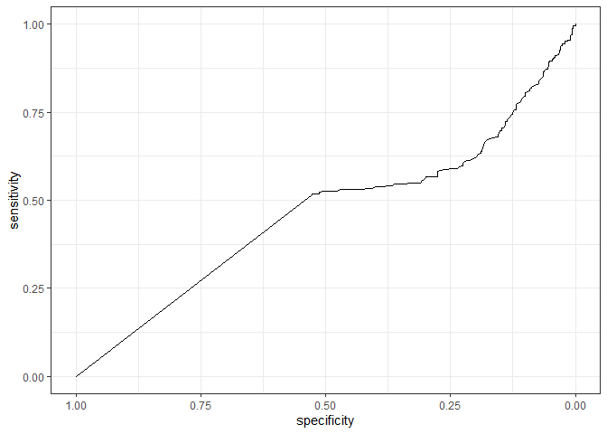

#Загрузка данных

```r
data <- read.csv("diabetes.csv")
data %>% glimpse()
```

```
## Rows: 768
## Columns: 9
## $ Pregnancies              <int> 6, 1, 8, 1, 0, 5, 3, 10, 2, 8, 4, 10, 10, 1, …
## $ Glucose                  <int> 148, 85, 183, 89, 137, 116, 78, 115, 197, 125…
## $ BloodPressure            <int> 72, 66, 64, 66, 40, 74, 50, 0, 70, 96, 92, 74…
## $ SkinThickness            <int> 35, 29, 0, 23, 35, 0, 32, 0, 45, 0, 0, 0, 0, …
## $ Insulin                  <int> 0, 0, 0, 94, 168, 0, 88, 0, 543, 0, 0, 0, 0, …
## $ BMI                      <dbl> 33.6, 26.6, 23.3, 28.1, 43.1, 25.6, 31.0, 35.…
## $ DiabetesPedigreeFunction <dbl> 0.627, 0.351, 0.672, 0.167, 2.288, 0.201, 0.2…
## $ Age                      <int> 50, 31, 32, 21, 33, 30, 26, 29, 53, 54, 30, 3…
## $ Outcome                  <int> 1, 0, 1, 0, 1, 0, 1, 0, 1, 1, 0, 1, 0, 1, 1, …
```
Описание датасета pima (diabetes.csv):
• Pregnancies – количество беременностей в анамнезе (кол-во);
• Glucose – уровень глюкозы на 120 минуте орального глюкозотолерантного теста (мг/дл);
• BloodPressure – диастолическое артериальное давление (мм рт.ст.);
• SkinThickness – толщина кожной складки на трицепсе (мм),
• Insulin – уровень инсулина (мЕ/мл);
• BMI – индекс массы тела (кг/м2);
• DiabetesPedigreeFunction – индекс, отражающий вероятность наличия диабета на основании наследственного анамнеза;
• Age – возраст (лет);
• Outcome – наличие сахарного диабета (0 – нет, 1 – да);

Подправим тип Outcome на факторный.


Заменим нули в столбцах на NA: Glucose, BloodPressure, SkinThickness, Insulin, BMI.


#1
У какого количества пациентов из датасета присутствует нарушенная толерантность к глюкозе (НТГ)? Критерий НТГ – это уровень повышение гликемии ≥ 7.8 ммоль/л на 120 минуте теста на толерантность к глюкозе. Сколько в датасете пациентов, у которых нет НТГ?
*Для уровня глюкозы 1 ммоль / л = 18 мг/дл (в нашем датасете глюкоза в мг/дл)


```r
#Добавлен ответ на вопрос у скольких пациентов есть НТГ
Treshold <- 7.8*18 #из ммоль/л в мг/дл
as.numeric(nrow(data[data$Glucose <= Treshold, ]))#НТГ есть
```

```
## [1] 576
```

```r
as.numeric(nrow(data[data$Glucose > Treshold, ]))#НТГ нет
```

```
## [1] 192
```
*У 576 есть и у 197 пациентов нет НТГ.*

#2
Как выглядит ROC-кривая для предсказания сахарного диабета по переменной, характеризующей уровень гликемии?


```r
roc(Outcome ~ Glucose, data = data) %>%
  ggroc() +
  theme_bw()
```

<!-- -->

#3
Чему равна площадь под ROC-кривой из вопроса 2?

```r
roc_curve_G <- roc(Outcome ~ Glucose, data = data)

roc_curve_G
```

```
## 
## Call:
## roc.formula(formula = Outcome ~ Glucose, data = data)
## 
## Data: Glucose in 500 controls (Outcome 0) < 268 cases (Outcome 1).
## Area under the curve: 0.7881
```
*Площадь под ROC-кривой равна 0.7928.*

#4
Чему равен 95% двусторонний ДИ для площади под ROC-кривой из вопроса 2?


```r
roc_curve_G <- roc(Outcome ~ Glucose, data = data, ci = T)

roc_curve_G
```

```
## 
## Call:
## roc.formula(formula = Outcome ~ Glucose, data = data, ci = T)
## 
## Data: Glucose in 500 controls (Outcome 0) < 268 cases (Outcome 1).
## Area under the curve: 0.7881
## 95% CI: 0.7546-0.8217 (DeLong)
```
*95% двусторонний ДИ для площади под ROC-кривой из вопроса 2 равен [0.7599;0.8257].*

#5
Постройте ROC-кривую и определите, какое пороговое значение является оптимальным для предсказания сахарного диабета по уровню инсулина? Какой чувствительностью и специфичностью обладает данный порог?

```r
roc_curve_I <- roc(Outcome ~ Insulin, data = data, ci = T)

roc_curve_I
```

```
## 
## Call:
## roc.formula(formula = Outcome ~ Insulin, data = data, ci = T)
## 
## Data: Insulin in 500 controls (Outcome 0) > 268 cases (Outcome 1).
## Area under the curve: 0.4621
## 95% CI: 0.4191-0.5051 (DeLong)
```

```r
ggroc(roc_curve_I) + 
    theme_bw()
```

<!-- -->

```r
roc_curve_I %>% coords(x = "best", best.method = "closest.topleft")
```

```
##   threshold specificity sensitivity
## 1      14.5       0.528   0.5186567
```
*Пороговое значение является 121 (специфичность = 0.62; чувствительность = 0.78).* 
У контролей значение ниже, т.е. повышение инсулина плохо для пациента.

#6
Какая из количественных переменных в датасете обладает наибольшей площадью под ROC-кривой? Как вы можете интерпретировать это знание? Какая количественная переменная имеет наименьшую площадь?


```r
res<-data %>%
  pivot_longer(cols = !Outcome) %>%
  group_by(name) %>%
  summarise(AUC = roc(Outcome, value, ci = T)$ci[2] %>% round(3),
              AUC_LCL = roc(Outcome, value, ci = T)$ci[1] %>% round(3),
              AUC_UCL = roc(Outcome, value, ci = T)$ci[3] %>% round(3))
print(res[order(-res$AUC),])
```

```
## # A tibble: 8 × 4
##   name                       AUC AUC_LCL AUC_UCL
##   <chr>                    <dbl>   <dbl>   <dbl>
## 1 Glucose                  0.788   0.755   0.822
## 2 BMI                      0.688   0.65    0.725
## 3 Age                      0.687   0.649   0.725
## 4 Pregnancies              0.62    0.576   0.663
## 5 DiabetesPedigreeFunction 0.606   0.564   0.648
## 6 BloodPressure            0.586   0.544   0.629
## 7 SkinThickness            0.554   0.509   0.598
## 8 Insulin                  0.462   0.419   0.505
```
*Наибольшей площадью под ROC-кривой обладает уровень гликемии. Поскольку при заболевании сахарным диабетом нарушается усваивание глюкозы, т.е. заболевание и показатель напрямую связаны, то он является успешным диагностическим методом данного заболевания.*
*Следующим идёт инсулин. Известно, что при сахарном диабете нарушена выработка инсулина или орагнизма чувствительность к нему. Поэтому этот показатель тоже полезен в диагностике заболевания.*

*Наименьшей площадью под ROC-кривой обладают DiabetesPedigreeFunction (индекс, отражающий вероятность наличия диабета на основании наследственного анамнеза) и кровяное давление. Кровяное давление может изменяться не только по причине заболевания сахарным диабетом, и не обязательно изменяться при данном недуге. Что касается DiabetesPedigreeFunction, то он отражает риск развития заболевания, но не всегда человек с высоким риском заболеет. Может быть и такое, что человек знает, что у него есть риск заболеть и он старается предотвратить это (здоровое питание и т.п.) и болезнь не развивается, так что в рамках диагностики этот показатель может быть не сильно полезен.*
