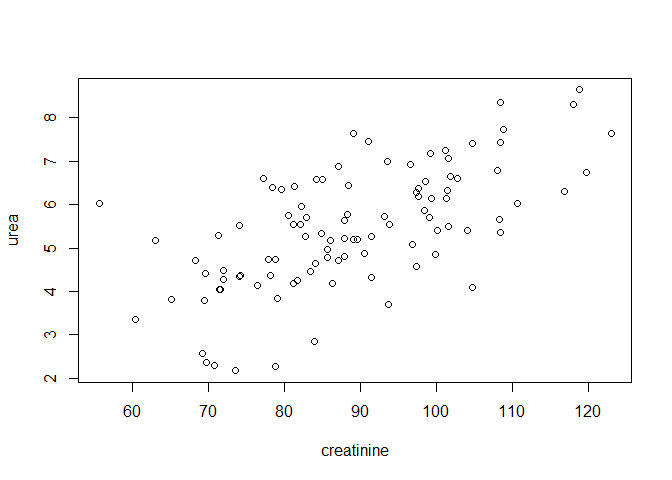
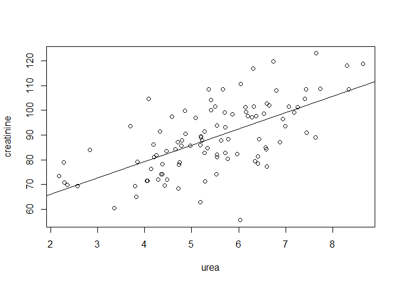
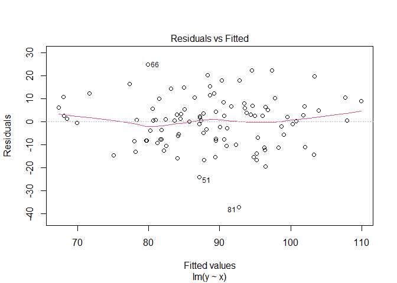
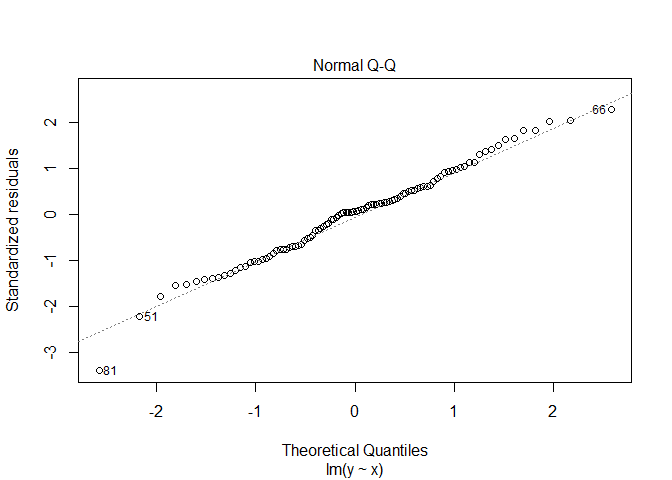
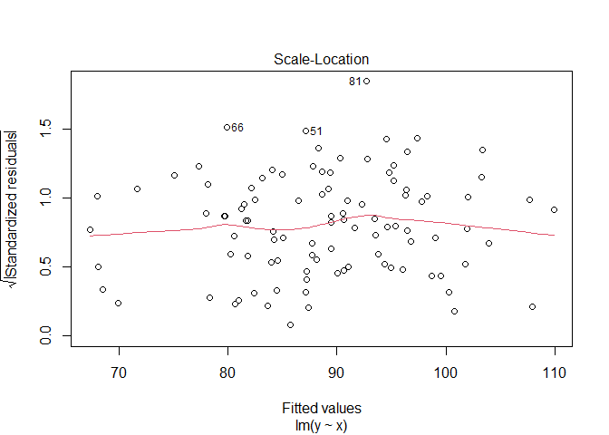
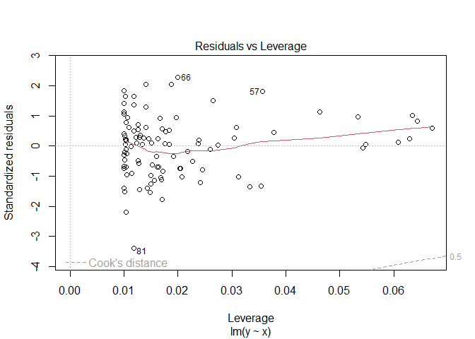
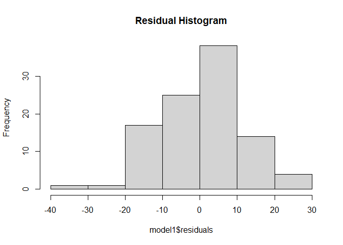
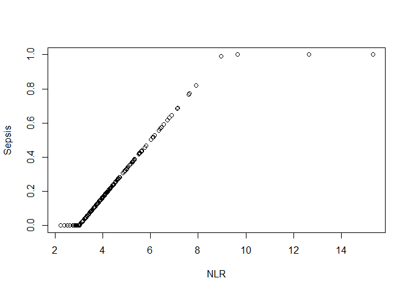
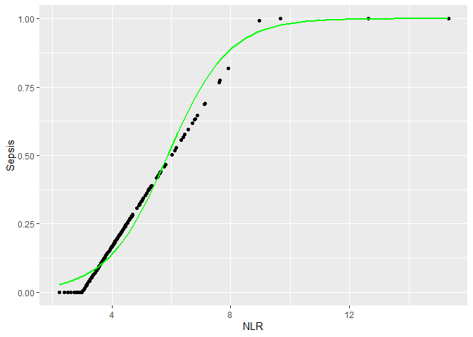

#Задача 1


**Моделируем выборку креатинина и мочевины.**


```r
#Дано
mu_k <- 88.5
sigma_k <- 13.25
mu_m <- 5.4
sigma_m <- 1.45
ro <- 0.6
#Промежуточные расчёты
cov_kk <- sigma_k**2
cov_mm <- sigma_m**2
cov_km <- ro * sigma_k*sigma_m
#Формируем выборку
set.seed(5)
n=100
km <- rmvnorm(n, mean = c(mu_k, mu_m), sigma = matrix(c(cov_kk,cov_km,cov_km,cov_mm), nrow = 2, ncol = 2))
KM <- as.data.frame(km)
colnames(KM) <- c("creatinine", "urea")
plot(KM)
```

<!-- -->


##a


**Модель линейной регрессии креатинина на мочевину.**


```r
x <- KM$urea
y <- KM$creatinine 
model1 <- lm(y~x)
summary(model1)
```

```
## 
## Call:
## lm(formula = y ~ x)
## 
## Residuals:
##     Min      1Q  Median      3Q     Max 
## -37.057  -7.836   0.776   6.364  24.872 
## 
## Coefficients:
##             Estimate Std. Error t value Pr(>|t|)    
## (Intercept)  53.0011     4.5069  11.760  < 2e-16 ***
## x             6.5854     0.8024   8.207 9.14e-13 ***
## ---
## Signif. codes:  0 '***' 0.001 '**' 0.01 '*' 0.05 '.' 0.1 ' ' 1
## 
## Residual standard error: 11 on 98 degrees of freedom
## Multiple R-squared:  0.4074,	Adjusted R-squared:  0.4013 
## F-statistic: 67.36 on 1 and 98 DF,  p-value: 9.143e-13
```


Получили модель: $creatinine = 6.5854*urea+53.0011$


Из теории: 

$a = \sqrt{(DY/DX)}*cor(X,Y)$


```r
model1$coefficients[2]#оценка а
```

```
##        x 
## 6.585361
```

```r
(var(y)/var(x))**0.5*cor(x,y)#дисперсия * корреляция
```

```
## [1] 6.585361
```


$b=\tilde{Y}-a\tilde{X}$


```r
model1$coefficients[1]#оценка b
```

```
## (Intercept) 
##    53.00109
```

```r
mean(y)-6.5854*mean(x)#выборочное среднее
```

```
## [1] 53.00088
```


*Значения близки.*


Посмотрим на модель.


```r
x <- KM$urea
y <- KM$creatinine 


plot(creatinine~urea, KM)
abline(model1)
```

<!-- -->


##b


**Проверка гипотезы о нормальном распределении остатков модели.**


Оценим визуально.


```r
plot(model1)
```

<!-- --><!-- --><!-- --><!-- -->

```r
hist(model1$residuals, main = "Residual Histogram")
```

<!-- -->
 
 
На первом графике (Residuals vs Fitted): красная линия тренда близка к нулю, но по краям отклоняется.


На втором графике (Normal Q-Q): большинство точек расположены на диагональной линии. Хотя на краях отклоняются. Следовательно, этот график QQ не является окончательным в отношении нормальности остатков.


На гистограмме видно похожее на нормальное распределение, но всё же перекошено.


Тест Шапиро-Уилка


```r
shapiro.test(model1$residuals)
```

```
## 
## 	Shapiro-Wilk normality test
## 
## data:  model1$residuals
## W = 0.9873, p-value = 0.4578
```

*p-value>0.05 (p-value = 0.4578) значит не отвергаем нулевую гипотезу о нормальном распределении остатков.*


##c


**Коэффициент детерминации при добавлении регрессора.**


```r
set.seed(98)
W <- rbinom(n, 6, 0.2)
model11 <- lm(y~x+W)
summary(model11)
```

```
## 
## Call:
## lm(formula = y ~ x + W)
## 
## Residuals:
##     Min      1Q  Median      3Q     Max 
## -37.006  -8.051   1.142   6.180  24.970 
## 
## Coefficients:
##             Estimate Std. Error t value Pr(>|t|)    
## (Intercept)  52.0827     4.8141  10.819  < 2e-16 ***
## x             6.6090     0.8063   8.196 1.02e-12 ***
## W             0.7243     1.3006   0.557    0.579    
## ---
## Signif. codes:  0 '***' 0.001 '**' 0.01 '*' 0.05 '.' 0.1 ' ' 1
## 
## Residual standard error: 11.04 on 97 degrees of freedom
## Multiple R-squared:  0.4092,	Adjusted R-squared:  0.3971 
## F-statistic:  33.6 on 2 and 97 DF,  p-value: 8.191e-12
```


Сравним коэффициенты детерминации.


```r
R2 <- as.data.frame(matrix(c(0.4074, 0.4013, 0.4092, 0.3971 ),ncol=2), row.names = c("Multiple R-squared","Adjusted R-squared"))
colnames(R2) <- c("Without W", "With W")
R2
```

```
##                    Without W With W
## Multiple R-squared    0.4074 0.4092
## Adjusted R-squared    0.4013 0.3971
```


Коэффициент детерминации стал больше (как обсуждали на лекции). Модифицированный коэффициент детерминации уменьшился.  


#Задание 2


**lasso-оценка для 6 признаков.**


Моделируем выборку с 6 признаками.


```r
n <- 50
set.seed(2)
x1 <- rnorm(n, mean =1)
x2 <- x1*(1+runif(n, min =0, max = 0.1))
x3 <- x1+x2 + rnorm(n, sd = 0.1)
x4 <- -x3*(1+runif(n, min =0, max = 0.05))+x2*5
x5 <- 15*x1+45*x2+runif(n, max = 0.3)
y <- 2*x1+4*x2+3*x3+7*x4+x5+rnorm(n, sd =1)

model2 <- lm(y~x1+x2+x3+x4+x5)

summary(model2)
```

```
## 
## Call:
## lm(formula = y ~ x1 + x2 + x3 + x4 + x5)
## 
## Residuals:
##      Min       1Q   Median       3Q      Max 
## -1.66565 -0.84740 -0.03516  0.54892  2.77565 
## 
## Coefficients:
##             Estimate Std. Error t value Pr(>|t|)
## (Intercept)   0.2257     0.2935   0.769    0.446
## x1           15.0455    24.7558   0.608    0.546
## x2           56.9150    77.4865   0.735    0.467
## x3           -0.5198     3.2351  -0.161    0.873
## x4            3.7990     2.9929   1.269    0.211
## x5            0.1739     1.6370   0.106    0.916
## 
## Residual standard error: 1.028 on 44 degrees of freedom
## Multiple R-squared:  0.9999,	Adjusted R-squared:  0.9999 
## F-statistic: 1.123e+05 on 5 and 44 DF,  p-value: < 2.2e-16
```


Каждый из коэффициентов регрессии в отдельности не значимо отличается от 0 (p-value>0.05), но все параметры в совокупности значимо. 


lasso-оценка


```r
X <- matrix(c(x1,x2,x3,x4,x5), ncol=5)
la.model <- glmnet(X, y, family = "gaussian", intercept = F, alpha = 1, lambda=0.2)
la.model$beta
```

```
## 5 x 1 sparse Matrix of class "dgCMatrix"
##           s0
## V1 42.079229
## V2 37.742881
## V3  .       
## V4  4.763769
## V5  .
```


*При лассо-регуляризации с параметром r = 0.2 оценки коэффициентов изменились следующим образом: первый увеличился, второй уменьшился, третий обнулился, четвёртый увеличился, пятый обнулился.*


#Задание 3 


**Логистическая регрессия**


```r
set.seed(7)
n=201
Neu <- rnorm(n, mean = 80, sd=5)
Ly <- rnorm(n, mean=20, sd=5)
NLR <- sapply(1:n, function(i) (Neu[i]/Ly[i]))
Sepsis <- sapply(1:n, function(i) if_else(NLR[i]<3, 0, if_else(NLR[i]>9, 1, (NLR[i]-3)/6)))
plot(NLR, Sepsis)
```

<!-- -->

```r
df <- data.frame(Neu=Neu, Ly = Ly, NLR=NLR, Sepsis=Sepsis)
```


```r
model3 <- glm(Sepsis~Ly+Neu, family="binomial")
summary(model3)
```

```
## 
## Call:
## glm(formula = Sepsis ~ Ly + Neu, family = "binomial")
## 
## Deviance Residuals: 
##      Min        1Q    Median        3Q       Max  
## -0.24470  -0.06680   0.00882   0.05402   0.61793  
## 
## Coefficients:
##             Estimate Std. Error z value Pr(>|z|)    
## (Intercept) -0.69961    3.36750  -0.208    0.835    
## Ly          -0.29025    0.05085  -5.708 1.15e-08 ***
## Neu          0.05931    0.04270   1.389    0.165    
## ---
## Signif. codes:  0 '***' 0.001 '**' 0.01 '*' 0.05 '.' 0.1 ' ' 1
## 
## (Dispersion parameter for binomial family taken to be 1)
## 
##     Null deviance: 52.5219  on 200  degrees of freedom
## Residual deviance:  2.4108  on 198  degrees of freedom
## AIC: 100.72
## 
## Number of Fisher Scoring iterations: 6
```

```r
ggplot(df, aes(x=NLR,y=Sepsis)) +
  geom_point() +
  stat_smooth(method = "glm", color="green", se=FALSE, method.args = list(family=binomial))
```

<!-- -->


```r
new <- data.frame(Neu=90, Ly = 15)
predict(model3, new, type = "response")
```

```
##         1 
## 0.5706132
```


Вероятность развития сепсиса при Neu=90 и Ly=15 равна 0,57.


Если считать по формуле из задания:

```r
(90/15-3)/6
```

```
## [1] 0.5
```

*Значения близки.*
